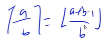
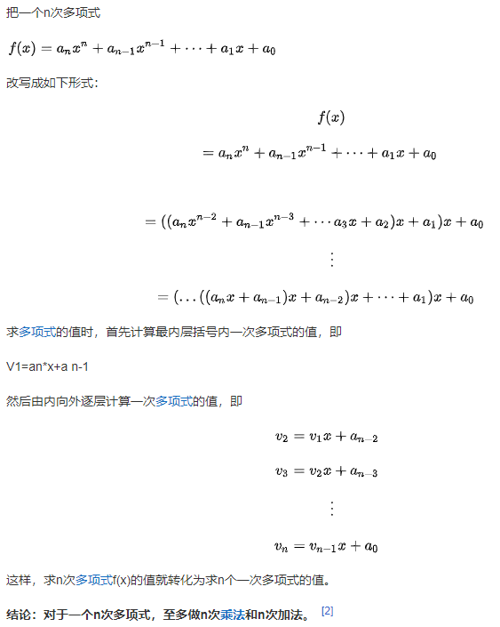
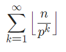

## 数学

#### 1. 上下取整相互转换



https://www.acwing.com/video/3302/

## 算法

### 进制转换


#### X进制转为10进制

##### 秦九韶算法




```c++
int res = 0;
for (auto x: s)
{
    res = res * b + x - '0';
}
```


### 蔡勒公式

随便给一个日期，就能用这个公式推算出星期几。

- c 是世纪数减一，也就是年份的前两位。
- y 是年份的后两位。
- m 是月份。m 的取值范围是 3 至 14，因为某年的 1、2 月要看作上一年的 13、14月，比如 2019 年的 1 月 1 日要看作 2018 年的 13 月 1 日来计算。
- d 是日数。
- W = D%7 是结果代表一周中第几天, 0 为周日
- 由于最后计算 D 可能为负数，需要处理一下。方法很多：这里由 D 计算式发现减的内容最大为 199 所以可以加上一个大于 199 且是 7 的倍数的数，我随便取一个 210 加上保证结果为正。

```cpp
class Solution {
public:
    string dayOfTheWeek(int d, int m, int y) {
        vector<string> weeks = {"Sunday", "Monday", "Tuesday", "Wednesday", "Thursday", "Friday", "Saturday"};
        if(m < 3) m += 12, y -=1;
        int c = y/100;
        y %= 100;
        
        
        int D = c/4 - 2*c + y + y/4 + 13*(m+1)/5 + d - 1 + 210;//加上30*7防止出现负数
        return weeks[D%7];
        
        // 另一种处理负数的方法
        // int w = c / 4 - 2*c + y + y / 4 + (26 * (month + 1) / 10) + day - 1;
        // w = (w % 7 + 7) % 7;
        // return s[w];
        
    }
};


```


### n个元素找最大值的优化问题

三种方法：

- ST表`O(nlogn)`
- 线段树`O(nlogn)`
- 单调栈


### [1, n]中质因子p的个数

[1, n]中p的倍数有$n_1=\Big\lfloor\dfrac{n}{p}\Big\rfloor$ 个, 这些数至少贡献出了n1个质因子。*p*2 的倍数有 $n_2=\Big\lfloor\dfrac{n}{p^2}\Big\rfloor$ 个, 由于这些数已经是 p*p* 的倍数了，为了不重复统计 p*p* 的个数，我们仅考虑额外贡献的质因子个数，即这些数额外贡献了至少 $n_2$ 个质因子 p。

依此类推，[1,n][1,*n*] 中质因子 p*p* 的个数为:

- 实际上就是计算1-n之中有多少个5的因数。以130为例：

1. 第一次除以5时得到26，表明存在26个包含 [一] 个因数5的数；
   - `5, 10, 15, 20, 25, ..,  130`
2. 第二次除以5得到5，表明存在5个包含 [二] 个因数5的数(这些数字的一个因数5已经在第一次运算的时候统计了)；
   - `25, 50, 75, 100 ... `
3. 第三次除以5得到1，表明存在1个包含 [三] 个因数5的数(这些数字的两个因数5已经在前两次运算的时候统计了)；
   - `125`
4. 得到从1-n中所有5的因数的个数


### 【海伦－秦九韶公式】三角形面积

已知三角形三边的长度，求三角形的面积。

> 设三角形ABC三个角A、B、C的对边分别为**a、b、c**，三角形ABC的面积为S.

$S=sqrt(p*(p-a)*(p-b)*(p-c))$

其中p等于三角形周长的一半。即p=(1/2)x(a+b+c)。


### 二叉树序列化


> Leetcode 652
>
> https://leetcode.cn/problems/find-duplicate-subtrees
>
>  答：前序遍历和后序遍历都能确定根节点位置，但是中序不行，然后就是空结点null用#号表示以后就能唯一地用前序或者后序确定一棵树


### DP本来就是有拓扑序的。


# C++语法


### 如果数组作为函数的形参，那么sizeof运算符无法正确获取数组的长度。

```cpp
void dijkstra(int s, int dist[])
{
    // 1. 错误示范
    memset(dist, 0x3f, sizeof dist);
    // 2. 正确的方式
    memset(dist, 0x3f, sizeof(int) * N);
}
```


测试代码：

```cpp
#include<cstdio>
#include<cstring>

using namespace std;

const int N = 1000;

int a[N];

void dd(int tt[])
{
    memset(tt, -1, sizeof tt);
}

int main()
{
    memset(a, 0, sizeof a);
    dd(a);
    
    for (int i = 0; i < 500; i ++)
    {
        if (a[i])
            printf("%d %d\n", i, a[i]);
    }
    
    return 0;
}
```


# 输入输出

### 什么时候用scanf

当输入规模大于`10^5`的时候尽量用`scanf`，`cin`会比较慢。

### 读取字符时，尽量用读取字符串的方式读取

```c++
// "T 12"
scanf("%c%d", ...);
scanf("%s%d", ...);  //建议用这个
```


# STL

### 第K大的元素：nth_element()

> `\#include <algorithm>`
>
> 该函数会找到第 w 大的元素 K 并将其移动到第 w 的位置处，同时所有位于 K 之前的元素都比 K 大，所有位于 K 之后的元素都比 K 小。


```c++
//排序规则采用默认的升序排序
void nth_element (RandomAccessIterator first,
                  RandomAccessIterator nth,
                  RandomAccessIterator last);
//排序规则为自定义的 comp 排序规则
void nth_element (RandomAccessIterator first,
                  RandomAccessIterator nth,
                  RandomAccessIterator last,
                  Compare comp);


nth_element(a, a + w, a + n);
nth_element(a, a + w, a + n, cmp);
```


### `Stack<int>`清空栈

暂时没有相应的STL，目前有两种方法：

1. `stack<int> s; while(!s.empty()) s.pop(); `
   - // stack操作的是堆内存，所以要一个一个弹出。 
2. `stack<int> s; stack<int>().swap(s);`
   - // swap相当于交换了s和一个空临时stack的内容，然后临时stack再结束生命周期，但由于操作的是堆空间，其实还是一个一个释放空间。

> https://blog.csdn.net/ShellDawn/article/details/80014842

### Vector二维数组初始化

1. 直接用初始化方法（刚开始没想到）

   ```cpp
   vector<vector<int> > newOne(r, vector<int>(c, 0));
   ```

   

2. 用resize()来控制大小

   ```cpp
   vector<vector<int> > res;
   res.resize(r);//r行
   for (int k = 0; k < r; ++k){
       res[k].resize(c);//每行为c列
   }
   ```

   
