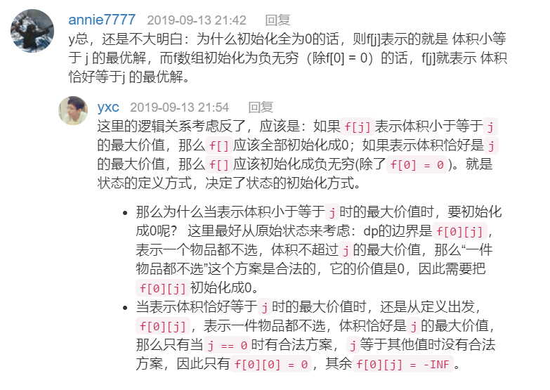
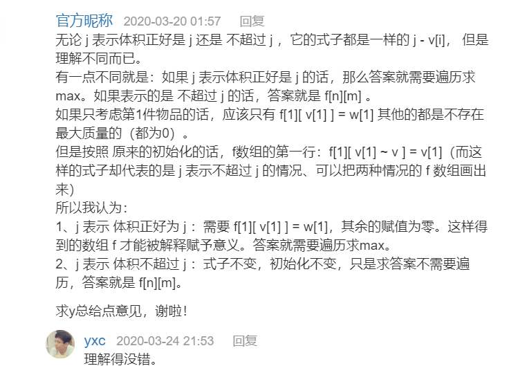
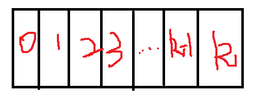
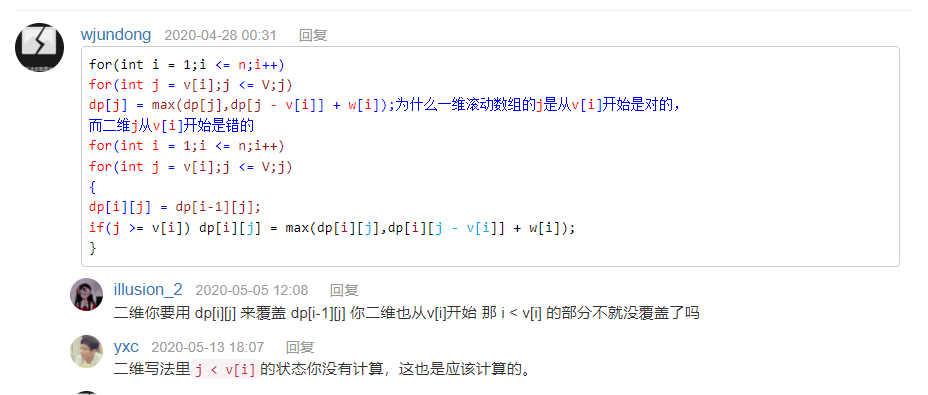
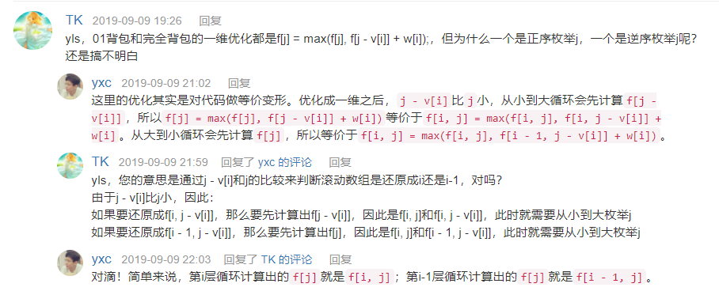
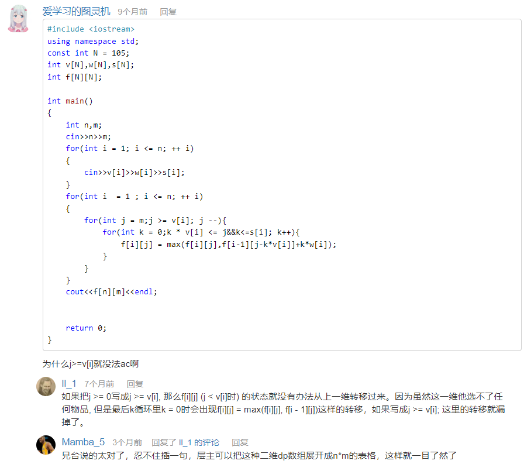
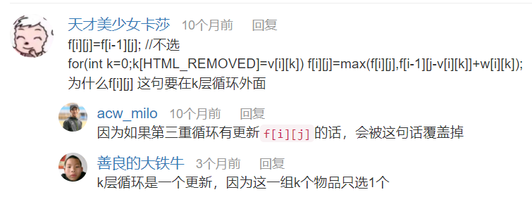
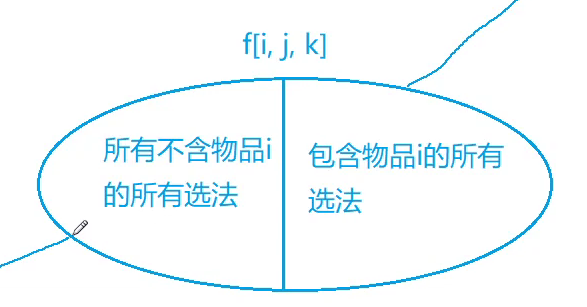

# 背包系列

- 状态表示f(i,j)
  - 集合
    - 所有
    - 满足条件
  - 属性
    - 最大值
    - 最小值
    - 数量
    - ...
- 状态计算

------


## 一、01背包

> 

**特点：**每件物品最多只能用一次(也可以不用)

**状态计算：**

- **状态表示f(i,j)**

  - **集合：**所有只考虑前i个物品，且总体积不大于j的所有选法
  - **属性：**最大值

- **状态计算**

  - **集合划分：**将集合划分为**选i**和**不选i**

  - `f[i][j] = max(f[i-1][j]， f[i][j] = f[i-1][j-v[i]] + w[i])`

可以理解为从初始状态`f[0][0] = 0`开始决策

### 1.1 朴素写法(二维)

```c++
/**
* f[i][j]表示只看前i个物品，总体积是j的情况下，最大价值是多少。
* 需要返回的答案就是：max(f[n][0~v])
* f[i][j]递推：
* 	1. 不选第i个物品，f[i][j] = f[i-1][j]
* 	2. 选第i个物品，f[i][j] = f[i-1][j-v[i]] + w[i]; // 此处曲线救国
* 	f[0][0] = 0 //在一个物品也不选的情况下，最大价值为0
**/
#include<cstdio>
#include<algorithm>

using namespace std;

const int N = 1000 + 10;

int f[N][N];
int w[N], v[N]; //默认初始化为0
int n, t;

int main() {
    scanf("%d%d", &n, &t);
    for (int i = 1; i <= n; i++) scanf("%d%d", &v[i], &w[i]);
    // 默认初始化为0，所以不需要从0开始
    for (int i = 1; i <= n; i ++) {
        for (int j = 0; j <= t; j ++) {
            f[i][j] = f[i - 1][j];
            // 若当前背包容量不够时，前i个物品的最大价值就是前i-1个物品的最大价值(即下边if中语句为false)
            // 反之，当前背包容量足够，则取选与不选第i个物品的最大价值(即if语句为true)
            if (j >= v[i]) f[i][j] = max(f[i][j], f[i-1][j-v[i]] + w[i]);
        }
    }
    
    printf("%d\n", f[n][t]);
    return 0;
}
```


### 1.2 优化后(一维 + 滚动数组)

```c++
/**
	我们定义的状态f[i][j]可以求得任意合法的i与j最优解，但题目只需要求得最终状态f[n][m]，因此可以只用一维的空间来更新状态。就好比求斐波那契数列(f[n] = f[n-1] + f[n-2])的o(1)空间写法，用a、b、c三个变量来滚动计算。
	而在二维朴素写法中，可以发现求f[i][j]的时候只用到了f[i-1][j]、f[i-1][j-v[i]]，利用滚动数组的原理，将二维空间将为一维空间。
	状态f[j]表示：在当前k件物品下，背包容量为j的最大价值。Ps:由于前边舍弃了二维数组的第一维度的信息(第i件物品的信息)，所以循环结束后的状态f[j]数组相当于朴素写法中的f[n][j]。
	此处循环为什么要逆序？
	答：循环体中的f[j] = max(f[j], f[j-v[i]] + w[i]); 对应f[i][j] = max(f[i-1][j], f[i-1][j-v[i]] + w[i])语句。假设当前i = 2, j从1到5，则先求出i=2时的f[1]、然后利用i=2时的f[1]求出了f[2]，但事实上我们求f[2]时需要用i=1时的f[1]。也就是说，正序更新f[j]用到的第i-1轮的状态被第i论污染了。
**/

#include<cstdio>
#include<algorithm>

using namespace std;

const int N = 1000 + 10;

int f[N], w[N], v[N]; //默认初始化为0
int n, t;

int main() {
    scanf("%d%d", &n, &t);
    for (int i = 1; i <= n; i++) scanf("%d%d", &v[i], &w[i]);

    for (int i = 1; i <= n; i ++) {
        for (int j = t; j >= v[i]; j --) {
            f[j] = max(f[j], f[j-v[i]] + w[i]);
        }
    }
    /**
         * 注意：利用滚动数组优化之后，内层循环需要变为逆序，
         * 只是由于：f[i][j]在状态转移的时候，需要用到f[i-1][..]。
         * 而内层循环正序遍历时，一维状态转移dp[j]表示的(有时候)就不是f[i - 1][..]，而是f[i][..]
         * 即f[j]被前一次forj循环污染
         **/

    printf("%d\n", f[t]);
    return 0;
}
```


### 1.3 其他问题：

#### 1.3.1 关于f\[i][j]体积正好是j还是不超过j的问题






## 二、完全背包

**特点：**每件物品可以用无限次(有无限个)

- **状态表示f(i,j)**

  - **集合：**所有只考虑前i个物品，且总体积不大于j的所有选法
  - **属性：**最大值

- **状态计算**

  - **集合划分：**按照第i个物品选0、1、2、.....k个来划分。

  

  - `f[i][j] = max(f[i - 1][j - k * v[i]] + w[i]*k)`

### 2.1 朴素写法

```c++
#include<cstdio>
#include<algorithm>

using namespace std;

const int N = 1000 + 10;

int f[N][N];
int w[N], v[N];
int n,t;

int main() {
    scanf("%d%d", &n, &t);
    for (int i = 1; i <= n; i++) scanf("%d%d", &v[i], &w[i]);

    for (int i = 1; i <= n; i ++) {
        for (int j = 0; j <= t; j ++) {
            for (int k = 0; k * v[i] <= j; k ++) {
                f[i][j] = max(f[i][j], f[i-1][j - k*v[i]] + k*w[i]);
            }
        }
    }
    
    printf("%d\n", f[n][t]);
    return 0;
}
```


### 2.2 优化(二层循环)

由上边知`f[i][j] = max(f[i - 1][j - k * v[i]] + w[i]*k)`，**即f\[i][j]为在体积小于等于j的情况下，选k个第i类商品所能达到的最大价值。**

$$ f[i][j] = Max(f[i-1][j], f[i-1][j-v] + w,  f[i-1][j-2v] + 2w, f[i-1][j-3v] + 3w ... f[i-1][j-kv] + kw)$$

$$f[i][j-v] = Max(f[i-1][j-v], f[i-1][j-2v] + w, f[i-1][j-3v] + 2w, f[i-1][j-4v] + 3w)...f[i-1][j-kv] + (k-1)w)$$

通过上边两个等式可推出：	

$$f[i][j] = Max(f[i-1][j], f[i][j-v] + w)$$

此时，可得f\[i][j]的状态与k的取值无关，所以可以去掉k这一层for循环。

```c++
#include<cstdio>
#include<algorithm>

using namespace std;

const int N = 1000 + 5;

int f[N][N];
int v[N], w[N];
int n, t;

int main () {
    scanf("%d%d", &n, &t);
    for (int i = 1; i <= n; i ++) scanf("%d%d", &v[i], &w[i]);
    
    for (int i = 1; i <= n; i ++) {
        for (int j = 0; j <= t; j ++) {
            f[i][j] = f[i - 1][j];
            if (j >= v[i]) f[i][j] = max(f[i][j], f[i][j - v[i]] + w[i]);
        }
    }
    
    printf("%d\n", f[n][t]); 
    return 0;
}
```

### 2.3 优化(二层循环 + 一维状态)

由2.3优化后程序只剩两层循环，而f\[i][j]的值由f\[i-1][.....]推出，所以我们可以利用滚动数组的思想，遵循等价代换的原则将二维变成一维。

```c++
#include<cstdio>
#include<algorithm>

using namespace std;

const int N = 1000 + 10;

int f[N];
int v[N], w[N];
int n, t;

int main () {
    scanf("%d%d", &n, &t);
    for (int i = 1; i <= n; i ++) scanf("%d%d", &v[i], &w[i]);
    
    for (int i = 1; i <= n; i ++) {
        for (int j = v[i]; j <= t; j++) {
            f[j] = max(f[j], f[j - v[i]] + w[i]);
        }
    }
    
    printf("%d\n", f[t]);
    return 0;
}
```


优化过后可发现**01背包**和**完全背包**优化后的代码区别在于——**第二层循环(遍历体积)j的次序不同**

- **01背包：**第i层的状态需要由第i-1层求出，为了避免第i-1层数据被污染，j采取**逆序**。
- **完全背包：**第i层的状态需要由第i层求出，所以j采取**正序**。

**Ps：**==当空间优化成1维后，只有完全背包问题的体积是从小到大循环的。==

### 1.3 其他问题：

#### 1.3.1 优化后二层循环逆序的问题






## 三、多重背包

**特点：**每个物品的个数有限制，既不是只有1件、也不是只有无穷件。

- **状态表示f(i,j)**

  - **集合：**所有只考虑前i个物品，且总体积不大于j的所有选法
  - **属性：**最大值

- **状态计算**

  - **集合划分：**按照第i个物品选0、1、2、.....k个来划分。

  

  - `f[i][j] = max(f[i - 1][j - k * v[i]] + w[i]*k)` 


### 3.1 朴素写法

 ```c++
 #include<cstdio>
 #include<algorithm>
 
 using namespace std;
 
 const int N = 100 + 10;
 
 int f[N][N];
 int v[N], w[N], s[N];
 
 int n, t;
 
 int main () {
     scanf("%d%d", &n, &t);
     for (int i = 1; i <= n; i ++) scanf("%d%d%d", &v[i], &w[i], &s[i]);
     
     for (int i = 1; i <= n; i++) {
         for (int j = 0; j <= t; j++) {
             for (int k = 0; k * v[i] <= j && k <= s[i]; k++) {
                 f[i][j] = max(f[i][j], f[i - 1][j - k*v[i]] + k * w[i]);
             }
         }
     }
     printf("%d\n", f[n][t]);
     return 0;
 }
 ```

### 3.2 优化(一维状态)

```c++
#include<cstdio>
#include<algorithm>

using namespace std;

const int N = 100 + 10;

int f[N], w[N], v[N], s[N];
int n, t;

int main()
{
    scanf("%d%d", &n, &t);
    for (int i = 1; i <= n; i ++) scanf("%d%d%d", &v[i], &w[i], &s[i]);
    
    for (int i = 1; i <= n; i ++)
        for (int j = t; j >= 0; j --)
            for (int k = 0; k <= s[i] && j >= k * v[i]; k ++)
                f[j] = max(f[j], f[j - k*v[i]] + k * w[i]);
    
    printf("%d\n", f[t]);
    
    return 0;
}
```


### 3.3 优化(二进制-->01背包)

时间复杂度：`O(nvlogs)`

任何一个正整数都可以用二进制来表示，即可以用 $$2^{0} - 2^{n}$$其中一项或者多项的和来表示。

```c++
1111b //十进制为15 = 8(2^3) + 4(2^2) + 2(2^1) + 1(2^0)
xxxxb //x为0或1，任意的01组合构成的4位不全为0的二进制，该二进制得到的十进制一定小于等于15，且一定可以由{8、4、2、1}的任意元素相加而得。
    
// 这样的话，我们可以物品i按照二进制的形式分为多个物品。
// 例如物品i有15件，那么可以拆分为
// 物品a(等价于8件物品i)、物品b(等价于4件物品i)、物品c(等价于2件物品i)、物品d(等价于1件物品i)
// 这样的话，按照01背包的规则，每一件物品选或者不选，一定可以用物品a、物品b、物品c、物品d来表示0~15件物品i

// 那么我们用上边的方法对每一个商品都进行拆分，拆分后的几件商品的和等价于原商品i，那么就转化为了01背包问题。
// 实际上就是用空间换时间。
```

```c++
#include<cstdio>
#include<algorithm>

using namespace std;
// 注意此处数组的大小：
// 确定的思路：n*log(s) 即12 * 1000
const int N = 11000 + 100;
int f[N], v[N], w[N];

int n, t;

int main () {
    scanf("%d%d", &n, &t);
    
    int cnt = 1;
    for (int i = 1; i <= n; i ++) {
        int a, b, s;
        scanf("%d%d%d", &a, &b, &s);
    	// 拆分商品
        for (int j = 1; j <= s; j <<= 1) {
            v[cnt] = j * a;
            w[cnt] = j * b;
            cnt ++;
            s -= j;
        }
        if (s > 0) {
            v[cnt] = s * a;
            w[cnt] = s * b;
            cnt ++;
        }
    }
    // 优化后的做法时间复杂度为O(ntlogs)
    // 01背包
    for (int i = 1; i < cnt; i ++)
        for (int j = t; j >= v[i]; j --)
            f[j] = max(f[j], f[j - v[i]] + w[i]);
    
    printf("%d\n", f[t]);
    return 0;
}
```


**Ps：另外一种不需要存储的01背包优化方式**

```c++
for (int k = 1; k <= s[i]; k *= 2)
{
    for (int j = m; j >= k * v[i]; -- j)
    {
        f[j] = max(f[j], f[j - k * v[i]] + k * w[i]);
    }
    s[i] -= k;
}
if (s[i])
{
    for (int j = m; j >= s[i] * v[i]; -- j)
    {
        f[j] = max(f[j], f[j - s[i] * v[i]] + s[i] * w[i]);
    }
}
```


### 3.4 优化(单调队列)


### 1.3 常见问题

#### 1.3.1 优化(一维状态)写法中`j >= 0`改为`j>=v[i]`就无法AC



#### 1.3.2 为何不能像完全背包那样进行优化


## 四、分组背包

 **特点：**每一组中只能选一个物品

- **状态表示f(i,j)**

  - **集合：**只从前i组物品中选，且总体积不大于j的所有选法
  - **属性：**价值最大值

- **状态计算**

  - **集合划分：**对于第i组物品，按照不选、选第1个、选第1个、.....k个来划分。

  
  

  - `f[i][j] = max(f[i - 1][j - k * v[i]] + w[i]*k)`

### 4.1 朴素写法

```c++
#include<cstdio>
#include<algorithm>

using namespace std;

const int N = 100 + 10;

int f[N][N], v[N][N], w[N][N], s[N];
int n, t;

int main () {
    scanf("%d%d", &n, &t);
    for (int i = 1; i <= n; i ++) {
        scanf("%d", &s[i]);
        for (int j = 1; j <= s[i]; j ++) {
            scanf("%d%d", &v[i][j], &w[i][j]);
        }
    }
    
    for (int i = 1; i <= n; i ++) {
        for (int j = 0; j <= t; j ++) {
            f[i][j] = f[i - 1][j]; //注意他在第三层循环外，因为如果第三重循环有更新f[i][j]的话，会被这句话覆盖掉
            for (int k = 1; k <= s[i]; k ++) {
                if (j >= v[i][k]) f[i][j] = max(f[i][j], f[i - 1][j - v[i][k]] + w[i][k]);
            }
        }
    }
    
    printf("%d\n", f[n][t]);
    return 0;
}
```


### 4.2 优化(一维数组)

仿照01背包优化的例子

```c++
#include<cstdio>
#include<algorithm>

using namespace std;

const int N = 100 + 10;

int f[N], v[N][N], w[N][N], s[N];
int n, t;

int main () {
    scanf("%d%d", &n, &t);
    for (int i = 1; i <= n; i ++) {
        scanf("%d", &s[i]);
        for (int j = 1; j <= s[i]; j ++) {
            scanf("%d%d", &v[i][j], &w[i][j]);
        }
    }
    
    for (int i = 1; i <= n; i ++) {
        for (int j = t; j >= 0; j --) {
            for (int k = 1; k <= s[i]; k ++) {
                if (j >= v[i][k]) f[j] = max(f[j], f[j - v[i][k]] + w[i][k]);
            }
        }
    }
    
    printf("%d\n", f[t]);
    return 0;
}
```


### 4.3 常见问题

#### 4.3.1 朴素写法中`f[i][j] = f[i - 1][j];`为何要放到第二层循环中



k层循环表示从第i组背包中选择且只能选择一个物品，如果将该赋值语句放入k层循环中，会将更新后的`f[i][j]`又覆盖为`f[i-1][j]`


## 五、二维费用的背包问题

### 5.1 潜水员问题

 **特点：**二维费用价值的**最小值**

- **状态表示f(i,j,k)**

  - **集合：**所有从前i个物品中选择，且氧气含量**至少为j**，氮气含量**至少为k**的所有选法。
  - **属性：**价值的最小值

- **状态计算**

  - **集合划分：**按照是否选第i件物品来划分。

  


  - `f[i][j][k] = min(f[i - 1][j][k], f[i - 1][max(0, j - v1)][max(0, k - v2)] +  w[i])`

> 为什么上面的代码 j只需要遍历到v，k只能遍历到m。而下面的代码 j还需要遍历到0，k还需要遍历到0 ？同时为什么氧气或者氮气所需的是数量是负数时，可以与数量0的状态等价？
>
> 解答：对比两题的思路，二维费用的背包问题，求的是不能超过体积V，重量M的情况下，能拿到价值的最大值。而本题是至少需要体积V，重量M的情况下，能拿到价值的最小值。就拿体积来说，至少需要多少体积，也就是说有体积比需要的体积大的物品还是能用得到，例如f[3][5]，至少需要3个体积，5个重量，求能拿到价值的最小值，现在只有一个物品，体积是4，重量是4，价值w，它说至少需要3个体积，那么体积是4还是可以用到，只是多了1个体积没用占着而已，不影响其价值。因此若用了这个物品，则变成了求f[0][1] + w，表示体积已经不再需求了，只需要0个体积即可
>
> 作者：小呆呆
> 链接：https://www.acwing.com/solution/content/7438/
> 来源：AcWing
> 著作权归作者所有。商业转载请联系作者获得授权，非商业转载请注明出处。

- 体积**最多是j**
  - 初始化：全部初始化为0
  - 且保证体积>=0
- 体积**恰好是j**
  - 初始化：f(0) = 0, f(i) = +∞
  - 且保证体积>=0
- 体积**至少是j**
  - 初始化：f(0) = 0, f(i) = +∞
  - 体积可以为负数

```c++
#include<cstdio>
#include<cstring>
#include<algorithm>

using namespace std;

const int N = 80, M = 22;

int d[M][N];
int m, n, k;

int main()
{
    scanf("%d%d%d", &m, &n, &k);

    memset(d, 0x3f, sizeof d);
    d[0][0] = 0;

    for (int i = 1; i <= k; i ++)
    {
        int v1, v2, w;
        scanf("%d%d%d", &v1, &v2, &w);
        for (int j = m; j >= 0; j --)
            for (int q = n; q >= 0; q --)
                d[j][q] = min(d[j][q], d[max(0, j - v1)][max(0, q - v2)] + w);
    }

    printf("%d\n", d[m][n]);
    return 0;
}
```


题解：https://www.acwing.com/solution/content/7438/


## 六、背包问题求方案

### 6.1 背包问题求具体方案

> 题面：https://www.acwing.com/problem/content/12/


题解

https://www.acwing.com/solution/content/2687/


------

# 经验

### 为什么DP中的下标一般都是从1开始？

如果转移方程中涉及到i-1，那么一般就让下标从1开始，这样可以避免越界问题


### 涉及两个字符串的动态规划问题

一般两个字符串的问题可以用i,j分别表示第一个字符串的前i个字母和第二个字符串的前j个字母。


### 背包问题中三种体积(最多、恰好、至少)情况总结

> 参考1(小呆呆的博客)：https://www.acwing.com/blog/content/458/
>
> 参考2：y总的提高课(背包3)

#### 求方案数初始化总结


**二维情况**

- 体积至多j，`f[0][i]` = 1, 0 <= i <= m，其余是0
- 体积恰好j，`f[0][0]` = 1, 其余是0
- 体积至少j，`f[0][0]` = 1，其余是0

**一维情况**

- 体积至多j，`f[i]` = 1, 0 <= i <= m，
- 体积恰好j，`f[0]` = 1, 其余是0
- 体积至少j，`f[0]` = 1，其余是0

#### 求最大值最小值初始化总结

**二维情况**

- 体积至多j，`f[i,k]` = 0，0 <= i <= n, 0 <= k <= m（只会求价值的最大值）
- 体积恰好j，
  当求价值的最小值：`f[0][0] `= 0, 其余是INF
  当求价值的最大值：`f[0][0]` = 0, 其余是-INF
- 体积至少j，`f[0][0]` = 0，其余是INF（只会求价值的最小值）

**一维情况**

- 体积至多j，`f[i]` = 0, 0 <= i <= m（只会求价值的最大值）
- 体积恰好j，
  当求价值的最小值：`f[0]` = 0, 其余是INF
  当求价值的最大值：`f[0]` = 0, 其余是-INF
- 体积至少j，`f[0]` = 0，其余是INF（只会求价值的最小值）
