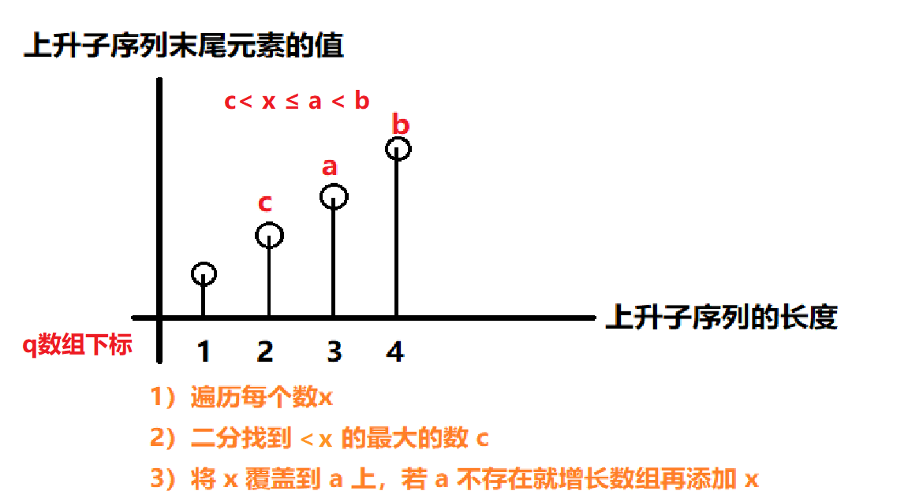

# LIS(Longest Increasing Sequence)

## 朴素做法O(n^2)

- 状态表示：`f[i]`表示以a[i]结尾的IS的长度的最大值，或者说是(a[0]~a[i])这一段序列的`LIS`。
- **状态表示f[i]**
  - **集合：**以a[i]结尾的递增子序列
  - **属性：**长度最大值
- **状态计算**
  - 当`a[pre] < a[i]`，`f[i] = max(f[i], f[pre] + 1)`

```c++
#include<cstdio>
#include<cstring>
#include<algorithm>

using namespace std;

const int N = 1000 + 100;

int a[N], f[N];
int n;

int main()
{
    scanf("%d", &n);
    
    for (int i = 1; i <= n; i ++) scanf("%d", a + i);
    
    for (int i = 1; i <= n; i ++)
    {
        f[i] = 1;
        for (int j = 1; j < i; j ++)
            if (a[j] < a[i]) f[i] = max(f[i], f[j] + 1);
    }
    
    int res = -1;
    for (int i = 1; i <= n; i ++) res = max(res, f[i]);
    
    printf("%d\n", res);
    return 0;
}
```


## 贪心做法O(nlogn)

首先要确定一件事情：最长上升子序列遵循如下的单调性：

> 即LIS的长度越长，那么对应子序列末尾元素的值应该更大。
>
> 对于一个序列，如果想让上升子序列尽量的长，那么需要让序列上升的尽可能的慢，因为需要每次在上升子序列末尾添加的数字尽可能小。
> 举例说明：如对序列  。构建长度为3的上升子序列时，应该选择 而不是  .
>
> **代码实现：**基于上述方法，**可以维护一个数字 ,表示长度为  的最长上升子序列的末尾数字的最小值**，同时使用  记录当前最长上升子序列的长度。由此方法构建的  数组关于  单调递增。若不为单调递增，既存在  , 且 ,则可以通过从尾部删除元素使得两序列长相等，而此时  仍大于 ，说明不满足最长上升序列的最小值，导出矛盾。
> 通过遍历数组  中的每个元素，并对  数组和  的值进行更新。
> 当 时，更新 ;
> 否则使用二分法找到满足 的下标进行更新。
> 由于需要返回该子序列，需要添加一个辅助数组 表示当前值对于  值。最后通过倒序遍历这个数组找出最长递增子序列
>
> 证明：以下图为例，若b < a，那么a元素可以加在长度为4末尾元素为b的子序列后边，最终的LIS长度为5且末尾元素为a。但这明显与图中不符，所以a > b恒成立。



<center>图片来自https://www.acwing.com/user/myspace/index/1301</center>

该做法蕴含了一个贪心的思想，对于同样长度的子串，我当然希望它的末端越小越好，这样以后我也有更多机会拓展。

**示例代码1：**

```c++
#include<cstdio>
#include<cstring>
#include<algorithm>

using namespace std;

const int N = 1e5 + 100;

int a[N], f[N];
// f[i] 表示长度为i的LIS的末尾元素。
int n;

int main()
{
    scanf("%d", &n);
    
    for (int i = 1; i <= n; i ++) scanf("%d", a + i);
    // 初始时，长度为1的子序列末尾元素就是a[1]
    f[1] = a[1];
    int cnt = 1;
    // 从第二个元素开始遍历
    for (int i = 2; i <= n; i ++)
    {
        // 若该元素大于最长的子序列末尾元素，就将该元素加入到该序列末尾，
        // 否则，利用二分的方式，从f[]中找到小于该元素的最大值f[j]，将元素a[i]加到a[j]对应的序列的末尾.
        // 注意，加入之后，LIS的长度就发生改变，所以要加入到下一个位置，即f[j + 1] = a[i];
        if (a[i] > f[cnt]) f[++ cnt] = a[i];
        else {
            int l = 1, r = cnt;
            while(l < r)
            {
                int mid = l + r >> 1;
                if (a[i] > f[mid]) l = mid + 1;
                else r = mid;
            }
            f[r] = a[i];
        }
    }
    
    printf("%d\n", cnt);
    return 0;
}
```

**Y总的简洁代码**

```c++
#include <iostream>
#include <algorithm>

using namespace std;

const int N = 100010;

int n;
int a[N];
int q[N];

int main()
{
    scanf("%d", &n);
    for (int i = 0; i < n; i ++ ) scanf("%d", &a[i]);

    int len = 0;
    for (int i = 0; i < n; i ++ )
    {
        int l = 0, r = len;
        while (l < r)
        {
            int mid = l + r + 1 >> 1;
            if (q[mid] < a[i]) l = mid;
            else r = mid - 1;
        }
        len = max(len, r + 1);
        q[r + 1] = a[i];
    }

    printf("%d\n", len);

    return 0;
}
```


**分析：**

就是最终栈中的元素可能和最长子序列中的元素是不同的，但是其中包含的元素个数却是相同的。

最难理解的地方在于栈中序列虽然递增，但是每个元素在原串中对应的位置其实可能是乱的，那为什么这个栈还能用于计算最长子序列长度？
实际上这个栈【不用于记录最终的最长子序列】，而是【**以stk[i]结尾的子串长度最长为i**】或者说【长度为i的递增子串中，末尾元素最小的是stk[i]】。理解了这个问题以后就知道为什么新进来的元素要不就在末尾增加，要不就替代第一个大于等于它元素的位置。
这里的【替换】就蕴含了一个贪心的思想，对于同样长度的子串，我当然希望它的末端越小越好，这样以后我也有更多机会拓展。


# LIS扩展


## 1、相邻元素差绝对值不超过d的最长子序列问题

> 与此题相同的还有 左右不相邻的最长子序列长度

问题描述：

输入数组 A[0:n]和正实数 d,试设计一个动态规划算法输出 A[0:n]的一个最长子序列，使得子序列中相继元素之差的绝对值不超过 d。分析算法的时间复杂度。

这个问题刚开始拿到没啥思路，一直想不到这个问题的最优子结构，后来看到了最长递增子序列问题的解，发现这个问题和最长递增子序列问题的思路类似。

我们来回忆一下最长递增子序列问题，我们在处理这个问题的时候可以进行一些适当的转换。尽管题目要求求A[0:n]的最长递增子序列，但是因为每个序列都有一个处在最后的元素，因此可以转换为求以某个元素结尾的最长递增子序列问题，最后只要一个O（n）的遍历就能得到最长递增子序列了。这么转换的好处是最优子结构一目了然，比如说我们找到了一个最长递增子序列b1b2...bn,那么显然，b1...bn-1为a0....bn-1的最长递增子序列，因为如果不是，那么将更长的和bn组合起来，就得到了一个比b1...bn还长的序列，这与我们的假设矛盾。在找到了最优子结构以后，很容易的可以写出递归式：

设list[i]存储的为以A[i]结尾的最长递增子序列，那么list[i]=max{list[j]}+1(其中j<i,且A[i]>A[j]）如果不存在A[j]那么list[i]=1.

这个算法很简单就能写出来了。

而回过头看这个题，其实并没有啥区别。一个序列a1a2a3...an的最长这个子序列为b1b2b3...bk，那么显然，b1....bk-1是以bk-1结尾的最长这个子序列，证明方法还是复制剪切法。所以我们很容易的可以得到一个递归式：

设dis[i]保存的是以A[i]结尾的最长的这个子序列的长度，那么dis[i]=max{dis[j]}+1 其中j<i且要求满足A[j]与A[i]的差的绝对值小于d.

得到了递归式以后，我们很容易可以得到动态规划算法。


当然，最后还要遍历一下dis数组求出最大值。

> 原文链接：https://blog.csdn.net/qq_37694390/article/details/80637038 


## 2、输出LIS路径

### 3.1 基于朴素做法的LIS路径输出

[300. 最长递增子序列 - 力扣（Leetcode）](https://leetcode.cn/problems/longest-increasing-subsequence/description/)

```java
class Solution {
    public int lengthOfLIS(int[] nums) {
        int n = nums.length;
        int[][] f = new int[n][n + 1];

        for (int i = 0; i < n; i ++) {
            for (int j = i; j >= 0; j --) {
                if (nums[j] < nums[i]) {
                    if (f[i][0] < f[j][0] + 1) {
                        f[i] = Arrays.copyOf(f[j], n + 1);
                    }
                }
            }
            f[i][0] ++;
            f[i][f[i][0]] = nums[i];
        }
        int ans = 0;
        for (int i = 0; i < n; i ++) {
            ans = Math.max(ans, f[i][0]);
        }
            
        return ans;
    }
}
```


### 3.2 输出LIS的最小字典序问题(Ologn)

参考连接：[最长上升子序列 求字典序问题 - AcWing](https://www.acwing.com/blog/content/5044/)

> 题目描述
> 给定数组arr，设长度为n，输出arr的最长递增子序列。（如果有多个答案，请输出其中字典序最小的）
>
> 输入格式
> 第一行包含整数N。
>
> 第二行包含N个整数，表示完整序列。
>
> 数据范围
> 1<=N<=105
>
> 1<=数列中的数<=10^9
> 输入样例：
> 9
> 2 1 5 3 6 4 8 9 7
> 输出样例：
> 1 3 4 8 9
> 输入样例：
> 5
> 1 2 8 6 4
> 输出样例：
> 1 2 4

```java
import java.util.*;


public class Solution {
    /**
     * retrun the longest increasing subsequence
     * @param arr int整型一维数组 the array
     * @return int整型一维数组
     */
    public int[] LIS (int[] arr) {
        int n = arr.length, len = 1;
        // f[i]记录长度为i的LIS的最小末尾元素
        // 也就是说同样都是长度为3的LIS，f记录末尾元素最小的那个LIS的末尾元素。这样才能让这个LIS能够继续扩展。
        int[] f = new int[n + 1];
        int[] maxLen = new int[n];
        // 长度为1时，末尾元素就是第一个元素。
        f[len] = arr[0];
        // 以元素arr[0]结尾的LIS长度为1
        maxLen[0] = 1;
        for (int i = 1; i < n; i ++) {
            // 如果arr[i]比前边所有序列末尾元素都大，那就将该元素加到所有序列的末尾。
            if (arr[i] > f[len]) {
                f[++ len] = arr[i];
                maxLen[i] = len;
            } else {
                // 让他替换某一个长度序列里的末尾元素，
                int l = 1, r = len;
                while(l < r) {
                    int mid = l + r >> 1;
                    if (arr[i] > f[mid]) l = mid + 1;
                    else r = mid;
                }
                f[r] = arr[i];
                maxLen[i] = r;
            }
        }
    	// 注意：f数组的长度等同于LIS的长度，但是不代表就是LIS序列。
        // 为什么这样输出就是字典序最小的序列？
        // 假设maxLen=[1,2,3,1,3]，最终输出结果为res（字典序最小的最长递增子序列），res[末尾]那么到底等于arr1[2]还是等于arr1[4]呢？换句话说，就是res是以arr1[2]结尾的LIS，还是以arr1[4]结尾的LIS。
        // 答案显然是以arr1[4]结尾的LIS
        // 因为f[3]一定等于arr1[4], 因为i是从0~n开始遍历的。所以刚开始f[3] = arr1[2]，但是发现arr1[4] < arr1[2]，所以将f[3]的值替换为了arr1[4]。否则，arr1[4] == 4,f[4] == arr1[4],f[3] == arr1[2]
        int[] ans = new int[len];
        for (int i = n - 1; i >= 0; i --) {
            if (maxLen[i] == len) {
                ans[-- len] = arr[i];
            }
        }
        return ans;
    }
}
```


## 3、覆盖整个序列的最少的不上升子序列的个数

> 另外根据Dilworth定理：
> 可证明了：
> “能覆盖整个序列的最少的不上升子序列的个数”等价于“该序列的最长上升子序列长度”
> 同理即有：
> “能覆盖整个序列的最少的不下降子序列的个数”等价于“该序列的最长下降子序列长度”

[AcWing 1010. 拦截导弹 - AcWing](https://www.acwing.com/activity/content/code/content/2656355/)


## 4、用二分求出非严格单调递增的LIS

> 1964. 找出到每个位置为止最长的有效障碍赛跑路线
>
> 求出以每个位置结束的LIS(非严格单调递增)

注意好好思考`f[]`数组的含义

- 代表的是长度为i + 1的最长子序列中末尾元素最小的数
- 显然，在相同长度的非递减子序列中，**结尾元素越小越容易获得一个更长的非递减子序列，贪心具有正确性**，我们只要维护每个长度的非递减序列的最小结尾元素即可，然后对于每个障碍，只要找到它能构成的最长非递减子序列，遍历每个障碍，并更新 dp 数组，做法是找到小于等于该障碍高度和大于的分界线，替换掉大于的那个元素，而被替换的下标就是当前障碍能构成的最长子序列，我们可以用二分快速找到这个位置，需要注意的是，如果所有元素都小于等于当前障碍，我们需要在结尾添加一个元素，因此二分的区间是变化的，我们维护一个最长子序列长度，每次二分都在这个范围内查找，如果添加了元素，那么该长度加一
