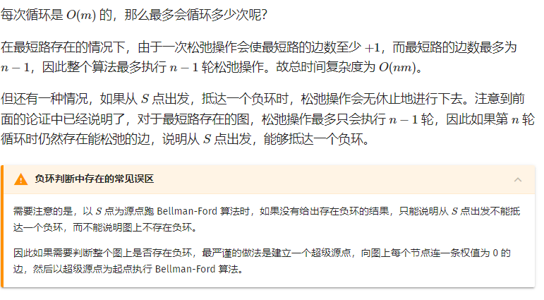

# 最短路

## 结构

- 单源最短路
  - 所有边权都是正数
    - 朴素Dijkstra
      - $O(n^2)$
    - 堆优化版Dijkstra
      - $O(mlog(n))$
  - 存在负权边
    - Bellman-Ford算法
      - $O(nm)$
      - 可以处理有负权边、有负权回路的图
    - SPFA
      - $O(m)$
      - 可以处理负权边，但是不能处理有负权回路的图
- 多源汇最短路
  - Floyd算法
    - $O(n^3)$


> **Tips:** bellman-ford算法基本上不会用。

------

## 单源最短路

### 朴素Dijkstra

**时间复杂度：**$O(n^2)$

#### 算法流程

1. 初始化`dist[start] = 0`,其余节点的dist值为无穷大。
2. 找出一个未被标记的、`dist[x]`最小的节点x，然后将标记节点x。
3. 扫描节点x的所有出边`(x, y, z)`，若`dist[y] > dist[x] + z`，则使用`dist[x] + z`更新`dist[y]`。
4. 重复上述`2-3`两个步骤，直到所有节点都被标记。

#### 原理

Dijkstra算法基于**贪心思想**，它只适用于**所有边的长度都是非负数**的图。当边长z都是非负数时，**全局最小值不可能再被其他节点更新，故在第2步中选出的节点x必须满足：`dist[x]`已经是起点到x的最短距离。**这个也是Dijkstra算法不能解决负权边的图，每个点被确定st[j] = true后，dist[j]就是最短距离了，之后就不能再被更新了，而如果有负权边的话，那已经确定的点的dist[j]不一定是最短了。

我们不断选择全局最小值进行标记和扩展，最终可得到起点到每个结点的最短路径。

#### 基本代码

```cpp
int dist[N]; // 节点i到起点的最短距离。
bool st[N]; // 标记是否已经被用过

void dijkstra(int start)
{
    memset(dist, 0x3f3f, sizeof dist);
    memset(st, 0, sizeof st);
    
    dist[start] = 0;
 	// 循环n-1次就可以
    for (int i = 1; i < n; i ++)
    {
    	int t = -1;
        for (int j = 1; j <= n; j ++)
            if (!st[j] && (t == -1 || dist[t] > dist[j]))
                t = j;
        
        st[t] = true;
        for (int j = 1; j <= n; j ++)
			dist[j] = min(dist[j], dist[t] + g[t][j]);
    }
}
```

### 堆优化版Dijkstra

#### 原理

朴素版的Dijkstra算法的瓶颈主要在于第2步的**寻找全局最小值**的过程，每次都需要花费`O(n)`的代价。可以用二叉堆对`dist`数组进行维护，用$O(logn)$的时间获取最小值并从堆中删除，用$O(logn)$的时间执行一条边的扩展和更新，最终可在$O(mlogn)$的时间内实现Dijkstra算法。


#### 基本代码

题目链接：https://www.acwing.com/problem/content/852/

```cpp
#include<cstdio>
#include<cstring>
#include<algorithm>
#include<queue>

using namespace std;

typedef pair<int, int> PII;
const int N = 150000 + 100;

int h[N], w[N], ne[N], e[N], idx;
int d[N];
bool st[N];
int n, m;

void add(int x, int y, int z)
{
    e[idx] = y;
    ne[idx] = h[x];
    w[idx] = z; // w存储x到y的权值
    h[x] = idx ++;
}

int dijkstra()
{
    // 优先队列，小根堆(默认是大根堆)
    // 或者直接使用priority_queue<PII>, 存储权值的相反数。
    priority_queue<PII, vector<PII>, greater<PII>> q;

    d[1] = 0; // 第一节点初始化为0

    // 注意：PII 第一个元素是路径，第二个元素是节点编号
    q.push({0, 1});

    while(!q.empty())
    {
        // 取出队列中第一个节点(最短路径的节点)
        auto head = q.top();
        q.pop();

        int distance = head.first, t = head.second;
        // 若用此节点的最短路径更新过其他节点，则跳出。
        if (st[t]) continue;
        st[t] = true;
        // 找到此节点能到达的节点，然后更新他们到起始点的最短距离。
        for (int i = h[t]; ~i; i = ne[i])
        {
            int j = e[i];
            if (d[j] > w[i] + distance)
            {
                d[j] = w[i] + distance;
                q.push({d[j], j});
            }
        }
    }

    if (d[n] == 0x3f3f3f3f) return -1;
    else return d[n];
}

int main()
{
    scanf("%d%d", &n, &m);

    memset(h, -1 , sizeof h);
    memset(d, 0x3f, sizeof d);

    for (int i = 0; i < m; i ++)
    {
        int x, y, z;
        scanf("%d%d%d", &x, &y, &z);
        add(x, y, z);
    }

    printf("%d\n", dijkstra());
    return 0;
}
```


### Bellman-Ford算法

基于松弛操作的最短路算法，可以求出有负权的图的最短路，并可以对最短路不存在的情况进行判断。

> 对于边`(u,v)`，松弛操作对应下面的式子：$dis(v) = min(dis(v), dis(u) + w(u, v))$。

该算法不断尝试对图上的每条边进行松弛，我们没进行一轮循环，就对图上所有的边都尝试进行一次松弛操作，当一次循环中没有成功的松弛操作时，算法停止。

>  

#### 算法流程

> 给定一张有向图，若对于图中的某一条边`(x,y,z)`，有`dist[y] <= dist[x] + z`成立，则称该边满足三角形不等式。若所有边都满足三角不等式，则`dist`数组就是所求最短路。
>
> 利用反证法很容易证明这个结论。

1. 扫描所有边`(x, y, z)`，若`dist[y] > dist[x] + z`，则用`dist[x] + z`更新`dist[y]`。
2. 重复上述步骤，直到没有更新操作发生。

**算法复杂度：**$O(nm)$

该算法效率较差，但适合做有边数限制的最短路。

例题：https://www.acwing.com/problem/content/855/

#### 基本代码

```cpp
#include<cstdio>
#include<cstring>
#include<algorithm>

using namespace std;

const int N = 510, M = 10010, INF = 0x3f3f3f3f;

// 存储边以及对应的权重
struct Edge{
    int a, b, c;
}e[M];

// d存储每个节点到起点的距离
// backup为上一次迭代的d(备份)，防止出现串联反应。
int d[N], backup[N];
int n, m, k;

int bellman_ford()
{
    d[1] = 0;
    for (int i = 0; i < k; i ++)
    {
        memcpy(backup, d, sizeof d);
        for (int j = 0; j < m; j ++)
        {
            int a = e[j].a, b = e[j].b, c = e[j].c;
            d[b] = min(d[b], backup[a] + c);
        }
    }
    return d[n];
}

int main()
{
    scanf("%d%d%d", &n, &m, &k);

    memset(d, 0x3f, sizeof d);

    for (int i = 0; i < m; i ++)
    {
        int x, y, z;
        scanf("%d%d%d", &x, &y, &z);
        e[i] = {x, y, z};
    }

    int res = bellman_ford();
    if (res > INF / 2) puts("impossible");
    else printf("%d\n", res);
}
```

------

### SPFA

SPFA是`shortest Path Fast Algorithm`的缩写，在国际上通称为“队列优化的Bellman-Ford算法”，仅在中国大陆流行“SPFA算法”的称谓。

#### 算法流程

1. 建立一个队列，最初队列中只含有起点`start`
2. 取出队头节点`x`，扫描它的所有出边`(x,y,z)`，若`dist[y] > dist[x] + z`，则使用`dist[x] + z`来更新`dist[y]`。同时，若y不在队列中，则把y入队。
3. 重复上述步骤，直到队列为空。

#### 原理

Bellman_ford算法会遍历所有的边，而**SPFA只用遍历那些到源点距离变小的点所连接的边**，只有当一个点的前驱结点更新了，该节点才会得到更新；利用队列每次加入距离被更新的结点，在任意时刻，该算法的队列**都保存了待扩展的节点。每次入队相当于完成一次`dist`数组的更新操作，使其满足三角形不等式**。**一个节点可能会入队、出队多次。**最终，图中节点收敛到全部满足三角形不等式的状态。这个队列避免了Bellman-Ford算法中对不需要扩展的节点的冗余扫描，在随即图上运行效率为$O(km)$级别，其中k是一个较小的常数。但在特殊构造的图上，该算法很可能退化为$O(nm)$，必须谨慎使用。

#### 基本代码

```cpp
void spfa(int start)
{
    memset(dist, 0x3f, sizeof dist);
    memset(st, 0, sizeof st);
    
    dist[start] = 0;
    st[start] = true;
    
    q.push(start);
    while(!q.empty())
    {
        int x = q.front(); q.pop();
        // 弹出后，标记为false，因为该节点有可能会再次入队。
      	st[x] = false;
        for (int i = h[x]; ~i; i = ne[i])
        {
            int j = e[i];
            if (d[j] > d[x] + w[i])
            {
                d[j] = d[x] + w[i];
                if (!st[j])// 如果发生更新，并且没有该节点没有在队列里，就把他加入到队列中。
                {
                    q.push(j);                    
                    st[j] = true;// 标记已经在队
                }
            }
        }
    }
}
```


**注意：**

> 1. **st数组的作用：**判断当前的点是否已经加入到队列当中了；已经加入队列的结点就不需要反复的把该点加入到队列中了，就算此次还是会更新到源点的距离，那只用更新一下数值而不用加入到队列当中。即便不使用st数组最终也没有什么关系，但是使用的好处在于可以提升效率。
> 2. **Bellman_ford算法可以存在负权回路，是因为其循环的次数是有限制的因此最终不会发生死循环；但是SPFA算法不可以，由于用了队列来存储，只要发生了更新就会不断的入队，因此假如有负权回路请你不要用SPFA否则会死循环。**

#### 其他优化

>  Bellman-Ford 的其他优化
>
> 除了队列优化（SPFA）之外，Bellman-Ford 还有其他形式的优化，这些优化在部分图上效果明显，但在某些特殊图上，最坏复杂度可能达到指数级。
>
> - 堆优化：将队列换成堆，与 Dijkstra 的区别是允许一个点多次入队。在有负权边的图可能被卡成指数级复杂度。
>
> - 栈优化：将队列换成栈（即将原来的 BFS 过程变成 DFS），在寻找负环时可能具有更高效率，但最坏时间复杂度仍然为指数级。
>
> - LLL 优化：将普通队列换成双端队列，每次将入队结点距离和队内距离平均值比较，如果更大则插入至队尾，否则插入队首。
>
> - SLF 优化：将普通队列换成双端队列，每次将入队结点距离和队首比较，如果更大则插入至队尾，否则插入队首。
>
> - D´Esopo-Pape 算法：将普通队列换成双端队列，如果一个节点之前没有入队，则将其插入队尾，否则插入队首。
>
> 更多优化以及针对这些优化的 Hack 方法，可以看 [fstqwq 在知乎上的回答](https://www.zhihu.com/question/292283275/answer/484871888)。

------

## **多源**汇最短路

### Floyd算法

求图中任意两点间的最短路径，可以把每个点当作起点，求解N次单源最短路。不过，在任意两点间最短路问题中，图一般比较稠密。

该算法本质上是动态规划，用来求任意两个结点之间的最短路，复杂度比较高$O(n^3)$，但是常数小，容易实现。适用于任何图，不管有向无向，边权正负，但是最短路必须存在。（不能有个负环）

#### 原理

`d[i][j][k]`：表示**经过若干个编号不超过k的节点**从i到j的最短路长度。

该问题可以划分为两个子问题：

1. 经过编号不超过k-1的节点从i到j。
2. 从i先到k再到j。

于是：

`d[i][j][k] = min(d[i][j][k-1], d[i][k][k-1] + d[k][j][k - 1])`

> 初值为`d[0][i][j] = A[i][j](邻接矩阵)` 

抽象来说：**即判断从i走到j的路径中，途中经过第k个点路径是否会更短？**

通俗来讲：

- 当k=3时，`d[i][j]`表示下面两种情况的最小值
  1. i直接到j(这种情况路径就是输入时的边权)
  2. i经过2，然后从2到达j

#### 基本代码

```cpp

void floyd() {
    for(int k = 1; k <= n; k++)
        for(int i = 1; i <= n; i++)
            for(int j = 1; j <= n; j++)
                d[i][j] = min(d[i][j], d[i][k] + d[k][j]);
}
```


## 其他细节

### SPFA VS Dijstra

SPFA算法看上去和Dijstra算法长得有一些像,但是其中的意义还是相差甚远的:

- Dijkstra算法中的st数组保存的是当前确定了到源点距离最小的点，且一旦确定了最小那么就不可逆了(不可标记为true后改变为false)；SPFA算法中的st数组仅仅只是表示的当前发生过更新的点，且spfa中的st数组可逆(可以在标记为true之后又标记为false)。顺带一提的是BFS中的st数组记录的是当前已经被遍历过的点。
- Dijkstra算法里使用的是优先队列保存的是当前未确定最小距离的点，目的是快速的取出当前到源点距离最小的点；SPFA算法中使用的是队列(你也可以使用别的数据结构),目的只是记录一下当前发生过更新的点。


### 参考文献

- 《算法竞赛进阶指南》
- https://www.acwing.com/solution/content/9306/
- https://oi-wiki.org/

