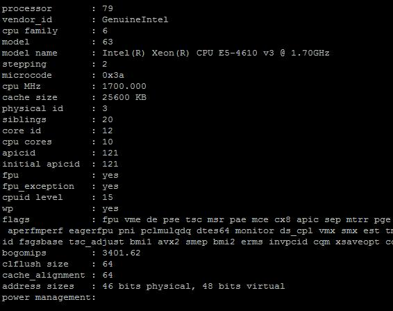
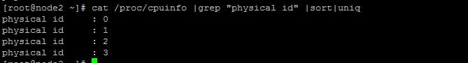
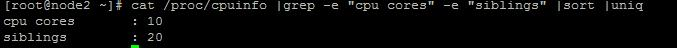
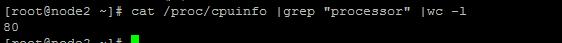

　在linux系统中，提供了/proc目录下文件，显示系统的软硬件信息。如果想了解系统中CPU的提供商和相关配置信息，则可以查/proc/cpuinfo。但是此文件输出项较多，不易理解。例如我们想获取，有多少颗物理CPU，每个物理cpu核心数，以及超线程是否开启等信息，下面我们就看来一步一步的去探索。

## 物理CPU、核数、逻辑cpu数的概念

①物理CPU数（physical id）：主板上实际插入的cpu数量，可以数不重复的 physical id 有几个

②CPU核心数（cpu cores）：单块CPU上面能处理数据的芯片组的数量，如双核、四核等 

③逻辑CPU数：一般情况下，

　　逻辑CPU=物理CPU个数×每颗核数   　#不支持超线程技术或没有开启次技术

　　逻辑CPU=物理CPU个数×每颗核数 *2 　 #表示服务器的CPU支持超线程技术（简单来说，它可使处理器中的1 颗内核如2 颗内核那样在操作系统中发挥作用。这样一来，操作系统可使用的执行资源扩大了一倍，大幅提高了系统的整体性能）

## cpuinfo文件内容，涉及的项目解读

　　话不多少，看图说话。下图是我负责维护的一台服务器的CPU信息。使用cat /proc/cpuinfo。足足输出1500+条记录。其中内容均和下图相似，不同的是“：”右边的信息不同。

　　下面对上图的输出内容进行相应解释

processor　：系统中逻辑处理核心数的编号，从0开始排序。

vendor_id　：CPU制造商

cpu family　：CPU产品系列代号

model　　　：CPU属于其系列中的哪一代的代号

model name：CPU属于的名字及其编号、标称主频

stepping　 ：CPU属于制作更新版本

cpu MHz　 ：CPU的实际使用主频

cache size ：CPU二级缓存大小

physical id ：单个物理CPU的标号

siblings ：单个物理CPU的逻辑CPU数。siblings=cpu cores [*2]。

core id ：当前物理核在其所处CPU中的编号，这个编号不一定连续。

cpu cores ：该逻辑核所处CPU的物理核数。比如此处cpu cores 是4个，那么对应core id 可能是 1、3、4、5。

apicid ：用来区分不同逻辑核的编号，系统中每个逻辑核的此编号必然不同，此编号不一定连续

fpu ：是否具有浮点运算单元（Floating Point Unit）

fpu_exception ：是否支持浮点计算异常

cpuid level ：执行cpuid指令前，eax寄存器中的值，根据不同的值cpuid指令会返回不同的内容

wp ：表明当前CPU是否在内核态支持对用户空间的写保护（Write Protection）

flags ：当前CPU支持的功能

bogomips：在系统内核启动时粗略测算的CPU速度（Million Instructions Per Second

clflush size ：每次刷新缓存的大小单位

cache_alignment ：缓存地址对齐单位

address sizes ：可访问地址空间位数

power management ：对能源管理的支持

## 快速查询想要获取的信息

①查询系统有几颗物理CPU：cat /proc/cpuinfo | grep "physical id" |sort |uniq

 

②查询系统每颗物理CPU的核心数：cat /proc/cpuinfo | grep "cpu cores" | uniq

 

③查询系统的每颗物理CPU核心是否启用超线程技术。如果启用此技术那么，每个物理核心又可分为两个逻辑处理器。

　　cat /proc/cpuinfo | grep -e "cpu cores" -e "siblings" | sort | uniq

 　

　　如果cpu cores数量和siblings数量一致，则没有启用超线程，否则超线程被启用。

 

④查询系统具有多少个逻辑CPU：cat /proc/cpuinfo | grep "processor" | wc -l

 

 