## 1、top

### `top  1 `查看每个cpu的占用率情况。

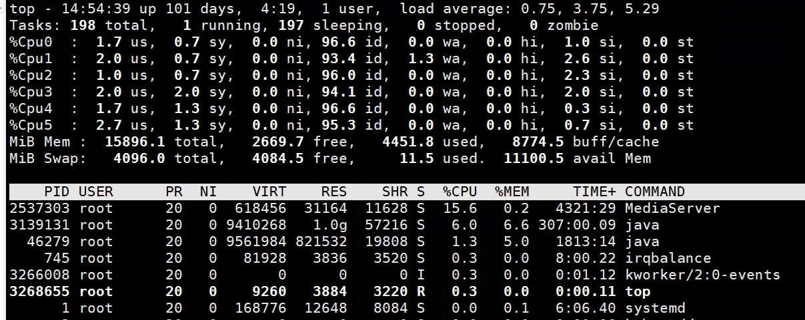

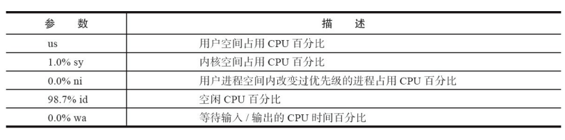

### `top  H `查看每个线程的占用率情况。

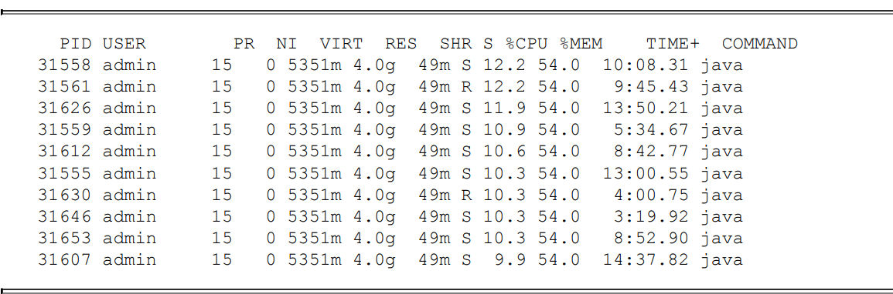


### `top -Hp pid`查看该进程下其他线程的CPU使用情况

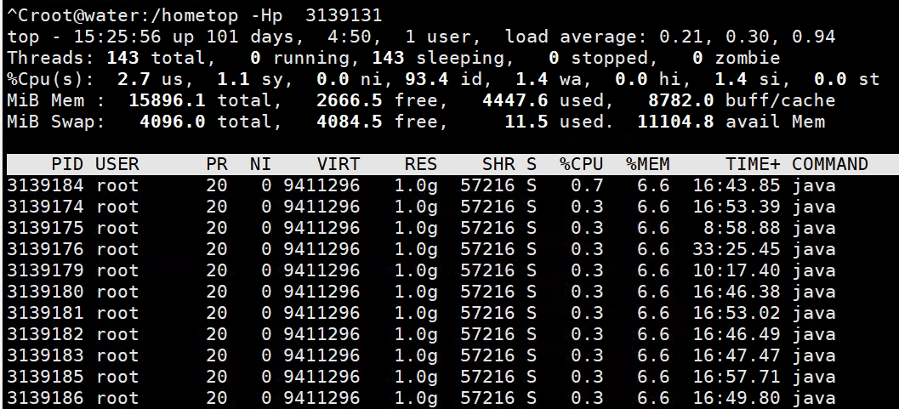


## 2、Java上线程序的排查

1. 第一种情况，某个线程CPU利用率一直100%，则说明是这个线程有可能有死循环，那么 请记住这个PID。 
2. 第二种情况，某个线程一直在TOP 10的位置，这说明这个线程可能有性能问题。
3. 第三种情况，CPU利用率高的几个线程在不停变化，说明并不是由某一个线程导致CPU 偏高。

### `jstat -gcutil 进程ID 1000 5`查看Java进程的垃圾回收统计信息

1. `1000`指得是间隔，5指的是输出条数(默认是无数条)。
2. `-gcutil`是显示垃圾收集统计的摘要


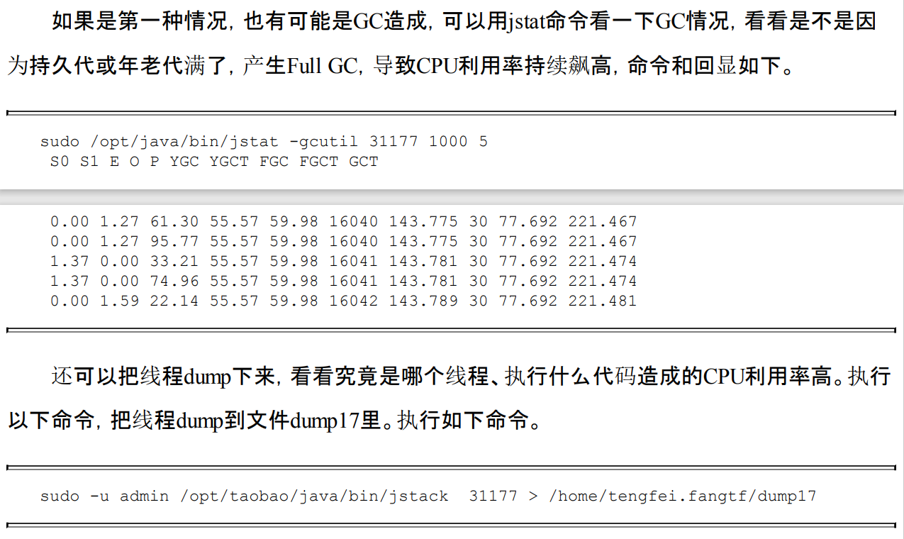

### `jstack -l 进程ID  `


1. 通过`JPS`查看到对应项目的进程ID
2. 通过`top -Hp 进程ID`查看该进程下的所有线程情况，找到CPU占用率较高的线程ID
3. 通过`jstack -l 进程ID`输出当前进程中的堆栈情况。
4. 将线程ID从10进制转为16进制，从而在`jstack`的输出信息中找到对应的线程。


## 3、查看CPU的参数

### 查看CPU的详细信息`cat /proc/cpuinfo`

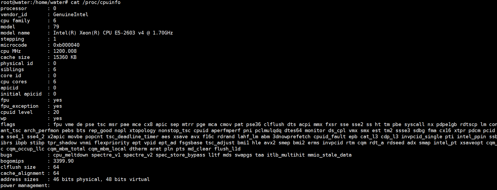


### 查看linux的物理CPU数

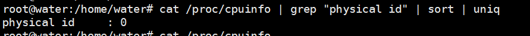


> Linux uniq 命令用于检查及删除文本文件中重复出现的行列，一般与 sort 命令结合使用2。

### 查看单个CPU核心数

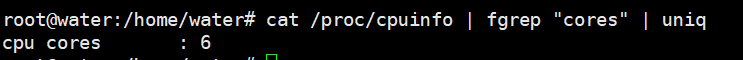


### 查看系统CPU线程总数

是否开启超线程，由以下公式来确定：

- `未开启超线程：CPU总线程数 = 物理CPU个数 * 每个物理CPU的逻辑核数 * 1`；
- `开启超线程：CPU总线程数 = 物理CPU个数 * 每个物理CPU的逻辑核数 * N`。


`cat /proc/cpuinfo | grep "processor" | wc -l`

根据返回的结果和上边的公式可以判断出是否开启了超线程。

> wc -l 命令用于统计行数。  -l显示行数


## 4、统计字数/行数(wc)

`wc -l` 统计行数

`wc -w` 统计字数

参数：

-c 只显示Byte数，亦即字符数；

-l 只显示列数；

-w 只显示字数；


## 5、watch定期运行用户定义的命令

默认情况下，**`watch`** 命令每两秒更新一次输出。按 **Ctrl+C** 退出命令输出。

-n指定两次运行间隔的时间

-d突出显示两次输出的差异部分


## 6、线上查看日志

**旧版本：**

1. 正序查看日志`cat example.log`
   1. `cat example.log | more`
   2. `cat example.log | less`
2. 倒序查看日志`tac example.log`
   1. `tac example.log | more`
   2. `tac example.log | less`
3. 查看日志的倒数10行`tail -10 example.log`
4. 查看日志的倒数10行`tac example.log | head -n 10`


 `cat` 命令是用来查看文件内容的，但是日志文件数据量有多少，它就读多少，很显然不适用大文件。

对于大文件，尽量用 `less` 命令去读文件里的内容，因为 less 并不会加载整个文件，而是按需加载，先是输出一小页的内容，当你要往下看的时候，才会继续加载。

### 只看开头/结尾指定数目的行

`head -n 10`

`tail -n 10`

### 实时查看日志打印

`tail -f file.log`


### tail、head、more、less联系与区别

1. `tail`：`tail`命令用于查看文件的末尾内容，默认情况下显示文件的最后10行。你可以使用`tail -n <行数>`来指定要显示的行数。`tail`命令常用于==实时监视日志文件的更新==，因为它支持实时追踪文件内容的变化。
2. `head`：`head`命令用于查看文件的开头内容，默认情况下显示文件的前10行。你可以使用`head -n <行数>`来指定要显示的行数。`head`命令通常用于快速预览文件的内容。
3. `more`：`more`命令用于逐页显示文件内容。它会一次显示一个屏幕的内容，当屏幕满了之后，它会等待用户按下空格键才继续显示下一页。你可以使用空格键向下滚动，使用`q`键退出。`more`命令适合于查看大型文件，因为它按需加载并逐页显示内容。
4. `less`：`less`命令也用于逐页显示文件内容，类似于`more`命令，但提供了更多的功能。与`more`不同，`less`支持`向前和向后滚动`，可以使用箭头键或Page Up/Page Down键进行导航。它还支持搜索、跳转到特定行和其他高级功能。`less`命令相对于`more`更加灵活和强大，是更推荐使用的工具。

## 7、线上频繁有人连接ssh

以下是一些建议，帮助您加强服务器的安全性：

1. **更改默认端口号：**默认的SSH端口号是22，攻击者通常会针对这个端口进行攻击。通过更改端口号，您可以降低攻击的概率。请注意，您必须在服务器和客户端的配置文件中指定新端口号。
   1. `vim /etc/ssh/sshd_config`
2. **使用SSH密钥对登录**：使用SSH密钥对可以大大增加安全性。攻击者需要拥有您的私钥才能登录到您的服务器，而这几乎是不可能的。请确保在使用密钥对登录时，您将私钥存储在安全的地方。
3. 禁用root用户：默认情况下，root用户具有最高权限，这使得攻击者更容易猜测您的密码。禁用root用户，并创建一个带有sudo权限的新用户，可以增加服务器的安全性。
4. 安装防火墙：安装防火墙可以限制服务器上允许的流量，并阻止未经授权的访问。您可以使用iptables或ufw等工具来配置防火墙规则。
5. 定期更新软件包：定期更新软件包是保护服务器免受已知漏洞攻击的重要步骤。使用您的操作系统提供的软件包管理器，定期更新所有软件包。
6. **启用登录失败尝试限制**：启用登录失败尝试限制可以限制攻击者尝试猜测密码的次数。如果攻击者多次尝试登录失败，服务器将在一段时间内暂时禁止该IP地址的访问。
   1. 使用`fail2ban`限制登录失败者疯狂重试
7. 使用网络入侵检测系统（NIDS）：使用NIDS工具可以帮助您监测和检测攻击。这些工具可以检测到许多网络攻击，从而提高服务器的安全性。

## 8、Linux上查看socket的信息

- `netstat -tunap`
- `ss -tunap`：显示当前系统上的TCP / UDP连接状态，并提供每个连接相关的进程和文件描述符信息。
- `lsof -p 进程号`：查看某个进程打开的文件和文件描述符。

> 系统繁忙的时候，尽量不要频繁使用`netstat`命令，开销较大，相比之下`ss`性能更好
>
> **Netstat** 是使用传统的网络套接字API来获取网络连接信息的。这种方法需要对每个网络连接进行系统调用，这会产生较大的开销，因为它需要在用户空间和内核空间之间频繁切换。此外，netstat还需要在每次调用时扫描整个连接表，这也会导致开销较大。
>
> 相比之下，**ss** 使用Linux内核提供的一组称为Netlink的API来获取网络连接信息。这种方法是更有效的，因为它直接在内核空间中获取数据，**并且可以通过单个系统调用来获取整个连接表**。这减少了用户空间和内核空间之间的切换次数，因此可以减少开销。


## 9、牛逼的sar

`sar`(system activity reporter系统活动情况报告)是一个很强大的命令，可以用来监视当前系统的运行情况。

> - 怀疑CPU存在瓶颈，可用 sar -u 和 sar -q 等来查看
> - 怀疑内存存在瓶颈，可用sar -B、sar -r 和 sar -W 等来查看
> - 怀疑I/O存在瓶颈，可用 sar -b、sar -u 和 sar -d 等来查看

### CPU占用率监控 `sar -u`

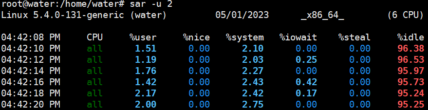

 各列的指标分别是:

- %user 用户模式下消耗的CPU时间的比例；
- %nice 通过nice改变了进程调度优先级的进程，在用户模式下消耗的CPU时间的比例
- %system 系统模式下消耗的CPU时间的比例；
- %iowait CPU等待磁盘I/O导致空闲状态消耗的时间比例；
- %steal 利用Xen等操作系统虚拟化技术，等待其它虚拟CPU计算占用的时间比例；
- %idle CPU空闲时间比例；

> 1. 若 %iowait 的值过高，表示硬盘存在I/O瓶颈
> 2. 若 %idle 的值高但系统响应慢时，有可能是 CPU 等待分配内存，此时应加大内存容量
> 3. 若 %idle 的值持续低于1，则系统的 CPU 处理能力相对较低，表明系统中最需要解决的资源是 CPU 。

### 进程队列长度和平均负载监控 `sar -q`

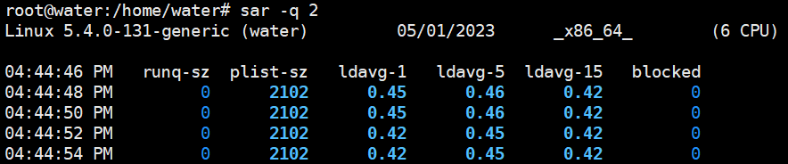

指定-q后，就能查看运行队列中的进程数、系统上的进程大小、平均负载等；与其它命令相比，它能查看各项指标随时间变化的情况；

- runq-sz：运行队列的长度（等待运行的进程数）
- plist-sz：进程列表中进程（processes）和线程（threads）的数量
- ldavg-1：最后1分钟的系统平均负载
- ldavg-5：过去5分钟的系统平均负载
- ldavg-15：过去15分钟的系统平均负载


### 内存使用情况监控 `sar -r`

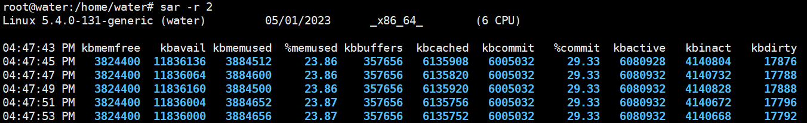

- kbmemfree：这个值和free命令中的free值基本一致,所以它不包括buffer和cache的空间.
- kbmemused：这个值和free命令中的used值基本一致,所以它包括buffer和cache的空间.
- %memused：物理内存使用率，这个值是kbmemused和内存总量(不包括swap)的一个百分比.
- kbbuffers和kbcached：这两个值就是free命令中的buffer和cache.
- kbcommit：保证当前系统所需要的内存,即为了确保不溢出而需要的内存(RAM+swap).
- %commit：这个值是kbcommit与内存总量(包括swap)的一个百分比.

### 内存分页监控 `sar -B`

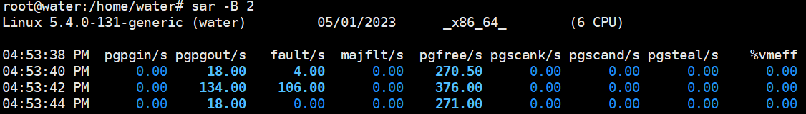

- `pgpgin/s`: 每秒钟从磁盘读取到page cache的页面数，以页为单位。
- `pgpgout/s`: 每秒钟从page cache写入到磁盘的页面数，以页为单位。
- `fault/s`: 每秒钟发生的缺页错误（page fault）次数。
- `majflt/s`: 每秒钟发生的主缺页错误（major page fault）次数。主缺页错误表示需要将数据从磁盘读取到内存中，而不是从page cache中读取。
- `pgfree/s`: 每秒钟释放的页面数，以页为单位。
- `pgscank/s`: 每秒钟扫描的匿名页面数，以页为单位。匿名页面是指没有关联到文件的页面。
- `pgscand/s`: 每秒钟扫描的缓存页面数，以页为单位。缓存页面是指关联到文件的页面。
- `pgsteal/s`: 每秒钟从page cache中删除的页面数，以页为单位。
- `%vmeff`: Virtual Memory Efficiency（虚拟内存效率），即页缓存工作集（working set）的比例。该值越高，表示缓存的页面越多，缓存效率越高。

### 页面交换监控 `sar -W`

页面发生交换时，服务器的吞吐量会大幅下降；服务器状况不良时，如果怀疑因为内存不足而导致了页面交换的发生，可以使用这个命令来确认是否发生了大量的交换：

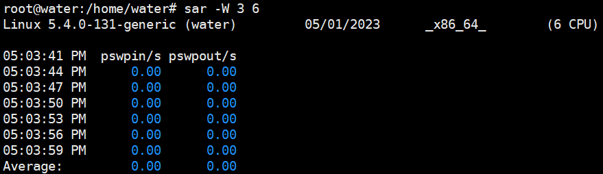

- pswpin/s：每秒系统换入的交换页面（swap page）数量
- pswpout/s：每秒系统换出的交换页面（swap page）数量

### 网络吞吐率和PPS监控

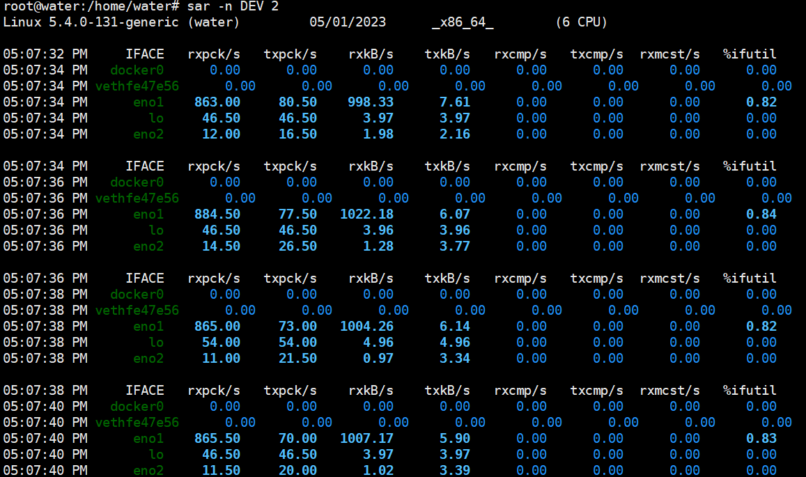

- sar -n DEV，显示网口的统计数据
- sar -n EDEV，显示关于网络错误的统计数据
- sar -n TCP，显示 TCP 的统计数据

- `IFACE`是网络接口名称

- `rxpck/s` 和 `txpck/s` 分别是接收和发送的 PPS，单位为包 / 秒。
- `rxkB/s` 和 `txkB/s` 分别是接收和发送的吞吐率，单位是 KB/ 秒。
- `rxcmp/s` 和 `txcmp/s` 分别是接收和发送的压缩数据包数，单位是包 / 秒。

> 对于带宽，我们可以使用 `ethtool` 命令来查询，它的单位通常是 `Gb/s` 或者 `Mb/s`，不过注意这里小写字母 `b` ，表示比特而不是字节。我们通常提到的千兆网卡、万兆网卡等，单位也都是比特（*bit*）。如下你可以看到， eth0 网卡就是一个千兆网卡：
> 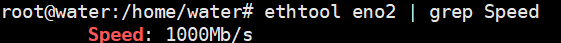


## 10、测试连通性和延时(ping)

要测试本机与远程主机的连通性和延时，通常是使用 `ping` 命令，它是基于 ICMP 协议的，工作在网络层。

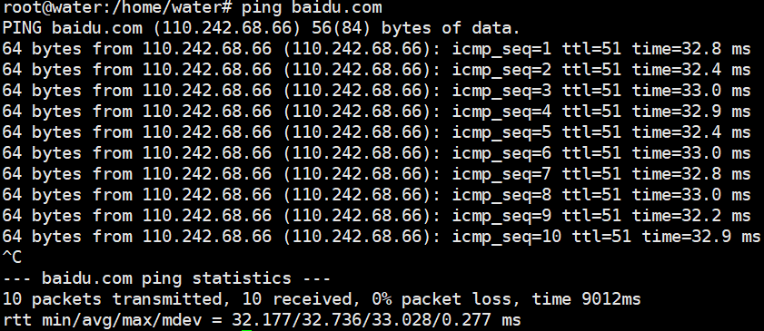

显示的内容主要包含 `icmp_seq`（ICMP 序列号）、`TTL`（生存时间，或者跳数）以及 `time` （往返延时），而且最后会汇总本次测试的情况，如果网络没有丢包，`packet loss` 的百分比就是 0。

不过，需要注意的是，`ping` 不通服务器并不代表 HTTP 请求也不通，因为有的服务器的防火墙是会禁用 ICMP 协议的。


## 11、对访问IP进行提取、排序、去重

```shell
grep -oE "\b([0-9]{1,3}\.){3}[0-9]{1,3}\b" logfile.txt | sort | uniq > unique_ips.txt
```


## 12、查看网络情况

- `netstat -natp`可以看到active的网络连接
- `ss -lna`


## 13、端口扫描(nmap、nc)

- `nmap 主机ip -p 端口`来测试端口是否开启
- `nc -zv 主机ip  端口[多个端口 | 20-1000端口范围] `


### nmap

### nc

> 有着网络界的瑞士军刀美誉，因为它短小精悍、功能实用，被设计为一个简单、可靠的网络工具。排行季军，我只能说实至名归。

- 测试端口`nc -zv .....`
- 可以搭建聊天室
  - 服务端：`nc  -l localhost 9999`
  - 客户端：`nc -v localhost 9999`
- 利用nc传输文件(发送文件的是客户端，接收文件的是服务端)
  - 服务器端`nc -l ip地址 端口号 > 接收的文件名`
  - 客户端`nc ip地址 端口号 < 发送的文件名`


## 14、性能分析相关

vmstat

TOP5：iostat** 

**上榜理由：**iostat作为系统级别的IO性能分析工具，也是很常用的一款命令工具，排行榜

top5。

**TOP6：****telnet** **上榜理由：**虽然在我们top10中，Telnet命令工具是最知名的。但相比我们有着“网络界的瑞士军刀”美誉的nc命令工具，有些黯然失色。加上功能有些单一，在同类型故障排查及性能分析的命令工具中显得有些单薄。排行榜：top6

**TOP7****：****sar**  **上榜理由：**sar命令工具的优势在于可以`对历史监控性能进行统计分析`，而vmstat、iostat只是针对统计实时的性能数据。sar在铁三角命令工具中相比冷门些，加上使用sar命令工具稍微有些复杂。排行榜：top7

**TOP8**：lsof 

**上榜理由：**lsof命令可以列出被进程所打开的文件信息，也是一款常用命令工具。排行榜：

top8

**TOP9****：****tcpdump** **上榜理由：**作为一款逼格较高的软件，能灵活使用tcpdump工具的同学，也是会让同行刮目相看。排行榜：top9

**TOP10：****starce** **上榜理由：**作为排行榜最后一款命令工具：strace，常常研发用于代码调试。如若运维同学掌握这款工具的使用，那在故障排查这方面无非是如虎添翼，另外也是一款装逼的神器。
