# 一、硬件结构

## 1.2 硬件基本构成

最重要的是定义计算机基本结构为 5 个部分，分别是**运算器、控制器、存储器、输入设备、输出设备**，这 5 个部分也被称为**冯诺依曼模型**。

- 运算器、控制器是在CPU中的。

- 存储器就是常见的内存。

- 存储单元和输入输出设备要与中央处理器打交道的话，离不开总线。

  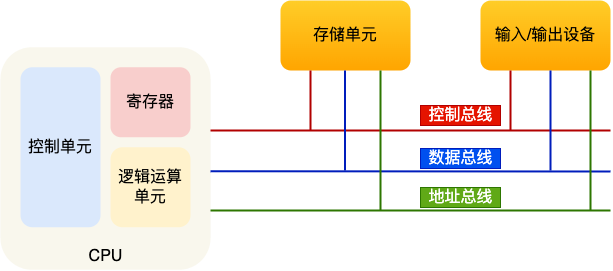

### CPU

中央处理器也就是我们常说的 CPU，32 位和 64 位 CPU 最主要区别在于一次能计算多少字节数据：

CPU 的位宽，代表的是 CPU 一次可以计算（运算）的数据量。CPU 位宽越大，可以计算的数值就越大。

- 32 位 CPU 一次可以计算 4 个字节；
- **64 位 CPU 一次可以计算 8 个字节；**

CPU 内部还有一些组件，常见的有**寄存器、控制单元和逻辑运算单元**等。

- 控制单元负责控制 CPU 工作
- 逻辑运算单元负责计算
- 寄存器可以分为多种类，每种寄存器的功能又不尽相同。
  - *通用寄存器*，用来存放需要进行运算的数据，比如需要进行加和运算的两个数据。
  - *程序计数器*，用来存储 CPU 要执行下一条指令「所在的内存地址」，注意不是存储了下一条要执行的指令，此时指令还在内存中，程序计数器只是存储了下一条指令「的地址」。
  - *指令寄存器*，用来存放当前正在执行的指令，也就是指令本身，指令被执行完成之前，指令都存储在这里。

### 内存

内存的地址是从 0 开始编号的，然后自增排列，最后一个地址为内存总字节数 - 1，这种结构好似我们程序里的数组，所以内存的读写任何一个数据的速度都是一样的。

### 总线

总线是用于 `CPU` 和`内存以及其他设备`之间的通信，总线可分为 3 种：

- `地址总线`，用于指定 CPU 将要操作的内存地址；
- `数据总线`，用于读写内存的数据；
- `控制总线`，用于发送和接收信号，比如中断、设备复位等信号，CPU 收到信号后自然进行响应，这时也需要控制总线；

当 CPU 要读写内存数据的时候，一般需要通过下面这三个总线：

- 首先要通过「地址总线」来指定内存的地址；
- 然后通过「控制总线」控制是读或写命令；
- 最后通过「数据总线」来传输数据；

### 输入、输出设备

输入设备向计算机输入数据，计算机经过计算后，把数据输出给输出设备。期间，如果输入设备是键盘，按下按键时是需要和 CPU 进行交互的，这时就需要用到控制总线了。

------

### 补充

#### 线路位宽与CPU位宽

数据是如何通过线路传输的呢？其实是通过操作电压，低电压表示 0，高压电压则表示 1。所以一条线路执行串行传输信号，在某时刻只能传递一个信号，即只能传递一位。

为了避免低效率的串行传输方式，线路的位宽最好一次就能访问到所有的内存地址。

CPU 想要操作「内存地址」就需要「地址总线」：

- 如果地址总线只有 1 条，那每次只能表示 「0 或 1」这两种地址，所以 CPU 能操作的内存地址最大数量为 2（2^1）个（注意，不要理解成同时能操作 2 个内存地址）；
- 如果地址总线有 2 条，那么能表示 00、01、10、11 这四种地址，所以 CPU 能操作的内存地址最大数量为 4（2^2）个。

那么，想要 CPU 操作 4G 大的内存，那么就需要 32 条地址总线，因为 `2 ^ 32 = 4G`。

所以，32 位 CPU 最大只能操作 4GB 内存，就算你装了 8 GB 内存条，也没用。而 64 位 CPU 寻址范围则很大，理论最大的寻址空间为 `2^64`，1GB = 2^10次方，所以64位大概2^34 GB。通常来说 64 位 CPU 的地址总线是 48 位。

#### 64 位和 32 位软件

64 位和 32 位软件，实际上`代表指令是 64 位还是 32 位的：`

- 如果 32 位指令在 64 位机器上执行，需要一套兼容机制，就可以做到兼容运行了。但是**如果 64 位指令在 32 位机器上执行，就比较困难了，因为 32 位的寄存器存不下 64 位的指令**；
- 操作系统其实也是一种程序，我们也会看到操作系统会分成 32 位操作系统、64 位操作系统，其代表意义就是操作系统中程序的指令是多少位，比如 64 位操作系统，指令也就是 64 位，因此不能装在 32 位机器上。


#### ==(TODO)CPU位宽、寄存器位宽、操作系统的位宽、线路位宽的关系==

> 网络有些“**操作系统的位数，指的是线路位宽，也就是指地址总线的位数**。”的结论是错误的。
>
> - 线路位宽是硬件层面决定的，而操作系统是软件。他俩并不是同一个概念。位宽为64的CPU，可以安装32位的操作系统，并兼容32位的应用程序。另外，64位CPU的地址总线，位宽实际上一般是48。


- CPU位宽：主要指的是CPU一次能够处理的二进制数据位数

- 寄存器位宽：
- 操作系统位宽：
- 线路位宽
  - 地址总线位宽：决定CPU可直接寻址的内存空间的大小(`2 ^ 位宽`)，以我个人服务器为例：
    - 通过`cat /proc/cpuinfo`可得到某个核心地址大小的信息
    - 具体为：`address sizes	: 46 bits physical, 48 bits virtual`
    - 46代表物理地址的位数，即CPU可以寻址的物理内存空间的大小。说白了就是
  - 数据总线位宽：


按照我的理解：

1. CPU、寄存器、线路的位宽都是硬件层面决定的，而操作系统的位宽是软件决定的。
2. 线路位宽或者叫做数据总线其实又分为内部数据总线和外部数据总线，内部数据总线负责寄存器和运算器之间的数据一

- 64位的CPU可以安装32位的操作系统，并且可以兼容的运行32位的应用程序。


地址总线描述的是寻址能力。


## 1.3 存储器的级别

在计算机中，存储器主要有以下几种：


### 为什么会有CPU缓存

你可能会好奇为什么有了内存，还需要 CPU Cache？根据摩尔定律，CPU 的访问速度每 18 个月就会翻倍，相当于每年增长 60% 左右，内存的速度当然也会不断增长，但是增长的速度远小于 CPU，平均每年只增长 7% 左右。于是，CPU 与内存的访问性能的差距不断拉大。

目前，一次内存访问所需时间是200~300个时钟周期，所以为了弥补CPU与内存两者之间的性能差异，就在CPU内部引入了CPU Cache，也称高速缓存。

> 时钟周期：是计算机中最基本的、最小的时间单位。在一个时钟周期内，CPU仅完成一个最基本的动作。
> 计算方法： 时钟周期 = 1 /(主频)   单位大概是


### CPU缓存

分为大小不等的三级缓存， L1 Cache、L2 Cache、L3 Cache

> 现在大家的电脑都是单CPU多核心，即一个CPU芯片上集成了多个核心。
>
>
> **一个CPU有多个核心，每个核心都可以处理，**
>
> 在多核心的CPU中，每个CPU核心都有各自的L1、L2 cache，而L3是所有核心共享使用的。
> 

在 Linux 系统中，我们可以使用下图的方式来查看各级 CPU Cache 的大小，比如我这手上这台服务器，离 CPU 核心最近的 L1 Cache 是 32KB，其次是 L2 Cache 是 256KB，最大的 L3 Cache 则是 15MB。

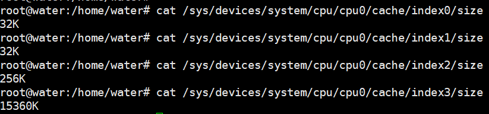


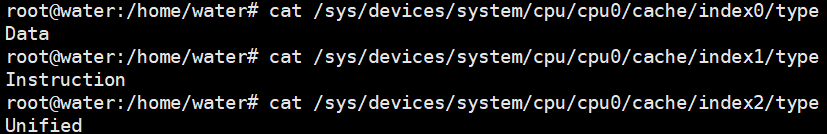


其中，**L1 Cache 通常会分为「数据缓存」和「指令缓存」**，这意味着数据和指令在 L1 Cache 这一层是分开缓存的，上图中的 `index0` 也就是数据缓存，而 `index1` 则是指令缓存，它两的大小通常是一样的。

另外，你也会注意到，L3 Cache 比 L1 Cache 和 L2 Cache 大很多，这是因为 **L1 Cache 和 L2 Cache 都是每个 CPU 核心独有的，而 L3 Cache 是多个 CPU 核心共享的。**

> A unified cache is *a cache that contains both code (instructions) and data*， 也就是说Unified是包含数据和指令的缓存

程序执行时，会先将内存中的数据加载到`共享的L3 Cache`中，再加载到每个核心独有的`L2 Cache`， 最后进入到最快的 L1 Cache，之后才会被 CPU 读取。


### CPU缓存的数据结构和读取过程

CPU cache是由很多个Cache Line组成的，`Cache Line是CPU从内存读取数据的基本单位`，而Cache Line是由各种标志(Tag) + 数据块(Data Block) 组成。


CPU Cache 的数据是从内存中读取过来的，它是以一小块一小块读取数据的，而不是按照单个数组元素来读取数据的，在 CPU Cache 中的，这样一小块一小块的数据，称为 **Cache Line（缓存行）**。

如下图，可以看出L1、L2、L3的cache line都是64字节

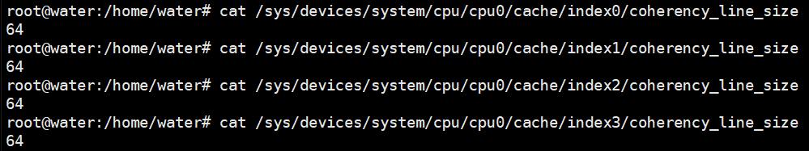


比如，有一个 `int array[100]` 的数组，当载入 `array[0]` 时，由于这个数组元素的大小在内存只占 4 字节，不足 64 字节，CPU 就会**顺序加载**数组元素到 `array[15]`，意味着 `array[0]~array[15]` 数组元素都会被缓存在 CPU Cache 中了，因此当下次访问这些数组元素时，会直接从 CPU Cache 读取，而不用再从内存中读取，大大提高了 CPU 读取数据的性能。


那 CPU 怎么知道要访问的内存数据，是否在 Cache 里？如果在的话，如何找到 Cache 对应的数据呢？

#### 直接映射Cache (Direct Mapped Cache)

CPU是按照coherency_line_size(64字节)去读取CPU缓存的，而在内存中，这一块的数据我们称为内存块(Block)，读取内存的时候需要拿到数据所在内存块的地址。

直接映射Cache就是将`内存块的地址`映射在一个`CPU Cache Line`的地址，至于映射关系实现方式则是使用`取模运算`，取模运算的结果就是内存块地址对应的CPU缓存块的地址。


*CPU*与*cache*之间的数据交换是以"Word"为*单位*，一个字的


------

## 1.4 什么是中断

中断是系统用来响应硬件设备请求的一种机制，操作系统收到硬件的中断请求，会打断正在执行的进程，然后`调用内核中的中断处理程序来响应请求`。

操作系统收到了中断请求，会打断其他进程的运行，所以**中断请求的响应程序，也就是中断处理程序，要尽可能快的执行完，这样可以减少对正常进程运行调度地影响。**

而且，中断处理程序在响应中断时，可能还会「临时关闭中断」，这意味着，如果当前中断处理程序没有执行完之前，系统中其他的中断请求都无法被响应，也就说中断有可能会丢失，所以中断处理程序要短且快。

### 软中断

Linux 系统**为了解决中断处理程序执行过长和中断丢失的问题，将中断过程分成了两个阶段，分别是「上半部和下半部分」**。

- **上半部直接处理硬件请求，也就是硬中断**，主要是负责耗时短的工作，特点是快速执行；
- **下半部是由内核触发，也就说软中断**，主要是负责上半部未完成的工作，通常都是耗时比较长的事情，特点是延迟执行；

再举一个计算机中的例子，常见的网卡接收网络包的例子。

网卡收到网络包后，通过 DMA 方式将接收到的数据写入内存，接着会通过**硬件中断**通知内核有新的数据到了，于是内核就会调用对应的中断处理程序来处理该事件，这个事件的处理也是会分成上半部和下半部。

上部分要做的事情很少，会先禁止网卡中断，避免频繁硬中断，而降低内核的工作效率。接着，内核会触发一个**软中断**，把一些处理比较耗时且复杂的事情，交给「软中断处理程序」去做，也就是中断的下半部，其主要是需要从内存中找到网络数据，再按照网络协议栈，对网络数据进行逐层解析和处理，最后把数据送给应用程序。

还有一个区别，硬中断（上半部）是会打断 CPU 正在执行的任务，然后立即执行中断处理程序，**而软中断（下半部）是以内核线程的方式执行，并且`每一个 CPU 都对应一个软中断内核线程`**，名字通常为「ksoftirqd/CPU 编号」，比如 0 号 CPU 对应的软中断内核线程的名字是 `ksoftirqd/0`


## 1.5 为什么0.1 + 0.2不等于0.3？

### 为什么负数要用补码表示？

以`int`类型的数字作为例子，int类型是`32`位，其中最高位作为**符号位**。

- 正数的符号位位0，剩下的31位则表示二进制数据
- 负数的符号位为1，剩下的31位是正数的二进制全部取反再加1

如果负数不是使用补码的方式表示，则在做基本对加减法运算的时候，**还需要多一步操作来判断是否为负数，如果为负数，还得把加法反转成减法，或者把减法反转成加法**。

**而用了补码的表示方式，对于负数的加减法操作，实际上是和正数加减法操作一样的**。


> 为什么负数要用补码表示？

负数之所以用补码的方式来表示，主要是为了统一和正数的加减法操作一样，毕竟数字的加减法是很常用的一个操作，就不要搞特殊化，尽量以统一的方式来运算。

> 十进制小数怎么转成二进制？

十进制整数转二进制使用的是「`除 2 取余法`」，十进制小数使用的是「`乘 2 取整法`」。


> 计算机是怎么存小数的？

计算机是以浮点数的形式存储小数的，大多数计算机都是 IEEE 754 标准定义的浮点数格式，包含三个部分：

- `符号位`：表示数字是正数还是负数，为 0 表示正数，为 1 表示负数；
- `指数位`：指定了小数点在数据中的位置，指数可以是负数，也可以是正数，指数位的长度越长则数值的表达范围就越大；
  - 指数位等于
  - 这个地方存储的是无符号整数，指数有可能是负数，所以这个地方加了一个偏移量127
  
- `尾数位`：小数点右侧的数字，也就是小数部分，比如二进制 1.0011 x 2^(-2)，尾数部分就是 0011，而且尾数的长度决定了这个数的精度，因此如果要表示精度更高的小数，则就要提高尾数位的长度；
  - 需要注意的是，一般情况下会把整数部分的1省略掉，不进行存储。

用 32 位来表示的浮点数，则称为单精度浮点数，也就是我们编程语言中的 float 变量，而用 64 位来表示的浮点数，称为双精度浮点数，也就是 double 变量。


> 0.1 + 0.2 == 0.3 吗？

1. 在计算机中，对于浮点数的存储，不是我们想象中的那种存储方式。拿float来举例子，float占用4个字节，也就是32位。其中，第一位是符号位，接着8位是指数位，最后23位表示尾数位。
2. 接下来举个小例子，10.625是如何存储的，首先`整数位`利用<u>除2法</u>来进行存储，而`小数位`用<u>乘2法</u>来进行存储，得到`1010.101`，那么会使用科学计数法来表示该数，即`1.010101 x 2^3`。之后存储的时候，符号位为0，指数位(3 + 127)为130(`10000010`), 尾数位只存储`0101010000....`。最后存储的就是`01000001 00101010 00000000 00000000`
3. 像上边那个例子存储的时候就不会有精度问题。而如果我们要存储的小数在转换的过程中有循环节的存在或者乘2法凑不到整数，那么存储的时候就会发生精度问题导致实际存储的数值和我们的预期的有偏差，例如：0.1，实际存储是`00111101 11001100 11001100 11001100`, 转化为10进制之后为`9.99999940395355224609375E-2`,完全不等于0.1。
4. 当然不一定是所有的小数都有这样的精度丢失问题，像`1/2 1/4 1/8 1/(2^n)`这种基本上不会出现这种情况。

不是的，0.1 和 0.2 这两个数字用二进制表达会是一个一直循环的二进制数，比如 0.1 的二进制表示为 0.0 0011 0011 0011… （0011 无限循环)，对于计算机而言，0.1 无法精确表达，这是浮点数计算造成精度损失的根源。

因此，IEEE 754 标准定义的浮点数只能根据精度舍入，然后用「近似值」来表示该二进制，那么意味着计算机存放的小数可能不是一个真实值。

0.1 + 0.2 并不等于完整的 0.3，这主要是因为这两个小数无法用「完整」的二进制来表示，只能根据精度舍入，所以计算机里只能采用近似数的方式来保存，那两个近似数相加，得到的必然也是一个近似数。


------

# 二、内存管理

## 2.1 32位寻址4G空间，64位128G？

> Going back to a really basic idea, we have 32 bits for our memory addresses. That works out to 2^32 unique combinations of addresses. By convention, each address points to 1 byte of data. Therefore, we can access up to a total 2^32 bytes of data

1. 32位系统中的32表示的是CPU一次能够处理二进制数据位数，而决定CPU寻址空间的是地址总线的宽度，通常为了能够方便、快速的支持并行传输，32位系统一般让地址总线的宽度等于CPU的位数，也就是说CPU寻址的空间就是0~2^32 - 1，也就是说CPU能够访问2^32个地址，又因为每个地址指向一个字节，所以我们可以访问`2 ^ 32 bytes`，也即4 GB。

> 补充：32、64位系统中的32、64代表什么？
>
> 1. 32、64位一般表示CPU能够一次性处理的二进制数据位数。
> 2. 例如在32位系统中，指令集架构、CPU寄存器位宽、物理内存寻址位数都是32位。
> 3. 一般为了并行传输，地址总线、数据总线也都是32位的。
>
> 注意：32位系统中，控制总线位数一般不等于系统的位数，因为实际中并没有那么多控制信号，一般使用8~16位来。


**注意一：此处指的寻址空间是物理内存寻址空间**

1. 地址总线是CPU和内存进行通信的桥梁，而地址总线位宽越大，CPU能够直接寻址的物理内存空间就越大。

2. 逻辑内存地址是操作系统对物理内存的抽象和管理，它通过虚拟内存机制将物理内存映射到逻辑地址，`逻辑地址空间理论上可以非常大，甚至是无限大`。==就好比在B+树中，通过增加树的层级来容纳更多的数据条数。在分页机制下，可以通过增加页表的层级来让操作系统能够访问到更多的虚拟内存空间==

   > 在实际应用中，考虑到层级数量和性能需求，并不会让逻辑地址空间非常大。在B+树种，增加层级会增加索引的查找次数(多次IO)；在分页机制下，增加层级会增加地址转换的开销。

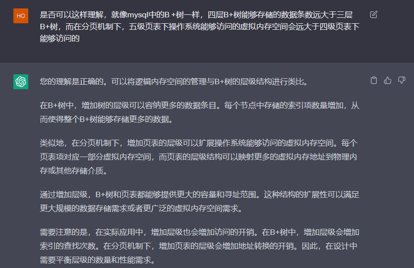

## 2.2 为什么要有虚拟内存

虚拟内存实际上是一种主存的抽象概念，`通过CPU的内存管理单元(MMU)将虚拟地址翻译为物理地址`，从而可以为进程提供独立的地址空间，同时保护进程的地址空间不被其他进程破坏。它使得应用程序认为它拥有连续的可用内存(一个连续完整的地址空间)，而实际上，它通常是被分割成多个物理内存碎片，还有部分暂时存储在外部磁盘存储器上。

如果程序要访问虚拟地址的时候，由操作系统转换成不同的物理地址，这样不同的进程运行的时候，写入的是不同的物理地址，这样就不会冲突了。

于是，这里就引出了两种地址的概念：

- 我们程序所使用的内存地址叫做**虚拟内存地址**（*Virtual Memory Address*）
- 实际存在硬件里面的空间地址叫**物理内存地址**（*Physical Memory Address*）。

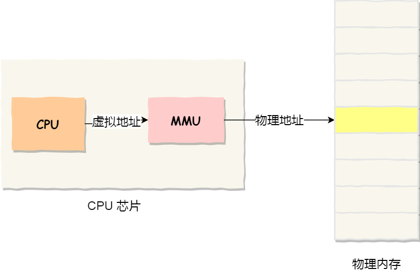


> 操作系统是如何管理虚拟地址与物理地址之间的关系？

主要通过以下两种方式来对内存进行划分：

- 分段
- 分页

### 内存分段

程序是由若干个逻辑分段组成的，如可由代码分段、数据分段、栈段、堆段组成。**不同的段是有不同的属性的，所以就用分段（Segmentation）的形式把这些段分离出来。**

分段机制下的虚拟地址由**段选择因子(段号 + 特权等标志位) + 段内偏移量**组成。

- **段选择因子**就保存在段寄存器里面。段选择因子里面最重要的是**段号**，用作段表的索引。**段表**里面保存的是这个**段的基地址、段的界限和特权等级**等。
- 虚拟地址中的**段内偏移量**应该位于 0 和段界限之间，如果段内偏移量是合法的，就将段基地址加上段内偏移量得到物理内存地址。


分段的方法很好，解决了程序本身不需要关心具体的物理内存地址的问题，但他也有一些不足之处：

1. 内存碎片(外部)
2. 内存交换的效率低

> 内存碎片主要分为**内部内存碎片**、**外部内存碎片**

内存分段管理可以做到根据段的实际需求分配内存，需要多少就分配多少，所以不会产生内部内存碎片。

但是由于每个段的长度不固定，而且多个段未必能够恰好使用所有的内存空间，所以会产生多个不连续的小物理内存，也即会产生外部内存碎片。

解决「外部内存碎片」的问题就是**内存交换**。

> 分段为什么会导致内存交换效率低的问题？

1. 对于多进程的系统来说，用分段的方式，外部内存碎片很容易就产生，就不得不重新swap内存区域，这个过程会产生瓶颈。
2. 因为硬盘的访问速度比内存慢太多，每一次内存交换，都需要把一大段连续的内存数据写到磁盘上。若内存交换时，交换的是一个占用很大内存空间的程序，那整个程序都会显得卡顿。

### 内存分页

分段的好处就是能产生连续的内存空间，但是会出现【外部碎片和内存交换的空间太大】的问题。

**分页是把整个虚拟和物理内存空间切成一段段固定尺寸的大小**。这样一个连续并且尺寸固定的内存空间，我们叫**页**（*Page*）。在 Linux 下，每一页的大小为 `4KB`。

虚拟地址与物理地址之间通过**页表**来映射，页表存储在内存中，并由MMU来负责虚拟地址到物理地址的转换。


而当进程访问的虚拟地址在页表中查不到时，系统会产生一个**缺页异常**，进入系统内核空间分配物理内存、更新进程页表，最后再返回用户空间，恢复进程的运行。

> 分页是怎么解决分段的「外部内存碎片和内存交换效率低」的问题？

**采用了分页，页与页之间是紧密排列的，所以不会有外部碎片。**

但是，因为内存分页机制分配内存的最小单位是一页，即使程序不足一页大小，我们最少只能分配一个页，所以页内会出现内存浪费，所以针对**内存分页机制会有内部内存碎片**的现象。

如果内存空间不够，操作系统会把其他正在运行的进程中的「最近没被使用」的内存页面给释放掉，也就是暂时写在硬盘上，称为**换出**（*Swap Out*）。一旦需要的时候，再加载进来，称为**换入**（*Swap In*）。所以，一次性写入磁盘的也只有少数的一个页或者几个页，不会花太多时间，**内存交换的效率就相对比较高。**


更进一步地，分页的方式使得我们在加载程序的时候，不再需要一次性都把程序加载到物理内存中。我们完全可以在进行虚拟内存和物理内存的页之间的映射之后，并不真的把页加载到物理内存里，而是**只有在程序运行中，需要用到对应虚拟内存页里面的指令和数据时，再加载到物理内存里面去。**


> 分页机制下，虚拟地址和物理地址是如何映射的？

在分页机制下，虚拟地址分为两部分，**页号**和**页内偏移**。页号作为页表的索引，**页表**包含物理页每页所在**物理内存的基地址**，这个基地址与页内偏移的组合就形成了物理内存地址，见下图。


总结一下，对于一个内存地址转换，其实就是这样三个步骤：

- 把虚拟内存地址，切分成页号和偏移量；
- 根据页号，从页表里面，查询对应的物理页号；
- 直接拿物理页号，加上前面的偏移量，就得到了物理内存地址。

> 简单的分页有什么缺陷吗？

主要就是空间方面浪费较大，所以引入了一种**多级页表**的解决方案：

我们把这个 100 多万个「页表项」的单级页表再分页，将页表（一级页表）分为 `1024` 个页表（二级页表），每个表（二级页表）中包含 `1024` 个「页表项」，形成**二级分页**。如下图所示：


> 你可能会问，分了二级表，映射 4GB 地址空间就需要 4KB（一级页表）+ 4MB（二级页表）的内存，这样占用空间不是更大了吗？

当然如果 4GB 的虚拟地址全部都映射到了物理内存上的话，二级分页占用空间确实是更大了，但是，我们往往不会为一个进程分配那么多内存。

如果使用了二级分页，一级页表就可以覆盖整个 4GB 虚拟地址空间，但**如果某个一级页表的页表项没有被用到，也就不需要创建这个页表项对应的二级页表了，即可以在需要时才创建二级页表**。做个简单的计算，假设只有 20% 的一级页表项被用到了，那么页表占用的内存空间就只有 4KB（一级页表） + 20% * 4MB（二级页表）= `0.804MB`，这对比单级页表的 `4MB` 是不是一个巨大的节约？

那么为什么不分级的页表就做不到这样节约内存呢？

我们从页表的性质来看，保存在内存中的页表承担的职责是将虚拟地址翻译成物理地址。假如虚拟地址在页表中找不到对应的页表项，计算机系统就不能工作了。所以**页表一定要覆盖全部虚拟地址空间，不分级的页表就需要有 100 多万个页表项来映射，而二级分页则只需要 1024 个页表项**（此时一级页表覆盖到了全部虚拟地址空间，二级页表在需要时创建）。


> 两者的区别：

**占用空间方面：**

- ==单级内存分页将整个虚拟地址空间划分为了一个大的页表，如果页的大小很小，那么页表就很大==，需要消耗大量的内存空间和访问开销。但是为了实现虚拟地址到物理地址的快速转换(使用偏移量计算出页表项的位置，复杂度降低到O1)，==每个进程中都需要存储这样的一个页表。==
- 多级内存分页将整个虚拟地址空间划分为多个层次，每个层次使用不同大小的页表，可以有效的减少页表的大小和访问开销。

**TLB(页表缓存)加速**

- 使用TLB提高了系统的性能和效率：多级内存分页可以通过缓存和预取技术，提高页表项的访问效率，从而减少内存访问的延迟和开销。
- TLB是位于CPU内部的页表缓存，有了 TLB 后，那么 CPU 在寻址时，会先查 TLB，如果没找到，才会继续查常规的页表。


### 段页式内存管理

内存分段和内存分页并不是对立的，他们是可以组合起来用在同一个系统中的，组合起来之后，通常称为**段页式内存管理**。

具体的：

1. 先将程序划分为多个由逻辑意义的段，
2. 接着再把每个段划分为多个页，也就是对段划分出的连续空间，再划分固定大小的页。

这样，逻辑地址结构就由**段号、段内页号和页内偏移**三部分组成。


用于段页式地址变换的数据结构是每一个程序一张段表，每个段又建立一张页表，段表中的地址是页表的起始地址，而页表中的地址则为某页的物理页号，如图所示：


段页式地址变换中要得到物理地址须经过三次内存访问：

- 第一次访问段表，得到页表起始地址；
- 第二次访问页表，得到物理页号；
- 第三次将物理页号与页内位移组合，得到物理地址。

可用软、硬件相结合的方法实现段页式地址变换，这样虽然增加了硬件成本和系统开销，但提高了内存的利用率


### Linux内存布局

**Linux 系统主要采用了分页管理，但是由于 Intel 处理器的发展史，Linux 系统无法避免分段管理**。于是 Linux 就把所有段的基地址设为 `0`，也就意味着所有程序的地址空间都是线性地址空间（虚拟地址），相当于屏蔽了 CPU 逻辑地址的概念，所以段只被用于访问控制和内存保护。

另外，Linux 系统中虚拟空间分布可分为**用户态**和**内核态**两部分，其中用户态的分布：代码段、全局变量、BSS、函数栈、堆内存、映射区。


> 最后，说下虚拟内存有什么作用？

- 第一，虚拟内存**可以使得进程对运行内存超过物理内存大小**，因为程序运行符合局部性原理，CPU 访问内存会有很明显的重复访问的倾向性，对于那些没有被经常使用到的内存，我们可以把它换出到物理内存之外，比如硬盘上的 swap 区域。
- 第二，由于每个进程都有自己的页表，所以每个进程的虚拟内存空间就是相互独立的。进程也没有办法访问其他进程的页表，所以这些页表是私有的，这就解决了多进程之间地址冲突的问题。
- 第三，**页表里的页表项中除了物理地址之外，还有一些标记属性的比特，比如控制一个页的读写权限，标记该页是否存在等**。在内存访问方面，操作系统提供了更好的安全性。


## 2.2 malloc是如何分配内存的？


---


# 三、进程、线程、协程

协程又叫纤程。


协程既不是进程也不是线程，协程仅是一个特殊的函数。协程、进程和线程不是一个维度的。

一个进程可以包含多个线程，一个线程可以包含多个协程。虽然一个线程内的多个协程可以切换但是这多个协程是串行执行的，某个时刻只能有一个线程在运行，没法利用CPU的多核能力。

协程与进程一样，也存在上下文切换问题。

- 进程的切换者是操作系统，切换时机是根据操作系统自己的切换策略来决定的，用户是无感的。进程的切换内容包括`页全局目录`、内核栈和硬件上下文，切换内容被保存在内存中。 进程切换过程采用的是“从用户态到内核态再到用户态”的方式，`切换效率低`。

- 线程的切换者是操作系统，切换时机是根据操作系统自己的切换策略来决定的，用户是无感的。线程的切换内容包括内核栈和硬件上下文。线程切换内容被保存在内核栈中。线程切换过程采用的是“从用户态到内核态再到用户态”的方式，`切换效率中等`。

- 协程的切换者是`用户(编程者或应用程序)`,切换时机是用户自己的程序来决定的。协程的切换内容是硬件上下文，切换内存被保存在用自己的变量(用户栈或堆)中。协程的切换过程只有用户态(即没有陷入内核态),因此切换效率高。


## 3.1 进程阻塞和线程阻塞的关系

近期我已经反复强调了好几遍，==在现代主流操作系统Windows和Linux上，不存在操作系统先选择要运行的进程、再从这个进程里面选择要运行的线程这种两层次调度机制==。

**在Linux上，CPU调度单位就是进程，线程只是一种特殊进程，跟其他进程是平等的；**而Windows上调度单位就是线程（也就是操作系统原理里面讲的进程，Windows的process其实是与CPU调度无关的别的的东西）。所以为了文字清晰，下面我会统一用进程这个名词来表述操作系统的CPU调度单位。用户级线程这个名词，近年通常被叫做协程，下面我也用协程来称呼它，简便一些。


### 线程系统调用阻塞是否导致进程阻塞的问题

> 问题： 如果一个进程中的某一个线程调用了一个阻塞的系统调用函数后，那么该进程包括该进程中的其他所有线程也同时被阻塞 ？

关于这个问题。网上有些解答似乎比较混乱。回答这个问题，首先要简单了解一下线程模型。
线程模型（下述对应关系为 “线程”对“内核调度实体”）

- 多对1用户级线程模型
  - 线程的创建、调度、同步，由所属进程的用户空间线程库实现。
  - 用户态线程，对内核几乎是透明的（许多操作不需要内核接管）
  - 但线程总要有一些操作经过内核，比如系统调用。
  - 不需要频繁的内核态/用户态切换，处理速度非常快。
  - `该模式下，当进程的某个线程，系统调用（比如I/O）阻塞时，该进程也会阻塞。`
  - 原因：该模式下，进程的所有线程，都对应一个内核调度实体（KES），并且内核不知道这个进程有哪些线程。KES无法将其他线程，调度到其他处理器上。该进程（所有的线程）被阻塞，直到本次系统调用（比如I/O）结束。
- 1对1内核级线程模型**（目前（linux）基本上都采用一对一模型。）**
  - 每个用户线程都对应一个的内核调度实体。
  - 内核会对每个线程进行调度，可以调度到其他处理器上。
  - 线程每次操作会在用户态和内核态切换。
  - 线程数量过多时，对系统性能有影响。
- 多对多两级线程模型
  - 每个用户线程拥有多个内核调度实体
  - 多个用户线程也可以对应一个内核调度实体
  - 实现该模型非常复杂。

**总结**
线程系统调用阻塞时，在多对1用户级线程模型下，会导致所属进程阻塞。
在1对1或多对多模型下，不会导致该问题的发生。
如果是单进程单线程的话，不管哪个模型，都会阻塞的。


## 3.2 ssh连接上终端是否会创建进程

1. 首先当你通过ssh连接上终端时，OS会自动为你启动一个shell/bash进程。

   1. 可通过`echo $$`查看该进程的PID
   2. 这个Bash进程负责解析你输入的命令，并将其发送给相应的程序进行处理。Bash进程也负责执行脚本文件和管理各种操作，如环境变量、文件描述符等。

2. 当你在bash进程中输入命令并按下回车时，是否会创建进程取决于命令的类型

   1. 一般来讲，有一些常见的创建新进程的命令和不创建新进程的命令：

      ```shell
      创建新进程的命令(外部命令)：
      
      1. 任何外部命令，如`ls`、`cat`、`grep`等。
      2. 执行脚本文件，例如`bash script.sh`，其中`script.sh`是一个可执行的脚本文件。
      3. 启动新的子Shell，例如通过`bash`命令或直接输入`bash`来开启一个新的Bash子Shell。
      4. 后台执行的命令，使用`&`符号将命令放在后台运行，例如`command &`。
      
      不创建新进程的命令（内建命令）：
      Ps：不绝对，比如echo可能
      
      1. 环境相关命令，如`export`、`unset`，用于设置和取消环境变量。
      2. 目录相关命令，如`cd`，用于改变当前工作目录。
      3. 文件操作命令，如`echo`、`touch`，用于创建文件或打印输出。
      4. Shell控制命令，如`exit`，用于退出当前Shell。
      5. Shell内置的流程控制命令，如`if`、`for`、`while`，用于条件判断和循环控制。
      ```

   2. 内部命令和外部命令的区别：

      - 内置命令与外部命令的主要区别在于内置命令被编译进Shell程序中，不需要启动新的进程，执行速度更快，但功能相对简单；而外部命令需要通过文件系统中的可执行文件来执行，需要启动新的进程，执行速度相对较慢，但功能更加强大。

      > 1. 内部命令是Shell自带的命令，他们被编译进Shell程序中，当Shell解释器在执行命令时，不需要启动新的进程，直接在当前shell/bash进程执行命令。因此内部命令执行的速度比外部命令执行的速度较快，且不需要额外的系统调用。
      > 2. 外部命令是存储在文件系统的可执行文件，他们不属于Shell程序的一部分。当Shell解释器在执行外部命令的时候，需要启动新的进程来运行该命令。因此外部命令执行速度比内部命令慢，且需要额外的系统调用。

   3. 严格来讲，可通过`type`命令判断命令为内部命令或外部命令，从而得知是否会创建新的进程。
   
      ```bash
      $: type cd
      cd is a shell builtin #内建命令
      
      $: type ls
      ls is aliased to `ls --color=auto`   #别名
      
      $: type -a ls  #查找出所有跟ls匹配的记录
      ls is aliased to `ls --color=auto` 
      ls is /usr/bin/ls
      ls is /bin/ls
      ls is aliased to `ls --color=auto`
      ls is /usr/bin/ls
      ls is /bin/ls
      
      $: type -t /bin/ls
      file	# 外部命令
      
      $: type ps
      ps is /usr/bin/ps # 外部命令
      ```
   


## 3.3 Linux下进程的最大数、最大线程数、进程打开的文件数

### 3.3.1 进程的最大数

### 3.3.2 一个进程最多能够创建多少个线程

这个问题受限于两个因素：

1. `进程的虚拟内存空间上限`：创建一个线程就需要OS为其分配一个栈空间，如果线程数量越多，所需的栈空间就越大，那么需要的虚拟内存就越多。
2. `系统参数限制`：Linux系统虽然没有指定单个进程最多能够创建的线程数量，但是指定了整个系统能够创建的最大线程个数。

**① 考虑虚拟内存上限：**

1. 线程共享进程的内存空间，所以只需要给线程分配栈空间，那么创建一个线程默认需要分配多大的栈空间？
   1. `ulimit -s`可以查看进程创建线程时默认分配的栈空间的大小。
   2. `ulimit -n`可以查看进程最大能够打开的文件数。
   3. 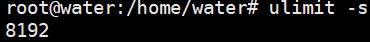左侧是在我的服务器上执行的结果，大概8M。
2. 在linux系统中，32位、64位创建线程有什么不同？

   > 在Linux系统中，虚拟地址空间又被分为<u>内核空间</u>和<u>用户空间</u>，不同位数的系统，用户地址空间的范围不同
   >
   > - 在32位中，内核空间占1G，用户空间占3G
   > - 在64位中，内核空间和用户空间都是128T，分别占据整个内存空间的最高处和最低处，中间那部分空间未定义，我想应该是为了便于扩展使得两部分空间都是连续的。

   1. 在32位中，一个进程能够创建的个数 ≈ 用户空间的大小(3G) / 默认分配的栈空间的大小(8M) = 375
   2. 在64位中，理论上，按照公式`一个进程能够创建的个数 ≈ 用户空间的大小(128T) / 默认分配的栈空间的大小(8M) = 16 000 000`能够创建一千六百万个线程，但是实际上会受系统的限制。

**② 考虑系统参数限制：**

在Linux系统中，会受以下参数的限制，具体参数的数值是我自己的服务器的参数：

1. ***/proc/sys/kernel/threads-max***，表示系统支持的最大线程数，默认值是 `126462`；
2. ***/proc/sys/kernel/pid_max***，表示系统全局的 PID 号数值的限制，每一个进程或线程都有 ID，ID 的值超过这个数，进程或线程就会创建失败，默认值是 `4194304`；
3. ***/proc/sys/vm/max_map_count***，表示限制一个进程可以拥有的VMA(虚拟内存区域)的数量，具体什么意思我也没搞清楚，反正如果它的值很小，也会导致创建线程失败，默认值是 `65530`。

**综上所述：**

- 32位系统，默认最多能创建三百多个
- 64位系统，理论上是1600万个线程，但实际上还会受系统的参数和性能限制。


# 三、文件系统

## 文件描述符

### 基本概念

`文件描述符（File descriptor）`形式上是一个非负整数，从 **0** 开始。进程使用文件描述符来表示一个打开的文件。实际上，它是一个索引值，指向内核为每一个进程所维护的该进程打开文件的记录表。操作系统为每一个进程维护了一个文件描述符`表`，表示该进程打开文件的记录表，而文件描述符实际上就是这张表的索引。当进程打开(open) 或新建(create) 文件时，内核会在该进程的文件列表中新增一个表项，同时返回一个文件描述符 —— 也就是新增表项的下标。

`文件描述符的作用是什么？`每一个进程都有一个数据结构 `task_struct`，该结构体里有一个指向`「文件描述符数组」`的成员指针。**该数组里列出这个进程打开的所有文件的文件描述符**。数组的下标是文件描述符，是一个整数，而数组的内容是一个指针，指向内核中所有打开的文件的列表，也就是说内核可以通过文件描述符找到对应打开的文件。

每个进程默认都有 3 个文件描述符：0 (stdin)、1 (stdout)、2 (stderr)。

> - Linux系统上查看能够打开的最大文件数
>
>   1. `ulimit -n`命令用于查看或设置`当前用户或进程`能够打开的最大文件数（文件描述符限制）。
>
>   1. `cat /proc/sys/fs/file-max`命令用于查看`整个系统`能够打开的最大文件数（系统级别的文件描述符限制）。这个值由操作系统内核设置，并适用于整个系统的所有用户和进程。
>
> 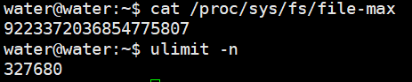
>
> - 查看某个进程的文件描述符表的详细信息
>   - `ls -l /proc/<PID>/fd`：该命令将显示指定进程的文件描述符表的详细信息，包括每个文件描述符的相关信息和指向的文件路径。

### fd与socket的关系

socket可以用于同一台主机间不同进程的通信，也可以用于不同主机间的通信。一个socket包含地址、类型、通信协议等信息，通过`socket()`函数创建，该函数返回的就是 socket 对应的文件描述符 fd。

```c++
int socket (int domain, int type, int protocal)
```

操作系统将 socket 映射到进程的一个文件描述符上，进程就可以通过读写这个文件描述符来和远程主机通信。

socket 是进程间通信规则的高层抽象，而 fd 提供的是底层的具体实现。socket 与 fd 是一一对应的。通过 socket 通信，实际上就是通过文件描述符 fd 读写文件。这也符合 Unix“一切皆文件”的哲学。

> 在linux系统下，可以通过`ss -tunap`、`lsof -p 进程号`来查看系统或指定进程打开的文件和文件描述符。


------

# 四、网络系统

## 补充：网络包接收流程

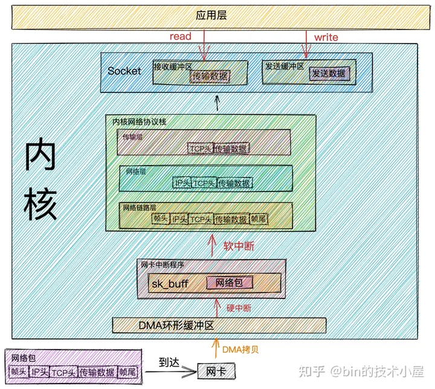

- 当`网络数据帧`通过网络传输到达网卡时，网卡会将网络数据帧通过`DMA的方式`放到`环形缓冲区RingBuffer`中。

> `RingBuffer`是网卡在启动的时候`分配和初始化`的`环形缓冲队列`。当`RingBuffer满`的时候，新来的数据包就会被`丢弃`。我们可以通过`ifconfig`命令查看网卡收发数据包的情况。其中`overruns`数据项表示当`RingBuffer满`时，被`丢弃的数据包`。如果发现出现丢包情况，可以通过`ethtool命令`来增大`RingBuffer`长度。

- 当`DMA操作完成`时，网卡会向CPU发起一个`硬中断`，告诉`CPU`有网络数据到达。CPU调用网卡驱动注册的`硬中断响应程序`。网卡硬中断响应程序会为网络数据帧创建内核数据结构`sk_buffer`，并将网络数据帧`拷贝`到`sk_buffer`中。然后发起`软中断请求`，通知`内核`有新的网络数据帧到达。

> `sk_buff`缓冲区，是一个维护网络帧结构的`双向链表`，链表中的每一个元素都是一个`网络帧`。虽然 TCP/IP 协议栈分了好几层，但上下不同层之间的传递，实际上只需要操作这个数据结构中的指针，而`无需进行数据复制`。

- 内核线程`ksoftirqd`发现有软中断请求到来，随后调用网卡驱动注册的`poll函数`，`poll函数`将`sk_buffer`中的`网络数据包`送到内核协议栈中注册的`ip_rcv函数`中。

> `每个CPU`会绑定`一个ksoftirqd`内核线程`专门`用来处理`软中断响应`。2个 CPU 时，就会有 `ksoftirqd/0` 和 `ksoftirqd/1`这两个内核线程。
>
> **这里有个事情需要注意下：** 网卡接收到数据后，当`DMA拷贝完成`时，向CPU发出`硬中断`，这时`哪个CPU`上响应了这个`硬中断`，那么在网卡`硬中断响应程序`中发出的`软中断请求`也会在`这个CPU绑定的ksoftirqd线程`中响应。所以如果发现Linux软中断，CPU消耗都`集中在一个核上`的话，那么就需要调整硬中断的`CPU亲和性`，来将硬中断`打散`到`不通的CPU核`上去。

- 在`ip_rcv函数`中也就是上图中的`网络层`，`取出`数据包的`IP头`，判断该数据包下一跳的走向，如果数据包是发送给本机的，则取出传输层的协议类型（`TCP`或者`UDP`)，并`去掉`数据包的`IP头`，将数据包交给上图中得`传输层`处理。

> 传输层的处理函数：`TCP协议`对应内核协议栈中注册的`tcp_rcv函数`，`UDP协议`对应内核协议栈中注册的`udp_rcv函数`。

- 当我们采用的是`TCP协议`时，数据包到达传输层时，会在内核协议栈中的`tcp_rcv函数`处理，在tcp_rcv函数中`去掉`TCP头，根据`四元组（源IP，源端口，目的IP，目的端口）`查找`对应的Socket`，如果找到对应的Socket则将网络数据包中的传输数据拷贝到`Socket`中的`接收缓冲区`中。如果没有找到，则发送一个`目标不可达`的`icmp`包。
- 内核在接收网络数据包时所做的工作我们就介绍完了，现在我们把视角放到应用层，当我们程序通过系统调用`read`读取`Socket接收缓冲区`中的数据时，如果接收缓冲区中`没有数据`，那么应用程序就会在系统调用上`阻塞`，直到Socket接收缓冲区`有数据`，然后`CPU`将`内核空间`（Socket接收缓冲区）的数据`拷贝`到`用户空间`，最后系统调用`read返回`，应用程序`读取`数据。

### **性能开销**

从内核处理网络数据包接收的整个过程来看，内核帮我们做了非常之多的工作，最终我们的应用程序才能读取到网络数据。

随着而来的也带来了很多的性能开销，结合前面介绍的网络数据包接收过程我们来看下网络数据包接收的过程中都有哪些性能开销：

- 应用程序通过`系统调用`从`用户态`转为`内核态`的开销以及系统调用`返回`时从`内核态`转为`用户态`的开销。
- 网络数据从`内核空间`通过`CPU拷贝`到`用户空间`的开销。
- 内核线程`ksoftirqd`响应`软中断`的开销。
- `CPU`响应`硬中断`的开销。
- `DMA拷贝`网络数据包到`内存`中的开销。

## 什么是零拷贝？

磁盘可以说是计算机系统最慢的硬件之一，读写速度相差内存10倍以上，所以针对优化磁盘的技术非常的多，比如零拷贝、直接 I/O、异步 I/O 等等，这些优化的目的就是为了提高系统的吞吐量，另外操作系统内核中的磁盘高速缓存区，可以有效的减少磁盘的访问次数。

我们就以「文件传输」作为切入点，来分析 I/O 工作方式，以及如何优化传输文件的性能。

### DMA技术

在没有DMA技术前，I/O的过程是这样的：

1. CPU 发出对应的指令给磁盘控制器，然后返回；
2. 磁盘控制器收到指令后，于是就开始准备数据，会把数据放入到磁盘控制器的内部缓冲区中，然后产生一个**中断**；
3. CPU 收到中断信号后，停下手头的工作，接着把磁盘控制器的缓冲区的数据一次一个字节地读进自己的寄存器，然后再把寄存器里的数据写入到内存，而在数据传输的期间 CPU 是无法执行其他任务的。

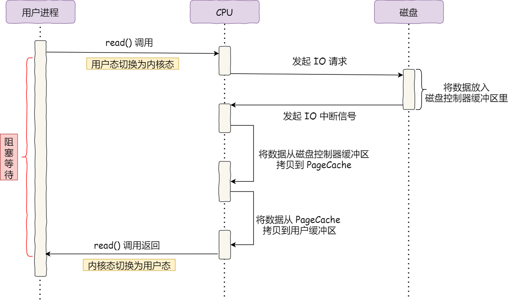

从上图可以看到，整个数据的传输过程都需要CPU亲自参与搬运数据，而且这个过程，CPU不能做其他事情。

什么是 DMA 技术？简单理解就是，**在进行 I/O 设备和内存的数据传输的时候，数据搬运的工作全部交给 DMA 控制器，而 CPU 不再参与任何与数据搬运相关的事情，这样 CPU 就可以去处理别的事务**。


#### 使用DMA控制器进行数据传输


具体过程：

- 用户进程调用 read 方法，向操作系统发出 I/O 请求，请求读取数据到自己的内存缓冲区中，进程进入阻塞状态；
- 操作系统收到请求后，进一步将 I/O 请求发送 DMA，`然后让 CPU 执行其他任务`；
- DMA 进一步将 I/O 请求发送给磁盘；
- 磁盘收到 DMA 的 I/O 请求，把数据从磁盘读取到磁盘控制器的缓冲区中，当磁盘控制器的缓冲区被读满后，向 DMA 发起中断信号，告知自己缓冲区已满；
- **==DMA 收到磁盘的信号，将磁盘控制器缓冲区中的数据拷贝到内核缓冲区中，此时不占用 CPU，CPU 可以执行其他任务==**；
- 当 DMA 读取了足够多的数据，就会发送中断信号给 CPU；
- CPU 收到 DMA 的信号，知道数据已经准备好，于是将数据从内核拷贝到用户空间，系统调用返回；

可以看到，==CPU 不再参与「将数据从磁盘控制器缓冲区搬运到内核空间」的工作，这部分工作全程由 DMA 完成== 。但是 CPU 在这个过程中也是必不可少的，因为传输什么数据，从哪里传输到哪里，都需要 CPU 来告诉 DMA 控制器。

早期 DMA 只存在在主板上，如今由于 I/O 设备越来越多，数据传输的需求也不尽相同，所以每个 I/O 设备里面都有自己的 DMA 控制器。


### 传统的文件传输(4拷贝、4切换)

传统 I/O 的工作方式是，==数据读取和写入是从用户空间到内核空间`来回复制`，而内核空间的数据是通过操作系统层面的 I/O 接口从磁盘读取或写入==。

代码通常如下，一般会需要两个系统调用：

```cpp
read(file, tmp_buf, len);
write(socket, tmp_buf, len);
```

虽然就两行代码，但是这里面发生了不少事情。

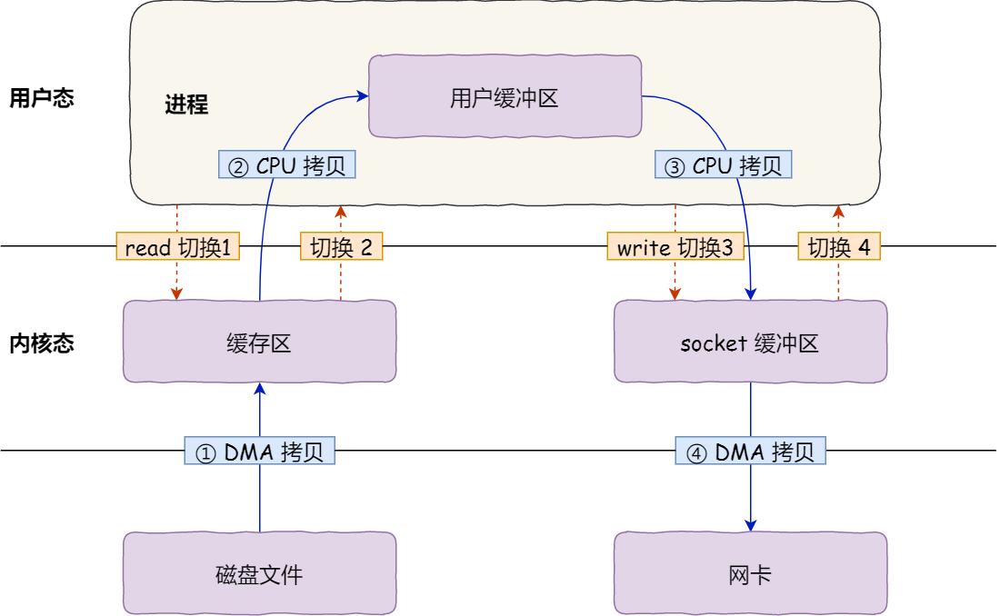

- 期间发生了**`4`**次用户态与内核态的上下文切换。
- 一次是 `read()` ，一次是 `write()`，每次系统调用都得先从用户态切换到内核态，等内核完成任务后，再从内核态切换回用户态。


其次，还**发生了 4 次数据拷贝**，其中两次是 DMA 的拷贝，另外两次则是通过 CPU 拷贝的，下面说一下这个过程：

- *第一次拷贝*，把磁盘上的数据拷贝到操作系统内核的缓冲区里，这个拷贝的过程是通过 DMA 搬运的。
- *第二次拷贝*，把内核缓冲区的数据拷贝到用户的缓冲区里，于是我们应用程序就可以使用这部分数据了，这个拷贝到过程是由 CPU 完成的。
- *第三次拷贝*，把刚才拷贝到用户的缓冲区里的数据，再拷贝到内核的 socket 的缓冲区里，这个过程依然还是由 CPU 搬运的。
- *第四次拷贝*，把内核的 socket 缓冲区里的数据，拷贝到网卡的缓冲区里，这个过程又是由 DMA 搬运的。


过多的数据拷贝无疑会消耗 CPU 资源，大大降低了系统性能。

总结来说，传统的数据传送所消耗的成本：`4 次拷贝，4 次上下文切换`。 4 次拷贝，其中两次是 DMA copy，两次是 CPU copy。


> 如何优化文件传输的性能？
>
> 1. 减少【用户态与内核态的上下文切换】的次数
>    1. 减少系统调用的次数。
> 2. 减少【数据拷贝】的次数
>    1. 四次拷贝中，从内核的读缓冲区拷贝到用户的缓冲区里，再从用户的缓冲区里拷贝到socket的缓冲区里，这两个拷贝过程没有必要。


### 如何实现零拷贝？

目的：减少 IO 流程中不必要的拷贝，当然零拷贝需要 OS 支持，也就是需要 kernel 暴露 API。

#### mmap内存映射(3拷贝、4切换)

硬盘上文件的位置和应用程序缓冲区(application buffers)进行映射（建立一种一一对应关系），由于`mmap()`将文件直接映射到用户空间，所以实际文件读取时根据这个映射关系，**直接将文件从硬盘拷贝到用户空间，只进行了一次数据拷贝，不再将文件内容从硬盘拷贝到内核空间的一个缓冲区**。

1. 应用进程调用了 `mmap()` 后，DMA 会把磁盘的数据拷贝到内核的缓冲区里。接着，应用进程跟操作系统内核「共享」这个缓冲区；
2. 应用进程再调用 `write()`，操作系统直接将内核缓冲区的数据拷贝到 socket 缓冲区中，这一切都发生在内核态，由 CPU 来搬运数据；
3. 最后，用DMA把内核的 socket 缓冲区里的数据，拷贝到网卡的缓冲区里。


`mmap`内存映射将会经历：

- 3 次拷贝: 1 次 cpu copy，2 次 DMA copy； 
- 4 次上下文切换，调用 mmap 函数 2 次，write 函数 2 次。
- 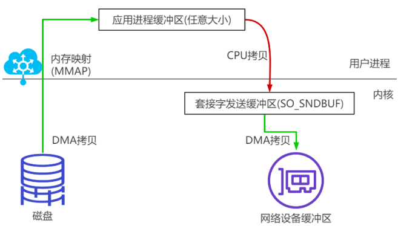

#### sendfile(3/2拷贝，2切换)

linux 2.1 支持的 sendfile

当调用 `sendfile()`时，

1. DMA将磁盘数据复制到 kernel buffer，
2. 然后将内核中的 kernel buffer 直接拷贝到 socket buffer
   1. 如果设备支持(网卡支持 SG-DMA)
      1. **数据并未被真正复制到 socket 关联的缓冲区内**。取而代之的是，`只有记录数据位置和长度的描述符被加入到 socket 缓冲区中`。
      2. DMA模块将数据直接从内核缓冲区传递给协议引擎，从而消除了遗留的最后一次复制。但是要注意，这个需要 DMA 硬件设备支持。
   2. 如果设备不支持
      1. 如果不支持，CPU就必须介入进行拷贝。
3. 一旦数据全都拷贝到 socket buffer，sendfile()系统调用将会 return，代表数据转化的完成。socket buffer 里的数据就能在网络传输了。 


sendfile 会经历：

- 3（2，如果硬件设备支持）次拷贝，1（0，如果硬件设备支持）次 CPU copy， 2 次 DMA copy； 
- 2 次上下文切换


|                        如果设备不支持                        |                         如果设备支持                         |
| :----------------------------------------------------------: | :----------------------------------------------------------: |
|  |  |


#### splice(2拷贝、2切换)

Linux 从 2.6.17 支持

splice 数据从磁盘读取到 OS 内核缓冲区后，在内核缓冲区直接可将其转成内核空间其他数据 buffer，而不需要拷贝到用户空间。

如下图所示，从磁盘读取到内核 buffer 后，在内核空间直接与 socket buffer 建立 pipe 管道。

和 sendfile()不同的是，`splice()不需要硬件支持`。

注意 splice 和 sendfile 的不同:

- sendfile 是 DMA 硬件设备不支持的情况下将磁盘数据加载到 kernel buffer 后，需要一次 CPU copy，拷贝到 socket buffer。而 splice 是更进一步，连这个CPU copy也不需要了，直接将两个内核空间的 buffer 进行 pipe。 

splice 会经历 2 次拷贝:

- 0 次 cpu copy, 2 次 DMA copy
- 2 次上下文切换
- 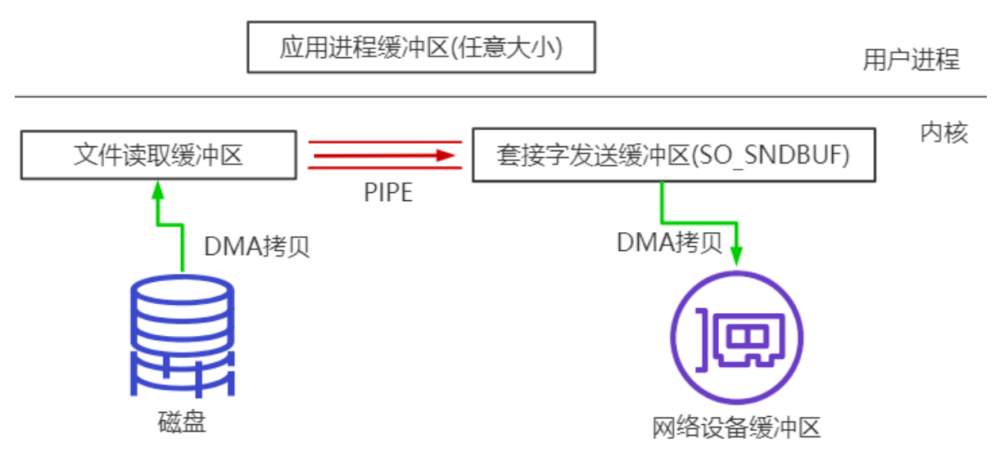


#### 总结

最早的零拷贝定义，来源于 Linux 2.4 内核新增 sendfile 系统调用，提供了零拷贝。磁盘数据通过 DMA 拷贝到内核 态 Buffer 后，直接通过 DMA 拷贝到 NIO Buffer(socket buffer)，无需 CPU 拷贝。这也是零 拷贝这一说法的来源。这是真正操作系统 意义上的零拷贝(也就是狭义零拷贝)。 随着发展，零拷贝的概念得到了延伸，就是目前的减少不必要的数据拷贝都算作零拷贝 的范畴。


### 零拷贝的应用

1. Nginx 也支持零拷贝技术，一般默认是开启零拷贝技术，这样有利于提高文件传输的效率，是否开启零拷贝技术的配置`http{sendfile on;}`
   1. 设置为 on 表示，使用零拷贝技术来传输文件：sendfile ，这样只需要 2 次上下文切换，和 2 次数据拷贝。
   2. 设置为 off 表示，使用传统的文件传输技术：read + write，这时就需要 4 次上下文切换，和 4 次数据拷贝。
2. Kafka好像也利用了**零拷贝**技术，从而大幅提升了 I/O 的吞吐率。

------

## PageCache 有什么作用？

回顾前面说道文件传输过程，其中第一步`都是先需要先把磁盘文件数据拷贝「内核缓冲区」里，这个「内核缓冲区」实际上是磁盘高速缓存（PageCache）`。

由于**零拷贝使用了 PageCache 技术**，可以使得零拷贝进一步提升了性能，我们接下来看看 PageCache 是如何做到这一点的:


读写磁盘相比读写内存的速度慢太多了，所以我们应该想办法把「读写磁盘」替换成「读写内存」。于是，我们会通过 DMA 把磁盘里的数据搬运到内存里，这样就可以用读内存替换读磁盘。

但是，内存空间远比磁盘要小，内存注定只能拷贝磁盘里的一小部分数据。那问题来了，选择哪些磁盘数据拷贝到内存呢？

我们都知道程序运行的时候，具有「局部性」，所以通常，`刚被访问的数据在短时间内再次被访问的概率很高，于是我们可以用 **PageCache 来缓存最近被访问的数据**，当空间不足时淘汰最久未被访问的缓存`。

所以，`读磁盘数据的时候，优先在 PageCache 找，如果数据存在则可以直接返回；如果没有，则从磁盘中读取，然后缓存 PageCache 中`。

还有一点，读取磁盘数据的时候，需要找到数据所在的位置，但是对于机械磁盘来说，就是通过磁头旋转到数据所在的扇区，再开始「顺序」读取数据，但是旋转磁头这个物理动作是非常耗时的，为了降低它的影响，**PageCache 使用了「预读功能」**。

比如，假设 read 方法每次只会读 `32 KB` 的字节，虽然 read 刚开始只会读 0 ～ 32 KB 的字节，但内核会把其后面的 32～64 KB 也读取到 PageCache，这样后面读取 32～64 KB 的成本就很低，如果在 32～64 KB 淘汰出 PageCache 前，进程读取到它了，收益就非常大。

所以，`PageCache 的优点主要是两个`：

- `**缓存最近被访问的数据；**`
- `**预读功能；**`

这两个做法，将大大提高读写磁盘的性能。

**但是，在传输大文件（GB 级别的文件）的时候，PageCache 会不起作用，那就白白浪费 DMA 多做的一次数据拷贝，造成性能的降低，即使使用了 PageCache 的零拷贝也会损失性能**

这是因为如果你有很多 GB 级别文件需要传输，每当用户访问这些大文件的时候，内核就会把它们载入 PageCache 中，于是 PageCache 空间很快被这些大文件占满。

另外，由于文件太大，可能某些部分的文件数据被再次访问的概率比较低，这样就会带来 2 个问题：

- PageCache 由于长时间被大文件占据，其他「热点」的小文件可能就无法充分使用到 PageCache，于是这样磁盘读写的性能就会下降了；
- PageCache 中的大文件数据，由于没有享受到缓存带来的好处，但却耗费 DMA 多拷贝到 PageCache 一次；

所以，针对大文件的传输，不应该使用 PageCache，也就是说不应该使用零拷贝技术，因为可能由于 PageCache 被大文件占据，而导致「热点」小文件无法利用到 PageCache，这样在高并发的环境下，会带来严重的性能问题。

------

## 大文件传输用什么方式实现？

那针对大文件的传输，我们应该使用什么方式呢？

| 原来的例子(会阻塞)                                           | 利用异步IO解决阻塞                                           |
| ------------------------------------------------------------ | ------------------------------------------------------------ |
| 1. 当调用 read 方法时，`会阻塞着`，此时内核会向磁盘发起 I/O 请求，磁盘收到请求后，便会寻址，当磁盘数据准备好后，就会向内核发起 I/O 中断，告知内核磁盘数据已经准备好；<br />2. 内核收到 I/O 中断后，就将数据从磁盘控制器缓冲区拷贝到 PageCache 里；<br />3. 最后，内核再把 PageCache 中的数据拷贝到用户缓冲区，于是 read 调用就正常返回了。 | 1. 前半部分，内核向磁盘发起读请求，但是可以**不等待数据就位就可以返回**，于是进程此时可以处理其他任务；<br />2. 后半部分，当内核将磁盘中的数据拷贝到进程缓冲区后，进程将接收到内核的**通知**，再去处理数据； |
|  |  |
| 当调用 read 方法读取文件时，进程实际上会阻塞在 read 方法调用，因为要等待磁盘数据的返回 | 异步 I/O 并没有涉及到 PageCache，所以使用异步 I/O 就意味着要绕开 PageCache |

`绕开 PageCache 的 I/O 叫直接 I/O，使用 PageCache 的 I/O 则叫缓存 I/O`。

通常，对于磁盘，异步 I/O 只支持直接 I/O。

前面也提到，大文件的传输不应该使用 PageCache，因为可能由于 PageCache 被大文件占据，而导致「热点」小文件无法利用到 PageCache。

于是，**`在高并发的场景下，针对大文件的传输的方式，应该使用「异步 I/O + 直接 I/O」来替代零拷贝技术`**。


**直接 I/O 应用场景常见的两种：**

- 应用程序已经实现了磁盘数据的缓存，那么可以不需要 PageCache 再次缓存，减少额外的性能损耗。在 MySQL 数据库中，可以通过参数设置开启直接 I/O，**默认是不开启**；
- 传输大文件的时候，由于大文件难以命中 PageCache 缓存，而且会占满 PageCache 导致「热点」文件无法充分利用缓存，从而增大了性能开销，因此，这时应该使用直接 I/O。


另外，由于直接 I/O 绕过了 PageCache，就无法享受内核的这两点的优化：

- 内核的 I/O 调度算法会缓存尽可能多的 I/O 请求在 PageCache 中，最后「**合并**」成一个更大的 I/O 请求再发给磁盘，这样做是为了减少磁盘的寻址操作；
- 内核也会「**预读**」后续的 I/O 请求放在 PageCache 中，一样是为了减少对磁盘的操作；

于是，传输大文件的时候，使用「异步 I/O + 直接 I/O」了，就可以无阻塞地读取文件了。


所以，传输文件的时候，我们要根据文件的大小来使用不同的方式：

- ==传输大文件的时候，使用「异步 I/O + 直接 I/O」==；
- ==传输小文件的时候，则使用「零拷贝技术」==；


在 nginx 中，我们可以用如下配置，来根据文件的大小来使用不同的方式：

```text
location /video/ { 
    sendfile on; 
    aio on; 
    directio 1024m; 
}
```

当文件大小大于 `directio` 值后，使用「异步 I/O + 直接 I/O」，否则使用「零拷贝技术」。


------

## Java生态圈中的零拷贝

Linux 提供的零拷贝技术 Java 并不是全支持，支持 2 种(内存映射 mmap、sendfile)；


**NIO提供的内存映射 MappedByteBuffer**

NIO中的FileChannel.map()方法其实就是采用了操作系统中的内存映射方式，底层就是调用Linux mmap()实现的。

将内核缓冲区的内存和用户缓冲区的内存做了一个地址映射。这种方式适合读取大文件，同时也能对文件内容进行更改，但是如果其后要通过SocketChannel发送，还是需要CPU进行数据的拷贝。

**NIO提供的sendfile**

Java NIO 中提供的 FileChannel 拥有 transferTo 和 transferFrom 两个方法，可直接把 FileChannel 中的数据拷贝到另外一个 Channel，或者直接把另外一个 Channel 中的数据拷贝到 FileChannel。该接口常被用于高效的网络 / 文件的数据传输和大文件拷贝。在操作系统支持的情况下，通过该方法传输数据并不需要将源数据从内核态拷贝到用户态，再从用户态拷贝到目标通道的内核态，同时也避免了两次用户态和内核态间的上下文切换，也即使用了“零拷贝”，所以其性能一般高于 Java IO 中提供的方法。


**Netty的零拷贝实现**

Netty 的零拷贝主要包含三个方面：

在网络通信上，Netty 的接收和发送 ByteBuffer 采用 DIRECT BUFFERS，使用堆外直接内存进行 Socket 读写，不需要进行字节缓冲区的二次拷贝。如果使用传统的堆内存（HEAP BUFFERS）进行 Socket 读写，JVM 会将堆内存 Buffer 拷贝一份到直接内存中，然后才写入 Socket 中。相比于堆外直接内存，消息在发送过程中多了一次缓冲区的内存拷贝。

在缓存操作上，Netty提供了CompositeByteBuf类，它可以将多个ByteBuf合并为一个逻辑上的ByteBuf，避免了各个ByteBuf之间的拷贝。

通过wrap操作，我们可以将byte[]数组、ByteBuf、 ByteBuffer 等包装成一个 Netty ByteBuf对象，进而避免了拷贝操作。

ByteBuf支持slice 操作，因此可以将ByteBuf分解为多个共享同一个存储区域的ByteBuf，避免了内存的拷贝。

在文件传输上，Netty 的通过FileRegion包装的FileChannel.tranferTo实现文件传输，它可以直接将文件缓冲区的数据发送到目标 Channel，避免了传统通过循环 write 方式导致的内存拷贝问题。


------

## 高性能网络模式：Reactor 和 Proactor

reids、nginx、netty都用到了Reactor模式


-------

# 常见参数

## 硬件

**主频**

 CPU 每秒钟能执行多少个时钟周期。

- CPU 的主频越高，每个时钟周期的时间就越短，CPU 的处理能力也就越强

**时钟周期**

CPU 的时钟周期是指 CPU 执行一个基本操作所需要的时间


## 网络性能指标

- *带宽*，表示链路的最大传输速率，单位是 b/s （比特 / 秒），带宽越大，其传输能力就越强。
- *延时*，表示请求数据包发送后，收到对端响应，所需要的时间延迟。不同的场景有着不同的含义，比如可以表示建立 TCP 连接所需的时间延迟，或一个数据包往返所需的时间延迟。
- *吞吐率*，表示**单位时间内成功传输的数据量**，单位是 b/s（比特 / 秒）或者 B/s（字节 / 秒），吞吐受带宽限制，带宽越大，吞吐率的上限才可能越高。
- *PPS*，全称是 Packet Per Second（包 / 秒），表示**以网络包为单位的传输速率**，一般用来评估`系统对于网络的转发能力`。

除了以上这四种基本的指标，还有一些其他常用的性能指标，比如：

- *网络的可用性*，表示网络能否正常通信；
- *并发连接数*，表示 TCP 连接数量；
- *丢包率*，表示所丢失数据包数量占所发送数据组的比率；
- *重传率*，表示重传网络包的比例；


