# IP

IP在TCP/IP参考模型中处于第三层，也就是` 网络层`。


> 网络层与数据链路层的关系与区别：
>
> - 网络层(IP)：实现主机与主机之间的通信，也叫点对点通信。负责在`没有直连`的网络之间的进行通信传输。
> - 数据链路层(MAC)：实现`直连`的两个设备之间的通信。

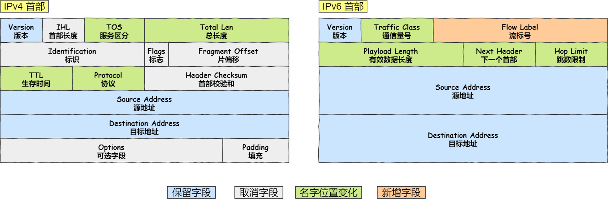

## IP地址基础知识

在TCP/IP网络通信时，为了保证能正常通信，每个设备都需要配置正确的IP地址，否则无法实现正常的通信。

- IPv4地址由`32`位二进制来表示

- IPv6地址由`128`位二进制来表示

> - IPv4：采用了`点分十进制`的标记方式，将32位IP地址以每8位为一组，共分为4组，每组以`.`隔开，再将每组转换成十进制。
>
> - IPv6：将128位IP地址以每 16 位作为一组，每组用冒号 「:」 隔开。如果出现连续的 0 时还可以将这些 0 省略，并用两个冒号 「::」隔开。但是，一个 IP 地址中只允许出现一次两个连续的冒号。

那么，IP 地址最大值也就是


也就说，最大允许 43 亿台计算机连接到网络。

实际上，IP 地址并不是根据主机台数来配置的，而是以网卡。像服务器、路由器等设备都是有 2 个以上的网卡，也就是它们会有 2 个以上的 IP 地址。

## 两种分类方式

### IP 地址的分类

互联网诞生之初，IP 地址分类成了 5 种类型，分别是 A 类、B 类、C 类、D 类、E 类。

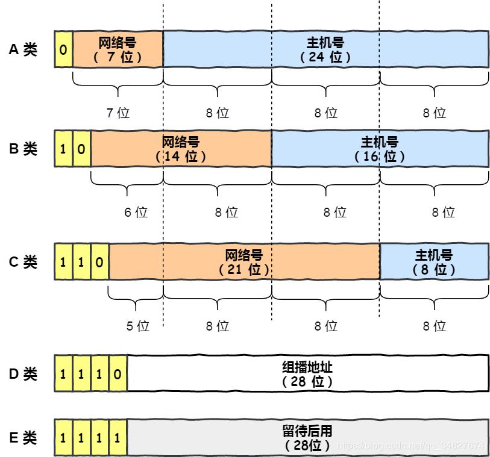

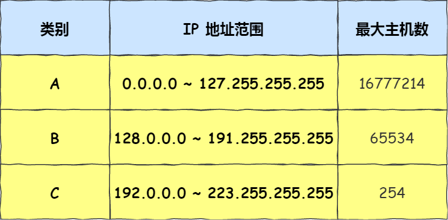


> 每一类下边的最大主机数是如何计算的？
>
> - 拿A类举例，`最大主机数 = 2^24 - 2 = 16777214`
> - 减去了两个比较特殊的IP
>   - 主机号全为1：指定某个网络下的所有主机，用于广播
>   - 主机号全为0：指定某个网络


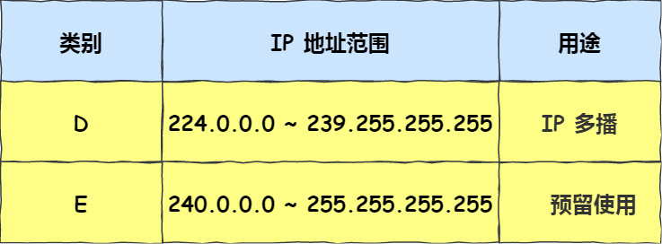

而D类和E类地址都是没有主机号的，所以不可用于主机IP。

- D类常用于多播，其前四位是 `1110` 就表示是多播地址，而剩下的 28 位是多播的组编号。
  - 从 224.0.0.0 ~ 239.255.255.255 都是多播的可用范围，其划分为以下三类：
    - 224.0.0.0 ~ 224.0.0.255 为预留的组播地址，只能在局域网中，路由器是不会进行转发的。
    - 224.0.1.0 ~ 238.255.255.255 为用户可用的组播地址，可以用于 Internet 上。
    - 239.0.0.0 ~ 239.255.255.255 为本地管理组播地址，可供内部网在内部使用，仅在特定的本地范围内有效。
- E类是预留的分类，暂时未使用。

#### 广播地址用于干什么？

- 用于在`同一个链路中相互连接的主机之间发送数据包`。
- 主机号全为1。


广播地址可以分为本地广播和直接广播两种。

- **在本网络内广播的叫做本地广播**。例如网络地址为 192.168.0.0/24 的情况下，广播地址是 192.168.0.255 。因为这个广播地址的 IP 包会被路由器屏蔽，所以不会到达 192.168.0.0/24 以外的其他链路上。
- **在不同网络之间的广播叫做直接广播**。例如网络地址为 192.168.0.0/24 的主机向 192.168.1.255/24 的目标地址发送 IP 包。收到这个包的路由器，将数据转发给 192.168.1.0/24，从而使得所有 192.168.1.1~192.168.1.254 的主机都能收到这个包（由于直接广播有一定的安全问题，多数情况下会在路由器上设置为不转发。） 。

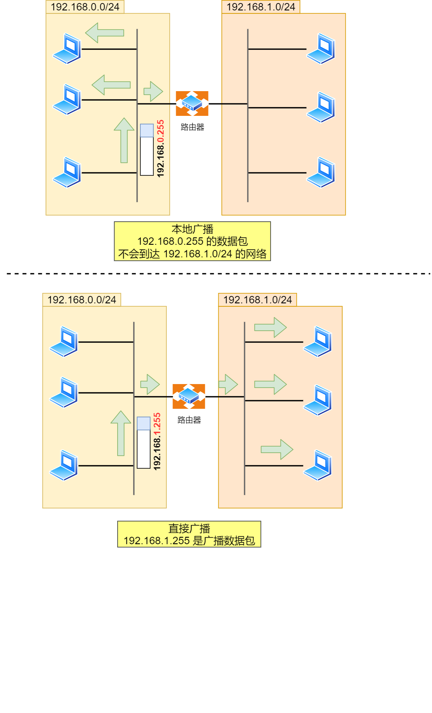


#### 多播地址的作用

多播用于**将包发送给特定组内的所有主机。**

由于广播无法穿透路由，若想给其他网段发送同样的包，就可以使用可以穿透路由的多播。

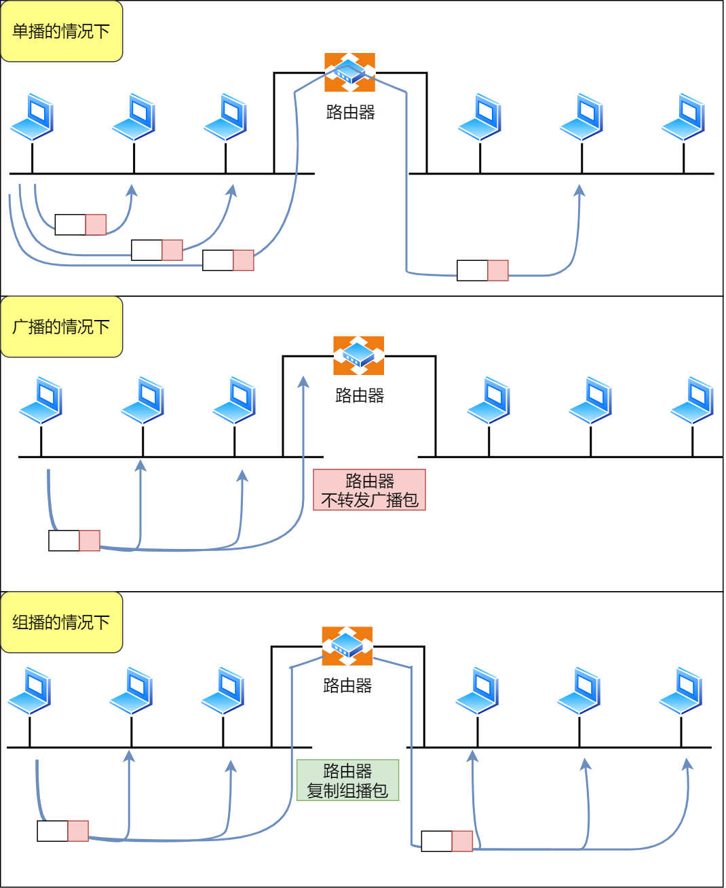


#### IP分类的优点

不管是路由器还是主机解析到一个 IP 地址时候，我们判断`其 IP 地址的首位是否为 0，为 0 则为 A 类地址`，那么就能很快的找出网络地址和主机地址。

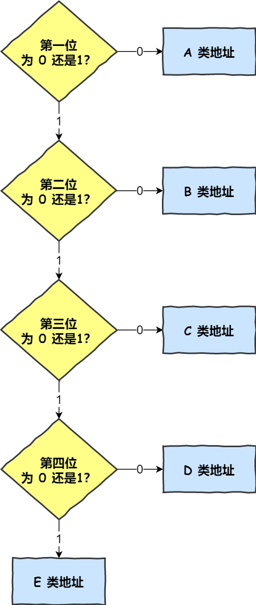


#### IP分类的缺点

*缺点一*

**同一网络下没有地址层次**，比如一个公司里用了 B 类地址，但是可能需要根据生产环境、测试环境、开发环境来划分地址层次，而这种 IP 分类是没有地址层次划分的功能，所以这就**缺少地址的灵活性**。

*缺点二*

A、B、C类有个尴尬处境，就是**不能很好的与现实网络匹配**。

- C 类地址能包含的最大主机数量实在太少了，只有 254 个，估计一个网吧都不够用。
- 而 B 类地址能包含的最大主机数量又太多了，6 万多台机器放在一个网络下面，一般的企业基本达不到这个规模，闲着的地址就是浪费。

这两个缺点，都可以在 `CIDR` 无分类地址解决。


### 无分类地址CIDR

这种方式不再有分类地址的概念，32 比特的 IP 地址被划分为两部分，前面是**网络号**，后面是**主机号**。

> 怎么划分网络号和主机号的呢？

表示形式 `a.b.c.d/x`，其中 `/x` 表示前 x 位属于**网络号**， x 的范围是 `0 ~ 32`，这就使得 IP 地址更加具有灵活性。

比如 10.100.122.2/24，这种地址表示形式就是 CIDR，/24 表示前 24 位是网络号，剩余的 8 位是主机号。

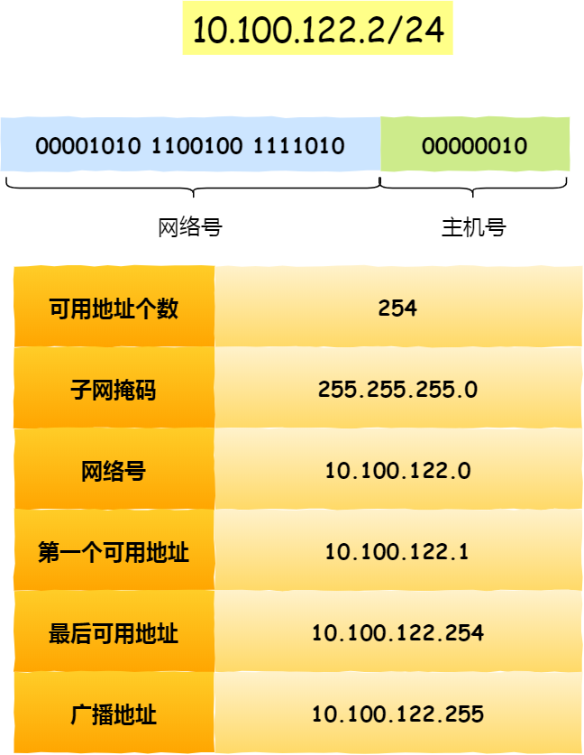

还有另一种划分网络号与主机号形式，那就是**子网掩码**，掩码的意思就是掩盖掉主机号，剩余的就是网络号。


> 为什么要分离网络号和主机号？

因为两台计算机要通讯，首先要判断是否处于同一个广播域内，即网络地址是否相同。如果网络地址相同，表明接受方在本网络上，那么可以把数据包直接发送到目标主机。

路由器寻址工作中，也就是通过这样的方式来找到对应的网络号的，进而把数据包转发给对应的网络内。

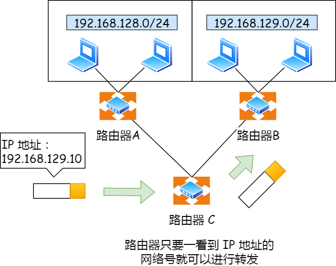

> 怎么进行子网划分？

在上面我们知道可以通过子网掩码划分出网络号和主机号，那实际上子网掩码还有一个作用，那就是**划分子网**。

**子网划分实际上是将主机地址分为两个部分：子网网络地址和子网主机地址**。形式如下：

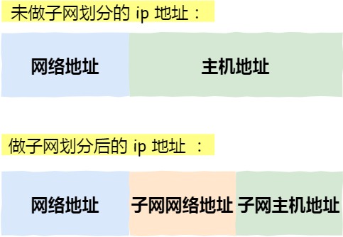

- 未做子网划分的 ip 地址：网络地址＋主机地址
- 做子网划分后的 ip 地址：网络地址＋（子网网络地址＋子网主机地址）

假设对 C 类地址进行子网划分，网络地址 192.168.1.0，使用子网掩码 255.255.255.192 对其进行子网划分。

C 类地址中前 24 位是网络号，最后 8 位是主机号，根据子网掩码可知**从 8 位主机号中借用 2 位作为子网号**。

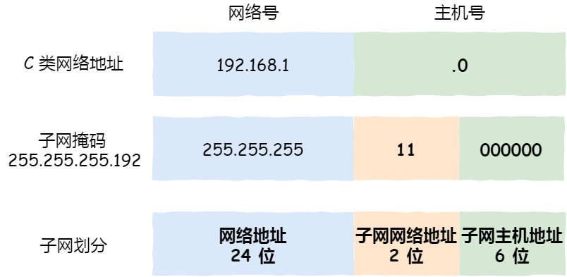

由于子网网络地址被划分成 2 位，那么子网地址就有 4 个，分别是 00、01、10、11，具体划分如下图：

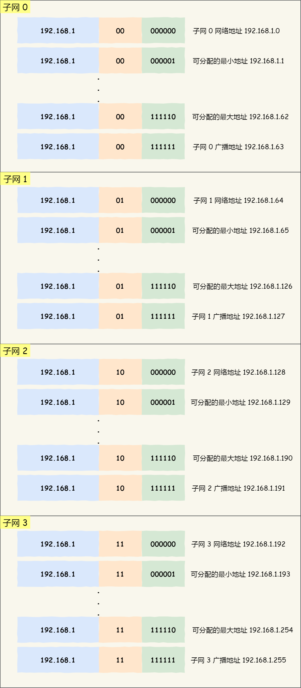

划分后的 4 个子网如下表格：

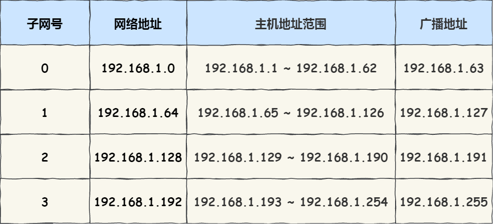


### 两种分类的区别

IP分类（Classful IP addressing）和无分类CIDR（Classless Inter-Domain Routing）是两种不同的方法来管理和分配IP地址，尽管它们在某些方面可以结合使用。

1. **IP分类（Classful IP addressing）**： IP地址最初被分为五个主要类别：A、B、C、D和E类。每个类别有不同的地址范围和默认子网掩码。这种方法在早期的互联网中使用，但它浪费了大量IP地址并且难以管理。
2. **无分类CIDR（Classless Inter-Domain Routing）**： 为了更有效地使用IP地址和更灵活地分配网络，CIDR被引入。`CIDR允许将IP地址划分为更小的子网，使网络管理员能够更精细地分配IP地址，并且不受固定的类别限制。`CIDR引入了CIDR表示法，例如，"192.168.1.0/24"表示一个以192.168.1.0开头的24位子网。

**结合使用**： 尽管IP分类和无分类CIDR是不同的概念，但它们可以结合使用。在网络规划中，你可能会根据你的需求选择不同的子网划分，使用CIDR表示法进行配置。这意味着你可以根据实际情况，灵活地定义子网大小，而不受传统的IP分类限制。

**现代实践**： 在现代网络中，CIDR已成为主流方法。因为互联网的持续增长和IP地址的稀缺性，无分类CIDR的灵活性和效率更适合满足各种网络规模的需求。IP分类方法已经过时，而CIDR被广泛使用。

因此，你的感觉是正确的：IP分类和无分类CIDR在一定程度上结合使用，但现代网络主要采用无分类CIDR来更有效地管理IP地址。


##  公有 IP 地址与私有 IP 地址

在 A、B、C 分类地址，实际上有分公有 IP 地址和私有 IP 地址。

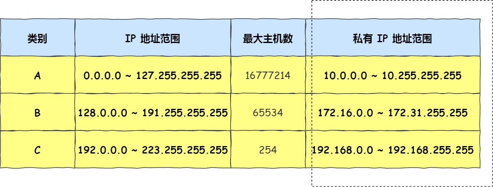

平时我们办公室、家里、学校用的 IP 地址，一般都是私有 IP 地址。因为这些地址允许组织内部的 IT 人员自己管理、自己分配，而且可以重复。因此，你学校的某个私有 IP 地址和我学校的可以是一样的。

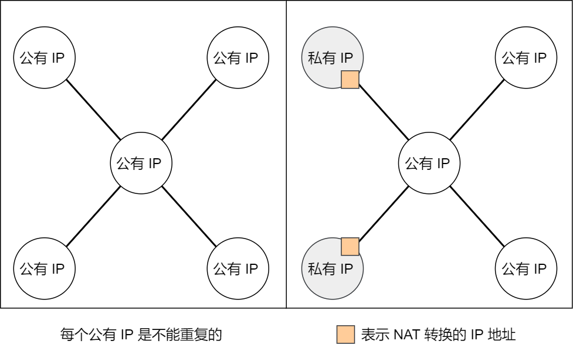

## IP 地址与路由控制

IP地址的**网络地址**部分是`用于进行路由控制`。

- 路由控制表中记录着网络地址与下一跳的地址(下一步应该发送至路由器的地址)。
- 在主机和路由器上**都会有各自的路由器控制表**。

在发送 IP 包时，首先要确定 IP 包首部中的目标地址，再从路由控制表中找到与该地址具有**相同网络地址**的记录，根据该记录将 IP 包转发给相应的下一个路由器。如果路由控制表中存在多条相同网络地址的记录，就`选择相同位数最多的网络地址`，也就是最长匹配。

下面以下图的网络链路作为例子说明：

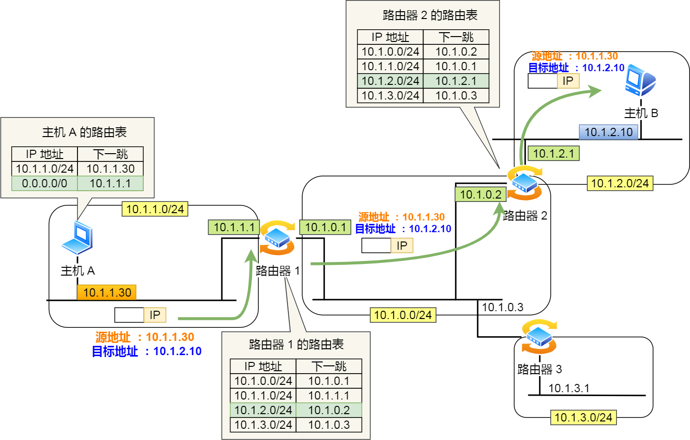

1. 主机 A 要发送一个 IP 包，其源地址是 `10.1.1.30` 和目标地址是 `10.1.2.10`，由于没有在主机 A 的路由表找到与目标地址 `10.1.2.10` 相同的网络地址，于是包被转发到默认路由（路由器 `1` ）
2. 路由器 `1` 收到 IP 包后，也在路由器 `1` 的路由表匹配与目标地址相同的网络地址记录，发现匹配到了，于是就把 IP 数据包转发到了 `10.1.0.2` 这台路由器 `2`
3. 路由器 `2` 收到后，同样对比自身的路由表，发现匹配到了，于是把 IP 包从路由器 `2` 的 `10.1.2.1` 这个接口出去，最终经过交换机把 IP 数据包转发到了目标主机

> 环回地址是不会流向网络

环回地址是在同一台计算机上的程序之间进行网络通信时所使用的一个默认地址。

计算机使用一个特殊的 IP 地址 **127.0.0.1 作为环回地址**。与该地址具有相同意义的是一个叫做 `localhost` 的主机名。使用这个 IP 或主机名时，数据包不会流向网络。

换句话说，环回地址不会**流向路由器**。

## IP 分片与重组

每种数据链路的最大传输单元 `MTU` 都是不相同的，如 FDDI 数据链路 MTU 4352、以太网的 MTU 是 1500 字节等。

每种数据链路的 MTU 之所以不同，是因为每个不同类型的数据链路的使用目的不同。使用目的不同，可承载的 MTU 也就不同。

其中，我们最常见数据链路是以太网，它的 MTU 是 `1500` 字节。

**那么当 IP 数据包的大小大于 MTU 时， IP 数据包就会被分片。**

经过分片之后的 IP 数据报在被重组的时候，`只能由目标主机进行，路由器是不会进行重组的`。

假设发送方发送一个 4000 字节的大数据报，若要传输在以太网链路，则需要把数据报分片成 3 个小数据报进行传输，再交由接收方重组成大数据报。


在分片传输中，一旦某个分片丢失，则会造成整个 IP 数据报作废，所以 TCP 引入了 `MSS` 也就是在 TCP 层进行分片不由 IP 层分片，那么对于 UDP 我们尽量不要发送一个大于 `MTU` 的数据报文。


# IP协议相关技术

## DNS

DNS 中的域名都是用**句点**来分隔的，比如 `www.server.com`，这里的句点代表了不同层次之间的**界限**。

在域名中，**越靠右**的位置表示其层级**越高**。

> 毕竟域名是外国人发明，所以思维和中国人相反，比如说一个城市地点的时候，外国喜欢从小到大的方式顺序说起（如 XX 街道 XX 区 XX 市 XX 省），而中国则喜欢从大到小的顺序（如 XX 省 XX 市 XX 区 XX 街道）。

根域是在最顶层，它的下一层就是 com 顶级域，再下面是 server.com。

所以域名的层级关系类似一个树状结构：

- 根 DNS 服务器
- 顶级域 DNS 服务器（com）
- 权威 DNS 服务器（server.com）

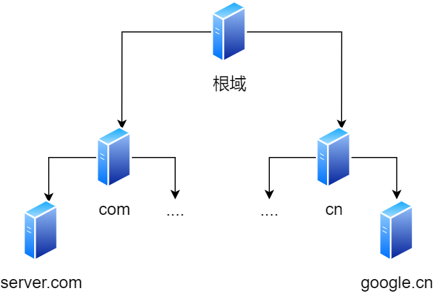


> 域名解析的工作流程

浏览器首先看一下自己的缓存里有没有，如果没有就向操作系统的缓存要，还没有就检查本机域名解析文件 `hosts`，如果还是没有，就会 DNS 服务器进行查询，查询的过程如下：

1. 客户端首先会发出一个 DNS 请求，问 www.server.com 的 IP 是啥，并发给本地 DNS 服务器（也就是客户端的 TCP/IP 设置中填写的 DNS 服务器地址）。
2. 本地域名服务器收到客户端的请求后，如果缓存里的表格能找到 www.server.com，则它直接返回 IP 地址。如果没有，本地 DNS 会去问它的根域名服务器：`“老大， 能告诉我 www.server.com 的 IP 地址吗？”` 根域名服务器是最高层次的，它不直接用于域名解析，但能指明一条道路。
3. 根 DNS 收到来自本地 DNS 的请求后，发现后置是 .com，说：“www.server.com 这个域名归 .com 区域管理”，我给你 .com 顶级域名服务器地址给你，你去问问它吧。”
4. 本地 DNS 收到顶级域名服务器的地址后，发起请求问“老二， 你能告诉我 www.server.com 的 IP 地址吗？”
5. 顶级域名服务器说：“我给你负责 www.server.com 区域的权威 DNS 服务器的地址，你去问它应该能问到”。
6. 本地 DNS 于是转向问权威 DNS 服务器：“老三，www.server.com对应的IP是啥呀？” server.com 的权威 DNS 服务器，它是域名解析结果的原出处。为啥叫权威呢？就是我的域名我做主。
7. 权威 DNS 服务器查询后将对应的 IP 地址 X.X.X.X 告诉本地 DNS。
8. 本地 DNS 再将 IP 地址返回客户端，客户端和目标建立连接。

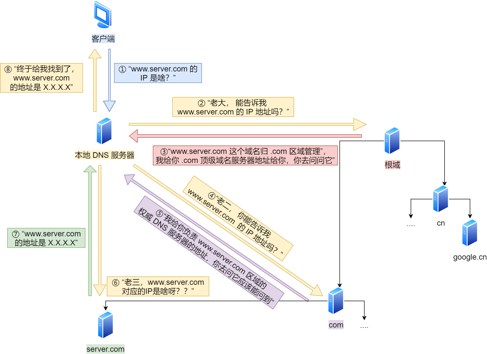


## ARP

在传输一个 IP 数据报的时候，确定了源 IP 地址和目标 IP 地址后，就会通过主机「路由表」确定 IP 数据包下一跳。然而，网络层的下一层是数据链路层，所以我们还要知道「下一跳」的 MAC 地址。

由于主机的路由表中可以找到下一跳的 IP 地址，所以可以通过 **ARP 协议**，求得下一跳的 MAC 地址。

> 那么 ARP 又是如何知道对方 MAC 地址的呢？

简单地说，ARP 是借助 **ARP 请求与 ARP 响应**两种类型的包确定 MAC 地址的。


- 主机会通过**广播发送 ARP 请求**，这个包中包含了想要知道的 MAC 地址的主机 IP 地址。
- 当同个链路中的所有设备收到 ARP 请求时，会去拆开 ARP 请求包里的内容，如果 ARP 请求包中的目标 IP 地址与自己的 IP 地址一致，那么这个设备就将自己的 MAC 地址塞入 **ARP 响应包**返回给主机。
- 操作系统通常会把第一次通过 ARP 获取的 MAC 地址缓存起来，以便下次直接从缓存中找到对应 IP 地址的 MAC 地址。
  - 不过，MAC 地址的缓存是有一定期限的，超过这个期限，缓存的内容将被清除。


**Ps：**这个地方再补充几点：

1. ARP请求包括`源IP地址、源MAC地址、目标IP地址、目标MAC地址`，一般目标MAC地址为`FF:FF:FF:FF:FF:FF`，通常只有在目标MAC地址是广播地址（FF:FF:FF:FF:FF:FF）时，所有设备才会接收到数据包。
2. 普通的请求中，为什么能够保证A到B的数据包，不会被C看到，是因为有交换机(网桥)的作用，帮助数据进行流转。


> RARP 协议你知道是什么吗？

ARP 协议是已知 IP 地址求 MAC 地址，那 RARP 协议正好相反，它是**已知 MAC 地址求 IP 地址**。例如将打印机服务器等小型嵌入式设备接入到网络时就经常会用得到。

通常这需要架设一台 `RARP` 服务器，在这个服务器上注册设备的 MAC 地址及其 IP 地址。然后再将这个设备接入到网络，接着：

- 该设备会发送一条「我的 MAC 地址是XXXX，请告诉我，我的IP地址应该是什么」的请求信息。
- RARP 服务器接到这个消息后返回「MAC地址为 XXXX 的设备，IP地址为 XXXX」的信息给这个设备。

最后，设备就根据从 RARP 服务器所收到的应答信息设置自己的 IP 地址。


### DHCP

DHCP 在生活中我们是很常见的了，电脑通常都是`通过 DHCP 动态获取 IP 地址，大大省去了配 IP 信息繁琐的过程`。

过程如下：


先说明一点，DHCP 客户端进程监听的是 68 端口号，DHCP 服务端进程监听的是 67 端口号。

这 4 个步骤：

- 客户端首先发起 **DHCP 发现报文（DHCP DISCOVER）** 的 IP 数据报，由于客户端没有 IP 地址，也不知道 DHCP 服务器的地址，所以使用的是 `UDP **广播**通信`，其使用的广播目的地址是 255.255.255.255（端口 67） 并且使用 0.0.0.0（端口 68） 作为源 IP 地址。DHCP 客户端将该 IP 数据报传递给链路层，链路层然后将帧广播到所有的网络中设备。
- DHCP 服务器收到 DHCP 发现报文时，用 **DHCP 提供报文（DHCP OFFER）** 向客户端做出响应。该报文仍然使用 IP 广播地址 255.255.255.255，该报文信息携带服务器提供可租约的 IP 地址、子网掩码、默认网关、DNS 服务器以及 **IP 地址租用期**。
- 客户端收到一个或多个服务器的 DHCP 提供报文后，从中选择一个服务器，并向选中的服务器发送 **DHCP 请求报文（DHCP REQUEST**进行响应，回显配置的参数。
- 最后，服务端用 **DHCP ACK 报文**对 DHCP 请求报文进行响应，应答所要求的参数。

一旦客户端收到 DHCP ACK 后，交互便完成了，并且客户端能够在租用期内使用 DHCP 服务器分配的 IP 地址。

如果租约的 DHCP IP 地址快期后，客户端会向服务器发送 DHCP 请求报文：

- 服务器如果同意继续租用，则用 DHCP ACK 报文进行应答，客户端就会延长租期。
- 服务器如果不同意继续租用，则用 DHCP NACK 报文，客户端就要停止使用租约的 IP 地址。

可以发现，DHCP 交互中，**全程都是使用 UDP 广播通信**。

> 咦，用的是广播，那如果 DHCP 服务器和客户端不是在同一个局域网内，路由器又不会转发广播包，那不是每个网络都要配一个 DHCP 服务器？

所以，为了解决这一问题，就出现了 **DHCP 中继代理**。有了 DHCP 中继代理以后，**对不同网段的 IP 地址分配也可以由一个 DHCP 服务器统一进行管理。**


- DHCP 客户端会向 DHCP 中继代理发送 DHCP 请求包，而 DHCP 中继代理在收到这个广播包以后，再以**单播**的形式发给 DHCP 服务器。
- 服务器端收到该包以后再向 DHCP 中继代理返回应答，并由 DHCP 中继代理将此包广播给 DHCP 客户端 。

因此，DHCP 服务器即使不在同一个链路上也可以实现统一分配和管理IP地址。

### NAT

IPv4 的地址是非常紧缺的，互联网的用户增速是非常惊人的，所以 IPv4 地址依然有被耗尽的危险。

于是，提出了一种**网络地址转换 NAT** 的方法，再次缓解了 IPv4 地址耗尽的问题。

简单的来说 NAT 就是同个公司、家庭、教室内的主机对外部通信时，`把私有 IP 地址转换成公有 IP 地址`。


> 那不是 N 个私有 IP 地址，你就要 N 个公有 IP 地址？这怎么就缓解了 IPv4 地址耗尽的问题？这不瞎扯吗？

确实是，普通的 NAT 转换没什么意义。

由于绝大多数的网络应用都是使用传输层协议 TCP 或 UDP 来传输数据的。

因此，可以把 IP 地址 + 端口号一起进行转换。

这样，就用一个全球 IP 地址就可以了，这种转换技术就叫**网络地址与端口转换 NAPT。**

很抽象？来，看下面的图解就能瞬间明白了。


图中有两个客户端 192.168.1.10 和 192.168.1.11 同时与服务器 183.232.231.172 进行通信，并且这两个客户端的本地端口都是 1025。

此时，**两个私有 IP 地址都转换 IP 地址为公有地址 120.229.175.121，但是以不同的端口号作为区分。**

于是，生成一个 NAPT 路由器的转换表，就可以正确地转换地址跟端口的组合，令客户端 A、B 能同时与服务器之间进行通信。

这种转换表在 NAT 路由器上自动生成。例如，**在 TCP 的情况下，建立 TCP 连接首次握手时的 SYN 包一经发出，就会生成这个表。而后又随着收到关闭连接时发出 FIN 包的确认应答从表中被删除。**

> NAT 那么牛逼，难道就没缺点了吗？

当然有缺陷，肯定没有十全十美的方案。

由于 NAT/NAPT 都依赖于自己的转换表，因此会有以下的问题：

- 外部无法主动与 NAT 内部服务器建立连接，因为 NAPT 转换表没有转换记录。
- 转换表的生成与转换操作都会产生性能开销。
- 通信过程中，如果 NAT 路由器重启了，所有的 TCP 连接都将被重置。

> 如何解决 NAT 潜在的问题呢？

解决的方法主要有两种方法。

*第一种就是改用 IPv6*

IPv6 可用范围非常大，以至于每台设备都可以配置一个公有 IP 地址，就不搞那么多花里胡哨的地址转换了，但是 IPv6 普及速度还需要一些时间。

*第二种 NAT 穿透技术*

NAT 穿越技术拥有这样的功能，它能够让网络应用程序主动发现自己位于 NAT 设备之后，并且会主动获得 NAT 设备的公有 IP，并为自己建立端口映射条目，注意这些都是 NAT设备后的应用程序自动完成的。

也就是说，在 NAT 穿透技术中，NAT设备后的应用程序处于主动地位，它已经明确地知道 NAT 设备要修改它外发的数据包，于是它主动配合 NAT 设备的操作，主动地建立好映射，这样就不像以前由 NAT 设备来建立映射了。

说人话，就是客户端主动从 NAT 设备获取公有 IP 地址，然后自己建立端口映射条目，然后用这个条目对外通信，就不需要 NAT 设备来进行转换了。

## ICMP(网络层)

全名`互联网控制报文协议`，网络包在复杂的网络传输环境里，常常会遇到各种问题。当遇到问题的时候，总不能死的不明不白，没头没脑的作风不是计算机网络的风格。所以需要传出消息，报告遇到了什么问题，这样才可以调整传输策略，以此来控制整个局面。


### 主要功能

`ICMP` 主要的功能包括：**确认 IP 包是否成功送达目标地址、报告发送过程中 IP 包被废弃的原因和改善网络设置等。**

在 `IP` 通信中如果某个 `IP` 包因为某种原因未能达到目标地址，那么这个具体的原因将**由 ICMP 负责通知**。


### ICMP包格式

ICMP 报文是`封装在 IP 包里面`，它工作在网络层，是 IP 协议的助手。

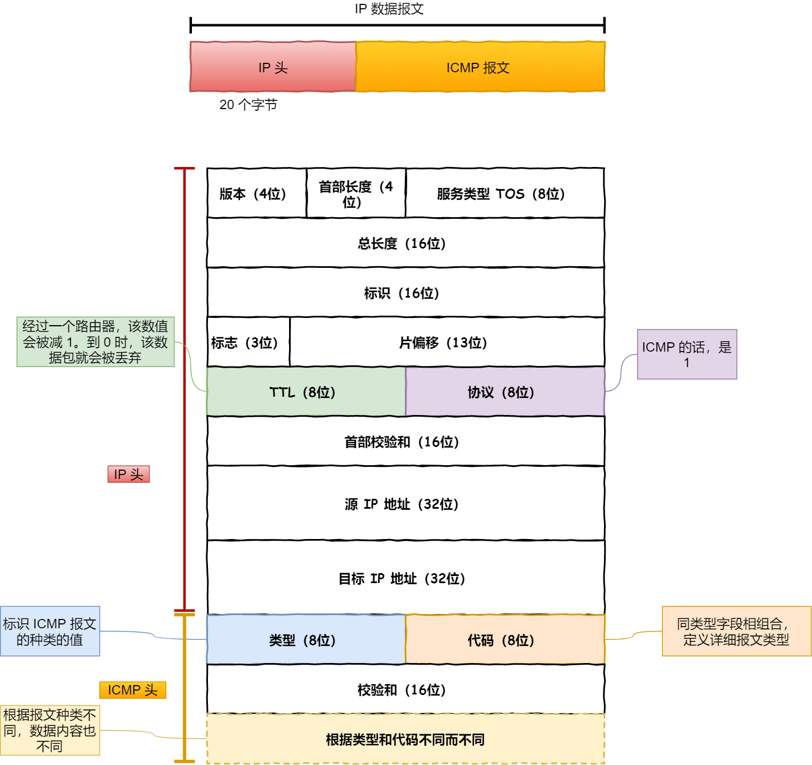


ICMP包头的类型字段，大致可以分为两大类：

- 一类是用于诊断的查询消息，也就是「**查询报文类型**」
- 另一类是通知出错原因的错误消息，也就是「**差错报文类型**」

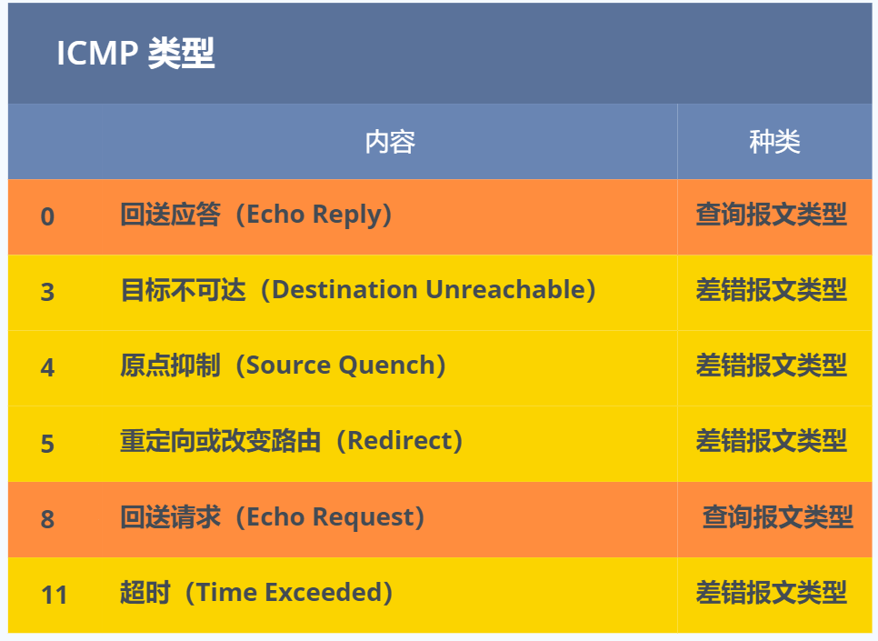

> 针对TCP协议，如果端口不可达，是回复 RST 报文 针对 UDP协议，如果端口不可达，是回复 ICMP 报文 这个是对的吗？ 请帮我详细梳理一下 TCP、UDP、ICMP三者的关系？

你的理解是正确的。

TCP和UDP都是应用层(上层)协议,用于应用之间的数据传输。TCP提供可靠传输,UDP提供非连接式传输。

而ICMP是网络层(下层)协议,用于管理IP网络,用于报告IP组件的故障、错误和其他信息。

针对TCP协议:

- TCP连接建立时,需要3次握手。如果对方端口不可达,会发送一个RST(Reset)报文来重置TCP连接。
- TCP连接释放需要4次挥手。

针对UDP协议:

- UDP是无连接的,不需要建立连接。发送方直接就可以发送UDP数据报文。
- 如果对方的UDP端口不可达,会收到来自目标IP地址的ICMP目的不可达(destination unreachable) 报文。

总的来说:

- TCP使用RST报文来通知连接建立失败。
- UDP使用ICMP目的不可达报文来通知。
- 这二者的差别来自于TCP有连接和状态,而UDP没有连接和状态。

所以你的理解是正确的。
简单总结:

TCP与UDP:

- 用于应用层数据传输
- TCP提供可靠传输,UDP提供非连接传输

ICMP:

- 用于网络层管理和报告信息
- 当UDP端口不可达时,使用ICMP报文通知发送端

希望能为你解惑。如果还有疑问,欢迎随时向我提问!


# ping的工作原理

ping是基于`ICMP协议`。

说了这么多，可以看出 ping 这个程序是**使用了 ICMP 里面的 ECHO REQUEST（类型为 8 ） 和 ECHO REPLY （类型为 0）**。

## 局域网内主机A ping 主机B

在同一个子网下的主机A和主机B，主机A执行`ping`主机B后，我们来看看期间发送了什么？

1. ping命令执行的时候，源主机会首先构建一个`ICMP回送请求消息`数据包。

   >  ICMP数据包内包含多个字段，最重要的是两个：
   >
   > 1. 第一个是`类型`，对于回送请求消息而言该字段为8
   > 2. 另外一个是`序号`，主要用于区分连续ping的时候发出的多个数据包。
   > 3. 

2. ICMP协议将这个数据包连同地址`192.168.1.2`一起交给IP层，IP 层将以 192.168.1.2 作为**目的地址**，本机 IP 地址作为**源地址**，**协议**字段设置为 `1` 表示是 `ICMP` 协议，再加上一些其他控制信息，构建一个 `IP` 数据包。

   > 

3. 通过缓存/ARP找到下一跳(目标机器)的MAC地址，在数据链路层构建一个数据帧，依据以太网的介质访问规则，将它们传送出去。

4. 主机B收到该数据包之后，接收后检查该数据帧，将 IP 数据包从帧中提取出来，交给本机的 IP 层。同样，IP 层检查后，将有用的信息提取后交给 ICMP 协议。

5. 主机 `B` 会构建一个 **ICMP 回送响应消息**数据包，回送响应数据包的**类型**字段为 `0`，**序号**为接收到的请求数据包中的序号，然后再发送出去给主机 A。

   

   在规定的时候间内，源主机如果没有接到 ICMP 的应答包，则说明目标主机不可达；如果接收到了 ICMP 回送响应消息，则说明目标主机可达。

   此时，源主机会检查，用当前时刻减去该数据包最初从源主机上发出的时刻，就是 ICMP 数据包的时间延迟。


总结来说如图所示：

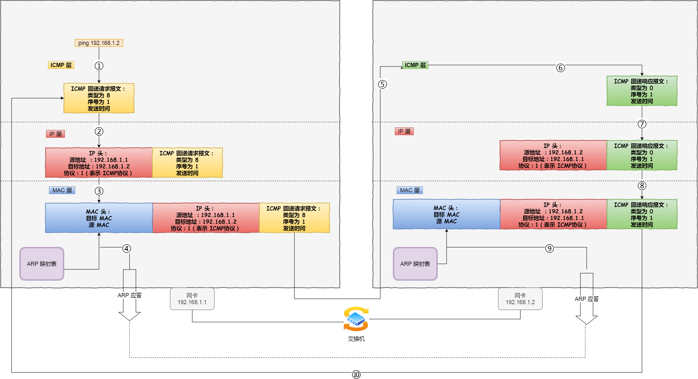


## traceroute —— 差错报文类型的使用

有一款充分利用 ICMP **差错报文类型**的应用叫做 `traceroute`（在UNIX、MacOS中是这个命令，而在Windows中对等的命令叫做 tracert ）。

*1. traceroute 作用一*

traceroute 的第一个作用就是**故意设置特殊的 TTL，来追踪去往目的地时沿途经过的路由器。**

traceroute 的参数指向某个**目的 IP 地址**：

```bash
traceroute 192.168.1.100
```

> 这个作用是如何工作的呢？

它的原理就是利用 IP 包的**生存期限** 从 `1` 开始按照顺序递增的同时发送 **UDP 包**，强制接收 **ICMP 超时消息**的一种方法。

比如，将 TTL 设置 为 `1`，则遇到第一个路由器，就牺牲了，接着返回 ICMP 差错报文网络包，类型是**时间超时**。

接下来将 TTL 设置为 `2`，第一个路由器过了，遇到第二个路由器也牺牲了，也同时返回了 ICMP 差错报文数据包，如此往复，直到到达目的主机。

这样的过程，traceroute 就可以拿到了所有的路由器 IP。

当然有的路由器根本就不会返回这个 ICMP，所以对于有的公网地址，是看不到中间经过的路由的。

> 发送方如何知道发出的 UDP 包是否到达了目的主机呢？

traceroute 在发送 `UDP` 包时，会填入一个**不可能的端口号**值作为 UDP 目标端口号：33434。然后对于每个下一个探针，它都会增加一个，这些端口都是通常认为不会被使用，不过，没有人知道当某些应用程序监听此类端口时会发生什么。

当目的主机，收到 UDP 包后，会返回 ICMP 差错报文消息，但这个差错报文消息的类型是「**端口不可达**」。

所以，**当差错报文类型是端口不可达时，说明发送方发出的 UDP 包到达了目的主机。**

*2. traceroute 作用二*

traceroute 还有一个作用是**故意设置不分片，从而确定路径的 MTU**。

> 这么做是为了什么？

这样做的目的是为了**路径MTU发现**。

因为有的时候我们并不知道路由器的 `MTU` 大小，以太网的数据链路上的 `MTU` 通常是 `1500` 字节，但是非以太网的 `MTU` 值就不一样了，所以我们要知道 `MTU` 的大小，从而控制发送的包大小。


它的工作原理如下：

首先在发送端主机发送 `IP` 数据报时，将 `IP` 包首部的**分片禁止标志位设置为 1**。根据这个标志位，途中的路由器不会对大数据包进行分片，而是将包丢弃。

随后，通过一个 ICMP 的不可达消息将**数据链路上 MTU 的值**一起给发送主机，不可达消息的类型为「**需要进行分片但设置了不分片位**」。

发送主机端每次收到 ICMP 差错报文时就**减少**包的大小，以此来定位一个合适的 `MTU` 值，以便能到达目标主机。


# 断网了，还能ping通127.0.0.1吗？


## 什么是127.0.0.1

其中**127 开头的都属于回环地址**，也是 `IPV4` 的特殊地址。

而`127.0.0.1`是**众多**回环地址中的一个。之所以不是 `127.0.0.2` ，而是 `127.0.0.1`。


## 为什么断网了还能ping通127.0.0.1


从应用层到传输层再到网络层。这段路径跟ping外网的时候是几乎是一样的。到了网络层，系统会根据目的IP，在路由表中获取对应的**路由信息**，而这其中就包含选择**哪个网卡**把消息发出。

当发现**目标IP是外网IP**时，会从"真网卡"发出。

当发现**目标IP是回环地址**时，就会选择**本地网卡**。

本地网卡，其实就是个**"假网卡"**，它不像"真网卡"那样有个`ring buffer`什么的，"假网卡"会把数据推到一个叫 `input_pkt_queue` 的 \**链表\** 中。这个链表，其实是所有网卡共享的，上面挂着发给本机的各种消息。消息被发送到这个链表后，会再触发一个**软中断**。

