## 前言

## 双工/单工问题

1. 在任何一个时刻，如果数据只能单向发送，称为`单工`
2. 如果在某个时刻，数据可以向一个方向传输，也可以向另一个方向传输，并且交替进行，那就成为是`半双工`（==Http、UDP==）
   1. 它实际上是一种切换方向的单工通信

3. 如果在任何时刻数据都可以双向收发，称为`全双工`（==TCP、WebSocket==）


**线路数量：**

1. 单工 >= 1
2. 半双工 >= 1
3. 双工 > 1


> 在网络中，每一层都有自己的双工模式，传输层有传输层的双工模式，应用层有应用层的双工模式，但下层的双工模式会影响到上层，比如下层支持半双工，上层顶多支持半双工


## 进程间通信、线程间通信

### 进程间通信(5种)

> 对于同一台设备上的进程间通信，有很多种方式，比如有管道、消息队列、共享内存、信号量、共享内存、套接字Socket等方式，而对于不同设备上的进程间通信，就需要网络通信，而设备是多样性的，所以要兼容多种多样的设备，就协商出了一套**通用的网络协议**。

补充：

`linux`上不同进程的通信方式：

1. `匿名管道(pipe)`：管道是一种`半双工`的通信方式，它可以将一个进程的输出和另一个进程的输入相连接，形成进程间的通信管道。在 Linux 中，使用 **pipe() 系统调用**来创建管道，读写管道则可以使用 read() 和 write() 系统调用。
   1. **只能用于有亲缘关系的进程之间通信**，如父子进程，可以实现双向通信。
   2. 子进程会在调用`read`函数时阻塞等待父进程写入数据到管道中，因此当父进程写入数据后，子进程会被唤醒并读取数据。
   3. 匿名管道是特殊文件只存在于内存，没有存在于文件系统中，**管道有一定的容量限制，如果写入的数据量超过管道容量，会导致写操作被阻塞**。另外，管道的数据是先进先出的，也就是说，读取数据的进程总是从管道中读取最先进入管道的数据。
   4. linux中`command1 | command2` 的管道操作利用的就是匿名管道的通信方式，它的功能是将前一个命令（command1）的输出，作为后一个命令（command2）的输入。我们可以看出**管道中的数据只能单向流动**，也就是半双工通信，如果想实现相互通信（全双工通信），我们需要创建两个管道才行。
2. `命名管道(named pipe)`：命名管道是一种带有名字的管道，它可以在文件系统中创建，并且可以由不相关的进程访问。在 Linux 中，使用 mkfifo() 系统调用来创建命名管道。
   1. **管道会阻塞**，使用 Linux 命令 mkfifo 来创建有名管道：`mkfifo myPipe`，myPipe 就是这个管道的名称，接下来，我们往 myPipe 这个有名管道中写入数据：`echo "hello" > myPipe`，执行这行命令后，你会发现它就停在这了，这是因为管道里的内容没有被读取，只有当管道里的数据被读完后，命令才可以正常退出。于是，我们执行另外一个命令来读取这个有名管道里的数据：`$ cat < myPipe ` 得到`hello`。
   2. 管道这种进程通信方式虽然使用简单，但是效率比较低，不适合进程间频繁地交换数据，并且管道只能传输无格式的字节流
3. `消息队列(message queue)`：消息队列是一种消息传递机制，它可以使不同进程之间通过一个消息队列进行通信。在 Linux 中，使用 msgget() 系统调用来创建消息队列，消息队列的读写可以使用 msgsnd() 和 msgrcv() 系统调用。
   1. **每次数据的写入和读取都需要经过用户态与内核态之间的拷贝过程。**
   3. 适用于多个进程之间进行通信，**可以实现进程间的异步通信**，进程发送消息后可以继续执行其他操作，不必等待对方的响应。
4. `共享内存(shared memory)`：共享内存是一种在不同进程之间共享内存区域的机制。在 Linux 中，使用 shmget() 系统调用来创建共享内存区域，进程可以通过 shmat() 系统调用将共享内存区域映射到自己的地址空间中。
   1. 适用于多个进程需要共享大量数据的场景，**通过映射同一块物理内存，多个进程可以直接访问该内存，避免了进程间频繁地进行数据复制**
   1. 但是**多进程竞争同个共享资源会造成数据的错乱**
5. `信号`：信号是一种异步通信机制，它可以使一个进程向另一个进程发送一种异步通知。在 Linux 中，可以使用 kill() 系统调用向指定进程发送信号，进程可以通过 signal() 或 sigaction() 系统调用来捕获信号。
   1. 比如说部署Java项目的时候，需要先把之前运行的进程，kill掉。这其实就使用到了**SIGKILL**  kill-9 = kill sigkill,用来立即结束该进程.
   2. 适用于多个进程需要**同步共享资源的场景**，通过对共享资源进行计数，控制多个进程的访问顺序，避免了多个进程同时访问共享资源导致的数据不一致。


不同主机的通信就要用到：

1. `套接字(socket)`：套接字是一种通用的进程间通信机制，它可以用于不同主机上的进程之间进行通信。在 Linux 中，使用 socket() 系统调用来创建套接字，进程可以使用 send() 和 recv() 系统调用进行数据的发送和接收。
   1. Socket 通信不仅可以跨网络与不同主机的进程间通信，还可以在同主机上进程间通信。
   2. 适用于不同机器间或者同一机器上不同进程之间通信
   3. 既可以TCP 也可以 UDP

**补充：**

**信号量其实是一个整型的计数器，主要用于实现进程间的互斥与同步，而不是用于缓存进程间通信的数据**。

> 具体在Java中，有以下几种方式：
>
> 1. Socket通信
> 2. RMI(远程方法调用)
> 3. 进程间共享文件
> 4. 消息队列(JMS)
> 5. 共享内存
>    1. MappedByteBuffer、FileChannel
> 6. 管道
>    1. PipedInputStream、PipedOutputStream

### 线程间通信(5种)

1. **共享内存**：
   - **定义**：多个线程共享同一块内存区域，可以直接在该内存区域上读写数据，实现数据交换。
   - **优点**：高效，因为直接在内存中读写数据，不需要额外的数据拷贝。
   - **缺点**：需要考虑同步问题，因为多个线程可能同时访问共享内存，可能导致竞态条件和数据一致性问题。
   - **针对Java**：`多个线程可以直接访问共享堆内存区域和对象, Java中的实例变量、类静态变量、常量池、方法去中的类信息等都是线程共享的`，
2. **互斥锁（Mutex）**：
   - **定义**：互斥锁用于实现线程之间的互斥访问，只有持有锁的线程可以访问共享资源。其他线程需要等待锁被释放才能访问。
   - **优点**：简单易用，能够保护共享资源的一致性。
   - **缺点**：过多地使用互斥锁可能导致性能问题，因为只有一个线程能够访问共享资源。
   - **针对Java**：`synchronized、ReentrantLock、RedLock、WriteLock等`，
3. **信号量（Semaphore）**：
   - **定义**：信号量用于控制多个线程对共享资源的访问，可以允许多个线程同时访问，也可以限制并发访问的数量。
   - **优点**：可以实现更灵活的资源共享策略，可以控制并发度。
   - **缺点**：使用不当可能导致死锁等问题。
   - **针对Java**：`Semaphore`，
4. **条件变量（Condition Variable）**：
   - **定义**：条件变量用于线程之间的等待和唤醒机制。一个线程可以在条件不满足时等待，另一个线程在条件满足时发出信号来唤醒等待线程。
   - **优点**：可以有效地实现线程的协调与同步，避免忙等待。
   - **缺点**：需要与互斥锁配合使用，可能导致复杂的编程逻辑。
   - **针对Java**：`可以使用`Condition`接口和`ReentrantLock`来实现条件变量。线程可以在条件不满足时调用`await()`方法等待，在条件满足时调用`signal()`或`signalAll()`方法唤醒等待线程。`
5. **消息队列**：
   - **定义**：消息队列允许线程将消息发送到队列中，其他线程可以从队列中获取消息。适用于需要解耦合的场景。
   - **优点**：实现了线程之间的解耦合，便于进行异步通信。
   - **缺点**：可能引入额外的开销和复杂性。
   - **针对Java**：`Java提供了多种消息队列，如`BlockingQueue`接口，它可以作为线程间的消息队列，支持生产者-消费者模式。另外，Java中的`wait()`和`notify()`方法也可以实现基本的消息传递。`


### 两者的区别

1. 由于线程间通信指的是一个进程中的多个线程间的通信，又因为每个进程有一个独立的内存空间，各线程共享这个内存空间，所以线程间通信相对来说比较简单。而进程间通信由于`内存隔离导致通信较为复杂`。

## TCP/IP网络模型有几层(4)

这个网络协议是分层的，每一层都有各自的作用和职责。

### 应用层

提供网络服务和应用程序之间的接口。

应用层只需要专注于为用户提供应用功能，比如 HTTP、FTP、Telnet、DNS、SMTP等。

应用层是不用去关心数据是如何传输的，就类似于，我们寄快递的时候，只需要把包裹交给快递员，由他负责运输快递，我们不需要关心快递是如何被运输的。

而且应用层是工作在操作系统中的`用户态`，传输层及以下则工作在内核态。

### 传输层

**主要职责：**负责向两台主机进程之间的通信提供通用的数据传输服务

负责数据传输的**可靠性和流量控制**。常见的协议有TCP（传输控制协议）和UDP（用户数据报协议）。

TCP 的全称叫传输控制协议（*Transmission Control Protocol*），大部分应用使用的正是 TCP 传输层协议，比如 HTTP 应用层协议。TCP 相比 UDP 多了很多特性，比如**流量控制、超时重传、拥塞控制**等，这些都是为了**保证数据包能可靠地传输给对方**。

UDP 相对来说就很简单，**简单到只负责发送数据包**，不保证数据包是否能抵达对方，**但它实时性相对更好，传输效率也高**。当然，UDP 也可以实现可靠传输，把 TCP 的特性在应用层上实现就可以，不过要实现一个商用的可靠 UDP 传输协议，也不是一件简单的事情。

### 网络层

**主要职责：**选择合适的网间路由和交换结点，确保计算机通信的数据及时 传送。在发送数据时，网络层把运输层产生的报文段或用户数据报封装成分组和 包进行传送。在 TCP/IP 体系结构中，由于网络层使用 IP 协议，因此分组也叫  IP 数据报 ，简称数据报。 

传输层可能大家刚接触的时候，会认为它负责将数据从一个设备传输到另一个设备，事实上它并不负责。

**实际场景中的网络环节是错综复杂的，中间有各种各样的线路和分叉路口**，如果一个设备的数据要传输给另一个设备，就需要在各种各样的路径和节点进行选择，而传输层的设计理念是简单、高效、专注，如果传输层还负责这一块功能就有点违背设计原则了。

IP协议的两个重要特点：寻址、路由。

- 除了寻址能力， IP 协议还有另一个重要的能力就是**路由**。实际场景中，两台设备并不是用一条网线连接起来的，而是通过很多网关、路由器、交换机等众多网络设备连接起来的，那么就会形成很多条网络的路径，因此当数据包到达一个网络节点，就需要通过路由算法决定下一步走哪条路径。

- 路由器寻址工作中，就是要找到目标地址的子网，找到后进而把数据包转发给对应的网络内。

### 网络接口层

**主要职责：**将数据帧从一个物理接口传输到另一个物理接口。

生成了 IP 头部之后，接下来要交给**网络接口层**（*Link Layer*）在 IP 头部的前面加上 MAC 头部，并封装成数据帧（Data frame）发送到网络上。

IP 头部中的接收方 IP 地址表示网络包的目的地，通过这个地址我们就可以判断要将包发到哪里，但在以太网的世界中，这个思路是行不通的。

什么是以太网呢？电脑上的以太网接口，Wi-Fi接口，以太网交换机、路由器上的千兆，万兆以太网口，还有网线，它们都是以太网的组成部分。以太网就是一种在「局域网」内，把附近的设备连接起来，使它们之间可以进行通讯的技术。

以太网在判断网络包目的地时和 IP 的方式不同，因此必须采用相匹配的方式才能在以太网中将包发往目的地，而 MAC 头部就是干这个用的，所以，在以太网进行通讯要用到 MAC 地址。

MAC 头部是以太网使用的头部，它包含了接收方和发送方的 MAC 地址等信息，我们可以通过 ARP 协议获取对方的 MAC 地址。

所以说，网络接口层主要为网络层提供「链路级别」传输的服务，负责在以太网、WiFi 这样的底层网络上发送原始数据包，**工作在网卡这个层次，使用 MAC 地址来标识网络上的设备。**

> **A 给 C 发数据包，怎么知道是否要通过路由器转发呢？**
>
> **答案：子网**
>
> 如果源 IP 与目的 IP 处于一个子网，直接将包通过交换机发出去。
>
> 如果源 IP 与目的 IP 不处于一个子网，就交给路由器去处理。

> **网卡的作用？**
>
> 网络包只是存放在内存中的一串二进制数字信息，没有办法直接发送给对方。因此需要将数字信息转换为电信号，才能在网线上传输。
>
> 负责这一操作的是网卡，要控制网卡还需要网卡驱动程序。
>
> 网卡驱动获取网络包之后，会将其**复制**到网卡内的缓存区中，接着会在其**开头加上报头和起始帧分界符，在末尾加上用于检测错误的帧校验序列**。
>
> 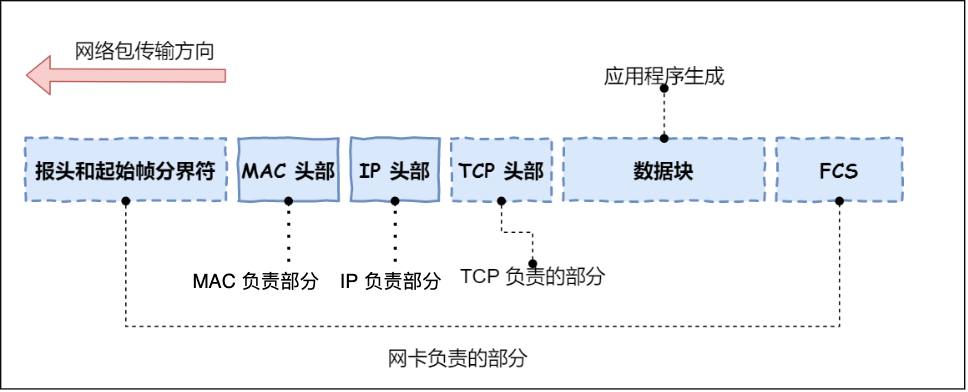

# 一、HTTP

## 1.1 常见面试题

### HTTP基本概念

#### HTTP是什么？

HTTP是一种在计算机世界里规定两点之间传输文字、图片、视频等数据的行为约定/规范。

#### HTTP常见的状态码有哪些？

1. `1xx` 类状态码属于**提示信息**，是协议处理中的一种中间状态，实际用到的比较少。

2. `2xx` 类状态码表示服务器**成功**处理了客户端的请求，也是我们最愿意看到的状态。
   
   - 「**200 OK**」是最常见的成功状态码，表示一切正常。如果是非 `HEAD` 请求，服务器返回的响应头都会有` body 数据`。
   - 「**204 No Content**」也是常见的成功状态码，与 200 OK 基本相同，但响应头没有 body 数据。
   - 「**206 Partial Content**」是应用于 HTTP 分块下载或断点续传，表示响应返回的 body 数据并不是资源的全部，而是其中的一部分，也是服务器处理成功的状态。
   
3. `3xx` 类状态码表示客户端请求的资源发生了变动，需要客户端用新的 URL 重新发送请求获取资源，也就是**重定向**。
   
   - 「**301 Moved Permanently**」表示永久重定向，说明请求的资源已经不存在了，需改用新的 URL 再次访问。
   - 「**302 Found**」表示临时重定向，说明请求的资源还在，但暂时需要用另一个 URL 来访问。
     - 301 和 302 都会在响应头里使用字段 `Location`，指明后续要跳转的 URL，浏览器会自动重定向新的 URL。
   - 「**304 Not Modified**」不具有跳转的含义，表示资源未修改，重定向已存在的缓冲文件，也称缓存重定向，`也就是告诉客户端可以继续使用缓存资源，用于缓存控制`。
   
4. `4xx` 类状态码表示客户端发送的**报文有误**，服务器无法处理，也就是错误码的含义。
   
   - 「**400 Bad Request**」表示客户端请求的报文有错误，但只是个笼统的错误。
   
   - 「**401 unauthorized**」表示发送的请求需要通过HTTP认证的认证信息
   
   - 「**403 Forbidden**」表示服务器禁止访问资源，并不是客户端的请求出错。
   
   - 「**404 Not Found**」表示请求的资源在服务器上不存在或未找到，所以无法提供给客户端。
   
5. `5xx` 类状态码表示客户端请求报文正确，但是**服务器处理时内部发生了错误**，属于服务器端的错误码。

   - 「**500 Internal Server Error**」与 400 类型，是个笼统通用的错误码，服务器发生了什么错误，我们并不知道。
     
   - 「**501 Not Implemented**」表示客户端请求的功能还不支持，类似“即将开业，敬请期待”的意思。
     
   - 「**502 Bad Gateway**」通常是服务器作为网关或代理时返回的错误码，表示nginx服务器自身工作正常，访问后端服务器发生了错误。
     
   - 「**503 Service Unavailable**」表示服务器当前很忙，暂时无法响应客户端，类似“网络服务正忙，请稍后重试”的意思。
     - 表明服务器暂时处于超负载或正在停机维护，无法处理请求

#### HTTP常用的字段有哪些？

1. `host`：客户端发送请求时，用来指定服务器的域名。
2. `Content-length`：服务器在返回数据时，会有 `Content-Length` 字段，表明本次回应的数据长度(1000后面的字节就属于下一个回应了)。
   - HTTP 协议通过**设置回车符、换行符作为 HTTP header 的边界**，通过 Content-Length 字段作为 HTTP body 的边界，这两个方式都是为了解决“粘包”的问题。
3. `connection`：字段最常用于客户端要求服务器使用「HTTP 长连接」机制，以便其他请求复用。
   1. HTTP 长连接的特点是，只要任意一端没有明确提出断开连接，则保持 TCP 连接状态。
   2. http1.0中，`每个请求/响应都需要使用一次新的TCP连接`，http1.1默认的连接**都是长连接的**，为了兼容老版本的HTTP,需要指定`Connection`首部字段的值为`Keep-Alive`。
   3. 开启了 HTTP Keep-Alive 机制后， 连接就不会中断，而是保持连接。当客户端发送另一个请求时，它会使用同一个连接，一直持续到客户端或服务器端提出断开连接。这样，客户端可以在同一个连接上发送多个请求/响应，从而避免了多次连接的建立和关闭，也就避免了多次进行三次握手和四次挥手。
4. `content-type`：用于服务器回应时，告诉客户端，本次数据是什么格式。
   1. 客户端请求的时候，可以使用 `Accept` 字段声明自己可以接受哪些数据格式。
5. `content-encoding`：说明数据的压缩方法。表示服务器返回的数据使用了什么压缩格式
   1. `Accept-Encoding`：客户端告知自己能接收哪几种压缩方法

### GET与POST

#### GET和POST有什么区别？

1. GET的语义是从服务器获取指定的资源。GET 请求的参数位置一般是写在 URL 中，`URL 规定只能支持 ASCII`，而且浏览器会对 URL 的长度有限制（HTTP协议本身对 URL长度并没有做任何规定）
2. **POST 的语义是根据请求负荷（报文body）对指定的资源做出处理**

#### GET 和 POST 方法都是安全和幂等的吗？

先说明下安全和幂等的概念：

- 在 HTTP 协议里，所谓的「安全」是指请求方法不会「破坏」服务器上的资源。
- 所谓的「幂等」，意思是多次执行相同的操作，结果都是「相同」的。

如果从RFC规范定义的语义来看：

1. `GET方法就是安全且幂等的`，因为它是**只读**操作，无论操作多少次，服务器上的数据都是安全的，且每次的结果都是相同的。所以可以对GET请求的数据做缓存，这个缓存可以做到浏览器身上(彻底避免浏览器发请求)，也可以做到代理上，而且在浏览器中GET请求可以保存为书签。
2. POST因为是`新增或者提交数据`的操作，会修改服务器上的资源，所
3. 
4. 以是不安全的，且多次提交数据就会创建多个资源，所以是不幂等的。所以，**浏览器一般不会缓存POST请求**，也不能把POST请求保存为书签。


> GET 的语义是请求获取指定的资源。**GET 方法是安全、幂等、可被缓存的。**
>
> POST 的语义是根据请求负荷（报文主体）对指定的资源做出处理，具体的处理方式视资源类型而不同。**POST 不安全，不幂等，（大部分实现）不可缓存**。
>
> 注意， 上面是从 RFC 规范定义的语义来分析的。
>
> 但是实际过程中，开发者不一定会按照 RFC 规范定义的语义来实现 GET 和 POST 方法。比如：
>
> - 可以用 GET 方法实现新增或删除数据的请求，这样实现的 GET 方法自然就不是安全和幂等。
> - 可以用 POST 方法实现查询数据的请求，这样实现的 POST 方法自然就是安全和幂等。

如果「安全」放入概念是指信息是否会被泄漏的话，虽然 POST 用 body 传输数据，而 GET 用 URL 传输，这样数据会在浏览器地址拦容易看到，但是并不能说 GET 不如 POST 安全的。

因为 HTTP 传输的内容都是明文的，虽然在浏览器地址拦看不到 POST 提交的 body 数据，但是只要抓个包就都能看到了。

所以，要避免传输过程中数据被窃取，就要使用 HTTPS 协议，这样所有 HTTP 的数据都会被加密传输。

### HTTP缓存方式

#### HTTP 缓存有哪些实现方式？

对于一些具有重复性的 HTTP 请求，比如每次请求得到的数据都一样的，我们可以把这对「请求-响应」的数据都**缓存在本地**，那么下次就直接读取本地的数据，不必在通过网络获取服务器的响应了，这样的话 HTTP/1.1 的性能肯定肉眼可见的提升。

所以，避免发送 HTTP 请求的方法就是通过**缓存技术**，HTTP 设计者早在之前就考虑到了这点，因此 HTTP 协议的头部有不少是针对缓存的字段。

HTTP 缓存有两种实现方式，分别是**强制缓存和协商缓存**。

#### 什么是强制缓存？

强缓存指的是**只要浏览器判断缓存没有过期，则直接使用浏览器的本地缓存，决定是否使用缓存的主动性在于浏览器这边**。

1. 

   `from disk cache`就是使用了强制缓存。

2. 强缓存是利用了下面这两个HTTP响应头部(Response Header)字段实现的，他们都用来表示资源在客户端缓存的有效期：

   - `cache-control`：是一个相对时间
   - `Expires`：是一个绝对时间

3. 如果 HTTP 响应头部同时有 Cache-Control 和 Expires 字段的话，**Cache-Control 的优先级高于 Expires** 。

   Cache-control 选项更多一些，设置更加精细，所以`建议使用 Cache-Control 来实现强缓存`。具体的实现流程如下：

   - 当浏览器第一次请求访问服务器资源时，服务器会在返回这个资源的同时，在 Response 头部加上 Cache-Control，Cache-Control 中设置了过期时间大小；
   - 浏览器再次请求访问服务器中的该资源时，会先**通过请求资源的时间与 Cache-Control 中设置的过期时间大小，来计算出该资源是否过期**，如果没有，则使用该缓存，否则重新请求服务器；
   - 服务器再次收到请求后，会再次更新 Response 头部的 Cache-Control

#### 什么是协商缓存？

>  当我们在浏览器使用开发者工具的时候，你可能会看到过某些请求的响应码是 `304`，这个是告诉浏览器**可以使用本地缓存的资源**，通常这种通过服务端告知客户端是否可以使用缓存的方式被称为协商缓存。

所谓协商缓存就是**与服务端协商之后，通过协商结果来判断是否使用使用本地缓存。**

协商缓存可以基于两种头部来实现：

1. 第一种：请求头部中的 `If-Modified-Since` 字段与响应头部中的 `Last-Modified` 字段实现，这两个字段的意思是：

   - 响应头部中的 `Last-Modified`：标示这个响应资源的最后修改时间；

   - 请求头部中的 `If-Modified-Since`：当资源过期了，发现响应头中具有 Last-Modified 声明，则再次发起请求的时候带上 Last-Modified 的时间，服务器收到请求后发现有 If-Modified-Since 则与被请求资源的最后修改时间进行对比（Last-Modified），如果最后修改时间较新（大），说明资源又被改过，则返回最新资源，HTTP 200 OK；如果最后修改时间较旧（小），说明资源无新修改，响应 HTTP 304 走缓存。

2. 第二种：请求头部中的 `If-None-Match` 字段与响应头部中的 `ETag` 字段，这两个字段的意思是：

   - 响应头部中 `Etag`：唯一标识响应资源；

   - 请求头部中的 `If-None-Match`：当资源过期时，浏览器发现响应头里有 Etag，则再次向服务器发起请求时，会将请求头 If-None-Match 值设置为 Etag 的值。服务器收到请求后进行比对，如果资源没有变化返回 304，如果资源变化了返回 200。

------

### HTTP特性

#### HTTP/1.1 的优点有哪些？

HTTP 最突出的优点是「简单、灵活和易于扩展、应用广泛和跨平台」。

*1. 简单*

HTTP 基本的报文格式就是 `header + body`，头部信息也是 `key-value` 简单文本的形式，**易于理解**，降低了学习和使用的门槛。

*2. 灵活和易于扩展*

HTTP 协议里的各类请求方法、URI/URL、状态码、头字段等每个组成要求都没有被固定死，都允许开发人员**自定义和扩充**。

同时 HTTP 由于是工作在应用层（ `OSI` 第七层），则它**下层可以随意变化**，比如：

- HTTPS 就是在 **HTTP 与 TCP 层之间增加了 SSL/TLS 安全传输层**；
- HTTP/1.1 和 HTTP/2.0 传输协议使用的是 TCP 协议，而到了 HTTP/3.0 传输协议改用了 UDP 协议。

*3. 应用广泛和跨平台*

互联网发展至今，HTTP 的应用范围非常的广泛，从台式机的浏览器到手机上的各种 APP，从看新闻、刷贴吧到购物、理财、吃鸡，HTTP 的应用遍地开花，同时天然具有**跨平台**的优越性。

#### HTTP/1.1 的缺点有哪些？

HTTP 协议里有优缺点一体的**双刃剑**，分别是「无状态、明文传输」，同时还有一大缺点「不安全」。

*1. 无状态双刃剑*

无状态的**好处**，因为服务器不会去记忆 HTTP 的状态，所以不需要额外的资源来记录状态信息，这能减轻服务器的负担，能够把更多的 CPU 和内存用来对外提供服务。

无状态的**坏处**，既然服务器没有记忆能力，它在完成有关联性的操作时会非常麻烦。

例如登录->添加购物车->下单->结算->支付，这系列操作都要知道用户的身份才行。但服务器不知道这些请求是有关联的，每次都要问一遍身份信息。

这样每操作一次，都要验证信息，这样的购物体验还能愉快吗？别问，问就是**酸爽**！

对于无状态的问题，解法方案有很多种，其中比较简单的方式用 **Cookie** 技术。

`Cookie` 通过在请求和响应报文中写入 Cookie 信息来控制客户端的状态。

相当于，**在客户端第一次请求后，服务器会下发一个装有客户信息的「小贴纸」，后续客户端请求服务器的时候，带上「小贴纸」，服务器就能认得了了**，

*2. 明文传输双刃剑*

明文意味着在传输过程中的信息，是可方便阅读的，比如 Wireshark 抓包都可以直接肉眼查看，为我们调试工作带了极大的便利性。

但是这正是这样，HTTP 的所有信息都暴露在了光天化日下，相当于**信息裸奔**。在传输的漫长的过程中，信息的内容都毫无隐私可言，很容易就能被窃取，如果里面有你的账号密码信息，那**你号没了**。

*3. 不安全*

HTTP 比较严重的缺点就是不安全：

- 通信使用明文（不加密），内容可能会被窃听。比如，**账号信息容易泄漏，那你号没了。**
- 不验证通信方的身份，因此有可能遭遇伪装。比如，**访问假的淘宝、拼多多，那你钱没了。**
- 无法证明报文的完整性，所以有可能已遭篡改。比如，**网页上植入垃圾广告，视觉污染，眼没了。**

HTTP 的安全问题，可以用 HTTPS 的方式解决，也就是通过引入 SSL/TLS 层，使得在安全上达到了极致。

#### HTTP/1.1 的性能如何？

基于TCP/IP，并且使用了`请求-响应`的通信模式。

1. 长连接

   1.  HTTP/1.0 性能上的一个很大的问题，那就是每发起一个请求，都要新建一次 TCP 连接（三次握手），而且是串行请求，做了无谓的 TCP 连接建立和断开，增加了通信开销。

   2. 长连接减少了 TCP 连接的重复建立和断开所造成的额外开销，减轻了服务器端的负载

      > 如果某个 HTTP 长连接超过一定时间没有任何数据交互，服务端就会主动断开这个连接

2. 管道网络传输(默认不开启，基本上没有被使用)

   1. HTTP/1.1 采用了长连接的方式，这使得管道（pipeline）网络传输成为了可能。

      即可在同一个 TCP 连接里面，客户端可以发起多个请求，只要第一个请求发出去了，不必等其回来，就可以发第二个请求出去，可以**减少整体的响应时间。**

      举例来说，客户端需要请求两个资源。以前的做法是，在同一个 TCP 连接里面，先发送 A 请求，然后等待服务器做出回应，收到后再发出 B 请求。那么，管道机制则是允许浏览器同时发出 A 请求和 B 请求。

   2. 但是**服务器必须按照接收请求的顺序发送对这些管道化请求的响应**。

      如果服务端在处理 A 请求时耗时比较长，那么后续的请求的处理都会被阻塞住，这称为「队头堵塞」。

      所以，**HTTP/1.1 管道解决了请求的队头阻塞，但是没有解决响应的队头阻塞**。

3. 队头阻塞

   1. 因为当顺序发送的请求序列中的一个请求因为某种原因被阻塞时，**在后面排队的所有请求也一同被阻塞了**，会招致客户端一直请求不到数据，这也就是「**队头阻塞**」，好比上班的路上塞车。

      

总之 HTTP/1.1 的性能一般般，后续的 HTTP/2 和 HTTP/3 就是在优化 HTTP 的性能。

### HTTP与HTTPS

- HTTP 是超文本传输协议，信息是明文传输，存在安全风险的问题。HTTPS 则解决 HTTP 不安全的缺陷，在 TCP 和 HTTP 网络层之间加入了 SSL/TLS 安全协议，使得报文能够加密传输。
- HTTP 连接建立相对简单， TCP 三次握手之后便可进行 HTTP 的报文传输。而 HTTPS 在 TCP 三次握手之后，还需进行 SSL/TLS 的握手过程，才可进入加密报文传输。
- 两者的默认端口不一样，HTTP 默认端口号是 80，HTTPS 默认端口号是 443。
- HTTPS 协议需要向 CA（证书权威机构）申请数字证书，来保证服务器的身份是可信的。

###  HTTPS 解决了 HTTP 的哪些问题？

由于Http是明文传输，所以安全上存在以下三个风险：

- 窃听风险：比如通信链路上可以获取通信内容，用户号容易没。
- 篡改风险：比如强制植入垃圾广告，视觉污染。
- 冒充风险：比如冒充淘宝网站。

通过在Http和TCP之间增加SSL/TLS协议，解决了上述风险：

- `信息加密`：交互的信息无法被窃取
- `校验机制`：无法篡改通信内容，篡改了就不能正常显示
- `身份证书`：证明淘宝是真的淘宝网


可见，只要自身不做「恶」，SSL/TLS 协议是能保证通信是安全的。

> 举几个例子，说明一下有哪些作恶的方式：


最主要的问题就是安全问题。

1. `混合加密`-->`窃听风险`
   1. 通过**混合加密**的方式可以保证信息的**机密性**，解决了窃听的风险。
   2. HTTPS 采用的是**对称加密**和**非对称加密**结合的「混合加密」方式：
   3. 在通信建立前采用**非对称加密**的方式交换「会话秘钥」，后续就不再使用非对称加密。
   4. 在通信过程中全部使用**对称加密**的「会话秘钥」的方式加密明文数据。
   5. 采用「混合加密」的方式的原因：
      - **对称加密**只使用一个密钥，运算速度快，密钥必须保密，无法做到安全的密钥交换。
      - **非对称加密**使用两个密钥：公钥和私钥，公钥可以任意分发而私钥保密，解决了密钥交换问题但速度慢。
   6. 总结来说就是通过**非对称加密生成一个彼此都知晓的密钥(会话密钥)**，然后再用这个密钥进行对称加密。
2. `摘要算法 + 数字签名`--> `篡改风险`
   1. 是什么：为了保证传输的内容不被篡改，需要对内容计算出一个`指纹`，然后同内容一起传输给对方。对方收到后，先是对内容也计算出一个「指纹」，然后跟发送方发送的「指纹」做一个比较，如果「指纹」相同，说明内容没有被篡改，否则就可以判断出内容被篡改了。
   2. 怎么做：计算机会用摘要算法(哈希函数)来计算出内容的哈希值，这个哈希值是唯一的，且无法通过哈希值推导出内容。
   3. 通过哈希算法可以确保内容不会被篡改，**但是并不能保证「内容 + 哈希值」不会被中间人替换，因为这里缺少对客户端收到的消息是否来源于服务端的证明**。

3. `数字证书` --> `冒充风险`
   1. CA认证机构用私钥对（服务器的公钥）进行加密之后生成数字证书，而我们浏览器一般都有CA机构的公钥，通过CA的公钥对数字证书解密，从而获得到服务器的公钥。
   2. 浏览器生成会话密钥，之后通过服务器的公钥进行加密，之后传输给服务器端，服务器端通过自己的私钥解密出会话密钥(对称加密)，这样的话，客户端和服务端之后进行通信就用对称加密的方式。
      1. 会话密钥只会对当前会话有效，结束之后就要被丢弃。


### HTTPS是如何建立连接的？期间交互了什么？

SSL/TLS协议的基本流程：

- 客户端向服务器端索要并验证服务器端的公钥
- 双方协商产生`会话密钥`
- 双方采用`会话密钥`进行加密通信

前两步是SSL/TLS的建立过程，也是`TLS握手阶段`，握手阶段涉及到了四次通信。


#### SSL/TLS协议的四次握手

使用不同的密钥交换算法，TLS 握手流程也会不一样的，现在常用的密钥交换算法有两种：[RSA 算法 (opens new window)](https://xiaolincoding.com/network/2_http/https_rsa.html)和 [ECDHE 算法 (opens new window)](https://xiaolincoding.com/network/2_http/https_ecdhe.html)。


基于 RSA 算法的 TLS 握手过程比较容易理解，所以这里先用这个给大家展示 TLS 握手过程，如下图：


TLS 协议建立的详细流程：

*1. ClientHello*

首先，由客户端向服务器发起加密通信请求，也就是 `ClientHello` 请求。

在这一步，客户端主要向服务器发送以下信息：

（1）客户端支持的 TLS 协议版本，如 TLS 1.2 版本。

（2）客户端生产的随机数（`Client Random`），后面用于生成「会话秘钥」条件之一。

（3）客户端支持的密码套件列表，如 RSA 加密算法。

*2. SeverHello*

服务器收到客户端请求后，向客户端发出响应，也就是 `SeverHello`。服务器回应的内容有如下内容：

（1）确认 TLS 协议版本，如果浏览器不支持，则关闭加密通信。

（2）服务器生产的随机数（`Server Random`），也是后面用于生产「会话秘钥」条件之一。

（3）确认的密码套件列表，如 RSA 加密算法。

（4）服务器的数字证书。

*3.客户端回应*

客户端收到服务器的回应之后，首先通过浏览器或者操作系统中的 CA 公钥，确认服务器的数字证书的真实性。

如果证书没有问题，客户端会**从数字证书中取出服务器的公钥**，然后使用它加密报文，向服务器发送如下信息：

（1）一个随机数（`pre-master key`）。该随机数会被服务器公钥加密。

（2）加密通信算法改变通知，表示随后的信息都将用「会话秘钥」加密通信。

（3）客户端握手结束通知，表示客户端的握手阶段已经结束。这一项同时把之前所有内容的发生的数据做个摘要，用来供服务端校验。

上面第一项的随机数是整个握手阶段的第三个随机数，会发给服务端，所以这个随机数客户端和服务端都是一样的。

**服务器和客户端有了这三个随机数（Client Random、Server Random、pre-master key），接着就用双方协商的加密算法，各自生成本次通信的「会话秘钥」**。

*4. 服务器的最后回应*

服务器收到客户端的第三个随机数（`pre-master key`）之后，通过协商的加密算法，计算出本次通信的「会话秘钥」。

然后，向客户端发送最后的信息：

（1）加密通信算法改变通知，表示随后的信息都将用「会话秘钥」加密通信。

（2）服务器握手结束通知，表示服务器的握手阶段已经结束。这一项同时把之前所有内容的发生的数据做个摘要，用来供客户端校验。

至此，整个 TLS 的握手阶段全部结束。接下来，客户端与服务器进入加密通信，就完全是使用普通的 HTTP 协议，只不过用「会话秘钥」加密内容。

#### 客户端是如何校验数字证书的

1. 首先CA会把服务器的公钥、用途、颁发者、有效时间等信息打包并通过Hash算法计算出hash值H2。
2. 接着CA会使用自己的私钥对该hash值加密，生成认证签名。
3. 之后将认证签名添加在文件证书上，形成数字证书。

客户端校验服务端的数字证书的过程，如上图部分：

- 首先客户端会使用同样的 Hash 算法获取该证书的 Hash 值 H1；
- 通常浏览器和操作系统中集成了 CA 的公钥信息，浏览器收到证书后可以使用 CA 的公钥解密 Certificate Signature 内容，得到一个 Hash 值 H2 ；
- 最后比较 H1 和 H2，如果值相同，则为可信赖的证书，否则则认为证书不可信。

#### 证书认证链条

但事实上，证书的验证过程中**还存在一个证书信任链的问题**，因为我们向 CA 申请的证书一般不是根证书签发的，而是由中间证书签发的，比如百度的证书，从下图你可以看到，证书的层级有三级：


对于这种三级层级关系的证书的验证过程如下：

- 客户端收到 baidu.com 的证书后，发现这个证书的签发者不是根证书，就无法根据本地已有的根证书中的公钥去验证 baidu.com 证书是否可信。于是，客户端根据 baidu.com 证书中的签发者，找到该证书的颁发机构是 “GlobalSign Organization Validation CA - SHA256 - G2”，然后向 CA 请求该中间证书。
- 请求到证书后发现 “GlobalSign Organization Validation CA - SHA256 - G2” 证书是由 “GlobalSign Root CA” 签发的，由于 “GlobalSign Root CA” 没有再上级签发机构，说明它是根证书，也就是自签证书。应用软件会检查此证书有否已预载于根证书清单上，如果有，则可以利用根证书中的公钥去验证 “GlobalSign Organization Validation CA - SHA256 - G2” 证书，如果发现验证通过，就认为该中间证书是可信的。
- “GlobalSign Organization Validation CA - SHA256 - G2” 证书被信任后，可以使用 “GlobalSign Organization Validation CA - SHA256 - G2” 证书中的公钥去验证 baidu.com 证书的可信性，如果验证通过，就可以信任 baidu.com 证书。

在这四个步骤中，**最开始客户端只信任根证书 GlobalSign Root CA 证书的**，然后 “GlobalSign Root CA” 证书信任 “GlobalSign Organization Validation CA - SHA256 - G2” 证书，而 “GlobalSign Organization Validation CA - SHA256 - G2” 证书又信任 baidu.com 证书，于是客户端也信任 baidu.com 证书。

总括来说，由于用户信任 GlobalSign，所以由 GlobalSign 所担保的 baidu.com 可以被信任，另外由于用户信任操作系统或浏览器的软件商，所以由软件商预载了根证书的 GlobalSign 都可被信任。


操作系统里一般都会内置一些根证书，比如我的 MAC 电脑里内置的根证书有这么多：


这样的一层层地验证就构成了一条信任链路，整个证书信任链验证流程如下图所示：


最后一个问题，为什么需要证书链这么麻烦的流程？Root CA 为什么不直接颁发证书，而是要搞那么多中间层级呢？

**这是为了确保根证书的绝对安全性，将根证书隔离地越严格越好，不然根证书如果失守了，那么整个信任链都会有问题。**


### HTTPS的应用数据是如何保证完整性的？

TLS在实现上分为**握手协议**和**记录协议**两层：

- TLS握手协议就是我们前面说的TLS四次握手的过程，负责协商加密算法和生成对称密钥，后续用生成的对话密钥来保护应用程序数据。
- TLS记录协议负责保护应用程序数据并验证其完整性和来源，所以对 HTTP 数据加密是使用记录协议；

TLS 记录协议主要负责消息（HTTP 数据）的压缩，加密及数据的认证

1. 对数据进行分段，对每一段进行压缩。
2. 对经过压缩的片段加上消息认证码(MAC值，通过HASH算法生成)，保证数据完整性，并进行数据的认证。
3. 经过压缩的片段加上消息认证码会一起通过对称密钥进行加密。
4. 经过加密的数据再加上由数据类型、版本号、压缩后的长度组成的报头就是最终的报文数据。

### HTTPS 一定安全可靠吗？

**HTTPS 协议本身到目前为止还是没有任何漏洞的，即使你成功进行中间人攻击，本质上是利用了客户端的漏洞（用户点击继续访问或者被恶意导入伪造的根证书），并不是 HTTPS 不够安全。**


##### **为什么抓包工具能截取到HTTPS数据？**

很多抓包工具 之所以可以明文看到 HTTPS 数据，工作原理与中间人一致的。

对于 HTTPS 连接来说，中间人要满足以下两点，才能实现真正的明文代理:

1. 中间人，作为客户端与真实服务端建立连接这一步不会有问题，因为服务端不会校验客户端的身份；
2. 中间人，作为服务端与真实客户端建立连接，这里会有客户端信任服务端的问题，也就是服务端必须有对应域名的私钥；

中间人要拿到私钥只能通过如下方式：

1. 去网站服务端拿到私钥；
2. 去CA处拿域名签发私钥；
3. 自己签发证书，切要被浏览器信任；

不用解释，抓包工具只能使用第三种方式取得中间人的身份。

使用抓包工具进行 HTTPS 抓包的时候，需要在客户端安装 Fiddler 的根证书，这里实际上起认证中心（CA）的作用。

抓包工具能够抓包的关键是客户端会往系统受信任的根证书列表中导入抓包工具生成的证书，而这个证书会被浏览器信任，也就是抓包工具给自己创建了一个认证中心 CA，客户端拿着中间人签发的证书去中间人自己的 CA 去认证，当然认为这个证书是有效的。

##### **如何避免被中间人抓取数据？(双向认证)**

我们要保证自己电脑的安全，不要被病毒乘虚而入，而且也不要点击任何证书非法的网站，这样 HTTPS 数据就不会被中间人截取到了。

当然，我们还可以通过 **HTTPS 双向认证**来避免这种问题。

一般我们的 HTTPS 是单向认证，客户端只会验证了服务端的身份，但是服务端并不会验证客户端的身份。


#### 扩展：SSH

在github中配置SSH keys就是配置客户端的公钥

> 在Github中，配置SSH keys时，确实是在客户端生成一对公私钥，将公钥添加到Github账户中，以便进行身份验证。在客户端向Github通信时，使用私钥对数据进行加密，而Github收到数据后并不需要使用客户端的公钥进行解密，而是使用事先保存在Github中的公钥进行验证。
>
> 具体来说，Github在用户添加SSH keys时，会将用户的公钥添加到其自己的authorized_keys文件中。当用户向Github进行SSH通信时，Github会将一个随机的challenge发送给客户端。客户端收到challenge后，使用私钥对challenge进行签名，并将签名发送回Github。Github收到签名后，使用已保存的公钥对签名进行验证，如果验证通过则认为通信正常，否则认为通信受到攻击。
>
> 需要注意的是，**这种身份验证方式只是确保了通信双方的身份，但并没有对通信内容进行加密保护。**因此，如果需要对通信内容进行保护，则需要使用其他方式进行加密，例如通过使用SSH协议中的端口转发来建立加密通道。


### HTTP/1.1、HTTP/2、HTTP/3 演变

#### HTTP/1.1 相比 HTTP/1.0 性能的提升？

HTTP/1.1 相比 HTTP/1.0 性能上的改进：

- 使用长连接的方式改善了 HTTP/1.0 短连接造成的性能开销。
- 支持管道（pipeline）网络传输，只要第一个请求发出去了，不必等其回来，就可以发第二个请求出去，可以减少整体的响应时间。

但 HTTP/1.1 还是有性能瓶颈：

- 请求 / 响应头部（Header）未经压缩就发送，首部信息越多延迟越大。只能压缩 `Body` 的部分；
- 发送冗长的首部。每次互相发送相同的首部造成的浪费较多；
- 服务器是按请求的顺序响应的，如果服务器响应慢，会招致客户端一直请求不到数据，也就是队头阻塞，**解决了请求的队头阻塞，但是没有解决响应的队头阻塞**
- 没有请求优先级控制；
- 请求只能从客户端开始，服务器只能被动响应。

#### HTTP/2做了那些优化？

HTTP/2 协议是基于 HTTPS 的，所以 HTTP/2 的安全性也是有保障的。


那 HTTP/2 相比 HTTP/1.1 性能上的改进：

- `头部压缩`

  - HTTP/2 会**压缩头**（Header）如果你同时发出多个请求，他们的头是一样的或是相似的，那么，协议会帮你**消除重复的部分**。

    这就是所谓的 `HPACK` 算法：在客户端和服务器同时维护一张头信息表，所有字段都会存入这个表，生成一个索引号，以后就不发送同样字段了，只发送索引号，这样就**提高速度**了。

- `二进制格式`

  - HTTP/2 不再像 HTTP/1.1 里的纯文本形式的报文，而是全面采用了**二进制格式**，头信息和数据体都是二进制，并且统称为帧（frame）：**头信息帧（Headers Frame）和数据帧（Data Frame）**。
  - 更直接地被计算机处理和解析，不需要进行复杂的字符集转换。传输效率和处理速度上更快
  - 二进制传输可一自定义数据和控制信息的格式和编码，更加灵活
  - 相对来说更加安全

- `并发传输`

  - http/1.0队尾阻塞，http1.1/队头阻塞，所以http/2引入了`stream`，多个`stream`复用在一条TCP连接。

  - **针对不同的 HTTP 请求用独一无二的 Stream ID 来区分，接收端可以通过 Stream ID 有序组装成 HTTP 消息，不同 Stream 的帧是可以乱序发送的，因此可以并发不同的 Stream ，也就是 HTTP/2 可以并行交错地发送请求和响应**。

  - 比如下图，服务端**并行交错地**发送了两个响应： Stream 1 和 Stream 3，这两个 Stream 都是跑在一个 TCP 连接上，客户端收到后，会根据相同的 Stream ID 有序组装成 HTTP 消息。

    

- `服务器主动推送资源`

  - HTTP/2 还在一定程度上改善了传统的「请求 - 应答」工作模式，服务端不再是被动地响应，可以**主动**向客户端发送消息。

  - 客户端和服务器**双方都可以建立 Stream**， StreamID 也是有区别的，**客户端建立的 Stream 必须是奇数号，而服务器建立的 Stream 必须是偶数号**。

  - 

    如上图右边部分，在 HTTP/2 中，客户端在访问 HTML 时，服务器可以直接主动推送 CSS 文件，减少了消息传递的次数。

>  HTTP/2有什么缺陷？

- HTTP/2 通过 Stream 的并发能力，解决了 HTTP/1 队头阻塞的问题，看似很完美了，但是 HTTP/2 还是存在“队头阻塞”的问题，只不过问题不是在 HTTP 这一层面，而是在 TCP 这一层。

- **HTTP/2 是基于 TCP 协议来传输数据的，TCP 是字节流协议，`TCP 层必须保证收到的字节数据是完整且连续的，这样内核才会将缓冲区里的数据返回给 HTTP 应用`，那么当「前 1 个字节数据」没有到达时，后收到的字节数据只能存放在内核缓冲区里，只有等到这 1 个字节数据到达时，HTTP/2 应用层才能从内核中拿到数据，这就是 HTTP/2 队头阻塞问题。**

  

  举个例子，如下图：

  

  图中发送方发送了很多个 packet，每个 packet 都有自己的序号，你可以认为是 TCP 的序列号，其中 packet 3 在网络中丢失了，即使 packet 4-6 被接收方收到后，由于内核中的 TCP 数据不是连续的，于是接收方的应用层就无法从内核中读取到，只有等到 packet 3 重传后，接收方的应用层才可以从内核中读取到数据，这就是 HTTP/2 的队头阻塞问题，是在 TCP 层面发生的。

  所以，一旦发生了丢包现象，就会触发 TCP 的重传机制，这样在一个 TCP 连接中的**所有的 HTTP 请求都必须等待这个丢了的包被重传回来**。

#### HTTP/3 做了哪些优化？

- HTTP/1.1 中的管道（ pipeline）虽然解决了请求的队头阻塞，但是**没有解决响应的队头阻塞**，因为服务端需要按顺序响应收到的请求，如果服务端处理某个请求消耗的时间比较长，那么只能等响应完这个请求后， 才能处理下一个请求，这属于 HTTP 层队头阻塞。
- HTTP/2 虽然通过多个请求复用一个 TCP 连接解决了 HTTP 的队头阻塞 ，但是**一旦发生丢包，就会阻塞住所有的 HTTP 请求**，这属于 **TCP 层队头阻塞**。

HTTP/2 队头阻塞的问题是因为 TCP，所以 `HTTP/3 把 HTTP 下层的 TCP 协议改成了 UDP！`


UDP 发送是不管顺序，也不管丢包的，所以不会出现像 HTTP/2 队头阻塞的问题。大家都知道 UDP 是不可靠传输的，但基于 UDP 的 **QUIC 协议** 可以实现类似 TCP 的可靠性传输。

QUIC 有以下 3 个特点。

- 无队头阻塞

  - QUIC 协议也有类似 HTTP/2 Stream 与多路复用的概念，也是可以在同一条连接上并发传输多个 Stream，Stream 可以认为就是一条 HTTP 请求。

    QUIC 有自己的一套机制可以保证传输的可靠性的。**当某个流发生丢包时，只会阻塞这个流，其他流不会受到影响，因此不存在队头阻塞问题**。这与 HTTP/2 不同，HTTP/2 只要某个流中的数据包丢失了，其他流也会因此受影响。

    所以，QUIC 连接上的多个 Stream 之间并没有依赖，都是独立的，某个流发生丢包了，只会影响该流，其他流不受影响。

    

- 更快的连接建立

- 连接迁移

------

# 二、TCP

## 2.1 TCP三次握手与四次挥手

### TCP基本认识

#### 1. TCP 头格式有哪些？

我们先来看看 TCP 头的格式，标注颜色的表示与本文关联比较大的字段，其他字段不做详细阐述。


**序列号**：在建立连接时由计算机生成的随机数作为其初始值，通过 SYN 包传给接收端主机，每发送一次数据，就「累加」一次该「数据字节数」的大小。**用来解决网络包乱序问题。**

**确认应答号**：指下一次「期望」收到的数据的序列号，发送端收到这个确认应答以后可以认为在这个序号以前的数据都已经被正常接收。**用来解决丢包的问题。**

**首部长度(4位)：**TCP报文首部的占用字节数，由此可以将首部和数据分开

**保留(6位)**：是很多协议设计时都会保留的一个区域，用于日后扩展能力。

**选项(长度可变)**：可选项，可以控制TCP端的大小，他是一个协商字段(需要双方协商)。

- TCP段的大小涉及发送、接收缓冲区的大小设置，双方实际发送接收封包的大小，对拆包和粘包的过程有指导作用。


**控制位：**

- *URG*：代表是一个紧急数据，比如远程操作的时候，用户按下了Ctrl+C，要求终止程序，这种请求需要紧急处理。

- *ACK*：该位为 `1` 时，「确认应答」的字段变为有效，TCP 规定除了最初建立连接时的 `SYN` 包之外该位必须设置为 `1` 。
- *RST*：该位为 `1` 时，`表示 TCP 连接中出现异常必须强制断开连接`。
- *SYN*：该位为 `1` 时，表示希望建立连接，并在其「序列号」的字段进行序列号初始值的设定。
- *FIN*：该位为 `1` 时，表示今后不会再有数据发送，希望断开连接。当通信结束希望断开连接时，通信双方的主机之间就可以相互交换 `FIN` 位为 1 的 TCP 段。
- PSH：如果一个host给另一个host发送数据，称为PSH(PUSH)，数据推送。

#### 2、为什么需要TCP协议？TCP协议工作在哪一层？

1. `IP`层是不可靠的，他不保证网络包的**交付**、不保证网络包的**按序交付**、也不保证网络包中数据的**完整性**。
2. 如果需要保证网络数据包的完整性，那么就需要由上层(传输层)的TCP协议来负责。
3. 因为TCP是一个工作在传输层的可靠数据传输的服务，他能确保接收的网络包是无损坏、无间隔、非冗余和按序的。
4. 

#### 3、什么是TCP？

TCP是`面向连接的、可靠的、基于字节流`的传输层通信协议，支持`全双工`，是一个连接导向的协议。

- **面向连接**：在数据传输前需要先建立一个连接，并且一定是「一对一」才能连接，不能像 UDP 协议可以一个主机同时向多个主机发送消息，也就是一对多是无法做到的；
- **可靠的**：无论网络链路中出现了怎样的链路变化，TCP 都可以保证一个报文一定能够到达接收端；
- **字节流**：用户消息通过 TCP 协议传输时，消息可能会被操作系统「分组」成多个的 TCP 报文，如果接收方的程序如果不知道「消息的边界」，是无法读出一个有效的用户消息的。并且 TCP 报文是「有序的」，当「前一个」TCP 报文没有收到的时候，即使它先收到了后面的 TCP 报文，那么也不能扔给应用层去处理，同时对「重复」的 TCP 报文会自动丢弃。

#### 4、什么是TCP连接？

**用于保证可靠性和流量控制维护的某些状态信息，这些信息的组合，包括 Socket、序列号和窗口大小称为连接。**

所以我们可以知道，建立一个 TCP 连接是需要客户端与服务端达成上述三个信息的共识。

- **Socket**：由 IP 地址和端口号组成
- **序列号**：用来解决乱序问题等
- **窗口大小**：用来做流量控制

#### 5、如何唯一确定一个 TCP 连接呢？

TCP 四元组可以唯一的确定一个连接，四元组包括如下：

- 源地址、源端口、目的地址、目的端口


- 源地址和目的地址的字段（32 位）是在 IP 头部中，作用是通过 IP 协议发送报文给对方主机。

- 源端口和目的端口的字段（16 位）是在 TCP 头部中，作用是告诉 TCP 协议应该把报文发给哪个进程。


##### 一个服务器最大能够维护多少个连接？

>  **有一个 IP 的服务端监听了一个端口，它的 TCP 的最大连接数是多少？**
>
>  服务端通常固定在某个本地端口上监听，等待客户端的连接请求。
>
>  因此，客户端 IP 和端口是可变的，其理论值计算公式如下:
>
>  
>
>  区分一个连接的是四元组(`源端口号、目标端口号、源IP地址、目标IP地址`)，一个服务器大概能够维护`2^48`个连接(`端口号16位 + 目标IP地址32位`)
>  对 IPv4，客户端的 IP 数最多为 `2` 的 `32` 次方，客户端的端口数最多为 `2` 的 `16` 次方，也就是服务端单机最大 TCP 连接数，约为 `2` 的 `48` 次方。
>
>  当然，服务端最大并发 TCP 连接数远不能达到理论上限，会受以下因素影响：
>
>  - **文件描述符限制**，每个 TCP 连接都是一个文件，如果文件描述符被占满了，会发生 Too many open files。Linux 对可打开的文件描述符的数量分别作了三个方面的限制：
>   - **系统级**：当前系统可打开的最大数量，通过 `cat /proc/sys/fs/file-max` 查看；
>   - **用户级**：指定用户可打开的最大数量，通过 `cat /etc/security/limits.conf` 查看；
>   - **进程级**：单个进程可打开的最大数量，通过 `cat /proc/sys/fs/nr_open` 查看；
>  - **内存限制**，每个 TCP 连接都要占用一定内存，操作系统的内存是有限的，如果内存资源被占满后，会发生 OOM。
>    - 以8G内存为例，假设一个tcp连接需要占用的最小内存是8k（发送接收缓存各4k，当然还要考虑socket描述符），那么最大连接数为：8*1024*1024/8=1048576个，即约`100万个tcp长连接`。

#### 6、UDP和TCP有什么区别那？分别的应用场景是？

UDP不提供复杂的控制机制，利用IP提供面向无连接的通信服务。

UDP协议真的非常简单，头部只有`8`个字节(64位)，UDP的头部格式如下：


- `目标和源端口`：主要是告诉 UDP 协议应该把报文发给哪个进程。
- `包长度`：该字段**保存了 UDP 首部的长度跟数据的长度之和**。
- `校验和`：校验和是为了提供可靠的 UDP 首部和数据而设计，防止收到在网络传输中受损的 UDP 包。

TCP和UDP的区别？

1. 连接

   - TCP是面向连接的(通信需要先建立连接)，

   - UDP是不需要连接的，即刻传递数据。

2.  服务对象

   - TCP是一对一的两点服务，即一条连接只有两个端点。
   - UDP支持一对一、一对多、多对多的交互通信。

3. 可靠性

   - TCP是可靠交付数据的，数据可以无差错、不丢失、不重复、按序到达。
   - UDP是尽最大努力交付，不保证可靠交付数据。但是可以基于UDP传输协议实现一个可靠的传输协议(QUIC)

4. 拥塞控制、流量控制

   - TCP 有拥塞控制和流量控制机制，保证数据传输的安全性。
   - UDP 则没有，即使网络非常拥堵了，也不会影响 UDP 的发送速率。

5. 首部开销

   - TCP 首部长度较长，会有一定的开销，首部在没有使用「选项」字段时是 `20` 个字节，如果使用了「选项」字段则会变长的。
   - UDP 首部只有 8 个字节，并且是固定不变的，开销较小。

6. 传输方式

   - TCP 是流式传输，像是将数据看作是一条连续的流在网络上传播，没有边界，但保证顺序和可靠。

   - UDP 是一个包一个包的发送，是有边界的，但可能会丢包和乱序。

7. 分片不同

   - TCP 的数据大小如果大于 MSS(最大报文长度) 大小，**则会在传输层进行分片**，目标主机收到后，也同样在传输层组装 TCP 数据包，如果中途丢失了一个分片，只需要传输丢失的这个分片。

   - UDP 的数据大小如果大于 MTU 大小，**则会在 IP 层进行分片**，目标主机收到后，在 IP 层组装完数据，接着再传给传输层。

   > MSS指的是最大报文段长度（Maximum Segment Size），它是指TCP数据报文中TCP数据部分的最大长度，不包括TCP报文头。（大小是在TCP三次握手时协商出来的）
   > MTU指的是最大传输单元（Maximum Transmission Unit），网络通信中可以通过一个物理网络（比如以太网）传输的最大数据包大小。MTU大小一般是由底层网络硬件设备（如网卡、交换机）决定的

**TCP 和 UDP 应用场景：**

由于 TCP 是面向连接，能保证数据的可靠性交付，因此经常用于：

- `FTP` 文件传输；
- HTTP / HTTPS；

由于 UDP 面向无连接，它可以随时发送数据，再加上 UDP 本身的处理既简单又高效，因此经常用于：

- 包总量较少的通信，如 `DNS` 、`SNMP` 等；
- 视频、音频等多媒体通信；
- 广播通信；

> 为什么 UDP 头部没有「首部长度」字段，而 TCP 头部有「首部长度」字段呢？

原因是 TCP 有**可变长**的「选项」字段，而 UDP 头部长度则是**不会变化**的，无需多一个字段去记录 UDP 的首部长度。

> 为什么 UDP 头部有「包长度」字段，而 TCP 头部则没有「包长度」字段呢？

先说说 TCP 是如何计算负载数据长度：


其中 IP 总长度 和 IP 首部长度，在 IP 首部格式是已知的。TCP 首部长度，则是在 TCP 首部格式已知的，所以就可以求得 TCP 数据的长度。

大家这时就奇怪了问：“UDP 也是基于 IP 层的呀，那 UDP 的数据长度也可以通过这个公式计算呀？ 为何还要有「包长度」呢？”

这么一问，确实感觉 UDP 的「包长度」是冗余的。

我查阅了很多资料，我觉得有两个比较靠谱的说法：

- 第一种说法：因为为了网络设备硬件设计和处理方便，首部长度需要是 `4` 字节的整数倍。如果去掉 UDP 的「包长度」字段，那 UDP 首部长度就不是 `4` 字节的整数倍了，所以我觉得这可能是为了补全 UDP 首部长度是 `4` 字节的整数倍，才补充了「包长度」字段。
- 第二种说法：如今的 UDP 协议是基于 IP 协议发展的，而当年可能并非如此，依赖的可能是别的不提供自身报文长度或首部长度的网络层协议，因此 UDP 报文首部需要有长度字段以供计算。


#### 7、TCP 和 UDP 可以使用同一个端口吗？

可以的

在数据链路层中，通过 MAC 地址来寻找局域网中的主机。在网际层中，通过 IP 地址来寻找网络中互连的主机或路由器。在传输层中，需要通过端口进行寻址，来识别同一计算机中同时通信的不同应用程序。

所以，传输层的「端口号」的作用，是为了区分同一个主机上不同应用程序的数据包。

传输层有两个传输协议分别是 TCP 和 UDP，在内核中是两个完全独立的软件模块。

当主机收到数据包后，`可以在 IP 包头的「协议号」字段知道该数据包是 TCP/UDP`，所以可以根据这个信息确定送给哪个模块（TCP/UDP）处理，送给 TCP/UDP 模块的报文根据「端口号」确定送给哪个应用程序处理。

------

### TCP连接建立

#### 1、TCP 三次握手过程是怎样的？

TCP 是面向连接的协议，所以使用 TCP 前必须先建立连接，而**建立连接是通过三次握手来进行的**。三次握手的过程如下图：


- 一开始，客户端和服务端都处于 `CLOSE` 状态。先是服务端主动监听某个端口，处于 `LISTEN` 状态


- 客户端会随机初始化序号（`client_isn`），将此序号置于 TCP 首部的「序号」字段中，同时把 `SYN` 标志位置为 `1`，表示 `SYN` 报文。接着把第一个 SYN 报文发送给服务端，表示向服务端发起连接，该报文不包含应用层数据，之后客户端处于 `SYN-SENT` 状态。


- 服务端收到客户端的 `SYN` 报文后，首先服务端也随机初始化自己的序号（`server_isn`），将此序号填入 TCP 首部的「序号」字段中，其次把 TCP 首部的「确认应答号」字段填入 `client_isn + 1`, 接着把 `SYN` 和 `ACK` 标志位置为 `1`。最后把该报文发给客户端，该报文也不包含应用层数据，之后服务端处于 `SYN-RCVD` 状态。


- 客户端收到服务端报文后，还要向服务端回应最后一个应答报文，首先该应答报文 TCP 首部 `ACK` 标志位置为 `1` ，其次「确认应答号」字段填入 `server_isn + 1` ，最后把报文发送给服务端，这次报文可以携带客户到服务端的数据，之后客户端处于 `ESTABLISHED` 状态。
- 服务端收到客户端的应答报文后，也进入 `ESTABLISHED` 状态。

从上面的过程可以发现**`第三次握手是可以携带数据的，前两次握手是不可以携带数据的`**，这也是面试常问的题。

一旦完成三次握手，双方都处于 `ESTABLISHED` 状态，此时连接就已建立完成，客户端和服务端就可以相互发送数据了。

#### 2、如何在 Linux 系统中查看 TCP 状态？

TCP 的连接状态查看，在 Linux 可以通过 `netstat -napt` 命令查看。


#### 3、为什么是三次握手？不是两次、四次？

因为三次握手才能保证双方具有接收和发送的能力。

- **三次握手才可以阻止重复历史连接的初始化（主要原因）**

  - 如果采用两次握手，当客户端发送了SYN报文并遇到网络阻塞的情况下，可能会造成超时重发。这时，如果只有两次握手，那么就会造成服务端进入`established`状态，初始化了链接，浪费了资源，

  - 若仅使用两次握手，**在两次握手的情况下，服务端没有中间状态给客户端来阻止历史连接，导致服务端可能建立一个历史连接，造成资源浪费（知道超时，才会断开连接）**。

    > 在两次握手的情况下，服务端在收到 SYN 报文后，就进入 ESTABLISHED 状态，意味着这时可以给对方发送数据，但是客户端此时还没有进入 ESTABLISHED 状态，假设这次是历史连接，客户端判断到此次连接为历史连接，那么就会回 RST 报文来断开连接，而服务端在第一次握手的时候就进入 ESTABLISHED 状态，所以它可以发送数据的，但是它并不知道这个是历史连接，它只有在收到 RST 报文后，才会断开连接。

    

- **三次握手才可以同步双方的初始序列号**

  - TCP 协议的通信双方， 都必须维护一个「序列号」， 序列号是可靠传输的一个关键因素，它的作用：

    - 接收方可以去除重复的数据；
    - 接收方可以根据数据包的序列号按序接收；
    - 可以标识发送出去的数据包中， 哪些是已经被对方收到的（通过 ACK 报文中的序列号知道）；

  - 可见，序列号在 TCP 连接中占据着非常重要的作用，所以当客户端发送携带「初始序列号」的 `SYN` 报文的时候，需要服务端回一个 `ACK` 应答报文，表示客户端的 SYN 报文已被服务端成功接收，那当服务端发送「初始序列号」给客户端的时候，依然也要得到客户端的应答回应，**这样一来一回，才能确保双方的初始序列号能被可靠的同步。**

    

    四次握手其实也能够可靠的同步双方的初始化序号，但由于**第二步和第三步可以优化成一步**，所以就成了「三次握手」。

    而两次握手只保证了一方的初始序列号能被对方成功接收，没办法保证双方的初始序列号都能被确认接收。

- **三次握手才可以避免资源浪费**

  - 如果客户端发送的 `SYN` 报文在网络中阻塞了，重复发送多次 `SYN` 报文，那么服务端在收到请求后就会**建立多个冗余的无效链接，造成不必要的资源浪费。**
  - 即两次握手会造成消息滞留情况下，服务端重复接受无用的连接请求 `SYN` 报文，而造成重复分配资源。

***小结***

TCP 建立连接时，通过三次握手**能防止历史连接的建立，能减少双方不必要的资源开销，能帮助双方同步初始化序列号**。序列号能够保证数据包不重复、不丢弃和按序传输。

不使用「两次握手」和「四次握手」的原因：

- 「两次握手」：无法防止历史连接的建立，会造成双方资源的浪费，也无法可靠的同步双方序列号；
- 「四次握手」：三次握手就已经理论上最少可靠连接建立，所以不需要使用更多的通信次数。

#### 4、为什么每次建立 TCP 连接时，初始化的序列号都要求不一样呢？

主要原因有两个方面：

- 为了防止历史报文被下一个相同四元组的连接接收（主要方面）；
- 为了安全性，防止黑客伪造的相同序列号的 TCP 报文被对方接收；

过程如下：

- 客户端和服务端建立一个 TCP 连接，在客户端发送数据包被网络阻塞了，然后超时重传了这个数据包，而此时服务端设备断电重启了，之前与客户端建立的连接就消失了，于是在收到客户端的数据包的时候就会发送 RST 报文。
- 紧接着，客户端又与服务端建立了与上一个连接相同四元组的连接；
- 在新连接建立完成后，上一个连接中被网络阻塞的数据包正好抵达了服务端，刚好该数据包的序列号正好是在服务端的接收窗口内，所以该数据包会被服务端正常接收，就会造成数据错乱。


#### 5、初始序列号 ISN 是如何随机产生的？

RFC793 提到初始化序列号 ISN 随机生成算法：ISN = M + F(localhost, localport, remotehost, remoteport)。

- `M` 是一个计时器，这个计时器每隔 4 微秒加 1。
- `F` 是一个 Hash 算法，根据源 IP、目的 IP、源端口、目的端口生成一个随机数值。要保证 Hash 算法不能被外部轻易推算得出，用 MD5 算法是一个比较好的选择。

可以看到，随机数是会基于时钟计时器递增的，基本不可能会随机成一样的初始化序列号

#### 6、既然 IP 层会分片，为什么 TCP 层还需要 MSS 呢？

我们先来认识下 MTU 和 MSS


- `MTU`：一个网络包的最大长度，以太网中一般为 `1500` 字节；
- `MSS`：除去 IP 和 TCP 头部之后，一个网络包所能容纳的 TCP 数据的最大长度；

如果在 TCP 的整个报文（头部 + 数据）交给 IP 层进行分片，会有什么异常呢？

当 IP 层有一个超过 `MTU` 大小的数据（TCP 头部 + TCP 数据）要发送，那么 IP 层就要进行分片，把数据分片成若干片，保证每一个分片都小于 MTU。把一份 IP 数据报进行分片以后，由目标主机的 IP 层来进行重新组装后，再交给上一层 TCP 传输层。

这看起来井然有序，但这存在隐患的，**那么当如果一个 IP 分片丢失，整个 IP 报文的所有分片都得重传**。

因为 IP 层本身没有超时重传机制，它由传输层的 TCP 来负责超时和重传。

当某一个 IP 分片丢失后，接收方的 IP 层就无法组装成一个完整的 TCP 报文（头部 + 数据），也就无法将数据报文送到 TCP 层，所以接收方不会响应 ACK 给发送方，因为发送方迟迟收不到 ACK 确认报文，所以会触发超时重传，就会重发「整个 TCP 报文（头部 + 数据）」。

因此，可以得知由 IP 层进行分片传输，是非常没有效率的。

所以，为了达到最佳的传输效能 TCP 协议在**建立连接的时候通常要协商双方的 MSS 值**，当 TCP 层发现数据超过 MSS 时，则就先会进行分片，当然由它形成的 IP 包的长度也就不会大于 MTU ，自然也就不用 IP 分片了。


经过 TCP 层分片后，如果一个 TCP 分片丢失后，**进行重发时也是以 MSS 为单位**，而不用重传所有的分片，大大增加了重传的效率。

#### 7、第一次握手丢失了，会发生什么？

客户端迟迟收不到服务端的SYN-ACK报文，就会触发超时重传机制，重传SYN报文，而且`重传的SYN报文的序列号都是一样的`。

在 Linux 里，客户端的 SYN 报文最大重传次数由 `tcp_syn_retries`内核参数控制，这个参数是可以自定义的，默认值一般是 5。

```shell
# cat /proc/sys/net/ipv4/tcp_syn_retries
5
```

通常，第一次超时重传是在 1 秒后，第二次超时重传是在 2 秒，第三次超时重传是在 4 秒后，第四次超时重传是在 8 秒后，第五次是在超时重传 16 秒后。没错，**每次超时的时间是上一次的 2 倍**。

#### 8、第二次握手丢失了，会发生什么？

当服务端收到客户端的第一次握手后，就会回 SYN-ACK 报文给客户端，这个就是第二次握手，此时服务端会进入 `SYN_RCVD` 状态。

第二次握手的 `SYN-ACK` 报文其实有两个目的 ：

- 第二次握手里的 ACK， 是对第一次握手的确认报文；
- 第二次握手里的 SYN，是服务端发起建立 TCP 连接的报文；

所以如果第二次握手丢了，那么：

- 客户端迟迟没有收到第二次握手，**会触发超时重传机制，重传SYN报文**
- 那么服务端就收不到第三次握手，于是**服务端这边会触发超时重传机制，重传 SYN-ACK 报文**。

#### 9、第三次握手丢失了，会发生什么？

客户端收到服务端的 SYN-ACK 报文后，就会给服务端回一个 ACK 报文，也就是第三次握手，此时客户端状态进入到 `ESTABLISH` 状态。

因为这个第三次握手的 ACK 是对第二次握手的 SYN 的确认报文，所以当第三次握手丢失了，如果服务端那一方迟迟收不到这个确认报文，就会触发超时重传机制，重传 SYN-ACK 报文，直到收到第三次握手，或者达到最大重传次数。

**ACK 报文是不会有重传的，当 ACK 丢失了，就由对方重传对应的报文(SYN-ACK报文)**。


#### 10、什么是 SYN 攻击？如何避免 SYN 攻击？

我们都知道 TCP 连接建立是需要三次握手，假设攻击者短时间伪造不同 IP 地址的 `SYN` 报文，服务端每接收到一个 `SYN` 报文，就进入`SYN_RCVD` 状态，但服务端发送出去的 `ACK + SYN` 报文，无法得到未知 IP 主机的 `ACK` 应答，久而久之就会**占满服务端的半连接队列**，使得服务端不能为正常用户服务。


在TCP三次握手的时候，Linux内核会维护两个队列，分别是：

1. 半连接队列，SYN队列
2. 全连接队列，accept队列


正常流程：

- 当服务端接收到客户端的 SYN 报文时，会创建一个半连接的对象，然后将其加入到内核的「 SYN 队列」；
- 接着发送 SYN + ACK 给客户端，等待客户端回应 ACK 报文；
- 服务端接收到 ACK 报文后，从「 SYN 队列」取出一个半连接对象，然后创建一个新的连接对象放入到「 Accept 队列」；
- 应用通过调用 `accpet()` socket 接口，从「 Accept 队列」取出连接对象。

不管是半连接队列还是全连接队列，都有最大长度限制，超过限制时，默认情况都会丢弃报文。

SYN 攻击方式最直接的表现就会把 TCP 半连接队列打满，这样**当 TCP 半连接队列满了，后续再在收到 SYN 报文就会丢弃**，导致客户端无法和服务端建立连接。

避免 SYN 攻击方式，可以有以下四种方法：

- 调大 netdev_max_backlog；
- 增大 TCP 半连接队列；
- 开启 tcp_syncookies；
- 减少 SYN+ACK 重传次数

------

### TCP连接断开

#### 1、TCP 四次挥手过程是怎样的？


- 客户端打算关闭连接，此时会发送一个 TCP 首部 `FIN` 标志位被置为 `1` 的报文，也即 `FIN` 报文，之后客户端进入 `FIN_WAIT_1` 状态。
- 服务端收到该报文后，就向客户端发送 `ACK` 应答报文，接着服务端进入 `CLOSE_WAIT` 状态。
- 客户端收到服务端的 `ACK` 应答报文后，之后进入 `FIN_WAIT_2` 状态。
- 等待服务端处理完数据后，也向客户端发送 `FIN` 报文，之后服务端进入 `LAST_ACK` 状态。
- 客户端收到服务端的 `FIN` 报文后，回一个 `ACK` 应答报文，之后进入 `TIME_WAIT` 状态
- 服务端收到了 `ACK` 应答报文后，就进入了 `CLOSE` 状态，至此服务端已经完成连接的关闭。
- 客户端在经过 `2MSL` 一段时间后，自动进入 `CLOSE` 状态，至此客户端也完成连接的关闭。

你可以看到，每个方向都需要**一个 FIN 和一个 ACK**，因此通常被称为**四次挥手**。

这里一点需要注意是：**主动关闭连接的，才有 TIME_WAIT 状态。**

#### 2、为什么挥手需要四次？

- 关闭连接时，客户端向服务端发送 `FIN` 时，仅仅表示客户端不再发送数据了但是还能接收数据。
- 服务端收到客户端的 `FIN` 报文时，先回一个 `ACK` 应答报文，此时服务端不能立刻传`FIN`，因为断开连接要处理的问题比较多，比如服务端可能还有数据需要处理和发送(或者还需要有部分资源需要释放)，因此断开连接不能像握手那样将两条消息进行合并。等服务端这边处理完之后，才发送 `FIN` 报文给客户端来表示同意现在关闭连接。

从上面过程可知，服务端通常需要等待完成数据的发送和处理，所以服务端的 `ACK` 和 `FIN` 一般都会分开发送，因此是需要四次挥手。

#### 3、一定是挥手四次吗？

从上面过程可知，**是否要发送第三次挥手的控制权不在内核，而是在被动关闭方（上图的服务端）的应用程序，因为应用程序可能还有数据要发送，由应用程序决定什么时候调用关闭连接的函数，当调用了关闭连接的函数，内核就会发送 FIN 报文了，**所以服务端的 ACK 和 FIN 一般都会分开发送。

> 什么时候会出现三次挥手

当被动关闭方（上图的服务端）在 TCP 挥手过程中，「**没有数据要发送」并且「开启了 TCP 延迟确认机制」，那么第二和第三次挥手就会合并传输，这样就出现了三次挥手。**

 TCP 延迟确认机制是默认开启的。

> 什么是 TCP 延迟确认机制？

当发送没有携带数据的 ACK，它的网络效率也是很低的，因为它也有 40 个字节的 IP 头 和 TCP 头，但却没有携带数据报文。 为了解决 ACK 传输效率低问题，所以就衍生出了 **TCP 延迟确认**。 TCP 延迟确认的策略：

为了解决 ACK 传输效率低问题，所以就衍生出了 **TCP 延迟确认**。 TCP 延迟确认的策略：

- 当有响应数据要发送时，ACK 会随着响应数据一起立刻发送给对方
- 当没有响应数据要发送时，ACK 将会延迟一段时间，以等待是否有响应数据可以一起发送
- 如果在延迟等待发送 ACK 期间，对方的第二个数据报文又到达了，这时就会立刻发送 ACK

#### 4、第一次挥手丢失了，会发生什么？

超时重试

如果第一次挥手丢失了，那么客户端迟迟收不到被动方的 ACK 的话，也就会触发超时重传机制，重传 FIN 报文，重发次数由 `tcp_orphan_retries` 参数控制。

当客户端重传 FIN 报文的次数超过 `tcp_orphan_retries` 后，就不再发送 FIN 报文，则会在等待一段时间（时间为上一次超时时间的 2 倍），如果还是没能收到第二次挥手，那么直接进入到 `close` 状态。

#### 5、第二次挥手丢失了，会发生什么？

当服务端收到客户端的第一次挥手后，就会先回一个 ACK 确认报文，此时服务端的连接进入到 `CLOSE_WAIT` 状态。

在前面我们也提了，`ACK 报文是不会重传的`，所以如果服务端的第二次挥手丢失了，客户端就会触发超时重传机制，重传 FIN 报文，直到收到服务端的第二次挥手，或者达到最大的重传次数。

这个地方需要提一句：

1. 如果主动关闭方调用的是`close()`方法关闭连接，那么在`tcp_fin_timeout`60s后还没有收到FIN报文，主动关闭方的连接就会直接关闭。

2. 如果主动关闭方使用 `shutdown` 函数关闭连接，指定了只关闭发送方向，而接收方向并没有关闭，那么意味着主动关闭方还是可以接收数据的。

   此时，如果主动关闭方一直没收到第三次挥手，那么主动关闭方的连接将会一直处于 `FIN_WAIT2` 状态（`tcp_fin_timeout` 无法控制 shutdown 关闭的连接）**死等**

#### 6、第三次挥手丢失了，会发生什么？

当服务端（被动关闭方）收到客户端（主动关闭方）的 FIN 报文后，内核会自动回复 ACK，同时连接处于 `CLOSE_WAIT` 状态，顾名思义，它表示等待应用进程调用 close 函数关闭连接。

此时，内核是没有权利替代进程关闭连接，`必须由进程主动调用 close 函数来触发服务端发送 FIN 报文`。

服务端处于 CLOSE_WAIT 状态时，调用了 close 函数，内核就会发出 FIN 报文，同时连接进入 LAST_ACK 状态，等待客户端返回 ACK 来确认连接关闭。

如果迟迟收不到这个 ACK，**服务端就会重发 FIN 报文**，重发次数仍然由 `tcp_orphan_retrie`s 参数控制，这与客户端重发 FIN 报文的重传次数控制方式是一样的。

#### 7、第四次挥手丢失了，会发生什么？

当客户端收到服务端的第三次挥手的 FIN 报文后，就会回 ACK 报文，也就是第四次挥手，此时客户端连接进入 `TIME_WAIT` 状态。

在 Linux 系统，TIME_WAIT 状态会持续 2MSL 后才会进入关闭状态。

然后，服务端（被动关闭方）没有收到 ACK 报文前，还是处于 LAST_ACK 状态。

如果第四次挥手的 ACK 报文没有到达服务端，服务端就会重发 FIN 报文，重发次数仍然由前面介绍过的 `tcp_orphan_retries` 参数控制。

- **服务端：**当服务端重传第三次挥手报文达到 `tcp_orphan_retries`次 时， 达到了最大重传次数，于是再等待一段时间（时间为上一次超时时间的 2 倍），如果还是没能收到客户端的第四次挥手（ACK 报文），那么服务端就会断开连接。
- **客户端：**客户端在收到第三次挥手后，就会进入 TIME_WAIT 状态，开启时长为 2MSL 的定时器，如果途中再次收到第三次挥手（FIN 报文）后，就会重置定时器，当等待 2MSL 时长后，客户端就会断开连接。


#### 8、为什么 TIME_WAIT 等待的时间是 2MSL？

`MSL` 是 Maximum Segment Lifetime，**报文最大生存时间**，它是任何报文在网络上存在的最长时间，超过这个时间报文将被丢弃。因为 TCP 报文基于是 IP 协议的，**而 IP 头中有一个 `TTL` 字段，是 IP 数据报可以经过的最大路由数**，每经过一个处理他的路由器此值就减 1，当此值为 0 则数据报将被丢弃，同时发送 ICMP 报文通知源主机。

`MSL 与 TTL 的区别`： MSL 的单位是时间，而 TTL 是经过路由跳数。所以 **MSL 应该要大于等于 TTL 消耗为 0 的时间**，以确保报文已被自然消亡。

**TTL 的值一般是 64，Linux 将 MSL 设置为 30 秒，意味着 Linux 认为数据报文经过 64 个路由器的时间不会超过 30 秒，如果超过了，就认为报文已经消失在网络中了**。

TIME_WAIT 等待 2 倍的 MSL，比较合理的解释是： 网络中可能存在来自发送方的数据包，当这些发送方的数据包被接收方处理后又会向对方发送响应，所以**一来一回需要等待 2 倍的时间**。

比如，如果被动关闭方没有收到断开连接的最后的 ACK 报文，就会触发超时重发 `FIN` 报文，另一方接收到 FIN 后，会重发 ACK 给被动关闭方， 一来一去正好 2 个 MSL。

可以看到 **2MSL时长** 这其实是相当于**至少允许报文丢失一次**。比如，若 ACK 在一个 MSL 内丢失，这样被动方重发的 FIN 会在第 2 个 MSL 内到达，TIME_WAIT 状态的连接可以应对。

为什么不是 4 或者 8 MSL 的时长呢？你可以想象一个丢包率达到百分之一的糟糕网络，连续两次丢包的概率只有万分之一，这个概率实在是太小了，忽略它比解决它更具性价比。

`2MSL` 的时间是从**客户端接收到 FIN 后发送 ACK 开始计时的**。如果在 TIME-WAIT 时间内，因为客户端的 ACK 没有传输到服务端，客户端又接收到了服务端重发的 FIN 报文，那么 **2MSL 时间将重新计时**。

在 Linux 系统里 `2MSL` 默认是 `60` 秒，那么一个 `MSL` 也就是 `30` 秒。**Linux 系统停留在 TIME_WAIT 的时间为固定的 60 秒**。

其定义在 Linux 内核代码里的名称为 TCP_TIMEWAIT_LEN：

```c
#define TCP_TIMEWAIT_LEN (60*HZ) /* how long to wait to destroy TIME-WAIT 
                                    state, about 60 seconds  */
```

如果要修改 TIME_WAIT 的时间长度，只能修改 Linux 内核代码里 TCP_TIMEWAIT_LEN 的值，并重新编译 Linux 内核。


#### 9、为什么需要 TIME_WAIT 状态？

主动发起关闭连接的一方，才会有 `TIME-WAIT` 状态。

- 防止历史连接中的数据，被后面相同四元组的连接错误的接收；
- 保证「被动关闭连接」的一方，能被正确的关闭；


为了可靠的中止TCP连接，当服务器发送FIN报文发给客户端时，客户端需要应答。

如果ACK传递的过程中会出现丢失的情况，而服务端发现客户端没有发送ACK，那么服务端就会再次发送FIN。

如果客户端没有TIME_WAIT状态，那么可能会导致服务端重发的FIN报文让下一次新的tcp连接收到了。

一般等待2MSL。

> MSL是任何IP数据包能够在互联网中存活的最长时间


##### 扩展：MySQL数据库出现大量的`Time_wait`

根据TCP协议定义的3次握手断开连接规定,发起socket主动关闭的一方 socket将进入TIME_WAIT状态,TIME_WAIT状态将持续2个MSL(Max Segment Lifetime),在Windows下默认为4分钟,即240秒,TIME_WAIT状态下的socket不能被回收使用

1. 程序代码中没有主动的`close()`

## 2.2 如何理解TCP是面向字节流协议？

### 如何理解字节流？

**先说一下为什么UDP是面向报文的协议？**

1. 用户消息通过UDP协议传输时，OS不会对消息进行拆分，在组装好UDP头部后就交给网络层来处理，所以发出去的UDP报文中的数据部分就是完整的用户消息。**每个 UDP 报文就是一个用户消息的边界**，这样接收方在接收到 UDP 报文后，读一个 UDP 报文就能读取到完整的用户消息。

2. 操作系统在收到 UDP 报文后，会将其插入到队列里，**队列里的每一个元素就是一个 UDP 报文**，这样当用户调用 recvfrom() 系统调用读数据的时候，就会从队列里取出一个数据，然后从内核里拷贝给用户缓冲区。

   

**为什么 TCP 是面向字节流的协议？**

当用户消息通过 TCP 协议传输时，**消息可能会被操作系统分组成多个的 TCP 报文**，也就是一个完整的用户消息被拆分成多个 TCP 报文进行传输。

这时，接收方的程序如果不知道发送方发送的消息的长度，也就是不知道消息的边界时，是无法读出一个有效的用户消息的，因为用户消息被拆分成多个 TCP 报文后，并不能像 UDP 那样，一个 UDP 报文就能代表一个完整的用户消息。

我们不能认为一个用户消息对应一个 TCP 报文，正因为这样，所以 TCP 是面向字节流的协议。

### TCP中拆包、粘包的作用

- TCP 拆包的作用是将任务拆分处理，`降低整体任务出错的概率，以及减小底层网络处理的压力`。拆包过程需要保证数据经过网络的传输，又能恢复到原始的顺序。
- 粘包是为了防止数据量过小，导致大量的传输，而将多个TCP段合并成了一个发送。

#### 什么是 TCP 粘包半包？

假设客户端分别发送了两个数据包 D1 和 D2 给服务端，由于服务端一次读取到的字节数是不确定的，故可能存在以下 4 种情况。 

1. 服务端分两次读取到了两个独立的数据包，分别是 D1 和 D2，没有粘包和拆包；
2. 服务端一次接收到了两个数据包，D1 和 D2 粘合在一起，被称为 TCP 粘包；
3. 服务端分两次读取到了两个数据包，第一次读取到了完整的 D1 包和 D2 包的部分内容，第二次读取到了 D2 包的剩余内容，这被称为 TCP 拆包； 
4. 服务端分两次读取到了两个数据包，第一次读取到了 D1 包的部分内容 D1_1，第 二次读取到了 D1 包的剩余内容 D1_2 和 D2 包的整包。 如果此时服务端 TCP 接收滑窗非常小，而数据包 D1 和 D2 比较大，很有可能会发生第五种可能，即服务端分多次才能将 D1 和 D2 包接收完全，期间发生多次拆包。

#### TCP 粘包/半包发生的原因？

由于 TCP 协议本身的机制（面向连接的可靠地协议-三次握手机制）客户端与服务器会 维持一个连接（Channel），数据在连接不断开的情况下，可以持续不断地将多个数据包发往服务器，但是`如果发送的网络数据包太小，那么他本身会启用 Nagle 算法（可配置是否启 用）对较小的数据包进行合并`（基于此，TCP 的网络延迟要 UDP 的高些）然后再发送（超时或者包大小足够）。服务器在接收到消息（数据流）的时候就无法区分哪 些数据包是客户端自己分开发送的，这样产生了粘包。

分包产生的原因就简单的多：就是一个数据包被分成了多次接收。 更具体的原因至少包括：

1. 应用程序写入数据的字节大小大于套接字发送缓冲区的大小 
2. 进行MSS大小的 TCP 分段。MSS 是最大报文段长度的缩写。MSS 是 TCP 报文段中的 数据字段的最大长度。数据字段加上 TCP 首部才等于整个的 TCP 报文段。所以 MSS 并不是 TCP 报文段的最大长度，而是：MSS=TCP 报文段长度-TCP 首部长度。


#### 解决粘包半包？

由于底层的 TCP 无法理解上层的业务数据，所以在底层是无法保证数据包不被拆分和重组的，这个问题只能通过上层的应用协议栈设计来解决，根据业界的主流协议的解决方案， 可以归纳如下。

1. 特殊字符作为边界, `在包尾增加分割符`，比如回车换行符进行分割，例如 FTP 协议； 参见 cn.tuling.nettybasic.splicing.linebase（回车换行符进行分割）和 cn.tuling.nettybasic.splicing.delimiter（自定义分割符）下的代码 

2. `消息定长`，例如每个报文的大小为固定长度 200 字节，如果不够，空位补空格。

   这种是最简单方法，即每个用户消息都是固定长度的，比如规定一个消息的长度是 64 个字节，当接收方接满 64 个字节，就认为这个内容是一个完整且有效的消息。

3. `将消息分为消息头和消息体，消息头中包含表示消息总长度（或者消息体长度） 的字段`，通常设计思路为消息头的第一个字段使用 int32 来表示消息的总长度，使用 LengthFieldBasedFrameDecoder，后面会有详细说明和使用。


## 2.3、TCP重传、滑动窗口、流量控制、拥塞控制

TCP 是通过序列号、确认应答、重发控制、连接管理以及窗口控制等机制`实现可靠性传输`的。

> 可靠性指的是数据保证无损传输，如果发送方

### 重传机制

在 TCP 中，当发送端的数据到达接收主机时，`接收端主机会返回一个确认应答消息，表示已收到消息`。

但在错综复杂的网络中，如果数据在传输过程中丢失了，TCP会针对数据包丢失的情况，采用重传机制解决：

#### 超时重传

就是在发送数据时，设定一个定时器，当超过指定的时间后，没有收到对方的 `ACK` 确认应答报文，就会重发该数据，也就是我们常说的**超时重传**。

- 数据包丢失
- 确认应答丢失


> 超时时间应该设置为多少呢？

`RTT(Round-Trip Time 往返时延)`表示往返时延，是指从数据发送，到接收到对方的ACK应答报文所用到的时间。

超时重传时间是以 `RTO` （Retransmission Timeout 超时重传时间）表示。

- 当 **RTO 较大**时，重发就慢，丢了老半天才重发，没有效率，性能差；
- 当 **RTO 较小**时，会导致对可能并没有丢的包进行重发，于是重发的就快，会增加网络拥塞，导致更多的超时，更多的超时导致更多的重发。

所以，超时重传时间RTO的值应该略大于报文往返RTT的值。

实际上「报文往返 RTT 的值」是经常变化的，因为我们的网络也是时常变化的。也就因为「报文往返 RTT 的值」 是经常波动变化的，所以「超时重传时间 RTO 的值」应该是一个**动态变化的值**。

估计往返时间，通常需要采样以下两个：

- 需要 TCP 通过采样 RTT 的时间，然后进行加权平均，算出一个平滑 RTT 的值，而且这个值还是要不断变化的，因为网络状况不断地变化。
- 除了采样 RTT，还要采样 RTT 的波动范围，这样就避免如果 RTT 有一个大的波动的话，很难被发现的情况。

如果超时重发的数据，再次超时的时候，又需要重传的时候，TCP 的策略是**超时间隔加倍。**

也就是**每当遇到一次超时重传的时候，都会将下一次超时时间间隔设为先前值的两倍。两次超时，就说明网络环境差，不宜频繁反复发送。**

超时触发重传存在的问题是，`超时周期可能相对较长`。

#### 快速重传

**快速重传（Fast Retransmit）机制**，它**不以时间为驱动，而是以数据驱动重传**。

`当收到三个相同的ACK报文时，会在定时器过期之前，重传丢失的报文段`。

快速重传机制只解决了一个问题，就是超时时间的问题，但是它依然面临着另外一个问题。就是**重传的时候，是重传一个，还是重传所有的问题。**

比如说我打算传seq1~seq6，但是因为网络原因导致seq2、seq3两个包丢失了。那么这时我会不断地收到ACK = 2的确认，但是这时重传一个seq2还是重传所有(seq2~seq6)的包？

可以看到，不管是重传一个报文，还是重传已发送的报文，都存在问题。

为了解决不知道该重传哪些 TCP 报文，于是就有 `SACK` 方法。

#### SACK方法

`SACK`（ Selective Acknowledgment）， **选择性确认**。

这种方式需要在 TCP 头部「选项」字段里加一个 `SACK` 的东西，它**可以将已收到的数据的信息发送给「发送方」**，这样发送方就可以知道哪些数据收到了，哪些数据没收到，知道了这些信息，就可以**只重传丢失的数据**。

如果要支持 `SACK`，必须双方都要支持。在 Linux 下，可以通过 `net.ipv4.tcp_sack` 参数打开这个功能（Linux 2.4 后默认打开）。

####  Duplicate SACK

Duplicate SACK 又称 `D-SACK`，其主要**使用了 SACK 来告诉「发送方」有哪些数据被重复接收了。**

所以，` Duplicate SACK`有几个好处

1. 可以让「发送方」知道，是发出去的包丢了，还是接收方回应的 ACK 包丢了;
2. 可以知道是不是「发送方」的数据包被网络延迟了;
3. 可以知道网络中是不是把「发送方」的数据包给复制了;

在 Linux 下可以通过 `net.ipv4.tcp_dsack` 参数开启/关闭这个功能（Linux 2.4 后默认打开）。

------

### 滑动窗口

那么有了窗口，就可以指定窗口大小，窗口大小就是指**无需等待确认应答，而可以继续发送数据的最大值**。

窗口的实现实际上是操作系统开辟的一个缓存空间，发送方主机在等到确认应答返回之前，必须在缓冲区中保留已发送的数据。如果按期收到确认应答，此时数据就可以从缓存区清除。

处于窗口内的报文发送到对方之后，如果对方没有应答(ACK600)，也没关系。因为可以通过下一个确认应答进行确认，只要发送方收到了 ACK 700 确认应答，就意味着 700 之前的所有数据「接收方」都收到了。这个模式就叫**累计确认**或者**累计应答**。

> 窗口大小由哪一方决定？

TCP 头里有一个字段叫 `Window`，也就是窗口大小。

**这个字段是接收端告诉发送端自己还有多少缓冲区可以接收数据。于是发送端就可以根据这个接收端的处理能力来发送数据，而不会导致接收端处理不过来。**

所以，通常窗口的大小是由`接收方的窗口大小`来决定的。

发送方发送的数据大小不能超过接收方的窗口大小，否则接收方就**无法正常接收到数据**。

> 发送方的滑动窗口

我们先来看看发送方的窗口，下图就是发送方缓存的数据，根据处理的情况分成四个部分，其中深蓝色方框是发送窗口，紫色方框是可用窗口：

> 程序是如何表示发送方的四个部分的呢？

TCP 滑动窗口方案使用三个指针来跟踪在四个传输类别中的每一个类别中的字节。其中两个指针是绝对指针（指特定的序列号），一个是相对指针（需要做偏移）。


- `SND.WND`：表示发送窗口的大小（大小是由接收方指定的）；
- `SND.UNA`（*Send Unacknoleged*）：是一个绝对指针，它指向的是已发送但未收到确认的第一个字节的序列号，也就是 #2 的第一个字节。
- `SND.NXT`：也是一个绝对指针，它指向未发送但可发送范围的第一个字节的序列号，也就是 #3 的第一个字节。
- 指向 #4 的第一个字节是个相对指针，它需要 `SND.UNA` 指针加上 `SND.WND` 大小的偏移量，就可以指向 #4 的第一个字节了。

那么可用窗口大小的计算就可以是：

**可用窗口大小 = SND.WND -（SND.NXT - SND.UNA）**

> 接收方的滑动窗口

接下来我们看看接收方的窗口，接收窗口相对简单一些，根据处理的情况划分成三个部分：

- \#1 + #2 是已成功接收并确认的数据（等待应用进程读取）；
- \#3 是未收到数据但可以接收的数据；
- \#4 未收到数据并不可以接收的数据；


其中三个接收部分，使用两个指针进行划分:

- `RCV.WND`：表示接收窗口的大小，它会通告给发送方。
- `RCV.NXT`：是一个指针，它指向期望从发送方发送来的下一个数据字节的序列号，也就是 #3 的第一个字节。
- 指向 #4 的第一个字节是个相对指针，它需要 `RCV.NXT` 指针加上 `RCV.WND` 大小的偏移量，就可以指向 #4 的第一个字节了。

> 接收窗口和发送窗口的大小是相等的吗？

并不是完全相等，接收窗口的大小是**约等于**发送窗口的大小的。

因为滑动窗口并不是一成不变的。比如，当接收方的应用进程读取数据的速度非常快的话，这样的话接收窗口可以很快的就空缺出来。那么新的接收窗口大小，是通过 TCP 报文中的 Windows 字段来告诉发送方。那么这个传输过程是存在时延的，所以接收窗口和发送窗口是约等于的关系。

------

### 流量控制

发送方不能无脑的发数据给接收方，要考虑接收方处理能力。

如果一直无脑的发数据给对方，但对方处理不过来，那么就会导致触发重发机制，从而导致网络流量的无端的浪费。

为了解决这种现象发生，**TCP 提供一种机制可以让「发送方」根据「接收方」的实际接收能力控制发送的数据量，这就是所谓的流量控制。**

1. 为了防止在接收端繁忙，对发送端的数据处理不过来，并且此时操作系统减少了缓存区大小，而发送端在我发送调整窗口大小的报文到达之前又发送了一段数据，导致缓存区存储不下，造成数据丢失的情况。

**为了防止这种情况发生，TCP 规定是不允许同时减少缓存又收缩窗口的，而是采用先收缩窗口，过段时间再减少缓存，这样就可以避免了丢包情况。**

流量控制就是为了避免「发送方」的数据填满「接收方」的缓存。

#### 窗口关闭

TCP 通过让接收方指明希望从发送方接收的数据大小（窗口大小）来进行流量控制。

**如果窗口大小为 0 时，就会阻止发送方给接收方传递数据，直到窗口变为非 0 为止，这就是窗口关闭。**

> 窗口关闭潜在的危险

接收方向发送方通告窗口大小时，是通过 `ACK` 报文来通告的。

那么，当发生窗口关闭时，接收方处理完数据后，会向发送方通告一个窗口非 0 的 ACK 报文，如果这个通告窗口的 ACK 报文在网络中丢失了，那麻烦就大了。


这会导致发送方一直等待接收方的非 0 窗口通知，接收方也一直等待发送方的数据，如不采取措施，这种相互等待的过程，会造成了死锁的现象。

> TCP 是如何解决窗口关闭时，潜在的死锁现象呢？

为了解决这个问题，TCP 为每个连接设有一个持续定时器，**只要 TCP 连接一方收到对方的零窗口通知，就启动持续计时器。**

如果持续计时器超时，就会发送**窗口探测 ( Window probe ) 报文**，而对方在确认这个探测报文时，给出自己现在的接收窗口大小。

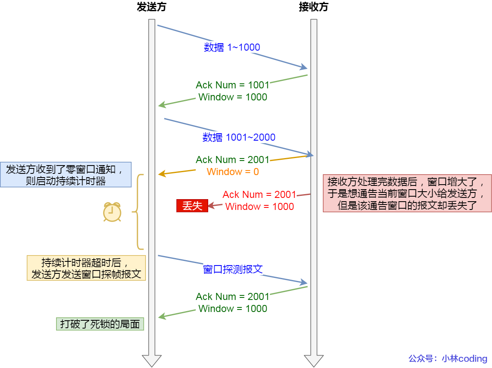

- 如果接收窗口仍然为 0，那么收到这个报文的一方就会重新启动持续计时器；
- 如果接收窗口不是 0，那么死锁的局面就可以被打破了。

窗口探测的次数一般为 3 次，每次大约 30-60 秒（不同的实现可能会不一样）。如果 3 次过后接收窗口还是 0 的话，有的 TCP 实现就会发 `RST` 报文来中断连接。

------

### 拥塞控制

**在网络出现拥堵时，如果继续发送大量数据包，可能会导致数据包时延、丢失等，这时 TCP 就会重传数据，但是一重传就会导致网络的负担更重，于是会导致更大的延迟以及更多的丢包，这个情况就会进入恶性循环被不断地放大....**

作用就是为了**避免「发送方」的数据填满整个网络。**

为了在「发送方」调节所要发送数据的量，定义了一个叫做「**拥塞窗口**」的概念。

> 什么是拥塞窗口？和发送窗口有什么关系呢？

**拥塞窗口 cwnd**是发送方维护的一个的状态变量，它会根据**网络的拥塞程度动态变化的**。

我们在前面提到过发送窗口 `swnd` 和接收窗口 `rwnd` 是约等于的关系，那么由于加入了拥塞窗口的概念后，此时发送窗口的值是swnd = min(cwnd, rwnd)，也就是拥塞窗口和接收窗口中的最小值。

拥塞窗口 `cwnd` 变化的规则：

- 只要网络中没有出现拥塞，`cwnd` 就会增大；
- 但网络中出现了拥塞，`cwnd` 就减少；

> 那么怎么知道当前网络是否出现了拥塞呢？

其实只要「发送方」没有在规定时间内接收到 ACK 应答报文，也就是**发生了超时重传，就会认为网络出现了拥塞。**

> 拥塞控制有哪些控制算法？

- 慢启动

  - 一点一点的提高发送数据包的数量
  - **当发送方每收到一个 ACK，拥塞窗口 cwnd 的大小就会加 1。**直到拥塞窗口的大小>=慢启动门限 `ssthresh` (默认65535)
    - 当 `cwnd` < `ssthresh` 时，使用慢启动算法。
    - 当 `cwnd` >= `ssthresh` 时，就会使用「拥塞避免算法」
  - 慢启动算法，发包的个数是**指数性的增长**

- 拥塞避免

  - **每当收到一个 ACK 时，cwnd 增加 1/cwnd。**
  - 接上前面的慢启动的栗子，现假定 `ssthresh` 为 `8`：
    - 当 8 个 ACK 应答确认到来时，每个确认增加 1/8，8 个 ACK 确认 cwnd 一共增加 1，于是这一次能够发送 9 个 `MSS` 大小的数据，变成了**线性增长。**
  - 拥塞避免算法就是将原本慢启动算法的指数增长变成了线性增长

- 拥塞发生

  - 当网络出现拥塞，也就是会发生数据包重传，重传机制主要有两种，不同重传机制对应拥塞发生算法不一样：

    - 超时重传

      - 这个时候，ssthresh 和 cwnd 的值会发生变化：`ssthresh` 设为 `cwnd/2`，`cwnd` 重置为 `1` （是恢复为 cwnd 初始化值，我这里假定 cwnd 初始化值 1）
      - 缺点：太激进了，反应也很强烈，会造成网络卡顿。

      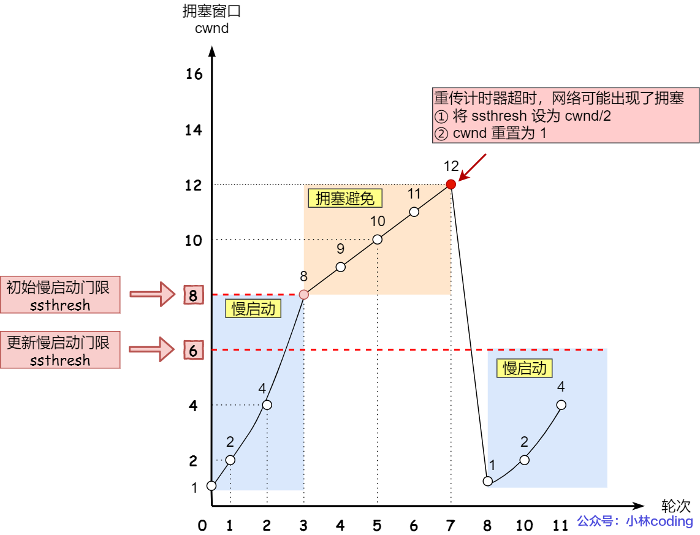

    - 快速重传

      - `cwnd = cwnd/2` ，也就是设置为原来的一半;
      - `ssthresh = cwnd`;
      - 进入快速恢复算法

- 快速恢复

  - 快速重传和快速恢复算法一般同时使用，快速恢复算法是认为，你还能收到 3 个重复 ACK 说明网络也不那么糟糕，所以没有必要像 `RTO` 超时那么强烈。
    - 经过快速重传算法将cwnd和ssthresh修改了之后进入快速恢复算法
      1. 拥塞窗口 `cwnd = ssthresh + 3` （ 3 的意思是确认有 3 个数据包被收到了）；
      2. 重传丢失的数据包；
      3. 如果再收到重复的 ACK，那么 cwnd 增加 1；
      4. 如果收到新数据的 ACK 后，把 cwnd 设置为第一步中的 ssthresh 的值，原因是该 ACK 确认了新的数据，说明从 duplicated ACK 时的数据都已收到，该恢复过程已经结束，可以回到恢复之前的状态了，也即再次进入拥塞避免状态；


## 2.4、TCP半连接队列和全连接队列

在 TCP 三次握手的时候，Linux 内核会维护两个队列，分别是：

- 半连接队列，也称 SYN 队列；
- 全连接队列，也称 accept 队列；

服务端收到客户端发起的 SYN 请求后，**内核会把该连接存储到半连接队列**，并向客户端响应 SYN+ACK，接着客户端会返回 ACK，服务端收到第三次握手的 ACK 后，**内核会把连接从半连接队列移除，然后创建新的完全的连接，并将其添加到 accept 队列，等待进程调用 accept 函数时把连接取出来。**

不管是半连接队列还是全连接队列，都有最大长度限制，`超过限制时，内核会直接丢弃，或返回 RST 包。`


### 拒绝策略

> Linux 有个参数可以指定当 TCP 全连接队列满了会使用什么策略来回应客户端。

实际上，丢弃连接只是 Linux 的默认行为，我们还可以选择向客户端发送 RST 复位报文，告诉客户端连接已经建立失败。


tcp_abort_on_overflow 共有两个值分别是 0 和 1，其分别表示：

- 0 ：如果全连接队列满了，那么 server 扔掉 client 发过来的 ack ；
- 1 ：如果全连接队列满了，server 发送一个 `reset` 包给 client，表示废掉这个握手过程和这个连接；

如果要想知道客户端连接不上服务端，是不是服务端 TCP 全连接队列满的原因，那么可以把 tcp_abort_on_overflow 设置为 1，这时如果在客户端异常中可以看到很多 `connection reset by peer` 的错误，那么就可以证明是由于服务端 TCP 全连接队列溢出的问题。

通常情况下，应当把 tcp_abort_on_overflow 设置为 0，因为这样更有利于应对突发流量。

举个例子，当 TCP 全连接队列满导致服务器丢掉了 ACK，与此同时，客户端的连接状态却是 ESTABLISHED，进程就在建立好的连接上发送请求。只要服务器没有为请求回复 ACK，请求就会被多次**重发**。如果服务器上的进程只是**短暂的繁忙造成 accept 队列满，那么当 TCP 全连接队列有空位时，再次接收到的请求报文由于含有 ACK，仍然会触发服务器端成功建立连接。**

所以，tcp_abort_on_overflow 设为 0 可以提高连接建立的成功率，只有你非常肯定 TCP 全连接队列会长期溢出时，才能设置为 1 以尽快通知客户端。


## 2.5、TCP连接，一端断电和进程崩溃有什么区别

如果「**客户端进程崩溃**」，客户端的进程在发生崩溃的时候，**内核会发送 FIN 报文，与服务端进行四次挥手**。

但是，「**客户端主机宕机**」，那么是不会发生四次挥手的，具体后续会发生什么？还要看服务端会不会发送数据？

- 如果服务端会发送数据，由于客户端已经不存在，收不到数据报文的响应报文，服务端的数据报文会超时重传，当重传总间隔时长达到一定阈值（内核会根据 tcp_retries2 设置的值计算出一个阈值）后，会断开 TCP 连接；
- 如果服务端一直不会发送数据，再看服务端有没有开启 TCP keepalive 机制？
  - 如果有开启，服务端在一段时间没有进行数据交互时，会触发 TCP keepalive 机制，探测对方是否存在，如果探测到对方已经消亡，则会断开自身的 TCP 连接；
  - 如果没有开启，服务端的 TCP 连接会一直存在，并且一直保持在 ESTABLISHED 状态。

## 2.6、拔掉网线后，原本的TCP连接还存在吗？

客户端拔掉网线后，并不会直接影响 TCP 连接状态。所以，拔掉网线后，TCP 连接是否还会存在，关键要看拔掉网线之后，有没有进行数据传输。

有数据传输的情况：

- 在客户端拔掉网线后，如果服务端发送了数据报文，那么在服务端重传次数没有达到最大值之前，客户端就插回了网线，那么双方原本的 TCP 连接还是能正常存在，就好像什么事情都没有发生。
- 在客户端拔掉网线后，如果服务端发送了数据报文，在客户端插回网线之前，服务端重传次数达到了最大值时，服务端就会断开 TCP 连接。等到客户端插回网线后，向服务端发送了数据，因为服务端已经断开了与客户端相同四元组的 TCP 连接，所以就会回 RST 报文，客户端收到后就会断开 TCP 连接。至此， 双方的 TCP 连接都断开了。

没有数据传输的情况：

- 如果双方都没有开启 TCP keepalive 机制，那么在客户端拔掉网线后，如果客户端一直不插回网线，那么客户端和服务端的 TCP 连接状态将会一直保持存在。
- 如果双方都开启了 TCP keepalive 机制，那么在客户端拔掉网线后，如果客户端一直不插回网线，TCP keepalive 机制会探测到对方的 TCP 连接没有存活，于是就会断开 TCP 连接。而如果在 TCP 探测期间，客户端插回了网线，那么双方原本的 TCP 连接还是能正常存在。

## 2.7、TCP和UDP可以使用同一个端口吗？

> TCP 和 UDP 可以同时绑定相同的端口吗？

可以的。

TCP 和 UDP 传输协议，在内核中是由两个完全独立的软件模块实现的。

当主机收到数据包后，可以在` IP 包头的「协议号」字段知道该数据包是 TCP/UDP`，所以可以根据这个信息确定送给哪个模块（TCP/UDP）处理，送给 TCP/UDP 模块的报文根据「端口号」确定送给哪个应用程序处理。

因此， TCP/UDP `各自的端口号也相互独立`，互不影响。

> 多个 TCP 服务进程可以同时绑定同一个端口吗？

如果两个 TCP 服务进程同时绑定的 IP 地址和端口都相同，那么执行 bind() 时候就会出错，错误是“Address already in use”。

如果两个 TCP 服务进程`绑定的端口都相同，而 IP 地址不同`，那么执行 bind() 不会出错。

> 如何解决服务端重启时，报错“Address already in use”的问题？

当我们重启 TCP 服务进程的时候，意味着通过服务器端发起了关闭连接操作，于是就会经过四次挥手，而对于主动关闭方，会在 TIME_WAIT 这个状态里停留一段时间，这个时间大约为 2MSL。

当 TCP 服务进程重启时，服务端会出现 TIME_WAIT 状态的连接，TIME_WAIT 状态的连接使用的 IP+PORT 仍然被认为是一个有效的 IP+PORT 组合，相同机器上不能够在该 IP+PORT 组合上进行绑定，那么执行 bind() 函数的时候，就会返回了 Address already in use 的错误。

要解决这个问题，我们可以对 socket 设置 SO_REUSEADDR 属性。

这样即使存在一个和绑定 IP+PORT 一样的 TIME_WAIT 状态的连接，依然可以正常绑定成功，因此可以正常重启成功。

> 客户端的端口可以重复使用吗？

在客户端执行 connect 函数的时候，只要客户端连接的服务器不是同一个，内核允许端口重复使用。

TCP 连接是由四元组（源IP地址，源端口，目的IP地址，目的端口）唯一确认的，那么只要四元组中其中一个元素发生了变化，那么就表示不同的 TCP 连接的。

所以，如果客户端已使用端口 64992 与服务端 A 建立了连接，那么客户端要与服务端 B 建立连接，还是可以使用端口 64992 的，因为内核是通过四元祖信息来定位一个 TCP 连接的，并不会因为客户端的端口号相同，而导致连接冲突的问题。

> 客户端 TCP 连接 TIME_WAIT 状态过多，会导致端口资源耗尽而无法建立新的连接吗？

要看客户端是否都是与同一个服务器（目标地址和目标端口一样）建立连接。

如果客户端都是与同一个服务器（目标地址和目标端口一样）建立连接，那么如果客户端 TIME_WAIT 状态的连接过多，当端口资源被耗尽，就无法与这个服务器再建立连接了。即使在这种状态下，还是可以与其他服务器建立连接的，只要客户端连接的服务器不是同一个，那么端口是重复使用的。

> 如何解决客户端 TCP 连接 TIME_WAIT 过多，导致无法与同一个服务器建立连接的问题？

打开 net.ipv4.tcp_tw_reuse 这个内核参数。

因为开启了这个内核参数后，客户端调用 connect 函数时，如果选择到的端口，已经被相同四元组的连接占用的时候，就会判断该连接是否处于 TIME_WAIT 状态。

如果该连接处于 TIME_WAIT 状态并且 TIME_WAIT 状态持续的时间超过了 1 秒，那么就会重用这个连接，然后就可以正常使用该端口了。

------

# 三、IP

IP协议位于网络层，处于TCP/IP模型的第三层。

> 网络层的主要作用是：
>
> 1. 实现主机与主机之间的通信，即点对点通信。
>
> **网络层(IP)与数据链路层(MAC)的区别：**
>
> 1. MAC地址的作用是负责`直连`的两个设备之间的通信
> 2. IP地址的作用是负责在`没有直连`的两个网络之间的通信

### IP地址的基础知识

1. 在TCP/IP网络模型中，为了保证设备之间能够正常通信，<u>每个设备都需要配置IP地址</u>，否则无法实现正常的通信。
2. IP地址由`32`位二进制数来存储，为了方便表示和记忆，采用`点分十进制`的方式进行表示(每组8位，共4组，组与组之间以`.`相隔，最后将每组转化为十进制)。
3. 理论上：IP地址的最大值为`2^32 = 4294967296`，即最大允许`43亿`台计算机连接到网络中。
4. 实际上：IP地址并不是根据主机台数来配置的，而是以**`网卡`**为单元，像服务器、路由器等设备都具有`2`个以上的网卡，即他们会有`2`个以上的IP地址。

> 那可能有人有疑问，现在全球接入网络的设备可能已经超过了43亿，这是因为用到了`NAT`地址转换技术。

### IP地址的分类

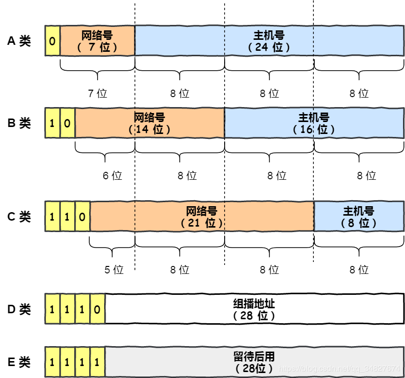

#### A、B、C类地址

对于A、B、C三类主要分为两个部分，分别是`网络号`和`主机号`，


`最大主机数`就是要看主机号的位数，如C类地址的主机号占`8`位，那么C类的最大主机数位`2^8 - 2 = 254`

> C类地址的最大主机数计算为什么要减去 2 ？
>
> - 因为在IP地址中，有两个地址是特殊的，分别是`主机号`**全为1和全为0的地址**。以C类地址举例：
>   - 主机号全为0：`192.168.1.0`，指定某个网络。
>   - 主机号全为1：`192.168.255`，指定某个网络下的所有主机，用于广播。
> - 


### 无分类地址CIDR

正因为IP分类存在很多缺点，所以提出了无分类地址的方案，即`CIDR`。

**这种方式不再有分类地址的概念，32 比特的 IP 地址被划分为两部分，`前面是网络号，后面是主机号`。**

表示形式 `a.b.c.d/x`，其中 `/x` 表示前 x 位属于==**网络号**==， x 的范围是 `0 ~ 32`，这就使得 IP 地址更加具有灵活性。

> 比如 10.100.122.2/24，这种地址表示形式就是 CIDR，/24 表示前 24 位是网络号，剩余的 8 位是主机号。
>
> 

# 四、SOCKET

程序员来实现三次握手、四次挥手过于麻烦，所以操作系统提供了一组接口,把这些复杂过程给隐藏了。

Socket是应用层与TCP/IP协议族通信的中间软件抽象层，它是一组接口，其实就是一个门面模式。

- 短链接
  - Http1.0用的都是短连接
- 长连接
  - Http1.1及之后用的都是长连接

创建 Socket 的时候，可以指定网络层使用的是 IPv4 还是 IPv6，传输层使用的是 TCP 还是 UDP。


服务端首先调用 `socket()` 函数，创建网络协议为 IPv4，以及传输协议为 TCP 的 Socket ，接着调用 `bind()` 函数，给这个 Socket 绑定一个 **IP 地址和端口**，绑定这两个的目的:

- 绑定端口的目的：当内核收到 TCP 报文，通过 TCP 头里面的端口号，来找到我们的应用程序，然后把数据传递给我们。
- 绑定 IP 地址的目的：一台机器是可以有多个网卡的，每个网卡都有对应的 IP 地址，当绑定一个网卡时，内核在收到该网卡上的包，才会发给我们；


绑定完 IP 地址和端口后，就可以调用 `listen()` 函数进行监听，此时对应 TCP 状态图中的 `listen`，如果我们要判定服务器中一个网络程序有没有启动，可以通过 `netstat` 命令查看对应的端口号是否有被监听。

服务端进入了监听状态后，通过调用 `accept()` 函数，来从内核获取客户端的连接，如果没有客户端连接，则会阻塞等待客户端连接的到来。

那客户端是怎么发起连接的呢？客户端在创建好 Socket 后，调用 `connect()` 函数发起连接，该函数的参数要指明服务端的 IP 地址和端口号，然后万众期待的 TCP 三次握手就开始了。

在 TCP 连接的过程中，服务器的内核实际上为每个 Socket 维护了两个队列：

- 一个是「还没完全建立」连接的队列，称为 **TCP 半连接队列**，这个队列都是没有完成三次握手的连接，此时服务端处于 `syn_rcvd` 的状态；
- 一个是「已经建立」连接的队列，称为 **TCP 全连接队列**，这个队列都是完成了三次握手的连接，此时服务端处于 `established` 状态；

当 TCP 全连接队列不为空后，服务端的 `accept()` 函数，**就会从内核中的 TCP 全连接队列里拿出一个已经完成连接的 Socket 返回应用程序，后续数据传输都用这个 Socket**。

注意，监听的 Socket 和真正用来传数据的 Socket 是两个：

- 一个叫作**监听 Socket**；
- 一个叫作**已连接 Socket**；

连接建立后，客户端和服务端就开始相互传输数据了，双方都可以通过 `read()` 和 `write()` 函数来读写数据。


------

# 五、Unix中的五种IO模型

## 1、BIO

#### **单线程下的BIO**

传统的BIO对应于一个连接一个线程的模型，由于`socket.accept()、socket.read()、socket.write()`三个主要函数都是同步阻塞的，所以如果客户端与服务端建立了连接，如果这个连接的客户端迟迟不发数据，程就会一直堵塞在read()方法上，这样其他客户端也不能进行连接，也就是一次只能处理一个客户端。

#### **多线程下的BIO**

只要连接了一个socket，就分配一个线程来处理。这样read()方法堵塞在每个具体的线程上而不堵塞主线程。开启多线程，把CPU释放出来的，就可以让CPU去处理更多的事情。其实这也是所有使用多线程的本质：

1. 利用多核。
2. 当I/O阻塞系统，但CPU空闲的时候，可以利用多线程使用CPU资源。

最核心的一句话：`之所以使用多线程，就是因为在进行IO操作的时候，一是没有办法知道到底能不能写、能不能读，只能"傻等"，即使通过各种估算，算出来操作系统没有能力进行读写，也没法在socket.read()和socket.write()函数中返回，这两个函数无法进行有效的中断。`

现在的多线程一般都使用线程池，可以让线程的创建和回收成本相对较低。在活动连接数不是特别高（小于单机1000）的情况下，这种模型是比较不错的，可以让每一个连接专注于自己的I/O并且编程模型简单，也不用过多考虑系统的过载、限流等问题。线程池本身就是一个天然的漏斗，可以缓冲一些系统处理不了的连接或请求。

> Tomcat 7之前就是使用 BIO 多线程来解决多连接。

##### 缺点

1. `线程的创建和销毁成本很高`，在Linux操作系统中，线程本质上就是进程。创建和销毁都是重量级的系统函数。
2. `线程本身占用较大内存`，像Java的线程栈，一般至少分配512K~1M的空间，如果系统中的线程数过千，恐怕整个JVM的内存都会被吃掉一半。
3. `线程的切换成本是很高的`。操作系统发生线程切换的时候，需要保留线程的上下文，然后执行系统调用。如果线程数过高，可能执行线程切换的时间甚至会大于线程执行的时间，这时候带来的表现往往是系统load偏高、CPU sy使用率特别高（超过20%以上)，导致系统几乎陷入不可用的状态。
4. 容易造成锯齿状的系统负载。因为系统负载是用活动线程数或CPU核心数，一旦线程数量高但外部网络环境不是很稳定，就很容易造成大量请求的结果同时返回，激活大量阻塞线程从而使系统负载压力过大。

#### BIO阻塞在哪？

1、在IO执行的两个阶段都被阻塞了？

1. 数据准备的过程
2. 数据从内核空间拷贝到用户进程缓冲区的过程

> - 阻塞 I/O 会阻塞在「过程 1 」和「过程 2」，而非阻塞 I/O 和基于非阻塞 I/O 的多路复用只会阻塞在「过程 2」，所以这三个都可以认为是同步 I/O。
>
> - 异步 I/O 则不同，「过程 1 」和「过程 2 」都不会阻塞。

2、传统的BIO解决不了C10K、C10M的问题。

- C10K和C10M是两个常见的计算机科学术语，用于描述服务器的并发连接能力。它们的含义如下：
  - `C10K`：指的是服务器能够`同时处理10,000个并发连接`的能力==一百万==。这个概念最初是由Dan Kegel在2004年提出，当时他发现传统的服务器技术已经无法满足Web服务器的高并发需求。为了应对这个问题，他提出了一些解决方案，如使用线程池、事件驱动等技术，以提高服务器的并发连接能力。C10K已经成为了一个广为人知的概念，被用于描述服务器的性能和扩展性。
    - 核心是要解决三个问题：
      - 内核用什么数据结构将事件通知给线程
      - 用什么编程模型(同步、异步)处理问题
      - 具体的数据压缩、拷贝、编码解码如何处理
  - `C10M`：指的是服务器能够`同时处理10,000,000个并发连接`的能力==一千万==。这个概念是在C10K的基础上提出的，它反映了互联网应用的快速发展和大规模部署的需求。实现C10M需要采用更加先进的服务器技术，如多线程、事件驱动、异步IO等，以便更好地支持高并发连接和大规模数据处理。

------

## 2、NIO

1. 在BIO中，应用程序在从`调用 recvfrom `开始到它`返回有数据报`这段时间是阻塞的，recvfrom 返回成功后，应用进程开始处理数据报。

NIO 是一种同步非阻塞的IO模型，也是I/O多路复用的基础，已经被越来越多的应用到大型应用服务器，成为解决高并发与大量连接、I/O处理问题的有效方式。

当用户进程发出read操作时，如果kernel中的数据还没有准备好，那么它并不会block用户进程，而是立刻返回一个error。从用户进程角度讲 ，它发起一个read操作后，并不需要等待，而是马上就得到了一个结果。用户进程判断结果是一个error时，它就知道数据还没有准备好，于是它可以再次发送read操作。一旦kernel中的数据准备好了，并且又再次收到了用户进程的system call，那么它马上就将数据拷贝到了用户内存，然后返回。所以，NIO特点是用户进程需要不断的主动询问内核数据准备好了吗？

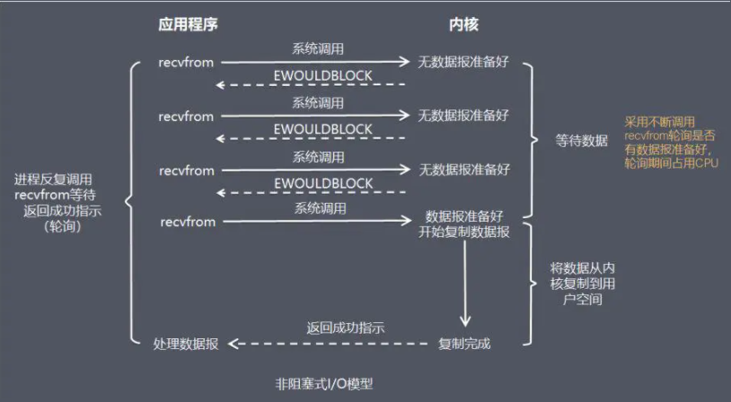

在非阻塞式 I/O 模型中，应用程序把一个套接口设置为非阻塞，就是告诉内核，当所请求的I/O操作无法完成时，不要将进程睡眠而是返回一个“错误”，应用程序基于 I/O 操作函数将不断的轮询数据是否已经准备好，如果没有准备好，继续轮询，直到数据准备好为止。

NIO 的读写函数可以立刻返回，这就给了我们不开线程利用CPU的机会，如果一个连接不能读写（socket.read()返回0或者socket.write()返回0），我们可以把这件事记下来，记录的方式通常是在Selector上注册标记位，然后切换到其它就绪的连接（channel）继续进行读写。

**NIO 重要的特点是：**

- socket主要的读、写、注册和接收函数，在等待就绪阶段都是非阻塞的
- `真正的I/O操作是同步阻塞的`（消耗CPU但性能非常高）。

**优点：**

1. NIO成功解决了BIO需要开启多线程的问题，NIO 中一个线程就能处理多个socket。
2. 不会阻塞在内核的等待数据过程，每次发起的 I/O 请求可以立即返回，不用阻塞等待，实时性较好。

**缺点：**

`轮询将会不断地询问内核，这将占用大量的 CPU 时间，系统资源利用率较低，所以一般 Web 服务器不使用这种 I/O 模型。`

1. 这个模型在客户端少的时候十分好用，但是客户端如果很多的话。

   比如有1万个客户端进行连接，那么每次循环就要遍历1万个socket，如果一万个socket中只有10个socket有数据，也会遍历一万个socket，就会做很多无用功，每次遍历遇到 read 返回 -1 时仍然是一次浪费资源的系统调用。

2. 这个遍历过程是在用户态进行的，用户态判断socket是否有数据还是调用内核的read()方法实现的，这就涉及到用户态和内核态的切换，每遍历一个就要切换一次，开销很大因为这些问题的存在。

**结论：**

让Linux内核搞定上述需求，我们将一批文件描述符通过一次系统调用传给内核由内核层去遍历，才能真正解决这个问题。IO多路复用应运而生，也即将上述工作直接放进Linux内核，不再两态转换而是直接从内核获得结果，因为内核是非阻塞的。

## 3、IO多路复用

**名词解释**

I/O multiplexing 这里面的 multiplexing 指的其实是在`单个线程通过记录跟踪每一个Sock(I/O流)的状态来同时管理多个I/O流`. 目的是尽量多的提高服务器的吞吐能力。

IO multiplexing 的实现方式有多种，熟知的有`select，poll，epoll`，又称这种IO方式为`event driven IO(事件驱动IO)`。就是通过一种机制，一个进程可以监视多个描述符，一旦某个描述符**就绪**（一般是读就绪或者写就绪），能够通知程序进行相应的读写操作。可以基于一个阻塞对象，同时在多个描述符上等待就绪，而不是使用多个线程(每个文件描述符一个线程，每次new一个线程)，这样可以大大节省系统资源。所以，I/O 多路复用的特点是`通过一种机制一个进程能同时等待多个文件描述符而这些文件描述符（套接字描述符）其中的任意一个进入读就绪状态，select()函数就可以返回`。

所谓 I/O 多路复用机制指`内核一旦发现进程指定的一个或者多个IO条件准备读取，它就通知该进程`，就是说通过一种机制，可以监视多个描述符，一旦某个描述符就绪（一般是读就绪或写就绪），能够通知程序进行相应的读写操作。这种机制的使用需要 select 、 poll 、 epoll 来配合。

将用户socket对应的fd注册进epoll，然后epoll帮你监听哪些socket上有消息到达，这样就避免了大量的无用操作。此时的socket应该采用非阻塞模式。这样，整个过程只在调用select、poll、epoll这些调用的时候才会阻塞，收发客户消息是不会阻塞的，整个进程或者线程就被充分利用起来，这就是事件驱动，所谓的reactor反应模式。

多个连接共用一个阻塞对象，应用程序只需要在一个阻塞对象上等待，无需阻塞等待所有连接。

当某条连接有新的数据可以处理时，操作系统通知应用程序，线程从阻塞状态返回，开始进行业务处理。

这种机制的具体实现一般采用select、poll、epoll来实现：

#### Select


select 函数监视的文件描述符分3类，分别是readfds、writefds和exceptfds，select函数会将用户要监视的文件描述符集合拷贝到内核空间，`调用后函数会阻塞，直到有描述符就绪（可读、可写、或者有except）或超时（timeout指定等待时间，如果立即返回设为null即可）`函数返回才会返回就绪文件描述符的数量。当select函数返回后，可以通过遍历传入的文件描述符集合fd_set，来找到就绪的描述符。

> fd_set可以理解为一个位数组，事实上底层就是用一个long int类型的数组

```c
typedef long int __fd_mask;

/* fd_set for select and pselect.  */
typedef struct {
    #ifdef __USE_XOPEN
        __fd_mask fds_bits[__FD_SETSIZE / __NFDBITS];
    # define __FDS_BITS(set) ((set)->fds_bits)
    #else
        __fd_mask __fds_bits[__FD_SETSIZE / __NFDBITS];
    # define __FDS_BITS(set) ((set)->__fds_bits)
    #endif
} fd_set;

//参数中的 fd_set 类型表示文件描述符的集合。

//由于文件描述符 fd 是一个从 0 开始的无符号整数，所以可以使用 fd_set 的二进制每一位来表示一个文件描述符。某一位为 1，表示对应的文件描述符已就绪。比如比如设 fd_set 长度为 1 字节，则一个 fd_set 变量最大可以表示 8 个文件描述符。当 select 返回 fd_set = 00010011 时，表示文件描述符 1、2、5 已经就绪。

// fd_set 的使用涉及以下几个 API：
#include <sys/select.h>   
int FD_ZERO(int fd, fd_set *fdset);  // 将 fd_set 所有位置 0
int FD_CLR(int fd, fd_set *fdset);   // 将 fd_set 某一位置 0
int FD_SET(int fd, fd_set *fd_set);  // 将 fd_set 某一位置 1
int FD_ISSET(int fd, fd_set *fdset); // 检测 fd_set 某一位是否为 1
```


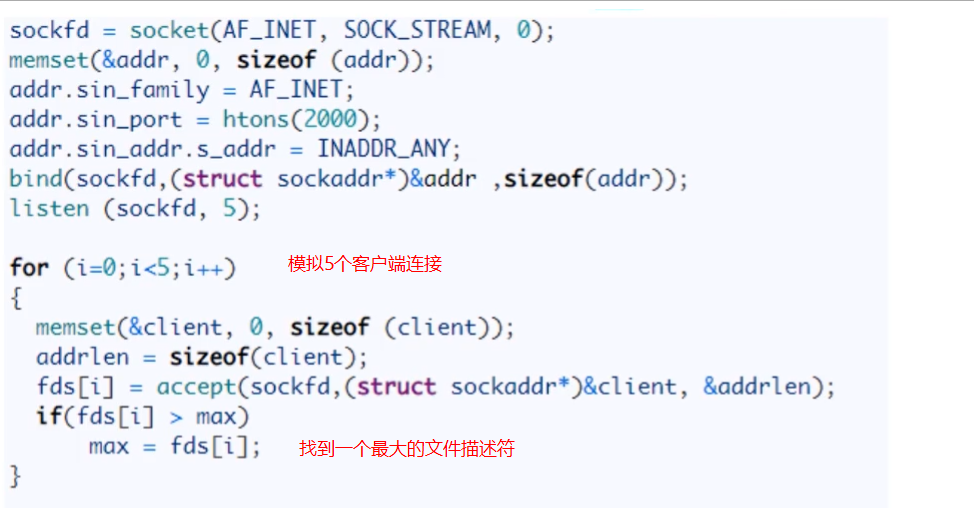

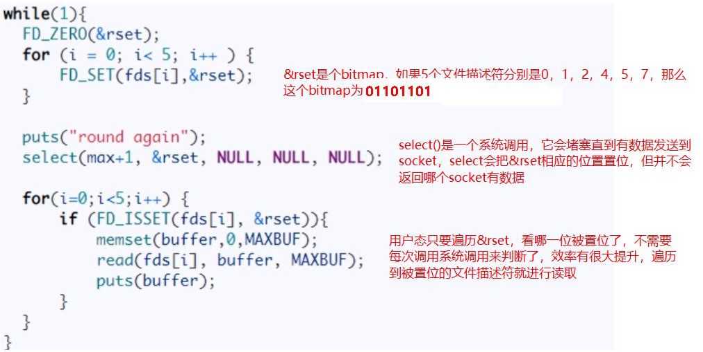


- `&rset`表示一个位向量(fd_set)，每个位代表一个文件描述符。如果有文件描述符准备好进行读取操作，那么该文件描述符所对应的位将被设置为1。因此，可以通过检查&rset指向的fd_set数据结构，来确定哪些文件描述符可以进行读取操作。

- 需要**两次**遍历文件描述符集合
  - 内核态遍历文件描述符集合找出活跃的描述符，并置位为1
  - 用户态遍历文件描述符集合找出被置为的描述符

- 会拷贝**2次**文件描述符集合。
  - 在用户态通过select函数将fd_set拷贝到内核空间
  - 在内核态将遍历修改过的fd_set拷贝到用户空间
- select使用固定长度的==bitsmap==表示文件描述符集合

##### **优点**

select 其实就是把NIO中用户态要遍历的`fd`数组(我们的每一个socket链接，安装进ArrayList里面的那个)拷贝到了内核态，让内核态来遍历，因为用户态判断socket是否有数据还是要调用内核态的，`所有拷贝到内核态后，这样遍历判断的时候就不用一直用户态和内核态频繁切换了`。

##### **问题**

1. bitmap在32位下最大1024，64位最大2048。一个进程最多只能处理2048个客户端。

2. &rset 不可重用，每次socket有数据就相应的位会被置位。

3. 文件描述符数组拷贝到了内核态(只不过无系统调用切换上下文的开销。（内核层可优化为异步事件通知）)，仍然有开销。select 调用需要传入 fd 数组，需要拷贝一份到内核，高并发场景下这样的拷贝消耗的资源是惊人的。（可优化为不复制）

4. `select并没有通知用户态哪一个socket有数据，仍然需要O(n)的遍历`。select 仅仅返回可读文件描述符的个数，具体哪个可读还是要用户自己遍历。（可优化为只返回给用户就绪的文件描述符，无需用户做无效的遍历）

------

#### Poll

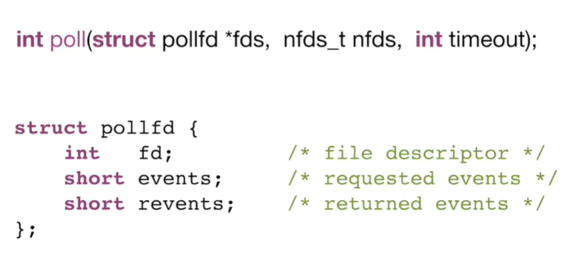

 

 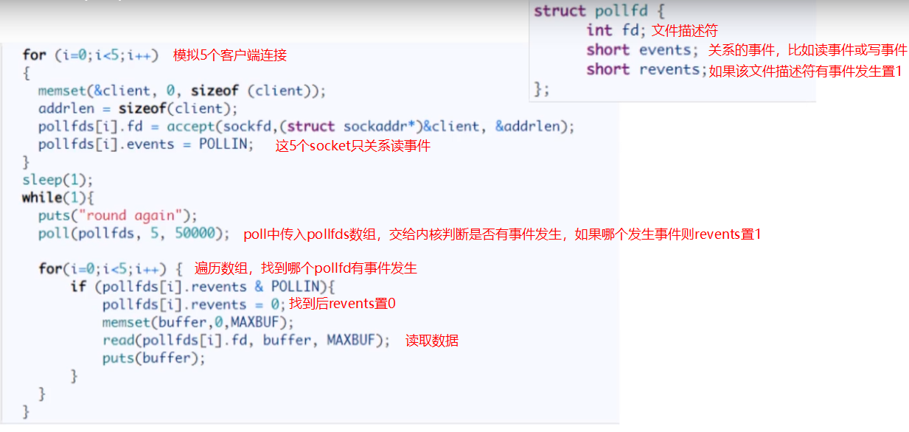


##### 优点

1. poll使用pollfd **动态数组来代替select中的bitsmap**，数组没有1024的限制，可以一次管理更多的client。`它和 select 的主要区别就是，去掉了 select 只能监听 1024 个文件描述符的限制。`

2. 当pollfds 数组中有事件发生，相应的revents置位为1，`遍历的时候又置位回零`，实现了pollfd数组的重用。

##### 问题


poll 解决了select缺点中的前两条，其本质原理还是select的方法，还存在select中原来的问题

1. `pollfds数组拷贝到了内核态，仍然有开销`
2. poll并没有通知用户态哪一个socket有数据，`仍然需要O(n)的遍历`

------

#### Epoll

##### 三个函数

```c
// 数据结构
// 每一个epoll对象都有一个独立的eventpoll结构体
// 红黑树用于存放通过epoll_ctl方法向epoll对象中添加进来的事件
// epoll_wait检查是否有事件发生时，只需要检查eventpoll对象中的rdlist双链表中是否有epitem元素即可
struct eventpoll {
    ...
    /*红黑树的根节点，这颗树存储着所有添加到epoll中的需要监控的事件*/
    struct rb_root  rbr;
    /*双链表存储所有就绪的文件描述符*/
    struct list_head rdlist;
    ...
};
```

|  | 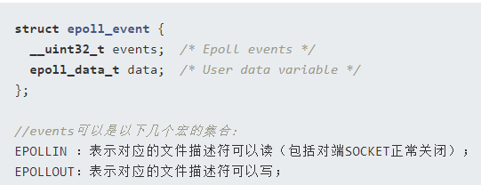 |
| --------------------------------------------------- | --------------------------------------------------- |

三步调用：

- `epoll_create(int size)`创建一个epoll实例，同时返回该实例的文件描述符(该描述符仅仅指向对应的epoll实例)，size用来告诉内核监听的数目一共有多大，参数size并不是限制了epoll所能监听的描述符最大个数，只是对内核初始分配内部数据结构的一个建议，会扩容的。
- `epoll_ctl(int epfd, int op, int fd, struct epoll_event *event)`向内核添加、修改或删除要监控的文件描述符
  - 返回值0或-1，表示上述操作是否成功。
  - epoll_ctl 会将文件描述符 fd 添加到 epoll 实例的监听列表里，同时为 fd 设置一个回调函数，并监听事件 event，如果红黑树中已经存在立刻返回。当 fd 上发生相应事件时，会调用回调函数，将 fd 添加到 epoll 实例的就绪队列上。

- `epoll_wait(int epfd, struct epoll_event * events, int maxevents, int timeout)`，它会等待epoll句柄中IO事件的发生，并将事件从内核缓冲区中复制到用户空间中的一个事件数组中。最多返回maxevents个事件。参数events用来从内核得到事件的集合，maxevents告之内核这个events有多大。
  - epoll_wait函数`是一个阻塞函数`，它会使调用它的线程进入阻塞状态，直到有事件发生或者超时。当没有任何事件发生时，epoll_wait函数会一直阻塞等待，直到有事件到来或者超时。因此，在使用epoll_wait函数时需要注意其可能会阻塞程序的执行。为了避免阻塞，可以通过设置超时时间或使用非阻塞方式等方法来实现对epoll_wait函数的调用。


| 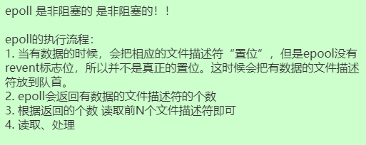 |  |
| ---------------------------------------------------- | ------------------------------------------------------------ |

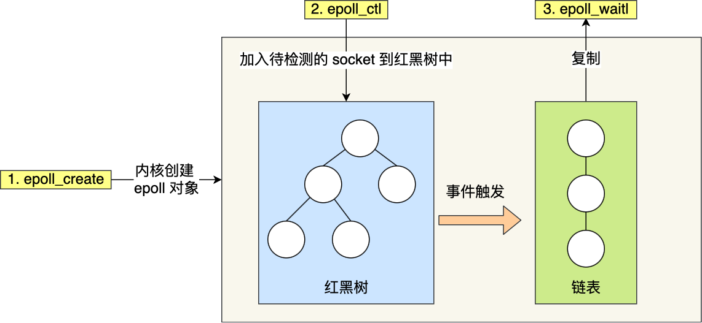

##### 比select、poll强在哪里？

- epoll 在内核里使用**`红黑树来跟踪进程所有待检测的文件描述字`**，把需要监控的socket 通过 `epoll_ctl()` 函数加入内核中的红黑树里，红黑树是个高效的数据结构，增删改一般时间复杂度是 `O(logn)`。而 select/poll 内核里没有类似 epoll 红黑树这种保存所有待检测的 socket 的数据结构，所以 select/poll 每次操作时都传入整个 socket 集合给内核，而 epoll 因为在内核维护了红黑树，可以保存所有待检测的 socket ，所以只需要传入一个待检测的 socket，减少了内核和用户空间大量的数据拷贝和内存分配。

- epoll 使用**`事件驱动`**的机制，内核里**`维护了一个链表来记录就绪事件`**，当某个 socket 有事件发生时，通过**回调函数**内核会将其加入到这个就绪事件列表中，当用户调用 `epoll_wait()` 函数时，只会返回有事件发生的文件描述符的个数，不需要像 select/poll 那样轮询扫描整个 socket 集合，大大提高了检测的效率。
- 当一个文件描述符上有事件发生时，内核会将该文件描述符对应的节点从红黑树上删除，并将其加入到链表中。

##### 事件通知机制

1. 当有网卡上有数据到达了，首先会放到DMA（内存中的一个buffer，网卡可以直接访问这个数据区域）中
2. 网卡向cpu发起中断，让cpu先处理网卡的事
3. 中断会在内存中会绑定一个回调，哪个socket中有数据，回调函数就把哪个socket放入就绪列表中

> Java中channel列表就是通过中断程序被放入到就绪列表。


#### 边缘触发和水平触发

epoll 支持两种事件触发模式，分别是**边缘触发（edge-triggered，ET）和水平触发（level-triggered，LT）**。

- `边缘触发ET`：当被监控的 Socket 描述符上有可读事件发生时，**服务器端只会从 epoll_wait 中苏醒一次**，即使进程没有调用 read 函数从内核读取数据，也依然只苏醒一次，因此我们程序要保证一次性将内核缓冲区的数据读取完。
- `水平触发LT`：当被监控的 Socket 上有可读事件发生时，**服务器端不断地从 epoll_wait 中苏醒，直到内核缓冲区数据被 read 函数读完才结束**，目的是告诉我们有数据需要读取。

举个例子，你的快递被放到了一个快递箱里，如果快递箱只会通过短信通知你一次，即使你一直没有去取，它也不会再发送第二条短信提醒你，这个方式就是边缘触发；如果快递箱发现你的快递没有被取出，它就会不停地发短信通知你，直到你取出了快递，它才消停，这个就是水平触发的方式。

这就是两者的区别，水平触发的意思是只要满足事件的条件，比如内核中有数据需要读，就一直不断地把这个事件传递给用户；而边缘触发的意思是只有第一次满足条件的时候才触发，之后就不会再传递同样的事件了。

- 如果使用水平触发模式，当内核通知文件描述符可读写时，接下来还可以继续去检测它的状态，看它是否依然可读或可写。所以在收到通知后，没必要一次执行尽可能多的读写操作。
  - 读缓冲区只要不为空，就一直会触发读事件；写缓冲区只要不满(发送得速度比写得速度快)，就一直会触发写事件。这个比较符合编程习惯，也是epoll的缺省模式。
  - 对于LT模式，要避免"写的死循环"问题：写缓冲区为满的概率很小，也就是"写的条件"会一直满足，所以如果你注册了写事件，没有数据要写，但它会一直触发，所以在LT模式下，写完数据，一定要取消写事件。

- 如果使用边缘触发模式，`I/O 事件发生时只会通知一次`，而且我们不知道到底能读写多少数据，所以在收到通知后应尽可能地读写数据，以免错失读写的机会。因此，我们会**循环**从文件描述符读写数据，那么如果文件描述符是阻塞的，没有数据可读写时，进程会阻塞在读写函数那里，程序就没办法继续往下执行。所以，**边缘触发模式一般和非阻塞 I/O 搭配使用**，程序会一直执行 I/O 操作，直到系统调用（如 `read` 和 `write`）返回错误，错误类型为 `EAGAIN` 或 `EWOULDBLOCK`。
  - 读缓冲区的状态，从空转为非空的时候，触发1次；写缓冲区的状态，从满转为非满的时候，触发1次。比如你发送一个大文件，把写缓存区塞满了，之后缓存区可以写了，就会发生一次从满到不满的切换。
  - 对应ET模式，要避免"short read"问题:比如你收到100个字节，它触发1次，但你只读到了50个字节，剩下的50个字节不读，它也不会再次触发，此时这个socket就废了。因此在ET模式，一定要把"读缓冲区"的数据读完。

一般来说，**边缘触发的效率比水平触发的效率要高**，因为边缘触发`可以减少 epoll_wait 的系统调用次数，系统调用也是有一定的开销的的，毕竟也存在上下文的切换`。

`select/poll 只有水平触发模式，epoll 默认的触发模式是水平触发，但是可以根据应用场景设置为边缘触发模式。`


> 在Java NIO中如何开启ET模式？如何开启LT模式？
>
> select()，poll()模型都是水平触发模式，信号驱动 IO 是边缘触发模式，epoll()模型即支持水平触发，也支持边缘触发，默认是水平触发。JDK 中的 epoll 实现是`水平触发`，而 Netty 提供的 Epoll 的实现中是`边缘触发`。Nginx中使用的也是ET模式下的epoll
>
> PS：开启ET模式之后，注意在处理完某个通道的事件之后再次注册该通道的监听器，否则在下次该通道的状态改变时，将不会收到通知。

##### 具体实现

当一个socket句柄上有事件时，内核会把该句柄插入上面所说的准备就绪list链表，这时我们调用epoll_wait，会把准备就绪的socket拷贝到用户态内存，然后清空准备就绪list链表， 最后，epoll_wait干了件事，就是检查这些socket，如果不是ET模式（就是LT模式的句柄了），并且这些socket上确实有未处理的事件时，又把该句柄放回到刚刚清空的准备就绪链表了，所以，非ET的句柄，只要它上面还有事件，epoll_wait每次都会返回。而ET模式的句柄，除非有新中断到，即使socket上的事件没有处理完，也是不会次次从epoll_wait返回的。

#### 多路复用快的原因

在于操作系统提供了这样的系统调用，使得原来的 while 循环里多次系统调用，变成了`一次系统调用 + 内核层遍历这些文件描述符`。

epoll是现在最先进的IO多路复用器，Redis、Nginx，linux中的Java NIO都使用的是epoll。

这里“多路”指的是多个网络连接，“复用”指的是复用同一个线程。

1. 一个socket的生命周期中只有一次从用户态拷贝到内核态的过程，开销小
2. 使用event事件通知机制，每次socket中有数据会主动通知内核，并加入到就绪链表中，不需要遍历所有的socket

------

##### 总结

在多路复用IO模型中，会有一个内核线程不断地去轮询多个 socket 的状态，只有当真正读写事件发送时，才真正调用实际的IO读写操作。

因为在多路复用IO模型中，

1. `只需要使用一个线程就可以管理多个socket，系统不需要建立新的进程或者线程，也不必维护这些线程和进程`，
2. `并且只有真正有读写事件进行时，才会使用IO资源，所以它大大减少来资源占用`。
3. 多路I/O复用模型是利用 select、poll、epoll `可以同时监察多个流的 I/O 事件的能力`，在空闲的时候，会把当前线程阻塞掉，当有一个或多个流有 I/O 事件时，就从阻塞态中唤醒，于是程序就会轮询一遍所有的流（epoll 是只轮询那些真正发出了事件的流），并且只依次顺序的处理就绪的流，这种做法就`避免了大量的无用操作`。 采用多路 I/O 复用技术可以让单个线程高效的处理多个连接请求`（尽量减少网络 IO 的时间消耗）`，且 Redis 在内存中操作数据的速度非常快，也就是说内存内的操作不会成为影响Redis性能的瓶颈。

#### 三者对比

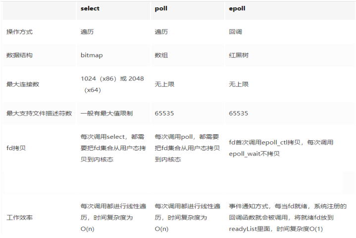


## 4、信号驱动IO

## 5、异步IO

## 五种模型对比

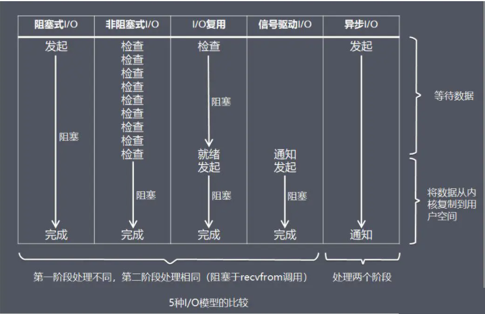


## Java中的实现

### NIO中如何实现IO多路复用

1. JDK1.4版本是用linux的内核函数select()或poll()来实现
2. JDK1.5开始引入了epoll基于事件响应机制来优化NIO


### 基于NIO非阻塞代码案例

```java
package com.tuling.nio;

import java.io.IOException;
import java.net.InetSocketAddress;
import java.nio.ByteBuffer;
import java.nio.channels.ServerSocketChannel;
import java.nio.channels.SocketChannel;
import java.util.ArrayList;
import java.util.Iterator;
import java.util.List;

	public class NioServer {
	// 保存客户端连接
	static List<SocketChannel> channelList = new ArrayList<>();

	public static void main(String[] args) throws IOException, InterruptedException {
	
		 // 创建NIO ServerSocketChannel,与BIO的serverSocket类似
		 ServerSocketChannel serverSocket = ServerSocketChannel.open();
		 serverSocket.socket().bind(new InetSocketAddress(9000));
		 // 设置ServerSocketChannel为非阻塞
		
		 serverSocket.configureBlocking(false);
		 System.out.println("服务启动成功");
		
		 while (true) {
			 // 非阻塞模式accept方法不会阻塞，否则会阻塞
			 // NIO的非阻塞是由操作系统内部实现的，底层调用了linux内核的accept函数
			 SocketChannel socketChannel = serverSocket.accept();
			 if (socketChannel != null) { // 如果有客户端进行连接
				 System.out.println("连接成功");
				 // 设置SocketChannel为非阻塞
				 socketChannel.configureBlocking(false);
				 // 保存客户端连接在List中
				 channelList.add(socketChannel);
			 }
			 // 遍历连接进行数据读取
			 Iterator<SocketChannel> iterator = channelList.iterator();
			 while (iterator.hasNext()) {
				 SocketChannel sc = iterator.next();
				 ByteBuffer byteBuffer = ByteBuffer.allocate(128);
				 // 非阻塞模式read方法不会阻塞，否则会阻塞
				 int len = sc.read(byteBuffer);
				 // 如果有数据，把数据打印出来
				 if (len > 0) {
				 	System.out.println("接收到消息：" + new String(byteBuffer.array()));
				 } else if (len == ‐1) { // 如果客户端断开，把socket从集合中去掉
				 	iterator.remove();
				 	System.out.println("客户端断开连接");
				 }
			 }
		}
	}
}
```


### NIO引入多路复用器版本

```java
import java.io.IOException;
import java.net.InetSocketAddress;
import java.nio.ByteBuffer;
import java.nio.channels.SelectionKey;
import java.nio.channels.Selector;
import java.nio.channels.ServerSocketChannel;
import java.nio.channels.SocketChannel;
import java.util.Iterator;
import java.util.Set;
public class NioSelectorServer {
	public static void main(String[] args) throws IOException, InterruptedException {
		// 创建NIO ServerSocketChannel
		ServerSocketChannel serverSocket = ServerSocketChannel.open();
		serverSocket.socket().bind(new InetSocketAddress(9000));
		// 设置ServerSocketChannel为非阻塞
		serverSocket.configureBlocking(false);
		// 打开Selector处理Channel，即创建epoll
		Selector selector = Selector.open();
		// 把ServerSocketChannel注册到selector上，并且selector对客户端accept连接操作感兴趣

		serverSocket.register(selector, SelectionKey.OP_ACCEPT);
		System.out.println("服务启动成功");
		
		while (true) {
			// 阻塞等待需要处理的事件发生
			selector.select(); // 会阻塞
			
			// 获取selector中注册的全部事件的 SelectionKey 实例
			Set<SelectionKey> selectionKeys = selector.selectedKeys();
			Iterator<SelectionKey> iterator = selectionKeys.iterator();
			
			// 遍历SelectionKey对事件进行处理
			while (iterator.hasNext()) {
				SelectionKey key = iterator.next();
				// 如果是OP_ACCEPT事件，则进行连接获取和事件注册
				if (key.isAcceptable()) {
					ServerSocketChannel server = (ServerSocketChannel) key.channel();
					SocketChannel socketChannel = server.accept();
					socketChannel.configureBlocking(false);
					// 这里只注册了读事件，如果需要给客户端发送数据可以注册写事件
					socketChannel.register(selector, SelectionKey.OP_READ);
					System.out.println("客户端连接成功");
				} else if (key.isReadable()) { // 如果是OP_READ事件，则进行读取和打印
					SocketChannel socketChannel = (SocketChannel) key.channel();
					ByteBuffer byteBuffer = ByteBuffer.allocate(128);
					int len = socketChannel.read(byteBuffer);
					// 如果有数据，把数据打印出来
					if (len > 0) {
					System.out.println("接收到消息：" + new String(byteBuffer.array()));
					} else if (len == ‐1) { // 如果客户端断开连接，关闭Socket
					System.out.println("客户端断开连接");
					socketChannel.close();
					}
				}
				//从事件集合里删除本次处理的key，防止下次select重复处理
				iterator.remove();
			}
		}
	}
}
```


不同平台有不同的实现

- Selector.java -> SelectoprProvider.java -> DefaultSelectorProvider -> WindowSelector
- Selector.java -> SelectoprProvider.java -> DefaultSelectorProvider -> LinuxSelector

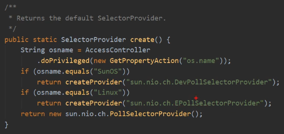

1. Selector.open() //创建多路复用器

2. socketChannel.register(selector, SelectionKey.OP_READ) //将channel注册到多路复用器上 
3. selector.select() //阻塞等待需要处理的事件发生

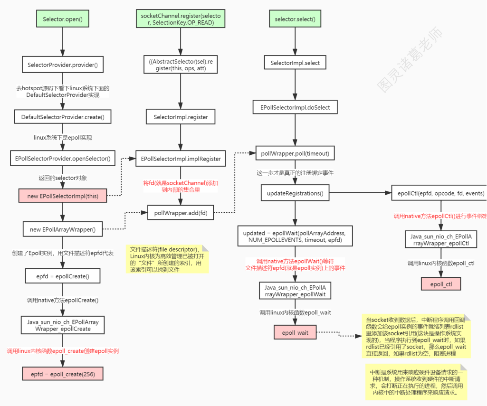

NIO整个调用流程就是Java调用了操作系统的内核函数来创建Socket，获取到Socket的文件描述符，再创建一个Selector 对象，对应操作系统的Epoll描述符，将获取到的Socket连接的文件描述符的事件绑定到Selector对应的Epoll文件描述符上，进 行事件的异步通知，这样就实现了使用一条线程，并且不需要太多的无效的遍历，将事件处理交给了操作系统内核(操作系统中断 程序实现)，大大提高了效率.

#### selector.select()方法是阻塞的，为什么说NIO是非阻塞IO

Java NIO中的Selector.select()方法确实可以阻塞，但NIO仍然被认为是非阻塞的，这是因为在NIO中，虽然某些I/O操作可能会阻塞当前线程，`但是这种阻塞是有条件的，仅在发生I/O事件之前会发生，而不会一直阻塞等待，从而提高了系统的并发性能。`

在传统的Java IO模型中，每个I/O操作都是阻塞的，这意味着当一个线程执行I/O操作时，它将一直阻塞，直到I/O操作完成或发生错误。在这种模型下，如果多个线程都在执行I/O操作并阻塞等待，系统的并发性能将会受到极大的影响。

与之相比，Java NIO使用了一些新的I/O组件，如Buffer、Channel、Selector等，这些组件提供了更为灵活和高效的I/O操作方式，使得Java NIO在处理大量并发I/O请求时，能够更好地发挥其性能优势。在NIO模型中，如果一个线程执行I/O操作时没有可用的数据可供处理，它将会立即返回而不会阻塞，这样就可以在等待I/O事件就绪的同时，充分利用CPU的处理能力，提高系统的并发性能。

`Selector.select()方法的阻塞只发生在等待I/O事件就绪的时候，而不是在执行I/O操作时一直阻塞。`

当然他也有其他方法可以避免阻塞。


------


# 六、部分指标的范围

### 1、单台服务器并发，TCP连接数可以有多少

#### 文件句柄限制

**在linux下编写网络服务器程序的朋友肯定都知道每一个tcp连接都要占一个文件描述符，一旦这个文件描述符使用完了，新的连接到来返回给我们的错误是“Socket/File:Can't open so many files”。**

1. ### 进程限制

2. ### 全局限制

#### 端口号范围限制

因此server端tcp连接4元组中只有`remote ip（也就是client ip）和remote port（客户端port）`是可变的，因此最大tcp连接为客户端ip数×客户端port数，对IPV4，不考虑ip地址分类等因素，最大tcp连接数约为`2的32次方（ip数）×2的16次方（port数）`，也就是server端单机最大tcp连接数约为**2的48次方。**


------

## 跨域

### 定义

当浏览器执行脚本时会检查是否为同源，只有同源的脚本才会执行，如果不同源极为跨域。


- 同源指的是访问的协议、域名、端口号都相同。
- 同源策略是由Netscape提出的著名安全策略，是浏览器最核心、最基本的安全功能。
- Ajax发起的跨域Http请求，结果被浏览器拦截，同时ajax请求不能携带于本网站不同源的Cookie。


### 如何实现跨域请求？

#### 1、JSONP

#### 2、 CORS(跨域资源共享)

#### 3、代理跨域请求


