**NoSQL**：not only SQL，意即“不仅仅是SQL”，泛指非关系型数据库。

这些类型的数据存储不需要固定的格式，无需多余操作就可以横向扩展。

------

# 一、概述

Redis(REmote DIctionary Server)是速度非常快的非关系型（NoSQL）内存键值数据库，可以存储键和五种不同类型的值之间的映射。

键的类型只能为字符串，值支持五种数据类型：字符串、列表、集合、散列表、有序集合。

Redis 支持很多特性，例如将内存中的数据持久化到硬盘中，使用复制来扩展读性能，使用分片来扩展写性能。

**特点：**高性能分布式内存数据库

- 支持数据的持久化，可以将内存中的数据保持在磁盘上，重启的时候可以再次加载进行使用
- 不仅仅支持简单的Key-value类型的数据，同时还提供list、set、zset、hash等数据结构的存储
- 支持数据的备份，即Master-slave模式的数据备份

重点：KV、Cache、pesistence

## 1、redis单线程 vs 多线程

**redis各个版本的真实情况：**

1. 3.x及以前的版本是单线程的，4.x为了解决大key删除问题，引入了多线程异步删除机制，但是负责处理客户端请求的线程仍然是单线程。
2. 6.0之后，网络IO引入了多线程，有多个线程处理IO连接、解析命令，但是具体命令执行的工作线程还是由单线程来完成。

**既然单线程这么好，为什么逐渐又加入了多线程特性？**

1. 单线程也有单线程的烦恼，例如redis3.x最经典的故障，大key删除问题。
   1. 大key指一个非常大的键值对，在删除他的时候会导致redis长时间阻塞。

**根据作者的原话：**

1. redis的瓶颈通常不在CPU，而是在内存和网络。

**Redis6为什么引入了多线程：**

1. I/O 的读和写本身是堵塞的，比如当 socket 中有数据时，Redis 会通过调用先将数据从内核态空间拷贝到用户态空间，再交给 Redis 调用，而这个拷贝的过程就是阻塞的，当数据量越大时拷贝所需要的时间就越多，而这些操作都是基于单线程完成的。

   

2. 在 Redis 6.0 中新增了多线程的功能来提高 I/O 的读写性能，他的主要实现思路是将**主线程的 IO 读写任务拆分给一组独立的线程去执行，这样就可以使多个 socket 的读写可以并行化了，采用多路 I/O 复用技术可以让单个线程高效的处理多个连接请求（尽量减少网络IO的时间消耗)，将最耗时的Socket的读取、请求解析、写入单独外包出去，剩下的命令执行仍然由主线程串行执行并和内存的数据交互。**

   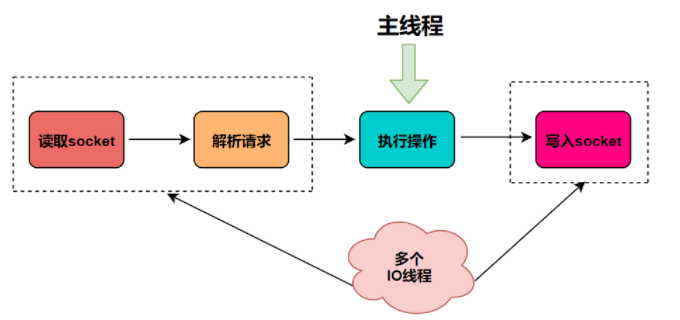

   


> **Redis的单线程指的是什么？**
>
> 主要是指Redis的网络IO和键值对读写是由一个线程来完成的，Redis在处理客户端的请求时包括获取 (socket 读)、解析、执行、内容返回 (socket 写) 等都由一个顺序串行的主线程处理，这就是所谓的“单线程”。这也是Redis对外提供键值存储服务的主要流程。
>
>
> 但Redis的其他功能，比如`持久化、异步删除、集群数据同步等等，其实是由额外的线程执行的。Redis工作线程是单线程的，但是，整个Redis来说，是多线程的；`


> **【作者原话】为什么Redis使用了单线程还可以这么快？**
>
> Redis 的 CPU 瓶颈并不是很常见，因为 Redis 通常受限于内存或网络。例如，运行在一台普通 Linux 系统上的 Redis 使用管道可以实现每秒 100 万请求，所以如果您的应用主要使用 O(N) 或 O(log(N)) 命令，它几乎不会消耗太多 CPU。然而，要最大化 CPU 使用率，您可以在同一台计算机上启动多个 Redis 实例并将它们视为不同的服务器。在某些时候，单个计算机可能无法满足需求，因此，如果您想使用多个 CPU，您可以提前考虑一些分片方法。
>
> 您可以在分区页面中找到有关使用多个 Redis 实例的更多信息。
>
> 然而，从 Redis 4.0 开始，我们逐渐让 Redis 更多地使用线程。目前，这仅限于在后台删除对象以及通过 Redis 模块实现的阻塞性命令。对于未来的版本，计划是让 Redis 使用越来越多的线程。


## 2、redis6.0如何开启多线程

在Redis6.0中，多线程机制默认是关闭的，如果需要使用多线程功能，需要在redis.conf中完成两个设置

1. 设置io-thread-do-reads配置项为yes，表示启动多线程。

2. 设置线程个数。关于线程数的设置，官方的建议是如果为 4 核的 CPU，建议线程数设置为 2 或 3，如果为 8 核 CPU 建议线程数设置为 6，线程数一定要小于机器核数，线程数并不是越大越好。


# 二、数据类型


| 数据类型    | 可以存储的值           | 底层数据结构 | 操作                                                         | 场景                                                         |
| ----------- | ---------------------- | ------------ | ------------------------------------------------------------ | ------------------------------------------------------------ |
| STRING      | 字符串、整数、浮点数   |              | 对整个字符串或者字符串的其中一部分执行操作、对整数和浮点数执行自增或者自减操作 | 简单的缓存、点赞、计数器                                     |
| HASH        | 包含键值对的无序散列表 |              | 添加、获取、移除单个键值对 获取所有键值对 检查某个键是否存在 | 购物车、Java中的对象                                         |
| LIST        | 列表                   |              | 从两端压入或者弹出元素 对单个或者多个元素进行修剪， 只保留一个范围内的元素.底层是**链表** | 微信公众号订阅的消息、商品评论列表                           |
| SET         | 无序集合               |              | 添加、获取、移除单个元素 检查一个元素是否存在于集合中 计算交集、并集、差集 从集合里面随机获取元素 | 抽奖小程序、朋友圈点赞、共同关注的人、QQ可能认识的人         |
| ZSET        | 有序集合               |              | 添加、获取、删除元素 根据分值范围或者成员来获取元素 计算一个键的排名。 | 排行榜、抖音热搜、商品热门榜                                 |
| bitmap      | 0、1组成的bit数组      | String       |                                                              | 连续签到统计、最近一周的活跃用户、统计某个用户一年的登陆天数 |
| hyperloglog |                        |              |                                                              |                                                              |
| GEO         |                        |              |                                                              |                                                              |
| Stream      |                        |              |                                                              |                                                              |


**注意：** 命令不区分大小写，而key区分大小写。


## 1、STRING

单个key的设置/获取

- `set key value`
- `get key`

多个key的设置/获取

- `mset k1 v1 k2 v2 [k v..]`
- `mget k1 [k ...]`

数值增减

- `incr key`
- `incrby key increment`
- `decr key`
- `decrby key descrement`

字符串的长度

- `strlen key`

分布式锁

- `setnx key value`
- `set key value`


## 2、HASH

可以理解为Java中的`Map<String, Map<Object, Object>>`

单个字段值的设置/获取

- `hset key field value`
- `hget key field`

多个字段值的设置/获取

- `hmset key f1 v1 f2 v2 ...`
- `hmget key f1 f2 f3 f4`

获取所有字段的值

- `hgetall key`

获取某个key内的全部数量

- `hlen key`

删除一个key

- `hdel key`


## 3、LIST

向列表左/右边添加元素

- `lpush key value [value ...]`
- `rpush key value [value ...]`

查看列表`[start, end]`, start和end都是从0开始的

- `lrange key start end`

获取列表中元素的个数

- `llen key`


## 4、SET

基本操作：

- 添加元素：`sadd key v1 v2 ...`
- 删除元素：`srem key v1 v2 ...`
- 获取集合中的所有元素：`smembers key`
- 判断元素是否在集合中：`sismember key v1`
- 获取集合中的元素总数：`scard key`

弹出元素：

- 从集合中随机弹出N个元素，不删除：`srandmember key N`
  - 不加参数N，默认只弹出一个
- 从集合中随机弹出N个元素，要删除：`spop key N`
  - 不加参数N，默认只弹出一个

集合运算：

- 集合的差集：`sdiff k1 k2 k3....`
  - 属于k1,但是不属于k2、k3....的元素
- 集合的交集：`sinter k1 k2 k3...`
  - k1、k2、k3....共有的元素
- 集合的并集：`sunion k1 k2 k3`
  - k1、k2、k3....合并的元素


### 数据结构

1. intset整数数组(当set中全是整数，并且元素个数小于512)
2. ziplist压缩

## 5、ZSET

- 添加元素：`ZADD key score member [score member ...]`
- 返回[start,end]元素：`ZRANGE key start end [WITHSCORES]`
  - 按照元素分数从小到大的顺序，返回索引从start到stop之间的所有元素
- 删除元素：`ZREM key member [member ...]`
- 获取元素的分数: `ZSCORE key member`
- 获取指定分数范围的元素：`ZRANGEBYSCORE key min max [WITHSCORES] [LIMIT offset count]`
- 增加某个元素的分数：`zincrby key increment member`
- 获取集合中元素的数量：`ZCARD key`
- 获得指定分数范围内的元素个数：`ZCOUNT key min max`
- 按照排名范围删除元素：`ZREMRANGEBYRANK key start stop`
- 获取元素排名：
  - 从小到大：`ZRANK key member`
  - 从大到小：`ZREVRANK key member`

----


## 6、bitmap

用String类型作为底层数据结构实现的一种统计二值状态的数据类型。

- 位图本质是数组，它是基于String数据类型的按位的操作。该数组由多个二进制位组成，每个二进制位都对应一个偏移量(我们可以称之为一个索引或者位格)。

- Bitmap支持的最大位数是2^32位，它可以极大的节约存储空间，使用512M内存就可以存储多大42.9亿的字节信息(2^32 = 4294967296)
  -  512MB = 2^32 / 8 / 1024 / 1024


### 基本操作

- `setbit key offset value`
  - value只能是0/1
  - offset偏移量也是从0开始计算的
- `getbit key offset`
- 统计用了多少字节：`strlen key`
- 统计有多少位是1：`bitcount key`
- 位操作：`bitop`
  - 统计连续两天都登录的用户，可以用`bitop and resKey day1 day2`


### 扩容机制

Bitmap的扩容操作是通过`bitmapSetbit()`函数来实现的。在这个函数中，如果设置的偏移量超出了当前Bitmap的大小，就会调用`stringEditLength()`函数来进行Bitmap的扩容操作。

在stringEditLength()函数中，首先会计算出扩容后的新大小，具体代码如下：

- `newlen = curlen+(incr && ~(size_t)511)+BITMAP_INIT_SIZE;`

- 其中，curlen为当前字符串的长度，incr为要扩容的长度。这里的计算方式是将要扩容的长度向上舍入到512的倍数，并且在此基础上再加上BITMAP_INIT_SIZE（BITMAP_INIT_SIZE为Redis中定义的一个常量，表示Bitmap在初始化时的默认大小）。

计算出新的大小后，stringEditLength()函数会调用sdsgrowzero()函数来进行字符串的扩容，并将扩容后的空间全部设置为0。

因此，可以看出Redis的Bitmap扩容策略是将要扩容的长度向上舍入到512的倍数，并且在此基础上再加上一个常量。这个常量是为了避免频繁进行扩容操作，以提高性能。

## 7、hyperloglog

> 没有hyperloglog，我可能想到用set、bitmap来进行基数统计：
>
> 使用bitmap进行一些统计工作，尽管比较精确，但是在数据量大的情况，内存消耗过大。并且对于亿级数据的统计页不合适。

是一种具有去重复统计功能的基数估计算法, 能够提供不精确的去重计数。

有几个特点：

1. 首先hyperloglog是一种概率算法，她并不存储数据本身，只是通过一定的概率统计方法预估基数值，同时保证误差在一定范围内。
2. hyperloglog通过牺牲准确率来换取存储空间，在不要求绝对准确率的场景下可以使用。
3. hyperloglog的基本原理：通过一个hash函数将数据流映射到`01`序列，之后通过二进制中 1 出现的第一个位置来估算整体的数量。
   1. 首先把这批元素通过 hash 函数处理成 0,1 序列，然后把这批 0,1 序列都放入 1 个桶，然后通过计算这个桶里面所有 0,1 序列中第一次出现1的位置的最大值，就可以预估出整体的数量。
   2. 但是如果只有一个桶的话，那误差会非常大，
4. redis中的hyperloglog在实现的时候，有一个`16384`(2^14)的桶，每个桶有6位，每个桶可以表达的最大数字是63。


- 只是进行不重复的基数统计，不是集合也不保存数据，只记录数量而不是具体内容。
- 具体的原理是：利用
- http://content.research.neustar.biz/blog/hll.html  原理的演示地址。


### 基本操作

- 将元素添加到key中：`pfadd key e1 e2 e3`
  - 在存入的时候，e1 e2 e3会被hash成64位，即64bit的比特字符串，前14位用来分桶，前14位二进制-》十进制就是桶标号

- (估算)统计key中元素的个数：`pfcount key`
- 合并key到新key：`pfmerge new_key k1 k2`


### 应用场景

1. 统计某个网站的UV、统计某篇文章的PV
2. 用户搜索网站关键词的数量
3. 统计用户每天搜索不同词条个数

## 8、GEO

### 基本原理

利用GEOhash算法将经纬度坐标转化为二进制编码，底层利用了zset进行存储。

#### GEOHash算法

1. 编码的过程(redis中默认geohash编码的长度是11，基本上误差在0.5之内)

   1. 首先经度是[-180, 180]，纬度是[-90, 90]。比如我们的经纬度[112.xxx, 30.xxx]
   2. 拿经度来举例子，每次都先将经度分为左右两个区间，左区间[-180, 0],右区间[0, 180]，如果当前位置在左半边，那么就记为0, 否则记为1。
   3. 对于经度，经过不断地二分，不断地缩小区间，我们能够得到一个二进制编码。同理，也可以得到一个纬度的二进制编码
   4. 组码：最后将上一步得到的两个二进制编码进行组合，偶数位放经度，奇数位放纬度，形成一个新的二进制编码。
   5. 通过base32编码将组合成的二进制编码转化位字符串。

   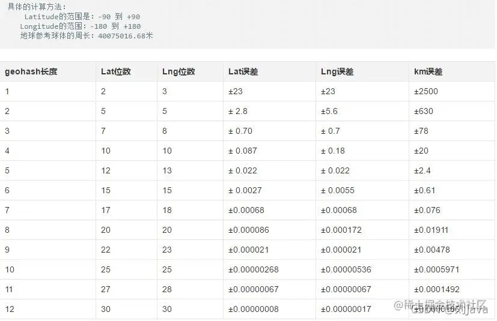

#### Redis中的GEOHash

1. redis的GEO和标准的GEOHash算法还不一样，它经过二分编码-》组码之后形成52位二进制，再通过base32编码(每5位编码一次，不够补0)为11位的字符串。

2. **从图中可知此时误差不超过0.0001492km，即0.1492m，由于GepHash的长度没有达到55位，因此精度会低一些，但是不会超过0.5971m（为了性能考虑）**

3. 调用`GEOADD`,会将每一个点都进行geohash，最后调用zset的命令去存储[GEOHASH编码, 地点]，例如：`zadd key GEOHASH编码 地点名称`

   ```c
   // 遍历所有点
   for (i = 0; i < elements; i++) {
       double xy[2];
   
       if (extractLongLatOrReply(c, (c->argv+longidx)+(i*3),xy) == C_ERR) {
           for (i = 0; i < argc; i++)
               if (argv[i]) decrRefCount(argv[i]);
           zfree(argv);
           return;
       }
   
       /* Turn the coordinates into the score of the element. */
       GeoHashBits hash;
       geohashEncodeWGS84(xy[0], xy[1], GEO_STEP_MAX, &hash);
       // 得到hash编码
       GeoHashFix52Bits bits = geohashAlign52Bits(hash);
   	// score 就是hash编码字符串
       robj *score = createObject(OBJ_STRING, sdsfromlonglong(bits));
       // val 就是 该地点的名称
       robj *val = c->argv[longidx + i * 3 + 2];
       argv[longidx+i*2] = score;
       argv[longidx+1+i*2] = val;
       incrRefCount(val);
   }
   ```

   

### 基本操作

1. 向key中添加多个经纬度：`geoadd key lon lat name [lon lat name...]`
2. 返回该key里给定名称的经纬度：`geopos key name [name...]`'
3. 返回坐标的geohash表示：`geohash key name [name...]`
   1. 由geohash算法生成的base32编码值
4. 计算两点之间的距离：`geodist key n1 n2 m[m | km | ft英尺 | mi英里]`
5. 计算以该点为中心，且半径为radiu的类似于圆的范围内所有的位置元素：`georadius key lon lat radius km [withdist | withcoord | count 10 | withhash | desc]`
   1. WITHDIST: 在返回位置元素的同时， 将位置元素与中心之间的距离也一并返回。距离的单位和用户给定的范围单位保持一致。
   2. WITHCOORD: 将位置元素的经度和维度也一并返回。
   3. WITHHASH: 以 52 位有符号整数的形式， 返回位置元素经过原始 geohash 编码的有序集合分值。这个选项主要用于底层应用或者调试，实际中的作用并不大
   4. COUNT：限定返回的记录数。
6. 找出位于指定范围内的元素，中心点是给定的位置元素决定：`georadiusbymember key name1 radius km [withdist | withcoord | count 10 | withhash | desc]`


# 补充：数据结构

## SDS

### 结构

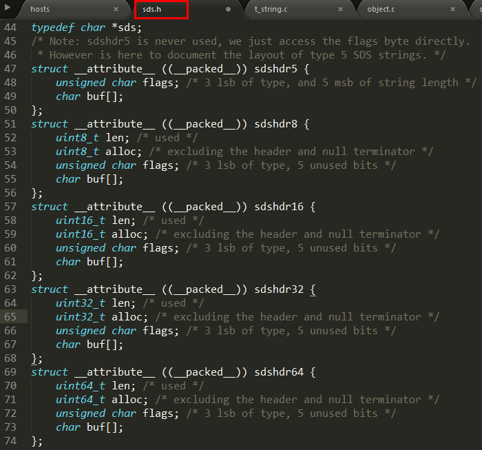

结构中的每个成员变量分别介绍下：

- **len，记录了字符串长度**。这样获取字符串长度的时候，只需要返回这个成员变量值就行，时间复杂度只需要 O（1）。
- **alloc，分配给字符数组的空间长度**。这样在修改字符串的时候，可以通过 `alloc - len` 计算出剩余的空间大小，可以用来判断空间是否满足修改需求，如果不满足的话，就会自动将 SDS 的空间扩展至执行修改所需的大小，然后才执行实际的修改操作，所以使用 SDS 既不需要手动修改 SDS 的空间大小，也不会出现前面所说的缓冲区溢出的问题。
- **flags，用来表示不同类型的 SDS**。一共设计了 5 种类型，分别是 sdshdr5、sdshdr8、sdshdr16、sdshdr32 和 sdshdr64，后面在说明区别之处。
- **buf[]，字符数组，用来保存实际数据**。不仅可以保存字符串，也可以保存二进制数据。

> Redis 的 SDS 结构里引入了 alloc 和 len 成员变量，这样 SDS API 通过 `alloc - len` 计算，可以算出剩余可用的空间大小，这样在对字符串做修改操作的时候，就可以由程序内部判断缓冲区大小是否足够用。

### 优势

- 获取字符串长度的时间复杂度是`O(1)`
- 不仅可以保存文本数据，还可以保存二进制数据。(这是因为C语言底层字符串使用了`\0`来判断是否为字符串的结尾)
- SDS API是安全的，拼接字符串不会造成缓冲区溢出。(C语言中`strcat`函数在执行的时候默认程序员已经分配好了内存，有缓冲区溢出的风险，有可能会造成程序运行终止；)
- 比原来的更加节省空间，利用`flags`区分不同类型的结构体，灵活保存不同大小的字符串，从而更有效的节省内存 ，并且在编程上还**使用了专门的编译优化来节省内存空间**，即在 struct 声明了 `__attribute__ ((packed))` ，它的作用是：**告诉编译器取消结构体在编译过程中的优化对齐，按照实际占用字节数进行对齐**。

### 内部编码

- int：8个字节

  - 如果大于8个字节或者为数字等

- embstr：会通过一次内存分配函数来分配一块连续的内存空间来保存redisObject和SDS

  > - 优势：
  >   - `embstr`编码将创建字符串对象所需的内存分配次数从 `raw` 编码的两次降低为一次；
  >   - 释放 `embstr`编码的字符串对象同样只需要调用一次内存释放函数；
  >   - 因为`embstr`编码的字符串对象的所有数据都保存在一块连续的内存里面可以更好的利用 CPU 缓存提升性能。
  > - 缺点：
  >   - 只读，如果需要修改数据的话，就会先将内部编码从embstr变为raw

- raw：会通过调用两次内存分配函数来分别分配两块空间来保存redisObject和SDS


-  Redis 内部其实先将浮点数转化为字符串值，然后再保存。

那这两者的区别见下图：


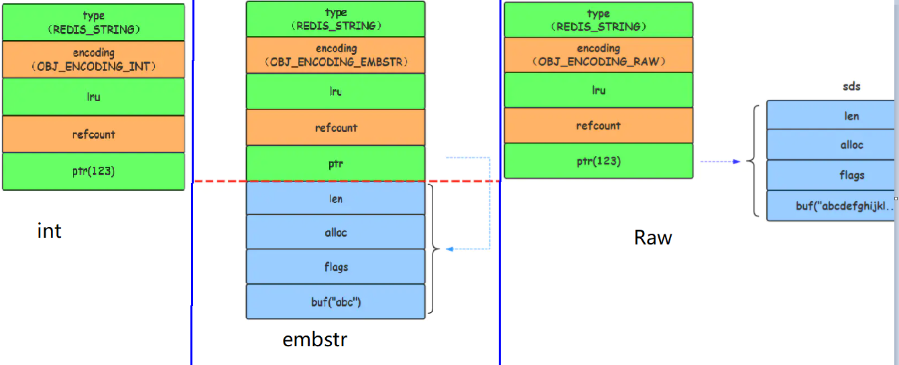

## 链表

### 链表结构设计


```C
typedef struct listNode {
    //前置节点
    struct listNode *prev;
    //后置节点
    struct listNode *next;
    //节点的值
    void *value;
} listNode;

typedef struct list {
    //链表头节点
    listNode *head;
    //链表尾节点
    listNode *tail;
    //节点值复制函数
    void *(*dup)(void *ptr);
    //节点值释放函数
    void (*free)(void *ptr);
    //节点值比较函数
    int (*match)(void *ptr, void *key);
    //链表节点数量
    unsigned long len;
} list;
```

list 结构为链表提供了链表头指针 head、链表尾节点 tail、链表节点数量 len、以及可以自定义实现的 dup、free、match 函数。

举个例子，下面是由 list 结构和 3 个 listNode 结构组成的链表。


### 链表的优势与缺陷

#### 优势

1. `listNode`链表节点的结构里有`pre`和`next`指针，获取某个节点的前置节点或后置节点的时间复杂度只需要`O(1)`
2. list包含了头尾指针，**获取链表的表头节点和表尾节点的时间复杂度只需O(1)**
3. list 结构因为提供了链表节点数量 len，所以**获取链表中的节点数量的时间复杂度只需O(1)**
4. listNode 链表节使用 void* 指针保存节点值，并且可以通过 list 结构的 dup、free、match 函数指针为节点设置该节点类型特定的函数，因此**链表节点可以保存各种不同类型的值**

#### 缺陷

1. 链表中的每个节点之前的内存都是不连续的，无法很好利用CPU缓存
2. 保存一个链表节点的值都需要一个链表结构头的分配，内存开销较大

## ZipList(用时间还换空间)

它是**由连续内存块组成的顺序型xx数据结构**，总体思想是用时间来换空间。

只适合`字段个数少，且字段值也比较小`的场景。

### 结构

ziplist是一个经过特殊编码的双向链表，它不存储指向上一个链表节点和指向下一个链表节点的指针，而是存储`上一个节点长度和当前节点长度`

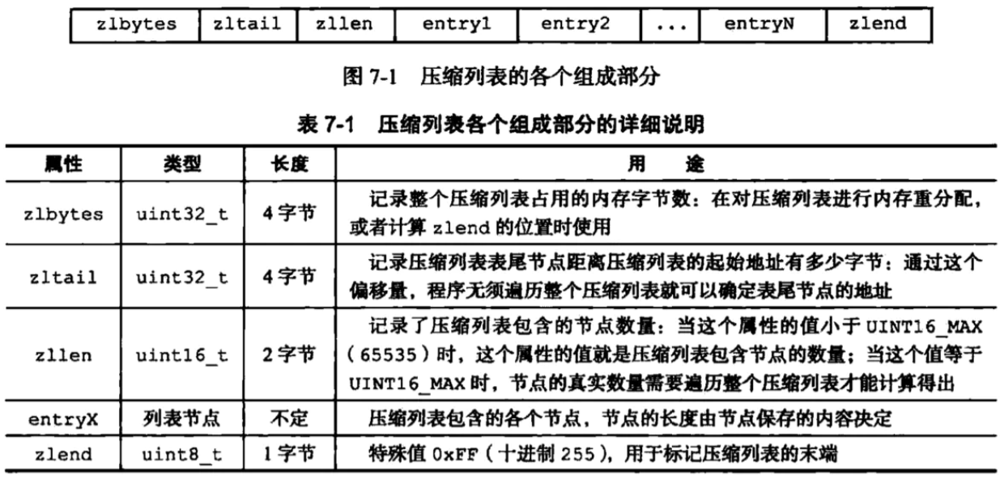

压缩列表在表头有三个字段：

- ***zlbytes***，记录整个压缩列表占用对内存字节数；
- ***zltail***，记录压缩列表「尾部」节点距离起始地址由多少字节，也就是列表尾的偏移量；
- ***zllen***，记录压缩列表包含的节点数量；
- ***zlend***，标记压缩列表的结束点，固定值 0xFF（十进制255）。


## 整数集合(intset)


------

# 三、布隆过滤器

它是由一个二进制数组和一系列hash算法组成的，主要是用于判断一个元素是否在集合中。

## 特点

- 能够高效的插入和查询，占用空间少，返回的结果是不确定性的。
- 对于一个元素来说，利用该算法如果判断存在，那他可能存在。但是如果判断不存在，**那么它一定不存在**。
  - 这是因为映射函数本身就是散列函数，散列函数是会有碰撞的。
- bloomfilter可以添加元素，但是不能删除元素。删除元素会导致误判率增加。
- 误判只会发生在过滤器没有添加过的元素，对于添加过的元素不会发生误判。

## 主要操作

- 添加key
  - 使用多个hash函数对同一个key进行hash运算。每个hash函数都会得到一个整数索引值，对位数组长度去摸之后得到一个位置。使用多个hash函数得到多个位置，将这几个位置都置为1就完成了添加操作。

- 查询key
  - 利用刚才的hash函数得到多个位置，并查看这些位置是否都为1，若有一位是0，那么该key一定不存在。若全都是1，则不一定存在对应的key。

## 优缺点

优点

- 高效的插入和查询，占用空间少。

缺点

- 不能删除元素。因为删除元素会导致误判率增加，因为hash冲突导致同一个位置可能被多次置为1。若删除key，即将该位置位0，那么可能会删掉与他共享同一个位置的其他的key。
- 存在误判，不同的数据可能出现相同的hash值。


**Ps：**布谷鸟过滤器能够解决不能删除的问题。

## 应用

正是基于布隆过滤器的快速检测特性，我们可以用布隆过滤器来解决缓存穿透和黑名单问题，判断数据是否存在。

# 四、缓存雪崩、缓存穿透、缓存击穿、缓存预热

## 缓存雪崩

**原因：**

1. redis主机挂掉
2. 大量key同时过期

**解决：**

1. redis缓存集群实现高可用
   1. 主从 + 哨兵
   2. Redis Cluster
2. ehcache本地缓存 + hystrix或者阿里sentinel限流&降级
3. 开启redis持久化机制aof/rdb，尽快恢复缓存集群。
4. 缓存设置随机过期时间，避免同时过期

## 缓存穿透

**原因：**

请求去查询一条记录，先redis后mysql发现都查询不到该条记录，但是请求每次都会打到数据库上面去，导致后台数据库压力暴增，这种现象我们称为缓存穿透，这个redis变成了一个摆设。

**解决：**

1. `缓存空对象或缺省值`
2. `Google布隆过滤器Guava解决缓存穿透`
   1. 缺点是**只能单机使用**
3. `Redis布隆过滤器解决缓存穿透问题`
   1. bf.reserve key error_rate的值 initial_size 的值
      1. 默认的error_rate是 0.01，
         默认的initial_size是 100。
   2. bf.add key 值
   3. bf.exists key 值
   4. bf.madd 一次添加多个元素
   5. bf.mexists 一次查询多个元素是否存在

## 缓存击穿

**原因：**

某个热点key在某一时刻恰好失效，然后此时刚好有大量的并发请求，导致大量的请求都打到数据库上了。

**危害：**

会造成某一时刻数据库请求量过大，压力剧增。

**解决：**

1. `对于访问频繁的热点key，不设置过期时间`
2. `互斥更新`，多个线程同时去查询数据库的这条数据，那么我们可以在第一个查询数据的请求上使用一个互斥锁来锁住它。来发现已经有缓存了，就直接走缓存。
3. `使用随机退避方式`，失效时随机 sleep 一个很短的时间，再次查询，如果失败再执行更新


## 缓存预热

简单来说，就是在访问高峰期前，将热点数据提前加载到缓存中。
假设您的网站有一个热门页面，每天有很多用户访问。为了提高用户体验，您可以在高峰期前预热缓存，提前将热门页面的数据加载到缓存中。这样，在高峰期时，用户可以从缓存中快速获取数据，而不用等待缓慢的数据库查询，从而提高网站的响应速度和用户满意度。


# 五、分布式锁

## 基本概念

**锁的种类：**单机锁(Synchronized、Lock接口的锁)、分布式锁

**分布式锁应具备的条件：**

1. 独占性：任何时刻有且仅有一个线程持有该资源
2. 高可用：若redis集群环境下，不能因为某一个节点挂了而出现获取锁和释放锁失败的情况
3. 防死锁(超时释放)：杜绝思索，必须有超时控制机制或撤销操作，有个兜底终止跳出方案
4. 安全性：防止张冠李戴，不能私下lock别人的锁，只能自己加锁，自己释放。
5. 重入性：同一个节点的同一个线程如果获得锁之后，它也可以再次获取这个锁。


## 方案


总结来说，分布式锁的演化过程是这样的：

1. 单机版的redis
   1. 只有`setnx` 和`delete`，不加过期时间，一定情况下会导致死锁。
   2. `setnx` + `expires` 和`delete`，setnx和expires两条指令的执行不具有原子性，**那就是如果在客户端加锁成功后，还没有设置过期时间时宕机，就会出现死锁**
   3. `set key value nx ..` 和`delete`，业务执行较慢，还没执行到删除，锁就过期了，该删除的时候发现锁已经被别人拿到了，此时就会导致把别人的锁释放掉。
   4. `set key value nx ..` 和`delete(校验是否为自己的锁)`，校验是否为自己的锁与delete两个动作的执行不具有原子性，导致可能把别人的锁删掉。
      1. 判断到redis中的锁是自己之后，突然CPU资源分配给其他任务了，CPU回到当前任务的时候锁刚好到期释放了，这个时候删除，可能会删除掉别人拿到的锁。
   5. `set key value nx ..` 和`delete(校验是否为自己的锁)(lua脚本)`，使用lua脚本来保证删除和校验操作的原子性。
2. 分布式的redis


### setnx + expire

即先用`setnx`来抢锁，如果抢到之后，再用`expire`给锁设置一个过期时间，防止锁忘记了释放。

> setnx是set if not exits的简写，日常命令格式是`setnx key value`，如果key不存在，则setnx成功返回1，否则返回0.

```java
if（jedis.setnx(key_resource_id,lock_value) == 1）{ //加锁
    expire（key_resource_id，100）; //设置过期时间
    try {
        do something  //业务请求
    }catch(){
　　}
　　finally {
       jedis.del(key_resource_id); //释放锁
    }
}
```

**缺点：**

1. `sexnx`和`expire`两个命令的执行不是原子操作。
   1. 若`sexnx`加完锁之后，正准备执行`expire`设置过期时间时，进程crash或者重启维护了，那么这个锁就永远存在，别的线程永远获取不到锁。


### setnx value为(系统时间 + 过期时间)

巧妙移除`expire`单独设置过期时间的操作，把**过期时间放到setnx的value值**里面来。解决了方案一发生异常，锁得不到释放的问题。但是这个方案还有别的缺点：

缺点：

1. 过期时间时客户端自己生成的，所以需要分布式环境下不同客户端的时间要同步。
2. 如果锁过期的时候，并发多个客户端同时请求过来，都执行jedis.getSet()，最终只能有一个客户端加锁成功，但是该客户端锁的过期时间，可能被别的客户端覆盖
3. 该锁没有保存持有者的唯一标识，可能被别的客户端释放/解锁。


### Lua脚本(setnx + expire)

Redis使用Lua脚本能够保证指令执行的原子性

```java
 String lua_scripts = "if redis.call('setnx',KEYS[1],ARGV[1]) == 1 then" +
            " redis.call('expire',KEYS[1],ARGV[2]) return 1 else return 0 end";
```


### Set的扩展命令(SET EX PX NX)

`SET key value [EX seconds] [PX milliseconds]   [NX|XX]`

> NX :表示key不存在的时候，才能set成功，也即保证只有第一个客户端请求才能获得锁，而其他客户端请求只能等其释放锁，才能获取。
>
> EX seconds :设定key的过期时间，时间单位是秒。
>
> PX milliseconds: 设定key的过期时间，单位为毫秒
>
> XX: 仅当key存在时设置值


```java
if（jedis.set(key_resource_id, lock_value, "NX", "EX", 100s) == 1）{ //加锁
    try {
        do something  //业务处理
    }catch(){
　　}
　　finally {
       jedis.del(key_resource_id); //释放锁
    }
}
```


这种方案也有问题：

1. 当锁过期释放了之后，业务还没执行完！
2. 锁被别的线程误删。


### SET NX PX NX + 校验唯一随机值，再删除

既然锁可能被其他线程删除掉，那我们给value值设置一个标记当前线程唯一的随机数，在删除的时候，校验一下：


### Redisson框架


### 多机实现的分布式锁Redlock+Redisson


### 相关面试题


# 六、键的过期时间

Redis 可以为每个键设置过期时间，当键过期时，会自动删除该键。

对于散列表这种容器，只能为整个键设置过期时间（整个散列表），而不能为键里面的单个元素设置过期时间。


# 七、数据淘汰策略

可以设置内存最大使用量，当内存使用量超出时，会施行数据淘汰策略。

Redis 具体有 6 种淘汰策略：

| 策略            | 描述                                                     |
| --------------- | -------------------------------------------------------- |
| volatile-lru    | 从已设置过期时间的数据集中挑选**最近最少使用**的数据淘汰 |
| volatile-ttl    | 从已设置过期时间的数据集中挑选将**要过期**的数据淘汰     |
| volatile-random | 从已设置过期时间的数据集**中任意选择数据淘汰**           |
| allkeys-lru     | 从所有数据集中挑选**最近最少使用**的数据淘汰             |
| allkeys-random  | 从所有数据集中**任意选择**数据进行淘汰                   |
| noeviction      | 禁止驱逐数据                                             |

作为内存数据库，出于对性能和内存消耗的考虑，Redis 的淘汰算法实际实现上并非针对所有 key，而是抽样一小部分并且从中选出被淘汰的 key。

使用 Redis 缓存数据时，为了提高缓存命中率，**需要保证缓存数据都是热点数据。可以将内存最大使用量设置为热点数据占用的内存量**，然后启用 allkeys-lru 淘汰策略，将最近最少使用的数据淘汰。

Redis 4.0 引入了 volatile-lfu 和 allkeys-lfu 淘汰策略，LFU 策略通过统计**访问频率，将访问频率最少的键值对淘汰**。


# 八、持久化

Redis 是内存型数据库，为了保证数据在断电后不会丢失，需要将内存中的数据持久化到硬盘上。

## RDB 持久化

**将某个时间点的所有数据以二进制的形式保存到硬盘上。**

可以将快照复制到其它服务器从而创建具有相同数据的服务器副本。

如果系统发生故障，将会丢失最后一次创建快照之后的数据。

如果数据量很大，保存快照的时间会很长。

> Redis会单独创建一个子进程来进行持久化，会先将数据写入到一个临时文件中，代持久化过程结束之后，再用这个临时文件替换上次持久化好的文件。
>
> 整个过程中，主进程是不进行任何I/O操作的，这就确保了较高的性能。
>
> 如果需要进行大规模数据的恢复，且对于数据恢复的完整性不是特别敏感，那RDB方式要比AOF方式更加高效。
>
> RDB的**缺点是最后一次持久化后的数据可能丢失。**

### 触发策略

#### 手动触发

手动触发的两个命令区别在于是否在`主线程`里执行

- `save`
  - 会阻塞Redis服务器的正常操作, 直到RDB文件写入完成.
  - 只管保存，单线程，会阻塞其他线程

- `bgsave`
  - redis会在后台异步进行快照操作，快照同时还可以相应客户端请求。可以通过lastsave命令获取最后一次成功执行快照的时间

#### 自动触发

自动触发RDB持久化机制可以通过配置文件中的save选项来实现。可以配置多个save选项，每个选项指定一个时间间隔和执行SAVE或BGSAVE命令.


### 执行快照时，数据能被修改吗？

**写时复制技术（Copy-On-Write, COW）。**

细心的同学，肯定发现了，bgsave 快照过程中，如果主线程修改了共享数据，**发生了写时复制后，RDB 快照保存的是原本的内存数据**，而主线程刚修改的数据，是没办法在这一时间写入 RDB 文件的，只能交由下一次的 bgsave 快照。

所以 Redis 在使用 bgsave 快照过程中，如果主线程修改了内存数据，不管是否是共享的内存数据，RDB 快照都无法写入主线程刚修改的数据，因为此时主线程（父进程）的内存数据和子进程的内存数据已经分离了，子进程写入到 RDB 文件的内存数据只能是原本的内存数据。

如果系统恰好在 RDB 快照文件创建完毕后崩溃了，那么 Redis 将会丢失主线程在快照期间修改的数据。

另外，写时复制的时候会出现这么个极端的情况。

在 Redis 执行 RDB 持久化期间，刚 fork 时，主进程和子进程共享同一物理内存，但是途中主进程处理了写操作，修改了共享内存，于是当前被修改的数据的物理内存就会被复制一份。

那么极端情况下，**如果所有的共享内存都被修改，则此时的内存占用是原先的 2 倍。**

所以，针对写操作多的场景，我们要留意下快照过程中内存的变化，防止内存被占满了。

> 总结：
>
> 1. 利用写时复制技术，可以进行修改
> 2. 但是修改的数据无法保存在当前RDB中，只能等下一次RDB了。
> 3. 如果修改的数据比较多的时候，可能会复制双份内存，导致内存占用率过高。

## AOF 持久化

将写命令添加到 AOF 文件（Append Only File）的末尾。

以日志的形式来记录每个写操作，将Redis执行过的所有写指令记录下里(读操作不记录)，只允许追加文件但不允许改写文件，rdis启动之初会读取该文件重新构建数据。

> 保存写操作命令到日志的持久化方式，就是Redis中的AOF持久化功能，	注意`只会记录写操作命令`，读操作命令是不会被记录的。

### 使用方法

默认在redis中是没有启用AOF的，需要我们修改`redis.conf`配置文件中的参数：

```
appendonly yes //表示是否开启AOF持久化(默认关闭)
appendfilename "appendonly.aof" //AOF持久化文件的名称
```


### 日志格式

存储的就是`普通的文本`，可以使用cat等日志查看工具来进行查看。

我这里以「*set name xiaolin*」命令作为例子，Redis 执行了这条命令后，记录在 AOF 日志里的内容如下图：


### 写回策略

使用 AOF 持久化需要设置同步选项，从而确保写命令同步到磁盘文件上的时机。这是因为对文件进行写入并不会马上将内容同步到磁盘上，而是**先存储到缓冲区，然后由操作系统决定什么时候同步到磁盘**。有以下同步选项：

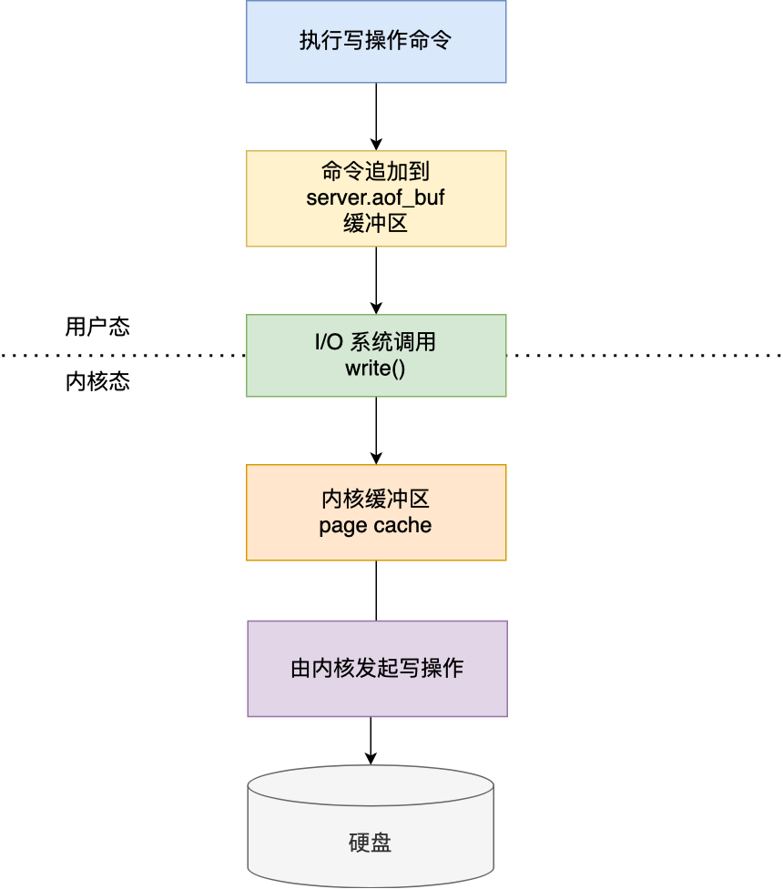

| 选项           | 同步频率                                                     |
| -------------- | ------------------------------------------------------------ |
| always         | 每个写命令都同步(到磁盘)                                     |
| everysec(默认) | **每秒同步一次**(先将命令写入到 AOF 文件的内核缓冲区，然后每隔一秒将缓冲区里的内容写回到硬盘) |
| no             | 表示不执行AOF持久化操作，仅依靠操作系统的缓存来保证数据的可靠性。这种策略不安全，可能会导致数据的丢失。 |

- always 选项不可避免影响主线程的性能；
-  no 选项并不能给服务器性能带来多大的提升，而且也会增加系统崩溃时数据丢失的数量。
-  everysec是一种折中的方法，避免了always策略的性能开销，也比No策略更能避免数据丢失。

```shell
# 默认配置
# appendfsync always
appendfsync everysec
# appendfsync no
```

>  三种写回策略都只是在控制 `fsync()` 函数的调用时机。调用 `fsync()` 函数，这样内核就会将内核缓冲区的数据直接写入到硬盘，等到硬盘写操作完成后，该函数才会返回。
>
> - always 每次写入之后，就调用
>
> - everysec 创建一个异步任务来执行
>
> - no永不调用fsync

### 重写机制

随着服务器写请求的增多，AOF 文件会越来越大。Redis 为了避免 AOF 文件越写越大，提供了 **AOF 重写机制**，当 AOF 文件的大小超过所设定的阈值后，Redis 就会启用 AOF 重写机制，来压缩 AOF 文件。

> 当AOF文件的大小超过所设定的阈值时，Redis就会启动AOF文件的内容压缩，只保留可以恢复数据的最小指令集，可以使用命令`bgrewriteraof`


**触发机制：**Redis会记录上次重写时的AOF的大小，默认配置是当AOF文件大小是上次rewrite后大小的一倍且文件大于64M时触发。


Redis的后台重写机制是由后台子进程`bgrewriteaof`来完成的，这样做有两个好处：

1. 子进程在AOF重写期间，主进程可以继续处理命令请求，从而避免阻塞主线程。
2. 子进程是通过主进程利用`fork`系统调用生成的，操作系统会将主进程的`页表`复制一份给子进程，这个页表记录着虚拟地址和物理地址映射关系，而不会复制物理内存，也就是说，两者的虚拟空间不同，但其对应的物理空间是同一个。
   1. 不过，当父进程或者子进程在向这个内存发起写操作时，CPU 就会触发**写保护中断**，这个写保护中断是由于违反权限导致的，然后操作系统会在「写保护中断处理函数」里进行**物理内存的复制**，并重新设置其内存映射关系，将父子进程的内存读写权限设置为**可读写**，最后才会对内存进行写操作，这个过程被称为「**写时复制(\*Copy On Write\*)**」。
   2. 写时复制顾名思义，**在发生写操作的时候，操作系统才会去复制物理内存**，这样是为了防止 fork 创建子进程时，由于物理内存数据的复制时间过长而导致父进程长时间阻塞的问题。


在AOF重写的过程中，主进程可能对redis中的数据进行了写操作，那么就会发生写时复制，复制并修改主进程要修改的物理内存数据，那这就会导致主进程的内存和子进程的内存不一致。为了解决这种不一致，Redis在AOF重写的过程中，设置了一个AOF重写缓冲区。

也就是说，在 bgrewriteaof 子进程执行 AOF 重写期间，主进程需要执行以下三个工作:

- 执行客户端发来的命令；
- 将执行后的写命令追加到 「AOF 缓冲区」；
- 将执行后的写命令追加到 「AOF 重写缓冲区」；

当子进程完成 AOF 重写工作（*扫描数据库中所有数据，逐一把内存数据的键值对转换成一条命令，再将命令记录到重写日志*）后，会向主进程发送一条信号，信号是进程间通讯的一种方式，且是异步的。

主进程收到该信号后，会调用一个信号处理函数，该函数主要做以下工作：

- 将 AOF 重写缓冲区中的所有内容追加到新的 AOF 的文件中，使得新旧两个 AOF 文件所保存的数据库状态一致；
- 新的 AOF 的文件进行改名，覆盖现有的 AOF 文件。

### AOF修复

由于Redis断电异常，AOF文件可能被会写入一些不合理的命令，这时可用`redis-check-aof --fix   appendonly.aof`修复aof文件，

## 总结

### RDB 和 AOF 合体

尽管 RDB 比 AOF 的数据恢复速度快，但是快照的频率不好把握：

- 如果频率太低，两次快照间一旦服务器发生宕机，就可能会比较多的数据丢失；
- 如果频率太高，频繁写入磁盘和创建子进程会带来额外的性能开销。

那有没有什么方法不仅有 RDB 恢复速度快的优点和，又有 AOF 丢失数据少的优点呢？

当然有，那就是将 RDB 和 AOF 合体使用，这个方法是在 Redis 4.0 提出的，该方法叫**混合使用 AOF 日志和内存快照**，也叫混合持久化。

如果想要开启混合持久化功能，可以在 Redis 配置文件将下面这个配置项设置成 yes：

```text
aof-use-rdb-preamble yes
```

混合持久化工作在 **AOF 日志重写过程**。

当开启了混合持久化时，在 AOF 重写日志时，

1. `fork` 出来的重写子进程会先将与主线程共享的内存数据以 RDB 方式写入到 AOF 文件
2. 然后主线程处理的操作命令会被记录在重写缓冲区里，重写缓冲区里的增量命令会`以 AOF 方式写入到 AOF 文件`
3. 写入完成后通知主进程将新的含有 RDB 格式和 AOF 格式的 AOF 文件替换旧的的 AOF 文件。

也就是说，使用了混合持久化，AOF 文件的**前半部分是 RDB 格式的全量数据，后半部分是 AOF 格式的增量数据**。


这样的好处在于，重启 Redis 加载数据的时候，由于前半部分是 RDB 内容，这样**加载的时候速度会很快**。

加载完 RDB 的内容后，才会加载后半部分的 AOF 内容，这里的内容是 `Redis 后台子进程重写 AOF 期间，主线程处理的操作命令，可以使得**数据更少的丢失**`。


# 九、事务

一个事务包含了多个命令，服务器在执行事务期间，不会改去执行其它客户端的命令请求。

`它可以减少客户端与服务器之间的网络通信次数从而提升性能。`

Redis事务中的命令不会立即执行，而是将它们按顺序添加到一个事务队列中，然后通过 EXEC 命令一次性执行所有命令。如果在事务执行期间出现错误，不会影响队列中后续的命令执行。

## 常用命令

- Discard
- exec
- multi
- unwatch
  - 取消watch命令对所有key的监视。
- watch key
  - 监视一个或多个key，如果在事务执行之前，key被其他命令修改，那么事务将会被打断。

## 三个阶段

- 开启：以multi开始一个事务。
- 入队：将多个命令入队到事务中，接到这些命令并不会立即执行，而是放到等待执行的事务队列中。
- 执行：由exec命令触发事务。

## 四种错误情况

- 正常执行

  - ```shell
    multi
    set k1 v1
    set k2 v2
    set k3 v3
    exec
    ```

- 放弃事务

  - ```shell
    multi
    set k1 v1
    set k2 v2
    set k3 v3
    discard
    ```

- 全体连坐`（队列中有一条指令出现了编译错误）`

  - ```shell
    multi
    set k1 v1
    set k2 v2
    set k3 v3
    getset k3 # 命令编译时报Error
    set k5 v5
    exec
    ```

  - 中间有一个命令没成功，所有的命令都不执行。

- 源头债主`（队列中有一条指令出现了运行异常）`

  - ```shell
    multi
    set k1 v1
    incr k1 # 命令执行时异常，只有该条记录未修改成功
    set k2 v2
    set k3 v3
    exec
    ```

- watch监控

  - 悲观锁
    - 悲观，每次去拿数据的时候都认为别人会修改，所以每次去拿数据的时候都会上锁，这样别人想拿这个数据就会block直到它拿到锁。
    - 传统的关系型数据库里边就用到了很多这种锁机制，比如行锁、表锁、读锁、写锁等。都是在操作数据前先上锁。
  - 乐观锁
    - 乐观，每次去拿数据的时候都认为别人不会修改，所以不会上锁，但是在更新的时候会判断一下在此期间别人有没有去更新这个数据，可以使用版本号等机制。乐观锁适用于多读的应用类型，这样可以提高吞吐量。
    - 提交版本必须大于记录当前版本才能更新
  - CAS
  - 

## 特性

- 

# 十、事件

Redis 服务器是一个事件驱动程序。

## 文件事件

服务器通过套接字与客户端或者其它服务器进行通信，文件事件就是对套接字操作的抽象。

Redis 基于 Reactor 模式开发了自己的网络事件处理器，使用 I/O 多路复用程序来同时监听多个套接字，并将到达的事件传送给文件事件分派器，分派器会根据套接字产生的事件类型调用相应的事件处理器。

[](https://camo.githubusercontent.com/b570ff3264449fd72ba03e0c70ca02247cc4f283/68747470733a2f2f63732d6e6f7465732d313235363130393739362e636f732e61702d6775616e677a686f752e6d7971636c6f75642e636f6d2f39656138366562352d303030612d343238312d623934382d3762353637626436663164382e706e67)


## 时间事件

服务器有一些操作需要在给定的时间点执行，时间事件是对这类定时操作的抽象。

时间事件又分为：

- 定时事件：是让一段程序在指定的时间之内执行一次；
- 周期性事件：是让一段程序每隔指定时间就执行一次。

Redis 将所有时间事件都放在一个无序链表中，通过遍历整个链表查找出已到达的时间事件，并调用相应的事件处理器。

## 事件的调度与执行

服务器需要不断监听文件事件的套接字才能得到待处理的文件事件，但是不能一直监听，否则时间事件无法在规定的时间内执行，因此监听时间应该根据距离现在最近的时间事件来决定。

事件调度与执行由 aeProcessEvents 函数负责，伪代码如下：

```
def aeProcessEvents():
    # 获取到达时间离当前时间最接近的时间事件
    time_event = aeSearchNearestTimer()
    # 计算最接近的时间事件距离到达还有多少毫秒
    remaind_ms = time_event.when - unix_ts_now()
    # 如果事件已到达，那么 remaind_ms 的值可能为负数，将它设为 0
    if remaind_ms < 0:
        remaind_ms = 0
    # 根据 remaind_ms 的值，创建 timeval
    timeval = create_timeval_with_ms(remaind_ms)
    # 阻塞并等待文件事件产生，最大阻塞时间由传入的 timeval 决定
    aeApiPoll(timeval)
    # 处理所有已产生的文件事件
    procesFileEvents()
    # 处理所有已到达的时间事件
    processTimeEvents()
```

将 aeProcessEvents 函数置于一个循环里面，加上初始化和清理函数，就构成了 Redis 服务器的主函数，伪代码如下：

```
def main():
    # 初始化服务器
    init_server()
    # 一直处理事件，直到服务器关闭为止
    while server_is_not_shutdown():
        aeProcessEvents()
    # 服务器关闭，执行清理操作
    clean_server()
```

从事件处理的角度来看，服务器运行流程如下：

[](https://camo.githubusercontent.com/87a2045534a9a0cc2ba02a0e21581d85d2ca2b84/68747470733a2f2f63732d6e6f7465732d313235363130393739362e636f732e61702d6775616e677a686f752e6d7971636c6f75642e636f6d2f63306139666139312d646132652d343839322d386339662d3830323036613666373034372e706e67)


# 十一、复制

通过使用 slaveof host port 命令来让一个服务器成为另一个服务器的从服务器。

一个从服务器只能有一个主服务器，并且不支持主主复制。

> - 配从(库)不配主(库)
>
> - 从库配置：slaveof 主库ip 主库端口
>   - 每次与master断开之后，都需要重新连接，除非你配置再redis.conf文件中。
>   - info republication命令：打印出republication信息
> - 修改配置文件操作细节
>   1. 拷贝多个redis.conf文件
>   2. 开启daemonize yes
>   3. pid 文件名字
>   4. 指定端口
>   5. log文件名字
>   6. dump.rdb文件名字

## 连接过程

1. 主服务器创建快照文件，发送给从服务器，并在发送期间使用缓冲区记录执行的写命令。快照文件发送完毕之后，开始向从服务器发送存储在缓冲区中的写命令；
2. 从服务器丢弃所有旧数据，载入主服务器发来的快照文件，之后从服务器开始接受主服务器发来的写命令；
3. 主服务器每执行一次写命令，就向从服务器发送相同的写命令。

## 主从链

随着负载不断上升，主服务器可能无法很快地更新所有从服务器(为了减轻master的写压力)，或者重新连接和重新同步从服务器将导致系统超载。为了解决这个问题，可以创建一个中间层来分担主服务器的复制工作。中间层的服务器是最上层服务器的从服务器，又是最下层服务器的主服务器。

[](https://camo.githubusercontent.com/db582544b7e7d6b094f7e051eb2f76f0b2f8b3ff/68747470733a2f2f63732d6e6f7465732d313235363130393739362e636f732e61702d6775616e677a686f752e6d7971636c6f75642e636f6d2f33393561396538332d623161312d346131642d623137302d6430383165376262356261622e706e67)

## 常用玩法

- 一主二从
- 薪火相传
- 反客为主

## 缺点

复制延迟(master到slave)


## 面试题

### 1、为什么redis集群的最大槽位是16384个？

> Redis集群并没有使用一致性hash而是引入了哈希槽的概念。Redis集群有16384个哈希槽，每个key通过CRC16校验后对16384取模来决定放置哪个槽，集群的每个节点负责一部分hash槽。但为什么哈希槽的数量是16384（2^14）个呢？
>
> CRC16算法产生的hash值有16bit，该算法可以产生2^16=65536个值。
> 换句话说值是分布在0~65535之间。那作者在做mod运算的时候，为什么不mod65536，而选择mod16384？

- 正常的心跳数据包带有节点的完整配置，可以用幂等方式用旧的节点替换旧节点，以便更新旧的配置。这意味着它们包含原始节点的插槽配置，该节点使用2k的空间和16k的插槽，但是会使用8k的空间（使用65k的插槽）。

- 同时，由于其他设计折衷，Redis集群不太可能扩展到1000个以上的主节点。
  因此16k处于正确的范围内，以确保每个主机具有足够的插槽，最多可容纳1000个矩阵，但数量足够少，可以轻松地将插槽配置作为原始位图传播。请注意，在小型群集中，位图将难以压缩，因为当N较小时，位图将设置的slot / N位占设置位的很大百分比。

- 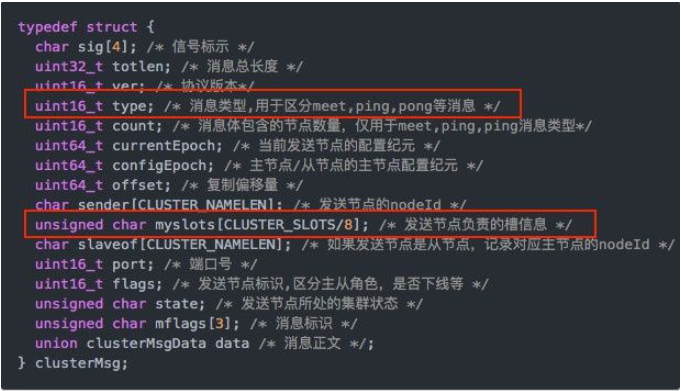

- (1)如果槽位为65536，发送心跳信息的消息头达8k，发送的心跳包过于庞大。
  在消息头中最占空间的是myslots[CLUSTER_SLOTS/8]。 当槽位为65536时，这块的大小是: 65536÷8÷1024=8kb 
  因为每秒钟，redis节点需要发送一定数量的ping消息作为心跳包，如果槽位为65536，这个ping消息的消息头太大了，浪费带宽。

  (2)redis的集群主节点数量基本不可能超过1000个。
  集群节点越多，心跳包的消息体内携带的数据越多。如果节点过1000个，也会导致网络拥堵。因此redis作者不建议redis cluster节点数量超过1000个。 那么，对于节点数在1000以内的redis cluster集群，16384个槽位够用了。没有必要拓展到65536个。

  (3)槽位越小，节点少的情况下，压缩比高，容易传输
  Redis主节点的配置信息中它所负责的哈希槽是通过一张bitmap的形式来保存的，在传输过程中会对bitmap进行压缩，但是如果bitmap的填充率slots / N很高的话(N表示节点数)，bitmap的压缩率就很低。 如果节点数很少，而哈希槽数量很多的话，bitmap的压缩率就很低。 


# 十二、Sentinel

Sentinel（哨兵）可以监听集群中的服务器，并在主服务器进入下线状态时，自动从从服务器中选举出新的主服务器。

## 玩法

1. 自定义的`/myredis`目录新建`sentinel.conf`文件，名字绝对不能错。
2. 配置哨兵
   1. sentinel monitor 被监控数据库名字(自己起) 127.0.0.1 6379 1
   2. 上面的数字1，表示主机挂掉后slave投票看让谁接替成为主机，得票数多少后成为主机。
3. 启动哨兵
   1. `redis-sentinel /xxx/sentinel.conf`


# 十三、分片

当 Redis 缓存数据量大到一台服务器无法缓存时，就需要使用 **Redis 切片集群**（Redis Cluster ）方案，它将数据分布在不同的服务器上，以此来降低系统对单主节点的依赖，从而提高 Redis 服务的读写性能。

分片是将数据划分为多个部分的方法，可以将数据存储到多台机器里面，这种方法在解决某些问题时可以获得线性级别的性能提升。

假设有 4 个 Redis 实例 R0，R1，R2，R3，还有很多表示用户的键 user:1，user:2，... ，有不同的方式来选择一个指定的键存储在哪个实例中。

- 最简单的方式是范围分片，例如用户 id 从 0~1000 的存储到实例 R0 中，用户 id 从 1001~2000 的存储到实例 R1 中，等等。但是这样需要维护一张映射范围表，维护操作代价很高。
- 还有一种方式是哈希分片，使用 CRC32 哈希函数将键转换为一个数字，再对实例数量求模就能知道应该存储的实例。

根据执行分片的位置，可以分为三种分片方式：

- 客户端分片：客户端使用一致性哈希等算法决定键应当分布到哪个节点。
- 代理分片：将客户端请求发送到代理上，由代理转发请求到正确的节点上。
- 服务器分片：Redis Cluster。

# 十四、一个简单的论坛系统分析

该论坛系统功能如下：

- 可以发布文章；
- 可以对文章进行点赞；
- 在首页可以按文章的发布时间或者文章的点赞数进行排序显示。

## 文章信息

文章包括标题、作者、赞数等信息，在关系型数据库中很容易构建一张表来存储这些信息，在 Redis 中可以使用 HASH 来存储每种信息以及其对应的值的映射。

Redis 没有关系型数据库中的表这一概念来将同种类型的数据存放在一起，而是使用命名空间的方式来实现这一功能。键名的前面部分存储命名空间，后面部分的内容存储 ID，通常使用 : 来进行分隔。例如下面的 HASH 的键名为 article:92617，其中 article 为命名空间，ID 为 92617。

[](https://camo.githubusercontent.com/6a63ea8766fbef1f2d118e93473a963785c48c04/68747470733a2f2f63732d6e6f7465732d313235363130393739362e636f732e61702d6775616e677a686f752e6d7971636c6f75642e636f6d2f37633534646532312d653266662d343032652d626334322d3430333764653163313539322e706e67)


## 点赞功能

当有用户为一篇文章点赞时，除了要对该文章的 votes 字段进行加 1 操作，还必须记录该用户已经对该文章进行了点赞，防止用户点赞次数超过 1。可以建立文章的已投票用户集合来进行记录。

为了节约内存，规定一篇文章发布满一周之后，就不能再对它进行投票，而文章的已投票集合也会被删除，可以为文章的已投票集合设置一个一周的过期时间就能实现这个规定。

[](https://camo.githubusercontent.com/4ca96abd48fc7cd1cb19df7e0ae888a443e77559/68747470733a2f2f63732d6e6f7465732d313235363130393739362e636f732e61702d6775616e677a686f752e6d7971636c6f75642e636f6d2f34383566646633342d636366382d343138352d393763362d3137333734656537313961302e706e67)


## 对文章进行排序

为了按发布时间和点赞数进行排序，可以建立一个文章发布时间的有序集合和一个文章点赞数的有序集合。（下图中的 score 就是这里所说的点赞数；下面所示的有序集合分值并不直接是时间和点赞数，而是根据时间和点赞数间接计算出来的）

[](https://camo.githubusercontent.com/fbb72eeafa944f3994bfd7ffcc9066bba1b6190b/68747470733a2f2f63732d6e6f7465732d313235363130393739362e636f732e61702d6775616e677a686f752e6d7971636c6f75642e636f6d2f66376431373061332d653434362d346136342d616332642d6362393530323866383161382e706e67)


# 十五、传统RDBMS与Redis的比较

**RDBMS：**

- 结构化查询语言
- 数据和关系都存储在单独的表中
- 数据操纵语言，数据定义语言
- 严格的一致性
- 基础事务

**NoSQL：**

- 代表着不仅仅是SQL
- 没有声明性查询语言
- 没有预定义的模式
- K-V键值对存储、列存储、文档存储、图形数据库
- 最终一致性，而非ACID属性
- 非结构化和不可预知的数据
- CAP定理
- 高性能，高可用性和可伸缩性

# 十六、CAP

**CAP：**

- Consistency强一致性
- Availability可用性
- Partition Tolerance分区容错性

CAP理论的核心是：**一个分布式系统不可能同时很好的满足一致性，可用性和分区容错性这三个需求，最多只能同时较好的满足两个。**

而由于当前的网络硬件肯定会出现延迟丢包等问题，所以分区容忍性是我们必须需要实现的。

所以我们只能在**一致性**和**可用性**之间进行权衡，没有NoSQL系统能够同时保证这三点。

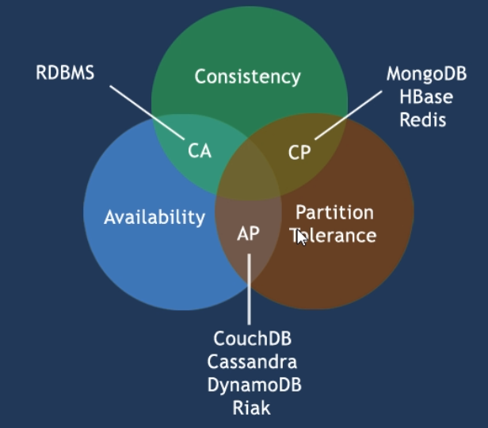

> CA 传统Oracle数据库
>
> AP 大多数网站架构的选择
>
> CP Redis、Mongodb


## BASE

BASE就是为了解决关系数据库强一致性引起的问题而引起的可用性降低而提出的解决方案。

- 基本可用(Basically Available)
- 软状态(Soft state)
- 最终一致(Eventually consistent)

他的思想是通过让系统放松对某一时刻数据一致性的要求来换取系统整体伸缩性和性能上改观。


# 十七、Linux操作Redis

## Redis部分命令

> redis端口6379在是手机按键上MERZ对应的号码，而MERZ取自意大利歌女[Alessia Merz](http://it.wikipedia.org/wiki/Alessia_Merz)的名字

`Redis`命令参考：http://redisdoc.com/


### 查看redis版本信息

```shell
redis-server --version
```


### 数据库命令

```shell
redis-cli  #客户端连接redis
select 0 #连接第一个db，默认16个db
keys * #查询当前所有key，老版本默认为3个，新版本6.x为0个
keys k* #查询当前db中k开头的key，老版本为k?
flushdb #清空当前db中的所有k-v
flushall #清空所有db中的k-v
dbsize #查询当前db中k-v的数量
exists key # 查询当前key是否在db中
MOVE key db# 将当前数据库的 key 移动到给定的数据库 db 当中，若当前数据库(源数据库)和给定数据库(目标数据库)有相同名字的给定 key ，或者 key 不存在于当前数据库，那么 MOVE 没有任何效果。
expire key 秒钟# 给当前key设定过期时间
ttl key # 查看当前key还有多少秒过期，-1表示永不过期，-2表示已过期。过期就会被移除db
type key # 查看你的key是什么类型
```

### String类型命令

```shell
set/get/del/apped/strlen # 和Java中类似
incr key # 自减1
decr key # 自减1
incrby key num #自增num
decrby key num #自减num
# 切记，上述四个命令，一定要是数字才能够进行加键

getrange/setrange key offset (value) # 部分字符的获取/替换，offset0~-1表全部
setex(set with expire)键秒值# 将键 key 的值设置为 value ， 并将键 key 的生存时间设置为 seconds 秒钟。
setnx(set if not exist) # 只在键 key 不存在的情况下，才将键 key 的值设置为 value 。

meset/mget/msetnx #批量set、批量get
```

### List类型命令

```shell
lpush/rpush/lrange # lpush先进后出(头插法)，rpush先进先出(尾插法)，
lpop/rpop # lpop删除头元素，rpop删除尾元素
```


## Docker容器部署Redis

使用交互式命令进入docker内部

```shell
docker exec -it redis /bin/bash
```


# 十八、发布与订阅

进程间的一种消息通信模式：**发送者发送消息，订阅者接收消息。**


------

# 十九、面试题

## 1、基本数据类型，你还知道其他redis的类型吗？你是怎么应用这几个数据类型的？

**Ps：**

- 命令是不区分大小写的，而key是区分大小写的。
- 帮助手册`help @命令`

//基本五个

- string(点赞、喜欢、阅读数)

  - 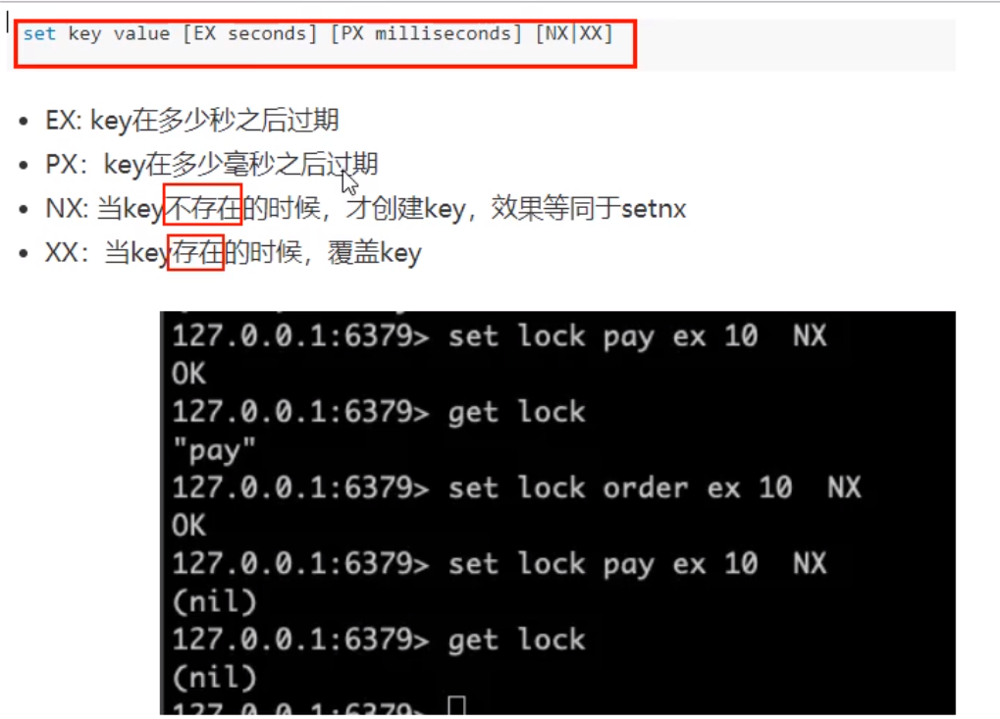

    

- list

  - 微信订阅号

- hash

  - `Map<String, Map<Object,Object>>`
  - 可以做购物车

- set

  - 微信抽奖小程序
    - 随机返回一个`srandmember xxx  1`
    - 随机抽两个二等奖`spop xxx 2`
    - 
  - 微信朋友圈点赞
    - 
  - 微博好友关系社交关系
    - 共同关注~~~~取交集`sinter xx xxx`
  - QQ内推可能认识的人
    - 两个好友取差集`sdiff xx   xx1`

- zset

  - 抖音热搜
    - 

  

//另外还有

- bitmap
- HyperLogLog
- Geo
- Stream


## 2、bigkey、hotkey的定义

### bigkey

大Key可以分为两种情况：

- `Key的Value较大`，例如一个String类型的Key大小达到10MB，或者一个集合类型（Hash，List，Set等）的元素总大小达到了100MB。一般我们定义单个String类型的Key大小达到10KB，或者集合类型的Key总大小达到50MB，则定义其为大Key。
- `Key的元素较多`，例如一个Hash类型的Key，其元素数量达到了10000。一般我们定义集合类型的Key中元素超过5000个，则认为其为大Key。

#### bigkey会造成什么问题？

1. **客户端超时阻塞：**
2. **引发网络阻塞：**大key费流量
3. **阻塞工作线程：**del大key会阻塞工作线程
4. **内存分布不均：**集群模型在slot分片均匀情况下，会出现数据和查询倾斜情况，部分有大key的Redis节点占用内存多，QPS也会比较大。

### hotkeys

通常以一个Key被操作的频率和占用的资源来判定其是否为热Key，例如：

- 某个集群实例一个分片每秒处理10000次请求，其中有3000次都是操作同一个Key。
- 某个集群实例一个分片的总带宽使用（入带宽+出带宽）为100Mbits/s，其中80Mbits是由于对某个Hash类型的Key执行HGETALL所占用。


## 3、如何排查Redis的bigkey、hotkey？

### 查找bigkey

#### 1、redis-cli

Redis 可以在执行 `redis-cli` 命令时带上 `–-bigkeys` 选项，进而对整个数据库中的键值对大小情况进行统计分析。

程序使用`SCAN`命令，因此可以在不影响操作的情况下对繁忙的服务器执行。但是，可以使用-i选项来限制每个SCAN命令的扫描时间，以便控制扫描速度。

1. 在输出结果的第一部分中，每个新的大键（相同类型的）都会被报告，这些键的大小都比前面遇到的大键更大。

2. 总结部分会输出每种数据类型中最大的 bigkey 的信息，对于 String 类型来说，会输出最大 bigkey 的字节长度，对于集合类型来说，会输出最大 bigkey 的元素个数。

**缺点：**bigkeys仅能分析并输入六种数据类型（STRING、LIST、HASH、SET、ZSET、STREAM）

```shell
$ redis-cli --bigkeys

# Scanning the entire keyspace to find biggest keys as well as
# average sizes per key type.  You can use -i 0.01 to sleep 0.01 sec
# per SCAN command (not usually needed).
# 在输出结果的第一部分中，每个新的大键（相同类型的）都会被报告，这些键的大小都比前面遇到的大键更大。
[00.00%] Biggest string found so far 'key-419' with 3 bytes
[05.14%] Biggest list   found so far 'mylist' with 100004 items
[35.77%] Biggest string found so far 'counter:__rand_int__' with 6 bytes
[73.91%] Biggest hash   found so far 'myobject' with 3 fields

-------- summary -------

Sampled 506 keys in the keyspace!
Total key length in bytes is 3452 (avg len 6.82)

Biggest string found 'counter:__rand_int__' has 6 bytes
Biggest   list found 'mylist' has 100004 items
Biggest   hash found 'myobject' has 3 fields

504 strings with 1403 bytes (99.60% of keys, avg size 2.78)
1 lists with 100004 items (00.20% of keys, avg size 100004.00)
0 sets with 0 members (00.00% of keys, avg size 0.00)
1 hashs with 3 fields (00.20% of keys, avg size 3.00)
0 zsets with 0 members (00.00% of keys, avg size 0.00)
```

#### 2、使用Scan命令来寻找大key


#### 3、redis-rdb-tools

分析Redis RDB快照文件的开源工具。可以根据需求自定义分析Redis实例中所有Key的内存占用情况。

1. 需要提前导出实例的rdb文件，该方法时效性相较于在线分析来说较差，优势在于完全不影响现有业务。


### 查找HotKey

**1、在逻辑层面：**

1. 凭借业务经验，预估出哪些key是热点key。
   - 优点：简单，凭经验发现热 `Key`，提早发现提早处理；
   - 缺点：没有办法预测所有热 `Key` 出现，比如某些热点新闻事件，无法提前预测。

**2、在客户端层面：**

- 一般我们在连接 `Redis` 服务器时都要使用专门的 SDK（比如：`Java` 的客户端工具 `Jedis`、`Redisson`），我们可以对客户端工具进行封装，在发送请求前进行收集采集，同时定时把收集到的数据上报到统一的服务进行聚合计算。

**3、在proxy层面：**

- 如果所有的 `Redis` 请求都经过 `Proxy`（代理）的话，可以考虑改动 `Proxy` 代码进行收集，思路与客户端基本类似。

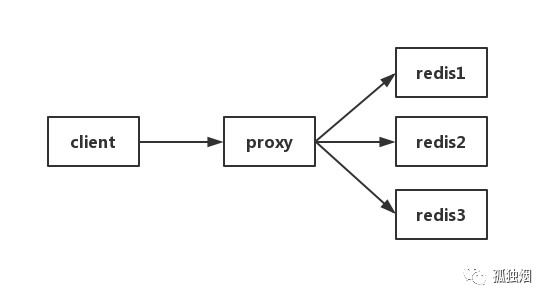

**4、在redis层面：**

1. `redis-cli`提供了`hotkeys`参数，可以快速帮您找出业务中的热Key，该命令需要在业务实际运行期间执行，以统计运行期间的热Key。

   1. 由于需要扫描整个 `keyspace`，实时性上比较差;
   2. 扫描时间与 `key` 的数量正相关，如果 `key` 的数量比较多，耗时可能会非常长。

2. `使用Redis扩展`：有一些Redis扩展可以用于自动检测和处理Hotkey。例如，Redisson扩展可以自动检测Hotkey并使用LRU算法进行清理。

3. 使用`redis-cli monitor`来监听redis的所有命令，之后对命令进行过滤，得到跟get相关的命令，之后统计出热点key。

   1. `redis-cli monitor | grep "get"`

      

   2. 缺点：该命令在高并发的条件下，有内存增暴增的隐患，还会降低 `Redis` 的性能。


**5、网络数据抓包分析：**

`Redis` 客户端使用 `TCP` 协议与服务端进行交互，通信协议采用的是 `RESP` 协议。自己写程序监听端口，按照 `RESP` 协议规则解析数据，进行分析。或者我们可以使用一些抓包工具，比如 `tcpdump` 工具，抓取一段时间内的流量进行解析。

- 优点：对 `SDK` 或者 `Proxy` 代理层没有入侵；
- 缺点：
  - 有一定的开发成本；
  - 热 `Key` 节点的网络流量和系统负载已经比较高了，抓包可能会导致情况进一步恶化。


## 4、如何解决bigkey以及hotkey问题

### bigkey

要解决Big Key问题，无非就是`减小key对应的value值的大小`，也就是对于String数据结构的话，减少存储的字符串的长度；对于List、Hash、Set、ZSet数据结构则是减少集合中元素的个数。

1. **对大Key进行拆分**
   - 将一个Big Key拆分为多个key-value这样的小Key，并确保每个key的成员数量或者大小在合理范围内，然后再进行存储，通过get不同的key或者使用mget批量获取。
2. **压缩value**
   - 使用序列化、压缩算法将key的大小控制在合理范围内，但是需要注意序列化、反序列化都会带来一定的消耗。如果压缩后，value还是很大，那么可以进一步对key进行拆分。
3. 对大Key进行清理
   - 对Redis中的大Key进行清理，从Redis中删除此类数据。
   - Redis4.0之前使用`del`删除大key
   - Redis自4.0起提供了`UNLINK`命令，该命令能够`以非阻塞的方式缓慢逐步的清理传入的Key`，通过UNLINK，你可以安全的删除大Key甚至特大Key。
4. 定期清理失效数据
   - 如果某个Key有业务不断以增量方式写入大量的数据，并且忽略了其时效性，这样会导致大量的失效数据堆积。可以通过定时任务的方式，对失效数据进行清理。

### hotkey

1. 使用读写分离

   1. 如果热key主要是读流量大

2. **使用客户端缓存/本地缓存(二级缓存)(Ehcache/HashMap)**

   1. 当发现热key之后，将热key加载到JVM中，针对这种热key请求，会直接从jvm中取，而不会走到redis层。假设此时有十万个针对同一个key的请求过来,如果没有本地缓存，这十万个请求就直接怼到同一台redis上了。现在假设，你的应用层有50台机器，OK，你也有jvm缓存了。这十万个请求平均分散开来，每个机器有2000个请求，会从JVM中取到value值，然后返回数据。避免了十万个请求怼到同一台redis上的情形。
   2. 注意两个问题：
      1. 如果对热 `Key` 进行本地缓存，需要防止本地缓存过大，影响系统性能；
      2. 需要处理本地缓存和 `Redis` 集群数据的一致性问题。

3. 增加redis实例数量

   1. 对于出现热 `Key` 的 `Redis` 实例，我们可以通过水平扩容增加副本数量，将读请求的压力分担到不同副本节点上。

4. 热key备份

   1. 那么如何将对某个热 `Key` 的请求打散到不同实例上呢？我们就可以通过热 `Key` 备份的方式，基本的思路就是，我们可以给热 `Key` 加上前缀或者后缀，把一个热 `Key` 的数量变成 `Redis` 实例个数 `N` 的倍数 `M`，从而由访问一个 `Redis` `Key` 变成访问 `N * M` 个 `Redis` `Key`。 `N * M` 个 `Redis` `Key` 经过分片分布到不同的实例上，将访问量均摊到所有实例。

   2. ```sql
      // N 为 Redis 实例个数，M 为 N 的 2倍
      const M = N * 2
      //生成随机数
      random = GenRandom(0, M)
      //构造备份新 Key
      bakHotKey = hotKey + "_" + random
      data = redis.GET(bakHotKey)
      if data == NULL {
          data = redis.GET(hotKey)
          if data == NULL {
              data = GetFromDB()
              // 可以利用原子锁来写入数据保证数据一致性
              redis.SET(hotKey, data, expireTime)
              redis.SET(bakHotKey, data, expireTime + GenRandom(0, 5))
          } else {
              redis.SET(bakHotKey, data, expireTime + GenRandom(0, 5))
          }
      }
      ```

      在这段代码中，通过一个大于等于 `1` 小于 `M` 的随机数，得到一个 `bakHotKey`，程序会优先访问 `bakHotKey`，在得不到数据的情况下，再访问原来的 `hotkey`，并将 `hotkey` 的内容写回 `bakHotKey`。值得注意的是，`bakHotKey` 的过期时间是 `hotkey` 的过期时间加上一个较小的随机正整数，这是通过坡度过期的方式，保证在 `hotkey` 过期时，所有 `bakHotKey` 不会同时过期而造成缓存雪崩。

5. 设计熔断/降级机制


## 5、个人觉得Redis中比较惊艳的地方？

### SDS会默认会创建 0~10000的共享对象

> 这一点可以和Java中的*IntegerCache*进行类比
>
> **Byte，Short，Integer, Long 的缓存池范围默认都是: -128 到 127**

`set k2 123`

当字符串键值的内容可以用一个64位有符号整形来表示时，Redis会将键值转化为long型来进行存储，此时即对应 OBJ_ENCODING_INT 编码类型。内部的内存结构表示如下:


Redis 启动时会预先建立 10000 个分别存储 0~9999 的 redisObject 变量作为共享对象，这就意味着如果 set字符串的键值在 0~10000 之间的话，则可以 直接指向共享对象 而不需要再建立新对象，此时键值不占空间！

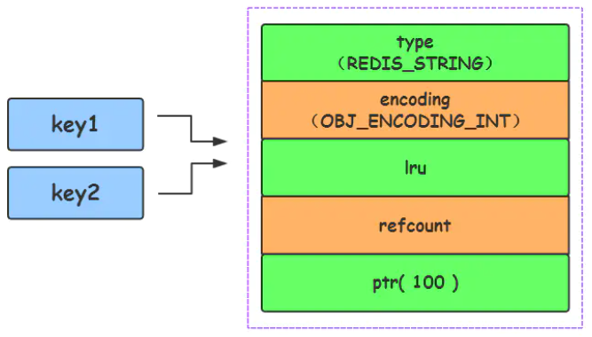


redis源代码：object.c

 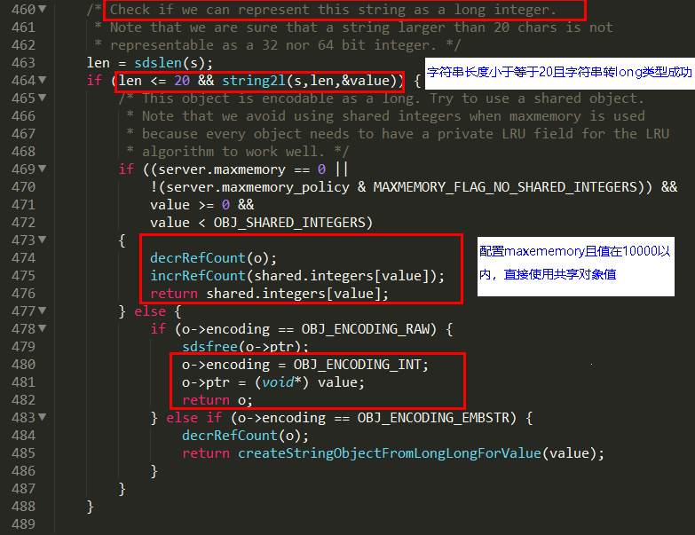


## 6、Redis中的各个组成部分的关系


简单来说就是

1. 启动redis之后，就会有一个`redisServer`这样的一个结构体

   1. 默认包含16个`redisDB`

2. `redisDB`对应redis的一个数据库

   1. ```c
      struct redisDB{
          dict *dict;
          dict *expires; // 定时删除就是扫描这个dict
          dict *blocking_keys;
          dict *ready_keys;
          dict *watched_keys;
          int id;
          long long avg_ttl;
      }
      ```

3. 每个`dict`对应一个字典

   1. ```c
      struct dict{
          dictType *type; // 哈希表类型(存储普通键、存储过期键等)
          void *privdata;
          dictht ht[2];  // 数组(长度为2)便于哈希表扩容
          int rehashindex; //不等于-1的时候会扩容
          int iterators; // 正在遍历该hash表的迭代器数量(有正在遍历的迭代器时不能扩容)
      }
      ```

4. `dictht`是`dict`字段的哈希表部分

   1. ```c
      struct dictht{
          dictEntry **table; // 相当于dictEntry[][] table
          unsigned long size; // 数量
          unsigned long sizemask; //计算哈希桶的掩码
          unsigned long used; // 用了多少？
      }
      ```

5. `dicEntry`是redis中具体的`<key , value>`

   1. ```c
      struct dicEntry {
          void *key;
          void *vak;
          dicEntry *next; //链表，解决hash冲突
      }
      ```

   2. 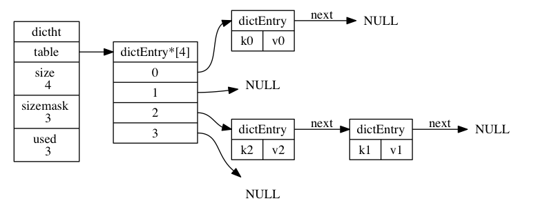

6. `dicEntry`中的`value`对应的就是一个`redisObject`

   1. `redisObject`是redis中所有数据类型的父类

   2. ```c
      struct redisObject{
          unsigned type:4; // 数据类型
          unsigned notused:2; 
          unsigned encoding:4; // 编码类型
          unsigned lru: 22;
          int refcount; // 引用计数
          void *ptr; // 指向底层数据结构的指针
      }
      ```


## 7、Redis中是如何解决hash碰撞的？和HashMap有什么区别？

`拉链法`

1. Redis中并没有采用红黑树来解决链表长度过长导致的时间复杂度过高。
   1. 这是因为redis对内存极为敏感，而维护大量红黑树会导致内存占用过高。


还有一个地方不一样：`Redis中哈希表扩容与HashMap不一样`

1. Redis中哈希表扩容是渐进转移的。
2. 而HashMap中扩容是一次性转移完成。


## 8、渐进式rehash

**Redis**中的数据存储在字典**dict**数据结构中，一个**dict**数据结构持有两张哈希表**dictht**，每张**dictht**中持有一个存储数据的**dictEntry**数组，每份数据会以键值对的形式封装成一个**dictEntry**节点然后添加到**dictEntry**数组中，当存在哈希冲突时，**Redis**中使用拉链法解决哈希冲突，但是**dictEntry**数组的默认容量为4，发生哈希冲突的概率极高，如果不进行扩容，会导致哈希表的时间复杂度恶化为`O(logN)`，所以满足一定条件时，需要进行**dictEntry**数组的扩容，即进行**Redis**的扩容。


`Redis的扩容的时机总结如下：`

- 如果没有`fork`子进程在执行**RDB**或者**AOF**的持久化，一旦满足`ht[0].used >= ht[0].size`，此时触发扩容；
  - **当负载因子大于等于 1 ，并且 Redis 没有在执行 bgsave 命令或者 bgrewiteaof 命令，也就是没有执行 RDB 快照或没有进行 AOF 重写的时候，就会进行 rehash 操作。**
- 如果有`fork`子进程在执行**RDB**或者**AOF**的持久化时，则需要满足`ht[0].used > 5 * ht[0].size`，此时触发扩容。
  - **当负载因子大于等于 5 时，此时说明哈希冲突非常严重了，不管有没有有在执行 RDB 快照或 AOF 重写，都会强制进行 rehash 操作。** 


**Redis**的**dict**数据结构通常只会使用两张哈希表中的其中一张，，即**ht[0]**，但是当需要进行扩容时，此时会使用到**dict**的另外一张哈希表**ht[1]**，**Redis**的扩容步骤如下所示。

- 计算**ht[1]**的容量**size**，即扩容后的容量，==**ht[1]**的容量为大于等于`ht[0].used * 2`且同时为2的幂次方的最小值；==
- 为**ht[1]**设置**size**，**sizemask**字段的值，初始化**used**字段为0，并为**dictEntry**数组分配空间；
- 将**dict**的**rehashidx**字段设置为0，表示此时开启渐进式**rehash**，**Redis**会通过渐进式**rehash**的方式逐步将**ht[0]**上的**dictEntry**以哈希桶为单位逐次迁移到**ht[1]**上；
- 当**ht[0]**的所有键值对全部存放到**ht[1]**中后，释放**ht[0]**的内存空间，然后**ht[1]**变为**ht[0]**。

当**dict**中键值对特别多时，**rehash**会特别耗时，所以**Redis**采用一种渐进式**rehash**的方式来完成扩容，**dict**中的**rehashidx**字段用于记录当前已经**rehash**到的哈希桶的索引，而渐进式**rehash**就是**Redis**不会一次性将**ht[0]**上的键值对迁移到**ht[1]**上，而是会在某些时间点迁移一部分，这些时间点如下所示。

- 当对数据进行增删改查时会从**ht[0]**迁移一个哈希桶到**ht[1]**上；
- **Redis**会定时的从**ht[0]**迁移一部分哈希桶到**ht[1]**上。

特别注意，如果在渐进式**rehash**的过程中有新的键值对添加，那么会直接添加到**ht[1]**中。


> 自我理解：
>
> 渐进式rehash就是一步一步的将所有的哈希槽都转移到新的哈希表中。
>
> 1. dict中的`rehashIndex`表示`ht[0]`中正在顺序遍历的位置，客户端每次进行增删改查操作时，都会按顺序迁移一个哈希桶（或哈希槽）的键值对到 `ht[1]` 中，然后将 `rehashidx` 递增。


## 9、Innodb为什么选择使用B+树而不是跳表，Redis为什么选择调表而不是B+树？

> 为什么不用红黑树？
>
> 1. 实现比较复杂
> 2. 红黑树范围查询没有跳表进行范围查询那么方便。

### B+树和跳表相同之处

- B+树和跳表都是在最底层包含所有用户数据,并且都是按顺序排列,时候范围查询
- B+树和跳表利用索引层实现二叉查看，从而提高性能

### 不同之处

**数据读取**

- B+ 树是多路平衡搜索树，三层高度即可容纳2kw左右的数据，相同情况下，跳表则需要大约24层，假设层高对应磁盘IO，那么B+树的读性能会比跳表要好，因此Innodb选择了B+树做索引。
- redis读写全在内存中，不涉及磁盘IO，无需考虑索引层高度，同时由于跳表实现起来更加简单，相比B+ tree而言，少了选择树结构的开销，因此redis使用跳表来实现zset,而不是B+ tree。

> 换句话说，就是Redis操作的是内存，不需要操作磁盘IO，要知道磁盘读取和内存读取相差百万倍。而MySQL需要找到节省IO的数据结构。
>
> 这个问题在于Redis是直接操作内存的，并不需要磁盘io而MySQL需要去读取io，MySQL要使用b+树的方式减少磁盘io，B+树的原理是 叶子节点存储数据，非叶子节点存储索引，每次读取磁盘页时就会读取一整个节点,每个叶子节点还有指向前后节点的指针，为的是最大限度的降低磁盘的IO;因为数据在内存中读取耗费的时间是从磁盘的IO读取的百万分之一。
>
> 而Redis是 内存中读取数据，不涉及IO，因此使用了跳表，跳表明显是更快更简单的方式。

**数据写入**

- B+树需要频繁拆分、合并数据页。
- 跳表则是独立插入，并且根据随机函数来确定层数，没有旋转和维持平衡带来的开销。跳表的性能比B+树要好的多。


