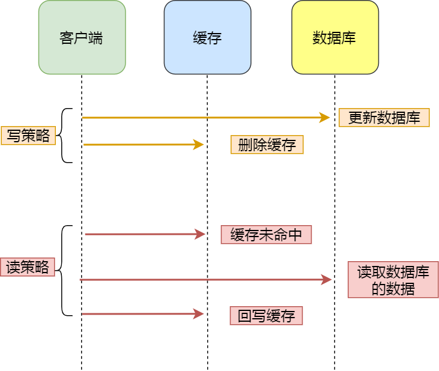
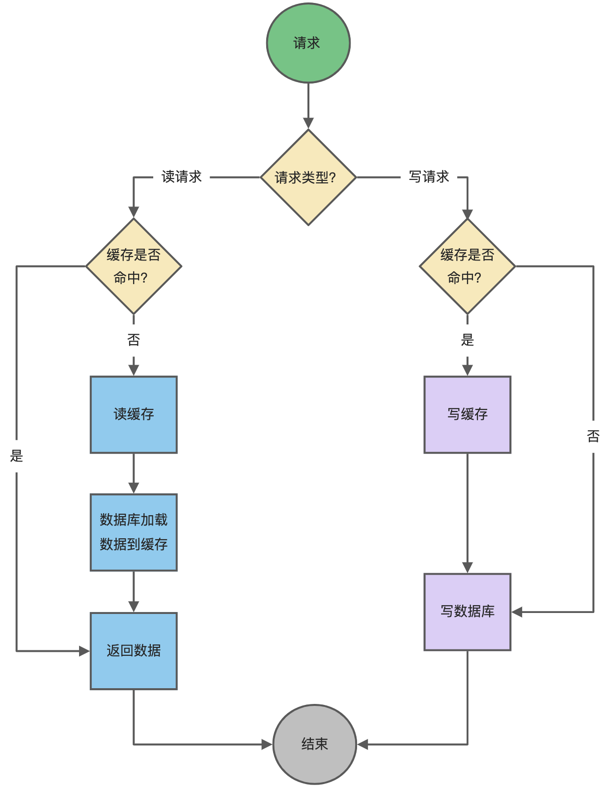
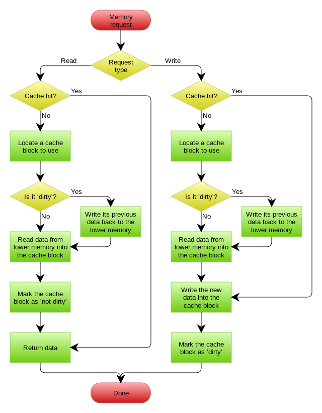

## 常见的缓存更新策略(三种)

> 实际开发过程中，MySQL和Redis的更新策略用的就是`Cache Aside`策略，另外两种策略应用不了。

### 1、Cache Aside(旁路缓存)策略

应用程序直接和[数据库、缓存]进行交互，并负责对缓存的维护，该策略又可以细分为`读策略`和`写策略`。

#### 写策略

- `先更新`数据库中的数据，`再删除`缓存中的数据

> 注意，写策略的步骤的顺序不能倒过来，即**不能先删除缓存再更新数据库**，原因是在「读+写」并发的时候，会出现缓存和数据库的数据不一致性的问题。
>
> 也不能说`先更新、再删除`不会导致并发性问题，只是出现问题的概率比较低。(因为缓存的写入速度远远快于数据库的写入速度)

#### 读策略

- 如果读取的数据命中了缓存，则直接返回数据。
- 如果读取的数据没有命中缓存，则从数据库中读取数据，然后将数据写入到缓存中，并且返回给用户。

#### 应用场景

适合读多写少的场景，不适合写多的情况。

因为当写入比较频繁的时候，缓存中的数据会被频繁的清理掉，大大降低了缓存的命中率。

> 如果业务对缓存的命中率又较高的要求，可以采取一下两种策略：
>
> 1. 在更新数据时也更新缓存，`只是在更新缓存前先加一个分布式锁`，因为这样在同一时间只允许一个线程更新缓存，就不会产生并发问题了。当然这么做对于写入的性能会有一些影响；
>
> 2. 同样也是在更新数据时更新缓存，只是`给缓存加一个较短的过期时间`，这样即使出现缓存不一致的情况，缓存的数据也会很快过期，对业务的影响也是可以接受。

----

### 2、Read/Write Through(读写/写穿)策略

该策略的原则是应用程序只和`缓存`进行交互，不再和数据库进行交互，而是由缓存和数据库进行交互，相当于更新数据库的操作由缓存自己代理了。

#### Read Through策略

1. 先查询缓存中的数据是否存在，如果存在直接返回，如果不存在，由缓存组件负责从数据库中查询数据，并将结果写入到缓存中，最后由缓存组件返回数据给应用程序。

#### Write Through策略

当有数据更新时，先查询要写入的数据是否再缓存中：

1. 若该数据在缓存中存在副本，则更新缓存中的数据，并且由缓存组件同步到数据库中，最后由缓存组件告知应用程序修改完成。
2. 若该数据在缓存中不存在，直接更新数据库，然后返回。

#### 应用场景

该策略的特点是由缓存节点而非应用程序来和数据库打交道，在我们开发的过程中相比旁路缓存策略要少见一些，原因是我们经常使用的分布式缓存组件，无论是 Memcached 还是 Redis 都不提供写入数据库和自动加载数据库中的数据的功能。而我们在使用本地缓存的时候可以考虑使用这种策略。

---

### 3、Write Back(写回)策略

该策略在更新数据的时候，只更新缓存，同时将缓存数据设置为脏的，然后立马返回，并不会更新数据库。对于数据库的更新，会通过批量异步更新的形式进行。

实际上，该策略也不能引用在我们常用的数据库和缓存当中，因为Redis并没有异步更新数据库的功能。

Write Back策略是计算机体系结构中的设计，比如CPU的缓存、操作系统中文件系统的缓存都采用了`Write Back策略。`

==Write Back策略特别适合**写多**的场景，==因为发生写操作的时候，只需要更新缓存，就立马返回了。比如，写文件的时候，实际上是写入到文件系统的缓存就返回了，并不会写磁盘。

**但是带来的问题是，数据不是强一致性的，而且会有数据丢失的风险**，因为缓存一般使用内存，而内存是非持久化的，所以一旦缓存机器掉电，就会造成原本缓存中的脏数据丢失。所以你会发现系统在掉电之后，之前写入的文件会有部分丢失，就是因为 Page Cache 还没有来得及刷盘造成的。

这里贴一张 CPU 缓存与内存使用 Write Back 策略的流程图：

