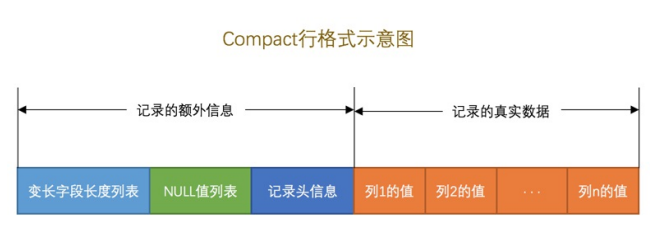
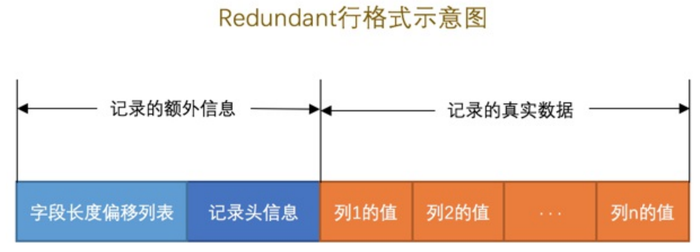
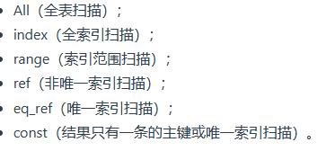
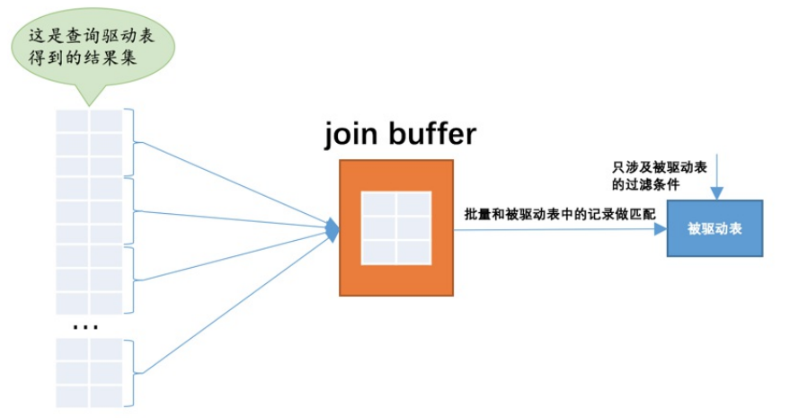
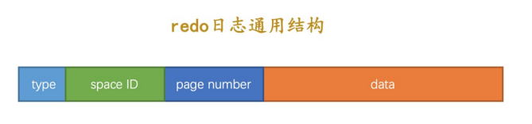

# 一、字符集

## 重要的字符集

- `ASCII`字符集

共收录128个字符，**包括空格、标点符号、数字、大小写字母和一些不可见字符。由于总共才128个字符**，所以可以使用1个字节来进行编码，我们看一些字符的编码方式：

```
'L' ->  01001100（十六进制：0x4C，十进制：76）
'M' ->  01001101（十六进制：0x4D，十进制：77）

```

* `ISO 8859-1`字符集

  共收录**256**个字符，是在`ASCII`字符集的基础上又扩充了**128个西欧常用字符**(包括德法两国的字母)，也可以使用1个字节来进行编码。这个字符集也有一个别名**`latin1`**。

- `GB2312`字符集
  - 收录了汉字以及拉丁字母、希腊字母、日文平假名及片假名字母、俄语西里尔字母。其中收录汉字6763个，其他文字符号682个。同时这种字符集又兼容`ASCII`字符集，所以在编码方式上显得有些奇怪：
  - 如果该字符在`ASCII`字符集中，则采用1字节编码，否则采用2字节编码。


>  这种表示一个字符需要的字节数可能不同的编码方式称为`变长编码方式`。比方说字符串`'爱u'`，其中`'爱'`需要用2个字节进行编码，编码后的十六进制表示为`0xCED2`，`'u'`需要用1个字节进行编码，编码后的十六进制表示为`0x75`，所以拼合起来就是`0xCED275`。

> 小贴士： 我们怎么区分某个字节代表一个单独的字符还是代表某个字符的一部分呢？别忘了 ASCII字符集只收录128个字符，使用0～127就可以表示全部字符，所以如果某个字节是在0～127之内的，就意味着一个字节代表一个单独的字符，否则就是两个字节代表一个单独的字符。

* `GBK`字符集

  `GBK`字符集只是在收录字符范围上对`GB2312`字符集作了扩充，编码方式上兼容`GB2312`。

* `utf8`字符集

  **收录地球上能想到的所有字符**，而且还在不断扩充。这种字符集兼容`ASCII`字符集，采用变长编码方式，编码一个字符需要使用1～4个字节，比方说这样：

  ```
  'L' ->  01001100（十六进制：0x4C）
  '啊' ->  111001011001010110001010（十六进制：0xE5958A）
  
  ```

  > 小贴士： 其实准确的说，utf8只是Unicode字符集的一种编码方案，Unicode字符集可以采用utf8、utf16、utf32这几种编码方案，utf8使用1～4个字节编码一个字符，`utf16使用2个或4个字节编码一个字符`，utf32使用4个字节编码一个字符。更详细的Unicode和其编码方案的知识不是本书的重点，大家上网查查哈～ MySQL中并不区分字符集和编码方案的概念，所以后边唠叨的时候把utf8、utf16、utf32都当作一种字符集对待。
  >
  > - 对于单字节的 ASCII 字符（U+0000 至 U+007F），UTF-8 使用一个字节表示，最高位设置为 0。
  > - 对于多字节的 Unicode 字符，UTF-8 使用多个字节表示，其中每个字节的最高位都设置为 1，并且紧随其后的一个比特位设置为 0。
  >
  > 根据这个规则，UTF-8 可以区分出一个字符是用一个编码还是用多个编码。具体来说：
  >
  > - 如果一个字节的最高位是 0，那么它表示的是一个单字节的 ASCII 字符。
  > - 如果一个字节的最高位是 1，而紧随其后的比特位是 0，那么它表示的是多字节字符的第一个字节。
  > - 如果一个字节的最高位是 1，并且紧随其后的比特位也是 1，那么它表示的是多字节字符的后续字节。

​		

### MySQL中支持的字符集和排序规则

我们上边说`utf8`字符集表示一个字符需要使用1～4个字节，但是我们常用的一些字符使用1～3个字节就可以表示了。而在`MySQL`中字符集表示一个字符所用最大字节长度在某些方面会影响系统的存储和性能，所以设计`MySQL`的大叔偷偷的定义了两个概念：

*   `utf8mb3`：阉割过的`utf8`字符集，只使用1～3个字节表示字符。
*   `utf8mb4`：正宗的`utf8`字符集，使用1～4个字节表示字符。

有一点需要大家十分的注意，在`MySQL`中`utf8`是`utf8mb3`的别名，所以之后==在`MySQL`中提到`utf8`就意味着使用1~3个字节来表示一个字符==，如果大家有使用4字节编码一个字符的情况，比如存储一些emoji表情啥的，那请使用`utf8mb4`。

> 引申: 
>
> 1. emoij表情需要用4个表情来存储.
> 2. 在MySQL8之后, utf8mb3被废弃


# 二、数据存储

**真实数据在不同 存储引擎中存放的格式⼀般是不同的**

### InnoDB记录存储结构

- 将一个表的数据存储在磁盘的存储引擎上，所以关机数据也不会丢失。

#### 数据是如何读出来的？

数据并不是一条一条的从磁盘上读出来的？

`InnoDB`采取的方式是：**将数据划分为若干个页，以页作为磁盘和内存之间交互的基本单位，InnoDB中页的大小一般为 _**16**_ KB。也就是在一般情况下，一次最少从磁盘中读取16KB的内容到内存中，一次最少把内存中的16KB内容刷新到磁盘中。**

1. 页是`MySQL`中磁盘和内存交互的基本单位，也是`MySQL`是管理存储空间的基本单位。

2. 指定和修改行格式的语法如下：

   ```
   CREATE TABLE 表名 (列的信息) ROW_FORMAT=行格式名称
   
   ALTER TABLE 表名 ROW_FORMAT=行格式名称
   
   ```

3. 一个页一般是`16KB`，当记录中的数据太多，当前页放不下的时候，会把多余的数据存储到其他页中，这种现象称为`行溢出`。

#### InnoDB行格式

记录在磁盘上的存放方式也被称为`行格式`或者`记录格式`。

4种不同类型的`行格式`，分别是`Compact`、`Redundant`(5.0之前)、`Dynamic`和`Compressed`行格式。


一条完整的记录其实可以被分为**`记录的额外信息`**和**`记录的真实数据`**两大部分。

#### 四种行格式

`InnoDB`目前定义了4中行格式

* COMPACT行格式

  具体组成如图：

  

* Redundant行格式

  具体组成如图：

  

  

* Dynamic和Compressed行格式

  这两种行格式类似于`COMPACT行格式`，只不过在处理行溢出数据时有点儿分歧，它们不会在记录的真实数据处存储字符串的前768个字节，而是把所有的字节都存储到其他页面中，只在记录的真实数据处存储其他页面的地址。

  另外，`Compressed`行格式会采用压缩算法对页面进行压缩。

---

#### Compact行格式-记录的额外信息

这部分信息是服务器为了描述这条记录而不得不额外添加的一些信息，这些额外信息分为3类，分别是`变长字段长度列表`、`NULL值列表`和`记录头信息`。

##### `1. 变长字段长度列表`

把所有变⻓字段的真实数据占⽤的**字节⻓度**都存放在记录的开头部位，从⽽形成⼀个变⻓字段⻓度列表，各变⻓字段数据占⽤的字节数**按照列的顺序<u>逆序</u>存放**.

另外, 

1. 该列表中只存储值为**非null**的列内容占用的长度.
2. 如果该条记录没有变长字段,那就没有该列表

> 如何确定使用一个字节还是两个字节来表示真正字符串占用的字节数?
>
> 首先定义一下 `W`  `M`  `L`各自的数值
>
> 1. 假设某个字符集中表示⼀个字符最多需要使⽤的字节数为W， 也就是使⽤SHOW CHARSET语句的结果中的Maxlen列，⽐⽅ 说utf8字符集中的W就是3，gbk字符集中的W就是2，ascii 字符集中的W就是1。 
> 2. 对于变⻓类型VARCHAR(M)来说，这种类型表示能存储最多M 个字符（注意是字符不是字节），所以这个类型能表示的字符串最多占⽤的字节数就是**M×W**。 
> 3. 假设它实际存储的字符串占⽤的字节数是L。
>
> 如果M×W <= 255，那么使⽤1个字节来表示真正字符串占⽤ 的字节数。
>
> 如果M×W > 255，则分为两种情况：
>
> 1. 如果L <= 127，则⽤1个字节来表示真正字符串占⽤的 字节数。
> 2. 如果L > 127，则⽤2个字节来表示真正字符串占⽤的字 节数。
>
> **结论:** InnoDB在**读取记录的变长字段长度列表**时会先查看表结构, 如果M*W <= 255 直接使用1个字节读取,否则查看该字节的第一位是否为0,如果是0, 说明长度是单字节,否则是双字节

##### `2. null值列表`

用整数个字节按照列的顺序逆序存放null值.

> 1. 如果没有值为null的列,那就不会有这个列表
> 2. 如果该列为主键/不为空的键,那么他不会纳入统计

##### `3. 记录头信息`

它是由固定的5个字节组成, 包括是否被删除\下一条记录的指针等等

#### Compact行格式-记录的真实数据

`MySQL`会为每个记录默认的添加一些列（也称为`隐藏列`），具体的列如下：


1. 如果用户没有定义主键, 则会选取一个unique键作为主键,如果没有unique键,就添加隐藏列row_id作为主键.

> 小贴士： 实际上这几个列的真正名称其实是：DB\_ROW\_ID、DB\_TRX\_ID、DB\_ROLL\_PTR，我们为了美观才写成了row\_id、transaction\_id和roll\_pointer。

#### Redundant行格式

#####  `1.字段长度偏移列表`

将该条记录中**所有列的长度信息**按照**逆序**存储到字段长度偏移列表中。

通过相邻两个数值的差值计算出各列值的长度。

#####  `2.记录头信息`

Redundant⾏格式的记录头信息占⽤6字节，48个⼆进制位

 `3.对于null值的处理`

Redundant⾏格式并没有NULL值列表

- 如果该存储NULL值的字段是变⻓数据类型的，则在字段 ⻓度偏移列表中记录即可，并不占⽤记录的真实数据部 分。
- 如果该存储NULL值的字段是CHAR(M)数据类型的，则将 占⽤记录的真实数据部分，并把该字段对应的数据使 ⽤0x00字节填充。

### 行溢出数据

MySQL对⼀条记录**占⽤的最⼤存储空间**是有限制的，除了BLOB或者TEXT类型的列之外，其他所有的列（**不包括** 隐藏列和记录头信息）**占⽤的字节⻓度加起来不能超过`65535`个字节。**

1. 在Compact格式中, 如果使用ASCII字符集的话：

   1. 如果该VARCHAR类型的列没有NOT NULL属性，那最多只能存储 `65532`个字节的数据，因为真实数据的⻓度可能占⽤2个字节，NULL 值标识需要占⽤1个字节
   2. 如果VARCHAR类型的列有NOT NULL属性，那最多只能存储`65533`个 字节的数据，因为真实数据的⻓度可能占⽤2个字节，不需要NULL值 标识.

2. 如果VARCHAR(M)类型的列使⽤的不是ascii字符集，**那M的最⼤取值取决于该字符集表示⼀个字符最多需要的字节数**。在列的值允许为NULL的情况下，gbk字符集表示⼀ 个字符最多需要2个字符，那在该字符集下，M的最⼤取值就 是32766（也就是：65532/2），也就是说最多能存储32766个字 符；utf8字符集表示⼀个字符最多需要3个字符，那在该字符集 下，M的最⼤取值就是21844，就是说最多能存储21844（也就是： 65532/3）个字符。

   >  上述所⾔在列的值允许为NULL的情况下，gbk字符集下M的最⼤取值 就是32766，utf8字符集下M的最⼤取值就是21844，这都是在表 中只有⼀个字段的情况下说的，⼀定要记住⼀个⾏中的所有列（不 包括隐藏列和记录头信息）占⽤的字节⻓度加起来不能超过65535 个字节

MySQL中磁盘和内存交互的基本单位是⻚，也就是说MySQL是以⻚为基本单位来管理存储空间的，我们的记录都会被分配到某个⻚中存储。⽽⼀个⻚的⼤⼩⼀般 是16KB，也就是16384字节，⽽⼀个VARCHAR(M)类型的列就最多 可以存储65532个字节，这样就可能造成⼀个⻚存放不了⼀条记录的 尴尬情况。 

- 在Compact和Reduntant⾏格式中，对于占⽤存储空间⾮常⼤的列，在记录的真实数据处`只会存储该列的⼀部分数据，把剩余的数据分散存储在⼏个其他的⻚中，然后记录的真实数据处⽤20个字节存储指向这些⻚的地址`（当然这20个字节中还包括这些分散在其他⻚⾯中的数据的占⽤的字节数），从⽽可以找到剩余数据所在的⻚

### Dynamic和Compressed行格式

这两个行格式和Compact行格式差不多，只不过在处理行溢出时有点分歧。

他们不在记录的真实数据出存储字段真实数据的前768个字节，而是把所有字节都存储在其他页面中，`只在记录的真实数据处存储其他页面的地址`

Compressed⾏格式和Dynamic不同的⼀点是，Compressed⾏格式`会采⽤压缩算法对⻚⾯进⾏压缩，以节省空间。`


### 数据页结构

数据页代表的这块`16KB`大小的存储空间可以被划分为多个部分，不同部分有不同的功能，各个部分如图所示：


从图中可以看出，一个`InnoDB`数据页的存储空间大致被划分成了`7`个部分，有的部分占用的字节数是确定的，有的部分占用的字节数是不确定的。下边我们用表格的方式来大致描述一下这7个部分都存储一些啥内容（快速的瞅一眼就行了，后边会详细唠叨的）：


> 小贴士： 我们接下来并不打算按照页中各个部分的出现顺序来依次介绍它们，因为各个部分中会出现很多大家目前不理解的概念，这会打击各位读文章的信心与兴趣，希望各位能接受这种拍摄手法～


1.  InnoDB为了不同的目的而设计了不同类型的页，我们把用于存放记录的页叫做`数据页`。
2.  一个数据页可以被大致划分为7个部分，分别是

    *   `File Header`，表示页的一些通用信息，占固定的38字节。
    *   `Page Header`，表示数据页专有的一些信息，占固定的56个字节。
    *   `Infimum + Supremum`，两个虚拟的伪记录，分别表示页中的最小和最大记录，占固定的`26`个字节。
    *   `User Records`：真实存储我们插入的记录的部分，大小不固定。
    *   `Free Space`：页中尚未使用的部分，大小不确定。
    *   `Page Directory`：页中的某些记录相对位置，也就是各个槽在页面中的地址偏移量，大小不固定，插入的记录越多，这个部分占用的空间越多。
    *   `File Trailer`：用于检验页是否完整的部分，占用固定的8个字节。
3.  每个记录的头信息中都有一个`next_record`属性，从而使页中的所有记录串联成一个`单链表`(会按照主键值从小到大的顺序)。
    1.  `next_record`指向记录头信息和真实数据之间的位置，这个位置向左读取记录头信息(这就是为什么要逆序存放)，向右读取真实数据。

4.  `InnoDB`会为把页中的记录划分为若干个组，每个组的最后一个记录的地址偏移量作为一个`槽`，存放在`Page Directory`中，所以在一个页中根据主键查找记录是非常快的，分为两步：
    *   通过二分法确定该记录所在的槽。

    *   通过记录的next\_record属性遍历该槽所在的组中的各个记录。
5.  每个数据页的`File Header`部分都有上一个和下一个页的编号，所以所有的数据页会组成一个`双链表`。
6.  为保证从内存中同步到磁盘的页的完整性，在页的首部和尾部都会存储页中数据的校验和和页面最后修改时对应的`LSN`值，如果首部和尾部的校验和和`LSN`值校验不成功的话，就说明同步过程出现了问题。
7.  如果InnoDB中的一条记录被删除了之后，它不会被立即删除，而是在他的记录头信息中将删除标志位取反。如果当前数据页中存在多条被删除的记录，这些记录的next_record属性将会把这些被删除掉的记录组成一个垃圾链表，以备之后重用这部分存储空间。

------

# 三、索引

## 索引方法和索引类型的区分

在MySQL中**索引方法**：`Btree索引、Hash索引`。

- innodb、myisam都只支持Btree索引
- Memory、heap引擎两个都支持。


索引的类别`由建立索引的字段内容特性`来决定。

索引类型又可以分为：

- 全文索引
- 普通索引
- 空间索引
- 唯一索引


## 3.1 B + 树索引

### 没有索引的查找

本集的主题是`索引`，在正式介绍`索引`之前，我们需要了解一下没有索引的时候是怎么查找记录的。为了方便大家理解，我们下边先只唠叨搜索条件为对某个列精确匹配的情况，所谓精确匹配，就是搜索条件中用等于`=`连接起的表达式，比如这样：

```
SELECT [列名列表] FROM 表名 WHERE 列名 = xxx;

```

#### 在一个页中的查找

假设目前表中的记录比较少，所有的记录都可以被存放到一个页中，在查找记录的时候可以根据搜索条件的不同分为两种情况：

* 以主键为搜索条件

  这个查找过程我们已经很熟悉了，可以在`页目录`中使用二分法快速定位到对应的槽，然后再遍历该槽对应分组中的记录即可快速找到指定的记录。

* 以其他列作为搜索条件

  对非主键列的查找的过程可就不这么幸运了，因为在数据页中并没有对非主键列建立所谓的`页目录`，所以我们无法通过二分法快速定位相应的`槽`。这种情况下只能从`最小记录`开始依次遍历单链表中的每条记录，然后对比每条记录是不是符合搜索条件。很显然，这种查找的效率是非常低的。

#### 在很多页中查找

大部分情况下我们表中存放的记录都是非常多的，需要好多的数据页来存储这些记录。在很多页中查找记录的话可以分为两个步骤：

1.  定位到记录所在的页。
2.  从所在的页内中查找相应的记录。

在没有索引的情况下，不论是根据主键列或者其他列的值进行查找，由于我们并不能快速的定位到记录所在的页，所以只能从第一个页沿着双向链表一直往下找，在每一个页中根据我们刚刚唠叨过的查找方式去查找指定的记录。因为要遍历所有的数据页，所以这种方式显然是超级耗时的，如果一个表有一亿条记录，使用这种方式去查找记录那要等到猴年马月才能等到查找结果。所以祖国和人民都在期盼一种能高效完成搜索的方法，`索引`同志就要亮相登台了。

### InnoDB中的索引方案

#### 聚簇索引

1. 使用记录主键值的大小**进行记录和页的排序**，包含三个方面的含义：
   - 页内的记录时按照主键的大小顺序排成一个单向链表
   - 各个存放用户记录的页也是根据页中用户记录的主键大小顺序排成一个双向链表。
   - 存放目录项记录的页分为不同的层次，在同一个层次的页也是根据野种目录项记录的逐渐大小顺序排成一个双向链表。
2. B+树的叶子节点存储的是完整的用户记录
   - 所谓完整的用户记录，就是指这个记录中存储了所有列的值(包含隐藏列)。

我们把具有这两种特性的B+树成为聚簇索引，所有完整的⽤户记录 都存放在这个聚簇索引的叶⼦节点处。

**存储过程：**

1. 创建表之后默认会创建一个聚簇索引。
2. 当为某个表创建一个B+树索引时，就会为这个表创建一个根节点页面。
3. 随后向表中插入数据时，先把用户数据存储到这个根节点中。
4. 当`根节点`中的可用空间用完时继续插入记录，此时会将`根节点`中的所有记录复制到一个新分配的页，比如`页a`中，然后对这个新页进行`页分裂`的操作，得到另一个新页，比如`页b`。这时新插入的记录根据键值（也就是聚簇索引中的主键值，二级索引中对应的索引列的值）的大小就会被分配到`页a`或者`页b`中，而`根节点`便升级为存储目录项记录的页。
   1. ⼀个B+树索引的根节点⾃诞⽣之 ⽇起，便不会再移动


**内节点中目录项记录的唯一：**

1. 对于二级索引的内节点的目录项记录的内容实际上是由三个部分构成的：

   - 索引列的值

   - 主键值

   - 页号

2. 一个页面最少存储2条记录

**总结：**

1. 对于`InnoDB`存储引擎来说，在单个页中查找某条记录分为两种情况：

   *   以主键为搜索条件，可以使用`Page Directory`通过二分法快速定位相应的用户记录。

   *   以其他列为搜索条件，需要按照记录组成的单链表依次遍历各条记录。

2. 没有索引的情况下，不论是以主键还是其他列作为搜索条件，只能沿着页的双链表从左到右依次遍历各个页。

3. `InnoDB`存储引擎的索引是一棵`B+`树，完整的用户记录都存储在`B+`树第`0`层的叶子节点，其他层次的节点都属于`内节点`，`内节点`里存储的是`目录项记录`。`InnoDB`的索引分为两大种：

   * 聚簇索引

     以主键值的大小为页和记录的排序规则，在叶子节点处存储的记录**包含了表中所有的列。**

   * 二级索引

     以自定义的列的大小为页和记录的排序规则，在叶子节点处存储的记录内容是`列 + 主键`。

4. `MyISAM`存储引擎的数据和索引分开存储，这种存储引擎的索引全部都是`二级索引`，在叶子节点处存储的是`列 + 页号`。

### MyISAM中的索引方案

`MyISAM`的索引方案虽然也使用树形结构，但是却将**索引和数据分开存储**：

- 将表中的记录按照记录的插入顺序单独存储在一个文件中，称之为`数据文件`。这个文件并不划分为若干个数据页，有多少记录就往这个文件中塞多少记录就成了。我们可以**通过行号而快速访问到一条记录。**
- 插入数据的时候并没有可以的按照主键大小进行排序，所以我们并不能在这些数据上使用**二分法**进行查找。
- 该存储模型会将索引信息另外存储到一个文件中，==MyISAM会单独为表的主键创建一个索引==，只不过在索引的叶子节点中存储的不是完整的用户记录，**而是`主键值 + 行号`的组合**。也就是先通过索引找到对应的行号，再通过行号去找对应的记录！
- 所有索引都是二级索引
  - 所以在MyISAM引擎中，每次根据主键值进行查找时，都需要一次回表。


------

## 3.2、Hash索引

- Hash索引：Hash索引底层是哈希表，哈希表是一种以key-value存储数据的结构，所以多个数据在存储关系上是完全没有任何顺序关系的，所以，对于区间查询是无法直接通过索引查询的，就需要全表扫描。所以，哈希索引只适用于等值查询的场景。**而B+ 树是一种多路平衡查询树**，所以他的节点是天然有序的（左子节点小于父节点、父节点小于右子节点），所以对于范围查询的时候不需要做全表扫描
- B+树：在B树的基础上，将**非叶节点改造为不存储数据纯索引节点**，进一步降低了树的高度；此外将**叶节点使用指针连接成链表**，范围查询更加高效。


### 索引的代价

- 空间上的代价：
  - 每建立一个索引都要为它创立一棵B+树，每一棵`B+`树的每一个节点都是一个数据页，一个页默认会占用`16KB`的存储空间
- 时间上的代价：
  - 增、删、改操作可能会对节点和记录的排序造成破坏，所以存储引擎需要额外的时间进行一些记录移位，页面分裂、页面回收啥的操作来维护好节点和记录的排序。

换句话说，B+树索引不是万能的，并不是所有的查询语句都能用到我们建立的索引。

### B+树索引适用的条件

- 全值匹配

  - 如果我们的搜索条件中的列和索引列⼀致的话，这种情况就称为全值匹配。

    ```sql
    SELECT * FROM person_info WHERE birthday = '1990-09-27' AND phone_number = '15123983239' AND name= 'Ashburn';
    ```
  - where后的搜索项顺序对查询结果没有影响(因为有查询优化器帮我们进行优化)。

- 匹配**联合索引**左边的列

  - 例如：联合索引`a_b_c_d_e`，搜索条件中出现前缀的列才能使用到B+树索引。
  - 话句话说，`where a = 1`, `where a = 1 and b = 1`, `where a = 1 and b = 1 and c == 1`等等都可以使用到B+树索引。

- 匹配列前缀(like "xxxx%")

  - 如果只给出后缀或者中间的某个字符串，MySQL就无法快速定位记录的位置。
  - 如果只提供了后缀，那么可以在存储记录的时候就`逆序存储`。

- 匹配范围值
  - 如果对多个列同时进行范围查找的话，只有对索引最左边的那个列进行范围查找的时候才能用到`B+`树索引.

  - ```sql
    SELECT * FROM person_info WHERE name > 'Asa' AND name < 'Barlow' AND birthday > '1980-01-01';
    ```

  - 对于索引`idx_name_birthday`来说，只有name使用到了索引，通过name进⾏范围查找的记录中可能并不是按照birthday列进⾏排序的

- 精确匹配某⼀列并范围匹配另外⼀列

  - 对于同⼀个联合索引来说，虽然对多个列都进⾏范围查找时只能⽤到 最左边那个索引列，但是如果左边的列是精确查找，则右边的列可以 进⾏范围查找

- 用于排序

  - `order by a, b, c`需要使用到我们的索引列(即要有索引`idx_a_b_c`)，并且`a, b, c`的次序需要和索引列中的顺序一致
  - 以下几种情况不能使用索引进行排序

    - asc、desc混用
    - where字句中出现非排序使用到的索引列。

      ```sql
      SELECT * FROM person_info WHERE country = 'China' ORDER BY name LIMIT 10;
      ```
    - 排序列包含非同一个索引的列
    - 排序列使用了复杂的表达式

- 用于分组

  - 分组列的顺序也需要和索引 列的顺序⼀致


### 回表的代价

*   访问二级索引使用`顺序I/O`，访问聚簇索引使用`随机I/O`。
*   访问二级索引效率会高一些，访问聚簇索引效率会低一些

由于回表需要使用随机I/O，浪费大量的时间。

1. 需要回表的记录越多，使⽤⼆级索引的性能就越低。所以不一定会完全采用全表扫描的方式，也可能采用二级索引 + 回表的方式执行查询。这就是查询优化器做的工作。
2. 添加了LIMIT 10的查询更容易让优化器采⽤⼆级索引 + 回表的⽅式进⾏查询。


### 带排序的分页查询优化(浅分页、深分页的优化)

PS：对于一张具有20万条数据的表，查询的时候需要进行大量的回表，效率极低，基本上不走索引。我们可以让他强制走索引来进行测试。

```sql
select xxx from tb order by xxx desc limit 80000, 20;
select xxx from tb force index(idx_xxx) order by xxx desc limit 80000, 20;
```

1. 浅分页可以给order by字段添加索引

2. 深分页可以给order by和select字段添加联合索引。

3. 如果需求经常变更，就把排序字段建立索引，可以通过手动回表，强制去走索引。

4. 使用子查询查出所有符合条件的id，之后在查询，省去了回表的过程。

5. 如果id是连续的，可以返回上次查询的最大记录，再往下limit

   1. 分段获取，

   2. ```sql
       select  id,name,balance FROM account where id > 100000 order by id limit 10;
       select  id,name,balance FROM account where id > 100000 order by id limit 10;
       select  id,name,balance FROM account where id > 100000 order by id limit 10;
     ```
   
     


### 覆盖索引

为了彻底告别`回表`操作带来的性能损耗，我们建议：**最好在查询列表里只包含索引列**。

因为我们只查询name, birthday, phone_number这三个索引列的 值，所以在通过idx_name_birthday_phone_number索引得到结 果后就不必到聚簇索引中再查找记录的剩余列，这样就省去了回表操作带来的性能损耗。

我们把这种只需要 ⽤到索引的查询⽅式称为索引覆盖。

当然，如果业务需要查询出索引以外的列，那还是以保证业务需求为重。但是我们很不鼓励用`*`号作为查询列表，最好把我们需要查询的列依次标明。


### 如何挑索引

在使用索引时需要注意下边这些事项：

* 只为用于搜索、排序或分组的列创建索引

* 为列的基数大的列创建索引

  *   列的基础指的是某一列中不重复数据的个数，列的基数越大，该列中的值越分散。好比在0、1布尔值上建立索引，重复值特别多，就会进行回表操作，性能损耗就更大了。

* 索引列的类型尽量小(类型越小，比较越快，占的空间越小，一页可以寸的内容更多，进而加快读写效率)

* 可以只对字符串值的前缀建立索引(节约空间，加速比较)

* 只有索引列在比较表达式中单独出现才可以适用索引

  * ```sql
    1. WHERE my_col * 2 < 4   // 会依次遍历所有的记录，计算这个表达式的值是不是⼩于4
    2. WHERE my_col < 4/2  //可以用索引
    ```

* 为了尽可能少的让`聚簇索引`发生页面分裂和记录移位的情况，建议让主键拥有`AUTO_INCREMENT`属性。

  *   那我们每插满⼀个数据⻚就换到下⼀个数据⻚继续插， ⽽如果我们插⼊的主键值忽⼤忽⼩的话，这就⽐较麻烦了，假设某个 数据⻚存储的记录已经满了，它存储的主键值在1~100之间：

* 定位并删除表中的重复和冗余索引

* 尽量适用`覆盖索引`进行查询，避免`回表`带来的性能损耗。


## 视图

`MySQL`中的视图其实是虚拟的表，也就是某个查询语句的一个别名而已，所以在存储`视图`的时候是不需要存储真实的数据的，只需要把它的结构存储起来就行了。

## 表在文件系统上表示

表在文件系统上表示分两部分

* 表结构的定义

  不论是`InnoDB`还是`MyISAM`，都会在数据库子目录下创建一个和表名同名的`.frm`文件。

* 表中的数据

  针对`InnoDB`和`MyISAM`对于表数据有不同的存储方式。

## 单表访问方法



- `index`: 采用遍历二级索引记录的执行方式称之为`index`

  - ```sql
    SELECT key_part1, key_part2, key_part3 FROM single_table WHERE key_part2 = 'abc';
    ```

  - 基本上都没用到索引，为什么不全表扫描，因为不需要回表并且二级索引记录比聚簇索引记录小得多。

- `all`: 全表扫描

- `range`: 索引列**需要匹配某个或某些范围的值**。

  - `=`、`<=>`、`IN`、`NOT IN`、`IS NULL`、`IS NOT NULL`、`>`、`<`、`>=`、`<=`、`BETWEEN`、`!=`、`like`

- `ref`: 搜索条件为**二级索引列与常数等值比较**，采用二级索引来执行查询的访问方法称为：`ref`

- `ref_or_null`: 当使用二级索引而不是全表扫描，和ref差不多，只不过会包含null值的行。

- `const`: 通过主键或者唯一二级索引列来定位一条记录(进⾏等值⽐较)的访问方法定义为：`const`，意思是常数级别的

>  特殊的：SELECT * FROM single_table WHERE key2 IS NULL;
>
> <u>普通的二级索引列</u>和<u>唯⼀⼆级索引列</u>并不限制NULL值的数量，所以上述语句可能访问到多条记录，也就是说上边这个语句不可以使⽤const访问⽅法来执⾏

## 索引合并

MySQL在⼀般情况下执⾏⼀个查询时最多只会⽤到单个⼆级索引，但不是还有特殊情况么，在这些特殊情况下也可能在⼀个 查询中使⽤到多个⼆级索引，设计MySQL的⼤叔把这种**使⽤到多个索引来完成⼀次查询**的执⾏⽅法称之为：`index merge`

### intersection合并

适⽤于使⽤不同索引的搜索条件之间使⽤AND连接起来的情况

这⾥是说某个查询可以使⽤多个⼆级索引，将从多个⼆级索引中查询到的结果取交集，之后才去回表。

这几种情况下才会使用索引合并：

1. 二级索引列时等值匹配，对于联合索引来说， 在联合索引中的每个列都必须等值匹配。
   1. 所有列都是等值匹配的话，这样记录才是按照主键排序的，后面合并的时候时间复杂度就是O(n)
2. 主键列可以时范围匹配

### Union合并

适⽤于使⽤不同索引的搜索条件之间使⽤OR连接起来的情况

1. ⼆级索引列是等值匹配的情况，对于联合索引来说， 在联合索引中的每个列都必须等值匹配，不能出现只出现匹配部分列的情况。

2. 主键列可以是范围匹配

3. 使⽤Intersection索引合并的搜索条件

   ```sql
   SELECT * FROM single_table WHERE key_part1 = 'a' AND key_part2 = 'b' AND key_part3 = 'c' OR (key1 = 'a' AND key3 = 'b');
   ```

### Sort-Union合并

```sql
SELECT * FROM single_table WHERE key1 < 'a' OR key3 > 'z'
```

1. 先根据key1 < 'a'条件从idx_key1⼆级索引总获取记录， 并按照记录的主键值进⾏排序
2. 再根据key3 > 'z'条件从idx_key3⼆级索引总获取记录， 并按照记录的主键值进⾏排序
3. 因为上述的两个⼆级索引主键值都是排好序的，剩下的操作和 Union索引合并⽅式就⼀样了。

我们把上述这种先按照⼆级索引记录的主键值进⾏排序，之后按 照Union索引合并⽅式执⾏的⽅式称之为Sort-Union索引合并，很 显然，这种Sort-Union索引合并⽐单纯的Union索引合并多了⼀步 对⼆级索引记录的主键值排序的过程。

## 连接的原理

外连接和内连接的本质区别就是：对于外连接的驱动 表的记录来说，如果⽆法在被驱动表中找到匹配ON⼦句中的过滤条 件的记录，那么该记录仍然会被加⼊到结果集中，对应的被驱动表记 录的各个字段使⽤NULL值填充；⽽内连接的驱动表的记录如果⽆法 在被驱动表中找到匹配ON⼦句中的过滤条件的记录，那么该记录会 被舍弃


#### 1. 嵌套循环连接

*   步骤1：选取驱动表，使用与驱动表相关的过滤条件，选取代价最低的单表访问方法来执行对驱动表的单表查询。

*   步骤2：对上一步骤中查询驱动表得到的结果集中每一条记录，都分别到被驱动表中查找匹配的记录。

#### 2. 使用索引加快连接速度

#### 3. 基于快的嵌套循环连接

执行连接查询前申请的一块固定大小的内存，先把若干条驱动表结果集中的记录装在这个`join buffer`中，然后开始扫描被驱动表，每一条被驱动表的记录一次性和`join buffer`中的多条驱动表记录做匹配，因为匹配的过程都是在内存中完成的，所以这样**可以显著减少被驱动表的`I/O`代价**。



## 基于成本的优化

成本包括两部分：

- CPU成本
- IO成本

步骤大概是这样的：

1. 根据搜索条件，找出所有可能使用的索引。
2. 计算全表扫描的代价(聚簇索引占用的页面数、该表中的记录数)
3. 计算不同索引执行查询的代价
4. 对比各种执行方案的代价，找出成本最低的一个


表连接的成本计算

1. MySQL中连接查询采⽤的是嵌套循环连接算法，驱动 表会被访问⼀次，被驱动表可能会被访问多次
2. 包括单词查询驱动表的代价、多次查询被驱动表的代价


## 子查询在MySQL中是如何执行的？

### 标量⼦查询、⾏⼦查询的执⾏⽅式

1. 对于包含不相关的标量⼦查询或者⾏⼦查询的查询语句来 说，MySQL会分别独⽴的执⾏外层查询和⼦查询，就当作两个单表 查询就好了

```sql
SELECT * FROM s1 WHERE key1 = (SELECT common_field FROM s2 WHERE key3 = 'a' LIMIT 1);
```

> 先从外层查询中获取⼀条记录，本例中也就是先从s1表中获取 ⼀条记录。 然后从上⼀步骤中获取的那条记录中找出⼦查询中涉及到的 值，本例中就是从s1表中获取的那条记录中找出s1.key3列的 值，然后执⾏⼦查询。 最后根据⼦查询的查询结果来检测外层查询WHERE⼦句的条件 是否成⽴，如果成⽴，就把外层查询的那条记录加⼊到结果 集，否则就丢弃。 再次执⾏第⼀步，获取第⼆条外层查询中的记录，依次类推

### IN⼦查询优化

1. 如果in子查询的结果集较大的话，MySQL会将结果集放入临时表中，接着将临时表和外查询的表进行表连接查询。
2. 对查询进行优化，直接进行表连接查询、semi-join连接查询(半连接是指只返回符合条件的数据行，而不返回所有匹配的行)

## 错误排查

### Explain

- `select_type`:
  - 查询语句中不包含`UNION`或者子查询的查询都算作是`SIMPLE`类型
  - 对于包含`UNION`、`UNION ALL`或者子查询的大查询来说，它是由几个小查询组成的，其中最左边的那个查询的`select_type`值就是`PRIMARY`

- type
  - 一条记录就代表着`MySQL`对某个表的执行查询时的访问方法，其中的`type`列就表明了访问单表的方法
- possible\_keys和key
  - **可能用到的索引**和**真实使用到的索引**
- key\_len
  - 索引长度
- ref
  - 若使用索引列等值匹配的条件去执行查询时，ref展示与索引列匹配的值
- rows
  - 如果查询优化器决定使用全表扫描的方式对某个表执行查询时，执行计划的`rows`列就代表预计需要扫描的行数，如果使用索引来执行查询时，执行计划的`rows`列就代表预计扫描的索引记录行数。

- filtered


#### 输出Json格式的执行计划

- 在`EXPLAIN`单词和真正的查询语句中间加上`FORMAT=JSON`。

### Optimizer

`ao p tei mei 妹崽  trace`

使用MySQL5.6以及之前的数据库版本，只能通过explain语句来看到最后优化器决定使用的执行计划。

在`MySQL 5.6`以及之后的版本中，设计`MySQL`的大叔贴心的为这部分小伙伴提出了一个`optimizer trace`的功能，这个功能可以让我们方便的查看优化器生成执行计划的整个过程

查询优化器：

- **根据搜索条件找出所有可能的索引**
- **计算全表扫描的代价**
- **计算使用不同索引执行查询的代价**
- **对比各种执行方案，找出成本最低的一种。**

### show profile

比explain更加细致的排查。

MySQL提供可以用来分析当前会话中语句执行的资源消耗情况，可以用于SQL的调优和测量。

默认情况下，参数处于关闭状态。

- 开启


- 
- 命令：`show profiles`


看到一条sql的执行生命周期。


## 日志修复

### redo日志(innodb引擎层-持久性-掉电、故障恢复)

- `redo`日志占用的空间非常小
- `redo`日志是顺序写入磁盘的

记录一下事务对数据库做了哪些修改。


redo log 是物理日志，记录了某个数据页做了什么修改，比如**对 XXX 表空间中的 YYY 数据页 ZZZ 偏移量的地方做了AAA 更新**，每当执行一个事务就会产生这样的一条或者多条物理日志。

在事务提交时，只要先将 redo log 持久化到磁盘即可，可以不需要等到将缓存在 Buffer Pool 里的脏页数据持久化到磁盘。

当系统崩溃时，虽然脏页数据没有持久化，但是 redo log 已经持久化，接着 MySQL 重启后，可以根据 redo log 的内容，将所有数据恢复到最新的状态。



各个部分的详细释义如下：

* `type`：该条`redo`日志的类型。

  在`MySQL 5.7.21`这个版本中，设计`InnoDB`的大叔一共为`redo`日志设计了53种不同的类型，稍后会详细介绍不同类型的`redo`日志。

* `space ID`：表空间ID。

* `page number`：页号。

* `data`：该条`redo`日志的具体内容。


> 被修改 Undo 页面，需要记录对应 redo log 吗？

需要的。

开启事务后，InnoDB 层更新记录前，首先要记录相应的 undo log，如果是更新操作，需要把被更新的列的旧值记下来，也就是要生成一条 undo log，undo log 会写入 Buffer Pool 中的 Undo 页面。

不过，**在内存修改该 Undo 页面后，需要记录对应的 redo log**。


>  重做日志文件是记录数据修改之后的值，用于持久化到磁盘中。
>  redo log包括两部分：
>  一是内存中的日志缓冲(redo log buffer)，该部分日志是易失性的；
>  二是磁盘上的重做日志文件(redo log file)，该部分日志是持久的。由引擎层的InnoDB引擎实现,是物理日志,记录的是物理数据页修改的信息,比如“某个数据页上内容发生了哪些改动”。**当一条数据需要更新时,InnoDB会先将数据更新，然后记录redoLog 在内存中，然后找个时间将redoLog的操作执行到磁盘上的文件上。不管是否提交成功我都记录，你要是回滚了，那我连回滚的修改也记录。**它确保了事务的持久性。

### bin log日志(server层-数据备份+主从复制)

是**Mysql服务层**产生的日志，常用来进行数据恢复，数据库复制，常用的mysql主从复制架构，就是采用slave同步master的binlog实现的, 另外通过解析binlog能够实现mysql到其他数据源（如ElasticSearch)的数据复制。


### undo log(innodb引擎层-原子性)

主要用于

- **事务中执行失败后，进行回滚**
- MVCC中**对于数据历史版本的查看**

它保存了事务发生之前的数据的一个版本，用于回滚，同时可以提供多版本并发控制下的读（MVCC），也即非锁定读。

除了记录redo log外，当进行数据修改时还会记录undo log，undo log用于数据的撤回操作，它记录了修改的反向操作，比如，插入对应删除，修改对应修改为原来的数据，通过undo log可以实现事务回滚，并且可以根据undo log回溯到某个特定的版本的数据，实现MVCC。

### 慢查询日志

默认情况下，MySQL数据库没有开启慢查询日志，需要我们手动来设置这个参数。

当然，如果不是调优需要的话，一般不建议启动该参数。


------

## 事务

- 是数据库系统进行**并发控制**的基本单位

- 是数据库系统进行**故障恢复**的基本单位

- 是保持数据库**状态一致性**的基本单位

  

  数据库系统是通过==并发控制技术==和==日志恢复技术==来对事务的ACID进行保证的。

  

#### 事务的ACID特性

- 原子性(undo log)
- 一致性()
- 隔离性(MVCC/锁)
- 持久性(redo log)

#### 并发事务处理带来的问题

MySQL 服务端是允许多个客户端连接的，这意味着 MySQL 会出现同时处理多个事务的情况。

- 更新丢失
  - 一个事务修改了另一个未提交事务修改过的数据，如果这时事务发生了回滚，那么未提交事务就白修改了，就出现了更新丢失的现象。

- 脏读
  - 事务A读取到事务B**已修改但尚未提交**的数据。	
- 不可重复读
  - 
  - 事务A读到了事务B已经提交的修改数据。
- 幻读
  - 事务A读到了事务B提交的**新增**数据。

#### 事务隔离级别

我们上面介绍了几种并发事务执行过程中可能遇到的一些问题，这些问题也有轻重缓急之分，我们给这些问题按照严重性来排一下序：

```
更新丢失 > 脏读 > 不可重复读 > 幻读
```

幻读、不可重复读、脏读都是数据库读一致性问题，必须由数据库提供一定的事务隔离机制来解决。

- 未提交读
- 已提交读
- 可重复读(默认RR级别)
- 串行化


因为脏写这个问题太严重了，不论是哪种隔离级别，都不允许脏写的情况发生。

1. 查看当前事务的隔离级别 `show variables like 'tx_isolation'`
2. 修改事务的隔离级别`SET [GLOBAL|SESSION] TRANSACTION ISOLATION LEVEL level;`
3. MySQL虽然支持四种隔离级别，但与`SQL标准`中所规定的各级隔离级别允许发生的问题却又出入。
   1. MySQL在`可重复读`级别下是可以禁止幻读问题的发生的。


开启事务

- `begin;`
- `start transaction [word]`
  - word: 有`read only、read write、with consistent snapshot`
  - 如果我们不显式指定事务的访问模式，那么该事务的访问模式 就是读写模式

提交事务

- `commit;`

手动终止事务

- `rollback;`
- ROLLBACK语句是我们程序员⼿动的去回滚事务 时才去使⽤的，如果事务在执⾏过程中遇到了某些错误⽽⽆法继续执 ⾏的话，事务⾃身会⾃动的回滚

自动提交

- `autocommit`， 默认值为on
- 默认情况下，如果我们不显式 的使⽤START TRANSACTION或者BEGIN语句开启⼀个事务，那么 每⼀条语句都算是⼀个独⽴的事务，这种特性称之为事务的⾃动提交。
  - 显式的的使⽤START TRANSACTION或者BEGIN语句开启⼀个事务。 这样在本次事务提交或者回滚前会暂时关闭掉⾃动提交的功能。 
  - 把系统变量autocommit的值设置为OFF，就像这样： SET autocommit = OFF; 这样的话，我们写⼊的多条语句就算是属于同⼀个事务了，直到我们显式的写出COMMIT语句来把这个事务提交掉，或者显式的写出ROLLBACK语句来把这个事务回滚掉。

隐式提交

当我们使⽤START TRANSACTION或者BEGIN语句开启了⼀个事 务，或者把系统变量autocommit的值设置为OFF时，事务就不会进 ⾏⾃动提交，但是如果我们输⼊了某些语句之后就会悄悄的提交掉， 就像我们输⼊了COMMIT语句了⼀样，这种因为某些特殊的语句⽽导 致事务提交的情况称为隐式提交，这些会导致事务隐式提交的语句包 括：

1. 定义或修改数据库对象的数据定义语⾔
2. 隐式使⽤或修改mysql数据库中的表
3. 事务控制或关于锁定的语句
   1. 两个BEGIN


保存点

就是在事务对应的数据库语句中打⼏个 点，我们在调⽤ROLLBACK语句时可以指定会滚到哪个点，⽽不是回 到最初的原点。

`savepoint xxx`

`rollback to xxx`

------

## 锁

- 有利有弊

### 对数据操作的类型

- 读锁(共享锁)
  - 针对同一份数据，多个读操作可以同时进行而不会互相影响。
- 写锁(共享锁)
  - 当前写操作没有完成前，他会阻断其他写锁和读锁。

### 对数据操作的力度

#### 表锁(偏读)

- 针对`MyISAM`存储引擎，开销小，加锁**快**。**无**死锁，锁定粒度**大****，发生锁冲突的概率最高，**并发度最低。**

- A对一个表加**读锁**之后

  - A可以读这张表，不能修改这张表，也不能读其他表。
  - 除A外的用户若想修改此表，会一直等待锁。

- ```sql
  # 加锁
  lock table 表名 read(write) ；
  # 解锁
  unlock tables;
  # 查看哪些表被加锁
  show open tables;
  ```

- A对一个表加**写锁**之后

  - A可以读写此表，但不能读取其他表。
  - 除A外的用户若想查看此表，会一直等待锁(更不用说修改了)。

- MyISAM在执行查询语句时，会自动给涉及的所有表加**读锁**，在执行增删改操作前，会自动给涉及的表加**写锁**。


此外，Myisam的读写锁调度是**写优先**，这也是MyISAM不适合做写为主表的引擎的原因。因为写锁后，其他线程不能做任何操作。

#### 行锁(偏写)

- 偏向innodb存储引擎，开销**小**，加锁**慢**，**会**出现死锁。锁定粒度小，发生**锁冲突的概率最低**，并发度也最高。

- 索引失效之后，**行锁变表锁。**

  - varchar类型若不加单引号会导致索引失效。

  ```sql
  begin;
  # 会一直阻塞其他session对该行的操作。
  select * from 表名 where id  =   x  for update;
  
  ```

- 如何分析行锁定

  

  ​	其中比较重要的是：

  	- innodb_row_locak_time_avg（平均等待时长）
  	- innodb_row_lock_waits（等待总次数）
  	- innodb_row_lock_time（等待总时长）

  当等待次数很高，并且每次等待时长也不小时。。。。。

###### 优化建议


#### 页锁

粒度介于表锁和行锁之间，性能也在之间。

#### 间隙锁

当我们用范围条件而不是相等条件时，并请求共享或排他锁时，InnoDB会给符和条件的已有数据记录的索引项进行加锁：对于锁值在条件范围内但不存在的记录，叫做间隙(GAP)

InnoDB会对间隙加锁，这种锁机制就是所谓的间隙锁。

**危害：**

因为Query执行过程中，通过范围查找的话，**他会锁定整个范围内所有的索引键值，即使这个键值不存在。**


#### InnoDB锁

**只有执行计划真正使用了索引，才能使用行锁**

- 即便在条件中使用了索引字段，但是否使用索引来检索数据是由 MySQL 通过判断不同执行计划的代价来决定的，如果 MySQL 认为全表扫描效率更高，比如对一些很小的表，它就不会使用索引，这种情况下 InnoDB 将使用表锁，而不是行锁。因此，在分析锁冲突时，别忘了检查 SQL 的执行计划（可以通过 explain 检查 SQL 的执行计划），以确认是否真正使用了索引。（更多阅读：[MySQL索引总结](https://link.zhihu.com/?target=http%3A//mp.weixin.qq.com/s/h4B84UmzAUJ81iBY_FXNOg)）
- 不论是使用主键索引、唯一索引或普通索引，InnoDB 都会使用行锁来对数据加锁。

### 多版本并发控制(MVCC)

#### 引子

最早的数据库系统，只有读读之间可以并发，读写，写读，写写都要阻塞。引入多版本之后，只有写写之间相互阻塞，其他三种操作都可以并行，这样大幅度提高了InnoDB的并发度。

#### 简介

是一个**行级锁**的变种，他在**普通读情况下避免了加锁操作**，因此开销更低。

虽然实现不同，但通常都是实现非阻塞读，对于写操作只锁定必要的行。

**适用范围：**

MVCC**只在 `READ COMMITTED` 和 `REPEATABLE READ` 两个隔离级别下工作**。

>  其他两个隔离级别够和MVCC不兼容, 因为 `READ UNCOMMITTED` 总是读取最新的数据行, 而不是符合当前事务版本的数据行。而 `SERIALIZABLE` 则会对所有读取的行都加锁。


每个连接到数据库的读者，**在某个瞬间看到的是数据库的一个快照**。写者写操作造成的变化在写操作完成之前(或者数据库事务提交之前)对于其他读者来说是不可见的。


MVCC 提供了时点（point in time）一致性视图。MVCC 并发控制下的读事务一般使用**时间戳或者事务 ID**去标记当前读的数据库的状态（版本），读取这个版本的数据。读、写事务相互隔离，不需要加锁。**读写并存的时候，写操作会根据目前数据库的状态，创建一个新版本，并发的读则依旧访问旧版本的数据。**


一句话总结就是：

> MVCC(`Multiversion concurrency control`) 就是 **同一份数据临时保留多版本的一种方式，进而实现并发控制**

#### 相关概念

##### 1. undo-log

- undo-log是InnoDB MVCC事务特性的重要组成部分，当我们对记录做了变更修改时就会产生undo记录，undo记录默认被记录到系统表空间中，但从5.6开始，也可以使用独立的undo表空间。

- Undo记录中存储的是老版本数据，当一个旧的事务需要读取数据时，为了能读取到老版本的数据，需要顺着undo链找到满足其可见性的记录。当版本链很长时，通常可以认为这是个比较耗时的操作（例如bug#69812）。
- 大多数对数据的变更操作包括INSERT/DELETE/UPDATE，其中INSERT操作在事务提交前只对当前事务可见，因此产生的Undo日志可以在事务提交后直接删除（谁会对刚插入的数据有可见性需求呢！！），而对于UPDATE/DELETE则需要维护多版本信息，在InnoDB里，UPDATE和DELETE操作产生的Undo日志被归成一类，即update_undo。
- update undo log : 事务对记录进行delete和update操作时产生的undo log, 不仅在事务回滚时需要, 一致性读也需要，所以不能随便删除，只有当数据库所使用的快照中不涉及该日志记录，对应的回滚日志才会被purge线程删除。

##### 2. Innodb中添加了三个隐藏字段


(详情到**记录存储结构**中查看)

- **`事务ID`(`DB_TRX_ID`)字段**: 用来标识最近一次对本行记录做修改(insert|update)的事务的标识符, 即最后一次修改(**insert|update**)本行记录的事务id。
- **`回滚指针`(`DB_ROLL_PTR`)字段**: 指写入回滚段(rollback segment)的 `undo log` record 的地址(撤销日志记录记录)。

##### 3. 可见性比较算法

设要读取的行的最后提交事务id(即当前数据行的稳定事务id)为 `trx_id_current`
当前新开事务id为 `new_id`
当前新开事务创建的快照`read view` 中最早的事务id为`up_limit_id`, 最迟的事务id为`low_limit_id`(注意这个low_limit_id=未开启的事务id=当前最大事务id+1)
比较:

- 1.`trx_id_current < up_limit_id`, 这种情况比较好理解, 表示, 新事务在读取该行记录时, 该行记录的稳定事务ID是小于, 系统当前所有活跃的事务, 所以当前行稳定数据对新事务可见, 跳到步骤5.
- 2.`trx_id_current >= trx_id_last`, 这种情况也比较好理解, 表示, 该行记录的稳定事务id是在本次新事务创建之后才开启的, 但是却在本次新事务执行第二个select前就commit了，所以该行记录的当前值不可见, 跳到步骤4。
- 3.`trx_id_current <= trx_id_current <= trx_id_last`, 表示: 该行记录所在事务在本次新事务创建的时候处于活动状态，从up_limit_id到low_limit_id进行遍历，如果trx_id_current等于他们之中的某个事务id的话，那么不可见, 调到步骤4,否则表示可见。
- 4.从该行记录的 DB_ROLL_PTR 指针所指向的回滚段中取出最新的undo-log的版本号, 将它赋值该 `trx_id_current`，然后跳到步骤1重新开始判断。
- 5.将该可见行的值返回。


#### 实现方式

##### 乐观并发控制

##### 悲观并发控制


#### ReadView

已提交读和可重复读的区别就在于她们**生成的ReadView的策略不同**。


​	


- **一致性读(就是读取快照)**
  - `select * from table`
- **当前读(就是读取实际的持久化的数据)**
  - 特殊的读操作，插入、更新、删除操作，属于当前读，处理的都是当前的数据，需要加锁。
  - 


#### 当前读和快照读

- 1.MySQL的InnoDB存储引擎默认事务隔离级别是RR(可重复读), 是通过 "行排他锁+MVCC" 一起实现的, 不仅可以保证可重复读, 还可以**部分**防止幻读, 而非完全防止。
- 


------

## SQL优化


- **对查询进行优化**，避免全表扫描，首先应考虑在where以及**order by涉及的列上建立索引**。
  - 建立组合索引的时，将区分度高的字段放在前面

- **尽量使用自增主键，**数据行写入可以提高插入性能，避免数据页分裂和行记录移位，减少碎片空间提高空间和内存。
  - 主键进行使用较短的数据类型，因为所有索引都会使用到主键
- **禁止使用外键，**外键会导致表与表之间耦合，update与delete操作都会涉及相关联的表，十分影响sql 的性能，甚至会造成死锁。高并发情况下容易造成数据库性能，大数据高并发业务场景数据库使用以性能优先
- 经常用查询的字符字段应建立前缀字段，使用前缀索引可以只对字段的前几个字符进行索引，从而节约索引空间，提高索引效率。
- 应尽量便面在where子句中使用!=或<>操作符，有可能会导致引擎放弃使用索引。
- 大语句拆小语句，减少锁时间； 一条大sql可以堵死整个库
- 内连接的驱动表和被驱动表的位置可以互相替换。
- 小表驱动大表
- 而`左（外）连接`和`右（外）连接`的驱动表和被驱动表是固定的。
- 正因为`[NOT] IN/ANY/SOME/ALL`子查询不支持`LIMIT`语句，所以子查询中的这些语句也就是多余的了：


## 1 宏观

### 1.1 数据库锁

- 数据库锁适用于集群
- 粒度小，更方便控制

### 1.2 代码锁

- 需要复杂的处理，才能作用于集群
- 粒度大

## 2 微观

### 2.1 行锁 & 表锁

#### 2.1.1 说明

**只有「明确」指定主键，才会执行锁，否则将会执行表锁**

#### 2.1.2 示例

假设有个表 products ，字段id、name、type，id是主键。

- 无锁

  ```
  # 明确指定主键，但不存在该主键的值(没有数据，当然不会有锁)
  SELECT * FROM products WHERE id=-1 FOR UPDATE;
  ```

- 行锁

  ```
  # 明确指定主键
  SELECT * FROM products WHERE id=3 FOR UPDATE;
  SELECT * FROM products WHERE id=3 AND type=1 FOR UPDATE;
  ```

- 表锁

  ```
  # 主键不明确
  SELECT * FROM products WHERE name='Mouse' FOR UPDATE;
  SELECT * FROM products WHERE id<>'3' FOR UPDATE;
  SELECT * FROM products WHERE id LIKE '3' FOR UPDATE;
  ```

#### 2.1.3 注意

- 要测试锁定的状况，可以利用 MySQL 的 Command Mode ，开二个视窗来做测试。
- MyAsim 只支持表级锁，InnerDB支持行级锁添加了（行级锁、表级锁）锁的数据不能被其它事务再锁定，也不被其它事务修改（修改、删除） 。是表级锁时，不管是否查询到记录，都会锁定表。

### 2.2 行锁算法

#### 2.2.1 Record Lock（普通行锁）

- 对于键值在条件范围内，且存在的记录，使用" Record Lock "，即普通的行锁机制；

#### 2.2.2 Gap Lock（间隙锁）

- 对于键值在条件范围内但并不存在的记录，叫做" 间隙（GAP) "，InnoDB会对这个“间隙”加锁，这种锁机制就是所谓的" Gap Lock "(间隙锁)；

#### 2.2.3 Next-Key Lock（行 & 间隙）

- 对于存在于不存在的数据同时加锁，则称为" Next-Key Lock "；

- **Next-Key Lock包含Record Lock和Gap Lock；**

  ```
  # 假如user表中只有101条记录，empid的值是1,2,...,100,101
  # 范围条件的检索，会对值为101的记录加锁，也会对大于101（不存在）加锁
  # 由于两个锁同时存在，则此处为 Next-Key Lock
  select * from  user where user_id > 100 for update;
  ```

### 2.3 表锁算法

#### 2.3.1 意向锁

- 当一个事务带着表锁去访问一个被加了行锁的资源，那么，此时，这个行锁就会升级为意向锁，将表锁住。
- 常用的意向锁有：意向共享锁，意向排它锁，共享意向排它锁

#### 2.3.2 自增锁

- 事务插入自增类型的列时获取自增锁

  > 如果一个事务正在往表中插入自增记录，所有其他事务的插入必须等待

## 3 实现

### 3.1 共享锁 & 排它锁

> 行锁和表锁是锁粒度的概念，共享锁和排它锁是他们的具体实现

#### 3.1.1 共享锁（S）：读锁

- 允许一个事务去读一行，阻止其他事务获取该行的排它锁。
- 多事务时，只能加共享读锁，不能加排他写锁；单事务时，可以加任何锁。
- 一般理解为：能读，不能写。

#### 3.1.2 排它锁（X）：写锁

- 允许持有排它锁的事务读写数据，阻止其他事物获取该数据的共享锁和排它锁。
- 其他事务不能获取该数据的任何锁，直到排它锁持有者释放。
- 不能获取任何锁，不代表不能无锁读取。

**注意**

- 排它锁指的是，在某个事务获取数据的排它锁后，其他事务不能获取该数据的任何锁， **并不代表其他事务不能无锁读取该数据。**
  - 无锁
    - **select ... from**
  - 共享锁
    - **select ... lock in share mode**
  - 排它锁
    - **update**
    - **delete**
    - **insert**
    - **select ... for update**
- MySQL8.0 中，`使用 FOR SHARE 替代了 LOCK IN SHARE MODE`，但仍然支持 LOCK IN SHARE MODE； 虽然是等价的，但是 FOR SHARE 支持 NOWAIT 、 SKIP LOCKED 等，配合自旋，可以实现高效的等待队列。

### 3.2 乐观锁 & 悲观锁

> 不管是什么锁都需要增加，需加失败重试

#### 3.2.1 乐观锁

- 通过版本号来进行更新的操作属于乐观锁

  ```
  update tab set name = 'xxx' where id = 1 and version = xxx
  ```

#### 3.2.2 悲观锁

> 共享锁 & 排它锁都是悲观锁的具象实现

- 显示地控制行或表锁属于悲观锁

## 4 原理

牵扯到索引巴拉巴拉...

## 主从复制

### 复制的基本原理

slave会从master读取binlog来进行数据同步。


### 主从复制的延迟问题

日志：记录、传输、解析

异步复制：降低写的响应时间，可能导致数据不一致或丢失

半同步复制：写请求，写入主库后，日志至少被送到一个从库上，写才会返回。
