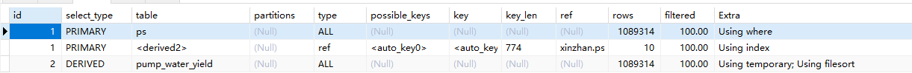
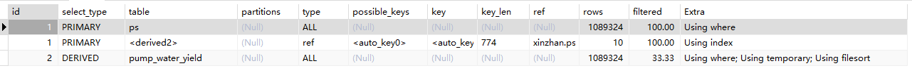
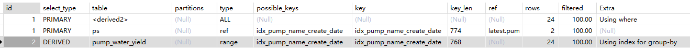
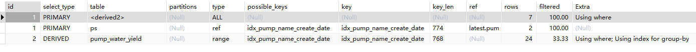

## 分组后查询最新数据的SQL优化

### 1、原来的SQL语句(4.082s)

```sql
SELECT ps.* 
FROM pump_water_yield ps
JOIN ( 
    SELECT pump_name, MAX( create_date ) AS max_create_date FROM pump_water_yield GROUP BY pump_name 
) latest ON ps.pump_name = latest.pump_name AND ps.create_date = latest.max_create_date
```




### 2、先缩小范围，再Group By(2.5s)

```sql
SELECT ps.*
FROM pump_water_yield ps
JOIN (
    SELECT pump_name, MAX(create_date) AS max_timestamp
    FROM pump_water_yield
    WHERE create_date >= DATE_SUB(NOW(), INTERVAL 60 MINUTE)
    GROUP BY pump_name
) latest ON ps.pump_name = latest.pump_name AND ps.create_date = latest.max_timestamp;
```




### 3、建立索引后

`idx_pump_name_create_date`

建立索引后:

- SQL1 -> **0.364s**
  - 
- SQL2 -> **0.365s**
  - 


### 4、开窗函数(MySQL8.0才开始支持)

```sql
SELECT
	* 
FROM
	( SELECT *, RANK() over ( PARTITION BY pump_name ORDER BY create_date DESC ) AS row_num FROM pump_water_yield ) ranked 
WHERE
	row_num = 1;
```

> 为什么数据库用的是MySQL5.7，而不是MySQL8？


### 5、拆分为两条SQL语句

```sql
select t1.*, t2.* from pumping_station t1, (select * from pump_water_yield a where a.pump_name = "瑶海东路入二十埠河排口泵站" order by create_date desc limit 1) t2 where t2.pump_name = t1.name;
```


----

## 原本的SQL

待解决的问题：

1. 云服务器MySQL版本转为8
2. 数据去重
3. 存储i

```sql
SELECT
	a.*,
	b.* 
FROM
	pump_water_yield a
	INNER JOIN pumping_station b ON a.pump_name = b.
	NAME INNER JOIN ( SELECT pump_name, MAX( create_date ) AS max_create_date FROM pump_water_yield GROUP BY pump_name ) c ON a.pump_name = c.pump_name 
	AND a.create_date = c.max_create_date 
WHERE
	a.pump_name = "瑶海东路入二十埠河排口泵站"
```


