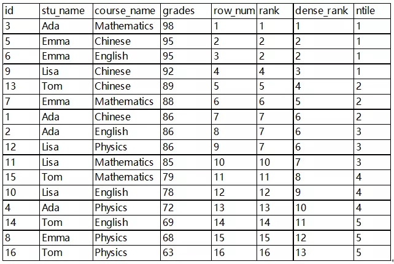
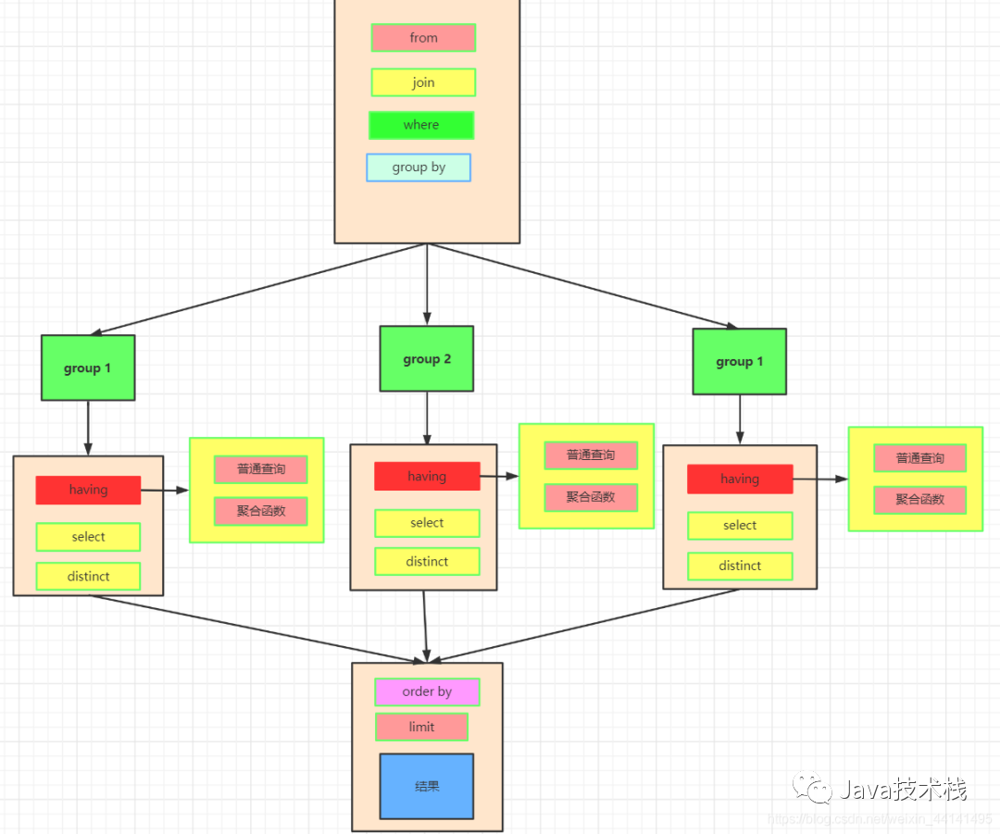

## 学生成绩表(美团)

1. 求出所有同学的平均分，并按照降序排序

   ```sql
   select name, student_num, avg(score) from score group by student_num group by avg(score);
   ```

   

2. 求出各科成绩均大于80分的同学

   ```sql
   select name from score group by student_num having MIN(score) > 80;
   ```


## 1、SQL156 各个视频的平均完播率

计算2021年里有播放记录的每个视频的完播率(结果保留三位小数)，并按完播率降序排序

**注**：视频完播率是指完成播放次数占总播放次数的比例。简单起见，结束观看时间与开始播放时间的差>=视频时长时，视为完成播放。

```sql
SELECT
	t1.video_id AS video_id,
	round(count( CASE WHEN TIME_TO_SEC( TIMEDIFF ( end_time, start_time )) >= duration THEN 1 ELSE NULL END ) / count( t1.video_id ), 3) AS avg_comp_play_rate 
FROM
	tb_user_video_log t1
	LEFT JOIN tb_video_info t2 ON t1.video_id = t2.video_id 
WHERE
	YEAR ( start_time ) = 2021 
GROUP BY
	video_id 
ORDER BY
	avg_comp_play_rate DESC
```

**总结：**

1. `order by` 后边可以用别名

2. 计算两个时间差`TIMESTAMPDIFF(second, start_time, end_time)`

3. 获取年`year(start_time)`

4. 保留几位小数`round(xxx, 小数位数)`

5. `count`中还可以写`case when .... then 1 else null end`

6. 或者可以用

   1. ```sql
      count(if (TIMESTAMPDIFF(second, start_time, end_time ) >= duration, 1, null))
      ```

   2. ```sql
      sum(if (TIMESTAMPDIFF(second, start_time, end_time ) >= duration, 1, 0))
      ```

### 时间函数总结

#### 1. 求两个时间点的差值

- `TIMESTAMPDIFF`(year/month/day/hour/minute/second, start_time, end_time)
  - 注意开始时间在前、结束时间在后。

- `DATEDIFF`(end_date, start_date)：返回值是天数差
  - `00:00:30`
- `TIME_TO_SEC`( TIMEDIFF ( end_time, start_time ))
  - `30`


#### 2.根据时间获取year、month、day、minute、second

```sql
select year("2022-12-22 14:15:16");
select month("2022-12-22 14:15:16");
select day("2022-12-22 14:15:16");
select hour("2022-12-22 14:15:16");
select minute("2022-12-22 14:15:16");
select second("2022-12-22 14:15:16");
```


### SQL条件判断

#### case when

`CASE WHEN ... THEN ... ELSE ... END`是一种条件表达式，它可以在SQL中使用。这个表达式将根据指定条件返回不同的结果。

`CASE`表达式可以在多种情况下使用，例如：

1. 根据不同的条件返回不同的值：例如，在SELECT语句中，你可以使用`CASE`表达式来根据不同的条件返回不同的值，例如：

   ```sql
   SELECT name, 
          CASE 
              WHEN age >= 18 THEN 'Adult'
              WHEN age >= 13 THEN 'Teenager'
              ELSE 'Child'
          END AS age_group
   FROM users;
   ```

   在这个示例中，如果用户的年龄大于或等于18岁，则返回"Adult"，如果年龄在13到17岁之间，则返回"Teenager"，否则返回"Child"。

2. 过滤数据：你可以使用`CASE`表达式来过滤数据。例如，在WHERE语句中，你可以使用`CASE`表达式来过滤出满足特定条件的行，例如：

   ```sql
   SELECT *
   FROM users
   WHERE CASE 
             WHEN age >= 18 THEN 'Adult'
             WHEN age >= 13 THEN 'Teenager'
             ELSE 'Child'
          END = 'Adult';
   ```

   在这个示例中，只返回年龄大于或等于18岁的用户。

使用`CASE`表达式时，需要注意以下几个方面：

1. `CASE`表达式必须以`WHEN`开始，**以`END`结束。**
2. `WHEN`子句后面必须跟一个条件表达式，例如`age >= 18`。
3. `THEN`子句后面必须跟一个结果表达式，例如`'Adult'`。
4. `ELSE`子句后面必须跟一个结果表达式，例如`'Child'`。
5. `CASE`表达式最终返回的结果类型必须相同。

#### IF判断

```
IF(condition, value_if_true, value_if_false)
```

在这个语法中，`condition`是一个布尔表达式，如果为真，则返回`value_if_true`；否则返回`value_if_false`。


## 2、SQL157 平均播放进度大于60%的视频类别

```sql
SELECT
	tag,
	concat ( avgg, '%' ) 
FROM
	(
	SELECT
		tag,
		round(
			AVG( IF (TIMESTAMPDIFF ( SECOND, start_time, end_time ) > duration, 1, TIMESTAMPDIFF ( SECOND, start_time, end_time ) / duration )) * 100,2 
		) AS avgg
	FROM
		tb_user_video_log t1
		LEFT JOIN tb_video_info t2 ON t1.video_id = t2.video_id 
	GROUP BY
		tag 
	HAVING
		avgg > 60 
	ORDER BY
	avgg DESC 
	) AS t3;
```


## 3、取出Top K数据

### 第二高的薪水

```sql
SELECT
	( SELECT DISTINCT salary FROM Employee ORDER BY salary DESC LIMIT 1, 1 ) SecondHighestSalary;
```


1. 核心问题还是返回0条记录（啥也没返回） 和 返回 null（此时null是个值，是个结果返回） 有什么区别。

```sql
将返回0条记录转换为返回null值
1. ifnull(sql语句, 1)
2. 再套一层select可以处理null值的返回情况
```


### 第N高的薪水

2. limit后只能写数，不能写表达式。limit()方法中不能参与运算，因为索引从0开始，所以要 - 1，最好在外面就设定好 set N = N - 1

```sql
CREATE FUNCTION getNthHighestSalary(N INT) RETURNS INT
BEGIN
  SET N = N - 1;
  RETURN (
      # Write your MySQL query statement below.
      select ifnull((select distinct salary from Employee order by salary desc limit N, 1), null) as getNthHighestSalary
  );
END
```


### 分数排名(同分，同排名)

1. 窗口函数

   ```sql
   select score, dense_rank() over (order by score desc) as `rank` from Scores;
   ```

2. 子关联查询

   ```sql
   select s1.score as score, count(distinct(s2.score)) as `rank` from Scores s1, Scores s2 where s1.score <= s2.score group by s1.Id order by `rank`
   ```

   

## 4、部门工资最高的员工

有员工表和部门表，


1. 版本一(三表联查)

```sql
select c.name Department, a.name Employee, a.salary Salary 
from Employee a, 
	(select departmentId id, max(salary) as salary from Employee group by departmentId) b, 
	Department c 
where 
	a.departmentId = b.id
    and a.salary = b.salary
    and a.departmentId = c.id;
```

2. 版本二(**使用in关键字**)==in关键字可以应用于多列==

```sql
select c.name Department, a.name Employee, a.salary Salary 
from 
    Employee a left join Department c on a.departmentId = c.id
where (a.departmentId, salary) in (select departmentId id, max(salary) as salary from Employee group by departmentId) 
```


## 5、部分工资前三高的所有员工(开窗函数)

```sql
select c.name Department, a.name Employee, a.salary Salary
from Employee a left join  Department c on a.departmentId = c.id
 where 3 > (select count(distinct b.salary) from Employee b where b.salary > a.salary and b.departmentId = a.departmentId);
```


```sql
select b.name Department, a.name Employee, a.salary Salary 
from (select departmentId, name, salary, dense_rank() over (partition by departmentId order by salary desc) as number from Employee) a, Department b 
where a.number <=  3 and a.departmentId = b.id;
```


## 6、体育馆的人流量(开窗函数的妙用)

简单来说，就是要**求id连续数量大于3的记录**

1. 通过`rank() over(order by id) as rk`得到新的序号
2. 通过`id - rk`进行分组，属于同一组的必定是想要的记录。

```sql
# Write your MySQL query statement below
SELECT
	id,
	visit_date,
	people 
FROM
	(
	SELECT
		id,
		visit_date,
		people,
		count(*) over ( PARTITION BY id_2 ) cnt 
	FROM
		(
		SELECT
			*,
			row_number() over ( ORDER BY id ) rk,
			id - (row_number() over ( ORDER BY id )) id_2 
		FROM
			Stadium s 
		WHERE
			s.people >= 100 
		) t1 
	) t2 
WHERE
	cnt >= 3
order by 
	visit_date;
```


## 7、最后一个能进入巴士的人(按顺序累计)

**法一：**使用开创函数

- `sum(weight) over(order by turn) rk`按照"turn"列的顺序进行累加计算"weight"列的总和，并将计算结果命名为"rk"（排名）。

```sql
select 
    person_name
from
    (
        select
            *,
            sum(weight) over(order by turn) rk
        from
            Queue
    ) t1
    where
        t1.rk <= 1000
    order by
        rk desc
    limit 1;
```


**法二：**使用普通函数

```sql
select 
    t1.person_name
FROM 
    (
        select 
                t1.person_name person_name,
                sum(t2.weight) total
        from
                Queue t1
                left join
                Queue t2
        on
                t1.turn >= t2.turn
        group by 
                t1.turn
        order by 
                total
    ) t1
where 
    t1.total <= 1000
order by 
    total desc 
limit 1;
```


# SQL基础知识

### 一、表自身连接[自己连接自己]

- ```sql
  select * from a join(select * from a) where.....;
  ```

- ```sql
  select * from Person p1, Person p2 where p1.Email = p2.Email;
  ```

### 二、SQL如何判断是否为null

- `where a is null `
- `where a is not null `

> 这个地方注意，`a != ""` 只能判断a不是一个空字符串。
>
> 1. `a = ""`：空字符串表示一个存在但为空的字符串值
> 2. `a is null`：NULL表示缺失或未知的数据

### 三、SQL去重(三种方式)

1. having ＋聚合函数

`select Email from Person group by Email having count(Email) > 1;`

2. 自链接

`select DISTINCT p1.Email from Person p1, Person p2 where p1.Email = p2.Email and p1.Id != p2.Id;`

3. 子表查询

`select Email from (select count(1) as t, Email from Person group by Email) r where r.t > 1;`

### ==四、判空(Null) | 求空值的占比==

**如何判断null**

- `只能采用IS NULL或IS NOT NULL`，而不能采用=, <, <>, !=这些操作符来判断NULL。

**求null值得占比**

- `avg(event_date is not null)`
- `avg(event_date is null)`

### 五、In查询

`in查询能查询多列。`

### 六、开窗函数(MySQL 8.0已支持开窗函数)

>  开窗函数和聚合函数的区别：

- SQL 标准允许将所有聚合函数用作开窗函数，用`OVER` 关键字区分开窗函数和聚合函数。
- 聚合函数每组只返回一个值，开窗函数每组可返回多个值。

开窗函数与聚合函数一样，也是对**行集组进行聚合计算**，但是它不像普通聚合函数那样**每组只返回一个值**，**开窗函数可以为每组返回多个值**，因为开窗函数所执行聚合计算的行集组是窗口。

#### 排序函数的区别

> - `row_number() over()`：相等的值排名不同
> - `rank() over()`：相等的值排名相同，但若有相等的值，则序号从1到n不连续
> - `dense_rank() over()`：相等的值排名相同，序号连续
> - `ntile(n) over()`：把有序的数据集合平均分配到指定数量n的桶中，将桶号分配给每一行。

在使用 row_number() over()函数时候，**over()里头**的分组以及排序的**执行，\**晚于\**** where 、group by、 order by 的**执行**。




#### 求前七天的总额和平均值


```sql

select 
visited_on,
sum_amount amount,
round(sum_amount / 7, 2) average_amount
from (
select 
    *,
    # 计算在以visited_on列排序的行集合中，每一行及其前面6天内行的sums列的总和
    sum(sums) over(order by visited_on range between interval '6' day preceding and current row) sum_amount
from (
    select 
        visited_on,
        count(1) cnt,
        sum(amount) sums
    from
        Customer
    group by
        visited_on
)t1
)t2
where
datediff(visited_on, (select min(visited_on) from Customer)) >= 6;
```


### 七、删除数据


[196. 删除重复的电子邮箱](https://leetcode.cn/problems/delete-duplicate-emails/)

删除重复电子邮箱，同一个电子邮箱只保留id最小的那一行。

> 我的写法：
>
> 1. 注意where后的第一层select语句中不能使用要删除的表(Person)，可以再嵌套一层使用。

```sql
delete from Person
where id not in (select id from  (
    select min(id) as id from Person group by email;
) a);
```

> 标准答案：
>
> 1. 遇到类似的题目，可以先写出select语句，之后改成delete

```sql
delete p1 from Person p1, Person p2 where p1.email = p2.email and p1.id > p2.id;
```


### 八、保留两位小数

`round(xxx, 2)`


### 九、SQL的一般执行顺序

- from
- where
- group by
- having
- select
- distinct
- order by
- limit



> - 先执行`from、join`来确定表之间的连接关系，得到初步的数据
> - where对数据进行普通的初步的筛选
> - group by 分组
> - 各组分别执行having中的普通筛选或者聚合函数筛选。
> - 然后把再根据我们要的数据进行select，可以是普通字段查询也可以是获取聚合函数的查询结果，如果是集合函数，select的查询结果会新增一条字段将查询结果去重distinct
> - 最后合并各组的查询结果，按照order by的 条件进行排序

### 十、Group by函数的妙用

1. group by 之后**进行不重复元素个数的查询**

```sql
select customer_id from Customer group by customer_id having count(distinct product_key) = (select count(product_key) from Product);
```

### 十一、order by可以用聚合函数、union会去重，union all不会去重

union、union all都需要列数相同，类型可以不同


### 十二、行转列用groupby+sumif，列转行用union all


### 十三、ifnull用来判断是否为null

`ifnull(xx, 2)`若为null的时候替换为2

### 十四、字符串长度函数`LENGTH`

```sql
select 
    tweet_id
from
    Tweets
where 
    LENGTH(content) > 15;
```


### 十五、字符串正则表达式

```sql
regexp
```

### 十六、分组合并字符串

```sql
select 
    sell_date,
    count(distinct product) num_sold,
    GROUP_CONCAT(distinct product ORDER BY product SEPARATOR ',') products
from
    Activities
group BY
    sell_date
```

