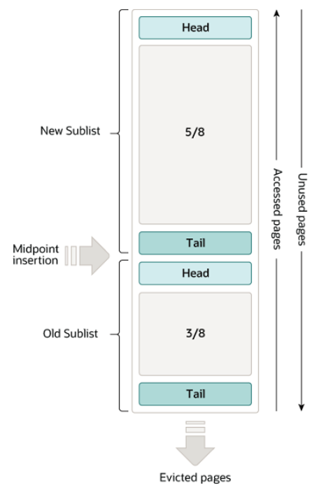

# 2021版

## 1、描述一下数据库事务隔离级别？

**ACID：**

是如何实现的：

- 原子性：`undo log`（MVCC）
- 一致性: 最核心和最本质的要求(通过原子性、持久性、隔离性来实现)
- 隔离性: 锁，mvcc（多版本并发控制）
- 持久性：`redo log`


数据库的事务隔离级别有四种，分别是**读未提交、读已提交、可重复读、序列化**，不同的隔离级别下会产生脏读、幻读、不可重复读等相关问题.

> 因此在选择隔离级别的时候要根据应用场景来决定，使用合适的隔离级别。


> 各种隔离级别和数据库异常情况对应情况如下：
>
> 脏读：当数据库中有两个及以上的事务，其中一个事务修改了数据，第二个事务直接就能读到。
>
> 幻读：当前读和快照读一起shi用的时候才会导致幻读，这时可以用间隙锁的方式解决幻读。
>
> - `for update`是当前读


| 隔离级别         | 脏读 | 不可重复读 | 幻读 |
| ---------------- | ---- | ---------- | ---- |
| READ-UNCOMMITTED | √    | √          | √    |
| READ-COMMITTED   | ×    | √          | √    |
| REPEATABLE-READ  | ×    | ×          | √    |
| SERIALIZABLE     | ×    | ×          | ×    |

SQL 标准定义了四个隔离级别：

- READ-UNCOMMITTED(读取未提交)： 事务的修改，即使没有提交，对其他事务也都是可见的。事务能够读取未提交的数据，这种情况称为脏读。
- READ-COMMITTED(读取已提交)： 事务读取已提交的数据，大多数数据库的默认隔离级别。**当一个事务在执行过程中，数据被另外一个事务修改**，造成本次事务前后读取的信息不一样，这种情况称为不可重复读。
- REPEATABLE-READ(可重复读)： 这个级别是MySQL的默认隔离级别，它解决了脏读的问题，同时也保证了同一个事务多次读取同样的记录是一致的，但这个级别还是会出现幻读的情况。幻读是指当一个事务A读取某一个范围的数据时，另一个事务B在这个范围插入行，A事务再次读取这个范围的数据时，会产生幻读
- SERIALIZABLE(可串行化)： 最高的隔离级别，完全服从ACID的隔离级别。所有的事务依次逐个执行，这样事务之间就完全不可能产生干扰，也就是说，该级别可以防止脏读、不可重复读以及幻读。
  - 性能很差，基本上就是串行执行，性能很低。
  - 串行化的读不会锁表，而是


事务隔离机制的实现基于锁机制和并发调度。其中并发调度使用的是MVVC（多版本并发控制），通过保存修改的旧版本信息来支持并发一致性读和回滚等特性。

因为隔离级别越低，事务请求的锁越少，所以大部分数据库系统的隔离级别都是READ-COMMITTED(读取提交内容):，但是你要知道的是InnoDB 存储引擎默认使用 **REPEATABLE-READ（可重读）**并不会有任何性能损失。

## 2、MVCC的实现原理

1. MVCC手段只适用于Msyql隔离级别中的读已提交（Read committed）和可重复读（Repeatable Read） 

2. Read uncimmitted由于存在脏读，即能读到未提交事务的数据行，所以不适用MVCC.  原因是MVCC的创建版本和删除版本只要在事务提交后才会产生。  
2. 串行化由于是会对所涉及到的表加锁，并非行锁，自然也就不存在行的版本控制问题。  
2. 通过以上总结，可知，MVCC主要作用于事务性的，有行锁控制的数据库模型。

## 3、mysql幻读怎么解决的

事务A按照一定条件进行数据读取，期间事务B插入了相同搜索条件的新数据，事务A再次按照原先条件进行读取时，发现了事务B新插入的数据称之为幻读。

```sql
CREATE TABLE `user` (
  `id` int(11) NOT NULL AUTO_INCREMENT,
  `name` varchar(255) DEFAULT NULL,
  `age` int(11) DEFAULT NULL,
  PRIMARY KEY (`id`)
) ENGINE=InnoDB ;

INSERT into user VALUES (1,'1',20),(5,'5',20),(15,'15',30),(20,'20',30);
```

假设有如下业务场景：

| 时间 | 事务1                                                        | 事务2                                       |
| ---- | ------------------------------------------------------------ | ------------------------------------------- |
|      | begin；                                                      |                                             |
| T1   | select * from user where age = 20;2个结果                    |                                             |
| T2   |                                                              | insert into user values(25,'25',20);commit; |
| T3   | select * from user where age =20;2个结果                     |                                             |
| T4   | update user set name='00' where age =20;此时看到影响的行数为3 |                                             |
| T5   | select * from user where age =20;三个结果                    |                                             |

执行流程如下：

1、T1时刻读取年龄为20 的数据，事务1拿到了2条记录

2、T2时刻另一个事务插入一条新的记录，年龄也是20 

3、T3时刻，事务1再次读取年龄为20的数据，发现还是2条记录，事务2插入的数据并没有影响到事务1的事务读取

4、T4时刻，事务1修改年龄为20的数据，发现结果变成了三条，修改了三条数据

5、T5时刻，事务1再次读取年龄为20的数据，发现结果有三条，第三条数据就是事务2插入的数据，此时就产生了幻读情况

此时大家需要思考一个问题，在当下场景里，为什么没有解决幻读问题？

其实通过前面的分析，大家应该知道了快照读和当前读，一般情况下select * from ....where ...是快照读，不会加锁，而 for update,lock in share mode,update,delete都属于当前读，**如果事务中都是用快照读，那么不会产生幻读的问题，但是快照读和当前读一起使用的时候就会产生幻读**。

如果都是当前读的话，如何解决幻读问题呢？

```sql
truncate table user;
INSERT into user VALUES (1,'1',20),(5,'5',20),(15,'15',30),(20,'20',30);
```

| 时间 | 事务1                                        | 事务2                                                |
| ---- | -------------------------------------------- | ---------------------------------------------------- |
|      | begin;                                       |                                                      |
| T1   | select * from user where age =20 for update; |                                                      |
| T2   |                                              | insert into user values(25,'25',20);此时会阻塞等待锁 |
| T3   | select * from user where age =20 for update; |                                                      |

此时，可以看到事务2被阻塞了，需要等待事务1提交事务之后才能完成，其实本质上来说采用的是间隙锁的机制解决幻读问题。

## 4、sql join原理?

> 阿里规约：尽量不要使用join连接三张及以上的表

MySQL是只支持一种Join算法Nested-Loop Join(嵌套循环连接)，并不支持哈希连接和合并连接，不过在mysql中包含了多种变种，能够帮助MySQL提高join执行的效率。

**4.1、Simple Nested-Loop Join**

这个算法相对来说就是很简单了，从驱动表中取出R1匹配S表所有列，然后R2，R3,直到将R表中的所有数据匹配完，然后合并数据，可以看到这种算法要对S表进行RN次访问，虽然简单，但是相对来说开销还是太大了。

**2、Index Nested-Loop Join（推荐）**

索引嵌套联系由于非驱动表上有索引，所以比较的时候不再需要一条条记录进行比较，而可以通过索引来减少比较，从而加速查询。`这也就是平时我们在做关联查询的时候必须要求关联字段有索引的一个主要原因`。

这种算法在链接查询的时候，驱动表会根据关联字段的索引进行查找，当在索引上找到了符合的值，再回表进行查询，也就是只有当匹配到索引以后才会进行回表。至于驱动表的选择，MySQL优化器一般情况下是会选择记录数少的作为驱动表，但是当SQL特别复杂的时候不排除会出现错误选择。

在索引嵌套链接的方式下，如果非驱动表的关联键是主键的话，这样来说性能就会非常的高，如果不是主键的话，关联起来如果返回的行数很多的话，效率就会特别的低，因为要多次的回表操作。先关联索引，然后根据二级索引的主键ID进行回表的操作。这样来说的话性能相对就会很差。

**3、Block Nested-Loop Join**

在有索引的情况下，MySQL会尝试去使用Index Nested-Loop Join算法，在有些情况下，可能Join的列就是没有索引，那么这时MySQL的选择绝对不会是最先介绍的Simple Nested-Loop Join算法，而是会优先使用Block Nested-Loop Join的算法。

Block Nested-Loop Join对比Simple Nested-Loop Join多了一个中间处理的过程，也就是join buffer，使用join buffer将驱动表的查询JOIN相关列都给缓冲到了JOIN BUFFER当中，然后批量与非驱动表进行比较，这也来实现的话，`可以将多次比较合并到一次，降低了非驱动表的访问频率`。也就是只需要访问一次S表。这样来说的话，就不会出现多次访问非驱动表的情况了，也只有这种情况下才会访问join buffer。

在MySQL当中，我们可以通过参数join_buffer_size来设置join buffer的值，然后再进行操作。默认情况下`join_buffer_size=256K`，在查找的时候MySQL会将所有的需要的列缓存到join buffer当中，包括select的列，而不是仅仅只缓存关联列。在一个有N个JOIN关联的SQL当中会在执行时候分配N-1个join buffer。


## 5、说明一下数据库索引原理、底层索引数据结构，叶子节点存储的是什么，索引失效的情况？

**索引的实现原理：**

1. 数据基本上都是存放在磁盘上的，所以就设计到了IO读取问题，那么就要想读取次数少、量少。
   1. 局部性原理
2.  

**索引失效的情况：**

1. 组合索引不遵循最左匹配原则

2. 组合索引的前面索引列使用范围查询(<,>,like),会导致后续的索引失效
   1. `>=`、`<=`不会导致。

3. 不要在索引上做任何操作（计算，函数，类型转换）
   1. `where age = 3 - 1`不会
   2. `where 2*age = 4`会

4. is null和is not null无法使用索引

5. 尽量少使用or操作符，否则连接时索引会失效

6. `字符串不添加引号会导致索引失效(隐式转换)`

7. 两表关联使用的条件字段中字段的长度、编码不一致会导致索引失效

8. like语句中，以%开头的模糊查询

9. `如果mysql中使用全表扫描比使用索引快，也会导致索引失效`

## 6、mysql如何做分库分表的？

- MMM
  - master matser 
- MHA
- MGR


使用mycat或者shardingsphere中间件做分库分表，选择合适的中间件，水平分库，水平分表，垂直分库，垂直分表

在进行分库分表的时候要尽量遵循以下原则：

1、能不切分尽量不要切分；

2、如果要切分一定要选择合适的切分规则，提前规划好；

3、数据切分尽量通过数据冗余或表分组来降低跨库 Join 的可能；

4、由于数据库中间件对数据 Join 实现的优劣难以把握，而且实现高性能难度极大，业务读取尽量少使用多表 Join。

## 7、数据存储引擎有哪些？

​		大家可以通过show engines的方式查看对应的数据库支持的存储引擎。

## 8、描述一下InnoDB和MyISAM的区别？

| 区别     | Innodb                         | MyISAM           |
| -------- | ------------------------------ | ---------------- |
| 事务     | 支持                           | 不支持           |
| 外键     | 支持                           | 不支持           |
| 索引     | 即支持聚簇索引又支持非聚簇索引 | 只支持非聚簇索引 |
| 行锁     | 支持                           | 不支持           |
| 表锁     | 支持                           | 支持             |
| 存储文件 | frm，ibd                       | frm,myi,myd      |
| 具体行数 | 每次必须要全表扫描统计行数     | 通过变量保存行数 |

如何选择？

​		1、是否需要支持事务，如果需要选择innodb，如果不需要选择myisam

​		2、如果表的大部分请求都是读请求，可以考虑myisam，如果既有读也有写，使用innodb

​		现在mysql的默认存储引擎已经变成了Innodb,推荐使用innodb

## 9、描述一下聚簇索引和非聚簇索引的区别？

innodb存储引擎在进行数据插入的时候必须要绑定到一个索引列上，默认是主键，如果没有主键，会选择唯一键，如果没有唯一键，那么会选择生成6字节的rowid，跟数据绑定在一起的索引我们称之为聚簇索引，没有跟数据绑定在一起的索引我们称之为非聚簇索引。

innodb存储引擎中既有聚簇索引也有费聚簇索引，而myisam存储引擎中只有非聚簇索引。

## 10、事务有哪些隔离级别，分别解决了什么问题？

​		参考问题1

## 11、描述一下mysql主从复制的机制的原理？mysql主从复制主要有几种模式？

​		参考mysql主从复制原理文档

## 12、如何优化sql，查询计划的结果中看哪些些关键数据？

参考执行计划文档


## 13、MySQL为什么选择B+树作为它的存储结构，为什么不选择Hash、二叉、红黑树？

​		参考问题5

## 14、描述一下mysql的乐观锁和悲观锁，锁的种类？

`乐观锁并不是数据库自带的`，如果需要使用乐观锁，那么需要自己去实现，一般情况下，我们会在表中新增一个version字段，每次更新数据version+1,在进行提交之前会判断version是否一致。

mysql中的绝大部分锁都是悲观锁，

- 从对数据操作的粒度分，分为表锁和行锁(innodb才有)

  - 表锁：每次操作锁住整张表。开销小(直接锁，行锁还需要找到对应的行)，加锁快；不会出现死锁；锁定粒度大，发生锁冲突的概率最高，并发度最低；一般用在整表数据迁移的场景。

    ```sql
    1. 手动增加表锁：lock table xxx read(write)
    2. 查看表上加过的锁：show open tables;
    3. 释放表锁：unlock tables;
    ```

  - 行锁：每次操作锁住一行数据。开销大，加锁慢；`会出现死锁；`锁定粒度最小，发生锁冲突的概率最低，**并发度最高**。

    - 一个session开启事务更新不提交，另一个session更新同一条记录会阻塞，更新不同记录不会阻塞

    - InnoDB在执行查询语句SELECT时(非串行隔离级别)，不会加锁。**但是update、insert、delete操作会加行锁。**

      简而言之，就是**读锁会阻塞写，但是不会阻塞读。而写锁则会把读和写都阻塞**。

    

- 从对数据库操作的类型分，分为读锁和写锁(都属于悲观锁)，还有意向锁

**读锁**（共享锁，S锁(**S**hared)）：针对同一份数据，多个读操作可以同时进行而不会互相影响，比如：*select \* from T where id=1* lock in share mode

**写锁**（排它锁，X锁(e**X**clusive)）：当前写操作没有完成前，它会阻断其他写锁和读锁，数据修改操作都会加写锁，查询也可以通过for update加写锁，比如：*select \* from T where id=1* for update

**意向锁**（Intention Lock）：又称I锁，针对表锁，主要是为了提高加表锁的效率，是mysql数据库自己加的。当有事务给表的数据行加了共享锁或排他锁，同时会给表设置一个标识，代表已经有行锁了，其他事务要想对表加表锁时，就不必逐行判断有没有行锁可能跟表锁冲突了，直接读这个标识就可以确定自己该不该加表锁。特别是表中的记录很多时，逐行判断加表锁的方式效率很低。而这个标识就是意向锁。

意向锁主要分为：

- 意向共享锁，IS锁，对整个表加共享锁之前，需要先获取到意向共享锁。

- 意向排他锁，IX锁，对整个表加排他锁之前，需要先获取到意向排他锁。


```sql
# myisam引擎 只支持表锁
1. 加锁语句：lock table tablename
2. 解锁语句：unlock table 
```


**行锁：**

- 共享锁：当读取一行记录的时候，为了防止别人修改，则需要添加S锁
- 排它锁：当修改一行记录的时候，为了防止别人同时进行修改，则需要添加X锁

|      |   X    |   S    |
| :--: | :----: | :----: |
|  X   | 不兼容 | 不兼容 |
|  S   | 不兼容 |  兼容  |

按照排他锁中锁的范围：

- 记录锁：添加在行索引上的锁

- 间隙锁：锁定范围是索引记录之间的间隙，针对可重复读以上隔离级别

- 临键锁：记录锁+间隙锁

**表锁：**

- 意向锁：在获取某行的锁之前，**必须要获取表的锁**，分为意向共享锁，意向排它锁

- 自增锁：对自增字段所采用的特殊表级锁


锁模式的含义：

- IX：意向排它锁

- X：锁定记录本身和记录之前的间隙

- S：锁定记录本身和记录之前的间隙

- X,REC_NOT_GAP：只锁定记录本身

- S，REC_NOT_GAP：只锁定记录本身

- X，GAP：间隙锁，不锁定记录本身

- S，GAP：间隙锁，不锁定记录本身

- X，GAP,INSERT_INTENTION：插入意向锁

## 15、mysql原子性和持久性是怎么保证的？

原子性通过undolog来实现，持久性通过redo log来实现


## 16、MySQL三大日志

- **undo log（回滚日志）**：是`Innodb`存储引擎层生成的日志，实现了事务中的**原子性**，主要**用于`事务回滚和 MVCC`**。
- **redo log（重做日志）**：是 `Innodb `存储引擎层生成的日志，实现了事务中的**持久性**，主要**`用于掉电等故障恢复`**；
- **binlog （归档日志）**：是 `Server 层`生成的日志，主要**`用于数据备份和主从复制`**；

### 1、binlog(归档日志)

MySQL Server 层也有一个日志文件，叫做 binlog，它可以被所有的存储引擎使用。

```
bin log 以事件的形式记录了所有的 DDL 和 DML 语句（因为它记录的是操作而不是数据值，属于逻辑日志），可以用来做主从复制和数据恢复。

凌晨1点钟全量备份   程序员  1点---9点钟      10点钟    数据文件全部删掉了   恢复1点钟   恢复到9点钟   
```


数据恢复：区别于Redo Log的崩溃恢复，数据恢复是基于业务数据的，比如删库跑路，而崩溃恢复是断电重启的

### 2、Unlog log(回滚日志)

> 考虑一个问题，就是在一个事务执行过程中，在还没有提交事务之前，如果MySQL发生了崩溃，要怎么回滚到事务之前的数据那？

**undo log（回滚日志），它保证了事务的ACID 特性中的原子性（Atomicity）**

undo log 是一种用于撤销回退的日志。在事务没提交之前，MySQL 会先记录更新前的数据到 undo log 日志文件里面，当事务回滚时，可以利用 undo log 来进行回滚。

每当 InnoDB 引擎对一条记录进行操作（修改、删除、新增）时，要把回滚时需要的信息都记录到 undo log 里，比如：

- 在**插入**一条记录时，要把这条记录的主键值记下来，这样之后回滚时只需要把这个主键值对应的记录**删掉**就好了；
- 在**删除**一条记录时，要把这条记录中的内容都记下来，这样之后回滚时再把由这些内容组成的记录**插入**到表中就好了；
- 在**更新**一条记录时，要把被更新的列的旧值记下来，这样之后回滚时再把这些列**更新为旧值**就好了。

在发生回滚时，就读取 undo log 里的数据，然后做原先相反操作。


一条记录的每一次更新操作产生的 undo log 格式都有一个 roll_pointer 指针和一个 trx_id 事务id：

- 通过 trx_id 可以知道该记录是被哪个事务修改的；
- 通过 roll_pointer 指针可以将这些 undo log 串成一个链表，这个链表就被称为版本链；


另外，==**undo log 还有一个作用，通过 ReadView + undo log 实现 MVCC（多版本并发控制）**。==

> 对于「读提交RC」和「可重复读RR」隔离级别的事务来说，它们的快照读（普通 select 语句）是通过 Read View + undo log 来实现的，它们的区别在于创建 Read View 的时机不同：
>
> - 「读提交RC」隔离级别是`在每个 select 都会生成一个新的 Read View`，也意味着，事务期间的多次读取同一条数据，前后两次读的数据可能会出现不一致，因为可能这期间另外一个事务修改了该记录，并提交了事务。
> - 「可重复读RR」隔离级别是`启动事务时生成一个 Read View`，然后整个事务期间都在用这个 Read View，这样就保证了在事务期间读到的数据都是事务启动前的记录。
>
> 这两个隔离级别实现是通过「事务的 Read View 里的字段」和「记录中的两个隐藏列（trx_id 和 roll_pointer）」的比对，如果不满足可见行，就会顺着 undo log 
>
> 版本链里找到满足其可见性的记录，从而控制并发事务访问同一个记录时的行为，这就叫 MVCC（多版本并发控制）。

#### 总结

因此，undo log 两大作用：

- **实现事务回滚，保障事务的原子性**。事务处理过程中，如果出现了错误或者用户执行了 ROLLBACK 语句，MySQL 可以利用 undo log 中的历史数据将数据恢复到事务开始之前的状态。
- **实现 MVCC（多版本并发控制）关键因素之一**。MVCC 是通过 ReadView + undo log 实现的。undo log 为每条记录保存多份历史数据，MySQL 在执行快照读（普通 select 语句）的时候，会根据事务的 Read View 里的信息，顺着 undo log 的版本链找到满足其可见性的记录。


> **TIP**
>
> 很多人疑问 undo log 是如何刷盘（持久化到磁盘）的？
>
> undo log 和数据页的刷盘策略是一样的，都需要通过 redo log 保证持久化。
>
> buffer pool 中有 undo 页，对 undo 页的修改也都会记录到 redo log。redo log 会每秒刷盘，提交事务时也会刷盘，数据页和 undo 页都是靠这个机制保证持久化的。

### 3、Redo log(重做日志)

#### 原因

在Innodb存储引擎中，使用了Buffer pool暂存update的数据，但是内存总是不可靠，万一断电重启，那内存中的数据未持久化就丢失了。为了防止断电导致数据丢失的问题，当有一条记录需要更新的时候，

1. innodb引擎就会先更新内存

2. 同时将该页标记为脏页

3. 然后将本次对这个页的修改以`redo log`的形式记录下来。
4. 后续，innodb引擎会在适当的时候，由后台线程将缓存在`Buffer pool`的脏页刷新到磁盘里，这就是`WAL(write-Ahead Logging)技术`。

> **WAL(write-Ahead Logging)技术：指的是， MySQL 的写操作并不是立刻写到磁盘上，而是`先写日志，然后在合适的时间再写到磁盘上`**。

#### 图解


#### 什么是redo log日志？

`redo log`是物理日志，记录了对某个数据页的修改。。

在事务提交之前，只要先将redo log持久化到磁盘即可，可以不需要等到将缓存在Buffer Pool里的脏页数据持久化到磁盘。

当系统崩溃时，虽然脏页数据没有持久化，但是redo log已经持久化，这样当MySQL重启的时候，可以根据redo log的内容，将所有数据恢复到最新的状态。

> 被修改 Undo 页面，需要记录对应 redo log 吗？

需要的。

开启事务之后，innodb层面更新记录前，首先要记录相应的undo log，如果是更新操作，需要把被更新的列的旧值记下来，也就是要生成一条undo log，undo log会写入Buffer pool中的undo层面。

不过，`在内存修改该Undo页面后，需要记录对应的redo log`。

> redo log 和 undo log 区别在哪？

这两种日志是属于 InnoDB 存储引擎的日志，它们的区别在于：

- redo log 记录了此次事务「**完成后**」的数据状态，记录的是更新**之后**的值；
- undo log 记录了此次事务「**开始前**」的数据状态，记录的是更新**之前**的值；

事务提交之前发生了崩溃，重启后会通过 undo log 回滚事务，事务提交之后发生了崩溃，重启后会通过 redo log 恢复事务，如下图：


所以有了 redo log，再通过 WAL 技术，InnoDB 就可以保证即使数据库发生异常重启，之前已提交的记录都不会丢失，这个能力称为 **crash-safe**（崩溃恢复）。可以看出来， **redo log 保证了事务四大特性中的持久性**。

> redo log 要写到磁盘，数据也要写磁盘，为什么要多此一举？

写入 redo log 的方式使用了追加操作， 所以磁盘操作是**顺序写**，而写入数据需要先找到写入位置，然后才写到磁盘，所以磁盘操作是**随机写**。

磁盘的「顺序写 」比「随机写」 高效的多，因此 redo log 写入磁盘的开销更小。

针对「顺序写」为什么比「随机写」更快这个问题，可以比喻为你有一个本子，按照顺序一页一页写肯定比写一个字都要找到对应页写快得多。

可以说这是 WAL 技术的另外一个优点：**MySQL 的写操作从磁盘的「随机写」变成了「顺序写」**，提升语句的执行性能。这是因为 MySQL 的写操作并不是立刻更新到磁盘上，而是先记录在日志上，然后在合适的时间再更新到磁盘上 。

至此， 针对为什么需要 redo log 这个问题我们有两个答案：

- **实现事务的持久性，让 MySQL 有 crash-safe 的能力**，能够保证 MySQL 在任何时间段突然崩溃，重启后之前已提交的记录都不会丢失；
- **将写操作从「随机写」变成了「顺序写」**，提升 MySQL 写入磁盘的性能。

> 产生的 redo log 是直接写入磁盘的吗？

不是的。

实际上， 执行一个事务的过程中，产生的 redo log 也不是直接写入磁盘的，因为这样会产生大量的 I/O 操作，而且磁盘的运行速度远慢于内存。

所以，redo log 也有自己的缓存—— **redo log buffer**，每当产生一条 redo log 时，会先写入到 redo log buffer，后续在持久化到磁盘如下图：


redo log buffer 默认大小 16 MB，可以通过 `innodb_log_Buffer_size` 参数动态的调整大小，增大它的大小可以让 MySQL 处理「大事务」是不必写入磁盘，进而提升写 IO 性能。

#### redo log 什么时候刷盘？

缓存在 redo log buffer 里的 redo log 还是在内存中，它什么时候刷新到磁盘？

主要有下面几个时机：

- MySQL 正常关闭时；
- 当 redo log buffer 中记录的写入量大于 redo log buffer 内存空间的一半时，会触发落盘；
- InnoDB 的后台线程每隔 1 秒，将 redo log buffer 持久化到磁盘。
- 每次事务提交时都将缓存在 redo log buffer 里的 redo log 直接持久化到磁盘（这个策略可由 innodb_flush_log_at_trx_commit 参数控制，下面会说）。


> innodb_flush_log_at_trx_commit 参数控制的是什么？

单独执行一个更新语句的时候，InnoDB 引擎会自己启动一个事务，在执行更新语句的过程中，生成的 redo log 先写入到 redo log buffer 中，然后等事务提交的时候，再将缓存在 redo log buffer 中的 redo log 按组的方式「顺序写」到磁盘。

上面这种 redo log 刷盘时机是在事务提交的时候，这个默认的行为。

除此之外，InnoDB 还提供了另外两种策略，由参数 `innodb_flush_log_at_trx_commit` 参数控制，可取的值有：0、1、2，默认值为 1，这三个值分别代表的策略如下：

- 当设置该**参数为 0 时**，表示每次事务提交时 ，还是**将 redo log 留在 redo log buffer 中** ，该模式下在事务提交时不会主动触发写入磁盘的操作。
- 当设置该**参数为 1 时**，表示每次事务提交时，都**将缓存在 redo log buffer 里的 redo log 直接持久化到磁盘**，这样可以保证 MySQL 异常重启之后数据不会丢失。
- 当设置该**参数为 2 时**，表示每次事务提交时，都只是缓存在 redo log buffer 里的 redo log **写到 redo log 文件，注意写入到「 redo log 文件」并不意味着写入到了磁盘**，因为操作系统的文件系统中有个 Page Cache（如果你想了解 Page Cache，可以看[这篇 (opens new window)](https://xiaolincoding.com/os/6_file_system/pagecache.html)），Page Cache 是专门用来缓存文件数据的，所以写入「 redo log文件」意味着写入到了操作系统的文件缓存。

我画了一个图，方便大家理解：


> innodb_flush_log_at_trx_commit 为 0 和 2 的时候，什么时候才将 redo log 写入磁盘？

InnoDB 的后台线程每隔 1 秒：

- 针对参数 0 ：会把缓存在 redo log buffer 中的 redo log ，通过调用 `write()` 写到操作系统的 Page Cache，然后调用 `fsync()` 持久化到磁盘。**所以参数为 0 的策略，MySQL 进程的崩溃会导致上一秒钟所有事务数据的丢失**;
- 针对参数 2 ：调用 fsync，将缓存在操作系统中 Page Cache 里的 redo log 持久化到磁盘。**所以参数为 2 的策略，较取值为 0 情况下更安全，因为 MySQL 进程的崩溃并不会丢失数据，只有在操作系统崩溃或者系统断电的情况下，上一秒钟所有事务数据才可能丢失**。

加入了后台现线程后，innodb_flush_log_at_trx_commit 的刷盘时机如下图：


> 这三个参数的应用场景是什么？

这三个参数的数据安全性和写入性能的比较如下：

- 数据安全性：参数 1 > 参数 2 > 参数 0
- 写入性能：参数 0 > 参数 2> 参数 1

所以，数据安全性和写入性能是熊掌不可得兼的，**要不追求数据安全性，牺牲性能；要不追求性能，牺牲数据安全性**。

- 在一些对数据安全性要求比较高的场景中，显然 `innodb_flush_log_at_trx_commit` 参数需要设置为 1。
- 在一些可以容忍数据库崩溃时丢失 1s 数据的场景中，我们可以将该值设置为 0，这样可以明显地减少日志同步到磁盘的 I/O 操作。
- 安全性和性能折中的方案就是参数 2，虽然参数 2 没有参数 0 的性能高，但是数据安全性方面比参数 0 强，因为参数 2 只要操作系统不宕机，即使数据库崩溃了，也不会丢失数据，同时性能方便比参数 1 高。

#### redo log 文件写满了怎么办？


## **什么是预读？**

磁盘读写，并不是按需读取，而是按页读取，一次至少读一页数据（一般是4K）但是Mysql的数据页是16K，如果未来要读取的数据就在页中，就能够省去后续的磁盘IO，提高效率。


## 什么是Buffer  Pool？   性能优化的一个点

> - Query Cache是Server自带的
> - Buffer pool是innodb自带的

Innodb 存储引擎设计了一个**缓冲池（Buffer Pool）**，来`提高数据库的读写性能`(避免每次访问都进行磁盘IO，起到加速访问的作用)。

- 当读取数据的时候，若数据存在buffer pool中，客户端就会来直接读取buffer pool中的数据，否则再去磁盘中读取。
- 当修改数据时，若数据存在于buffer pool中，那直接修改 Buffer Pool 中数据所在的页，然后将其页设置为`脏页`（该页的内存数据和磁盘上的数据已经不一致），为了减少磁盘I/O，不会立即将脏页写入磁盘，**后续由后台线程选择一个合适的时机将脏页写入到磁盘。**

### Buffer Pool 缓存什么？

InnoDB 会把存储的数据划分为若干个「页」，**以页作为磁盘和内存交互的基本单位**，一个页的默认大小为 16KB。因此，Buffer Pool 同样需要按「页」来划分。

在 MySQL 启动的时候，**InnoDB 会为 Buffer Pool 申请一片连续的内存空间，然后按照默认的`16KB`的大小划分出一个个的页， Buffer Pool 中的页就叫做缓存页**。此时这些缓存页都是空闲的，之后随着程序的运行，才会有磁盘上的页被缓存到 Buffer Pool 中。

所以，MySQL 刚启动的时候，你会观察到`使用的虚拟内存空间很大，而使用到的物理内存空间却很小`，这是因为只有这些虚拟内存被访问后，操作系统才会触发缺页中断，申请物理内存，接着将虚拟地址和物理地址建立映射关系。

Buffer Pool 除了缓存「索引页」和「数据页」，还包括了 Undo 页，插入缓存、自适应哈希索引、锁信息等等。


> Undo 页是记录什么？

开启事务后，InnoDB 层更新记录前，首先要记录相应的 undo log，如果是更新操作，需要把被更新的列的旧值记下来，也就是要生成一条 undo log，undo log 会写入 Buffer Pool 中的 Undo 页面。

> 查询一条记录，就只需要缓冲一条记录吗？

不是的。

- 当我们查询一条记录时，InnoDB 是会把整个页的数据加载到 Buffer Pool 中，将页加载到 Buffer Pool 后，再通过页里的「页目录」去定位到某条具体的记录。
- 这一点其实也用到了时间局部性和空间局部性原理

## Buffer Pool的内存淘汰策略

简单的 LRU 算法并没有被 MySQL 使用，因为简单的 LRU 算法无法避免下面这两个问题：

- 预读失效；
- Buffer Pool 污染；


冷热分区的LRU策略

LRU链表会被拆分成为两部分，一部分为热数据，一部分为冷数据。冷数据占比 3/8，热数据5/8。



**数据页第一次加载进来，放在LRU链表的什么地方？**

放在冷数据区域的头部

**冷数据区域的缓存页什么时候放入热数据区域？**

MySQL设定了一个规则，在 innodb_old_blocks_time 参数中，默认值为1000，也就是1000毫秒。

意味着，只有把数据页加载进缓存里，在经过1s之后再次对此缓存页进行访问才会将缓存页放到LRU链表热数据区域的头部。

**为什么是1秒？**

因为通过预读机制和全表扫描加载进来的数据页通常是1秒内就加载了很多，然后对他们访问一下，这些都是1秒内完成，他们会存放在冷数据区域等待刷盘清空，基本上不太会有机会放入到热数据区域，除非在1秒后还有人访问，说明后续可能还会有人访问，才会放入热数据区域的头部。

## Redo Log跟Buffer Pool的关系

崩溃恢复  基本保障   系统自动做的

> InnoDB 引入了一个日志文件，叫做 redo log（重做日志），我们把所有对内存数据的修改操作写入日志文件，如果服务器出问题了，我们就从这个日志文件里面读取数据，恢复数据——用它来实现事务的持久性。
>
> redo log 有什么特点？
>
> 1.记录修改后的值，属于物理日志
>
> 2.**redo log 的大小是固定的，前面的内容会被覆盖，所以不能用于数据回滚/数据恢复。**
>
> 3.redo log 是 InnoDB 存储引擎实现的，并不是所有存储引擎都有。


## 3. Mysql的体系结构是什么样子的（一条查询语句它到底是怎么执行的？）

总体来说，大概分四个步骤：

1. 连接器

   1. 经过TCP三次握手建立连接，通过连接器验证用户名和密码是否正确。
      1. 若这一步不正确，就收到一个"Access denied for user"的错误，然后客户端程序结束执行。
   2. 如果用户名密码没有问题，就会将当前用户的权限保存起来，在当前连接内后续其他操作用到权限时，就直接取出来。
      1. 即使管理员中途修改了该用户的权限，也不会影响已经存在连接的权限。修改完成后，只有再新建的连接才会使用新的权限设置。
   3. 空闲连接的最大空闲时长是8小时，超过之后，连接器就会主动断开。

2. 查询缓存(server层的)

   1. 建立连接之后，客户端可以向数据库发送SQL语句了
   2. MySQL服务默认会先解析第一个字段，判断他是什么类型的语句。
      1. 如果是查询语句(select语句)，MySQL就会先去查询缓存(`Query Cache`)中查找缓存数据，看之前是否执行过一摸一样的命令，这个缓存是以`key-value`的形式保存在内存中的，key为SQL语句，value为SQL查询的结果。
   3. `MySQL 8.0 版本直接将查询缓存删掉了`，也就是说 MySQL 8.0 开始，执行一条 SQL 查询语句，不会再走到查询缓存这个阶段了。

3. 解析SQL

   1. 通过词法分析将SQL语句分成一个个Token
   2. 通过语法分析对SQL语句进行核验，看是否满足SQL语法
      1. 
   3. 如果没有问题，就会构建出SQL语法树，方便后面拿到SQL类型、表明、字段名、where条件等等

4. 执行SQL

   经过解析器后，接着就要进入执行 SQL 查询语句的流程了，每条`SELECT` 查询语句流程主要可以分为下面这三个阶段：

   - prepare 阶段，也就是预处理阶段；
     - 可以验证表名或字段名是否存在，或者否正确。
     - 它会检查生成的解析树，解决解析器无法解析的语义。比如，它会检查表和列名是否存在，检查名字和别名，保证没有歧义。
   - optimize 阶段，也就是优化阶段；
     - 由优化器负责`将SQL查询语句的执行方案`确定下来
     - 通过`explain`可以看到SQL语句的执行计划
   - execute 阶段，也就是执行阶段；


## 4.一条更新语句要经历那些流程

1. 首先客户端和mysql服务端通过连接器建立起连接，验证权限等
   1. 因为这是一条update语句，所以不需要经过查询缓存，但是表上由更新语句，是会把整个表的查询缓存清空的，所以说查询缓存很鸡肋，在MySQL8.0就移除了这个功能。

2. 通过解析器对sql语句进行词法分析和语法分析，进一步来说，将sql语句分成一个个token，建立起AST(抽象语法树)，之后验证sql语句语法是否符合规范。
3. 通过预处理器会判断表明和字段是否存在
4. 通过优化器，按照成本计算出最优的查询规则。
5. 执行器负责具体执行，找到这一行之后，然后开始更新。


## 5.为什么Mysql要使用B+树做为索引

1. B+树能显著减少IO次数，提高效率
   1. `由于中间节点不存指针，同样大小的磁盘页可以容纳更多的节点元素，树的高度就小`。
   2. （数据量相同的情况下，B+树比B树更加“矮胖”），查找起来就更快。

2. B+树查找效率更稳定。
   1. B+树每次查找都必须到叶子节点才能获取数据，而B树不一定，B树可以在非叶子节点上获取数据。

3. B+树方便范围查询和全表查询。
   1. B+树的每一个叶子节点都有指向下一个叶子节点的指针，方便范围查询和全表查询：只需要从第一个叶子节点开始顺着指针一直扫描下去即可，而B树则要对树做中序遍历。


## 6.磁盘的顺序读以及随机读有什么区别？（这个在面大厂的时候有可能会让你聊，问法有很多种）


1.盘片

2.磁头

3.主轴

4.集成电路板

磁盘是如何完成单次IO的

单次的IO时间 =   寻道时间 + 旋转延迟 + 传送时间

## 7.**索引使用原则（索引怎么使用才合理）**

```
我们容易有一个误区，就是在经常使用的查询条件上都建立索引，索引越多越好，那到底是不是这样呢？ 
```

#### **列的离散（sàn）度**

第一个叫做列的离散度，我们先来看一下列的离散度的公式：

不同值得数量：总行数 越接近1 那么离散度越高，越接近0，离散度越低

```
count(distinct(column_name)) : count(*)，列的全部不同值和所有数据行的比例。数据行数相同的情况下，分子越大，列的离散度就越高。
```

#### **联合索引最左匹配**

前面我们说的都是针对单列创建的索引，但有的时候我们的多条件查询的时候，也会建立联合索引，举例：查询成绩的时候必须同时输入身份证和考号。

联合索引在 B+Tree 中是复合的数据结构，它是按照从左到右的顺序来建立搜索树的（name 在左边，phone 在右边）。

从这张图可以看出来，name 是有序的，phone 是无序的。当 name 相等的时候，phone 才是有序的。

这个时候我们使用 where name= 'jim' and phone = '136xx '去查询数据的时候，B+Tree 会优先比较 name 来确定下一步应该搜索的方向，往左还是往右。如果 name相同的时候再比较 phone。但是如果查询条件没有 name，就不知道第一步应该查哪个节点，因为建立搜索树的时候 name 是第一个比较因子，所以用不到索引。

#### **如何创建联合索引**

有一天我们的 DBA 找到我，说我们的项目里面有两个查询很慢，按照我们的想法，一个查询创建一个索引，所以我们针对这两条 SQL 创建了两个索引，这种做法觉得正确吗？

```
CREATE INDEX idx_name on user_innodb(name); 
CREATE INDEX idx_name_phone on user_innodb(name,phone);
```

当我们创建一个联合索引的时候，按照最左匹配原则，用左边的字段 name 去查询的时候，也能用到索引，所以第一个索引完全没必要。

相当于建立了两个联合索引(name),(name,phone)。

```
如果我们创建三个字段的索引 index(a,b,c)，相当于创建三个索引：

index(a) 

index(a,b) 

index(a,b,c) 

用 where b=? 和 where b=? and c=? 是不能使用到索引的。

这里就是 MySQL 里面联合索引的最左匹配原则。 
```

#### **覆盖索引与回表**

什么叫回表：   不需要回表  叫覆盖索引

聚集索引 ：id

二级索引  ：name


非主键索引，我们先通过索引找到主键索引的键值，再通过主键值查出索引里面没

有的数据，它比基于主键索引的查询多扫描了一棵索引树，这个过程就叫回表。

在辅助索引里面，不管是单列索引还是联合索引，如果 select 的数据列只用从索引中就能够取得，不必从数据区中读取，这时候使用的索引就叫做覆盖索引，这样就避免了回表。

Extra 里面值为“Using index”代表使用了覆盖索引。

## **8.** **索引的创建与使用**

因为索引对于改善查询性能的作用是巨大的，所以我们的目标是尽量使用索引。

#### **在什么字段上索引？**

1、在用于 where 判断 order 排序和 join 的（on）字段上创建索引

2、索引的个数不要过多。

——浪费空间，更新变慢。

3、区分度低的字段，例如性别，不要建索引。

——离散度太低，导致扫描行数过多。

4、频繁更新的值，不要作为主键或者索引。

——页分裂

5、随机无序的值，不建议作为主键索引，例如身份证、UUID。

——无序，分裂

6、创建复合索引，而不是修改单列索引

#### **什么时候索引失效？**

1、索引列上使用函数（replace\SUBSTR\CONCAT\sum count avg）、表达式

2、字符串不加引号，出现隐式转换

3、like 条件中前面带%         

4、负向查询   NOT LIKE 不能   

## Hash索引


**## MyiSAM与Innodb**

myi     index

myd     data


我们表内的数据是按照聚集索引的顺序排列的


## 一、锁

### 1、 如何查看数据库的锁？如何解决数据库死锁？

1. 开启属性

2. 查看锁情况

> `SHOW ENGINE INNODB STATUS` 命令用于显示当前正在运行的InnoDB存储引擎的状态信息，包括以下几个部分：
>
> 1. 事务信息：显示当前正在运行的事务和锁定情况，包括事务ID、锁定的表和锁定的类型等信息。
> 2. 事务历史：显示最近完成的事务信息，包括事务ID、事务状态、锁定的表、等待锁定的事务等信息。
> 3. 内存信息：显示InnoDB存储引擎当前使用的内存情况，包括内存池、缓冲池、缓存、记录锁、事务和线程等信息。
> 4. I/O 信息：显示InnoDB存储引擎当前的I/O状态，包括读、写、刷新等信息。
> 5. 错误信息：显示最近发生的InnoDB错误信息和警告信息。
>
> 通过 `SHOW ENGINE INNODB STATUS` 命令可以了解当前InnoDB存储引擎的状态，包括事务、锁定、内存、I/O等方面的信息，对于性能调优和故障排查都有很大的帮助。


2、X、IX

IX： 排他锁

X ： **临键锁(next key)**，排他锁。锁定当前行的数值


### 2、InnoDB基本上不会锁表

1. innodb如果没有索引，锁的是表
2. innodb如果有索引，锁的是行


### 3、如果不是为了解决幻读的问题，不用加for update

### 4、如果用的索引该用时没用

1. `optimize table xxx`；，当然optimize在对表进行操作的时候，会加锁，所以不宜经常在程序中调用。
2. 强制走索引`force index xxx`

### 5、日期字段范围查询如何走索引

用字符串和用date或datetime存储，并用between、and   《=  》=都可以走索引。

1. 省空间，日期一般长度是19，用字符串存储的话，需要使用 19 个字节的固定长度空间，再加上一个字节的长度前缀，因此总共需要占用 20 个字节的空间。而使用date只用3个字节，datetime使用8个字节。
2. 性能问题：相比于 DATE 和 DATETIME 类型，使用 VARCHAR 类型存储日期和时间需要进行额外的类型转换和计算，可能会降低查询性能。

```sql
explain select * from transactions t1 where t1.date >= '2023-03-01 00:00:00' AND t1.date <= '2023-03-31 00:00:00';
explain select * from transactions t1 where t1.date between '2023-03-01 00:00:00' AND '2023-03-31 00:00:00';
```


### 6、Date、Datetime、Timestamp

1. date3字节 只存储日期
2. datetime8字节 存储日期和时间，单位秒, 2038，需要处理时区。
3. timestamp。存储时间和日期，是UTC的相对值，单位秒。在一些场景下，很好用，比如说全球购物平台，订单时间的存储。
   1. 32位，会出现2038问题，即32位最大能存储到'1970-01-01 00:00:01' UTC 到 '2038-01-19 03:14:07' 

> UTC 时间是全球通用的时间标准，不受地理位置、时区、夏令时等因素的影响。


### 7、两阶段提交

**为什么需要两阶段提交？**

1. 事务提交之后，`redo log`和`bin log`都需要持久化到磁盘，但是这是两个独立的逻辑，如果出现半成功的状态，会导致两份日志的逻辑不一致。
2. 往往会出现主从数据不一致的问题，例如：
   1. **如果在将 redo log 刷入到磁盘之后， MySQL 突然宕机了，而 binlog 还没有来得及写入**
   2. **如果在将 binlog 刷入到磁盘之后， MySQL 突然宕机了，而 redo log 还没有来得及写入**。
   3. 


MySQL数据库为了避免该问题，使用了`两阶段提交`来解决。

> **两阶段提交把单个事务的提交拆分成了 2 个阶段，分别是「准备（Prepare）阶段」和「提交（Commit）阶段」**，每个阶段都由协调者（Coordinator）和参与者（Participant）共同完成。注意，不要把提交（Commit）阶段和 commit 语句混淆了，commit 语句执行的时候，会包含提交（Commit）阶段。
>
> *第一阶段*: 准备阶段； 
>
> - 协调者向所有参与者发送 REQUEST-TO-PREPARE
> - 当参与者收到REQUEST-TO-PREPARE 消息后, 它向协调者发送消息PREPARED或者NO，表示事务是否准备好；如果发送的是NO，那么事务要回滚；
>
> *第二阶段*: 提交阶段。 
>
> - 协调者收集所有参与者的返回消息, 如果所有的参与者都回复的是PREPARED， 那么协调者向所有参与者发送COMMIT 消息；否则，协调者向所有回复PREPARED的参与者发送ABORT消息；
> - 参与者如果回复了PREPARED消息并且收到协调者发来的COMMIT消息，或者它收到ABORT消息，它将执行提交或回滚，并向协调者发送DONE消息以确认。
>
> ------
>
> 著作权归@pdai所有 原文链接：https://pdai.tech/md/arch/arch-z-transection.html


1. 
2. 


如果系统在 2PC 的预提交（Prepare）阶段之后，但在提交（Commit）阶段之前崩溃，数据库需要执行回滚操作以确保数据的一致性。回滚的过程包括以下步骤：

- 检查 Redo Log：数据库会检查 Redo Log 中的记录，查看哪些事务处于预提交（Prepare）状态。
- 查找 Binlog：对于那些处于预提交状态的事务，数据库会查找 Binlog，以查找相应的 Commit 记录。
- 回滚：
  - 如果在 Binlog 中找到了 Commit 记录，表示事务已提交，那么数据库不需要回滚。
  - 如果没有找到 Commit 记录，表示事务未提交，数据库会执行回滚操作，将事务的更改撤消。


#### 两阶段提交有什么问题？

两阶段提交虽然保证了两个日志文件的数据一致性，但是性能比较差：

1. **磁盘IO次数较高**：对于“双1”配置，每个事务提交都会进行两次 fsync（刷盘），一次是 redo log 刷盘，另一次是 binlog 刷盘。
2. **锁竞争激烈**：两阶段提交虽然能够保证「单事务」两个日志的内容一致，但在「多事务」的情况下，却不能保证两者的提交顺序一致，因此，在两阶段提交的流程基础上，还需要加一个锁来保证提交的原子性，从而保证多事务的情况下，两个日志的提交顺序一致。

> 为什么两阶段提交的磁盘 I/O 次数会很高？

binlog 和 redo log 在内存中都对应的缓存空间，binlog 会缓存在 binlog cache，redo log 会缓存在 redo log buffer，它们持久化到磁盘的时机分别由下面这两个参数控制。一般我们为了避免日志丢失的风险，会将这两个参数设置为 1：

- 当 sync_binlog = 1 的时候，表示`每次提交事务都会将 binlog cache 里的 binlog 直接持久到磁盘`；
- 当 innodb_flush_log_at_trx_commit = 1 时，表示`每次事务提交时，都将缓存在 redo log buffer 里的 redo log 直接持久化到磁盘`；

可以看到，如果 sync_binlog 和 当 innodb_flush_log_at_trx_commit 都设置为 1，那么在每个事务提交过程中， 都会**至少调用 2 次刷盘操作**，一次是 redo log 刷盘，一次是 binlog 落盘，所以这会成为性能瓶颈。

> 为什么锁竞争激烈？

在早期的 MySQL 版本中，通过使用 prepare_commit_mutex 锁来保证事务提交的顺序，在一个事务获取到锁时才能进入 prepare 阶段，一直到 commit 阶段结束才能释放锁，下个事务才可以继续进行 prepare 操作。

通过加锁虽然完美地解决了顺序一致性的问题，但在并发量较大的时候，就会导致对锁的争用，性能不佳。


#### 组提交

**MySQL 引入了 binlog 组提交（group commit）机制，当有多个事务提交的时候，会将多个 binlog 刷盘操作合并成一个，从而减少磁盘 I/O 的次数**，如果说 10 个事务依次排队刷盘的时间成本是 10，那么将这 10 个事务一次性一起刷盘的时间成本则近似于 1。

引入了组提交机制后，prepare 阶段不变，只针对 commit 阶段，将 commit 阶段拆分为三个过程：

- **flush 阶段**：多个事务按进入的顺序将 binlog 从 cache 写入文件（不刷盘）；
- **sync 阶段**：对 binlog 文件做 fsync 操作（多个事务的 binlog 合并一次刷盘）；
- **commit 阶段**：各个事务按顺序做 InnoDB commit 操作；

上面的**每个阶段都有一个队列**，每个阶段有锁进行保护，因此保证了事务写入的顺序，第一个进入队列的事务会成为 leader，leader领导所在队列的所有事务，全权负责整队的操作，完成后通知队内其他事务操作结束。


对每个阶段引入了队列后，锁就只针对每个队列进行保护，不再锁住提交事务的整个过程，可以看的出来，**锁粒度减小了，这样就使得多个阶段可以并发执行，从而提升效率**。

> 有 binlog 组提交，那有 redo log 组提交吗？

这个要看 MySQL 版本，MySQL 5.6 没有 redo log 组提交，MySQL 5.7 有 redo log 组提交。

在 MySQL 5.6 的组提交逻辑中，每个事务各自执行 prepare 阶段，也就是各自将 redo log 刷盘，这样就没办法对 redo log 进行组提交。

所以在 MySQL 5.7 版本中，做了个改进，在 prepare 阶段不再让事务各自执行 redo log 刷盘操作，而是推迟到组提交的 flush 阶段，也就是说 prepare 阶段融合在了 flush 阶段。

这个优化是将 redo log 的刷盘延迟到了 flush 阶段之中，sync 阶段之前。通过延迟写 redo log 的方式，为 redolog 做了一次组写入，这样 binlog 和 redo log 都进行了优化。

接下来介绍每个阶段的过程，注意下面的过程针对的是“双 1” 配置（sync_binlog 和 innodb_flush_log_at_trx_commit 都配置为 1）。

> flush 阶段

第一个事务会成为 flush 阶段的 Leader，此时后面到来的事务都是 Follower ：


接着，获取队列中的事务组，由绿色事务组的 Leader 对 redo log 做一次 write + fsync，即一次将同组事务的 redolog 刷盘：


完成了 prepare 阶段后，将绿色这一组事务执行过程中产生的 binlog 写入 binlog 文件（调用 write，不会调用 fsync，所以不会刷盘，binlog 缓存在操作系统的文件系统中）。


从上面这个过程，可以知道 flush 阶段队列的作用是**用于支撑 redo log 的组提交**。

如果在这一步完成后数据库崩溃，由于 binlog 中没有该组事务的记录，所以 MySQL 会在重启后回滚该组事务。

> sync 阶段

绿色这一组事务的 binlog 写入到 binlog 文件后，并不会马上执行刷盘的操作，而是**会等待一段时间**，这个等待的时长由 `Binlog_group_commit_sync_delay` 参数控制，**目的是为了组合更多事务的 binlog，然后再一起刷盘**，如下过程：


不过，在等待的过程中，如果事务的数量提前达到了 `Binlog_group_commit_sync_no_delay_count` 参数设置的值，就不用继续等待了，就马上将 binlog 刷盘，如下图：


从上面的过程，可以知道 sync 阶段队列的作用是**用于支持 binlog 的组提交**。

如果想提升 binlog 组提交的效果，可以通过设置下面这两个参数来实现：

- `binlog_group_commit_sync_delay= N`，表示在等待 N 微妙后，直接调用 fsync，将处于文件系统中 page cache 中的 binlog 刷盘，也就是将「 binlog 文件」持久化到磁盘。
- `binlog_group_commit_sync_no_delay_count = N`，表示如果队列中的事务数达到 N 个，就忽视binlog_group_commit_sync_delay 的设置，直接调用 fsync，将处于文件系统中 page cache 中的 binlog 刷盘。

如果在这一步完成后数据库崩溃，由于 binlog 中已经有了事务记录，MySQL会在重启后通过 redo log 刷盘的数据继续进行事务的提交。

> commit 阶段

最后进入 commit 阶段，调用引擎的提交事务接口，将 redo log 状态设置为 commit。


commit 阶段队列的作用是承接 sync 阶段的事务，完成最后的引擎提交，使得 sync 可以尽早的处理下一组事务，最大化组提交的效率。


### **锁优化建议**

- 尽可能让所有数据检索都通过索引来完成，避免无索引行锁升级为表锁
- 合理设计索引，尽量缩小锁的范围
- 尽可能减少检索条件范围，避免间隙锁
- 尽量控制事务大小，减少锁定资源量和时间长度，涉及事务加锁的sql尽量放在事务最后执行
- 尽可能低级别事务隔离
