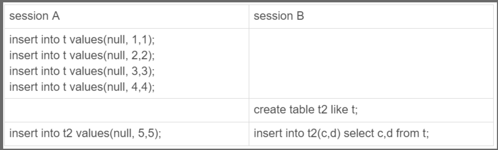
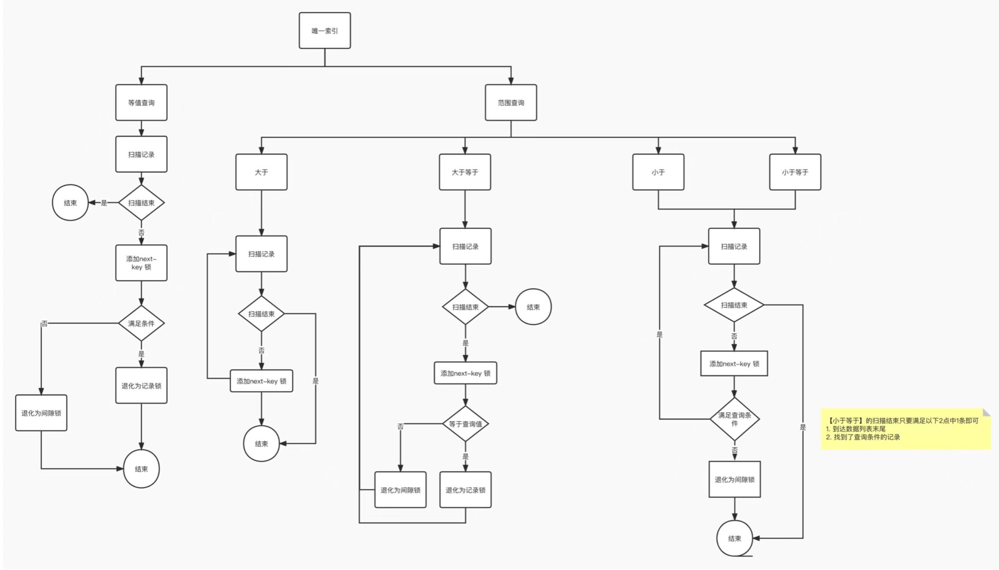
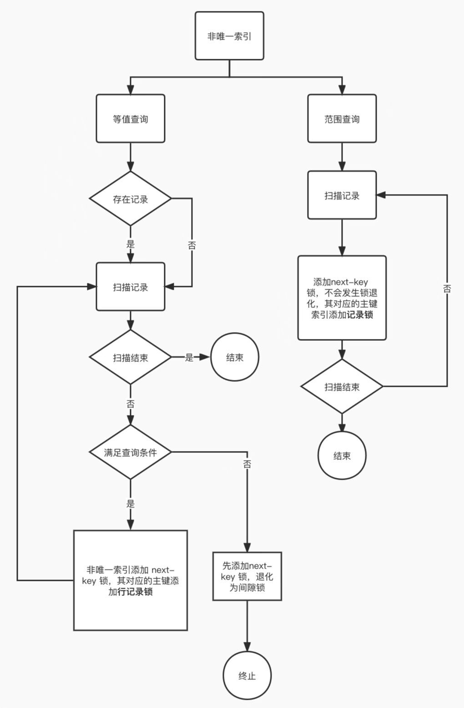
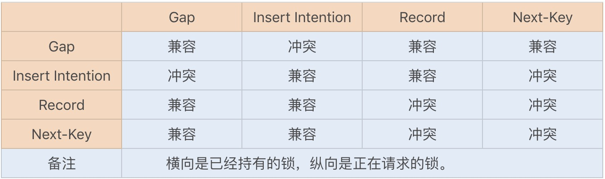

# 锁的种类

在MySQL中，根据加锁的范围，可以分为`全局锁`、`表级锁`、`行级锁`三类。


## 一、全局锁

### 如何使用？

要使用全局锁，则要执行这条命令：

```sql
flush tables with read lock
```

执行后，**整个数据库就处于只读状态了**，这时其他线程执行以下操作，都会被阻塞：

- 对数据的增删改操作，比如 insert、delete、update等语句；
- 对表结构的更改操作，比如 alter table、drop table 等语句。

如果要释放全局锁，则要执行这条命令：

```sql
unlock tables
```

当然，当会话断开了，全局锁会被自动释放。

### 应用场景

全局锁主要应用于做`全库逻辑备份`，这样在备份数据库期间，不会因为数据或表结构的更新，而出现备份文件的数据与预期的不一样。

### 缺点

加了全局锁之后，意味着整个数据库都是`只读状态`。

并且在备份的时候，写业务会被暂停

> 如何在业务不暂停的情况下，进行备份。

有的，如果数据库的引擎支持的事务支持**可重复读的隔离级别**，那么在备份数据库之前先开启事务，会先创建 Read View，然后整个事务执行期间都在用这个 Read View，而且由于 MVCC 的支持，备份期间业务依然可以对数据进行更新操作。

因为在可重复读的隔离级别下，即使其他事务更新了表的数据，也不会影响备份数据库时的 Read View，这就是事务四大特性中的隔离性，这样备份期间备份的数据一直是在开启事务时的数据。

备份数据库的工具是 mysqldump，在使用 mysqldump 时加上 `–single-transaction` 参数的时候，就会在备份数据库之前先开启事务。这种方法只适用于支持「可重复读隔离级别的事务」的存储引擎。

InnoDB 存储引擎默认的事务隔离级别正是可重复读，因此可以采用这种方式来备份数据库。

但是，对于 MyISAM 这种不支持事务的引擎，在备份数据库时就要使用全局锁的方法。

## 二、表级锁

### 表锁

```sql
//表级别的共享锁，也就是读锁； 
lock tables t_student read;

//表级别的独占锁，也就是写锁；
lock tables t_stuent write;

// 手动释放，或者会话退出之后也会释放所有的表锁。
unlock tables; // 从另一个角度说明，在一个事务内，可以锁多张表
```

PS：需要注意的是，表锁除了会限制别的线程读写外，也会限制本线程接下来的读写操作。

- 如果本线程对xxx加了共享锁，那么不仅其他线程无法进行写操作，本线程也无法进行写操作。
- 如果本线程对xxx加了独占锁，那么包括自己在内的线程都无法进行写操作。

> 注意：表锁的一次封锁技术，在我们会话开始的时候，就需要用lock指令将后边所有用上的表都加上锁，在锁释放之前，只能访问这些加锁的表，不能访问其他表，最后通过unlock tables释放所有的表锁。
>
> 这样做的好处是：`不会发生死锁`。
>
> 所以Myisam的另外一个好处就是不会发生死锁。

- 对于读锁
  - 持有读锁的会话可以读表，但不能写表；
  - 允许多个会话同时持有读锁；
  - 其他会话就算没有给表加读锁，也是可以读表的，但是不能写表；
  - 其他会话申请该表写锁时会阻塞，直到锁释放。
- 对于写锁
  - 持有写锁的会话既可以读表，也可以写表；
  - 只有持有写锁的会话才可以访问该表，其他会话访问该表会被阻塞，直到锁释放；
  - 其他会话无论申请该表的读锁或写锁，都会阻塞，直到锁释放。
- 锁的释放规则如下：
  - 使用` UNLOCK TABLES` 语句可以显示释放表锁；
  - 如果会话在持有表锁的情况下执行` LOCK TABLES `语句，将会释放该会话之前持有的锁；
  - 如果会话在持有表锁的情况下执行 `START TRANSACTION` 或` BEGIN` 开启一个事务，将会释放该会话之前持有的锁；
  - 如果会话连接断开，将会释放该会话所有的锁。

### 元数据锁

再来说说**元数据锁**（MDL）。

我们不需要显示的使用 MDL，因为当我们对数据库表进行操作时，会自动给这个表加上 MDL：

- 对一张表进行 CRUD 操作时，加的是 **MDL 读锁**；
- 对一张表做结构变更操作的时候，加的是 **MDL 写锁**；

`MDL 是为了保证当用户对表执行 CRUD 操作时，防止其他线程对这个表结构做了变更。`

当有线程在执行 select 语句（ 加 MDL 读锁）的期间，如果有其他线程要更改该表的结构（ 申请 MDL 写锁），那么将会被阻塞，直到执行完 select 语句（ 释放 MDL 读锁）。

反之，当有线程对表结构进行变更（ 加 MDL 写锁）的期间，如果有其他线程执行了 CRUD 操作（ 申请 MDL 读锁），那么就会被阻塞，直到表结构变更完成（ 释放 MDL 写锁）。

> MDL 不需要显示调用，那它是在什么时候释放的?

MDL 是在`事务提交后`才会释放，这意味着**事务执行期间，MDL 是一直持有的**。

那如果数据库有一个长事务（所谓的长事务，就是开启了事务，但是一直还没提交），那在对表结构做变更操作的时候，可能会发生意想不到的事情，比如下面这个顺序的场景：

1. 首先，线程 A 先启用了事务（但是一直不提交），然后执行一条 select 语句，此时就先对该表加上 MDL 读锁；
2. 然后，线程 B 也执行了同样的 select 语句，此时并不会阻塞，因为「读读」并不冲突；
3. 接着，线程 C 修改了表字段，`此时由于线程 A 的事务并没有提交，也就是 MDL 读锁还在占用着，这时线程 C 就无法申请到 MDL 写锁，就会被阻塞`，

那么在线程 C 阻塞后，后续有对该表的 select 语句，就都会被阻塞，如果此时有大量该表的 select 语句的请求到来，就会有大量的线程被阻塞住，这时数据库的线程很快就会爆满了。

> 为什么线程 C 因为申请不到 MDL 写锁，而导致后续的申请读锁的查询操作也会被阻塞？

这是因为`申请 MDL 锁的操作会形成一个队列，队列中写锁获取优先级高于读锁，一旦出现 MDL 写锁等待，会阻塞后续该表的所有 CRUD 操作`。

所以为了能安全的对表结构进行变更，在对表结构变更前，先要看看数据库中的长事务，是否有事务已经对表加上了 MDL 读锁，如果可以考虑 kill 掉这个长事务，然后再做表结构的变更。


### 意向锁

#### 是什么？

- 在使用 `InnoDB `引擎的表里对某些记录加上`「共享锁」`之前，需要先在`表级别`加上一个`「意向共享锁」`；
- 在使用 `InnoDB` 引擎的表里对某些纪录加上`「独占锁」`之前，需要先在`表级别`加上一个`「意向独占锁」`；

==即：**当执行插入、更新、删除操作，需要先对表加上「意向独占锁」，然后对该记录加独占锁。**==

- 注意：有一点非常重要，==普通的select是不会加行级锁的==，普通的select语句是通过MVCC实现一致性读，是无锁的。

- 当然select也可以对记录加**共享锁**和**独占锁**。

  ```sql
  # 先在表上加上意向共享锁，然后对读取的记录加共享锁。
  select .... lock in share mode;# Mysql8中也可以使用for share来加共享锁
  # 先在表上加上意向独占锁，然后对读取的记录加独占锁。
  select .... for update;
  ```

#### 是否会和行级锁发生冲突？

- **意向共享锁和意向独占锁是表级锁，不会和行级的共享锁和独占锁发生冲突。**

- **而且意向锁之间也不会发生冲突，只会和共享表锁（\*lock tables ... read\*）和独占表锁（\*lock tables ... write\*）发生冲突。**

#### 作用？

表锁和行锁是满足读读共享、读写互斥、写写互斥的。

- 如果没有「意向锁」，那么加「独占表锁」时，就需要遍历表里所有记录，查看是否有记录存在独占锁，这样效率会很慢。
- 那么有了「意向锁」，由于在对记录加独占锁前，先会加上表级别的意向独占锁，那么在加「独占表锁」时，直接查该表是否有意向独占锁，如果有就意味着表里已经有记录被加了独占锁，这样就不用去遍历表里的记录。

所以，**意向锁的目的是为了快速判断表里是否有记录被加锁**。

> 这种机制减少了不必要的锁冲突检查，提高了并发性能，并帮助事务更高效地协作，避免死锁等问题。


---

### AUTO-INC锁

表里的主键通常都会设置成自增的，这是通过对主键字段声明`AUTO_INCREMENT`属性实现的。

之后可以在插入数据时，可以不指定主键的值，数据库会自动给主键赋值递增的值，这主要是通过 **AUTO-INC 锁**实现的。

**生成时间：**在插入数据时，会加一个表级别的 AUTO-INC 锁，然后为被 `AUTO_INCREMENT` 修饰的字段赋值递增的值，等插入语句执行完成后，才会把 AUTO-INC 锁释放掉。

**释放时间：**AUTO-INC 锁是特殊的表锁机制，锁**不是再一个事务提交后才释放，而是`在执行完插入语句后就会立即释放`**。

一个事务在持有AUTO-INC锁的过程中，其他事务如果要想向该表插入语句都会被阻塞，从而保证插入数据时，被`AUTO_INCREMENT`修饰的字段的值时连续递增的。

#### 缺点及改进？

因此， 在 MySQL 5.1.22 版本开始，InnoDB 存储引擎提供了一种**轻量级的锁**来实现自增。

一样也是在插入数据的时候，会为被 `AUTO_INCREMENT` 修饰的字段加上轻量级锁，**`然后给该字段赋值一个自增的值，就把这个轻量级锁释放了，而不需要等待整个插入语句执行完后才释放锁`**。

InnoDB 存储引擎提供了个 innodb_autoinc_lock_mode 的系统变量，是用来控制选择用 AUTO-INC 锁，还是轻量级的锁。

- 当 innodb_autoinc_lock_mode = 0，就采用 AUTO-INC 锁，语句执行结束后才释放锁；
- 当 innodb_autoinc_lock_mode = 2，就采用轻量级锁，申请自增主键后就释放锁，并不需要等语句执行后才释放。
- 当 innodb_autoinc_lock_mode = 1：
  - 普通 insert 语句，自增锁在申请之后就马上释放；
  - 类似 insert … select 这样的批量插入数据的语句，自增锁还是要等语句结束后才被释放；

当 innodb_autoinc_lock_mode = 2 是性能最高的方式，但是当搭配 binlog 的日志格式是 statement 一起使用的时候，在「主从复制的场景」中会发生**数据不一致的问题**。

举个例子，考虑下面场景：



session A 往表 t 中插入了 4 行数据，然后创建了一个相同结构的表 t2，然后**两个 session 同时执行向表 t2 中插入数据**。

如果 innodb_autoinc_lock_mode = 2，意味着「申请自增主键后就释放锁，不必等插入语句执行完」。那么就可能出现这样的情况：

- session B 先插入了两个记录，(1,1,1)、(2,2,2)；
- 然后，session A 来申请自增 id 得到 id=3，插入了（3,5,5)；
- 之后，session B 继续执行，插入两条记录 (4,3,3)、 (5,4,4)。

可以看到，**session B 的 insert 语句，生成的 id 不连续**。

当「主库」发生了这种情况，binlog 面对 t2 表的更新只会记录这两个 session 的 insert 语句，如果 binlog_format=statement，记录的语句就是原始语句。记录的顺序要么先记 session A 的 insert 语句，要么先记 session B 的 insert 语句。

但不论是哪一种，这个 binlog 拿去「从库」执行，这时从库是按「顺序」执行语句的，只有当执行完一条 SQL 语句后，才会执行下一条 SQL。因此，在**从库上「不会」发生像主库那样两个 session 「同时」执行向表 t2 中插入数据的场景。所以，在备库上执行了 session B 的 insert 语句，生成的结果里面，id 都是连续的。这时，主从库就发生了数据不一致**。

要解决这问题，`binlog 日志格式要设置为 row，这样在 binlog 里面记录的是主库分配的自增值，到备库执行的时候，主库的自增值是什么，从库的自增值就是什么`。

所以，**当 innodb_autoinc_lock_mode = 2 时，并且 binlog_format = row，既能提升并发性，又不会出现数据一致性问题**。

## 三、行级锁

InnoDB 引擎是支持行级锁的，而 MyISAM 引擎并不支持行级锁。

前面也提到，普通的 select 语句是不会对记录加锁的，因为它属于快照读。如果要在查询时对记录加行锁，可以使用下面这两个方式，这种查询会加锁的语句称为**锁定读/当前读**。

```sql
//对读取的记录加共享锁
select ... lock in share mode;

//对读取的记录加独占锁
select ... for update;
```

**注意：**上边两条sql语句一定要在一个事务中执行。因为当事务提交了，锁就会被释放。


共享锁（S锁）满足读读共享，读写互斥。独占锁（X锁）满足写写互斥、读写互斥。


### 分类

行级锁的类型主要有三类：

- Record Lock，记录锁，也就是仅仅把一条记录锁上；
- Gap Lock，间隙锁，锁定一个范围，但是不包含记录本身；
- Next-Key Lock：`Record Lock + Gap Lock` 的组合，**锁定一个范围，并且锁定记录本身。**

#### 1、Record Lock(记录锁)

Record Lock 称为记录锁，锁住的是一条记录。而且记录锁是有 S 锁和 X 锁之分的：

- 当一个事务对一条记录加了 S 型记录锁后，**其他事务也可以继续对该记录加 S 型记录锁（S 型与 S 锁兼容）**，但是不可以对该记录加 X 型记录锁（S 型与 X 锁不兼容）;
- 当一个事务对一条记录加了 X 型记录锁后，其他事务既不可以对该记录加 S 型记录锁（S 型与 X 锁不兼容），也不可以对该记录加 X 型记录锁（X 型与 X 锁不兼容）。

举个例子，当一个事务执行了下面这条语句：

```sql
mysql > begin;
mysql > select * from t_test where id = 1 for update;
```

就是对 t_test 表中主键 id 为 1 的这条记录加上 X 型的记录锁，这样其他事务就无法对这条记录进行修改了。


当事务执行 commit 后，事务过程中生成的锁都会被释放。

#### 2、Gap Lock(==只存在于RR级别==)

Gap Lock 称为间隙锁，只存在于可重复读隔离级别，目的是**为了解决可重复读隔离级别下幻读的现象**。

假设，表中有一个范围 id 为（3，5）间隙锁，那么其他事务就无法插入 id = 4 这条记录了，这样就有效的防止幻读现象的发生。


间隙锁虽然存在 X 型间隙锁和 S 型间隙锁，但是并没有什么区别，**间隙锁之间是兼容的，即两个事务可以同时持有包含共同间隙范围的间隙锁，并不存在互斥关系，因为间隙锁的目的是防止插入幻影记录而提出的**

#### 3、Next-Key Lock（==只存在于RR级别==）

Next-Key Lock 称为临键锁，是 Record Lock + Gap Lock 的组合，锁定一个范围，并且锁定记录本身。

假设，表中有一个范围 id 为（3，5] 的 next-key lock，那么其他事务即不能插入 id = 4 记录，也不能修改 id = 5 这条记录。


所以，==next-key lock 即能保护该记录，又能阻止其他事务将新纪录插入到被保护记录前面的间隙中。==

**next-key lock 是包含间隙锁+记录锁的，`如果一个事务获取了 X 型的 next-key lock，那么另外一个事务在获取相同范围的 X 型的 next-key lock 时，是会被阻塞的`**。

比如，一个事务持有了范围为 (1, 10] 的 X 型的 next-key lock，那么另外一个事务在获取相同范围的 X 型的 next-key lock 时，就会被阻塞。

虽然相同范围的间隙锁是多个事务相互兼容的，但对于记录锁，我们是要考虑 X 型与 S 型关系，X 型的记录锁与 X 型的记录锁是冲突的。

#### 4、插入意向锁

一个事务在插入一条记录的时候，`需要判断插入位置是否已被其他事务加了间隙锁（next-key lock 也包含间隙锁）`。

如果有的话，插入操作就会发生**阻塞**，直到拥有间隙锁的那个事务提交为止（释放间隙锁的时刻），`在此期间会生成一个**插入意向锁**，表明有事务想在某个区间插入新记录，但是现在处于等待状态`。

举个例子，假设事务 A 已经对表加了一个范围 id 为（3，5）间隙锁。


当事务 A 还没提交的时候，事务 B 向该表插入一条 id = 4 的新记录，这时会判断到插入的位置已经被事务 A 加了间隙锁，于是事物 B 会生成一个插入意向锁，然后将锁的状态设置为等待状态（*PS：MySQL 加锁时，是先生成锁结构，然后设置锁的状态，如果锁状态是等待状态，并不是意味着事务成功获取到了锁，只有当锁状态为正常状态时，才代表事务成功获取到了锁*），此时事务 B 就会发生阻塞，直到事务 A 提交了事务。

插入意向锁名字虽然有意向锁，但是它并**不是意向锁，它是一种特殊的间隙锁，属于行级别锁**。

如果说间隙锁锁住的是一个区间，那么**「插入意向锁」锁住的就是一个点**。因而从这个角度来说，插入意向锁确实是一种特殊的间隙锁。

插入意向锁与间隙锁的另一个非常重要的差别是：尽管「插入意向锁」也属于间隙锁，**但两个事务却不能在同一时间内，一个拥有间隙锁，另一个拥有该间隙区间内的插入意向锁**（当然，插入意向锁如果不在间隙锁区间内则是可以的）。


---


# MySQL是怎么加锁的？

## 1、什么SQL语句会加行级锁？

在MySQL中提到加行级锁，那么默认就是在`innnodb`引擎下。


- 普通的 select 语句不会对记录加锁的（除了串行化隔离级别），属于快照读，是通过 `MVCC（多版本并发控制）`实现的。

- 如果想要在查询的时候对记录加行级锁，可以手动加锁

  ```sql
  # 这两种模式可以显式的加锁，又可以称为当前读。
  //对读取的记录加共享锁(S型锁)
  select ... lock in share mode;
  //对读取的记录加独占锁(X型锁)
  select ... for update;
  # 这两条语句必须在一个事务中，因为当事务提交了，锁就会被释放，所以在使用这两条语句的时候，要加上 begin 或者 start transaction 开启事务的语句。`
  ```

- 除了上边两个select手动加锁以外，`update`和`delete`出道作都会加行级锁，且锁的类型都是==独占锁(X型锁)==

  ```sql
  //对操作的记录加独占锁(X型锁)
  update table .... where id = 1;
  
  //对操作的记录加独占锁(X型锁)
  delete from table where id = 1;
  ```


## 2、行级锁有哪些种类？

在不同的隔离级别下，行级锁的种类是不同的。

1. 在RC隔离级别下，行级锁的种类`只有记录锁`，也就是仅仅把一条记录锁上。
2. 在RR隔离级别下，行级锁的种类除了有`记录锁`，还有`间隙锁(目的是为了避免幻读)`
   1. Record Lock：锁定一个记录
   2. Gap Lock：锁定一个范围
   3. Next-key Lock：Record Lock和Gap Lock的组合。

## 3、MySQL是怎么加行级锁的？

行级锁的枷锁规则比较复杂，不同场景下，加锁的形式时不同的。

1. 加锁的对象是`索引`，加锁的基本单位是`next-key lock`，它是由记录锁和间隙锁组合而成的，**next-key lock 是前开后闭区间，而间隙锁是前开后开区间**

> 什么时候next-key lock会退化为记录锁或间隙锁？
>
> - **在能使用记录锁或者间隙锁就能避免幻读现象的场景下， next-key lock 就会退化成退化成记录锁或间隙锁**。

### 1. 唯一索引等值查询

当我们用`唯一索引进行等值查询`的时候，查询的记录存不存在，加锁的规则也会不同：

- 当查询的记录是「存在」的，在索引树上定位到这一条记录后，将该记录的索引中的 next-key lock 会**退化成「记录锁」**。
- 当查询的记录是「不存在」的，在索引树找到第一条大于该查询记录的记录后，将该记录的索引中的 next-key lock 会**退化成「间隙锁」**。

> 这个地方注意一下：
>
> 1. 如果唯一索引指的是二级索引，那么在唯一索引上加行级锁之后，也会在与之对应的主键上加行级锁。


```sql
select * from xxx where id = 5 for update;
```

- 查询的记录是存在时：

  1. 此时事务 A 在 id = 2记录的主键索引上加的是记录锁，锁住的范围是 id 为 2的这条记录。
  2. 当其他事务插入id=2时，由于主键冲突，导致无法插入id=2的记录
  3. 由于对id=2加了记录锁，所以其他事务也无法删除该记录

- 查询的记录不存在时：

  1. 此时事务 A 在 id = 2 记录的主键索引上加的是间隙锁，锁住的范围是 (1, 5)
  2. 如果有其他事务插入id=2、3、4的记录时，并不会发生阻塞，而是报主键冲突的错误，因为表里已经存在id = 1和id = 5的记录了。

  

> 间隙锁的范围`(1, 5)` ，是怎么确定的？

根据我的经验，如果 LOCK_MODE 是 next-key 锁或者间隙锁，那么 LOCK_DATA 就表示锁的范围「右边界」，此次的事务 A 的 LOCK_DATA 是 5。

然后锁范围的「左边界」是表中 id 为 5 的上一条记录的 id 值，即 1。

因此，间隙锁的范围`(1, 5)`。

> 为什么唯一索引等值查询并且查询记录「不存在」的场景下，在索引树找到第一条大于该查询记录的记录后，要将该记录的索引中的 next-key lock 会退化成「间隙锁」？

原因就是在唯一索引等值查询并且查询记录不存在的场景下，仅靠间隙锁就能避免幻读的问题。

- 为什么 id = 5 记录上的主键索引的锁不可以是 next-key lock？如果是 next-key lock，就意味着其他事务无法删除 id = 5 这条记录，但是这次的案例是查询 id = 2 的记录，只要保证前后两次查询 id = 2 的结果集相同，就能避免幻读的问题了，所以即使 id =5 被删除，也不会有什么影响，那就没必须加 next-key lock，因此只需要在 id = 5 加间隙锁，避免其他事务插入 id = 2 的新记录就行了。
- 为什么不可以针对不存在的记录加记录锁？锁是加在索引上的，而这个场景下查询的记录是不存在的，自然就没办法锁住这条不存在的记录


### 2. 唯一索引范围查询

范围查询和等值查询的加锁规则是不同的。

当唯一索引进行范围查询时，**会对每一个扫描到的索引加 next-key 锁，然后如果遇到下面这些情况，会退化成记录锁或者间隙锁**：

- 情况一：针对「大于等于」的范围查询，因为存在等值查询的条件，那么如果等值查询的记录是存在于表中，那么该记录的索引中的 next-key 锁会**退化成记录锁**。
- 情况二：针对「小于或者小于等于」的范围查询，要看条件值的记录是否存在于表中：
  - 当条件值的记录不在表中，那么不管是「小于」还是「小于等于」条件的范围查询，`**扫描到终止范围查询的记录时，该记录的索引的 next-key 锁会退化成间隙锁**`，其他扫描到的记录，都是在这些记录的索引上加 next-key 锁。
  - 当条件值的记录在表中，如果是「小于」条件的范围查询，**扫描到终止范围查询的记录时，该记录的索引的 next-key 锁会退化成间隙锁**，其他扫描到的记录，都是在这些记录的索引上加 next-key 锁；如果「小于等于」条件的范围查询，扫描到终止范围查询的记录时，该记录的索引 next-key 锁不会退化成间隙锁。其他扫描到的记录，都是在这些记录的索引上加 next-key 锁。

### 3. 非唯一索引等值查询

当我们用非唯一索引进行等值查询的时候，**因为存在两个索引，一个是主键索引，一个是非唯一索引（二级索引），所以在加锁时，同时会对这两个索引都加锁，但是对主键索引加锁的时候，只有满足查询条件的记录才会对它们的主键索引加锁**。

针对非唯一索引等值查询时，查询的记录存不存在，加锁的规则也会不同：

- 当查询的记录「存在」时，由于不是唯一索引，所以肯定存在索引值相同的记录，于是**非唯一索引等值查询的过程是一个扫描的过程，直到扫描到第一个不符合条件的二级索引记录就停止扫描，然后在扫描的过程中，对扫描到的二级索引记录加的是 next-key 锁，而对于第一个不符合条件的二级索引记录，该二级索引的 next-key 锁会退化成间隙锁。同时，在符合查询条件的记录的主键索引上加记录锁**。
- 当查询的记录「不存在」时，**扫描到第一条不符合条件的二级索引记录，该二级索引的 next-key 锁会退化成间隙锁。因为不存在满足查询条件的记录，所以不会对主键索引加锁**。


1. 记录不存在的情况
2. 记录

### 4. 非唯一索引范围查询

非唯一索引和主键索引的范围查询的加锁也有所不同，不同之处在于**非唯一索引范围查询，索引的 next-key lock 不会有退化为间隙锁和记录锁的情况**，也就是非唯一索引进行范围查询时，对二级索引记录加锁都是加 next-key 锁。


### 5. 没有加索引的查询

**如果锁定读查询语句，没有使用索引列作为查询条件，或者查询语句没有走索引查询，导致扫描是全表扫描。那么，每一条记录的索引上都会加 next-key 锁，这样就相当于锁住的全表，`这时如果其他事务对该表进行增、删、改操作的时候，都会被阻塞`**。

`不只是锁定读查询语句不加索引才会导致这种情况，update 和 delete 语句如果查询条件不加索引`，那么由于扫描的方式是全表扫描，于是就会对每一条记录的索引上都会加 next-key 锁，这样就相当于锁住的全表。

因此，**在线上在执行 update、delete、select ... for update 等具有加锁性质的语句，一定要检查语句是否走了索引，如果是全表扫描的话，会对每一个索引加 next-key 锁，相当于把整个表锁住了**，这是挺严重的问题


> 总结：select ... for update、update、delete等具有加锁性质的语句，如果没有走索引，会导致将对每一个索引都添加临键锁，相当于把整个表锁住。


### 总结

这次我以 **MySQL 8.0.26** 版本，在可重复读隔离级别之下，做了几个实验，让大家了解了唯一索引和非唯一索引的行级锁的加锁规则。

我这里总结下， MySQL 行级锁的加锁规则。

**唯一索引等值查询：**

- 当查询的记录是「存在」的，在索引树上定位到这一条记录后，将该记录的索引中的 next-key lock 会**`退化成「记录锁」`**。
- 当查询的记录是「不存在」的，在索引树找到第一条大于该查询记录的记录后，将该记录的索引中的 next-key lock 会**`退化成「间隙锁」`**。

**非唯一索引等值查询：**

- 当查询的记录「存在」时，由于不是唯一索引，所以肯定存在索引值相同的记录，于是非唯一索引等值查询的过程是一个扫描的过程，直到扫描到第一个不符合条件的二级索引记录就停止扫描，然后**在扫描的过程中，对扫描到的二级索引记录加的是 next-key 锁，而对于第一个不符合条件的二级索引记录，该二级索引的 next-key 锁会退化成间隙锁。同时，在符合查询条件的记录的主键索引上加记录锁**。
- 当查询的记录「不存在」时，**扫描到第一条不符合条件的二级索引记录，该二级索引的 next-key 锁会退化成间隙锁。因为不存在满足查询条件的记录，所以不会对主键索引加锁**。

**非唯一索引和主键索引的范围查询的加锁规则不同之处在于：**

- 唯一索引在满足一些条件的时候，索引的 next-key lock 退化为间隙锁或者记录锁。
- 非唯一索引范围查询，索引的 next-key lock 不会退化为间隙锁和记录锁。

其实理解 MySQL 为什么要这样加锁，主要要`以避免幻读角度`去分析，这样就很容易理解这些加锁的规则了。

还有一件很重要的事情，在线上在执行 update、delete、select ... for update 等具有加锁性质的语句，一定要检查语句是否走了索引，**如果是全表扫描的话，会对每一个索引加 next-key 锁，相当于把整个表锁住了**，这是挺严重的问题。

最后附上「@一只小铭」同学总结的流程图。

唯一索引（主键索引）加锁的流程图如下。（*注意这个流程图是针对「主键索引」的，如果是二级索引的唯一索引，除了流程图中对二级索引的加锁规则之外，还会对查询到的记录的主键索引项加「记录锁」，流程图没有提示这一个点，所以在这里用文字补充说明下*）



非唯一索引加锁的流程图：




## 4、update没加索引会锁全表？

InnoDB 存储引擎的默认事务隔离级别是「可重复读」，但是在这个隔离级别下，在多个事务并发的时候，会出现幻读的问题。

因此 InnoDB 存储引擎自己实现了行锁，通过 next-key 锁（记录锁和间隙锁的组合）来锁住记录本身和记录之间的“间隙”，防止其他事务在这个记录之间插入新的记录，从而避免了幻读现象。


2. 当我们执行 update 语句时，实际上是会对记录加独占锁（X 锁）的。并且，这个锁`并不是执行完 update 语句就会释放的`，而是会等事务结束时才会释放。
3. 


1. 如果update时，where条件使用了唯一索引，那么next-key锁会退化为`记录锁`(值存在)
2. 如果update时，where条件没有使用了唯一索引，==那么就会全表扫描，于是会在所有记录(唯一索引)上加上next-key锁，相当于把整个表锁住了==。


> 当然，并不一定在where后加上索引就会避免全表记录加锁。
>
> 关键还是要看这条语句在执行过程中，优化器最终选择的是索引扫描，还是全表扫描，如果走了全表扫描，就会对全表的记录进行加锁。


> 网上很多资料说，update 没加锁索引会加表锁，这是不对的。
>
> Innodb 源码里面在扫描记录的时候，都是针对索引项这个单位去加锁的， update 不带索引就是全表扫扫描，也就是表里的索引项都加锁，相当于锁了整张表，所以大家误以为加了表锁。


### 如何避免这种情况的发生？

**解决方案：**

将 MySQL 里的 `sql_safe_updates` 参数设置为 1，开启安全更新模式。

**效果：**

update 语句必须满足如下条件之一才能执行成功：

- 使用 where，并且 where 条件中必须有索引列；
- 使用 limit；
- 同时使用 where 和 limit，此时 where 条件中可以没有索引列；

delete 语句必须满足以下条件能执行成功：

- 同时使用 where 和 limit，此时 where 条件中可以没有索引列；


如果 where 条件带上了索引列，但是优化器最终扫描选择的是全表，而不是索引的话，我们可以使用 `force index([index_name])` 可以告诉优化器使用哪个索引，以此避免有几率锁全表带来的隐患。

----

# MySQL是如何解决幻读的？

1. 针对于`快照读(普通select)`，是通过`MVCC`的方式来解决幻读，因为在`RR隔离`级别下，事务执行过程中看到的数据，一直跟这个事务启动时看到的数据是一致的，即使中途有其他事务插入了一条数据，是查询不出来这条数据的，所以就很好的避免了幻读问题。
2. 针对于`当前读(select ...for update等语句)`，通过`next-key lock`方式解决了幻读问题，当执行当前读语句时，会给记录加上`next-key lock`来防止其他事务在这些间隙插入或删除数据。
   1. 其他事务只能等待，直到达到最长超时时间，就会超时报错，释放前边所拥有的锁。
   2. `innodb_lock_wait_timeout`：该参数允许您设置InnoDB事务等待锁的最大超时时间，单位是秒。如果一个事务等待锁的时间超过了这个设置的时间，它会被自动回滚。默认值是50秒。


# MySQL死锁举例

## 锁的兼容性



## 间隙锁的兼容性

在MySQL官网上还有一段非常关键的描述：

> *Gap locks in InnoDB are “purely inhibitive”, which means that their only purpose is to prevent other transactions from Inserting to the gap. Gap locks can co-exist. A gap lock taken by one transaction does not prevent another transaction from taking a gap lock on the same gap. There is no difference between shared and exclusive gap locks. They do not conflict with each other, and they perform the same function.*

**间隙锁的意义只在于阻止区间被插入**，因此是可以共存的。**一个事务获取的间隙锁不会阻止另一个事务获取同一个间隙范围的间隙锁**，共享（S型）和排他（X型）的间隙锁是没有区别的，他们相互不冲突，且功能相同。

这里的共同间隙包括两种场景：

- 其一是两个间隙锁的间隙区间完全一样；
- 其二是一个间隙锁包含的间隙区间是另一个间隙锁包含间隙区间的子集。

但是有一点要注意，**next-key lock 是包含间隙锁+记录锁的，如果一个事务获取了 X 型的 next-key lock，那么另外一个事务在获取相同范围的 X 型的 next-key lock 时，是会被阻塞的**。

- 比如，一个事务持有了范围为 (1, 10] 的 X 型的 next-key lock，那么另外一个事务在获取相同范围的 X 型的 next-key lock 时，就会被阻塞。
- 虽然相同范围的间隙锁是多个事务相互兼容的，但对于记录锁，我们是要考虑 X 型与 S 型关系。X 型的记录锁与 X 型的记录锁是冲突的，比如一个事务执行了 select ... where id = 1 for update，后一个事务在执行这条语句的时候，就会被阻塞的。
- 但是还要注意！`对于这种范围为 (1006, +∞] 的 next-key lock，两个事务是可以同时持有的，不会冲突。因为 +∞ 并不是一个真实的记录，自然就不需要考虑 X 型与 S 型关系`。

> 换句话说就是：
>
> 1. ==间隙锁是互相兼容的，而普通next-key lock是不兼容的==
> 2. ==对于这种范围为 (xxx, +∞] 的 next-key lock，两个事务是可以同时持有的==

## 插入意向锁

注意！插入意向锁名字虽然有意向锁，但是它并不是意向锁，它是一种特殊的间隙锁。

在MySQL的官方文档中有以下重要描述：

*An Insert intention lock is a type of gap lock set by Insert operations prior to row Insertion. This lock signals the intent to Insert in such a way that multiple transactions Inserting into the same index gap need not wait for each other if they are not Inserting at the same position within the gap. Suppose that there are index records with values of 4 and 7. Separate transactions that attempt to Insert values of 5 and 6, respectively, each lock the gap between 4 and 7 with Insert intention locks prior to obtaining the exclusive lock on the Inserted row, but do not block each other because the rows are nonconflicting.*

这段话表明尽管**插入意向锁是一种特殊的间隙锁，但不同于间隙锁的是，该锁只用于并发插入操作**。

如果说间隙锁锁住的是一个区间，那么「插入意向锁」锁住的就是一个点。因而从这个角度来说，插入意向锁确实是一种特殊的间隙锁。

插入意向锁与间隙锁的另一个非常重要的差别是：`尽管「插入意向锁」也属于间隙锁，但两个事务却不能在同一时间内，一个拥有间隙锁，另一个拥有该间隙区间内的插入意向锁`（当然，插入意向锁如果不在间隙锁区间内则是可以的）。

另外，我补充一点，插入意向锁的生成时机：

- ==每插入一条新记录，都需要看一下待插入记录的下一条记录上是否已经被加了间隙锁，如果已加间隙锁，此时会生成一个插入意向锁，然后锁的状态设置为等待状态==（*PS：MySQL 加锁时，是先生成锁结构，然后设置锁的状态，如果锁状态是等待状态，并不是意味着事务成功获取到了锁，只有当锁状态为正常状态时，才代表事务成功获取到了锁*），现象就是 Insert 语句会被阻塞。


## 避免死锁的措施

知道了死锁问题源自哪儿，就可以找到合适的方法来避免它了。

避免死锁最直观的方法就是在两个事务相互等待时，当一个事务的等待时间超过设置的某一阈值，就对这个事务进行回滚，另一个事务就可以继续执行了。这种方法简单有效，在 InnoDB 中，参数 innodb_lock_wait_timeout 是用来设置超时时间的。


1. 在编程中尽量按照固定的顺序来处理数据库记录，假设有两个更新操作，分别更新两条相同的记录，但更新顺序不一样，有可能导致死锁；
2. 在允许幻读和不可重复读的情况下，尽量使用 `RC` 事务隔离级别，可以避免 gap lock 导致的死锁问题；
3. 更新表时，尽量使用主键更新；
4. 避免长事务，尽量将长事务拆解，可以降低与其它事务发生冲突的概率；
5. 设置锁等待超时参数，我们可以通过 innodb_lock_wait_timeout 设置合理的等待超时阈值，特别是在一些高并发的业务中，我们可以尽量将该值设置得小一些，避免大量事务等待，占用系统资源，造成严重的性能开销。
6. MySQL`默认开启了死锁检测机制，当检测到死锁后会选择一个最小(锁定资源最少得事务)的事务进行回滚`
   1. 通过innodb_deadlock_detect = on 打开死锁检测。
