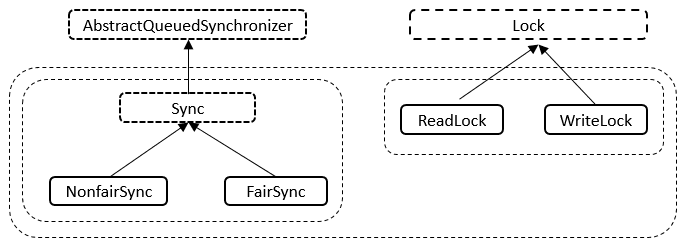

## 前置知识

补充JUC课程中的两个小知识

> 四大口诀：
>
> 1. 在高内聚低耦合的前提下，封装思想，用线程操作资源类。
> 2. 判断、干活、通知
> 3. 防止虚假唤醒，wait方法要注意使用while判断
> 4. 注意标志位flag，可能是volatile的

### 0、进程和线程的区别？

- **进程：**是程序的一次执行，是系统进行资源分配和调度的独立单位，每一个进程都有它自己的内存空间和系统资源。
- **线程：**在同一个进程内又可以执行多个任务，而这每一个任务我们就可以看作是一个线程。线程是CPU的执行单元，是操作系统调度的基本单位

### 1、什么是上下文切换？

即使是单核处理器也支持多线程执行代码，CPU通过给每个线程分配CPU时间片来实现这个机制。时间片是CPU分配给各个线程的时间，因为时间片非常短，所以CPU通过不停地切 换线程执行，让我们感觉多个线程是同时执行的，时间片一般是几十毫秒（ms）。

**CPU通过时间片分配算法来循环执行任务，当前任务执行一个时间片后会切换到下一个任务。但是，在切换前会保存上一个任务的状态，以便下次切换回这个任务时，可以再加载这个任务的状态。所以任务从保存到再加载的过程就是一次上下文切换。** 

这就像我们同时读两本书，当我们在读一本英文的技术书时，发现某个单词不认识，于是便打开中英文字典，但是在放下英文技术书之前，大脑必须先记住这本书读到了多少页的第多少行，等查完单词之后，能够继续读这本书。这样的切换是会影响读书效率的，同样上下文 切换也会影响多线程的执行速度。

> 所以，所谓操作系统的任务调度，`实际上的调度对象是线程，而进程只是给线程提供了虚拟内存、全局变量等资源`。
>
> 对于线程和进程，我们可以这么理解：
>
> - 当进程只有一个线程时，可以认为进程就等于线程；
> - 当进程拥有多个线程时，这些线程会共享相同的虚拟内存和全局变量等资源，这些资源在上下文切换时是不需要修改的；
>
> 另外，线程也有自己的私有数据，比如栈和寄存器等，这些在上下文切换时也是需要保存的。

> 线程上下文切换的是什么？

这还得看线程是不是属于同一个进程：

- 当两个线程不是属于同一个进程，则切换的过程就跟进程上下文切换一样；
- **当两个线程是属于同一个进程，因为虚拟内存是共享的，所以在切换时，虚拟内存这些资源就保持不动，只需要切换线程的私有数据、寄存器等不共享的数据**；

所以，线程的上下文切换相比进程，开销要小很多。

### 2、并发编程的目的与挑战

并发编程的目的是为了让程序运行得更快，**但是，并不是启动更多的线程就能让程序最大限度地并发执行**。在进行并发编程时，如果希望通过多线程执行任务让程序运行得更快，会面临非常多的挑战，比如上下文切换的问题、死锁的问题，以及受限于硬件和软件的资源限制问题。

### 3、线程太多的话，并发执行的速度会比串行慢

这是因为线程有创建和上下文切换的开销。

1. 线程创建和上下文的频繁切换(涉及到用户态到内核态的转换)
2. 调度开销(CPU要选择该执行哪些线程，涉及到调度算法和开销)
3. **CPU 时间**：竞争锁时，线程会不断地尝试获取锁，这可能导致大量的自旋（Spin）操作，消耗了CPU 时间。自旋操作会在没有获取到锁时重复尝试，浪费了处理器资源。
4. **死锁和饥饿**：不当使用锁可能导致死锁和饥饿问题，这会使一些线程长时间无法获得所需的资源或锁定。
5. **锁粒度问题**：如果锁的粒度过大，可能会导致串行化，因为多个线程需要等待同一把锁。如果锁的粒度过小，可能会导致锁争用和性能下降。

### 4、为什么多线程这么重要？

> 摩尔定律：在价格不变的情况下，集成电路上可容纳的晶体管数目，隔一段时间就会翻倍增加。

- 从硬件方面：由于摩尔定律的失效，单核CPU主频几乎不再提高。在主频不再提高且核数在不断增加的情况下，`要想让程序更快就要用到并发或并行编程`。
- 从软件方面：多线程并发编程是开发高并发系统的基础，利用好多线程机制可以提高系统的并发能力。 
  - 今天我们很多都用到了多线程(web服务器、数据库服务器)，难以想象如果没有多线程并发，那么今天的互联网会成什么样子。


### 5、并行与并发的区别


在这里要注意几点：

1. 目前一个CPU基本上有多个核心，一个CPU上的多个核心共享CPU上的缓存。
2. 并行可以是一个CPU上的多个核心共同运行不同的任务，也可以是多个CPU上不同的核心运行不同的任务。

------

## 一、使用线程

有三种使用线程的方法：

- 实现 Runnable 接口
- 实现 Callable 接口(有返回结果的)；
- 继承 Thread 类。

实现 Runnable 和 Callable 接口的类只能当做一个可以在线程中运行的任务，不是真正意义上的线程，因此**最后还需要通过 Thread 来调用**。可以理解为任务是通过线程驱动从而执行的。

### 实现 Runnable 接口

`@FunctionalInterface`

需要实现接口中的 run() 方法。

```java
public class MyRunnable implements Runnable {
    @Override
    public void run() {
        // ...
    }
}
```

使用 Runnable 实例再创建一个 Thread 实例，然后调用 Thread 实例的 start() 方法来启动线程。

```java
public static void main(String[] args) {
    MyRunnable instance = new MyRunnable();
    Thread thread = new Thread(instance);
    thread.start();
}
```


### 实现 Callable 接口

`@FunctionalInterface`

与 Runnable 相比，Callable 可以有返回值，返回值通过 FutureTask 进行封装。

`FutureTask`实现了`RunnableFuture`接口

```java
public class MyCallable implements Callable<Integer> {
    public Integer call() {
        return 123;
    }
}
public static void main(String[] args) throws ExecutionException, InterruptedException {
    MyCallable mc = new MyCallable();
    FutureTask<Integer> ft = new FutureTask<>(mc);
    Thread thread = new Thread(ft);
    thread.start();
    while(!ft.isDone()) { 
    	System.out.println(ft.get());    
    }
}
```


### 继承 Thread 类

同样也是需要实现 run() 方法，因为 Thread 类也实现了 Runable 接口。

当调用 **start() 方法启动一个线程时，虚拟机会将该线程放入就绪队列中等待被调度**，当一个线程被调度时会执行该线程的 run() 方法。

```java
public class MyThread extends Thread {
    public void run() {
        // ...
    }
}
public static void main(String[] args) {
    MyThread mt = new MyThread();
    mt.start();
}
```


### 其他

#### ==Java中的线程与操作系统线程的联系与区别？(TODO)==


#### 实现接口 VS 继承 Thread

实现接口会更好一些，因为：

- Java 不支持多重继承，因此继承了 Thread 类就无法继承其它类，但是可以实现多个接口；
- 类可能只要求可执行就行，继承整个 Thread 类开销过大。

#### Thread中的start方法

通过查看`java.lang.thread`的`start`方法得知，真正启动线程是调用了`start0`本地方法。start0方法其实就是`JVM_StartThread`方法

```java
public synchronized void start() {
    /**
     * This method is not invoked for the main method thread or "system"
     * group threads created/set up by the VM. Any new functionality added
     * to this method in the future may have to also be added to the VM.
     *
     * A zero status value corresponds to state "NEW".
     */
    if (threadStatus != 0)
        throw new IllegalThreadStateException();

    /* Notify the group that this thread is about to be started
     * so that it can be added to the group's list of threads
     * and the group's unstarted count can be decremented. */
    group.add(this);

    boolean started = false;
    try {
        start0();
        started = true;
    } finally {
        try {
            if (!started) {
                group.threadStartFailed(this);
            }
        } catch (Throwable ignore) {
            /* do nothing. If start0 threw a Throwable then
              it will be passed up the call stack */
        }
    }
}
// native本地方法
private native void start0();
```


下面是在`openjdk8\jdk\src\share\native\java\lang\Thread.c`中对于JNI方法的定义，可以看到native方法`start0`对应于`JVM_StartThread`

```c++
static JNINativeMethod methods[] = {
    {"start0",           "()V",        (void *)&JVM_StartThread},
    {"stop0",            "(" OBJ ")V", (void *)&JVM_StopThread},
    {"isAlive",          "()Z",        (void *)&JVM_IsThreadAlive},
    {"suspend0",         "()V",        (void *)&JVM_SuspendThread},
    {"resume0",          "()V",        (void *)&JVM_ResumeThread},
    {"setPriority0",     "(I)V",       (void *)&JVM_SetThreadPriority},
    {"yield",            "()V",        (void *)&JVM_Yield},
    {"sleep",            "(J)V",       (void *)&JVM_Sleep},
    {"currentThread",    "()" THD,     (void *)&JVM_CurrentThread},
    {"countStackFrames", "()I",        (void *)&JVM_CountStackFrames},
    {"interrupt0",       "()V",        (void *)&JVM_Interrupt},
    {"isInterrupted",    "(Z)Z",       (void *)&JVM_IsInterrupted},
    {"holdsLock",        "(" OBJ ")Z", (void *)&JVM_HoldsLock},
    {"getThreads",        "()[" THD,   (void *)&JVM_GetAllThreads},
    {"dumpThreads",      "([" THD ")[[" STE, (void *)&JVM_DumpThreads},
    {"setNativeName",    "(" STR ")V", (void *)&JVM_SetNativeThreadName},
};
```

而在`openjdk8\hotspot\src\share\vm\prims\jvm.cpp`中又可以找到OpenJDK对于`JVM_StartThread`的实现，在末尾可以找到一个关键的方法`Thread::start(native_thread)`

```c++
JVM_ENTRY(void, JVM_StartThread(JNIEnv* env, jobject jthread))
  JVMWrapper("JVM_StartThread");
  JavaThread *native_thread = NULL;

  bool throw_illegal_thread_state = false;

  // We must release the Threads_lock before we can post a jvmti event
  // in Thread::start.
  {
    // Ensure that the C++ Thread and OSThread structures aren't freed before
    // we operate.
    MutexLocker mu(Threads_lock);

    // Since JDK 5 the java.lang.Thread threadStatus is used to prevent
    // re-starting an already started thread, so we should usually find
    // that the JavaThread is null. However for a JNI attached thread
    // there is a small window between the Thread object being created
    // (with its JavaThread set) and the update to its threadStatus, so we
    // have to check for this
    if (java_lang_Thread::thread(JNIHandles::resolve_non_null(jthread)) != NULL) {
      throw_illegal_thread_state = true;
    } else {
      // We could also check the stillborn flag to see if this thread was already stopped, but
      // for historical reasons we let the thread detect that itself when it starts running

      jlong size =
             java_lang_Thread::stackSize(JNIHandles::resolve_non_null(jthread));
      // Allocate the C++ Thread structure and create the native thread.  The
      // stack size retrieved from java is signed, but the constructor takes
      // size_t (an unsigned type), so avoid passing negative values which would
      // result in really large stacks.
      size_t sz = size > 0 ? (size_t) size : 0;
      native_thread = new JavaThread(&thread_entry, sz);

      // At this point it may be possible that no osthread was created for the
      // JavaThread due to lack of memory. Check for this situation and throw
      // an exception if necessary. Eventually we may want to change this so
      // that we only grab the lock if the thread was created successfully -
      // then we can also do this check and throw the exception in the
      // JavaThread constructor.
      if (native_thread->osthread() != NULL) {
        // Note: the current thread is not being used within "prepare".
        native_thread->prepare(jthread);
      }
    }
  }

  if (throw_illegal_thread_state) {
    THROW(vmSymbols::java_lang_IllegalThreadStateException());
  }

  assert(native_thread != NULL, "Starting null thread?");

  if (native_thread->osthread() == NULL) {
    // No one should hold a reference to the 'native_thread'.
    delete native_thread;
    if (JvmtiExport::should_post_resource_exhausted()) {
      JvmtiExport::post_resource_exhausted(
        JVMTI_RESOURCE_EXHAUSTED_OOM_ERROR | JVMTI_RESOURCE_EXHAUSTED_THREADS,
        "unable to create new native thread");
    }
    THROW_MSG(vmSymbols::java_lang_OutOfMemoryError(),
              "unable to create new native thread");
  }

  Thread::start(native_thread);

JVM_END
```

在`openjdk8\hotspot\src\share\vm\runtime\thread.cpp`中找到了`Thread::start(native_thread)`的实现，可以发现他调用的是操作系统启动线程的方法。

```c++
void Thread::start(Thread* thread) {
  // Start is different from resume in that its safety is guaranteed by context or
  // being called from a Java method synchronized on the Thread object.
  if (thread->is_Java_thread()) {
    // Initialize the thread state to RUNNABLE before starting this thread.
    // Can not set it after the thread started because we do not know the
    // exact thread state at that time. It could be in MONITOR_WAIT or
    // in SLEEPING or some other state.
    java_lang_Thread::set_thread_status(JavaThread::cast(thread)->threadObj(),
                                        JavaThreadStatus::RUNNABLE);
  }
  // 调用了操作系统底层的启动线程。
  os::start_thread(thread);
}
```

总结来说：

1. 在Java中的`new Thread().start()`调用的是JNI`start0`方法
2. 而`start0`对应`jvm.cpp`中的`JMV_StartThread`
3. `JMV_StartThread`又调用了`thread.cpp`中的`Thread::start(Thread* thread)`方法
4. 而`Thread::start(Thread* thread)`方法又调用了`os::start_thead(thread)`方法
5. 所以Java启动线程，其实是使用C++调用操作系统的方法去启动线程。


## 二、基础线程机制

### Executor(亦可哉剋它)

Executor 管理多个异步任务的执行，而无需程序员显式地管理线程的生命周期。这里的异步是指多个任务的执行互不干扰，不需要进行同步操作。

主要有三种 Executor：

- `CachedThreadPool`：一个任务创建一个线程(可扩容)；
- `FixedThreadPool`：所有任务只能使用**固定大小**的线程；
- `SingleThreadExecutor`：相当于大小为 1 的 `FixedThreadPool`。

```java
public static void main(String[] args) {
    ExecutorService executorService = Executors.newCachedThreadPool();
    for (int i = 0; i < 5; i++) {
        executorService.execute(new MyRunnable());
    }
    executorService.shutdown();
}
```


### Daemon(滴门)

守护线程是**程序运行时在后台提供服务的线程**，不属于程序中不可或缺的部分。

当所有非守护线程结束时，不管守护线程是否结束，程序都会自动退出。

- main() 属于非守护线程。
- 垃圾回收线程是典型的Daemon线程

在线程启动之前使用 `setDaemon()` 方法可以将一个线程设置为守护线程。

```java
public static void main(String[] args) {
    Thread thread = new Thread(new MyRunnable());
    thread.setDaemon(true);
}
```

**Ps：**如果在启动之后才设置，不会报错，但是不会生效。

> ForkJoin.commonPool() 默认创建的线程是守护线程！！！
>
> ```java
> ForkJoinPool customPool = new ForkJoinPool(4, ForkJoinPool.defaultForkJoinWorkerThreadFactory, null, false);
> ```
>
> - 置为false就不是守护线程了。

在Java中，还有哪些地方默认创建的是守护线程：

1. **Fork-Join框架的通用线程池**：如前面提到的，Fork-Join框架的通用线程池中的线程都是守护线程。
2. **Timer线程**：Java中的`java.util.Timer`类创建的线程默认是守护线程。这些线程用于执行计划任务，当所有非守护线程结束时，守护线程也会自动终止。
3. **部分后台任务**：一些后台任务线程默认是守护线程，例如Java虚拟机的垃圾回收器线程。
4. **RMI（远程方法调用）线程**：RMI框架中的一些线程也是守护线程，用于管理和维护RMI远程对象。

### sleep()

Thread.sleep(millisec) 方法会休眠当前正在执行的线程，millisec 单位为毫秒。

sleep() 可能会抛出 InterruptedException，因为异常不能跨线程传播回 main() 中，因此必须在本地进行处理。线程中抛出的其它异常也同样需要在本地进行处理。

```java
public void run() {
    try {
        Thread.sleep(3000);
    } catch (InterruptedException e) {
        e.printStackTrace();
    }
}
```


**PS：**现在流行写**`TimeUnit.SECONDS.sleep(1);`**

### yield()

对静态方法 Thread.yield() 的调用声明了**当前线程已经完成了生命周期中最重要的部分，可以切换给其它线程来执行。该方法只是对线程调度器的一个建议**，而且也`只是建议具有相同优先级的其它线程可以运行`。

```java
public void run() {
    Thread.yield();
}
```


## 三、中断

### 什么是中断

一个线程**不应该由其他线程来强制中断或停止**，而是应该**由线程自己自行停止**。
所以，`Thread.stop`, `Thread.suspend`,`Thread.resume` 都已经被废弃了。


在Java中**没有办法立即停止一条线程**，然而停止线程却显得尤为重要，如取消一个耗时操作。因此，Java提供了一种机制来通知目标线程停止运行，线程的机制——中断。

一个线程执行完毕之后会自动结束，如果在运行过程中发生异常也会提前结束。

### 中断相关API


- `public void interrupt()`**实例方法**，
  - 实例方法interrupt()**仅仅是设置线程的中断状态为true**，不会停止线程。
  - 它通知目标线程中断，也就是设置目标线程的中断标志位为true，中断标志位表示当前线程已经被中断了。

- `public static boolean interrupted()`**静态方法**，Thread.interrupted();  判断线程是否被中断，并清除当前中断状态
  - 这个方法做了两件事：
    - 返回当前线程的中断状态
    - 将当前线程的中断状态设为false(这个方法有点不好理解，因为连续调用两次的结果可能不一样。)
    - **返回当前线程的中断状态**(boolean类型)且**将当前线程的中断状态设为false**，此方法调用之后会清除当前线程的中断标志位的状态（将中断标志置为false了），返回当前值并清零置false

- `public boolean isInterrupted()`	实例方法，判断当前线程是否被中断（通过检查中断标志位）
  - 它判断当前线程是否被中断（通过检查中断标志位）并获取中断标志


### 如何停止一个线程？

- 使用退出标志，使线程正常退出。
- 使用interrupt方法中断线程。
  - 调用interrupt方法是在当前线程中打了一个停止标志，并不是真的停止线程。
  - 每个线程对象中都有一个标识，用于表示线程是否被中断；该标识位为true表示中断，为false表示未中断；
  - 我们可以在线程实现方法中，使用isInterrupted()方法来判断线程是否已经被中断，来决定程序是否继续执行。


有三种方法：

**在需要中断的线程中利用循环不断监听中断状态，一旦发生中断，就执行相应的中断处理业务逻辑。**

1. 使用volatile
2. 使用AtomicBoolean
3. 使用Thread类自带的中断API方法

#### Java 中 interrupted 和 isInterrupted 方法的区别？

- `interrupt(坑)`：实例方法，用于中断线程。调用该方法的线程的状态为将被置为”中断”(true)状态。
  - 注意：线程中断仅仅是置线程的中断状态位，不会停止线程。
  - 调用`interrupt0`本地方法
  - 若线程处于`waiting / timedWaiting`(wait、join、wait(xx)、sleep)时, 会抛出`InterruptedException`(处于blocked时不会抛出异常), 并且==将该线程的”中断”标志位清空,会将线程的中断标志重新设置为false==
    - 特殊情况：对于处于中断 I/O 阻塞和 synchronized 锁阻塞的线程，使用该方法不会抛出异常。
    - I/O阻塞通常是是由操作系统来控制的，Java无法中断。
    - 线程在等待锁的过程中，它是无法响应中断请求的，只有当它成功获取锁后才能检查中断状态。
  
- `interrupted`：是`静态`方法，
  1. 返回当前中断信号(true/false)
  2. 将当前线程的中断状态设为false
     - 如果一个线程被中断了，第一次调用 interrupted 则返回 true，第二次和后面的就返回 false 了。
  3. 调用`isinterrupted(true)`本地方法

- `isInterrupted`：实例方法，查看当前中断信号是true还是false
  - 调用`isinterrupted(false)`本地方法

### InterruptedException

通过调用一个线程的 interrupt() 来中断该线程，**如果该线程处于阻塞、限期等待或者无限期等待状态，**那么就会抛出 InterruptedException，从而提前结束该线程。但是不能。

对于以下代码，在 main() 中启动一个线程之后再中断它，由于线程中调用了 Thread.sleep() 方法，因此会抛出一个 InterruptedException，从而提前结束线程，不执行之后的语句。

```java
public class InterruptExample {

    private static class MyThread1 extends Thread {
        @Override
        public void run() {
            try {
                Thread.sleep(2000);
                System.out.println("Thread run");
            } catch (InterruptedException e) {
                e.printStackTrace();
            }
        }
    }
}
public static void main(String[] args) throws InterruptedException {
    Thread thread1 = new MyThread1();
    thread1.start();
    thread1.interrupt();
    System.out.println("Main run");
}
Main run
java.lang.InterruptedException: sleep interrupted
    at java.lang.Thread.sleep(Native Method)
    at InterruptExample.lambda$main$0(InterruptExample.java:5)
    at InterruptExample$$Lambda$1/713338599.run(Unknown Source)
    at java.lang.Thread.run(Thread.java:745)
```

而对于处于blocked状态的不会抛出异常

```java
public static void main(String[] args) {
    Object o = new Object();
    Thread t1 = new Thread(() -> {
        synchronized (o) {
            System.out.println("hhhhh, t1");
            try {
                TimeUnit.SECONDS.sleep(10);
            } catch (Exception e) {
                throw new RuntimeException(e);
            }
            System.out.println("end, t1");
        }
    }, "t1");
    t1.start();

    Thread t2 = new Thread(() -> {
        synchronized (o) {
            System.out.println("hhhhh, t2");
        }
    }, "t2");
    t2.start();

    try {
        TimeUnit.SECONDS.sleep(1);
    } catch (Exception e) {
        throw new RuntimeException(e);
    }
    System.out.println("start");
    t2.interrupt();
    System.out.println("end " + t2.isInterrupted());
}
hhhhh, t1
start
end true
end, t1
hhhhh, t2
```


### interrupted()

如果一个线程的 run() 方法执行一个无限循环，并且没有执行 sleep() 等**会抛出 InterruptedException 的操作**，那么调用线程的 interrupt() 方法就无法使线程提前结束。

但是调用 interrupt() 方法会设置线程的中断标记，此时调用 `isinterrupted()` 方法会返回 true。因此可以在循环体中使用 `isinterrupted()` 方法来判断线程是否处于中断状态，从而提前结束线程。

```java
public class InterruptExample {

    private static class MyThread2 extends Thread {
        @Override
        public void run() {
            while (!isInterrupted()) {
                // ..
            }
            System.out.println("Thread end");
        }
    }
}
public static void main(String[] args) throws InterruptedException {
    Thread thread2 = new MyThread2();
    thread2.start();
    thread2.interrupt();
}
Thread end
```


### Executor 的中断操作

调用 Executor 的 shutdown() 方法会**等待线程都执行完毕之后再关闭**，但是如果调用的是 shutdownNow() 方法，则相当于**调用每个线程的 interrupt() 方法**。

以下使用 Lambda 创建线程，相当于创建了一个匿名内部线程。

```java
public static void main(String[] args) {
    ExecutorService executorService = Executors.newCachedThreadPool();
    executorService.execute(() -> {
        try {
            Thread.sleep(2000);
            System.out.println("Thread run");
        } catch (InterruptedException e) {
            e.printStackTrace();
        }
    });
    executorService.shutdownNow();
    System.out.println("Main run");
}
Main run
java.lang.InterruptedException: sleep interrupted
    at java.lang.Thread.sleep(Native Method)
    at ExecutorInterruptExample.lambda$main$0(ExecutorInterruptExample.java:9)
    at ExecutorInterruptExample$$Lambda$1/1160460865.run(Unknown Source)
    at java.util.concurrent.ThreadPoolExecutor.runWorker(ThreadPoolExecutor.java:1142)
    at java.util.concurrent.ThreadPoolExecutor$Worker.run(ThreadPoolExecutor.java:617)
    at java.lang.Thread.run(Thread.java:745)
```

如果只想中断 Executor 中的一个线程，可以通过使用 submit() 方法来提交一个线程，它会返回一个 Future<?> 对象，通过调用该对象的 cancel(true) 方法就可以中断线程。

```java
Future<?> future = executorService.submit(() -> {
    // ..
});
future.cancel(true);
```


## 四、互斥同步

Java 提供了两种锁机制来控制多个线程对共享资源的互斥访问，第一个是 JVM 实现的 **synchronized**，而另一个是 JDK 实现的 **ReentrantLock**。


> **管程（Monitor）**，**锁（Lock）** 和 **信号量（Semaphore）** 都是操作系统中用来解决并发控制问题的重要工具，它们在理论层次上有如下的区别和联系：
>
> 1. **信号量（Semaphore）：** 信号量是一个整型变量，可以用来控制访问共享资源的线程数。主要有两种操作：P（等待操作）和V（信号操作）。P操作会减少信号量的值，如果值为零则线程进入等待；V操作会增加信号量的值，如果有等待的线程则唤醒。信号量可以分为计数信号量和二进制信号量（简化版的锁）。
>    1. 概括来说就是：一个整数，两个操作(PV)
>    2. JDK为啥不用信号量来进行实现Synchronized？
>       1. 信号量是一种低级的原语，提供了更加底层的线程同步机制，而管程则是更高级别的抽象，使用管程模型，开发者不用直接操作信号量，通过简单的wait、notify就可以实现线程的等待和唤醒。(简单来说，四个线程同步操作，就需要好多信号量来进行同步)
>       2. 管程模型通过提供互斥锁和条件变量，封装了线程的同步和通信，避免了死锁和竞态条件等并发编程中常见的问题
> 2. **锁（Lock）：** 锁是一种简单的机制，只有两种状态：锁定和解锁。如果资源被锁定，任何其他尝试获取该资源的线程都将阻塞，直到锁被解开。锁主要有两种操作：lock和unlock。相比于信号量，锁的操作更简单，理论层次较低。
> 3. **管程（Monitor）：** 管程是一种并发控制的抽象模型，提供了一种管理共享资源和线程同步的结构，`它是由互斥锁对象(锁)和条件变量组成的`，条件变量本质上就是等待特定条件的线程容器。
>    1. 具体来讲，在Java里边，Synchronzied和AQS都基于这个模型进行了相应的实现
>       1. 在Synchronized中使用了ObjectMonitor来进行具体实现。synchronized加的锁就是互斥锁对象，而条件变量则通过wait、notify等进行实现。
>       2. 在AQS（AbstractQueuedSynchronizer）中，互斥锁对象是通过状态（state）来表示的，而条件变量则是通过Condition接口的实现来实现的。
>    2. **两种能力：**
>       1. 同一时间，最多只有一个线程能够执行监视器的方法(**通过互斥锁保证**)
>       2. 通过使用一个或多个条件变量，为线程提供等待特定条件的能力(**通过条件变量**)
>
> 联系上，`信号量可以视为是最基本的同步原语，是构建锁和管程的基础`。==锁是信号量的一种简化形式，主要用于资源的互斥访问。管程则进一步封装和抽象，提供了更方便的编程接口，使得开发者可以更容易地编写安全的并发代码==。

### 管程

管程，又叫Monitor(监视器)，是一种程序结构，是一种广泛用于实现并发控制的抽象模型。

1. 它实现了在同一个时间点，最多只有一个线程在执行管程的某个子程序。
2. 最多只有一个[线程](https://zh.wikipedia.org/wiki/线程)在执行管程的某个[子程序](https://zh.wikipedia.org/wiki/子程序)。与那些通过修改数据结构实现互斥访问的并发程序设计相比，管程实现很大程度上简化了程序设计。
3. 监视器由**互斥锁对象**和**条件变量**组成。
   1. 条件**变量**本质上是等待特定条件的线程容器


#### Java中的ObjectMonitor(C++)

1. **锁对象**：在Java中，您可以使用关键字 `synchronized` 来将对象用作锁，通常是一个对象的实例（例如，一个对象的实例方法上使用 `synchronized`）。通过synchronized修饰符告诉JVM需要为我们的某个对象（锁对象）创建关联的monitor对象。
2. **关联的ObjectMonitor**：每个锁对象都会关联一个 ObjectMonitor，这个 ObjectMonitor 负责管理与该锁对象相关的互斥访问和线程同步。
3. **互斥锁**：ObjectMonitor 中包含了一个互斥锁，用于确保只有一个线程可以获得锁。当一个线程成功获取锁时，其他线程将被阻塞，直到锁被释放。
4. **等待集合**：ObjectMonitor 还包括了等待集合，用于管理等待在锁上的线程。当一个线程尝试获取锁，但锁已被其他线程占用时，它会进入等待集合，等待锁的释放。
5. **唤醒机制**：当持有锁的线程释放锁时，ObjectMonitor 负责唤醒等待集合中的某个线程，以使其有机会获取锁。

```c++
 // initialize the monitor, exception the semaphore, all other fields
 // are simple integers or pointers
  ObjectMonitor() {
    _header       = NULL;
    _count        = 0; // 用于记录锁的持有计数。初始化为 0，表示初始时没有线程持有该锁。
    _waiters      = 0, // 表示正在等待获取锁的线程数量。初始化为 0，表示初始时没有线程在等待。
    _recursions   = 0;// 当前线程的重入次数(当前线程持有锁的递归深度)
    _object       = NULL;//存储该monitor的对象(锁对象)
    _owner        = NULL;//拥有该monitor的线程(持有当前锁的线程指针)
    _WaitSet      = NULL; //处于wait状态的线程，会被加入到_WaitSet
    _WaitSetLock  = 0 ; // 用于保护等待集合 _WaitSet 的互斥锁。初始化为 0。
    _Responsible  = NULL ; // 用于标识哪个线程负责唤醒等待线程。初始化为 NULL。
    _succ         = NULL ; // 指向下一个等待线程的指针。初始化为 NULL。
    _cxq          = NULL ; //多线程竞争锁时的单向列表(指向一组等待线程的指针（context队列）。初始化为 NULL。)
    FreeNext      = NULL ; // 用于链表管理的指针
    _EntryList    = NULL ; //处于等待锁block状态的线程，会被加入到该列表
    _SpinFreq     = 0 ; // 自旋锁的自选频率
    _SpinClock    = 0 ; // 自旋锁的自旋技术
    OwnerIsThread = 0 ; // 是否被线程持有
    _previous_owner_tid = 0;// (记录先前持有锁的线程的线程标识。初始化为 0。)
  }
```


`ObjectMonitor`中有几个关键属性

- `_owner`：指向持有`ObjectMonitor`对象的线程
  - 初始时为NULL。当有线程占有该monitor时，owner标记为该线程的唯一标识。当线程 释放monitor时，owner又恢复为NULL。owner是一个临界资源，JVM是通过CAS操作来保证其线程的安全。
- `_cxq`：竞争队列，所有请求锁的线程首先会被放在这个队列中（单向链接）。_cxq是一个临界资源，JVM通过CAS原子指令来修改_cxq队列。修改前_cxq的旧值填入了node的next字段，`_cxq`指向新值（新线程）。因此_cxq是一个后进先出的stack（栈）。
- `_WaitSet`：调用wait方法而被阻塞的线程会被放在该队列中
- `_EntryList`：存放处于等待锁block状态的线程队列
- `_recursions`：锁的重入次数
- `_count`：用来记录该线程获取锁的次数

> FreeNext利用了对象池的思想，当ObjectMonitor被使用完毕之后，会放在对象池中运行存储，并在对象中有FreeNext进行管理。


> **`recursions`字段的意义**
>
> 1. 递归锁定：当一个线程多次获取同一个对象的锁时，`recursions` 用于记录递归的次数。这种情况下，线程可以重复获取已经持有的锁，而不会因为重复锁定而导致死锁。每次成功获取锁时，`recursions` 的值会递增。
> 2. 锁的释放：当线程释放锁时，`recursions` 的值会递减。只有当 `recursions` 的值递减为 0 时，锁才会完全释放，其他等待该锁的线程才能获取到锁并进入同步代码块或方法。
> 3. 锁的重入性：通过 `recursions` 字段的值，可以判断当前线程是否已经持有锁。如果 `recursions` 的值大于 0，则说明当前线程已经持有锁，可以再次进入同步代码块或方法，而不会被阻塞。

### synchronized

#### 介绍

- 同一个类的不同对象锁，互不干扰。
- 由于类锁只有一个，所以同一个类的不同对象使用类锁会同步。
- 类锁与对象锁互不干扰。 

> Java虚拟可以支持`方法级的同步`和`方法内部一段指令序列`的同步，这两种同步结构者是使用`管程（Monitor，更常见的是直接将它称为“锁"）`来实现的。
>
> 1. 方法级的同步是隐式的，无须通过学节码指令来控制，它实现在方法调用和返回操作之中。虚拟机可以从方法常量池中的方法表结构中的`ACC_SYNCHRONIZED`访问标志得知一个方法是否被声明为同步方法。
>
>    1. 当方法调用时，调用指令将会检查方法的`ACC_SYNCHRONIZED`访问标志是否被设置，如果设置了，执行线程就要求先成功持有管程，然后才能执行方法，最后当方法完成（无论是正常完成还是非正常完成）时释放管程。在方法执行期间，执行线程持有了管程，其他任何线程都无法再获取到同一个管程。如果一个同步方法执行期间抛出了异常，并且在方法内部无法处理此异常，那这个同步方法所持有的管程将在异常抛到同步方法边界之外时自动释放。
>
> 2. 同步一段指令集序列通常是由Java语言中的`synchronized语句块`来表示的，Java虚拟机的指令集中有`monitorenter`和`monitorexit`两条指令来支持synchronized关键字的语义，正确实现synchronized关键字需要`Javac编译器`与`Java虚拟机`两者共同协作支持。
>
>    1. 根据《Java虚拟机规范》的要求，在执行`monitorenter`指令时，首先要去尝试获取对象的锁。如果这个对象没有被锁定，或者当前线程已经持有了那个对象的锁，就把锁的计数器的值增加一，而在执行`monitorexit`指令时会将锁计数器的值减一。
>
>       一旦计数器的值为零，锁随即就被释放了。如果获取对象锁失败，那当前线程就应当被阻塞等待，知道请求锁定的对象被持有它的线程释放为止。


#### 原理

1. `synchronzied`必须作用于某个对象中，所以Java在对象的头文件存储了锁的相关信息。锁升级功能主要依赖于MarkWord中的锁标志位和释放偏向锁标志位。

2. 

3. 以`monitorenter`字节码指令为例，当JVM发现要执行此字节码指令时，就会调用C++的`InterpreterRuntime::monitorenter`函数，该函数的位于HotSpot虚拟机源码InterpreterRuntime.cpp中（src/share/vm/interpreter/interpreterRuntime.cpp)，具体源码如下：

   ```c++
   IRT_ENTRY_NO_ASYNC(void, InterpreterRuntime::monitorenter(JavaThread* thread, BasicObjectLock* elem))
   #ifdef ASSERT
     thread->last_frame().interpreter_frame_verify_monitor(elem);
   #endif
     // 判断是否是打印了偏向锁的统计信息(可以理解为是否为偏向锁)
     if (PrintBiasedLockingStatistics) {
       Atomic::inc(BiasedLocking::slow_path_entry_count_addr());
     }
     Handle h_obj(thread, elem->obj());
     assert(Universe::heap()->is_in_reserved_or_null(h_obj()),
            "must be NULL or an object");
     // 是否启用了偏向锁优化
     if (UseBiasedLocking) {
       // Retry fast entry if bias is revoked to avoid unnecessary inflation
       ObjectSynchronizer::fast_enter(h_obj, elem->lock(), true, CHECK); //JDK1.6及之后对锁进行的优化
     } else {
       // 处理轻量级锁和重量级锁
       ObjectSynchronizer::slow_enter(h_obj, elem->lock(), CHECK);
     }
     assert(Universe::heap()->is_in_reserved_or_null(elem->obj()),
            "must be NULL or an object");
   ```

4. 上述代码是优化过后的，未优化前遇到`monitor_enter`就会走`ObjectMonitor`的`enter`方法，优化之后会进行判断，如果是重量级锁时，才走`ObjectSynchronizer::slow_enter`，也即`ObjectMonitor::enter`。

5. 最终调用 ObjectMonitor::enter方法（位于：src/share/vm/runtime/objectMonitor.cpp），源码如下：

   ```c++
   //可能多个线程同时进入此方法
   void ATTR ObjectMonitor::enter(TRAPS) {
     //获取当前线程指针
     Thread * const Self = THREAD ;
     void * cur ;
    
     //原子的设置owner属性，如果_owner属性是NULL就将其设置为Self，否则返回当前的_owner属性
     cur = Atomic::cmpxchg_ptr (Self, &_owner, NULL) ;
     if (cur == NULL) {
        //设置成功，说明该Monitor没有被人占用
        assert (_recursions == 0   , "invariant") ;
        assert (_owner      == Self, "invariant") ;
        // CONSIDER: set or assert OwnerIsThread == 1
        return ;
     }
    
     if (cur == Self) {
        //设置失败，说明该Monitor就是当前线程占用的，此处进入enter是嵌套加锁情形
        _recursions ++ ;
        return ;
     }
     
     //轻量级锁膨胀成重量级锁时，将owner设置为lock属性
     if (Self->is_lock_owned ((address)cur)) {
       assert (_recursions == 0, "internal state error");
       //正常轻量级膨胀成重量级锁时，之前已经获取轻量级锁的线程不需要二次调用enter方法
       //此时再调用enter方法说明是锁嵌套情形，将_recursions置为1
       _recursions = 1 ;
       //将owner置为当前线程
       _owner = Self ;
       //表明当前线程是获取轻量级锁的
       OwnerIsThread = 1 ;
       return ;
     }
    
     //该Monitor被其他某个线程占用了，需要抢占
     assert (Self->_Stalled == 0, "invariant") ;
     //记录需要抢占的Monitor指针
     Self->_Stalled = intptr_t(this) ;
    
     //Knob_SpinEarly默认为1，即为true
     //TrySpin让当前线程自旋，自旋的次数默认可以自适应调整，如果进入安全点同步则退出自旋，返回1表示抢占成功
     if (Knob_SpinEarly && TrySpin (Self) > 0) {
        assert (_owner == Self      , "invariant") ;
        assert (_recursions == 0    , "invariant") ;
        assert (((oop)(object()))->mark() == markOopDesc::encode(this), "invariant") ;
        //将_Stalled置为NULL
        Self->_Stalled = 0 ;
        return ;
     }
     
     //自旋若干次数后依然抢占失败
     assert (_owner != Self          , "invariant") ;
     assert (_succ  != Self          , "invariant") ;
     assert (Self->is_Java_thread()  , "invariant") ;
     JavaThread * jt = (JavaThread *) Self ;
     //校验安全点同步未完成
     assert (!SafepointSynchronize::is_at_safepoint(), "invariant") ;
     assert (jt->thread_state() != _thread_blocked   , "invariant") ;
     assert (this->object() != NULL  , "invariant") ;
     assert (_count >= 0, "invariant") ;
    
     //原子的将_count属性加1，表示增加了一个抢占该锁的线程
     Atomic::inc_ptr(&_count);
    
     EventJavaMonitorEnter event;
    
     { //修改Java线程状态为BLOCKED_ON_MONITOR_ENTER，此代码块退出后还原成原来的
       JavaThreadBlockedOnMonitorEnterState jtbmes(jt, this);
    
       Self->set_current_pending_monitor(this);
    
       DTRACE_MONITOR_PROBE(contended__enter, this, object(), jt);
       if (JvmtiExport::should_post_monitor_contended_enter()) {
         JvmtiExport::post_monitor_contended_enter(jt, this);
       }
       
       //修改OS线程状态为MONITOR_WAIT，此代码块退出后还原成原来的
       OSThreadContendState osts(Self->osthread());
       //让当前线程的调用栈帧可以walkable，即可以被遍历，需要记录上一次执行的Java字节码
       //然后切换线程的运行状态，从_thread_in_vm切换成_thread_blocked，切换的过程如果进入安全点同步则会被阻塞，此代码块退出将状态从_thread_blocked切换成_thread_in_vm，同样切换过程中如果进入安全点同步则被阻塞
       ThreadBlockInVM tbivm(jt);
    
       // TODO-FIXME: change the following for(;;) loop to straight-line code.
       for (;;) {
         //将线程的_suspend_equivalent属性置为true，该属性表明当前线程处于悬浮状态
         jt->set_suspend_equivalent();
         
         //会通过自旋，park等方式不断循环尝试获取锁，直到成功获取锁为止 
         EnterI (THREAD) ;
         
         //ExitSuspendEquivalent默认返回false
         if (!ExitSuspendEquivalent(jt)) break ;
    
         // 等待suspended当前线程的线程
             _recursions = 0 ;
         _succ = NULL ;
         exit (false, Self) ;
    
         jt->java_suspend_self();
       }
       //将关联的ObjectMonitor置为null，表示当前线程已经不在阻塞状态了
       Self->set_current_pending_monitor(NULL);
     }
    
     //原子的将count属性减1，表示已经有一个线程成功获取锁
     Atomic::dec_ptr(&_count);
     assert (_count >= 0, "invariant") ;
     Self->_Stalled = 0 ;
    
     // Must either set _recursions = 0 or ASSERT _recursions == 0.
     assert (_recursions == 0     , "invariant") ;
     assert (_owner == Self       , "invariant") ;
     assert (_succ  != Self       , "invariant") ;
     assert (((oop)(object()))->mark() == markOopDesc::encode(this), "invariant") ;
    
     DTRACE_MONITOR_PROBE(contended__entered, this, object(), jt);
     if (JvmtiExport::should_post_monitor_contended_entered()) {
       JvmtiExport::post_monitor_contended_entered(jt, this);
     }
    
     if (event.should_commit()) {
       event.set_klass(((oop)this->object())->klass());
       event.set_previousOwner((TYPE_JAVALANGTHREAD)_previous_owner_tid);
       event.set_address((TYPE_ADDRESS)(uintptr_t)(this->object_addr()));
       event.commit();
     }
    
     if (ObjectMonitor::_sync_ContendedLockAttempts != NULL) {
        //增加计数
        ObjectMonitor::_sync_ContendedLockAttempts->inc() ;
     }
   }
    
   bool ObjectMonitor::ExitSuspendEquivalent (JavaThread * jSelf) {
      int Mode = Knob_FastHSSEC ;
      //Knob_FastHSSEC默认为0，即为false
      if (Mode && !jSelf->is_external_suspend()) {
         assert (jSelf->is_suspend_equivalent(), "invariant") ;
         jSelf->clear_suspend_equivalent() ;
         if (2 == Mode) OrderAccess::storeload() ;
         if (!jSelf->is_external_suspend()) return false ;
         // We raced a suspension -- fall thru into the slow path
         TEVENT (ExitSuspendEquivalent - raced) ;
         jSelf->set_suspend_equivalent() ;
      }
      //该方法默认返回false
      return jSelf->handle_special_suspend_equivalent_condition() ;
   }
    
   bool handle_special_suspend_equivalent_condition() {
       assert(is_suspend_equivalent(),
         "should only be called in a suspend equivalence condition");
       MutexLockerEx ml(SR_lock(), Mutex::_no_safepoint_check_flag);
       bool ret = is_external_suspend();
       if (!ret) {
         clear_suspend_equivalent();
       }
       return ret;
     }
    
     bool is_external_suspend() const {
       return (_suspend_flags & _external_suspend) != 0;
     }
   ```

6. 这里暂时先不考虑`JDK1.6`及之后对`synchronized`关键字进行的优化，以上代码的具体流程概括起来如下：

   > 1. 通过CAS尝试把monitor的owner字段设置为当前线程。 ---- 调用了内核函数 Atomic::cmpxchg_ptr
   > 2. 如果设置之前的owner指向当前线程，说明当前线程再次进入monitor，即重入锁，执行 recursions ++ ，记录重入的次数。
   > 3. 如果当前线程是第一次进入该monitor，设置recursions为1，_owner为当前线程，该线程成功获 得锁并返回。
   > 4.  如果获取锁失败，则等待锁的释放。


从上面的介绍其实已经可以知道，当JVM遇到monitorenter指令时会调用C++的代码为当前线程去抢占锁对象对应的monitor的所有权。那可以想像当JVM遇到monitorexit指令时肯定也会调用C++的代码释放monitor的所有权，并唤醒其他线程（源码为src/share/vm/runtime/objectMonitor.cpp中的ObjectMonitor::exit方法， 有兴趣的可以自己去研究）。

> ==**还有一点就是如果执行enter发现抢不到锁，那么就会调用c++代码执行线程挂起的方法**==


做个小图进行总结一下：


> 为什么说monitor是重量级锁

我这里并不想去细究什么是用户态、内核态或者用户空间、内核空间 — 有兴趣的可以自行百度。这里只简单给出两句话：

- 争抢锁+释放锁的C++代码里会调用一些内核函数。

- 简单理解就是，JVM调用了内核提供的函数，期间肯定要涉及到cpu从JVM（用户态）到内核态的来回切换 ，这种切换会带来大量的系统资源消耗，所以说monitor是一个重量级锁。

**另外：**

- JDK1.6之前JVM遇到monitorenter字节码指令时会直接去抢monitor锁，也就是说无论被synchronized关键字修饰的代码块或方法是否正在并发执行，都会涉及到用户态和内核态的切换 。
  - 但有研究表明程序大多数情况下都不会遇到并发的情况
    - 这就是JDK1.6之前synchronized关键字面临的最大的尴尬，
    - 或许这也是Doug Lea 最看不惯的地方 —> 下篇文章将讲一下Doug Lea在ReentrantLock中针对该问题的解决方案、
- 虽然JDK1.6对synchronized关键字进行了优化，但是应该要明确的是monitor锁仍然存在，也就是说使用synchronized关键字有可能最终还是要进行用户态和内核态的切换
  - 其实这个问题是避免不了的，因为线程挂起（park）和挂起线程的唤醒（unpark）本身就是在进行用户态和内核态的切换。
  - JDK1.6及之后对synchronized关键字的优化，本质上`是对会出现并发问题的代码在抢锁时、在没有真正并发执行时等特殊时机进行的优化，以及锁的粒度`等进行的优化 —》并不是说就杜绝了用户态和内核态的切换；
  - 当真正出现并发时，无论是Doug Lea搞得JUC还是synchronized关键字都不可避免的要对抢不到锁的线程进行挂起（park）、对被挂起的线程进行唤醒（unpark）等操作 — 从而会进行用户态和内核态的切换。

------

#### 1. 同步一个代码块

```java
public void func() {
    synchronized (this) {
        // ...
    }
}
```


他只能作用于同一个对象，如果调用两个对象上的同步代码块，就不会进行同步。

对于以下代码，使用 ExecutorService 执行了两个线程**，由于调用的是同一个对象的同步代码块，因此这两个线程会进行同步，当一个线程进入同步语句块时，另一个线程就必须等待。**

```java
public class SynchronizedExample {

    public void func1() {
        synchronized (this) {
            for (int i = 0; i < 10; i++) {
                System.out.print(i + " ");
            }
        }
    }
}
public static void main(String[] args) {
    SynchronizedExample e1 = new SynchronizedExample();
    ExecutorService executorService = Executors.newCachedThreadPool();
    executorService.execute(() -> e1.func1());
    executorService.execute(() -> e1.func1());
}
0 1 2 3 4 5 6 7 8 9 0 1 2 3 4 5 6 7 8 9
```

对于以下代码，**两个线程调用了不同对象的同步代码块，因此这两个线程就不需要同步。**从输出结果可以看出，两个线程交叉执行。

```
public static void main(String[] args) {
    SynchronizedExample e1 = new SynchronizedExample();
    SynchronizedExample e2 = new SynchronizedExample();
    ExecutorService executorService = Executors.newCachedThreadPool();
    executorService.execute(() -> e1.func1());
    executorService.execute(() -> e2.func1());
}
0 0 1 1 2 2 3 3 4 4 5 5 6 6 7 7 8 8 9 9
```


#### **2. 同步一个方法**

```java
public synchronized void func () {
    // ...
}
```

它和同步代码块一样，作用于同一个对象。


#### 3. 同步一个类

```java
public void func() {
    synchronized (SynchronizedExample.class) {
        // ...
    }
}
```

作用于整个类，也就是说**两个线程调用同一个类的不同对象上的这种同步语句，也会进行同步。**

```java
public class SynchronizedExample {

    public void func2() {
        synchronized (SynchronizedExample.class) {
            for (int i = 0; i < 10; i++) {
                System.out.print(i + " ");
            }
        }
    }
}
public static void main(String[] args) {
    SynchronizedExample e1 = new SynchronizedExample();
    SynchronizedExample e2 = new SynchronizedExample();
    ExecutorService executorService = Executors.newCachedThreadPool();
    executorService.execute(() -> e1.func2());
    executorService.execute(() -> e2.func2());
}
0 1 2 3 4 5 6 7 8 9 0 1 2 3 4 5 6 7 8 9
```

#### 4. 同步一个静态方法

```java
public synchronized static void fun() {
    // ...
}
```

作用于整个类。

### ReentrantLock

ReentrantLock 是 java.util.concurrent（J.U.C）包中的锁。

```java
public class LockExample {

	// 新建一个可重入锁
    private Lock lock = new ReentrantLock();

    public void func() {
        lock.lock();
        try {
            for (int i = 0; i < 10; i++) {
                System.out.print(i + " ");
            }
        } finally {
            lock.unlock(); // 确保释放锁，从而避免发生死锁。
        }
    }
}
public static void main(String[] args) {
    LockExample lockExample = new LockExample();
    ExecutorService executorService = Executors.newCachedThreadPool();
    executorService.execute(() -> lockExample.func());
    executorService.execute(() -> lockExample.func());
}
```

##### Condition

condition内部维护了一个**等待队列(单向)**，所有调用**condition.await()方法的线程会加入到等待队列中**，并且线程状态转换为等待状态。

我们可以多次调用lock.newCondition()方法创建多个condition对象，也就是一个lock可以持有多个等待队列。而在之前利用Object的方式实际上是指在**对象Object对象监视器上只能拥有一个同步队列和一个等待队列，而并发包中的Lock拥有一个同步队列和多个等待队列**。


**调用condition的signal的前提条件是当前线程已经获取了lock，该方法会使得等待队列中的头节点即等待时间最长的那个节点移入到同步队列，而移入到同步队列后才有机会使得等待线程被唤醒，即从await方法中的LockSupport.park(this)方法中返回，从而才有机会使得调用await方法的线程成功退出**。


### Synchronzied 和Lock有什么区别？

- 原始构成
  - synchronized是关键字版属于JVM
  - Lock是具体类(java.util.concurrent.locks.lock)是api层面册锁
- 使用方法
  - synchronized不需要手动释放锁，当synchronized代码执行完之后，系统会自动让线程释放锁的占用
  - 而ReentrantLock需要用户手动释放锁，若没有释放锁，就有可能导致出现死锁现象。
    - 需要lock()和unlock()方法配合try/finally语句块来完成。
- 等待是否可中断
  - synchronized不可中断，除非抛出异常或者运行完成。
  - ReentrantLock可中断，
    1. 设置超时时间
    2. 调用interrupt()方法中断。
- 加锁是否公平
  - synchronized非公平锁
  - reentrantlock两者都可以，默认是非公平锁。
- 锁绑定多个条件Condition
  - synchronized没有
  - **reentrantlock可以用来实现分组唤醒、精确唤醒**，而不像是synchronized要么随机唤醒一个线程要么唤醒所有线程。

#### 比较

**1. 锁的实现**

synchronized 是 **JVM** 实现的，而 ReentrantLock 是 **JDK** 实现的。

**2. 性能**

JDK5中，线程数越多，sync吞吐量下降得非常严重，而ReentrantLock则能基本保持在一个想读稳定得水平。

JDK6中加入了大量针对synchronized锁的优化，例如自旋锁等，synchronized 与 ReentrantLock 性能上大致相同。

**3. 等待可中断**

是指当持有锁的线程长期不释放锁的时候，正在等待的线程可以选择放弃等待，改为处理其他事情。

ReentrantLock **可中断**，而 synchronized 不行。

```java
public static void main(String[] args)
{
    ReentrantLock reentrantLock = new ReentrantLock();//非公平锁
    Thread a = new Thread(() -> {
        reentrantLock.lock();
        try {
            System.out.println("----come in A");
            //暂停50分钟线程
            try {
                TimeUnit.SECONDS.sleep(10);
            } catch (InterruptedException e) {
                e.printStackTrace();
            }
        } finally {
            reentrantLock.unlock();
        }
    }, "A");
    a.start();

    Thread b = new Thread(() -> {
        try {
            reentrantLock.lockInterruptibly();
            System.out.println("----come in B");
        } catch (InterruptedException e) {
            throw new RuntimeException(e);
        } finally {
            reentrantLock.unlock();
        }

    }, "B");
    b.start();

    new Thread(() -> {
        System.out.println("----come in C");
        //暂停50分钟线程
        try { TimeUnit.SECONDS.sleep(3); } catch (InterruptedException e) { e.printStackTrace(); }
        b.interrupt();

    },"C").start();

    try { TimeUnit.SECONDS.sleep(11); } catch (InterruptedException e) { e.printStackTrace(); }
    System.out.println("Hhhhhh");
}
```


**4. 公平锁**

公平锁是指多个线程在等待同一个锁时，必须按照申请锁的时间顺序来依次获得锁。而非公平锁则不保证这一点，在锁被释放时，任何一个等待锁的线程都有机会获得锁。

synchronized 中的锁是非公平的，ReentrantLock 默认情况下也是非公平的，但是也可以是公平的。

**5. 锁绑定多个条件**

一个 ReentrantLock 可以同时绑定多个 Condition 对象，可以精准通知。

而在synchronized中，锁对象的wait()跟它的notify()或者notifyAll()方法配合使用可以实现一个隐含的条件，如果要和多于一个的条件关联的时候，就不得不额外添加一个锁。

**6. 通知不同**

- `synchronized`是通知全体
  - `notify()`
  - `wait()`
- `ReentrantLock`可以精准通知
  - `await()`
  - `signal()`


#### 使用选择

除非需要使用 ReentrantLock 的高级功能，否则优先使用 synchronized。这是因为 synchronized 是 **JVM 实现的一种锁机制，JVM 原生地支持它**，而 ReentrantLock 不是所有的 JDK 版本都支持。并且**使用 synchronized 不用担心没有释放锁而导致死锁问题**，因为 JVM 会确保锁的释放。


## 五、线程之间的协作

当多个线程可以一起工作去解决某个问题时，如果某些部分必须在其它部分之前完成，那么就需要对线程进行协调。

### join()

在线程中调用另一个线程的 join() 方法，**会将当前线程挂起**，而不是忙等待，直到目标线程结束。

对于以下代码，虽然 b 线程先启动，但是因为在 b 线程中调用了 a 线程的 join() 方法，b 线程会等待 a 线程结束才继续执行，因此最后能够保证 a 线程的输出先于 b 线程的输出。

```java
public class JoinExample {

    private class A extends Thread {
        @Override
        public void run() {
            System.out.println("A");
        }
    }

    private class B extends Thread {
        private A a;
        B(A a) {
            this.a = a;
        }
        @Override
        public void run() {
            try {
                a.join();
            } catch (InterruptedException e) {
                e.printStackTrace();
            }
            System.out.println("B");
        }
    }

    public void test() {
        A a = new A();
        B b = new B(a);
        b.start();
        a.start();
    }
}
public static void main(String[] args) {
    JoinExample example = new JoinExample();
    example.test();
}
A
B
```

### wait() notify() notifyAll()

`只能在同步方法或同步块中调用 三个方法。`


调用 wait() 使得线程等待某个条件满足，线程在等待时会被挂起，当其他线程的运行使得这个条件满足时，其它线程会调用 notify() 或者 notifyAll() 来唤醒挂起的线程。

先说两个概念：

- >  锁池:假设线程A已经拥有了某个对象(注意:不是类)的锁，而其它的线程想要调用这个对象的某个synchronized方法(或者synchronized块)，由于这些线程在进入对象的synchronized方法之前必须先获得该对象的锁的拥有权，但是该对象的锁目前正被线程A拥有，所以这些线程就进入了该对象的锁池中。

- >  等待池:假设一个线程A调用了某个对象的wait()方法，线程A就会释放该对象的锁后，进入到了该对象的等待池中


- 如果线程调用了对象的 wait()方法，那么线程便会处于该对象的**等待池**中，等待池中的线程**不会去竞争该对象的锁**。

- 当有线程调用了对象的 **notifyAll**()方法（唤醒所有 wait 线程）或 **notify**()方法（只随机唤醒一个 wait 线程），被唤醒的的线程便会进入该对象的锁池中，锁池中的线程会去竞争该对象锁。也就是说，调用了notify后只要一个线程会由等待池进入锁池，而notifyAll会将该对象等待池内的所有线程移动到锁池中，等待锁竞争

- 优先级高的线程竞争到对象锁的概率大，假若某线程没有竞争到该对象锁，它**还会留在锁池中**，唯有线程再次调用 wait()方法，它才会重新回到等待池中。而竞争到对象锁的线程则继续往下执行，直到执行完了 synchronized 代码块，它会释放掉该对象锁，这时锁池中的线程会继续竞争该对象锁。

>  notify 后，当前线程不会马上释放该对象锁，wait 所在的线程并不能马上获取该对象锁，要等到程序退出 synchronized 代码块后，当前线程才会释放锁，wait所在的线程也才可以获取该对象锁），但不惊动其他同样在等待被该对象notify的线程们。当第一个获得了该对象锁的 wait 线程运行完毕以后，它会释放掉该对象锁，此时如果该对象没有再次使用 notify 语句，则即便该对象已经空闲，其他 wait 状态等待的线程由于没有得到该对象的通知，会继续阻塞在 wait 状态，直到这个对象发出一个 notify 或 notifyAll。这里需要注意：它们等待的是被 notify 或 notifyAll，而不是锁。这与下面的 notifyAll()方法执行后的情况不同。
> ————————————————
> 原文链接：https://blog.csdn.net/u014561933/article/details/58639411

它们都属于 Object 的一部分，而不属于 Thread。

> 等待和唤醒必须是同一个锁。而锁可以是任意对象，所以可以被任意对象调用的方法是定义在object类中。
>
> **每个对象都可以作为锁**
>
> 关于wait()暂停的是持有锁的对象，所以想调用wait()必须为：对象.wait();
>
> notify()唤醒的是等待锁的对象，调用:对象.notify();

只能用在同步方法或者同步控制块中使用，否则会在运行时抛出 IllegalMonitorStateException。

使用wait()挂起期间，线程会释放锁。这是因为，如果没有释放锁，那么其它线程就无法进入对象的同步方法或者同步控制块中，那么就无法执行 notify() 或者 notifyAll() 来唤醒挂起的线程，造成死锁。

##### **wait() 和 sleep() 的区别**

- wait() 是 Object 的方法，**而 sleep() 是 Thread 的静态方法；**
- wait() 会释放锁，**sleep() 不会。**
- wait()方法只能在同步方法或同步方法块调用，而sleep()方法可以在任何地方使用。
- **sleep()**调用会暂停此线程指定的时间，但监控依然保持，不会释放对象锁。
- wait() 方法被调用后，线程不会自动苏醒，`需要别的线程调用同一个对象上的 notify() 或者 notifyAll() 方法`。sleep() 方法执行完成后，线程会自动苏醒。或者可以使用wait(long timeout)超时后线程会自动苏醒。

### await()、signal()、signalAll()

java.util.concurrent 类库中提供了 Condition 类来实现线程之间的协调，可以在 Condition 上调用 await() 方法使线程等待，其它线程调用 signal() 或 signalAll() 方法唤醒等待的线程。

相比于 wait() 这种等待方式，await() 可以指定等待的条件，因此更加灵活。

使用 Lock 来获取一个 Condition 对象。

```java
public class AwaitSignalExample {

    private Lock lock = new ReentrantLock();
    private Condition condition = lock.newCondition();

    public void before() {
        lock.lock();
        try {
            System.out.println("before");
            condition.signalAll();
        } finally {
            lock.unlock();
        }
    }

    public void after() {
        lock.lock();
        try {
            condition.await();
            System.out.println("after");
        } catch (InterruptedException e) {
            e.printStackTrace();
        } finally {
            lock.unlock();
        }
    }
}
public static void main(String[] args) {
    ExecutorService executorService = Executors.newCachedThreadPool();
    AwaitSignalExample example = new AwaitSignalExample();
    executorService.execute(() -> example.after());
    executorService.execute(() -> example.before());
}
before
after
```

## 六、线程状态

一个线程只能处于一种状态，并且这里的线程状态特指 Java 虚拟机的线程状态，不能反映线程在特定操作系统下的状态。

### 新建（NEW）

线程被构建，还没有调用 start()。

### 可运行（RUNABLE）

包括操作系统的就绪和运行两种状态。

正在 Java 虚拟机中运行。但是在操作系统层面，`它可能处于运行状态，也可能等待资源调度（例如处理器资源）`，资源调度完成就进入运行状态。所以该状态的可运行是指可以被运行，具体有没有运行要看底层操作系统的资源调度。

### 阻塞（BLOCKED）

表示线程因为争夺共享资源而被动阻塞。当多个线程竞争同一个锁时，只有一个线程能够获取锁，其他线程将进入 `BLOCKED` 状态，等待锁的释放。这是一种被动等待的状态，线程无法主动继续执行，直到获取到锁资源。

>  请求获取 monitor lock 从而进入 synchronized 函数或者代码块，但是其它线程已经占用了该 monitor lock，所以出于阻塞状态。要结束该状态进入从而 RUNABLE 需要其他线程释放 monitor lock。

一般是被动的，在抢占资源中得不到资源，被动的挂起在内存，`等待资源释放将其唤醒`。线程被阻塞`会释放CPU，不释放内存`。

### 无限期等待（WAITING）

`WAITING` 状态通常表示线程主动进入等待状态，例如调用了 `Object.wait()`、`Thread.join()`、`LockSupport.park()` 等方法。在这些情况下，线程是自己选择进入等待状态的，通常等待某种条件满足后再继续执行。

**等待其它线程显式地唤醒**。

阻塞和等待的区别在于，`阻塞是被动的，它是在等待获取 monitor lock`。而`等待是主动的，通过调用 Object.wait() 等方法进入`。

| 进入方法                                   | 退出方法                             |
| ------------------------------------------ | ------------------------------------ |
| 没有设置 Timeout 参数的 Object.wait() 方法 | Object.notify() / Object.notifyAll() |
| 没有设置 Timeout 参数的 Thread.join() 方法 | 被调用的线程执行完毕                 |
| LockSupport.park() 方法                    | LockSupport.unpark(Thread)           |

### 限期等待（TIMED_WAITING）

无需等待其它线程显式地唤醒，在一定时间之后会被系统自动唤醒。

| 进入方法                                 | 退出方法                                        |
| ---------------------------------------- | ----------------------------------------------- |
| Thread.sleep() 方法                      | 时间结束                                        |
| 设置了 Timeout 参数的 Object.wait() 方法 | 时间结束 / Object.notify() / Object.notifyAll() |
| 设置了 Timeout 参数的 Thread.join() 方法 | 时间结束 / 被调用的线程执行完毕                 |
| LockSupport.parkNanos() 方法             | LockSupport.unpark(Thread)                      |
| LockSupport.parkUntil() 方法             | LockSupport.unpark(Thread)                      |

- 调用 Thread.sleep() 方法使线程进入限期等待状态时，常常用“使一个线程睡眠”进行描述。

- 调用 Object.wait() 方法使线程进入限期等待或者无限期等待时，常常用“挂起一个线程”进行描述。

睡眠和挂起是用来描述行为，而阻塞和等待用来描述状态。

### 死亡（TERMINATED）

可以是线程结束任务之后自己结束，或者产生了异常而结束。则该线程结束生命周期,不可再次复生.

[Java SE 9 Enum Thread.State](https://docs.oracle.com/javase/9/docs/api/java/lang/Thread.State.html)

## 七、J.U.C - AQS

### 前置知识-CAS

没有CAS之前，多线程环境不使用原子类保证线程安全，只能依靠加锁来实现线程安全。

> 是什么？

`compare and swap`的缩写，它包含三个操作数——`内存位置`、`预期原值`及`更新值`。

1. 执行CAS操作的时候，将内存位置的值与预期原值比较：
   1. 如果相匹配，那么处理器会自动将该位置值更新为新值。
   2. 如果不匹配，处理器不做任何操作，多个线程同时执行CAS操作只有一个会成功。 


> 如何实现的？

`CAS`是JDK提供的`非阻塞原子性`操作，==它通过硬件保证了比较-更新的原子性==。

它是非阻塞的且自身原子性，也就是说这玩意效率更高且通过硬件保证，说明这玩意更可靠。

CAS是一条CPU的原子指令（`cmpxchg`指令），不会造成所谓的数据不一致问题。

- Unsafe提供的CAS方法（如compareAndSwapXXX）底层实现即为CPU指令`cmpxchg`。
- Unsafe对应的c++代码中又会根据不同的编译器/处理器编译成不同的汇编指令(如x86中转成`cmpxchg`)

执行cmpxchg指令的时候，会判断当前系统是否为多核系统，如果是就给总线加锁，只有一个线程会对总线加锁成功，加锁成功之后会执行cas操作，也就是说`CAS的原子性实际上是CPU实现的`， 其实在这一点上还是有排他锁的，只是比起用synchronized， 这里的排他时间要短的多， 所以在多线程情况下性能会比较好。


#### CompareAndSet源码

compareAndSet()方法的源代码：


上面三个方法都是类似的，主要对4个参数做一下说明：

- `var1`：表示要操作的对象
- `var2`：表示要操作对象中属性地址的偏移量
- `var4`：表示需要修改数据的期望的值
- `var5/var6`：表示需要修改为的新值

>  引出来一个问题：UnSafe类是什么？
>

####  UnSafe类

> Unsafe是位于sun.misc包下的一个类，主要提供一些用于执行低级别、不安全操作的方法，如直接访问系统内存资源、自主管理内存资源等，这些方法在提升Java运行效率、增强Java语言底层资源操作能力方面起到了很大的作用。但由于Unsafe类使Java语言拥有了类似C语言指针一样操作内存空间的能力，这无疑也增加了程序发生相关指针问题的风险。在程序中过度、不正确使用Unsafe类会使得程序出错的概率变大，使得Java这种安全的语言变得不再“安全”，因此对Unsafe的使用一定要慎重。


Unsafe是CAS的核心类，由于Java方法无法直接访问底层系统，需要通过本地（native）方法来访问，Unsafe相当于一个后门，基于该类可以直接操作特定内存的数据。Unsafe类存在于`sun.misc`包中，其内部方法操作可以像***C的指针***一样直接操作内存，因为`Java中CAS操作的执行依赖于Unsafe类的方法`。

1. `注意Unsafe类中的所有方法都是native修饰的，也就是说Unsafe类中的方法都通过C++直接调用操作系统底层资源执行相应任务。`

2. 变量`valueOffset`，表示该变量值在内存中的偏移地址，因为Unsafe就是根据内存偏移地址获取数据的。(和对象的布局有关系，这个值就是value的地址 - 对象起始地址)

   ```java
   static {
       try {
           valueOffset = unsafe.objectFieldOffset
               (AtomicInteger.class.getDeclaredField("value"));
           // 这个玩意和不同机器、JVM有关，同一台机器上，运行的结果都是一致的，所以在静态代码块中执行一次
       } catch (Exception ex) { throw new Error(ex); }
   }
   public final int getAndSet(int newValue) {
       return unsafe.getAndSetInt(this, valueOffset, newValue);
   }
   ```

3. 变量value用`volatile`修饰，保证了多线程之间的内存可见性。

#### CAS的适用场景

1. **无竞争的情况：**当多个线程同时操作一个共享变量时，如果没有竞争出现，CAS 可以快速完成操作。由于 CAS 不需要获取锁或阻塞线程，因此在无竞争的情况下，它的性能非常高。
2. 适用于少量线程：CAS 在涉及少量线程的情况下通常效率较高。当并发量较小且线程之间的竞争较少时，CAS 可以快速完成操作，避免了使用锁带来的上下文切换和同步的开销。
3. 状态改变不频繁的情况：如果共享变量的状态变化不频繁，即大部分时间内共享变量的预期值与实际值相等，那么 CAS 的效率会比较高。因为 CAS 操作需要比较预期值和实际值，如果预期值与实际值相等，则可以直接完成操作，不需要重试。
4. 短小的操作：CAS 操作本身是原子的，不需要加锁和同步，因此在执行简短的操作时，CAS 的效率通常会比使用锁的方式高。这是因为使用锁时，需要获取锁、执行操作、释放锁，而 CAS 只需要比较和更新操作，省去了加锁和释放锁的开销。

#### CAS优势和缺点

**优势：**

1. CAS借助硬件层面(底层汇编语言)来保证比较、更新的原子性，非阻塞的，在某些情境下，性能高。
2. 可以用来实现**自旋锁(SpinLock)**

**缺点：**

1. 循环时间长开销大，CPU空转，浪费CPU资源
   1. 100个线程中，有一个倒霉蛋线程，每次进去，都发现数值被其他线程修改过了
2. ABA问题
   1. `AtomicStampedReference `
      1. 额外的内存开销：AtomicStampedReference 需要额外存储版本号（stamp），这会增加内存的消耗。每次修改引用值时，都需要更新版本号，这可能会对内存的使用造成一定的开销。
      2. 版本号限制：AtomicStampedReference 的版本号是一个整数，因此存在版本号溢出的风险。当版本号达到最大值后，再次自增会回绕到最小值，这可能导致版本号冲突，影响比较并设置操作的正确性。
      3. 对程序员的要求：使用 AtomicStampedReference 需要程序员手动管理版本号的更新，包括获取当前版本号、在比较并设置操作中传递正确的版本号等。这增加了编程的复杂性和出错的可能性，需要更加小心地处理版本号的更新逻辑。


### 原子类

> 什么叫原子类？
>
> 答：它们提供了一种能够在多线程环境中进行不可分割（不可被中断）操作的机制，就像化学中的原子一样。这些操作要么完全执行，要么完全不执行，确保了线程安全性，无需使用显式的锁。

#### 有哪些

12个原子类 + 4个特殊的


按照分类来讲：

1. 原子更新基本类型

   1. AtomicInteger
   2. AtomicBoolean
   3. AtomicLong

   > 

2. 原子更新数组

   1. AtomicIntegerArray
   2. AtomicLongArray
   3. AtomicReferenceArray

3. 原子更新引用类型

   1. AtomicReference 
      1. 可用来实现自旋锁(引用为当前Thread)
   2. AtomicStampedReference
   3. AtomicMarkableReference

   > AtomicStampedReference和AtomicMarkableReference的区别是？
   >
   > 1. AtomicStampedReference是携带版本号的引用类型原子类，**可以解决修改过几次，**可以解决ABA问题。
   > 2. AtomicMarkableReference是原子更新带有标志位的引用类型对象，**可以解决是否修改过**，可以用来做双端检索。

4. 原子更新对象中的字段

   1. AtomicIntegerFieldUpdater(只能修改int类型)
   2. AtomicLongFieldUpdater(只能修改long类型)
   3. AtomicReferenceFieldUpdater

   > **背景：**是否可以不要锁定整个对象，减少锁定的范围。只关注长期、敏感性变化的某一个字段，而不是整个对象。
   >
   > **使用目的：**以一种线程安全的方式操作非线程安全对象中的某些字段
   >
   > **使用要求：**
   >
   > - 更新的对象属性必须使用`public volatile`修饰符来修饰
   > - 因为对象的属性修改类型原子类都是抽象类，所以每次使用都必须使用静态方法`newUpdate()`创建一个更新器，并且需要设置想要更新的类和属性。

5. 其他用于高并发计数的原子类

   1. DoubleAccumulator

   2. DoubleAdder

   3. LongAccumulator

   4. LongAdder

   > `LongAdder`只能用来计算加法，且从零开始计算，
   >
   > `LongAccumulator`提供了自定义的函数操作
   >
   > - ```java
   >   LongAccumulator longAccumulator = new LongAccumulator((x,y) -> x * y, 2);
   >                   
   >   longAccumulator.accumulate(1); // 2
   >   longAccumulator.accumulate(2); // 4
   >   longAccumulator.accumulate(3); // 12
   >                   
   >   System.out.println(longAccumulator.longValue()); // 12
   >   ```


##### LongAdder详解


`extends Striped64`

```java
abstract class Striped64 extends Number{
    /** Number of CPUS, to place bound on table size */
    //  CPU数量，即cells数组的最大长度 
    static final int NCPU = Runtime.getRuntime().availableProcessors();
    /**
     * cells数组，为2的幂，2,4,8,16.....，方便以后位运算
     * Table of cells. When non-null, size is a power of 2.
     */
    transient volatile Cell[] cells;
    /**
     * 基础value值，当并发较低时，只累加该值主要用于没有竞争的情况，通过CAS更新。
     * Base value, used mainly when there is no contention, but also as
     * a fallback during table initialization races. Updated via CAS.
     */
    transient volatile long base;
    /**
     * 创建或者扩容Cells数组时使用的自旋锁变量调整单元格大小（扩容），创建单元格时使用的锁。
     * Spinlock (locked via CAS) used when resizing and/or creating Cells.
     */
    transient volatile int cellsBusy;
    // 获取当前线程的hash值
    static final int getProbe() {
        return UNSAFE.getInt(Thread.currentThread(), PROBE);
    }
    // 充值当前线程的hash值
    static final int advanceProbe(int probe) {
        probe ^= probe << 13;   // xorshift
        probe ^= probe >>> 17;
        probe ^= probe << 5;
        UNSAFE.putInt(Thread.currentThread(), PROBE, probe);
        return probe;
    }
}
```

Cell是`java.util.concurrent.atomic`下`Striped64`的一个内部类：


> **LongAdder为什么这么快？**
>
> - LongAdder的基本思路就是**分散热点**，将value值分散到一个Cell数组中，不同线程会命中到数组的不同槽中，各个线程只对自己槽中的那个值进行CAS操作，这样热点就被分散了，冲突的概率就小很多。如果要获取真正的long值，只要将各个槽中的变量值累加返回。
>
> - sum()会将所有Cell数组中的value和base累加作为返回值，核心的思想就是将之前AtomicLong一个value的更新压力分散到多个value中去，
>   从而降级更新热点。
>
> 
>
> LongAdder在无竞争的情况，跟AtomicLong一样，对同一个base进行操作，当出现竞争关系时则是采用化整为零的做法，从空间换时间，用一个数组cells，将一个value拆分进这个数组cells。多个线程需要同时对value进行操作时候，可以对线程id进行hash得到hash值，再根据hash值映射到这个数组cells的某个下标，再对该下标所对应的值进行自增操作。当所有线程操作完毕，将数组cells的所有值和无竞争值base都加起来作为最终结果。
>
> 
>
> 本质上来说数据结构就是 `base + cell[]`数组
>
> 1. 在并发比较低的时候，只用CAS更新base
>    1. 当cell扩容的时候，会把所有的值都加到base上
> 2. 并发高的时候，把cell当作哈希桶，通过线程的哈希值，将该数累加到相应的桶内


> **但是LongAdder不准确**
>
> 因为sum()执行时，并没有限制对base和cells的更新(一句要命的话)。所以LongAdder不是强一致性的，它是最终一致性的。


**总结：**

1. `AtomicLong`
   1. 线程安全，可允许一些性能损耗，`要求高精度时可使用`。
   2. 保证精度，有性能代价。
   3. AtomicLong是多个线程操作同一个value进行原子性操作
2. `LongAdder`
   1. 当需要在高并发下有叫较好的性能表现，并且对值得`精确度要求不高`时，可以使用。
   2. LongAdder是每个线程拥有自己的槽，各个线程一般只对自己的槽中的那个值进行CAS操作。

### AQS详情

AQS定义两种资源共享方式，

`AbstractQueuedSynchronizer`：**抽象队列同步器**。

>  **J.U.C是基于AQS实现的**，AQS是一个同步器，设计模式是`模板方法`(好多JUC下的类内部都有一个内部类，内部类实现了AQS)。
>
> `java.util.concurrent`（J.U.C）大大提高了并发性能，AQS 被认为是 J.U.C 的核心。

核心数据结构：**双向链表 + state(锁状态)**

底层操作：**CAS**

原理：**通过内置的FIFO队列来完成资源获取线程的排队工作，并通过一个int类变量表示持有锁的状态**


>  **CLH：**Craig、Landin and Hagersten 队列，是一个单向链表，AQS中的队列是CLH变体的虚拟双向队列FIFO。


> 多线程并发抢夺资源时，必然涉及到排队等候机制，抢占资源失败的线程继续去等待，但等候线程仍然保留获取锁的可能且获取锁流程仍在继续。
>
> 1. 如果共享资源被占用，就需要一定的阻塞等待机制来保证锁分配。
> 2. 这个机制主要用的是CLH队列的变体实现的，将暂时获取不到锁的线程加入到队列中，这个队列就是AQS的抽象表现。他将请求共享资源的线程封装成队列的节点，通过CAS、自旋以及LockSupport的方式，维护state变量的状态，使并发达到同步的效果。

`AQS`使用一个`volatile`的`int`类型的成员变量来表示同步状态，通过内置的FIFO队列来完成资源获取线程的排队工作，将每条要去抢占资源的线程封装成一个Node节点来实现锁的分配，通过CAS完成对State值的修改。


**AQS自身结构：**

- `state`：int类型(volatile)
- `CLH队列`：双端队列

**内部Node类结构：**

- 
- 

也就是说，AQS实际上通过头尾指针来管理同步队列，同时实现包括**获取锁失败的线程继续入队，**释放锁时对同步队列中的线程进行通知等核心方法。


### ReentrantLock的原理


### ReentrantReadWriteLock

ReentrantReadWriteLock底层是基于ReentrantLock和AbstractQueuedSynchronizer来实现的，所以，ReentrantReadWriteLock的数据结构也依托于AQS的数据结构。

```java
public class ReentrantReadWriteLock implements ReadWriteLock, java.io.Serializable {}
```

#### 结构

ReentrantReadWriteLock有五个内部类，五个内部类之间也是相互关联的。内部类的关系如下图所示。



说明: 如上图所示，Sync继承自AQS、NonfairSync继承自Sync类、FairSync继承自Sync类；ReadLock实现了Lock接口、WriteLock也实现了Lock接口。


### CountDownLatch

用来控制一个或者多个线程等待多个线程。

维护了一个计数器 cnt，**每次调用 countDown() 方法会让计数器的值减 1，减到 0 的时候，那些因为调用 await() 方法而在等待的线程就会被唤醒。**


内部有一个final静态内部类Sync(继承AQS)。


[](https://camo.githubusercontent.com/c2a94b75d7379c204996f24411a9c497125cfa06/68747470733a2f2f63732d6e6f7465732d313235363130393739362e636f732e61702d6775616e677a686f752e6d7971636c6f75642e636f6d2f62613037383239312d373931652d343337382d623664312d6563653736633266306231342e706e67)


```java
public class CountdownLatchExample {

    public static void main(String[] args) throws InterruptedException {
        final int totalThread = 10;
        CountDownLatch countDownLatch = new CountDownLatch(totalThread);
        ExecutorService executorService = Executors.newCachedThreadPool();
        for (int i = 0; i < totalThread; i++) {
            executorService.execute(() -> {
                System.out.print("run..");
                countDownLatch.countDown();
            });
        }
        countDownLatch.await();
        System.out.println("end");
        executorService.shutdown();
    }
}
run..run..run..run..run..run..run..run..run..run..end
```

### CyclicBarrier

用来控制多个线程互相等待，**只有当多个线程都到达时，这些线程才会继续执行。**

和 CountdownLatch 相似，都是通过维护**计数器来**实现的。线程执行 await() 方法之后计数器会减 1，并进行等待，直到计数器为 0，所有调用 await() 方法而在等待的线程才能继续执行。

CyclicBarrier 和 CountdownLatch 的一个区别是，CyclicBarrier 的计数器通过调用 reset() 方法可以循环使用，所以它才叫做循环屏障。

CyclicBarrier 有两个构造函数，其中 parties 指示计数器的初始值，barrierAction **在所有线程都到达屏障的时候会执行一次。**

- 调用cyclicBarrier实例的await()方法来使计数器减一。

```java
public CyclicBarrier(int parties, Runnable barrierAction) {
    if (parties <= 0) throw new IllegalArgumentException();
    this.parties = parties;
    this.count = parties;
    this.barrierCommand = barrierAction;
}

public CyclicBarrier(int parties) {
    this(parties, null);
}
```

[](https://camo.githubusercontent.com/10dd07a9c7828fab8f68a0f953755869dc286a8e/68747470733a2f2f63732d6e6f7465732d313235363130393739362e636f732e61702d6775616e677a686f752e6d7971636c6f75642e636f6d2f66373161663636622d306435342d343339392d613434622d6634376235383332313938342e706e67)


```java
public class CyclicBarrierTest {
	
	public static void main(String[] args) {
		
		final int THREAD_NUM = 6;
		CyclicBarrier c = new CyclicBarrier(6, ()->System.out.println("人到齐了！"));
		ThreadPoolExecutor threadPool = new ThreadPoolExecutor(6, 10, 0, TimeUnit.SECONDS, new ArrayBlockingQueue<Runnable>(4));
		for (int i = 0; i < THREAD_NUM; i++) {
			threadPool.execute(() -> {
				System.out.println("好饿啊");
				try {
					c.await();
				} catch (Exception e) {
					e.printStackTrace();
				}
				System.out.println("开吃");
			});
		}
		threadPool.shutdown();		
	}
}
```

### Semaphore

Semaphore 类似于操作系统中的信号量，**可以控制对互斥资源的访问线程数。**

- 控制访问`acquire()`和`release()`之间代码的线程数

以下代码模拟了对某个服务的并发请求，每次只能有 3 个客户端同时访问，请求总数为 10。

```java
public class SemaphoreExample {

    public static void main(String[] args) {
        final int clientCount = 3;
		final int totalRequestCount = 10;
		Semaphore semaphore = new Semaphore(clientCount);
		ExecutorService executorService = Executors.newCachedThreadPool();
		for (int i = 0; i < totalRequestCount; i++) {
			executorService.execute(() -> {
				try {
					semaphore.acquire();
					System.out.println(Thread.currentThread().getName() + "------" + semaphore.availablePermits() + " ");
				} catch (InterruptedException e) {
					e.printStackTrace();
				} finally {
					semaphore.release();
					System.out.println(Thread.currentThread().getName() + " exit!");
				}
			});
		}
		executorService.shutdown();
    }
}
pool-1-thread-1------2 
pool-1-thread-1 exit!
pool-1-thread-2------2 
pool-1-thread-2 exit!
pool-1-thread-4------2 
pool-1-thread-4 exit!
pool-1-thread-5------2 
pool-1-thread-7------0 
pool-1-thread-5 exit!
pool-1-thread-6------1 
pool-1-thread-6 exit!
pool-1-thread-7 exit!
pool-1-thread-8------2 
pool-1-thread-8 exit!
pool-1-thread-7------2 
pool-1-thread-7 exit!
pool-1-thread-3------2 
pool-1-thread-3 exit!
pool-1-thread-9------2 
pool-1-thread-9 exit!
```

## 八、J.U.C - 其它组件

### FutureTask

在介绍 `Callable` 时我们知道它可以有返回值，返回值通过 `Future` 进行封装。`FutureTask` 实现了 `RunnableFuture` 接口，该接口继承自 `Runnable` 和 `Future` 接口，这使得 `FutureTask` 既可以当做一个任务执行，也可以有返回值。

```java
public class FutureTask<V> implements RunnableFuture<V>
public interface RunnableFuture<V> extends Runnable, Future<V>
// Future接口定义了操作异步任务执行一些方法，如获取异步任务的执行结果、取消任务的执行、判断任务是否被取消、判断任务执行是否完毕等。
//cancel(boolean):boolean
//isCancelled():boolean
//isDone():boolean
//get():V
//get(long, TimeUnit): V
```


`FutureTask` 可用于`异步获取执行结果`或`取消执行任务`的场景。当一个计算任务需要执行很长时间，那么就可以用 `FutureTask` 来封装这个任务，主线程在完成自己的任务之后再去获取结果。

```java
public class FutureTaskExample {

    public static void main(String[] args) throws ExecutionException, InterruptedException {
        FutureTask<Integer> futureTask = new FutureTask<Integer>(new Callable<Integer>() {
            @Override
            public Integer call() throws Exception {
                int result = 0;
                for (int i = 0; i < 100; i++) {
                    Thread.sleep(10);
                    result += i;
                }
                return result;
            }
        });

        Thread computeThread = new Thread(futureTask);
        computeThread.start();

        Thread otherThread = new Thread(() -> {
            System.out.println("other task is running...");
            try {
                Thread.sleep(1000);
            } catch (InterruptedException e) {
                e.printStackTrace();
            }
        });
        otherThread.start();
        System.out.println(futureTask.get());
    }
}
other task is running...
4950
```

#### get()方法阻塞

异步任务还没执行完，一旦调用get()方法，不管是否计算完成都会导致阻塞，所以使用get()方法一定要放在最后。

```java
public static void main(String[] args) throws ExecutionException, InterruptedException {
    FutureTask<String> stringFutureTask = new FutureTask<>(() -> {
        System.out.println("start !!!");
        TimeUnit.SECONDS.sleep(3);
        return "" + ThreadLocalRandom.current().nextInt(100);
    });

    Thread thread = new Thread(stringFutureTask);

    thread.start();
	// 异步任务还没执行完，你就调用get，那么他就会一直阻塞在这，完成之后才会继续执行。
    System.out.println(stringFutureTask.get());

    try {
        TimeUnit.SECONDS.sleep(3);
    } catch (InterruptedException e) {
        throw new RuntimeException(e);
    }
    System.out.println(stringFutureTask.get());
}
```


#### isDone()使用轮询来代替阻塞

用于阻塞式获取结果,如果想要异步获取结果,通常都会以轮询的方式去获取结果。

```java
//在上边的代码中加入轮询，判断是否执行完成
while(true)
{
    if (futureTask.isDone())
    {
        System.out.println(futureTask.get());
        break;
    }
}
```

这种方式虽然不会导致阻塞，但是会耗费CPU资源。

> 如果想要异步获取结果,通常都会以轮询的方式去获取结果，尽量不要阻塞。

### CompletableFuture(并发编程的高级工具)


```java
public class CompletableFuture<T> implements Future<T>, CompletionStage<T> {}
```

#### CompletionStage

1. `CompletionStage`代表==异步计算过程中的某一个阶段==，一个阶段完后以后才可能触发另外一个阶段。
2. 一个阶段的计算执行可以是一个Function、Comsumer或者Runnable，比如`stage.thenApply(x -> square(x)).thenAccept(x -> System.out.println(x)).thenRun(() -> System.out.println("end!!!"))`
3. 一个阶段的执行可能是被单个阶段的完成触发，也可能是由多个阶段一起触发。

#### CompletableFuture

Java8中，CompletableFuture提高了非常强大的Future能力，简化了异步编程的复杂性，提供了函数式编程的能力。

它可能`代表一个明确完成的Future`，`也有可能代表一个完成阶段（CompletionStage）`，它支持在计算完成以后触发一些函数或执行某些
动作。

##### 核心的四个静态方法

- `runAsync`(无返回值)
  - `public static CompletableFuture <Void>  runAsync(Runnable runnable)`
  - `public static CompletableFuture <Void>  runAsync(Runnable runnable,Executor executor)`

- `supplyAsync`(有返回值)
  - `public static <U> CompletableFuture<U> supplyAsync(Supplier<U> supplier)`
  - `public static <U> CompletableFuture<U> supplyAsync(Supplier<U> supplier,Executor executor)`

> 没有指定Executor的方法，直接使用默认的`ForkJoinPool.commonPool();`
>
> 此处需要注意：==ForkJoinPool创建的线程是守护线程，所以主线程的运行时间要晚于异步任务结束的时间，否则主线程先行退出之后，守护线程就算没有执行完也会退出。==

**优点：**

1. 异步任务执行结束后，会自动回调某个函数的方法
2. 异步任务出错时，会自动调用某个对象的方法
3. 主线程设置好回调之后，不用关系异步任务的执行，异步任务之间可以顺序执行。

 

##### Join()和Get()的区别

总的来说，主要区别在于异常处理和阻塞行为：

- `get` 需要处理 `ExecutionException`，并且是阻塞的，可能需要超时设置。
- `join` 抛出 `CompletionException`，是非阻塞的，不需要处理 checked 异常。

如果您希望在等待异步任务时不阻塞当前线程，并且不需要处理 checked 异常，可以使用 `join` 方法。如果需要更多的控制和异常处理，可以使用 `get` 方法。

**具体：**

1. **`get` 方法**：

   - `get` 方法是阻塞方法，调用它会导致当前线程阻塞，直到异步任务完成并返回结果或抛出异常。
   - 如果异步任务抛出异常，`get` 方法将会抛出 `ExecutionException`，您需要捕获或处理这个异常。
   - 您可以传递超时时间参数给 `get` 方法，以便在等待时间超过指定时间后取消等待并继续执行其他操作。

   ```java
   CompletableFuture<Integer> future = CompletableFuture.supplyAsync(() -> 42);
   try {
       Integer result = future.get(); // 阻塞等待结果
   } catch (Exception e) {
       // 处理异常
   }
   ```

2. **`join` 方法**：

   - `join` 方法也是等待异步任务完成并获取其结果，但它是非阻塞方法，不会抛出 checked 异常。
   - 如果异步任务抛出异常，`join` 方法将会抛出 `CompletionException`，这是一个 unchecked 异常，通常不需要显式捕获。

   ```java
   CompletableFuture<Integer> future = CompletableFuture.supplyAsync(() -> 42);
   Integer result = future.join(); // 非阻塞等待结果
   ```


##### CompletableFuture常用方法

- 获取结果和触发运算

  - 获取结果
    - `public T    get()`（不见不散）
    - `public T    get(long timeout, TimeUnit unit)`（过时不候）
    - `public T    getNow(T valueIfAbsent)`（不阻塞）
      - 计算完了就给我完成的值，没有计算完成的情况下，给我替代结果
    - `public T    join()`
  - 主动触发计算
    - `public boolean complete(T value) `
    - `CompletableFuture` 对异步任务的执行和结果处理是非阻塞的。当您调用 `complete` 方法时，它只是将结果值设置到 `CompletableFuture` 中，并标记任务为已完成状态，但不会中断或停止异步任务的执行。异步任务会继续在后台执行，直到完成或失败。

- 对计算结果进行处理

  - thenApply：计算结果存在依赖关系，这两个线程串行化。
    - 由于存在依赖关系(当前步错，不走下一步)，当前步骤有异常的话就叫停。（参数是Function接口）
  - handle：
    - 当前步骤有异常的话不叫停，进行异常处理，处理完之后继续走下一步。
  - whenComplete： 方法中的回调函数会由调用 `whenComplete` 方法的线程执行，通常是主线程（例如，在 `main` 方法中调用时）。
    - 这意味着如果 `whenComplete` 方法中的回调函数执行时间较长或包含了阻塞操作，它可能会阻塞当前线程（例如，主线程），导致程序的响应性下降。因此，在使用 `whenComplete` 方法时，要谨慎考虑回调函数的执行时间，以确保不会阻塞主要的应用逻辑。
  - whenCompleteAsync：如果您希望回调函数在异步线程中执行，不会阻塞当前线程，可以考虑使用 `whenCompleteAsync` 方法，这样回调函数会在异步线程池中执行，不会影响当前线程的执行。

- 对计算结果进行消费

  - thenAccept：是一个Consumer
  - 

- **对计算速度进行选用**

  - 两个之中谁快用谁`applyToEither`

    ```java
    CompletableFuture<Integer> future1 = CompletableFuture.supplyAsync(() -> 10);
    CompletableFuture<Integer> future2 = CompletableFuture.supplyAsync(() -> 20);
    
    CompletableFuture<Integer> result = future1.applyToEither(future2, firstResult -> {
        // 处理第一个任务的结果
        return firstResult + 5;
    });
    
    System.out.println(result.join()); // 输出 15 或 25，取决于哪个任务先完成
    
    ```

  - 多个异步任务中谁快用谁：`anyOf`

- **对计算结果进行合并**

  - `thenCombine`对两个异步任务进行合并
  - `allOf(CompletableFuture<?>... cfs))` 对多个异步任务进行合并


### BlockingQueue

java.util.concurrent.BlockingQueue 接口有以下阻塞队列的实现：

- **FIFO 队列** ：LinkedBlockingQueue、ArrayBlockingQueue（固定长度）
- **优先级队列** ：PriorityBlockingQueue

提供了阻塞的 take() 和 put() 方法：如果队列为空 take() 将阻塞，直到队列中有内容；如果队列为满 put() 将阻塞，直到队列有空闲位置。

**使用 BlockingQueue 实现生产者消费者问题**

```
public class ProducerConsumer {

    private static BlockingQueue<String> queue = new ArrayBlockingQueue<>(5);

    private static class Producer extends Thread {
        @Override
        public void run() {
            try {
                queue.put("product");
            } catch (InterruptedException e) {
                e.printStackTrace();
            }
            System.out.print("produce..");
        }
    }

    private static class Consumer extends Thread {

        @Override
        public void run() {
            try {
                String product = queue.take();
            } catch (InterruptedException e) {
                e.printStackTrace();
            }
            System.out.print("consume..");
        }
    }
}
public static void main(String[] args) {
    for (int i = 0; i < 2; i++) {
        Producer producer = new Producer();
        producer.start();
    }
    for (int i = 0; i < 5; i++) {
        Consumer consumer = new Consumer();
        consumer.start();
    }
    for (int i = 0; i < 3; i++) {
        Producer producer = new Producer();
        producer.start();
    }
}
produce..produce..consume..consume..produce..consume..produce..consume..produce..consume..
```

### ForkJoin


==Java8中提供的新的写法==

`parallel()` `sequential()` 在并行流与顺序流之间切换。

```java
List<String> list = new ArrayList<>();
		StringBuilder builder = null;
		for (Long i = 0L; i < 10000000L; i++) {
			builder = new StringBuilder("string" + i);
			list.add(builder.toString());
		}
		Instant start = Instant.now();
		// parallel() sequential() 在并行流与顺序流之间切换。
		list.stream().parallel().filter((s) -> {
			return s.compareTo("string99999000") > 0;
		}).forEach(System.out::println);
		Instant end = Instant.now();
		System.out.println("time ： " + Duration.between(start, end).toMillis());
```


------

Java7提供的框架。

主要用于**并行计算**中，和 MapReduce 原理类似，都是把大的计算任务拆分成多个小任务并行计算。

Fork就是把一个大任务拆成若干个子任务，join就是合并这些子任务的执行结果。最后得到这个大任务的结果。

采用**工作窃取算法**

​     工作窃取（work-stealing）算法是指某个线程从其他队列里窃取任务来执行。工作窃取的运行流程图如下：


将大的任务分成小的任务，然后放入到多个队列中，为每个队列创建一个线程。然后如果有的线程完成的快，就会从别的队列中偷取任务。


```
public class ForkJoinExample extends RecursiveTask<Integer> {

    private final int threshold = 5;
    private int first;
    private int last;

    public ForkJoinExample(int first, int last) {
        this.first = first;
        this.last = last;
    }

    @Override
    protected Integer compute() {
        int result = 0;
        if (last - first <= threshold) {
            // 任务足够小则直接计算
            for (int i = first; i <= last; i++) {
                result += i;
            }
        } else {
            // 拆分成小任务
            int middle = first + (last - first) / 2;
            ForkJoinExample leftTask = new ForkJoinExample(first, middle);
            ForkJoinExample rightTask = new ForkJoinExample(middle + 1, last);
            leftTask.fork();
            rightTask.fork();
            result = leftTask.join() + rightTask.join();
        }
        return result;
    }
}
public static void main(String[] args) throws ExecutionException, InterruptedException {
    ForkJoinExample example = new ForkJoinExample(1, 10000);
    ForkJoinPool forkJoinPool = new ForkJoinPool();
    Future result = forkJoinPool.submit(example);
    System.out.println(result.get());
}
```

ForkJoin 使用 ForkJoinPool 来启动，它是一个特殊的线程池，**线程数量取决于 CPU 核数。**

```
public class ForkJoinPool extends AbstractExecutorService
```

ForkJoinPool 实现了工作窃取算法来提高 CPU 的利用率。每个线程都维护了一个双端队列，用来存储需要执行的任务。工作窃取算法允许空闲的线程从其它线程的双端队列中窃取一个任务来执行。窃取的任务必须是最晚的任务，避免和队列所属线程发生竞争。例如下图中，Thread2 从 Thread1 的队列中拿出最晚的 Task1 任务，Thread1 会拿出 Task2 来执行，这样就避免发生竞争。但是如果队列中只有一个任务时还是会发生竞争。

[](https://camo.githubusercontent.com/b06eff6a60482e87b9ded90d6df90f9b47370f84/68747470733a2f2f63732d6e6f7465732d313235363130393739362e636f732e61702d6775616e677a686f752e6d7971636c6f75642e636f6d2f65343266313838662d663461392d346536662d383866632d3435663436383230373266622e706e67)


ForkJoinTask 与一般的任务的主要区别在于它需要实现 compute 方法，在这个方法里，首先需要判断任务是否足够小，如果足够小就直接执行任务。如果不足够小，就必须分割成两个子任务，每个子任务在调用 fork 方法时，又会进入 compute 方法，看看当前子任务是否需要继续分割成孙任务，如果不需要继续分割，则执行当前子任务并返回结果。使用 join 方法会等待子任务执行完并得到其结果。


## 九、线程不安全示例

如果多个线程对同一个共享数据进行访问而不采取同步操作的话，那么操作的结果是不一致的。

以下代码演示了 1000 个线程同时对 cnt 执行自增操作，操作结束之后它的值有可能小于 1000。

```java
public class ThreadUnsafeExample {

    private int cnt = 0;

    public void add() {
        cnt++;
    }

    public int get() {
        return cnt;
    }
}
public static void main(String[] args) throws InterruptedException {
    final int threadSize = 1000;
    ThreadUnsafeExample example = new ThreadUnsafeExample();
    final CountDownLatch countDownLatch = new CountDownLatch(threadSize);
    ExecutorService executorService = Executors.newCachedThreadPool();
    for (int i = 0; i < threadSize; i++) {
        executorService.execute(() -> {
            example.add();
            countDownLatch.countDown();
        });
    }
    countDownLatch.await();
    executorService.shutdown();
    System.out.println(example.get());
}
997
```

## 十、JMM(规范)

这里记录一下JMM的复习大纲

> 1. 为什么要有JMM？(多线程环境下，多个线程可能同时访问和修改共享数据，可能会导致不一致、死锁等问题)
>
> 2. JMM是什么？他定义了哪些？
>
>    1. 围绕多线程操作下的原子性、可见性、有序性等等，对线程读取共享变量提出了一定的约束。
>
> 3. JMM具体的实现有哪些？
>
>    1. 总体来说(注意说明，程序员看到的是happens-before原则或者volatile、synchronized、lock等实现)
>
>       1. 但是底层就是对不同的硬件和OS进行特定的实现，只有这样屏蔽了不同硬件和操作系统的差异性，程序员写出来的代码才能够适配不同的平台，这也更好的符合Java的跨平台特性。
>
>    2. happens-before，JDK5之后才引入的，这个原则的具体实现，需要适配不同的硬件架构和操作系统
>
>       
>
>    3. volatile
>
>    


> 为什么要有JMM规范？
>
> - 多线程编程有潜在的问题：在多线程环境下，多个线程可能同时访问和修改共享的数据，这可能导致数据不一致、竞态条件、死锁等问题。
> - JMM解决多线程问题：JMM提供了一套规则和机制，用于管理多线程程序中的内存访问和同步，以确保多线程程序的正确性和可靠性。

JMM(Java内存模型Java Memory Model)**本身是一种抽象的概念并不真实存在它仅仅描述的是一组约定或规范**，通过这组规范定义了程序中(尤其是多线程)各个变量的读写访问方式并决定一个线程对

共享变量的写入何时对另一个线程可见，关键技术点都是围绕多线程的原子性、可见性和有序性展开的。

 **原则：**

- JMM的关键技术点都是围绕多线程的原子性、可见性和有序性展开的

**能干嘛？**

1. 通过JMM来实现线程和主内存之间的抽象关系。
2. 屏蔽各个硬件平台和操作系统的内存访问差异，以实现让Java程序在各种平台下都能达到一致的内存访问效果。

> 现代一个CPU中都有多级缓存，由于CPU的运行并不是直接操作内存而是先把内存里边的数据读到缓存，而内存的读和写操作的时候就会造成不一致的问题。

### 主内存与工作内存

处理器上的寄存器的读写的速度比内存快几个数量级，为了解决这种速度矛盾，在它们之间加入了高速缓存。

加入高速缓存带来了一个新的问题：缓存一致性。如果多个缓存共享同一块主内存区域，那么多个缓存的数据可能会不一致，需要一些协议来解决这个问题。

[](https://camo.githubusercontent.com/7e289aaee2d8533d8870f92659a8984be81eb432/68747470733a2f2f63732d6e6f7465732d313235363130393739362e636f732e61702d6775616e677a686f752e6d7971636c6f75642e636f6d2f39343263613064322d396435632d343561342d383963622d3566643839623631393133662e706e67)


所有的变量都存储在主内存中，每个线程还有自己的工作内存，工作内存存储在高速缓存或者寄存器中，保存了该线程使用的变量的主内存副本拷贝。

线程**只能直接操作工作内存中的变量**，**不同线程之间的变量值传递需要通过主内存来完成。**

[](https://camo.githubusercontent.com/fce232dcfc7411192b429ae86765aa9bef029427/68747470733a2f2f63732d6e6f7465732d313235363130393739362e636f732e61702d6775616e677a686f752e6d7971636c6f75642e636f6d2f31353835313535352d356162632d343937642d616433342d6566656431306634336136622e706e67)


### 内存间交互操作

Java 内存模型定义了 8 个操作来完成主内存和工作内存的交互操作。


1. read：把一个变量的值从主内存传输到工作内存中
2. load：在 read 之后执行，把 read 得到的值放入工作内存的变量副本中
3. use：把工作内存中一个变量的值传递给执行引擎
4. assign：把一个从执行引擎接收到的值赋给工作内存的变量
5. store：把工作内存的一个变量的值传送到主内存中
6. write：在 store 之后执行，把 store 得到的值放入主内存的变量中
7. lock: 作用于主内存，将一个变量标记为一个线程独占的状态，**只是写时候加锁**，就只是锁了写变量的过程。
8. unlock: 作用于主内存，把一个处于锁定状态的变量释放，然后才能被其他线程占用

### 内存模型三大特性

并发编程三大特性，

一个CPU可以执行一个线程，理论上你有几个核，就可以同时执行几个线程。

#### 1. 原子性

Java 内存模型保证了 read、load、use、assign、store、write、lock 和 unlock 操作具有原子性，例如对一个 int 类型的变量执行 assign 赋值操作，这个操作就是原子性的。但是 Java 内存模型允许虚拟机将没有被 volatile 修饰的 64 位数据（long，double）的读写操作划分为两次 32 位的操作来进行，即 load、store、read 和 write 操作可以不具备原子性。

有一个错误认识就是，int 等原子性的类型在多线程环境中不会出现线程安全问题。前面的线程不安全示例代码中，cnt 属于 int 类型变量，1000 个线程对它进行自增操作之后，得到的值为 997 而不是 1000。

为了方便讨论，将内存间的交互操作简化为 3 个：load、assign、store。

下图演示了两个线程同时对 cnt 进行操作，**load、assign、store 这一系列操作整体上看不具备原子性**，那么在 T1 修改 cnt 并且还没有将修改后的值写入主内存，T2 依然可以读入旧值。可以看出，这两个线程虽然执行了两次自增运算，但是主内存中 cnt 的值最后为 1 而不是 2。因此对 int 类型读写操作满足原子性只是说明 load、assign、store 这些单个操作具备原子性。

[](https://camo.githubusercontent.com/430b45d369c24a65e4a4641f52b14aaa95d41c7c/68747470733a2f2f63732d6e6f7465732d313235363130393739362e636f732e61702d6775616e677a686f752e6d7971636c6f75642e636f6d2f32373937613630392d363864622d346437622d383730312d3431616339613334623134662e6a7067)


AtomicInteger 能保证多个线程修改的原子性。

[](https://camo.githubusercontent.com/b77a1a0dc9c2a35d056d0c76b75df18226283040/68747470733a2f2f63732d6e6f7465732d313235363130393739362e636f732e61702d6775616e677a686f752e6d7971636c6f75642e636f6d2f64643536333033372d666361612d346264382d383362362d6233396439336131326337372e6a7067)


使用 AtomicInteger 重写之前线程不安全的代码之后得到以下线程安全实现：

```java
public class AtomicExample {
    private AtomicInteger cnt = new AtomicInteger();

    public void add() {
        cnt.incrementAndGet();
    }

    public int get() {
        return cnt.get();
    }
}
public static void main(String[] args) throws InterruptedException {
    final int threadSize = 1000;
    AtomicExample example = new AtomicExample(); // 只修改这条语句
    final CountDownLatch countDownLatch = new CountDownLatch(threadSize);
    ExecutorService executorService = Executors.newCachedThreadPool();
    for (int i = 0; i < threadSize; i++) {
        executorService.execute(() -> {
            example.add();
            countDownLatch.countDown();
        });
    }
    countDownLatch.await();
    executorService.shutdown();
    System.out.println(example.get());
}
1000
```

除了使用原子类之外，也可以使用 synchronized 互斥锁来保证操作的原子性。它对应的内存间交互操作为：lock 和 unlock，在虚拟机实现上对应的字节码指令为 monitorenter 和 monitorexit。

```java
public class AtomicSynchronizedExample {
    private int cnt = 0;

    public synchronized void add() {
        cnt++;
    }

    public synchronized int get() {
        return cnt;
    }
}
public static void main(String[] args) throws InterruptedException {
    final int threadSize = 1000;
    AtomicSynchronizedExample example = new AtomicSynchronizedExample();
    final CountDownLatch countDownLatch = new CountDownLatch(threadSize);
    ExecutorService executorService = Executors.newCachedThreadPool();
    for (int i = 0; i < threadSize; i++) {
        executorService.execute(() -> {
            example.add();
            countDownLatch.countDown();
        });
    }
    countDownLatch.await();
    executorService.shutdown();
    System.out.println(example.get());
}
1000
```

#### 2. 可见性

可见性指**当一个线程修改了共享变量的值，其它线程能够立即得知这个修改。**Java 内存模型是通过在变量修改后将新值同步回主内存，在变量读取前从主内存刷新变量值来实现可见性的。

Java中普通的共享变量不保证可见性，因为数据修改被写入内存的时机是不确定的，

**主要有三种实现可见性的方式：**

- `volatile`，被其修饰的变量在被修改后可以立即同步到主内存，被其修饰的变量在每次是用之前都从主内存刷新。因此，可以使用`volatile`来保证多线程操作时变量的可见性。
- `synchronized`，对一个变量执行 unlock 操作之前，必须把变量值同步回主内存。
- `final`，被 final 关键字修饰的字段在构造器中一旦初始化完成，并且没有发生 this 逃逸（其它线程通过 this 引用访问到初始化了一半的对象），那么其它线程就能看见 final 字段的值。

对前面的线程不安全示例中的 cnt 变量使用 volatile 修饰，不能解决线程不安全问题，因为 volatile 并不能保证操作的原子性。

#### 3. 有序性

> 为了提供性能，编译器和处理器通常会对指令序列进行重新排序。
>
> 指令重排可以保证串行语义一致，但没有义务保证多线程间的语义也一致，即可能产生"脏读"，简单说，

有序性是指：在本线程内观察，所有操作都 b  是有序的。在一个线程观察另一个线程，所有操作都是无序的，无序是因为发生了**指令重排序**。在 Java 内存模型中，允许编译器和处理器对指令进行重排序，重排序过程不会影响到单线程程序的执行，却会影响到多线程并发执行的正确性。

volatile 关键字**通过添加内存屏障的方式来禁止指令重排**，即重排序时不能把后面的指令放到内存屏障之前。

也可以通过 synchronized 来保证有序性，它保证每个时刻只有一个线程执行同步代码，相当于是让线程顺序执行同步代码。

### 先行发生原则(happens-before)

> 总的原则是：
>
> 1. 如果一个操作先行于另一个操作，那么第一个操作的执行结果将对第二个操作可见，而且第一个操作的执行顺序排在第二个操作的前边。
>
> **Ps：**两个操作存在先行发生原则，但并不意味着他们一定要按照先行发生原则来执行，如果重排序之后的执行结果和原来的一样，那么重排序不违法。

上面提到了可以用 volatile 和 synchronized 来保证有序性。除此之外，JVM 还规定了先行发生原则，让一个操作无需控制就能先于另一个操作完成。

#### 1. 单一线程原则

> Single Thread rule  

在一个线程内，在程序前面的操作先行发生于后面的操作。

[](https://camo.githubusercontent.com/e1c3998ce9151df8d6b226e640270efff94df669/68747470733a2f2f63732d6e6f7465732d313235363130393739362e636f732e61702d6775616e677a686f752e6d7971636c6f75642e636f6d2f38373462336666372d376335632d346537612d623861622d6138326133653033386432302e706e67)


#### 2. 管程锁定规则

> Monitor Lock Rule

一个 unlock 操作先行发生于后面对同一个锁的 lock 操作。

[](https://camo.githubusercontent.com/c86b5efc7f2ba505380081f0a343e72a862394f0/68747470733a2f2f63732d6e6f7465732d313235363130393739362e636f732e61702d6775616e677a686f752e6d7971636c6f75642e636f6d2f38393936613533372d376334612d346563382d613362372d3765663137393865616532362e706e67)


#### 3. volatile 变量规则

> Volatile Variable Rule

对一个 volatile 变量的写操作先行发生于后面对这个变量的读操作。

[](https://camo.githubusercontent.com/4cba332d162065020d289fbb116e50465ceb0e15/68747470733a2f2f63732d6e6f7465732d313235363130393739362e636f732e61702d6775616e677a686f752e6d7971636c6f75642e636f6d2f39343266333363392d386164392d343938372d383336662d3030376465346332316465302e706e67)


#### 4. 线程启动规则

> Thread Start Rule

Thread 对象的 start() 方法调用先行发生于此线程的每一个动作。

[](https://camo.githubusercontent.com/6a64fb5055e471c6de4363bee031982bb42200d9/68747470733a2f2f63732d6e6f7465732d313235363130393739362e636f732e61702d6775616e677a686f752e6d7971636c6f75642e636f6d2f36323730633231362d376563302d346462372d393464652d3030303362636533376364322e706e67)


#### 5. 线程加入规则

> Thread Join Rule

Thread 对象的结束先行发生于 join() 方法返回。

[](https://camo.githubusercontent.com/17e6baed6955e119c1e512d6ceef339002b343e1/68747470733a2f2f63732d6e6f7465732d313235363130393739362e636f732e61702d6775616e677a686f752e6d7971636c6f75642e636f6d2f32333366386438392d333164372d343133662d396330322d3034326631396334366261312e706e67)


#### 6. 线程中断规则

> Thread Interruption Rule

对线程 `interrupt()` 方法的调用先行发生于被中断线程的代码检测到中断事件的发生，可以通过 `Thread.interrupted()` 方法检测到是否有中断发生。

#### 7. 对象终结规则

> Finalizer Rule

一个对象的初始化完成（构造函数执行结束）先行发生于它的 finalize() 方法的开始。

#### 8. 传递性

> Transitivity

如果操作 A 先行发生于操作 B，操作 B 先行发生于操作 C，那么操作 A 先行发生于操作 C。


### volatile

被volatile修饰的变量有两大特点：有序性、可见性。

> 内存语义：
>
> 1. 当写入一个volatile变量时，JMM会把线程对应的工作内存中的共享变量副本**立即刷新回主内存**。
> 2. 当读入一个volatile变量时，JMM会把线程对应的本地内存设置为无效，直接从主内存中读取共享变量。

**如何保障/实现？**

1. ==通过内存屏障==

> 凭什么我们java写了一个volatile关键字, 系统底层就加入内存屏障？两者关系怎么勾搭上的?

1. 字节码层面：

   

2. 

3. 和`Lock`类似，CPU在实际执行机器码指令的时候使用了`lock前缀指令`来实现`volatile`的功能。

   1. 

 

> **volatile和CAS底层实现都用CPU的[lock指令](https://www.zhihu.com/search?q=lock指令&search_source=Entity&hybrid_search_source=Entity&hybrid_search_extra={"sourceType"%3A"answer"%2C"sourceId"%3A2347251417})，他们有什么不同？**
>
> 首先lock只是前缀，lock后面一定有跟命令，具体看后面的命令
>
> - volatile没有保证原子性，volatile的实现需要内存屏障，由于lock前缀的指令具有内存屏障的效果，这里的lock addl $0x0,(%rsp)是用来作内存屏障使用的。
>
> `storeload`屏障，完全由下面这些指令实现
>
> ```java
> __asm__ volatile ("lock; addl $0,0(%%rsp)" : : : "cc", "memory");
> ```
>
> 这里多了两个指令，一个lock，一个addl。
>
> lock指令的作用是：在执行lock后面指令时，会设置处理器的LOCK#信号（这个信号会锁定总线，阻止其它CPU通过总线访问内存，直到这些指令执行结束），这条指令的执行变成原子操作，之前的读写请求都不能越过lock指令进行重排，相当于一个内存屏障。
>
> - CAS保证原子性，CAS的实现用了lock cmpxchg指令。cmpxchg指令涉及一次内存读和一次内存写，需要lock前缀保证中间不会有其它cpu写这段内存。
> - lock只是前缀。cas 指定了lock后面的指令必须是交换，volatile lock后面的指令要看编译时的实际情况。
> - CAS给cmpxchg指令加lock前缀，是为了cmpxchg指令在多核处理器情况能保证原子性


> 为什么有MESI了，还需要volatile
>
> 1. `volatile` 是 Java 语言层面提供的保证，用于防止编译器和虚拟机进行指令重排优化，以确保程序的内存可见性和有序性。即使在单核或者多核 CPU 架构中保证了一致性，`volatile` 仍然有其价值。
> 2. MESI 协议只保证了多核 CPU 之间的缓存一致性（coherence），而不是操作的一致性（consistency）。即使 CPU 之间的缓存是一致的，多个变量之间的操作顺序仍然可能不受保证。因此，`volatile` 仍然需要用于确保多个变量的操作顺序。
> 3. 即使 CPU 在写缓存时按照指令顺序进行 FIFO 写入，某些架构（如 ARM 和 Power 架构）仍然不会保证完全没有依赖关系的指令之间的提交顺序。只有在使用 `volatile` 时，Java 会将其编译成特定的 CPU 层面的 barrier 指令，以确保指令执行的顺序。

#### 内存屏障

 内存屏障（也称内存栅栏，内存栅障，屏障指令等，是一类同步屏障指令，是CPU或编译器在对内存随机访问的操作中的一个同步点，使得此点之前的所有读写操作都执行后才可以开始执行此点之后的操作），避免代码重排序。内存屏障其实就是一种JVM指令，Java内存模型的重排规则会要求Java编译器在生成JVM指令时插入特定的内存屏障指令，通过这些内存屏障指令，volatile实现了Java内存模型中的可见性和有序性，但volatile无法保证原子性。

- ==内存屏障之前的所有写操作都要回写到主内存==
- ==内存屏障之后的所有读操作都能获得内存屏障之前的所有写操作的最新结果(实现了可见性)==。

这样就要求，CPU在重排序时，不允许把内存屏障之后的指令重排序到内存屏障之前。


##### Unsafe类中的相关方法

1. 由JVM和Javac编译器来负责实现(自动管理)(synchronized、volatile等)
2. 由程序员手动管理(Unsafe类中的`loadFence`，`storeFence`，`fullFence`)

程序员可以手动调用`sun.misc.Unsafe`类中的`loadFence`、`storeFence`和`fullFence`等方法来插入具体的内存屏障，以控制内存操作的顺序和可见性。这些方法提供了更细粒度的控制，通常在特定的多线程编程场景中使用。


##### 四类内存屏障指令


 

##### 是否能够重排序


- 当第一个操作为volatile读时，不论第二个操作是什么，都不能重排序。这个操作保证了volatile读之后的操作不会被重排到volatile读之前。
- 当第二个操作为volatile写时，不论第一个操作是什么，都不能重排序。这个操作保证了volatile写之前的操作不会被重排到volatile写之后。
- 当第一个操作为volatile写时，第二个操作为volatile读时，不能重排。

##### 内存屏障插入策略

`JMM`将内存屏障插入策略分为了4种：

- 写
  - 在每个volatile写操作的`前`面插入了一个`StoreStore`屏障
    
    - > 为什么不换成loadstore
      >
      > 在对`volatile`变量进行写操作时，JMM确保在`volatile`写操作之前对其他变量的写操作对于之后对`volatile`变量的读操作是可见的。
    
    - StoreStore屏障可以保证在volatile写之前，其前面的所有普通写操作都已经刷新到主内存中。
  - 在每个volatile写操作的`后`面插入了一个`StoreLoad`屏障
    - StoreLoad屏障的作用是避免volatile写与后面可能有的volatile读/写操作重排序
- 读
  - 在每个 volatile 读操作的`后`面插⼊⼀个 `LoadLoad` 屏障
    - LoadLoad屏障用来禁止处理器把上面的volatile读与下面的普通读重排序。
  - 在每个 volatile 读操作的`后`面插⼊⼀个 `LoadStore` 屏障
    - LoadStore屏障用来禁止处理器把上面的volatile读与下面的普通写重排序。


```java
//模拟一个单线程，什么顺序读？什么顺序写？
public class VolatileTest {
    int i = 0;
    volatile boolean flag = false;
    public void write(){
        i = 2;
        flag = true;
    }
    public void read(){
        if(flag){
            System.out.println("---i = " + i);
        }
    }
}
```


#### 特性

##### 保证可见性

保证不同线程对这个变量进行操作时的可见性，即变量一旦改变，所有线程立即可见。

##### 没有原子性

`volatile变量的复合操作(如i++)不具有原子性。`

首先，从字节码的角度来进行理解：


该操作的步骤是：`先读取值，执行逻辑，写回新值。`

> 如果其他线程在`执行逻辑`的间隙`读取值`，那就会导致两个线程读取的n是一样的，并执行相同值的加1操作，这也就造成了线程安全失败。


> 既然一修改就是可见，为什么还不能保证原子性？

**答：**volatile主要是对其中部分指令做了处理，

1. 要use(使用)一个变量的时候必需load(载入），要载入的时候必需从主内存read(读取）这样就解决了读的可见性。 

写操作是把assign和store做了关联(在assign(赋值)后必需store(存储))。store(存储)后write(写入)。
也就是做到了给一个变量赋值的时候一串关联指令直接把变量值写到主内存。

就这样通过用的时候直接从主内存取，在赋值到直接写回主内存做到了内存可见性。注意蓝色框框的间隙。。。。。。o(╥﹏╥)o


`read-load-use` 和 `assign-store-write` 成为了两个不可分割的原子操作，但是在`use和assign之间`依然有极小的一段真空期，有可能变量会被其他线程读取，导致写丢失一次。

但是无论在哪一个时间点主内存的变量和任一工作内存的变量的值都是相等的。这个特性就导致了volatile变量不适合参与到依赖当前值的运算，如i = i + 1; i++;之类的那么依靠可见性的特点volatile可以用在哪些地方呢？ 

**通常volatile用做保存某个状态的boolean值or int值：**


> 面试回答：JMM的字节码，i++分为三步，间隙期同步非原子操作i++


##### 禁止指令重排序

> 重排序是指编译器和处理器`为了优化程序性能而对指令序列进行重新排序`的一种手段，有时候会改变程序语句执行的先后顺序。

**原则：**存在数据依赖关系的禁止重排序，不存在数据依赖关系的可以重排序。

###### 重排序的分类和执行流程

- 编译器优化的重排序： 编译器在不改变单线程串行语义的前提下，可以重新调整指令的执行顺序
- 指令级并行的重排序： 处理器使用指令级并行技术来讲多条指令重叠执行，若不存在数据依赖性，处理器可以改变语句对应机器指令的执行顺序
- 内存系统的重排序： 由于处理器使用缓存和读/写缓冲区，这使得加载和存储操作看上去可能是乱序执行

> 编译器和处理器在重排序时，会遵守数据依赖性，不会改变存在依赖关系的两个操作的执行，但不同处理器和不同线程之间的数据性不会被编译器和处理器考虑，其只会作用于单处理器和单线程环境。
>
> **言外之意：**
>
> - 单纯依靠编译器和处理器的重排序优化,不能保证多线程场景下操作的正确执行顺序。
> - 需要通过程序员在代码中显式添加内存屏障来维护多线程场景下的happens-before关系。
> - 不同线程之间的数据依赖性必须通过编码手段来明确指定,而不能依赖编译器和处理器自动推断。


## 十一、线程安全

多个线程不管以何种方式访问某个类，并且在主调代码中不需要进行同步，都能表现正确的行为。

线程安全有以下几种实现方式：

### 不可变

**不可变（Immutable）的对象一定是线程安全的**，不需要再采取任何的线程安全保障措施。只要一个不可变的对象被正确地构建出来，永远也不会看到它在多个线程之中处于不一致的状态。多线程环境下，应当尽量使对象成为不可变，来满足线程安全。

不可变的类型：

- final 关键字修饰的基本数据类型
- String
- 枚举类型
- Number 部分子类，如 Long 和 Double 等数值包装类型，BigInteger 和 BigDecimal 等大数据类型。但同为 Number 的原子类 AtomicInteger 和 AtomicLong 则是可变的。

对于集合类型，可以使用 **Collections.unmodifiableXXX()** 方法来获取一个不可变的集合。

```
public class ImmutableExample {
    public static void main(String[] args) {
        Map<String, Integer> map = new HashMap<>();
        Map<String, Integer> unmodifiableMap = Collections.unmodifiableMap(map);
        unmodifiableMap.put("a", 1);
    }
}
Exception in thread "main" java.lang.UnsupportedOperationException
    at java.util.Collections$UnmodifiableMap.put(Collections.java:1457)
    at ImmutableExample.main(ImmutableExample.java:9)
```

Collections.unmodifiableXXX() 先对原始的集合进行拷贝，需要对集合进行修改的方法都直接抛出异常。

```
public V put(K key, V value) {
    throw new UnsupportedOperationException();
}
```

### 互斥同步

synchronized 和 ReentrantLock。

### 非阻塞同步

互斥同步最主要的问题就是线程阻塞和唤醒所带来的性能问题，因此这种同步也称为阻塞同步。

互斥同步属于一种悲观的并发策略，总是认为只要不去做正确的同步措施，那就肯定会出现问题。无论共享数据是否真的会出现竞争，它都要进行加锁（这里讨论的是概念模型，实际上虚拟机会优化掉很大一部分不必要的加锁）、用户态核心态转换、维护锁计数器和检查是否有被阻塞的线程需要唤醒等操作。

随着硬件指令集的发展，我们可以使用基于冲突检测的乐观并发策略：先进行操作，如果没有其它线程争用共享数据，那操作就成功了，否则采取补偿措施（不断地重试，直到成功为止）。这种乐观的并发策略的许多实现都不需要将线程阻塞，因此这种同步操作称为非阻塞同步。

#### 1. CAS

乐观锁需要操作和冲突检测这两个步骤具备原子性，这里就不能再使用互斥同步来保证了，只能**靠硬件来完成**。硬件支持的原子性操作最典型的是：比较并交换（Compare-and-Swap，CAS）。CAS 指令需要有 3 个操作数，分别是内存地址 V、旧的预期值 A 和新值 B。当执行操作时，只有当 V 的值等于 A，才将 V 的值更新为 B。

#### 2. AtomicInteger

J.U.C 包里面的整数原子类 AtomicInteger 的方法调用了 **Unsafe 类的 CAS 操作。**

以下代码使用了 AtomicInteger 执行了自增的操作。

```
private AtomicInteger cnt = new AtomicInteger();

public void add() {
    cnt.incrementAndGet();
}
```

以下代码是 incrementAndGet() 的源码，它调用了 Unsafe 的 getAndAddInt() 。

```
public final int incrementAndGet() {
    return unsafe.getAndAddInt(this, valueOffset, 1) + 1;
}
```

以下代码是 getAndAddInt() 源码，var1 指示对象内存地址，var2 指示该字段相对对象内存地址的偏移，var4 指示操作需要加的数值，这里为 1。通过 getIntVolatile(var1, var2) 得到旧的预期值，通过调用 compareAndSwapInt() 来进行 CAS 比较，如果该字段内存地址中的值等于 var5，那么就更新内存地址为 var1+var2 的变量为 var5+var4。

可以看到 getAndAddInt() 在一个循环中进行，发生冲突的做法是不断的进行重试。

```
public final int getAndAddInt(Object var1, long var2, int var4) {
    int var5;
    do {
        var5 = this.getIntVolatile(var1, var2);
    } while(!this.compareAndSwapInt(var1, var2, var5, var5 + var4));

    return var5;
}
```

#### 3. ABA

如果一个变量初次读取的时候是 A 值，它的值被改成了 B，后来又被改回为 A，那 CAS 操作就会误认为它从来没有被改变过。

J.U.C 包提供了一个带有标记的原子引用类**==AtomicStampedReference==** 来解决这个问题，它可以通过控制变量值的版本来保证 CAS 的正确性。大部分情况下 ABA 问题不会影响程序并发的正确性，如果需要解决 ABA 问题，改用传统的互斥同步可能会比原子类更高效。

### 无锁同步方案

要保证线程安全，并不是一定就要进行同步。如果一个方法本来就不涉及共享数据，那它自然就无须任何同步措施去保证正确性。

#### 1. 栈封闭

多个线程访问同一个方法的局部变量时，不会出现线程安全问题，因为局部变量存储在虚拟机栈中，属于线程私有的。

```java
public class StackClosedExample {
    public void add100() {
        int cnt = 0;
        for (int i = 0; i < 100; i++) {
            cnt++;
        }
        System.out.println(cnt);
    }
}
public static void main(String[] args) {
    StackClosedExample example = new StackClosedExample();
    ExecutorService executorService = Executors.newCachedThreadPool();
    executorService.execute(() -> example.add100());
    executorService.execute(() -> example.add100());
    executorService.shutdown();
}
100
100
```

#### 2. 线程本地存储(ThreadLocal)

> 官方解释：
>
> ThreadLocal提供线程局部变量，这些变量与正常的变量不同。
>
> 1. 因为每一个线程在访问`ThreadLocal`实例的时候（通过其get或set方法）`都有自己的、独立初始化的变量副本`。
>
> 2. ThreadLocal实例通常是***类中的私有静态字段***，使用它的目的是希望将状态（例如，用户ID或事务ID）与线程关联起来。

##### 作用

1. 实现每一个线程都有自己专属的本地变量副本

2. 如果一段代码中所需要的数据必须与其他代码共享，那就看看这些共享数据的代码是否能保证在同一个线程中执行。如果能保证，我们就可以把共享数据的可见范围限制在同一个线程之内，这样，无须同步也能保证线程之间不出现数据争用的问题。

>  符合这种特点的应用并不少见，大部分使用消费队列的架构模式（如“生产者-消费者”模式）都会将产品的消费过程尽量在一个线程中消费完。其中最重要的一个应用实例就是经典 Web 交互模型中的**“一个请求对应一个服务器线程**”（Thread-per-Request）的处理方式，这种处理方式的广泛应用使得很多 Web 服务端应用都可以使用线程本地存储来解决线程安全问题。


##### 结构及API


每个 Thread 都有一个 `ThreadLocal.ThreadLocalMap` 对象。

```java
/* ThreadLocal values pertaining to this thread. This map is maintained
 * by the ThreadLocal class. */
ThreadLocal.ThreadLocalMap threadLocals = null;
```


- `threadLocalMap`实际上就是一个以threadLocal实例为key，任意对象为value的Entry对象。
- 当我们为threadLocal变量赋值，实际上就是以当前threadLocal实例为key，值为value的Entry往这个threadLocalMap中存放
  - 每个线程都有专属的 `ThreadLocalMap`，而每个 `ThreadLocal` 实例都是该 `ThreadLocalMap` 中的一个键（key）。当你使用 `ThreadLocal` 来存储数据时，实际上是将数据与当前线程的 `ThreadLocalMap` 中的特定 `ThreadLocal` 对象关联起来。
  
- 

当调用一个 ThreadLocal 的 set(T value) 方法时，先得到当前线程的 ThreadLocalMap 对象，然后将 ThreadLocal->value 键值对插入到该 Map 中。

```java
public void set(T value) {
    Thread t = Thread.currentThread();
    ThreadLocalMap map = getMap(t);
    if (map != null)
        map.set(this, value);
    else
        createMap(t, value);
}
```

get() 方法类似。

```java
public T get() {
    Thread t = Thread.currentThread();
    ThreadLocalMap map = getMap(t);
    if (map != null) {
        ThreadLocalMap.Entry e = map.getEntry( this);
        if (e != null) {
            @SuppressWarnings("unchecked")
            T result = (T)e.value;
            return result;
        }
    }
    return setInitialValue();
}
```

`ThreadLocal` 从理论上讲并不是用来解决多线程并发问题的，因为根本不存在多线程竞争。

##### 内存泄漏问题

在一些场景 (尤其是使用线程池) 下，由于 `ThreadLocal.ThreadLocalMap` 的底层数据结构导致 `ThreadLocal` 有内存泄漏的情况，应该尽可能在每次使用 ThreadLocal 后手动调用 `remove()`，以避免出现 ThreadLocal 经典的内存泄漏甚至是造成自身业务混乱的风险。


> **内存泄漏：**不再会被使用的对象或者变量占用的内存不能被回收，就是内存泄露。

```java
static class ThreadLocalMap {

        static class Entry extends WeakReference<ThreadLocal<?>> {
            /** The value associated with this ThreadLocal. */
            Object value;

            Entry(ThreadLocal<?> k, Object v) {
                super(k);
                value = v;
            }
        }
```

通过上边的代码可以看出来ThreadLocalMap中的Entry是`<强引用，弱引用>`

> 那首先来看一下为什么使用弱引用？

```java
public void function01()
{
    ThreadLocal tl = new ThreadLocal<Integer>();    //line1
    tl.set(2021);                                   //line2
    tl.get();                                       //line3
}
```

当`function01`方法执行完毕后，栈帧销毁强引用 tl 也就没有了。但此时线程的ThreadLocalMap里某个entry的key引用还指向这个对象

- 若这个key引用是强引用，就会导致key指向的ThreadLocal对象及v指向的对象不能被gc回收，造成内存泄漏；
- 若这个key引用是弱引用，就`大概率`会减少内存泄漏的问题(还有一个key为null的雷)。
  - 使用弱引用，就可以使`ThreadLocal`对象在方法执行完毕后顺利被回收且***Entry的key引用指向为null***。
- 

> key为null的情况那？

刚才分析了当key是强引用的时候，无法GC，而当key变成弱引用的时候，下一次GC时，key指向的ThreadLocal就会被回收，那么key就变成了null。这样一来，ThreadLocalMap中就会出现key为null的Entry，就没有办法访问这些key为null的Entry的value，如果当前线程再迟迟不结束的话，这些key为null的Entry的value就会一直存在一条强引用链：`Thread Ref -> Thread -> ThreaLocalMap -> Entry -> value`永远无法回收，造成内存泄漏。

虽然弱引用，保证了key指向的ThreadLocal对象能被及时回收，但是v指向的value对象是需要ThreadLocalMap调用get、set时发现key为null时才会去回收整个entry、value，==因此弱引用不能100%保证内存不泄露。我们要在不使用某个ThreadLocal对象后，手动调用remoev方法来删除它==，尤其是在线程池中，不仅仅是内存泄露的问题，因为线程池中的线程是重复使用的，意味着这个线程的ThreadLocalMap对象也是重复使用的，如果我们不手动调用remove方法，那么后面的线程就有可能获取到上个线程遗留下来的value值，造成bug。

**言外之意就是，key为弱引用，那么key不会导致内存泄漏，但是GC之后ThreadLocal(key)被回收之后，key指向的对象为null，value又是强引用，虽然get,set或remove方法时，就会尝试删除key为null的entry，可以释放value对象所占用的内存，但不能完全避免value**

> 当然，如果当前thread运行结束，threadLocal，threadLocalMap,Entry没有引用链可达，在垃圾回收的时候都会被系统进行回收。**但在实际使用中我们有时候会用线程池去维护我们的线程**，比如在Executors.newFixedThreadPool()时创建线程的时候，为了复用线程是不会结束的，所以threadLocal内存泄漏就值得我们小心

##### 总结


1. 每一个线程都有一个Thread对象，而每一个Thread对象都有一个ThreadLocalMap对象，用来存储本线程的局部变量。这个map中存储的是一个个Entry，每一个Entry就是一个(WeakReference`<ThreadLocal>`,   value)键值对。如果key是强引用的话，那会出现ThreadLocal对象该回收的时候却不能回收(因为Entry的key指向了他)。而将key设置为虚引用，那么在不需要ThreadLocal的时候，GC就可以回收他。 
2. 设置了虚引用，GC就可以回收ThreadLocal了，那么Enrty中的key就指向了null。而对应的value因为被引用而无法回收。所以设置虚引用不能百分之百解决内存泄露，只能解决因key导致的内存泄漏。因此，ThreadLocal在调用set、get等方法时，会判断key引用是否为null，若为null，就把整个entry移除。但是这样也无法清除所有的key指向null，value不为空的键值对，所以建议当我们不用该ThreadLocal时，应该调用remove方法把该entry移除，避免内存泄漏问题。  
3. 项目中经常会使用到线程池，如果使用完之后不调用remove清理的话，该线程在准备执行下一次任务的时候，ThreadLocalMap中可能会存在两种Entry，一种是key指向的ThreadLocal被回收，一种是key指向的ThreadLocal还存在。第一种Entry不会造成影响，而第二种Entry可能会导致该线程在执行的过程中获取到上个任务遗留下的value值，造成bug。

## 十二、锁

### 乐观锁和悲观锁

#### 悲观锁

**认为自己在使用数据的时候一定有别的线程来修改数据，因此在获取数据的时候会先加锁，确保数据不会被别的线程修改。**

- 适合写操作多的场景，先加锁可以保证写操作时数据正常。
- `显示的锁定之后`再操作同步资源。

==synchronized关键字和Lock的实现类都是悲观锁。==

```java
public synchronized void m1()
{
    //加锁后的业务逻辑......
}

// 保证多个线程使用的是同一个lock对象的前提下
ReentrantLock lock = new ReentrantLock();
public void m2() {
    lock.lock();
    try {
        // 操作同步资源
    }finally {
        lock.unlock();
    }
}
```


#### 乐观锁

**乐观锁认为自己在使用数据时不会有别的线程修改数据，所以不会添加锁，只是在更新数据的时候去判断之前有没有别的线程更新了这个数据。**

- 适合读操作多的场景，不加锁的特点能够让其读操作的性能大大提升。

==乐观锁在Java中是通过使用无锁编程来实现==，最常采用的是**CAS算法**，Java原子类中的递增操作就通过CAS自旋实现的。

一般有**两种**实现方式：

- 采用(version)版本号机制
- CAS(Compare-and-swap)算法实现

```java
//=============乐观锁的调用方式
// 保证多个线程使用的是同一个AtomicInteger
private AtomicInteger atomicInteger = new AtomicInteger();
atomicInteger.incrementAndGet();
```


### 公平和非公平锁

`new ReentrantLock(boolean isfair)`可以传入参数来得到公平锁或非公平锁，默认是非公平锁。

对`synchronized`而言，也是一种非公平锁。

#### 公平锁

是指多个线程按照申请锁的顺序来获取锁。

- 公平锁保证了排队的公平性。

#### 非公平锁

是指多个线程获取锁的顺序并不是按照申请锁的顺序，有可能后申请的线程比先申请的线程优先获取锁，在高并发的情况下，有可能会造成优先级反转。  

- 容易出现锁饥饿


#### 什么时候用公平？什么时候用非公平？

如果为了更高的吞吐量，很显然非公平锁是比较合适的，因为节省很多线程切换时间，吞吐量自然就上去了；

否则那就用公平锁，大家公平使用。

### 可重入锁(又名递归锁)

是指在**同一线程在外层方法获得锁的时候，再进入该线程的内层方法会自动获取锁**(前提，锁对象的是同一个对象)，不会因为之前已经获取过还没释放而阻塞。

> 如果是1个有 `synchronized` 修饰的递归调用方法，程序第2次进入被自己阻塞了岂不是天大的笑话，出现了作茧自缚。
>
> 所以Java中`ReentrantLock`和`synchronized`都是可重入锁，可重入锁的一个优点是可一定程度避免死锁。

在同一个线程在外层方法获取锁之后，在进入内层方法时会自动获取锁。

也就是说，线程可以进入任何一个他已经拥有的锁所同步着的代码块。


`ReentrantLock/synchronized`就是一个典型的可重入锁。

可重入锁最大的作用是**避免死锁。**


```java
public void get() {
    lock.lock();
    lock.lock();
    lock.unlock();
    lock.unlock();
}
// 加几次，锁几次。
```


```java
static Object lockObject = new Object(); 

static void method(){
    new Thread(()->{
        synchronized(lockObject){
            System.out.println(Thread.currentThread().getName() + "-外层");
            synchronized(lockObject){
                System.out.println(Thread.currentThread().getName() + "-中层");
                synchronized(lockObject){
                    System.out.println(Thread.currentThread().getName() + "-内层");
                }
            }
        }
    }, "Thread 1").start();
}

public static void main(String[] args) {
    method();
}

/**
 * Thread 1-外层
 * Thread 1-中层
 * Thread 1-内层
**/
```


```java
public synchronized void a(){
    System.out.println(Thread.currentThread().getName() + "-" + "a");
    b();
}

public synchronized void b(){
    System.out.println(Thread.currentThread().getName() + "-" + "b");
    c();
}

public synchronized void c(){
    System.out.println(Thread.currentThread().getName() + "-" + "c");
}

public static void main(String[] args) {
    new Test().a();
}

/**
 * main-a
 * main-b
 * main-c
*/
```


### 独占锁(写锁)/共享锁(读锁)/

**独占锁：**指该锁一次只能被一个线程所持有，对`ReentrantLock`和`Synchronized`而言都是独占锁。


**共享锁：**指该锁可被多个线程所持有。ReentrantReadWriteLock其读锁


### 多线程Synchronized锁的升级原理是什么？


> **锁升级的原因：**
>
> 没有优化以前，`sychronized`是重量级锁（悲观锁），使用 `wait 和 notify、notifyAll` 来切换线程状态非常消耗系统资源；线程的挂起和唤醒间隔很短暂，这样很浪费资源，影响性能。所以 JVM 对 sychronized 关键字进行了优化，把锁分为 **无锁、偏向锁、轻量级锁、重量级锁 状态。**
>
> **锁的性能变化：**
>
> 1. 在Java5之前，只有Synchronzied锁，synchronized属于重量级锁，效率低下，因为监视器锁（monitor）是依赖于底层的操作系统的Mutex Lock来实现的，挂起线程和恢复线程都需要转入内核态去完成，阻塞或唤醒一个Java线程需要操作系统切换CPU状态来完成。
> 2. Java 6之后，为了减少获得锁和释放锁所带来的性能消耗，引入了轻量级锁和偏向锁。需要有个逐步升级的过程，别一开始就捅到重量级锁


##### 无锁

没有对资源进行锁定，所有的线程都能访问并修改同一个资源，但同时只有一个线程能修改成功，其他修改失败的线程会不断重试直到修改成功。

锁标志位`001`：


##### **偏向锁**

当一段同步代码一直被同一线程执行，不存在多个线程竞争，该线程在后续的执行中自动获取锁，降低获取锁带来的性能开销。**偏向锁，指的就是偏向第一个加锁线程，该线程是不会主动释放偏向锁的，只有当其他线程尝试竞争偏向锁才会被释放。**

偏向锁的撤销，需要在某个时间点上没有字节码正在执行时，先暂停拥有偏向锁的线程，然后判断锁对象是否处于被锁定状态。如果线程不处于活动状态，则将对象头设置成无锁状态，并撤销偏向锁；

如果线程处于活动状态，升级为轻量级锁的状态。

.png)


##### 轻量级锁

轻量级锁是指当锁是偏向锁的时候，被第二个线程 B 所访问，此时偏向锁就会升级为轻量级锁，线程 B 会通过自旋的形式尝试获取锁，线程不会阻塞，从而提高性能。

当前只有一个等待线程，则该线程将通过自旋进行等待。但是当自旋超过一定的次数时，轻量级锁便会升级为重量级锁；当一个线程已持有锁，另一个线程在自旋，而此时又有第三个线程来访时，轻量级锁也会升级为重量级锁。


##### 重量级锁

指当有一个线程获取锁之后，其余所有等待获取该锁的线程都会处于阻塞状态。

重量级锁通过对象内部的监视器（monitor）实现，而其中 monitor 的本质是依赖于底层操作系统的 Mutex Lock 实现，操作系统实现线程之间的切换需要从用户态切换到内核态，切换成本非常高。


## 十二、锁优化

这里的锁优化主要是指 JVM 对 ==synchronized==的优化。

### 自旋锁

是指尝试获取锁的线程不会立即阻塞，而是采用**循环的方式去获取锁**，这样的好处是**减少线程上下文切换的消耗，缺点是循环会消耗CPU**

互斥同步进入阻塞状态的开销都很大，应该尽量避免。在许多应用中，共享数据的锁定状态只会持续很短的一段时间。**自旋锁的思想是让一个线程在请求一个共享数据的锁时执行忙循环（自旋）一段时间，如果在这段时间内能获得锁，就可以避免进入阻塞状态。**

自旋锁虽然能避免进入阻塞状态从而减少开销，但是它需要进行忙循环操作占用 CPU 时间，它只适用于共享数据的锁定状态很短的场景。

在 JDK 1.6 中引入了自适应的自旋锁。自适应意味着自旋的次数不再固定了，而是由前一次在同一个锁上的自旋次数及锁的拥有者的状态来决定。

> **自旋锁会一直自旋吗？**
>
> **答：**不会
>
> 1. 自旋锁在JDK 1.4中引入，但默认情况下是关闭的。
> 2. 在JDK 1.6之后，默认打开了自旋锁，并设置了默认的自旋次数为10次。
> 3. 为了解决线程A自旋结束后线程B刚好释放锁的问题，引入了自适应自旋锁。
> 4. **自适应自旋锁能够根据上一次在同一个锁上的自旋时间以及锁的拥有者的状态来自动调整自旋等待时间。**
> 5. 如果在同一个锁对象上，自旋等待刚刚成功获取过锁，并且持有锁的线程正在运行中，JVM会增加自旋等待的时间。
> 6. 相反，如果自旋很少成功获取锁，JVM可能会省略自旋过程，以避免浪费处理器资源。
> 7. 自适应自旋锁能够根据锁的历史自旋时间和拥有者状态动态地调整自旋等待时间，以提高并发性能。
> 8. JVM对程序的锁状态预测会逐渐变得更加准确，从而使得自旋锁的性能优化更加智能化。
>
> 自旋锁早在JDK1.4 中就引入了，只是当时默认时关闭的。在JDK 1.6后默认为开启状态。自旋锁本质上与阻塞并不相同，先不考虑其对多处理器的要求，如果锁占用的时间非常的短，那么自旋锁的性能会非常的好，相反，其会带来更多的性能开销(因为在线程自旋时，始终会占用CPU的时间片，如果锁占用的时间太长，那么自旋的线程会白白消耗掉CPU资源)。因此自旋等待的时间必须要有一定的限度，如果自旋超过了限定的次数仍然没有成功获取到锁，就应该使用传统的方式去挂起线程了，在JDK定义中，自旋锁默认的自旋次数为10次，用户可以使用参数-XX:PreBlockSpin来更改。 可是现在又出现了一个问题：如果[线程锁](https://www.zhihu.com/search?q=线程锁&search_source=Entity&hybrid_search_source=Entity&hybrid_search_extra={"sourceType"%3A"answer"%2C"sourceId"%3A2628144079})在线程自旋刚结束就释放掉了锁，那么是不是有点得不偿失。所以这时候我们需要更加聪明的锁来实现更加灵活的自旋。来提高并发的性能。(这里则需要[自适应自旋锁](https://www.zhihu.com/search?q=自适应自旋锁&search_source=Entity&hybrid_search_source=Entity&hybrid_search_extra={"sourceType"%3A"answer"%2C"sourceId"%3A2628144079})！) 
>
> 在JDK 1.6中引入了自适应自旋锁。这就意味着自旋的时间不再固定了，而是**由前一次在同一个锁上的自旋 时间及锁的拥有者的状态来决定的**。如果在同一个锁对象上，自旋等待刚刚成功获取过锁，并且持有锁的线程正在运行中，那么JVM会认为该锁自旋获取到锁的可能性很大，会自动增加等待时间。比如增加到100此循环。相反，如果对于某个锁，自旋很少成功获取锁。那再以后要获取这个锁时将可能省略掉自旋过程，以避免浪费处理器资源。有了自适应自旋，JVM对程序的锁的状态预测会越来越准确，JVM也会越来越聪明。
>
> JVM 对于[自旋周期](https://www.zhihu.com/search?q=自旋周期&search_source=Entity&hybrid_search_source=Entity&hybrid_search_extra={"sourceType"%3A"answer"%2C"sourceId"%3A2628144079})的选择，Jdk1.5这个限度是一定的写死的，在1.6引入了适应性自旋锁，适应性自旋锁意味着自旋的时间不在是固定的了，而是由前一次在同一个锁上的自旋时间以及锁的拥有者的状态来决定，基本认为一个线程上下文切换的时间是最佳的一个时间，同时JVM还针对当前CPU的负荷情况做了较多的优化，如果平均负载小于CPUs则一直自旋，如果有超过(CPUs/2)个线程正在自旋，则后来线程直接阻塞，如果正在自旋的线程发现Owner发生了变化则延迟自旋时间(自旋计数)或进入阻塞，如果 CPU 处于节电模式则停止自旋，自旋时间的最坏情况是CPU的存储延迟(CPU A 存储了一个数据，到CPU B得知这个数据直接的时间差)，自旋时会适当放弃线程优先级之间的差异。
>
> 作者：寒云熙
> 链接：https://www.zhihu.com/question/445570373/answer/2628144079
> 来源：知乎
> 著作权归作者所有。商业转载请联系作者获得授权，非商业转载请注明出处。

### 锁消除

锁消除是指**对于被检测出不可能存在竞争的共享数据的锁进行消除。**

锁消除主要是通过逃逸分析来支持，如果堆上的共享数据不可能逃逸出去被其它线程访问到，那么就可以把它们当成私有数据对待，也就可以将它们的锁进行消除。

对于一些看起来没有加锁的代码，其实隐式的加了很多锁。例如下面的字符串拼接代码就隐式加了锁：

```java
public static String concatString(String s1, String s2, String s3) {
    return s1 + s2 + s3;
}
```

String 是一个不可变的类，编译器会对 String 的拼接自动优化。在 JDK 1.5 之前，会转化为 StringBuffer 对象的连续 append() 操作：

```java
public static String concatString(String s1, String s2, String s3) {
    StringBuffer sb = new StringBuffer();
    sb.append(s1);
    sb.append(s2);
    sb.append(s3);
    return sb.toString();
}
```

每个 append() 方法中都有一个同步块。虚拟机观察变量 sb，很快就会发现它的动态作用域被限制在 concatString() 方法内部。也就是说，sb 的所有引用永远不会逃逸到 concatString() 方法之外，其他线程无法访问到它，因此可以进行消除。

### 锁粗化

如果一系列的连续操作都对同一个对象反复加锁和解锁，频繁的加锁操作就会导致性能损耗。

上一节的示例代码中连续的 append() 方法就属于这类情况。如果虚拟机探测到由这样的一串零碎的操作都对同一个对象加锁，将会把加锁的范围扩展（粗化）到整个操作序列的外部。对于上一节的示例代码就是扩展到第一个 append() 操作之前直至最后一个 append() 操作之后，这样只需要加锁一次就可以了。

### 轻量级锁

JDK 1.6 引入了偏向锁和轻量级锁，从而让锁拥有了四个状态：无锁状态（unlocked）、偏向锁状态（biasble）、轻量级锁状态（lightweight locked）和重量级锁状态（inflated）。

以下是 HotSpot 虚拟机对象头的内存布局，这些数据被称为 Mark Word。其中 tag bits 对应了五个状态，这些状态在右侧的 state 表格中给出。除了 marked for gc 状态，其它四个状态已经在前面介绍过了。

[](https://camo.githubusercontent.com/deab9b2c52091554cc095249fd7a97fc1ca41521/68747470733a2f2f63732d6e6f7465732d313235363130393739362e636f732e61702d6775616e677a686f752e6d7971636c6f75642e636f6d2f62623661343962652d303066322d346632372d613063652d3465643736346263363035632e706e67)


下图左侧是一个线程的虚拟机栈，其中有一部分称为 Lock Record 的区域，这是在轻量级锁运行过程创建的，用于存放锁对象的 Mark Word。而右侧就是一个锁对象，包含了 Mark Word 和其它信息。

[](https://camo.githubusercontent.com/c1a0307ca4be2bc4b5a3492c634553b4255759bd/68747470733a2f2f63732d6e6f7465732d313235363130393739362e636f732e61702d6775616e677a686f752e6d7971636c6f75642e636f6d2f30353165343336632d306534362d346335392d386636372d3532643839643635363138322e706e67)


轻量级锁是相对于传统的重量级锁而言，它使用 CAS 操作来避免重量级锁使用互斥量的开销。对于绝大部分的锁，在整个同步周期内都是不存在竞争的，因此也就不需要都使用互斥量进行同步，可以先采用 CAS 操作进行同步，如果 CAS 失败了再改用互斥量进行同步。

当尝试获取一个锁对象时，如果锁对象标记为 0 01，说明锁对象的锁未锁定（unlocked）状态。此时虚拟机在当前线程的虚拟机栈中创建 Lock Record，然后使用 CAS 操作将对象的 Mark Word 更新为 Lock Record 指针。如果 CAS 操作成功了，那么线程就获取了该对象上的锁，并且对象的 Mark Word 的锁标记变为 00，表示该对象处于轻量级锁状态。

[](https://camo.githubusercontent.com/740f6e8b42fda5eaca9b83b919a1729059653705/68747470733a2f2f63732d6e6f7465732d313235363130393739362e636f732e61702d6775616e677a686f752e6d7971636c6f75642e636f6d2f62616161363831662d376335322d343139382d613561652d3330336239333836636634372e706e67)


如果 CAS 操作失败了，虚拟机首先会检查对象的 Mark Word 是否指向当前线程的虚拟机栈，如果是的话说明当前线程已经拥有了这个锁对象，那就可以直接进入同步块继续执行，否则说明这个锁对象已经被其他线程线程抢占了。如果有两条以上的线程争用同一个锁，那轻量级锁就不再有效，要膨胀为重量级锁。

### 偏向锁

偏向锁的思想是偏向于**让第一个获取锁对象的线程，这个线程在之后获取该锁就不再需要进行同步操作，甚至连 CAS 操作也不再需要。**

当锁对象第一次被线程获得的时候，进入偏向状态，标记为 1 01。同时使用 CAS 操作将线程 ID 记录到 Mark Word 中，如果 CAS 操作成功，这个线程以后每次进入这个锁相关的同步块就不需要再进行任何同步操作。

当有另外一个线程去尝试获取这个锁对象时，偏向状态就宣告结束，此时撤销偏向（Revoke Bias）后恢复到未锁定状态或者轻量级锁状态。

[](https://camo.githubusercontent.com/8369c6bebffb9617694168381f5d7a62bb099e62/68747470733a2f2f63732d6e6f7465732d313235363130393739362e636f732e61702d6775616e677a686f752e6d7971636c6f75642e636f6d2f33393063393133622d356633312d343434662d626264622d3262383862363838653763652e6a7067)


## 十三、多线程开发良好的实践

- **阿里Java开发手册：**高并发时，同步调用应该去考量锁的性能损耗。**能用无锁数据结构，就不要用锁；能锁区块，就 不要锁整个方法体；能用对象锁，就不要用类锁。**
  -  说明：尽可能使加锁的代码块工作量尽可能的小，避免在锁代码块中调用 RPC 方法。

- 给线程起个有意义的名字，这样可以方便找 Bug。
- 缩小同步范围，从而减少锁争用。例如对于 synchronized，应该尽量使用同步块而不是同步方法。
- 多用同步工具少用 wait() 和 notify()。首先，CountDownLatch, CyclicBarrier, Semaphore 和 Exchanger 这些同步类简化了编码操作，而用 wait() 和 notify() 很难实现复杂控制流；其次，这些同步类是由最好的企业编写和维护，在后续的 JDK 中还会不断优化和完善。
- 使用 BlockingQueue 实现生产者消费者问题。
- **多用并发集合少用同步集合**，例如应该使用 ConcurrentHashMap 而不是 Hashtable。
- 使用本地变量和不可变类来保证线程安全。
- 使用线程池而不是直接创建线程，这是因为创建线程代价很高，线程池可以有效地利用有限的线程来启动任务。


## 十四、synchronized锁定的到底是什么？

其实“锁”本身是个对象，synchronized这个关键字不是“锁”。硬要说的话，加synchronized仅仅是相当于“加锁”这个操作。


所以，所谓的加锁，严格意义上不是锁住代码块！如果这样想的话，后面很多问题就没法解释了。

补充几个概念：

- 互斥的最基本条件是：共用同一把锁
- **静态方法的锁是所在类的Class对象，普通方法的锁是this对象**
- 针对同一个线程，synchronized锁可以支持重入

下面通过几个小案例，加深上面三句话的理解

------

- 同一个类中的synchronized method m1和method m2互斥吗？

t1线程执行m1方法时要去读this对象锁，但是t2线程并不需要读锁，两者各管各的，没有交集（不共用一把锁）


- 同一个类中synchronized method m1中可以调用synchronized method m2吗？

synchronized是可重入锁，可以粗浅地理解为同一个线程在已经持有该锁的情况下，可以再次获取锁，并且会在某个状态量上做+1操作


- 子类同步方法synchronized method m可以调用父类的synchronized method m吗（super.m()）？

子类对象初始化前，会调用父类构造方法，在结构上相当于包裹了一个父类对象，用的都是this锁对象


- 静态同步方法和非静态同步方法互斥吗？

各玩各的，不是同一把锁，谈不上互斥

原文链接：[bravo1988](https://www.zhihu.com/people/huangsunting)


**monitorenter ：**

每个对象有一个监视器锁（monitor）。当monitor被占用时就会处于锁定状态，线程执行monitorenter指令时尝试获取monitor的所有权，过程如下：

1、如果monitor的进入数为0，则该线程进入monitor，然后将进入数设置为1，该线程即为monitor的所有者。

2、如果线程已经占有该monitor，只是重新进入，则进入monitor的进入数加1.

3.如果其他线程已经占用了monitor，则该线程进入阻塞状态，直到monitor的进入数为0，再重新尝试获取monitor的所有权。

**monitorexit：**

执行monitorexit的线程必须是objectref所对应的monitor的所有者。

指令执行时，monitor的进入数减1，如果减1后进入数为0，那线程退出monitor，不再是这个monitor的所有者。其他被这个monitor阻塞的线程可以尝试去获取这个 monitor 的所有权。 

　　通过这两段描述，我们应该能很清楚的看出Synchronized的实现原理，Synchronized的语义底层是通过一个monitor的对象来完成，其实wait/notify等方法也依赖于monitor对象，这就是为什么只有在同步的块或者方法中才能调用wait/notify等方法，否则会抛出java.lang.IllegalMonitorStateException的异常的原因。


#### 并行与并发


、


所有的静态同步方法用的也是同一把锁，--类对象本身(当前类的Class对象)

这两把锁（实例对象和Class对象）是不同的对象，所以静态同步方法与非静态同步方法之间是不会有竞争条件的。


## 十六、线程中断机制

### 中断

> 按道理来讲，一个线程不应该由其他线程来强制中断或停止，而是应该由线程自行停止。
>
> 所以，`Thread.stop`, `Thread.suspend`, `Thread.resume` 都已经被废弃了。


`中断只是一种协作机制，Java没有给中断增加任何语法，中断的过程完全需要程序员自己实现。`

1. 若要中断一个线程，你需要手动调用该线程的`interrupt`方法，该方法也仅仅是将线程对象的中断标识设成true;
2. 接着你需要自己写代码不断地检测当前线程的标志位，如果为true，**表示别的线程要求这条线程中断**

> 每个线程对象中都有一个标识，用于表示线程是否被中断；
>
> - 该标识位为true表示中断
> - 该标识位为false表示未中断
>
> 通过**调用线程对象**的`interrupt()`将该线程的标识位设为true(可以在别的线程中调用，也可以在自己的线程中调用)。

#### 相关API

- `public void interrupt()`
  - 仅仅设置线程的中断状态为 *true*
- `public static boolean interrupted()`
  - 判断线程是否被中断，并清除当前中断状态
    1. 返回当前线程的中断状态
    2. 将当前线程的中断状态设为*false*
- `public boolean isInterrupted()`
  - 判断当前线程是否被中断(通过检查中断标志位)

#### 面试题

##### 1. 如何停止、中断一个运行中的线程？

> 类似的题目：如何使用中断标识停止线程？

**主要思想：**利用循环在需要中断的线程中不断监听中断状态，一旦发生中断，就执行相应的中断处理业务逻辑。

**方法：**

- 通过一个volatile变量实现
- 通过AtomicBoolean
- 通过Thread类自带的中断API方法来实现


> 当前线程的中断标识为true，是不是就立刻停止？

对一个线程调用，他的`interrupt()`方法时：

1. 如果线程处于`正常活动`状态，那么会将该线程的中断标志设置为`true`，<u>仅此而已</u>。

   - ==被设置中断标志的线程将继续正常运行，不受影响。==
   - 所以该方法并不能真正的中断线程，需要被调用的线程自己配合才行。

2. 如果线程处于`被阻塞`状态(例如处于sleep, wait, join等状态)，在别的线程中调用当前线程对象的`interrupt()`方法，那么该线程将立即退出被阻塞状态，并抛出一个`InterruptedException`状态，然后接着执行剩下的逻辑。

   - > If this thread is blocked in an invocation of the wait(), wait(long), or wait(long, int) methods of the Object class, or of the join(), join(long), join(long, int), sleep(long), or sleep(long, int) methods of this class, then its interrupt status will be cleared and it will receive an InterruptedException. 
     >
     > 如果此线程在 Object 类的 wait()、wait(long)、wait(long, int) 方法的调用中被阻塞，或者在这个类的 join()、join(long)、join(long, int)、sleep(long) 或 sleep(long, int) 方法的调用中被阻塞，那么它的中断状态将被清除(`置为false`)，并且它将接收到一个 `InterruptedException` 异常。

### LockSupport

LockSupport(Java.util.concurrent.locks)是用来创建锁和其他同步类的基本线程阻塞原语。

#### 线程等待唤醒机制

##### 三种让线程等待和唤醒的方法

1. 使用Object中的wait()方法让线程等待，使用Object中的notify()方法唤醒线程
2. 使用JUC包中Condition的await()方法让线程等待，使用signal()方法唤醒线程
3. LockSupport类可以阻塞当前线程以及唤醒指定被阻塞的线程

前两种方式有以下限制条件：

- 线程要先获得并持有锁，`wait、notify、await、signal`等方法也必须在锁块中调用。
  - 否则报错`java.lang.IllegalMonitorStateException`
- 必须要先等待后唤醒，线程才能够被唤醒
  - 次序不能反，否则无法唤醒

**相较于传统的wait和notify，LockSupport提供了一种更加灵活的线程阻塞和唤醒的机制。**

#### 基本概念

LockSupport类使用了一种名为Permit（许可）的概念来做到阻塞和唤醒线程的功能， 

1. 每个线程都有一个许可(permit)，permit只有两个值1和零，`默认是零`。
   1. 线程是许可分配的基本单位
2. 可以把许可看成是一种(0,1)信号量（Semaphore），但与 Semaphore 不同的是，**许可的累加上限是1**(所以连续调用两次`unpark()`许可也只能为1)。

>  Synchronized致使线程阻塞，线程会进入到BLOCKED状态，
>
> 而调用`LockSupport`方法阻塞线程会致使线程进入到WAITING状态。**`注意park不会释放原本持有的锁`**

**优势：**

1. 不需要在同步代码块或同步方法中使用
2. 可以精确控制线程的阻塞和唤醒(notify随机唤醒一个线程、notifyAll唤醒所有咸亨、unpark可以唤醒指定的线程)
   1. 调用wait方法会使当前线程释放锁资源，但使用的前提是必须已经获得了锁。而park不会释放锁资源。

3. 不需要维护等待队列

#### 主要方法


##### 阻塞

`park() /park(Object blocker) `：阻塞当前线程/阻塞传入的具体线程。


- permit默认是零，所以一开始调用park()方法，当前线程就会阻塞，直到别的线程将当前线程的permit设置为1时，park方法会被唤醒，然后会将permit再次设置为零并返回。

##### 唤醒

`unpark(Thread thread) `：唤醒处于阻塞状态的指定线程。


- 调用unpark(thread)方法后，`就会将thread线程的许可permit设置成1`(注意多次调用unpark方法，不会累加，permit值还是1)会自动唤醒thread线程，即之前阻塞中的LockSupport.park()方法会立即返回。

#### 其他注意的地方

>  `park()`方法让线程等待之后，如何唤醒？

1. 调用`LockSupport.unpark(...)`
2. 调用等待线程的`interrupt()`方法，会将中断标识置为true，然后park方法回去判断中断状态
   1. 如果为true，就直接返回，然后继续往下执行，并不会抛出异常(注意这里不会清楚中断标识，也不会抛出异常)
   
      > 这个地方需要注意一下：是否会抛出异常和线程进入阻塞的函数有关系，具体来说Sleep方法会抛出异常，但park方法不会抛出异常。

>  Thread.sleep()和Object.wait()的区别？

首先，我们先来看看Thread.sleep()和Object.wait()的区别，这是一个烂大街的题目了，大家应该都能说上来两点。

- Thread.sleep()不会释放占有的锁，Object.wait()会释放占有的锁；
- Thread.sleep()必须传入时间，Object.wait()可传可不传，不传表示一直阻塞下去；
- Thread.sleep()到时间了会自动唤醒，然后继续执行；
- Object.wait()不带时间的，需要另一个线程使用Object.notify()唤醒；
- Object.wait()带时间的，假如没有被notify，到时间了会自动唤醒。
  - 这时又分好两种情况，一是立即获取到了锁，线程自然会继续执行；二是没有立即获取锁，线程进入同步队列等待获取锁；

其实，他们俩最大的区别就是Thread.sleep()不会释放锁资源，Object.wait()会释放锁资源。

>  Object.wait()和Condition.await()的区别？

Object.wait()和Condition.await()的原理是基本一致的，不同的是Condition.await()底层是调用LockSupport.park()来实现阻塞当前线程的。

实际上，它在阻塞当前线程之前还干了两件事，一是把当前线程添加到条件队列中，二是“完全”释放锁，也就是让state状态变量变为0，然后才是调用LockSupport.park()阻塞当前线程。

> Thread.sleep()和LockSupport.park()的区别？

LockSupport.park()还有几个兄弟方法——parkNanos()、parkUtil()等，我们这里说的park()方法统称这一类方法。

- 从功能上来说，Thread.sleep()和LockSupport.park()方法类似，都是阻塞当前线程的执行，且都不会释放当前线程占有的锁资源；
- Thread.sleep()没法从外部唤醒，只能自己醒过来；
- LockSupport.park()方法可以被另一个线程调用LockSupport.unpark()方法唤醒；
- Thread.sleep()方法声明上抛出了InterruptedException中断异常，所以调用者需要捕获这个异常或者再抛出；
- LockSupport.park()方法不需要捕获中断异常；
- Thread.sleep()本身就是一个native方法；
- LockSupport.park()底层是调用的Unsafe的native方法；

> Object.wait()和LockSupport.park()的区别？

二者都会阻塞当前线程的运行，他们有什么区别呢? 

- Object.wait()方法需要在synchronized块中执行；
- LockSupport.park()可以在任意地方执行；
- Object.wait()方法声明抛出了中断异常，调用者需要捕获或者再抛出；
- LockSupport.park()不需要捕获中断异常；
- Object.wait()不带超时的，需要另一个线程执行notify()来唤醒，但不一定继续执行后续内容；
- LockSupport.park()不带超时的，需要另一个线程执行unpark()来唤醒，一定会继续执行后续内容；

> 如果在wait()之前执行了notify()会怎样?

如果当前的线程不是此对象锁的所有者，却调用该对象的notify()或wait()方法时抛出`IllegalMonitorStateException`异常；

如果当前线程是此对象锁的所有者，wait()将一直阻塞，因为后续将没有其它notify()唤醒它。

> 如果在park()之前执行了unpark()会怎样?

线程不会被阻塞，直接跳过park()，继续执行后续内容。

- unpark将许可加一
- park发现有许可，就可以通过。

>  LockSupport.park()会释放锁资源吗?

不会，它只负责阻塞当前线程，释放锁资源实际上是在Condition的await()方法中实现的

## 十七、线程池相关知识

### 池化技术作用

 线程池做的工作主要是**控制运行的线程的数量,处理过程中将任务加入队列,然后在线程创建后启动这些任务,如果先生超过了最大数量,超出的数量的线程排队等候,等其他线程执行完毕,再从队列中取出任务来执行.**

他的主要特点为:**线程复用:控制最大并发数:管理线程.**

- 降低资源消耗.通过重复利用自己创建的线程降低线程创建和销毁造成的消耗.
- 提高响应速度.当任务到达时,任务可以不需要等到线程和粗昂就爱你就能立即执行.
- 提高线程的可管理性.线程是稀缺资源,如果无限的,不仅会消耗资源,还会较低系统的稳定性,使用线程池可以进行统一分配,调优和监控.

> 其他池化技术？

### 线程池有哪些？

**Executors.newFixedThreadPool(int)**


主要特点如下:

1. 创建一个定长线程池,可控制线程的最大并发数,超出的线程会在队列中等待。
2. newFixedThreadPool创建的线程池corePoolSize和MaxmumPoolSize是 相等的,它使用的的LinkedBlockingQueue

**Executors.newSingleThreadExecutor()**


主要特点如下:

1. 创建一个**单线程化的线程池**,它只会用唯一的工作线程来执行任务,保证所有任务都按照指定顺序执行。
2. newSingleThreadExecutor将corePoolSize和MaxmumPoolSize都设置为1,它使用的的LinkedBlockingQueue

**Executors.newCachedThreadPool()**


 主要特点如下:

1. 创建一个可缓存线程池,如果线程池长度超过处理需要,可灵活回收空闲线程,若无可回收,则创建新线程.
2. newCachedThreadPool将corePoolSize设置为0MaxmumPoolSize设置为Integer.MAX_VALUE,它使用的是SynchronousQUeue,也就是说来了任务就创建线程运行,如果线程空闲超过60秒,就销毁线程

**Executors.newWorkStealingPool()**

使用在很耗时的操作中使用，它是新的线程池类`ForkJoinPool`的扩展。能够合理的使用CPU进行对任务操作（并行操作）

**PS：**注意底部实现采用的不是`ForkJoinPool`。


#### 问用哪一种？

一个也不用


(1）因为上述的实现是由ThreadPoolExecutor(,,,,new LinkedBlockingQueue()))


### 线程池的几个重要参数


### 底层工作原理


### 拒绝策略(策略设计模式)

线程池的拒绝策略使用`策略模式`进行设计的：


<center>以上内置策略均实现了RejectExecutionHandler</center>

- `AbortPoliy`：超过max + queue_size，直接抛出异常。
- `CallerRunPolicy`：超过max + queue_size ，**由提交该任务的线程**来直接调用他的run方法运行。
  - 如果队列满了，那么再来的线程就由提交该任务的线程来执行，并且是执行完之后，才能提交剩下的线程。

- `DiscardOldestPolicy`：超过max + queue_size ，`抛弃队列中等待最久的任务`(代码中就是把队前元素给删除掉了)，然后再次提交任务。
- `DiscardPolicy`：超过max + queue_size, 直接丢弃任务，不予处理，`rejectException`函数是空实现。

 

### 如何合理的配置线程池

- CPU密集型

  - 即该任务需要大量的计算，而没有堵塞，CPU一直全速运行
  - 配置尽可能少的线程数量
  - 一般公式：(CPU核数 + 1)个线程的线程池。

- IO密集型

  - 即该任务需要大量的IO，即大量的堵塞。该情况下，**大部分线程都堵塞，故需要多配置线程数**
  - 参考公式：CPU核数/(1 - 阻塞系数)
  - 阻塞系数在0.8~0.9之间。

- 动态设置线程池的配置

  - 调整核心线程数，如果要设置的核心线程数比原来的小，那么就需要调用interruptIdleWorkers()中止处于空闲状态的线程。

    ```java
    public void setCorePoolSize(int corePoolSize) {
        if (corePoolSize < 0 || maximumPoolSize < corePoolSize)
            throw new IllegalArgumentException();
        int delta = corePoolSize - this.corePoolSize;
        this.corePoolSize = corePoolSize;
        // 1. 
        if (workerCountOf(ctl.get()) > corePoolSize)
            interruptIdleWorkers();
        else if (delta > 0) {
            // We don't really know how many new threads are "needed".
            // As a heuristic, prestart enough new workers (up to new
            // core size) to handle the current number of tasks in
            // queue, but stop if queue becomes empty while doing so.
            // 1. 因为我们不知道需要启动多少新的线程，所以这个地方采用了启发式的思想，预先启动足够数量的新工作线程（最多启动到新的核心线程池大小），以处理队列中当前的任务数量。在此过程中，如果队列变为空，则停止启动新线程。
            int k = Math.min(delta, workQueue.size());
            while (k-- > 0 && addWorker(null, true)) {
                if (workQueue.isEmpty())
                    break;
            }
        }
    }
    ```

### 核心源码

```java
private boolean addWorker(Runnable firstTask, boolean core) {
        retry:
        for (int c = ctl.get();;) {
            // Check if queue empty only if necessary.
            if (runStateAtLeast(c, SHUTDOWN)
                && (runStateAtLeast(c, STOP)
                    || firstTask != null
                    || workQueue.isEmpty()))
                return false;

            for (;;) {
                if (workerCountOf(c)
                    >= ((core ? corePoolSize : maximumPoolSize) & COUNT_MASK))
                    return false;
                if (compareAndIncrementWorkerCount(c))
                    break retry;
                c = ctl.get();  // Re-read ctl
                if (runStateAtLeast(c, SHUTDOWN))
                    continue retry;
                // else CAS failed due to workerCount change; retry inner loop
            }
        }

        boolean workerStarted = false;
        boolean workerAdded = false;
        Worker w = null;
        try {
            w = new Worker(firstTask);
            final Thread t = w.thread;
            if (t != null) {
                final ReentrantLock mainLock = this.mainLock;
                mainLock.lock();
                try {
                    // Recheck while holding lock.
                    // Back out on ThreadFactory failure or if
                    // shut down before lock acquired.
                    int c = ctl.get();

                    if (isRunning(c) ||
                        (runStateLessThan(c, STOP) && firstTask == null)) {
                        if (t.getState() != Thread.State.NEW)
                            throw new IllegalThreadStateException();
                        workers.add(w);
                        workerAdded = true;
                        int s = workers.size();
                        if (s > largestPoolSize)
                            largestPoolSize = s;
                    }
                } finally {
                    mainLock.unlock();
                }
                if (workerAdded) {
                    t.start();
                    workerStarted = true;
                }
            }
        } finally {
            if (! workerStarted)
                addWorkerFailed(w);
        }
        return workerStarted;
    }
```


### 相关面试题

#### 1. submit和execute方法的区别

1. `submit`是继承父类的方法，`execute`是ThreadPoolExecutor的方法

接收参数不一样

- submit方法可以接受Callable

返回值不同

- submit有返回值
- execute没有返回值

方便处理Exception异常


#### 2. 线程池是如何创建线程的？

1. 默认情况下，用到了懒加载的思想，当提交任务的时候才会创建线程。

2. 当提交任务之后，没有可用的线程并且可以创建线程的时候，会调用`addWorker`方法来创建`Worker`

   ```java
   //Worker 类主要用于维护线程的中断控制状态，以及其他辅助性的记录。
   //该类机会性地扩展了 AbstractQueuedSynchronizer，以简化每个任务执行时获取和释放锁的操作。这有助于防止中断本来是为了唤醒等待任务的工作线程，但却中断了正在运行的任务。
   //我们实现了一个简单的非可重入互斥锁，而不是使用 ReentrantLock，因为我们不希望工作线程在调用池控制方法（如 setCorePoolSize）时能够重新获取锁。
   //此外，为了在线程实际开始运行任务之前抑制中断，我们将锁的状态初始化为负值，并在线程启动时清除它（在 runWorker 中进行清除）。
   private final class Worker
       extends AbstractQueuedSynchronizer
       implements Runnable
   {
       /**
        * This class will never be serialized, but we provide a
        * serialVersionUID to suppress a javac warning.
        */
       private static final long serialVersionUID = 6138294804551838833L;
   
       /** Thread this worker is running in.  Null if factory fails. */
       @SuppressWarnings("serial") // Unlikely to be serializable
       final Thread thread;
       /** Initial task to run.  Possibly null. */
       @SuppressWarnings("serial") // Not statically typed as Serializable
       Runnable firstTask;
       /** Per-thread task counter */
       volatile long completedTasks;
   
       /**
        * Creates with given first task and thread from ThreadFactory.
        * @param firstTask the first task (null if none)
        */
       Worker(Runnable firstTask) {
           setState(-1); // inhibit interrupts until runWorker
           this.firstTask = firstTask;
           this.thread = getThreadFactory().newThread(this);
       }
   
       /** Delegates main run loop to outer runWorker. */
       public void run() {
           runWorker(this);
       }
   
       // Lock methods
       //
       // The value 0 represents the unlocked state.
       // The value 1 represents the locked state.
   
       protected boolean isHeldExclusively() {
           return getState() != 0;
       }
   
       protected boolean tryAcquire(int unused) {
           if (compareAndSetState(0, 1)) {
               setExclusiveOwnerThread(Thread.currentThread());
               return true;
           }
           return false;
       }
   
       protected boolean tryRelease(int unused) {
           setExclusiveOwnerThread(null);
           setState(0);
           return true;
       }
   
       public void lock()        { acquire(1); }
       public boolean tryLock()  { return tryAcquire(1); }
       public void unlock()      { release(1); }
       public boolean isLocked() { return isHeldExclusively(); }
   
       void interruptIfStarted() {
           Thread t;
           if (getState() >= 0 && (t = thread) != null && !t.isInterrupted()) {
               try {
                   t.interrupt();
               } catch (SecurityException ignore) {
               }
           }
       }
   }
   ```

3. new Worker的时候会调用`getThreadFactory().newThread(this);`生成一个Thread，默认情况下，不传入`ThreadFactory`的话，默认使用的是`Executors.defaultThreadFactory()`下的线程工厂。

   ```java
   private static class DefaultThreadFactory implements ThreadFactory {
       private static final AtomicInteger poolNumber = new AtomicInteger(1);
       private final ThreadGroup group;
       private final AtomicInteger threadNumber = new AtomicInteger(1);
       private final String namePrefix;
   
       DefaultThreadFactory() {
           @SuppressWarnings("removal")
           SecurityManager s = System.getSecurityManager();
           group = (s != null) ? s.getThreadGroup() :
                                 Thread.currentThread().getThreadGroup();
           namePrefix = "pool-" +
                         poolNumber.getAndIncrement() +
                        "-thread-";
       }
   
       public Thread newThread(Runnable r) {
           Thread t = new Thread(group, r,
                                 namePrefix + threadNumber.getAndIncrement(),
                                 0);
           if (t.isDaemon())
               t.setDaemon(false);
           if (t.getPriority() != Thread.NORM_PRIORITY)
               t.setPriority(Thread.NORM_PRIORITY);
           return t;
       }
   }
   ```

4. 从上边可以看出使用`new Thread(...)`直接创建的。


## 十八、高性能队列Diruptor


美团文章：https://tech.meituan.com/2016/11/18/disruptor.html

> Disruptor是英国外汇交易公司LMAX开发的一个高性能队列，研发的初衷是解决内存队列的延迟问题（在性能测试中发现竟然与I/O操作处于同样的数量级）。基于Disruptor开发的系统单线程能支撑每秒600万订单，2010年在QCon演讲后，获得了业界关注。2011年，企业应用软件专家Martin Fowler专门撰写长文介绍。同年它还获得了Oracle官方的Duke大奖。


先看一下Java内置队列

| 队列                  | 有界性             | 锁        | 数据结构   |
| :-------------------- | :----------------- | :-------- | :--------- |
| ArrayBlockingQueue    | bounded            | `加锁`    | arraylist  |
| LinkedBlockingQueue   | optionally-bounded | `加锁`    | linkedlist |
| ConcurrentLinkedQueue | unbounded          | 无锁(CAS) | linkedlist |
| LinkedTransferQueue   | unbounded          | 无锁(CAS) | linkedlist |
| PriorityBlockingQueue | unbounded          | `加锁`    | heap       |
| DelayQueue            | unbounded          | `加锁`    | heap       |

队列的底层一般分成三种：==数组、链表和堆==。其中，堆一般情况下是为了实现带有优先级特性的队列，暂且不考虑。


> Disruptor论文中讲述了一个实验：
>
> - 这个测试程序调用了一个函数，该函数会对一个64位的计数器循环自增5亿次。
>
> - 机器环境：2.4G 6核
>
> - 运算： 64位的计数器累加5亿次
>
>   | **Method**                        | **Time (ms)** |
>   | --------------------------------- | ------------- |
>   | Single thread                     | 300           |
>   | Single thread with CAS            | 5,700         |
>   | Single thread with lock           | 10,000        |
>   | Single thread with volatile write | 4,700         |
>   | Two threads with CAS              | 30,000        |
>   | Two threads with lock             | 224,000       |
>
>   CAS操作比单线程无锁慢了1个数量级；有锁且多线程并发的情况下，速度比单线程无锁慢3个数量级。可见无锁速度最快。
>
>   单线程情况下，`不加锁的性能 > CAS操作的性能 > 加锁的性能`。
>
>   在多线程情况下，为了保证线程安全，必须使用CAS或锁，这种情况下，**CAS的性能超过锁的性能，前者大约是后者的8倍**。
>
>   **综上可知，加锁的性能是最差的。**


## 补充


#### CAS与synchronized的区别？

CAS能够避免因线程阻塞和唤醒导致的线程切换和上下文切换

> 是的，使用CAS（Compare and Swap）机制可以避免线程阻塞和唤醒导致的线程切换和上下文切换开销。
>
> 在使用传统的锁机制（如synchronized）时，当一个线程无法获取到锁而被阻塞时，操作系统会将该线程切换到阻塞状态，并切换到其他可执行的线程。这个切换过程需要保存和恢复线程的上下文信息，包括寄存器的值、程序计数器等。当锁可用时，被阻塞的线程会被唤醒并切换回运行状态，需要再次恢复其上下文信息。这些线程切换和上下文切换的操作会带来一定的开销，包括 CPU时间片的切换、寄存器和内存的状态保存与恢复等。
>
> 而CAS机制是一种乐观并发控制机制，当一个线程尝试去更新共享变量时，它会先比较当前共享变量的值与期望值，如果相等，则将新值写入共享变量；如果不相等，则表示其他线程已经修改了共享变量，当前线程需要重新尝试。在这个过程中，线程不会被阻塞，也不会被切换到其他线程上，它会一直自旋，不断尝试CAS操作，直到成功或达到某个条件。
>
> 通过使用CAS机制，线程无需阻塞和唤醒，也无需进行线程切换和上下文切换的开销，从而减少了操作系统的介入和调度开销。这使得CAS在低竞争情况下具有较好的性能表现，特别是对于短期竞争或者共享资源访问时间较短的场景。
>
> 需要注意的是，在高竞争情况下，CAS自旋等待可能会导致大量的自旋，造成 CPU资源的浪费。因此，在选择并发控制机制时，需要综合考虑实际场景的竞争情况和性能需求。

#### volatile

JVM提供的轻量级的同步机制。

- 保证可见性
- 不保证原子性
- 禁止指令重排


#### volatile不保证原子性(i++)

```java
volatile int i = 0;
public void add(){
    i++;
}
```


解决方案：

```java
java.util.concurrent.atomic.AtomicInteger
    

```

#### 指令重排

计算机在执行程序时，为了提高性能，编译器和处理器的常常会对指令做重排，一般分为以下三种：


单线程环境里面确保程序最终执行结果和代码顺序执行的结果一致。

处理器在进行重排序时**必须要考虑指令之间的数据依赖性。**

多线程环境中线程交替执行，由于编译器优化重排的存在，两个线程中的变量能否保证一致性是无法确定的，结果无法预测。

#### 多线程的单例模式(DCL模式)

DCL：`Double Check Lock`双端检锁机制。

单机版的单例模式失效。

- 懒汉


#### CAS底层原理


Unsafe类

是**CAS的核心类**，由于Java方法无法直接访问底层系统，需要通过本地(native)方法来访问，Unsafe相当于一个后门，基于该类可以直接操作特定内存的数据。

Unsafe类存在于sun.misc包中，其内部方法操作可以像c的指针一样直接操作内存，因为Java中CAS操作的执行依赖于Unsafe类的方法。

注意UNsafe类中的**所有方法都是** **native修饰**，也就是说unsafe类中的方法都直接调用操作系统底层资源执行相应的任务。

变量valueOffset


CAS缺点：

- 循环时间长
- 当对一个共享变量执行操作时，我们可以使用循环CAS的方式来保证原子操作，但是对多个共享变量操作时，循环CAS就无法保证操作的原子性，这个时候就可以用


CAS会导致ABA问题

ABA：狸猫换太子


如何解决ABA问题

原子引用。

`AtomicStampedReference`


#### 集合类不安全的问题

- ArrayList线程不安全

  - 

  - 导致原因：添加方法没有加`synchronized`也没有加锁。并发争抢修改导致异常
  - 解决方案：
    - Vector
    - Collections.synchronizedList(new ArrayList<>());（也有别的synchronizedMap等）
    - CopyOnWriteArrayList(java.util.concurrent)
      - 写时复制，读写分离
      - 
- HashSet
  - 底层是HashMap，只存key，value存`priavte static final Object o = new Object()`常量
  - 解决方案：**CopyOnWriteArraySet<>();**
    - 底层是调用`CopyOnWriteArrayList`
- HashMap
  - 解决方案`ConcurrentHashMap`


#### 阻塞队列

当阻塞队列是空时，从队列中获取元素的操作将会被阻塞。

当阻塞队列是满时，往队列中添加元素的操作将会被阻塞。

- 阻塞队列有没有好的一面
- 不得不阻塞，你如何管理


在多线程领域：所谓阻塞，在某些情况下会挂起线程(即阻塞)。

一旦条件满足，被挂起的线程又会自动被唤醒。


为什么需要BlockingQueue?

好处是**我们不需要关心什么时候需要阻塞线程，什么时候需要唤醒线程。**


在concurrent包发布之前，在多线程环境下，**我们每个程序员都必须去自己控制这些细节，尤其还要兼顾效率和线程安全。**这会给我们的程序带来不小的复杂度/


`BlockingQueue`是接口，与list接口平级。

`BlockdingDeque`是双向的

种类分析：

- ==`ArrayBlockingQueue`：有数组结构组成的有界阻塞队列。==
- ==`LinkedBlockingQueue`：有链表结构组成的有界(**但大小默认值为Integer.MAX_VALUE**)阻塞队列。==
  - 默认值过大，所以可以认为是无界。
- `PriorityBlockingQueue`:支持优先级0排序的无界阻塞队列。
- `DelayQueue`：不存储元素的阻塞队列，也即单个元素的队列。
- ==`SynchronousQueue`:不存储·元素的阻塞队列，也即单个元素的队列。==
  - 生产一个，消费一个。
- `LinkedTransferQueue`：有链表结构组成的无界阻塞队列。
- `LinkedBlockingDeque`：有链表结构组成的双向阻塞队列。


#### 线程池


#### Array(s)、Collections(s)、Executor(s)


#### 死锁


两个或多个线程在执行过程中，因争夺资源而造成的一种相互争夺的现象。


##### 解决

`jps`命令定位进程编号

`jstack`找到死锁查看


#### java 程序中怎么保证多线程的运行安全？

线程的安全性问题体现在：

原子性：一个或者多个操作在 CPU 执行的过程中不被中断的特性
可见性：一个线程对共享变量的修改，另外一个线程能够立刻看到
有序性：程序执行的顺序按照代码的先后顺序执行


导致原因：

缓存导致的可见性问题
线程切换带来的原子性问题
编译优化带来的有序性问题


解决办法：

JDK Atomic开头的原子类、synchronized、LOCK，可以解决原子性问题
synchronized、volatile、LOCK，可以解决可见性问题
Happens-Before 规则可以解决有序性问题。


#### 线程实现模型

##### 1：1线程模型

轻量级**进**程和内核**线**程一对一相 互映射实现的 1:1 线程模型。


==**内核线程（Kernel-Level Thread, KLT）**==是由 操作系统内核支持的线程，内核通过调度器对线程进行调 度，并负责完成线程的切换。

1. 在 Linux 操作系统编程中，**往往都是通过 fork() 函 数创建一个子进程来代表一个内核中的线程**。一个进程调用 fork() 函数后，系统会先给新的进程分配资源，例如，存储 数据和代码的空间。然后把原来进程的所有值都复制到新的 进程中，只有少数值与原来进程的值（比如 PID）不同，这 相当于复制了一个主进程。
2. 采用 fork() 创建子进程的方式来实现并行运行，**会产生大量 冗余数据，即占用大量内存空间，又消耗大量 CPU 时间用 来初始化内存空间以及复制数据。**

如果是一份一样的数据，为什么不共享主进程的这一份数据 呢？

这时候==轻量级进程（Light Weight Process，即 LWP）==出现了。 相对于 fork() 系统调用创建的线程来说，**LWP 使用 clone() 系统调用创建线程，该函数是将部分父进程的资源的数据结构进行复制，复制内容可选，且没有被复制的资源可以通过指针共享给子进程**。因此，轻量级进程的运行单元更小，运 行速度更快。

LWP 是跟内核线程一对一映射的，每个 LWP 都是由一个内核线程支持。

> 轻量级进程(LWP)是建立在内核之上并由内核支持的用户线程，它是内核线程的高度抽象，每一个轻量级进程都与一个特定的内核线程关联。内核线程只能由内核管理并像普通进程一样被调度。


##### N:1线程模型

用户**线**程和内核**线**程实现的 N:1线程模型。

1. 1:1 线程模型由于**跟内核是一对一映射**，所以在**线程创建、 切换上都存在用户态和内核态的切换，性能开销比较大。**

2. 它还存在局限性，主要就是指系统的资源有限，**不能支持创建大量的LWP。**

N:1 线程模型就可以很好地解决 1:1 线程模型的这两个问题。

该线程模型是**在用户空间完成了线程的创建、同步、销毁和 调度，已经不需要内核的帮助了**，也就是说在线程创建、同 步、销毁的过程中不会产生**用户态和内核态的空间切换**，因 此线程的操作非常快速且低消耗。


##### N:M线程模型

用户线程和轻量级进程混合实现的 N:M 线程模型。

N:1 线程模型的缺点在于**操作系统不能感知用户态的线程**， 因此容易**造成某一个线程进行系统调用内核线程时被阻塞， 从而导致整个进程被阻塞。** 因为用户空间并没有时钟中断机制，会导致此进程中的其它线程得不到CPU而持续等待。

N:M 线程模型是基于上述两种线程模型实现的一种混合线程管理模型。

1. 支持**用户态线程通过 LWP 与内核线程连接**，用户态的线程数量和内核态的 LWP 数量是 N:M 的映 射关系。


##### Java线程模型

目前 Java 在 Linux 操作系统下采用的是用户线程加轻量级线程，一个用户线程映射到一个内核线程，即 1:1 线程模型。由于线程是通过内核调度，从一个线程切换到另一 个线程就涉及到了上下文切换。**现在的Java中线程的本质，其实就是操作系统中的线程**，Linux下是基于`pthread`库实现的**轻量级进程**，Windows下是原生的系统`Win32 API`提供系统调用从而实现**多线程**。

 而 Go 语言是使用了 N:M 线程模型实现了自己的调度器， 它在 N 个内核线程上多路复用（或调度）M 个协程，协程 的上下文切换是在用户态由协程调度器完成的，因此不需要 陷入内核，相比之下，这个代价就很小了。
