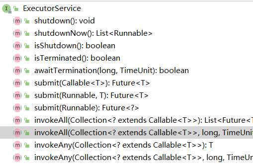
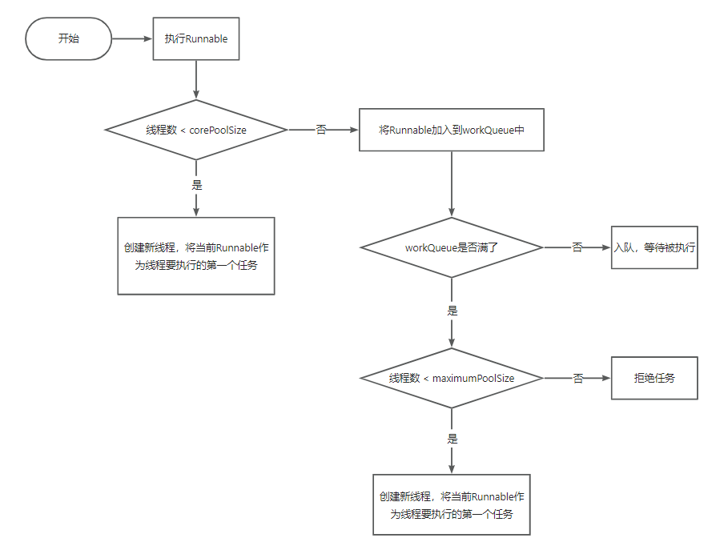

## Java线程池

JUC提供的ThreadPoolExecutor类

### 线程池是什么

线程池是一种池化思想管理线程的工具。

线程过多会带来额外的开销，其中包括**创建销毁线程的开销，调度线程的开销等等**，同时也降低了计算机的整体性能。

线程池维护了多个线程，等待管理者分配可并发执行的任务。

- **降低资源消耗**：通过池化技术重复利用已创建的线程，降低线程创建和销毁造成的损耗。
- **提高响应速度**：任务到达时，无需等待线程创建即可立即执行。
- **提高线程的可管理性**：线程是稀缺资源，如果无限制创建，不仅会消耗系统资源，还会因为线程的不合理分布导致资源调度失衡，降低系统的稳定性。使用线程池可以进行统一的分配、调优和监控。
- **提供更多更强大的功能**：线程池具备可拓展性，允许开发人员向其中增加更多的功能。比如延时定时线程池ScheduledThreadPoolExecutor，就允许任务延期执行或定期执行。


> **池化：**为了最大化收益并最小化风险，而将资源统一在一起管理的一种思想。

### 线程池解决的问题是什么？

在计算机领域中的表现为：统一管理IT资源，包括服务器、存储、和网络资源等等。通过共享资源，使用户在低投入中获益。除去线程池，还有其他比较典型的几种使用策略包括：

1. 内存池(Memory Pooling)：预先申请内存，提升申请内存速度，减少内存碎片。
2. 连接池(Connection Pooling)：预先申请数据库连接，提升申请连接的速度，降低系统的开销。
3. 实例池(Object Pooling)：循环使用对象，减少资源在初始化和释放时的昂贵损耗。

在了解完“是什么”和“为什么”之后，下面我们来一起深入一下线程池的内部实现原理。


### 线程池的核心设计与实现

前边我们了解到：线程池是一种通过池化思想，帮助我们管理线程而获取并发性的工具。在Java中的体现是`ThreadPoolExecutor`类。


#### 总体设计

Java中的线程池核心实现类是ThreadPoolExecutor，本章基于JDK 1.8的源码来分析Java线程池的核心设计与实现。我们首先来看一下ThreadPoolExecutor的UML类图，了解下ThreadPoolExecutor的继承关系。


ThreadPoolExecutor实现的顶层接口是Executor，顶层接口Executor提供了一种思想：**将任务提交和任务执行进行解耦。用户无需关注如何创建线程，如何调度线程来执行任务，用户只需提供Runnable对象，将任务的运行逻辑提交到执行器(Executor)中，由Executor框架完成线程的调配和任务的执行部分**。

```java
package java.util.concurrent;
public interface Executor {

    /**
     * Executes the given command at some time in the future.  The command
     * may execute in a new thread, in a pooled thread, or in the calling
     * thread, at the discretion of the {@code Executor} implementation.
     *
     * @param command the runnable task
     * @throws RejectedExecutionException if this task cannot be
     * accepted for execution
     * @throws NullPointerException if command is null
     */
    void execute(Runnable command);
}

```

ExecutorService接口增加了一些能力：（1）扩充执行任务的能力，补充可以为一个或一批异步任务生成Future的方法；（2）**提供了管控线程池的方法，比如停止线程池的运行**。AbstractExecutorService则是上层的抽象类，将执行任务的流程串联了起来，保证下层的实现只需关注一个执行任务的方法即可。最下层的实现类ThreadPoolExecutor实现最复杂的运行部分，ThreadPoolExecutor将会一方面维护自身的生命周期，另一方面同时管理线程和任务，使两者良好的结合从而执行并行任务。




ThreadPoolExecutor是如何运行，如何同时维护线程和执行任务的呢？其运行机制如下图所示：


线程池在内部实际上构建了一个生产者消费者模型，将线程和任务两者解耦，并不直接关联，从而良好的缓冲任务，复用线程。

#### 生命周期管理

线程池运行的状态，并不是用户显式设置的，而是伴随着线程池的运行，由内部来维护。线程池内部使用一个变量维护两个值：**运行状态(runState)和线程数量 (workerCount)**。在具体实现中，线程池将运行状态(runState)、线程数量 (workerCount)两个关键参数的维护放在了一起，如下代码所示：

```java
private final AtomicInteger ctl = new AtomicInteger(ctlOf(RUNNING, 0));
```

`ctl`这个AtomicInteger类型，是**对线程池的运行状态和线程池中有效线程的数量**进行控制的一个字段， 它同时包含两部分的信息：线程池的运行状态 (runState) 和线程池内有效线程的数量 (workerCount)，**高3位保存runState，低29位保存workerCount**，两个变量之间互不干扰。用一个变量去存储两个值，可避免在做相关决策时，出现不一致的情况，不必为了维护两者的一致，而占用锁资源。通过阅读线程池源代码也可以发现，经常出现要同时判断线程池运行状态和线程数量的情况。线程池也提供了若干方法去供用户获得线程池当前的运行状态、线程个数。这里都使用的是位运算的方式，相比于基本运算，速度也会快很多。


关于内部封装的获取生命周期状态、获取线程池线程数量的计算方法如以下代码所示：

```java
private static int runStateOf(int c)     { return c & ~CAPACITY; } //计算当前运行状态
private static int workerCountOf(int c)  { return c & CAPACITY; }  //计算当前线程数量
private static int ctlOf(int rs, int wc) { return rs | wc; }   //通过状态和线程数生成ctl
```


```java
11100000000000000000000000000000 RUNNING 111 -1
00000000000000000000000000000000 SHUTDOWN 000 0
00100000000000000000000000000000 STOP 001 1
01000000000000000000000000000000 TIDYING 010 2
01100000000000000000000000000000 TERMINATED 011 3
```

其生命周期转换如下入所示：


#### 任务执行机制

##### 任务调度

任务调度是线程池的主要入口，当用户提交了一个任务，接下来这个任务将如何执行都是由这个阶段决定的。

首先，所有任务的调度都是由execute方法完成的，这部分完成的工作是：检查现在线程池的运行状态、运行线程数、运行策略，决定接下来执行的流程，是直接申请线程执行，或是缓冲到队列中执行，亦或是直接拒绝该任务。其执行过程如下：

 

1. 首先检测线程池运行状态，如果不是RUNNING，则直接拒绝，线程池要保证在RUNNING的状态下执行任务。
2. 如果workerCount < corePoolSize，则创建并启动一个线程来执行新提交的任务。
3. 如果workerCount >= corePoolSize，且线程池内的阻塞队列未满，则将任务添加到该阻塞队列中。
4. 如果workerCount >= corePoolSize && workerCount < maximumPoolSize，且线程池内的阻塞队列已满，则创建并启动一个线程来执行新提交的任务。
5. 如果workerCount >= maximumPoolSize，并且线程池内的阻塞队列已满, 则根据拒绝策略来处理该任务, 默认的处理方式是直接抛异常。


##### 任务缓冲

任务缓冲模块是线程池能够管理任务的核心部分。线程池的本质是对任务和线程的管理，而做到这一点最关键的思想就是将任务和线程两者解耦，不让两者直接关联，才可以做后续的分配工作。线程池中是以生产者消费者模式，通过一个阻塞队列来实现的。阻塞队列缓存任务，工作线程从阻塞队列中获取任务。

阻塞队列(BlockingQueue)是一个**支持两个附加操作的队列**。这两个附加的操作是：**在队列为空时，获取元素的线程会等待队列变为非空**。**当队列满时，存储元素的线程会等待队列可用**。阻塞队列常用于生产者和消费者的场景，生产者是往队列里添加元素的线程，消费者是从队列里拿元素的线程。阻塞队列就是生产者存放元素的容器，而消费者也只从容器里拿元素。


使用不同的队列可以实现不一样的任务存取策略。在这里，我们可以再介绍下阻塞队列的成员：


##### 任务申请

##### 任务拒绝

任务拒绝模块是线程池的保护部分，线程池有一个最大的容量，当线程池的任务缓存队列已满，并且线程池中的线程数目达到maximumPoolSize时，就需要拒绝掉该任务，采取任务拒绝策略，保护线程池。

拒绝策略是一个接口，其设计如下：

```java
public interface RejectedExecutionHandler {
    void rejectedExecution(Runnable r, ThreadPoolExecutor executor);
}
```

用户可以通过实现这个接口去定制拒绝策略，也可以选择JDK提供的四种已有拒绝策略，其特点如下：


## ThreadPoolExecutor底层原理分析

 线程池执行任务的具体流程是怎样的？ 

ThreadPoolExecutor中提供了两种执行任务的方法：

```java
void execute(Runnable command)
Future<?> submit(Runnable task)
```

实际上submit中最终还是调用的execute()方法，只不过会返回一个Future对象，用来获取任务执行结果：

```java
public Future<?> submit(Runnable task) {
    if (task == null) throw new NullPointerException();
	RunnableFuture<Void> ftask = newTaskFor(task, null);
	execute(ftask);
	return ftask;
}
```

execute(Runnable command)方法执行时会分为三步：



注意：

1. 提交一个Runnable时，不管当前线程池中的线程是否空闲，只要数量小于核心线程数就会创建新线程。
2. ==ThreadPoolExecutor相当于是非公平的，比如队列满了之后提交的Runnable可能会比正在排队的Runnable先执行。==

## 线程池的五种状态 

线程池有五种状态：

- `RUNNING`：会接收新任务并且会处理队列中的任务
- `SHUTDOWN`：不会接收新任务并且会处理队列中的任务
- `STOP`：不会接收新任务并且不会处理队列中的任务，并且`会中断在处理的任务`（注意：一个任务能不能被中断得看任务本身）
- `TIDYING`：所有任务都终止了，线程池中也没有线程了，这样线程池的状态就会转为TIDYING，一旦达到此状态，就会调用线程池的terminated()
- `TERMINATED`：terminated()执行完之后就会转变为TERMINATED


这五种状态并不能任意转换，只会有以下几种转换情况：

- RUNNING -> SHUTDOWN：手动调用shutdown()触发，或者线程池对象GC时会调用finalize()从而调用shutdown()
- (RUNNING or SHUTDOWN) -> STOP：调用shutdownNow()触发，如果先调shutdown()紧着调shutdownNow()，就会发生SHUTDOWN -> STOP
- SHUTDOWN -> TIDYING：队列为空并且线程池中没有线程时自动转换
- STOP -> TIDYING：线程池中没有线程时自动转换（队列中可能还有任务）
- TIDYING -> TERMINATED：terminated()执行完后就会自动转换

## 线程池中的线程是如何关闭的？ 

我们一般会使用thread.start()方法来开启一个线程，那如何停掉一个线程呢？

Thread类提供了一个stop()，但是标记了@Deprecated，为什么不推荐用stop()方法来停掉线程呢？

因为stop()方法太粗暴了，一旦调用了stop()，就会直接停掉线程，但是调用的时候根本不知道线程刚刚在做什么，任务做到哪一步了，这是很危险的。

这里强调一点，`stop()会释放线程占用的synchronized锁（不会自动释放ReentrantLock锁，这也是不建议用stop()的一个因素）`。

```java
package com.zhouyu;

import java.util.concurrent.locks.ReentrantLock;

/**
 * 作者：周瑜大都督
 */
public class ThreadTest {

    static int count = 0;
    static final Object lock = new Object();
    static final ReentrantLock reentrantLock = new ReentrantLock();

    public static void main(String[] args) throws InterruptedException {

        Thread thread = new Thread(new Runnable() {
            public void run() {
//                synchronized (lock) {
                reentrantLock.lock();
                    for (int i = 0; i < 100; i++) {
                        count++;
                        try {
                            Thread.sleep(1000);
                        } catch (InterruptedException e) {
                            throw new RuntimeException(e);
                        }
                    }
//                }
                reentrantLock.unlock();
            }
        });

        thread.start();

        Thread.sleep(5*1000);

        thread.stop();
//
//        Thread.sleep(5*1000);

        reentrantLock.lock();
        System.out.println(count);
        reentrantLock.unlock();

//        synchronized (lock) {
//            System.out.println(count);
//        }


    }
}

```

所以，我们建议通过自定义一个变量，或者通过中断来停掉一个线程，比如：

```java
public class ThreadTest {

    static int count = 0;
    static boolean stop = false;

    public static void main(String[] args) throws InterruptedException {

        Thread thread = new Thread(new Runnable() {
            public void run() {

                for (int i = 0; i < 100; i++) {
                    if (stop) {
                        break;
                    }

                    count++;
                    try {
                        Thread.sleep(1000);
                    } catch (InterruptedException e) {
                        throw new RuntimeException(e);
                    }
                }
            }
        });

        thread.start();

        Thread.sleep(5 * 1000);

        stop = true;

        Thread.sleep(5 * 1000);


        System.out.println(count);


    }
}
```


不同点在于，当我们把stop设置为true时，线程自身可以控制到底要不要停止，何时停止，同样，我们可以调用thread的interrupt()来中断线程：

```java
public class ThreadTest {

    static int count = 0;
    static boolean stop = false;

    public static void main(String[] args) throws InterruptedException {

        Thread thread = new Thread(new Runnable() {
            public void run() {

                for (int i = 0; i < 100; i++) {
                    if (Thread.currentThread().isInterrupted()) {
                        break;
                    }

                    count++;
                    try {
                        Thread.sleep(1000);
                    } catch (InterruptedException e) {
                        break;
                    }
                }
            }
        });

        thread.start();

        Thread.sleep(5 * 1000);

        thread.interrupt();

        Thread.sleep(5 * 1000);


        System.out.println(count);
    }
}
```

不同的地方在于，线程sleep过程中如果被中断了会接收到异常。

讲了这么多，其实线程池中就是通过interrupt()来停止线程的，比如shutdownNow()方法中会调用：


https://www.yuque.com/renyong-jmovm/dadudu/yr8whnbyynnzqe3g#kHefh


 线程池为什么一定得是阻塞队列？ 

线程池中的线程在运行过程中，执行完创建线程时绑定的第一个任务后，就会不断的从队列中获取任务并执行，那么如果队列中没有任务了，线程为了不自然消亡，就会阻塞在获取队列任务时，等着队列中有任务过来就会拿到任务从而去执行任务。


通过这种方法能最终确保，线程池中能保留指定个数的核心线程数，关键代码为：


某个线程在从队列获取任务时，会判断是否使用超时阻塞获取，我们可以认为非核心线程会poll()，核心线程会take()，非核心线程超过时间还没获取到任务后面就会自然消亡了。


 线程发生异常，会被移出线程池吗？ 

答案是会的，那有没有可能核心线程数在执行任务时都出错了，导致所有核心线程都被移出了线程池？


WT.INTERRUPT();

TRY {

 BEFOREEXECUTE(WT, TASK);

TRY {

TASK.RUN(

 AFTEREXECUTE(TASK, T:NULL);

L

(THROWABLE EX) {

CATCH

AFTEREXECUTE(TASK, EX);

THROW

E

L

FINALLY

; NULL;

TASK

W.COMPLETEDTASKS++;

W.UNLOCK();

 COMPLETEDABRUPTLY 三 FALSE;

} FINALLY

PROCESSWORKEREXIT(W, COMPLETEDABRUPTLY);


在源码中，当执行任务时出现异常时，最终会执行processWorkerExit()，执行完这个方法后，当前线程也就自然消亡了，但是！processWorkerExit()方法中会额外再新增一个线程，这样就能维持住固定的核心线程数。

 Tomcat是如何自定义线程池的？ 

Tomcat中用的线程池为org.apache.tomcat.util.threads.ThreadPoolExecutor，注意类名和JUC下的一样，但是包名不一样。


Tomcat会创建这个线程池：


注入传入的队列为TaskQueue，它的入队逻辑为：


特殊在：

●入队时，如果线程池的线程个数等于最大线程池数才入队

●入队时，如果线程池的线程个数小于最大线程池数，会返回false，表示入队失败


这样就控制了，Tomcat的这个线程池，在提交任务时：

1仍然会先判断线程个数是否小于核心线程数，如果小于则创建线程

2如果等于核心线程数，会入队，但是线程个数小于最大线程数会入队失败，从而会去创建线程


所以随着任务的提交，会优先创建线程，直到线程个数等于最大线程数才会入队。


当然其中有一个比较细的逻辑是：在提交任务时，如果正在处理的任务数小于线程池中的线程个数，那么也会直接入队，而不会去创建线程，也就是上面源码中getSubmittedCount的作用。


 线程池的核心线程数、最大线程数该如何设置？ 

我们都知道，线程池中有两个非常重要的参数：

1corePoolSize：核心线程数，表示线程池中的常驻线程的个数

2maximumPoolSize：最大线程数，表示线程池中能开辟的最大线程个数


那这两个参数该如何设置呢？


我们对线程池负责执行的任务分为三种情况：

1CPU密集型任务，比如找出1-1000000中的素数

2IO密集型任务，比如文件IO、网络IO

3混合型任务


CPU密集型任务的特点时，线程在执行任务时会一直利用CPU，所以对于这种情况，就尽可能避免发生线程上下文切换。


比如，现在我的电脑只有一个CPU，如果有两个线程在同时执行找素数的任务，那么这个CPU就需要额外的进行线程上下文切换，从而达到线程并行的效果，此时执行这两个任务的总时间为：


任务执行时间*2+线程上下文切换的时间


而如果只有一个线程，这个线程来执行两个任务，那么时间为：


任务执行时间*2


所以对于CPU密集型任务，线程数最好就等于CPU核心数，可以通过以下API拿到你电脑的核心数：


只不过，为了应对线程执行过程发生缺页中断或其他异常导致线程阻塞的请求，我们可以额外在多设置一个线程，这样当某个线程暂时不需要CPU时，可以有替补线程来继续利用CPU。


所以，对于CPU密集型任务，我们可以设置线程数为：CPU核心数+1


我们在来看IO型任务，线程在执行IO型任务时，可能大部分时间都阻塞在IO上，假如现在有10个CPU，如果我们只设置了10个线程来执行IO型任务，那么很有可能这10个线程都阻塞在了IO上，这样这10个CPU就都没活干了，所以，对于IO型任务，我们通常会设置线程数为：2*CPU核心数


不过，就算是设置为了2*CPU核心数，也不一定是最佳的，比如，有10个CPU，线程数为20，那么也有可能这20个线程同时阻塞在了IO上，所以可以再增加线程，从而去压榨CPU的利用率。


通常，如果IO型任务执行的时间越长，那么同时阻塞在IO上的线程就可能越多，我们就可以设置更多的线程，但是，线程肯定不是越多越好，我们可以通过以下这个公式来进行计算： 

线程数 = CPU核心数   *（ 1 + 线程等待时间 / 线程运行总时间 ）


●线程等待时间：指的就是线程没有使用CPU的时间，比如阻塞在了IO

●线程运行总时间：指的是线程执行完某个任务的总时间


我们可以利用jvisualvm抽样来估计这两个时间：

起始页

COM.ZHOUYU.APP(PID 4596)

6  抽样器

PROFILEX

概述

监视

线程

COM. ZHOUYU. APP (PID 4596)

设置

抽样器

抽样:

停止

内存

CPU

状态:

抽样处于非活动状态

线程CPU时间

CPU 样例

快照

线程 DUMP

自用时间[5]

总时间(CPU)

自用时间(CPU)

自用时间

热点-方法

总时间

538,948 MS

452,289 MS (83.9%)

86.873MS

214 MS

COM.ZHOUYU.CPUTASK.RUM()

86.507MS(10.19)1

86,507 MS

COM. ZHOUYU.CPUIASK.ISRXIME (/

151 MS   (0%)

86.658 MS

151 MS

86.658 MS

COM.ZHOUYU.CPUTASK,COWNTPRIMES()

0.000 MS

0.000 MS

0.000 MS   (0%)

0.000 MS

COM.ZHOUYU.APP.MAIN()

0.000 MS

0.000 MS

0.000 MS

COM.INTELLIJ.RT.EXECUTION APPLICATION APPLLAINV2$1.RUN

0.000 MS  (0%)


图中表示，在刚刚这次抽样过程中，run()总共的执行时间为538948ms，利用了CPU的时间为86873ms，所以没有利用CPU的时间为538948ms-86873ms。


所以我们可以计算出：

线程等待时间 = 538948ms-86873ms

线程运行总时间 = 538948ms


所以：线程数 = 8   *（ 1 + （538948ms-86873ms） / 538948ms ）= 14.xxx


所以根据公式算出来的线程为14、15个线程左右。


按上述公式，如果我们执行的任务IO密集型任务，那么：线程等待时间 = 线程运行总时间，所以：

线程数 = CPU核心数   *（ 1 + 线程等待时间 / 线程运行总时间 ）

​           = CPU核心数   *（ 1 + 1 ）

​    = CPU核心数   *  2


以上只是理论，实际工作中情况会更复杂，比如一个应用中，可能有多个线程池，除开线程池中的线程可能还有很多其他线程，或者除开这个应用还是一些其他应用也在运行，所以实际工作中如果要确定线程数，最好是压测。


比如我写了一个：


这个接口会执行1s，我现在利用apipost来压：

LOCALHOST:8080/TEST

发送

GET

NEW

BODY认证预执行脚本

HEADER

一键压测

QUERY

真正压测高并发,单机支持1000并发无压力!本模块已开源

使用说明

QITHUB欢迎STAR

轮次:

并发数:

5

压测总请求为5000,执行超过10分钟将自动终止

开始压测

1000

压测结果:新建接口

执行时间(S)

总请求数

错误率

失败请求数

成功请求数

总结接收数据(M)

0

0.03

0.00%

25.73

5000

5000

每秒成功请求数

每秒请求数

每秒接收字节数(M)

194.34

0.00

194.34

最小响应时间(MS)

最大响应时间(MS)

平均响应时间(MS)

4727.53

20.00

5448.00

99.90%(MS)

90.00%(MS)

99.00%(MS)

95.00%(MS)

99.99%(MS)

75.00%(MS)

10.00%(MS)

25.00%(MS)

50.00%(MS)

5419

5093

5127

5441

3373

5077

5064

5047

5444


这是在Tomcat默认最大200个线程的请求下的压测结果。


当我们把线程数调整为500：


Java

1

server.tomcat.threads.max=500

真正压测高并发,单机支持1000并发无压力!本模块已开源

使用说明

GITHUB欢迎STAR

并发数:

轮次:

压测总请求为5000,执行超过10分钟将自动终止

开始压测

1000

压测结果:新建接口

总请求数

总结接收数据(M)

执行时间(S)

错误率

失败请求数

成功请求数

0.03

5000

11.96

2.10%

4895

105

每秒成功请求数

每秒请求数

每秒接收字节数(M)

0.00

418.10

418.10

平均响应时间(MS)

最小响应时间(MS)

最大响应时间(MS)

4038.00

20.00

2180.51

95.00%(MS)

25.00%(MS)

90.00%(MS)

99.90%(MS)

50.00%(MS)

99.99%(MS)

75.00%(MS)

99.00%(MS)

10.00%(MS)

3077

2061

2998

3803

1431

1863

3969

4003

2472


发现执行效率提高了一倍，假如再增加线程数到1000：

并发数:

轮次:

压测总请求为5000,执行超过10分钟将自动终止

1000

开始压测

压测结果:新建接口

错误率

执行时间(S)

总请求数

总结接收数据(M)

失败请求数

成功请求数

25.36%

3732

0.02

5000

18.34

1268

每秒接收字节数(M)

每秒成功请求数

每秒请求数

0.00

272.59

272.59

最大响应时间(MS)

最小响应时间(MS)平

平均响应时间(MS)

20.00

9742.00

3368.49

75.00%(MS)

99.99%(MS)

99.00%(MS)

25.00%(MS)

10.00%(MS)

90.00%(MS)

95.00%(MS)

99.90%(MS)

50.00%(MS)

2168

5115

2724

3934

8794

4736

9636

3109

9523


性能就降低了。


总结，我们再工作中，对于：

1CPU密集型任务：CPU核心数+1，这样既能充分利用CPU，也不至于有太多的上下文切换成本

2IO型任务：建议压测，或者先用公式计算出一个理论值（理论值通常都比较小）

3对于核心业务（访问频率高），可以把核心线程数设置为我们压测出来的结果，最大线程数可以等于核心线程数，或者大一点点，比如我们压测时可能会发现500个线程最佳，但是600个线程时也还行，此时600就可以为最大线程数

4对于非核心业务（访问频率不高），核心线程数可以比较小，避免操作系统去维护不必要的线程，最大线程数可以设置为我们计算或压测出来的结果。
