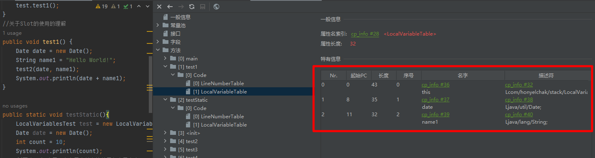

# 概述

1. 为什么说Java是跨平台的语言
   - 当Java源代码成功编译为字节码后。如果想在不同的平台上运行，无须再次编译。
2. JVM：跨语言的平台
   1. 
   2. Java虚拟机不和包括Java在内的任何语言绑定，他只与"Class文件"这种特定的二进制文件格式关联。**根本不关心运行在其内部的程序到底是使用何种编程语言编写的**，它只关心“字节码”文件。换句话说，只要语言能够将源代码编译为正确的Class文件，那就能够在JVM上执行。Java不是最强大的语言，但是JVM是最强大的虚拟机。

2. 有哪些JVM
   - Sun Classic VM  -->解释型
   - SUN公司的 HotSpot VM
   - BEA 的 JRockit  --> 不包含解释器，服务器端，JMC
   - IBM 的 J9
   - Microsoft JVM
   - TaobaoJVM
   -  Graal VM --> 2018年,**“Run Programs Faster Anywhere”**
     - 


# JVM的组成部分

## 简图


这个架构可以分成三层看：

- 最上层：javac编译器将编译好的字节码class文件，通过java 类装载器执行机制，把对象或class文件存放在 jvm划分的内存区域。
- 中间层：称为Runtime Data Area，主要是在Java代码运行时用于存放数据的，从左至右为方法区(永久代(1.7)、元数据区(1.8))、堆(共享,GC回收对象区域)、栈、程序计数器、寄存器、本地方法栈(私有)。
- 最下层：解释器、JIT(just in time)编译器和 GC（Garbage Collection，垃圾回收器）


## 详细图


# 一、字节码文件

## 1.1 字节码文件怎么来的？


- 前端编译器的主要任务就是负责将符合Java语法规范的Java代码转换为符合JVM规范的字节码。
- `javac`是一种能够将Java源码编译为字节码的前端编译器。它在将Java源码编译为一个有效的字节码文件的过程中经历了**词法解析**、**语法解析**、**语义解析以及生成字节码**。


# 一、运行时数据区域

 

[](https://camo.githubusercontent.com/397eed8a3eff96cc19cedbee1f20f100afaf6295/68747470733a2f2f63732d6e6f7465732d313235363130393739362e636f732e61702d6775616e677a686f752e6d7971636c6f75642e636f6d2f35373738643131332d386531332d346335332d623562662d3830316535383038306239372e706e67)


## 程序计数器

记录正在执行的虚拟机字节码指令的地址（如果正在执行的是本地方法则为空）。


## Java 虚拟机栈

每个 Java 方法在执行的同时会创建一个栈帧用于**存储局部变量表、操作数栈、常量池引用等信息**。从方法调用直至执行完成的过程，对应着一个栈帧在 Java 虚拟机栈中入栈和出栈的过程。

[](https://camo.githubusercontent.com/96d3e63fbdedc3e6af5f8365815898bef9799ea3/68747470733a2f2f63732d6e6f7465732d313235363130393739362e636f732e61702d6775616e677a686f752e6d7971636c6f75642e636f6d2f38343432353139662d306234642d343866342d383232392d3536663938343336336336392e706e67)


可以通过 -Xss 这个虚拟机参数来指定每个线程的 Java 虚拟机栈内存大小，在 JDK 1.4 中默认为 256K，而在 JDK 1.5+ 默认为 1M：

```shell
java -Xss2M HackTheJava
```

该区域可能抛出以下异常：

- 当线程请求的栈深度超过最大值，会抛出 StackOverflowError 异常；
- 栈进行动态扩展时如果无法申请到足够内存，会抛出 OutOfMemoryError 异常。


### 栈帧


### 栈帧-局部变量表

- 局部变量表也被称之为局部变量数组或本地变量表。
- 定义为一个数字数组，主要用于存储方法参数和定义在方法体内的局部变量，这些数据类型包括各类基本数据类型（8种）、对象引用（reference），以及
  returnAddress类型。
- 局部变量表所需的容量**大小是在编译期确定下来的**，并保存在方法的code属性的maximum local variabls数据项中。**在方法运行期间是不会改变局部变量表的大小的。**
  - 
  - 成员方法的局部变量表中包含`this`，静态方法不包含。
  - `long、double`类型在局部变量表中占两个slot
  - 不同作用域的变量可能会发生位置的复用。
    - 
- **方法嵌套调用的次数由栈的大小决定。**一般来说，栈越大，方法嵌套调用次数越多。对一个函数而言，它的参数和局部变量越多，使得局部变量表膨胀它的栈帧就越大，以满足方法调用所需传递的信息增大的需求。进而函数调用就会占用更多的栈空间，导致其嵌套调用次数就会减少。
- **局部变量表中的变量只在当前方法调用中有效。**在方法执行时，虚拟机通过使用局部变量表完成参数值到参数变量列表的传递过程。**当方法调用结束后，随着方法栈帧的销毁，局部变量表也会随之销毁。**


#### 补充问题

1. 与GC root的关系
   1. 局部变量表中的变量也是重要的垃圾回收根节点，只要被局部变量表中直接或间接引用的对象都不会被回收。

### 栈帧-操作数栈

主要用于保存计算过程的中间结果，同时作为计算过程中变量临时的存储空间。

不存在垃圾回收，只存在存储。

在编译的时候就可以确定好操作数栈的最大的深度。


#### 栈顶缓存技术

前面提过，基于栈式架构的虚拟机所使用的零地址指令更加紧凑，但完成一项操作的时候必然需要使用更多的入栈和出栈指令，这同时也就意味着将需要更多的指令分派（instructiondispatch）次数和内存读/写次数。

由于操作数是存储在内存中的，**因此频繁地执行内存读/写操作必然会影响执行速度**。为了解决这个问题，HotSpotJVM的设计者们提出了**栈顶缓存**（ToS，Top-of-Stack Cashing）技术，将栈顶元素全部缓存在物理cPU的寄存器中，以此降低对内存的读/写次数，提升执行引擎的执行效率。！

### 栈帧-动态链接 

动态链接（或指向运行时常量池的方法引用）


1. 每一个栈帧内部包含一个指向运行时常量池中该栈帧所属方法的引用，包含这个引用的目的就是为了支持当前方法的代码能够实现动态链接
2. 在java源文件被编译到字节码文件中时，所有的变量和方法引用都作为符号引用（Symbolic Reference）保存在class文件的常量池里。比如：描述一个方法调用了另外的其他方法时，就是通过常量池中指向方法的符号引用来表示的，那么动态链接的作用就是为了将这些符号引用转换为调用方法的直接引用。
3. 为什么需要常量池？
   1. 提供一些符号和常量，便于指令的识别。


> 在JVM中，将符号引用转换为调用方法的直接引用与方法的绑定机制相关。
> **静态链接：**
> 当一个字节码文件被装载进IVM内部时，如果被调用的目标方法在编译期可知，且运行期保持不变时。这种情况下将
> 调用方法的符号引用转换为直接引用的过程称之为静态链接，
> **动态链接：**
> 如果被调用的方法在编译期无法被确定下来，也就是说，只能够在程序运行期将调用方法的符号引用转换为直接引用
> ，由于这种引用转换过程具备动态性，因此也就被称之为动态链接。
>
> 对应的方法的绑定机制为：早期绑定（EarlvBinding）和晚期绑定（LateBinding）。绑定是一个字段、方法或者
> 类在符号引用被替换为直接引用的过程，这仅仅发生一次。
> **早期绑定：**
> 早期绑定就是指被调用的目标方法如果在编译期可知，且运行期保持不变时，即可将这个方法与所属的类型进行绑定
> ，这样一来，由于明确了被调用的目标方法究竞是哪一个，因此也就可以使用静态链接的方式将符号引用转换为直接
> 引用。
> **晚期绑定：**
> 如果被调用的方法在编译期无法被确定下来，只能够在程序运行期根据实际的类型绑定相关的方法，这种绑定方式也
> 就被称之为晚期绑定。

### 栈帧-方法返回地址

存放调用该方法的pc寄存器的值。

一个方法的结束，有两种方式：

- 正常执行完成
- 出现未处理的异常，非正常退出

无论通过哪种方式退出，在方法退出后都返回到该方法被调用的位置。方法正常退出时，调用者的pc计数器的值作为返回地址，即调用该方法的指令的下一条指令的地址。而通过异常退出的，返回地址是要通过异常表来确定，栈顺中一般不会保存这部分信息。当一个方法开始执行后，只有两种方式可以退出这个方法：

1、执行引擎遇到任意一个方法返回的字节码指令（return），会有返回值传递给上层的方法调用者，简称正常完成出口：一个方法在正常调用完成之后究意需要使用哪一个返回指令还需要根据方法返回值的实际数据类型而定。

### 问题小结


------

## 本地方法栈

本地方法栈与 Java 虚拟机栈类似，它们之间的区别只不过是**本地方法栈为本地方法服务**。

本地方法一般是用其它语言（C、C++ 或汇编语言等）编写的，并且被编译为基于本机硬件和操作系统的程序，对待这些方法需要特别处理。


简单地讲，一个Native Method就是**一个Java调用非Java代码的接口**。

一个NativeMethod是这样一个Java方法：**该方法的实现由非Java语言实现**，比如c。这个特征并非Java所特有，很多其它的编程语言都有这一机制，比如

C++中，你可以用extern"c"告知C++编译器去调用一个c的函数。

"A native method is a Java method whose implementation is provided by non-java code.'

在定义一个nativemethod时，并不提供实现体（有些像定义一个Javainterface），因为其实现体是由非java语言在外面实现的。

本地接口的作用是融合不同的编程语言为Java所用，它的初衷是融合C/C++程序。

当某个线程调用一个本地方法时，它就进入了一个全新的并且不再受虚拟机限制的世界。它和虚拟机拥有同样的权限，本地方法可以通过本地方法接口米访问虚拟机内部的运行时数据区。，它甚至可以直接使用本地处理器中的寄存器，直接从本地内存的堆巾分配任意数量的内存。

## 方法区

用于**存放已被加载的类信息**、**常量**、**静态变量、即时编译器编译后的代码等数据。**

和堆一样不需要连续的内存，并且可以动态扩展，动态扩展失败一样会抛出 OutOfMemoryError 异常。

对这块区域进行垃圾回收的主要目标是**对常量池的回收和对类的卸载**，但是一般比较难实现。

HotSpot 虚拟机把它当成永久代来进行垃圾回收。但很难确定永久代的大小，因为它受到很多因素影响，并且每次 Full GC 之后永久代的大小都会改变，所以经常会抛出 OutOfMemoryError 异常。为了更容易管理方法区，从 JDK 1.8 开始，移除永久代，并把方法区移至元空间，它位于本地内存中，而不是虚拟机内存中。

方法区是一个 JVM 规范，**永久代与元空间都是其一种实现方式。**在 JDK 1.8 之后，原来永久代的数据被分到了堆和元空间中。元空间存储类的元信息，静态变量和常量池等放入堆中。

## 运行时常量池

运行时常量池是方法区的一部分。

Class 文件中的常量池（编译器生成的字面量和符号引用）会在类加载后被放入这个区域。

除了在编译期生成的常量，还允许动态生成，例如 String 类的 intern()。

## 直接内存

在 JDK 1.4 中新引入了 NIO 类，它可以使用 Native 函数库直接分配堆外内存，然后通过 Java 堆里的 DirectByteBuffer 对象作为这块内存的引用进行操作。这样能在一些场景中显著提高性能，因为避免了在堆内存和堆外内存来回拷贝数据。


## 堆 Heap

#### 概念

一个JVM实例只存在一个堆内存，堆也是JaVa内存管理的核心区域。

Java堆区在JVM启动的时候即被创建，其空间大小也就确定了。是JVM管理的最大一块内存空间。

堆内存的大小是可以调节的。《Java虚拟机规范》规定，堆可以处于物理上不连续的内存空间中，但在逻辑上它应该被视为连续的。，堆，是Gc（GarbageCollection，垃圾收集器）执行垃圾回收的重点区域。

在方法结束后，堆中的对象不会马上被移除，**仅仅在垃圾收集的时候才会被移除。**


> **对象都分配在堆上？**
>
> 《Java虚拟机规范》中对Java堆的描述是：所有的对象实例以及数组都应当在运行时分配在堆上。（The heap is the run-time data area from which memory forallclassinstancesandarrays is allocated）数组和对象可能永远不会存储在栈上，因为栈顺中保存引用，这个引用指向对象或者数组在堆中的位置。
> 我要说的是：“几乎”所有的对象实例都在这里分配内存。一一从实际使用角度看的。


**所有对象都在这里分配内存**，是垃圾收集的主要区域（"GC 堆"）。

- 新生代（Young Generation）
- 老年代（Old Generation）

堆不需要连续内存，并且可以动态增加其内存，增加失败会抛出 OutOfMemoryError 异常。

可以通过 -Xms 和 -Xmx 这两个虚拟机参数来指定一个程序的堆内存大小，第一个参数设置初始值，第二个参数设置最大值。

```shell
java -Xms1M -Xmx2M HackTheJava
```

#### 结构


7 堆内存**逻辑**上分为：新生+养老+永久


8 堆内存**逻辑**上分为：新生+养老+元空间


堆内存物理上分为：新生+养老


**GC：**

1. Eden满了，开启

   ​	GC = YGC = 轻GC

   ​	基本全部清空

2. Old满了，开启

   Full GC = FGC

   Full GC 多次，发现养老区空间没办法腾出去

3.  


MinorGC的过程(复制->清空->互换)


### 对象分配金句

为新对象分配内存是一件非常严谨和复杂的任务，JVM的设计者们不仅需要考虑内存如何分配，在明哪单分配等问题，并目由于内存分配算法与内存同收算法密切相关，所以还需要考虑GC执行完内存回收后是否会在内存空间中产生内存碎片。

**金句：**

- 针对幸存者s0、s1区的总结：复制之后有交换，谁空谁是to。
- 关于垃圾回收
  - 频繁在新生区收集
  - 很少在养老区收集
  - 几乎不在永久区/元空间收集。


1.new的对象先放伊甸园区。此区有大小限制。
2，当伊甸园的空间填满时，程序又需要创建对象，JVM的垃圾回收器将对伊甸园区进行垃圾回
收（MinorGC/YGC），将伊甸园区中的不再被其他对象所引用的对象进行销毁。再加载新的对
象放到伊甸园区
3.然后将伊甸园中的剩余对象移动到幸存者0区。
4.如果再次触发垃圾回收，此时上次幸存下来的放到幸存者区的，如果没有回收，就会放到
幸存者1区。
5.如果再次经历垃圾回收，此时会重新放回幸存者0区，接着再去幸存者1区。
6，啥时候能去养老区呢？可以设置次数。默认是15次。
可以设置参数：-XX：MaxTenuringThreshold=<N>设置对象晋升老年代的年龄阈值
I
7.在养老区，相对悠闲。当养老区内存不足时，再次触发GC：MajorGC，进行养老区的内存
清理。
8.若养老区执行了MaiorGc之后发现依然无法进行对象的保存，就会产生ooM异常
java.lang.outofMemoryError:Javaheapspace


内存分配策略（或对象提升（promotion）规则）：
如果对象在Eden出生并经过第一次MinorGc后仍然存活，并且能被Survivor容纳的话，
将被移动到survivor空间中，并将对象年龄设为1。对象在survivor区中每熬过一次
MinorGC，年龄就增加1岁，当它的年龄增加到一定程度（默认为15岁，其实每个JVM、每
个GC都有所不同）时，就会被晋升到老年代巾。


针对不同年龄段的对象分配原如下所示：

- 优先分配到Eden
- 大对象直接分配到老年代
  - 尽量避免程序中出现过多的大对象
- 长期存活的对象分配到老年代
- 动态对象年龄判断
  - 如果Survivor区中相同年龄的所有对象大小的总和大于Survivor空间的一半，年
    龄大于或等于该年龄的对象可以直接进入老年代，无须等到
    MaxTenuringThreshold中要求的年龄。
- 空间分配担保
  -XX:HandlePromotionFailure


> XX:HandlePromotionFailure
> 在发生MinorGc之前，虚拟机会检查老年代最大可用的连续空间是否大于新生代所有对象的
> 总空间，
> 如果大于，则此次MinorGc是安全的
> 如果小于，则虚拟机会查看-xx：HandlePromotionFailure设置值是否允许担保失败
> 如果HandlePromotionFailure=true，那么会继续检查老年代最大可用连续空间是否
> 大于历次晋升到老年代的对象的平均大小，如果大于，则尝试进行一次MinorGC，但这
> 次MinorGc依然是有风险的：如果小于或者HandlePromotionFailure=false，则改
> 为进行一次Ful1 GC。
> 在JDK6Update24之后，HandlePromotionFailure参数不会再影响到虚拟机的空间分配
> 担保策略，观察openJDK中的源码变化，虽然源码中还定义了HandlePromotionFailure参
> 数，但是在代码中已经不会再使用它。JDK6Update24之后的规则变为只要老年代的连续
> 空间大于新生代对象总大小或者历次晋升的平均大小就会进行MinorGc，否则将进行Full
> GC。


### OOM如何解决

1、要解决ooM异常或heapspace的异常，一般的手段是首先通过内存映像分析工具（如
EclipseMemoryAnalyzer）对dump出来的堆转储快照进行分析，重点是确认内存中的对
象是否是必要的，也就是要先分清楚到底是出现了内存泄漏（MemoryLeak）还是内存溢出（
Memory overflow)。
2、如果是内存泄漏，可进一步通过工具查看泄漏对象到GCRoots的引用链。于是就能找到
泄漏对象是通过怎样的路径与GCRoots相关联并导致垃圾收集器无法自动回收它们的。掌握
厂泄漏对象的类型信息，以及GCRootS引用链的信息，就可以比较准确地定位出泄漏代码的
位置。
3、如果不存在内存泄漏，换句话说就是内存中的对象确实都还必须存活着，那就应当检香虚
拟机的堆参数（-Xmx与-Xms），与机器物理内存对比看是否还可以调大，从代码上检查是否
存在某些对象生命周期过长、持有状态时间过长的情况，尝试减少程序运行期的内存消耗

### 堆参数调优


-Xss初试栈大小

-Xms初始值大小

-Xmx最大值大小

1. 生产环境下 两者要一样，避免内存忽大忽小产生停顿。
   1. 避免GC最大内存
2. 


### GC是什么


### GC

先GC 后Full GC


**FullGC比GC慢10倍一样，因为 老年代占2/3**


### 垃圾回收算法

分代收集算法，针对每一代使用适合他的算法。没有最好的，只有最合适的。

- 引用计数法
  - 每次对对象赋值都要维护引用计数器，且计数器本身也有一定的小号
  - 较难处理循环引用。
- 复制算法==新生代==
  - 将内存分为两块，每次只用其中一块，当这一块内存用完，就将还活着的对象复制到另外一块上面。复制算法不会产生内存碎片，缺点是耗空间。
  - eden区对象存活率很低。
- 标记清除==老年代==
  - 一般是由标记清除或者是标记清除与标记整理的混合
  - 先标记出要回收的对象，然后统一回收这些对象。
  - 两次扫描、号是严重，会产生内存碎片。
  - 
- 标记压缩
  - 老年代一般是有整理清除或者整理清除与标记整理的混合实心球。
  - 
  - 理论上最好的办法，但是耗时。
  - GC运行时，程序会暂停。
  - 


实际中：

- 内存效率：复制算法>标记清除算法>标记整理算法

- 内存整齐度：复制算法=标记整理算法>标记清除算法

- 内存利用率：标记整理算法=标记清除算法>复制算法


禁用`system.gc()`

  

#### JMM

`volatile`是JVM提供的轻量级的同步机制

	- 保证可见性
	- **不保证原子性**
	- 禁止指令重排

​	说难听一点就是乞丐版的synorized

特点：

- 可见性
- 原子性
- VolatileDemo代码演示
- 有序性


Cpu>内存>磁盘

由于JVM运行程序的实体是线程，而每个线程创建时JVM都会为其创建和一个工作内存(有些地方成为栈空间)


# 二、垃圾收集

垃圾收集主要是针对堆和方法区进行。程序计数器、虚拟机栈和本地方法栈这三个区域属于线程私有的，只存在于线程的生命周期内，线程结束之后就会消失，因此不需要对这三个区域进行垃圾回收。

## 判断一个对象是否可被回收

### 1. 引用计数算法

为对象添加一个引用计数器，当对象增加一个引用时计数器加 1，引用失效时计数器减 1。引用计数为 0 的对象可被回收。

在**两个对象出现循环引用的情况下，此时引用计数器永远不为 0，导致无法对它们进行回收**。正是因为循环引用的存在，因此 Java 虚拟机不使用引用计数算法。

```
public class Test {

    public Object instance = null;

    public static void main(String[] args) {
        Test a = new Test();
        Test b = new Test();
        a.instance = b;
        b.instance = a;
        a = null;
        b = null;
        doSomething();
    }
}
```

在上述代码中，a 与 b 引用的对象实例互相持有了对象的引用，因此当我们把对 a 对象与 b 对象的引用去除之后，由于两个对象还存在互相之间的引用，导致两个 Test 对象无法被回收。

### 2. 可达性分析算法

以 GC Roots 为起始点进行搜索，可达的对象都是存活的，不可达的对象可被回收。

Java 虚拟机使用该算法来判断对象是否可被回收，GC Roots 一般包含以下内容：

- 虚拟机栈中局部变量表中引用的对象
- 本地方法栈中 JNI 中引用的对象
- 方法区中类静态属性引用的对象
- 方法区中的常量引用的对象

[](https://camo.githubusercontent.com/cb90e2d0a060faebea7b237b57902247bc0ecbb1/68747470733a2f2f63732d6e6f7465732d313235363130393739362e636f732e61702d6775616e677a686f752e6d7971636c6f75642e636f6d2f38336439303964322d333835382d346665312d386666342d3136343731646230623138302e706e67)


### 3. 方法区的回收

因为方法区主要存放永久代对象，而永久代对象的回收率比新生代低很多，所以在方法区上进行回收性价比不高。

主要是对常量池的回收和对类的卸载。

为了避免内存溢出，在大量使用反射和动态代理的场景都需要虚拟机具备类卸载功能。

类的卸载条件很多，需要满足以下三个条件，并且满足了条件也不一定会被卸载：

- 该类所有的实例都已经被回收，此时堆中不存在该类的任何实例。
- 加载该类的 ClassLoader 已经被回收。
- 该类对应的 Class 对象没有在任何地方被引用，也就无法在任何地方通过反射访问该类方法。

### 4. finalize()

类似 C++ 的析构函数，用于关闭外部资源。但是 try-finally 等方式可以做得更好，并且**该方法运行代价很高，不确定性大，无法保证各个对象的调用顺序**，因此最好不要使用。

当一个对象可被回收时，如果需要执行该对象的 finalize() 方法，那么就有可能在该方法中让对象重新被引用，从而实现自救。自救只能进行一次，如果回收的对象之前调用了 finalize() 方法自救，后面回收时不会再调用该方法。

## 引用类型


无论是通过引用计数算法判断对象的引用数量，还是通过可达性分析算法判断对象是否可达，判定对象是否可被回收都与引用有关。

Java 提供了四种强度不同的引用类型。

### 1. 强引用

**被强引用关联的对象不会被回收。**

JVM宁愿报OOM来终止程序都不会回收该对象。

使用 new 一个新对象的方式来创建强引用。

```
Object obj = new Object();
```

### 2. 软引用

被软引用关联的对象**只有在内存不够的情况**下才会被回收。

使用 SoftReference 类来创建软引用。

```
Object obj = new Object();
SoftReference<Object> sf = new SoftReference<Object>(obj);
obj = null;  // 使对象只被软引用关联
```

### 3. 弱引用

被弱引用关联的对象一定会被回收，也就是说**它只能存活到下一次垃圾回收发生之前。**

使用 WeakReference 类来创建弱引用。

```
Object obj = new Object();
WeakReference<Object> wf = new WeakReference<Object>(obj);
obj = null;
```

### 4. 虚引用

又称为幽灵引用或者幻影引用，一个对象是否有虚引用的存在，不会对其生存时间造成影响，也无法通过虚引用得到一个对象。

为一个对象设置虚引用的唯一目的是**能在这个对象被回收时收到一个系统通知。**

使用 PhantomReference 来创建虚引用。

```
Object obj = new Object();
PhantomReference<Object> pf = new PhantomReference<Object>(obj, null);
obj = null;
```

## 垃圾收集算法

### 1. 标记 - 清除

[](https://camo.githubusercontent.com/ad02d6c741d499fd27658dbaa3aee75fbae3967a/68747470733a2f2f63732d6e6f7465732d313235363130393739362e636f732e61702d6775616e677a686f752e6d7971636c6f75642e636f6d2f30303562343831622d353032622d346533662d393835642d6430343363326233333061612e706e67)


在标记阶段，程序会检查每个对象是否为活动对象，如果是活动对象，则程序会在对象头部打上标记。

在清除阶段，会进行对象回收并取消标志位，另外，还会判断回收后的分块与前一个空闲分块是否连续，若连续，会合并这两个分块。回收对象就是把对象作为分块，连接到被称为 “空闲链表” 的单向链表，之后进行分配时只需要遍历这个空闲链表，就可以找到分块。

在分配时，程序会搜索空闲链表寻找空间大于等于新对象大小 size 的块 block。如果它找到的块等于 size，会直接返回这个分块；如果找到的块大于 size，会将块分割成大小为 size 与 (block - size) 的两部分，返回大小为 size 的分块，并把大小为 (block - size) 的块返回给空闲链表。

不足：

- **标记和清除过程效率都不高；**
- **会产生大量不连续的内存碎片，导致无法给大对象分配内存。**

### 2. 标记 - 整理

[](https://camo.githubusercontent.com/8e7fc82fea42c0e7eab1ec073e21e92eea1795d0/68747470733a2f2f63732d6e6f7465732d313235363130393739362e636f732e61702d6775616e677a686f752e6d7971636c6f75642e636f6d2f63636437373361352d616433382d343032322d383935632d3761633331386633313433372e706e67)


让所有存活的对象都向一端移动，然后直接清理掉端边界以外的内存。

优点:

- **不会产生内存碎片**

不足:

- **需要移动大量对象，处理效率比较低。**

### 3. 复制

[](https://camo.githubusercontent.com/d6a7e18f9405fe9749a3c03a2aedab44368377ab/68747470733a2f2f63732d6e6f7465732d313235363130393739362e636f732e61702d6775616e677a686f752e6d7971636c6f75642e636f6d2f62326237376239652d393538632d343031362d386165352d3963366564643833383731652e706e67)


将内存划分为大小相等的两块，每次只使用其中一块，当这一块内存用完了就将还存活的对象复制到另一块上面，然后再把使用过的内存空间进行一次清理。

主要不足**是只使用了内存的一半。**

现在的商业虚拟机都采用这种收集算法回收新生代，但是并不是划分为大小相等的两块，而是一块较大的 Eden 空间和两块较小的 Survivor 空间，每次使用 Eden 和其中一块 Survivor。在回收时，将 Eden 和 Survivor 中还存活着的对象全部复制到另一块 Survivor 上，最后清理 Eden 和使用过的那一块 Survivor。

HotSpot 虚拟机的 Eden 和 Survivor 大小比例默认为 8:1，保证了内存的利用率达到 90%。如果每次回收有多于 10% 的对象存活，那么一块 Survivor 就不够用了，此时需要依赖于老年代进行空间分配担保，也就是借用老年代的空间存储放不下的对象。

### 4. 分代收集

现在的商业虚拟机采用**分代收集算法**，它根据对象存活周期将内存划分为几块，不同块采用适当的收集算法。

一般将堆分为新生代和老年代。

- 新生代使用：复制算法
- 老年代使用：标记 - 清除 或者 标记 - 整理 算法

## 垃圾收集器


[](https://camo.githubusercontent.com/2deabe6ad312b7f211941d24a4241fbb00a8c22f/68747470733a2f2f63732d6e6f7465732d313235363130393739362e636f732e61702d6775616e677a686f752e6d7971636c6f75642e636f6d2f63363235626161302d646465362d343439652d393364662d6333613637663266343330662e6a7067)


以上是 HotSpot 虚拟机中的 7 个垃圾收集器，连线表示垃圾收集器可以配合使用。

- 单线程与多线程：单线程指的是垃圾收集器只使用一个线程，而多线程使用多个线程；
- 串行与并行：串行指的是垃圾收集器与用户程序交替执行，这意味着在执行垃圾收集的时候需要停顿用户程序；并行指的是垃圾收集器和用户程序同时执行。**除了 CMS 和 G1 之外，其它垃圾收集器都是以串行的方式执行。**

### 1. Serial 收集器

[](https://camo.githubusercontent.com/2537e535a838be6384d71254e854b10216082ff1/68747470733a2f2f63732d6e6f7465732d313235363130393739362e636f732e61702d6775616e677a686f752e6d7971636c6f75642e636f6d2f32326664613461652d346464352d343839642d616231302d3965626664616432326165302e6a7067)


Serial 翻译为串行，也就是说它以串行的方式执行。

它是单线程的收集器，只会使用一个线程进行垃圾收集工作。

它的优点是简单高效，在单个 CPU 环境下，由于没有线程交互的开销，因此**拥有最高的单线程收集效率。**

它是 Client 场景下的默认新生代收集器，因为在该场景下内存一般来说不会很大。它收集一两百兆垃圾的停顿时间可以控制在一百多毫秒以内，只要不是太频繁，这点停顿时间是可以接受的。

### 2. ParNew 收集器

[](https://camo.githubusercontent.com/573a3abc71931daef42e0b42b1876cbe4f940cdc/68747470733a2f2f63732d6e6f7465732d313235363130393739362e636f732e61702d6775616e677a686f752e6d7971636c6f75642e636f6d2f38313533386364352d316263662d346533312d383665352d6531393864663165303133622e6a7067)


它是 Serial 收集器的多线程版本。

它是 **Server** 场景下默认的新生代收集器，除了性能原因外，主要是因为除了 Serial 收集器，只有它能与 CMS 收集器配合使用。

### 3. Parallel Scavenge 收集器

与 ParNew 一样是多线程收集器。

其它收集器目标是尽可能缩短垃圾收集时用户线程的停顿时间，而它的目标是达到一个可控制的吞吐量，因此它被称为**“吞吐量优先”收集器**。这里的吞吐量指 CPU 用于运行用户程序的时间占总时间的比值。

停顿时间越短就越适合需要与用户交互的程序，良好的响应速度能提升用户体验。而高吞吐量则可以高效率地利用 CPU 时间，尽快完成程序的运算任务，适合在后台运算而不需要太多交互的任务。

缩短停顿时间是以牺牲吞吐量和新生代空间来换取的：新生代空间变小，垃圾回收变得频繁，导致吞吐量下降。

可以通过一个开关参数打开 GC 自适应的调节策略（GC Ergonomics），就不需要手工指定新生代的大小（-Xmn）、Eden 和 Survivor 区的比例、晋升老年代对象年龄等细节参数了。虚拟机会根据当前系统的运行情况收集性能监控信息，动态调整这些参数以提供最合适的停顿时间或者最大的吞吐量。

### 4. Serial Old 收集器

[](https://camo.githubusercontent.com/c21c58ff8ccbed6141c22c072cc175e77e7ce2e4/68747470733a2f2f63732d6e6f7465732d313235363130393739362e636f732e61702d6775616e677a686f752e6d7971636c6f75642e636f6d2f30386633326664332d663733362d346136372d383163612d3239356232613739373266322e6a7067)


是 Serial 收集器的老年代版本，也是给 **Client** 场景下的虚拟机使用。如果用在 Server 场景下，它有两大用途：

- 在 JDK 1.5 以及之前版本（Parallel Old 诞生以前）中与 Parallel Scavenge 收集器搭配使用。
- 作为 CMS 收集器的后备预案，在并发收集发生 Concurrent Mode Failure 时使用。

### 5. Parallel Old 收集器

[](https://camo.githubusercontent.com/eca25fb0710e175458e0474e115fbb75b424fc9b/68747470733a2f2f63732d6e6f7465732d313235363130393739362e636f732e61702d6775616e677a686f752e6d7971636c6f75642e636f6d2f32373866653433312d616638382d346139352d613839352d3963336238303131376465332e6a7067)


是 Parallel Scavenge 收集器的老年代版本。

在注重吞吐量以及 CPU 资源敏感的场合，都可以优先考虑 Parallel Scavenge 加 Parallel Old 收集器。

### 6. CMS 收集器

[](https://camo.githubusercontent.com/2eb375354cc7b06ee58cbc8a1aa7b18907208d91/68747470733a2f2f63732d6e6f7465732d313235363130393739362e636f732e61702d6775616e677a686f752e6d7971636c6f75642e636f6d2f36326537373939372d363935372d346236382d386431322d6266643630396262326336382e6a7067)


CMS（Concurrent Mark Sweep），Mark Sweep 指的是**标记 - 清除算法。**

分为以下四个流程：

- 初始标记：仅仅只是标记一下 GC Roots 能直接关联到的对象，速度很快，需要停顿。
- 并发标记：进行 GC Roots Tracing 的过程，**它在整个回收过程中耗时最长，不需要停顿。**
- 重新标记：为了修正并发标记期间因用户程序继续运作而导致标记产生变动的那一部分对象的标记记录，需要停顿。
- 并发清除：**不需要停顿。**

在整个过程中耗时最长的并发标记和并发清除过程中，收集器线程都可以与用户线程一起工作，不需要进行停顿。

具有以下缺点：

- 吞吐量低：低停顿时间是以牺牲吞吐量为代价的，导致 CPU 利用率不够高。
- 无法处理浮动垃圾，可能出现 Concurrent Mode Failure。**浮动垃圾是指并发清除阶段由于用户线程继续运行而产生的垃圾，这部分垃圾只能到下一次 GC 时才能进行回收**。由于浮动垃圾的存在，因此需要预留出一部分内存，意味着 CMS 收集不能像其它收集器那样等待老年代快满的时候再回收。如果预留的内存不够存放浮动垃圾，就会出现 Concurrent Mode Failure，这时虚拟机将临时启用 Serial Old 来替代 CMS。
- 标记 - 清除算法导致的空间碎片，往往出现老年代空间剩余，**但无法找到足够大连续空间来分配当前对象，不得不提前触发一次 Full GC。**

### 7. G1 收集器

G1（Garbage-First），它是一款面向**服务端应用**的垃圾收集器，在多 CPU 和大内存的场景下有很好的性能。HotSpot 开发团队赋予它的使命是未来可以替换掉 CMS 收集器。

堆被分为新生代和老年代，**其它收集器进行收集的范围都是整个新生代或者老年代，而 G1 可以直接对新生代和老年代一起回收。**

[](https://camo.githubusercontent.com/fda0e7aec026e802533ddad8d0a6798bf77acc48/68747470733a2f2f63732d6e6f7465732d313235363130393739362e636f732e61702d6775616e677a686f752e6d7971636c6f75642e636f6d2f34636637313161382d376162322d343135322d623835632d6435633232363733333830372e706e67)


G1 把堆划分成多个大小相等的独立区域（Region），新生代和老年代不再物理隔离。

[](https://camo.githubusercontent.com/5049da1b34969b272be2bffc6c6de0206b33253c/68747470733a2f2f63732d6e6f7465732d313235363130393739362e636f732e61702d6775616e677a686f752e6d7971636c6f75642e636f6d2f39626264646565622d653933392d343166302d386538652d3262316130616137653061372e706e67)


通过引入 Region 的概念，从而将原来的一整块内存空间划分成多个的小空间，**使得每个小空间可以单独进行垃圾回收**。这种划分方法带来了很大的灵活性，使得可预测的停顿时间模型成为可能。通过记录每个 Region 垃圾回收时间以及回收所获得的空间（这两个值是通过过去回收的经验获得），并维护一个优先列表，每次根据允许的收集时间，优先回收价值最大的 Region。

每个 Region 都有一个 Remembered Set，用来记录该 Region 对象的引用对象所在的 Region。通过使用 Remembered Set，在做可达性分析的时候就可以避免全堆扫描。

[](https://camo.githubusercontent.com/5bd72d589ead80c22547e3288a9a406241a1fb6b/68747470733a2f2f63732d6e6f7465732d313235363130393739362e636f732e61702d6775616e677a686f752e6d7971636c6f75642e636f6d2f66393965653737312d633536662d343766622d393134382d6330303336363935623566652e6a7067)


如果不计算维护 Remembered Set 的操作，G1 收集器的运作大致可划分为以下几个步骤：

- 初始标记
- 并发标记
- 最终标记：为了修正在并发标记期间因用户程序继续运作而导致标记产生变动的那一部分标记记录，虚拟机将这段时间对象变化记录在线程的 Remembered Set Logs 里面，最终标记阶段需要把 Remembered Set Logs 的数据合并到 Remembered Set 中。这阶段需要停顿线程，但是可并行执行。
- 筛选回收：**首先对各个 Region 中的回收价值和成本进行排序，根据用户所期望的 GC 停顿时间来制定回收计划。**此阶段其实也可以做到与用户程序一起并发执行，但是因为只回收一部分 Region，时间是用户可控制的，而且停顿用户线程将大幅度提高收集效率。

具备如下特点：

- 空间整合：整体来看是基于“**标记 - 整理**”算法实现的收集器，从局部（两个 Region 之间）上来看是基于“复制”算法实现的，这意味着运行期间不会产生内存                                空间碎片。
- 可预测的停顿：能让使用者明确指定在一个长度为 M 毫秒的时间片段内，消耗在 GC 上的时间不得超过 N 毫秒。

# 三、内存分配与回收策略

## Minor GC 和 Full GC

- Minor GC：回收新生代，因为**新生代对象存活时间很短，因此 Minor GC 会频繁执行**，执行的速度一般也会比较快。
- Full GC：回收老年代和新生代，老年代对象其存活时间长，因此 Full GC 很少执行，执行速度会比 Minor GC 慢很多。

## 内存分配策略

### 1. 对象优先在 Eden 分配

大多数情况下，对象在新生代 Eden 上分配，当 Eden 空间不够时，发起 Minor GC。

### 2. 大对象直接进入老年代

**大对象是指需要连续内存空间的对象，最典型的大对象是那种很长的字符串以及数组。**

经常出现大对象会提前触发垃圾收集以获取足够的连续空间分配给大对象。

**-XX:PretenureSizeThreshold，大于此值的对象直接在老年代分配**，避免在 Eden 和 Survivor 之间的大量内存复制。

### 3. 长期存活的对象进入老年代

为对象定义年龄计数器，对象在 Eden 出生并经过 Minor GC 依然存活，将移动到 Survivor 中，年龄就增加 1 岁，增加到一定年龄则移动到老年代中。

-XX:MaxTenuringThreshold 用来定义年龄的阈值。

### 4. 动态对象年龄判定

虚拟机并不是永远要求对象的年龄必须达到 MaxTenuringThreshold 才能晋升老年代，如果在 Survivor 中相同年龄所有对象大小的总和大于 Survivor 空间的一半，则年龄大于或等于该年龄的对象可以直接进入老年代，无需等到 MaxTenuringThreshold 中要求的年龄。

### 5. 空间分配担保

在发生 Minor GC 之前，**虚拟机先检查老年代最大可用的连续空间是否大于新生代所有对象总空间**，如果条件成立的话，那么 Minor GC 可以确认是安全的。

如果不成立的话虚拟机会查看 HandlePromotionFailure 的值是否允许担保失败，如果允许那么就会继续检查老年代最大可用的连续空间是否大于历次晋升到老年代对象的平均大小，如果大于，将尝试着进行一次 Minor GC；如果小于，或者 HandlePromotionFailure 的值不允许冒险，那么就要进行一次 Full GC。

## Full GC 的触发条件

对于 Minor GC，其触发条件非常简单，当 Eden 空间满时，就将触发一次 Minor GC。而 Full GC 则相对复杂，有以下条件：

### 1. 调用 System.gc()

只是建议虚拟机执行 Full GC，但是虚拟机不一定真正去执行。不建议使用这种方式，而是让虚拟机管理内存。

### 2. 老年代空间不足

老年代空间不足的常见场景为前文所讲的大对象直接进入老年代、长期存活的对象进入老年代等。

为了避免以上原因引起的 Full GC，应当尽量不要创建过大的对象以及数组。除此之外，可以通过 -Xmn 虚拟机参数调大新生代的大小，让对象尽量在新生代被回收掉，不进入老年代。还可以通过 -XX:MaxTenuringThreshold 调大对象进入老年代的年龄，让对象在新生代多存活一段时间。

### 3. 空间分配担保失败

使用复制算法的 Minor GC 需要老年代的内存空间作担保，如果担保失败会执行一次 Full GC。具体内容请参考上面的第 5 小节。

### 4. JDK 1.7 及以前的永久代空间不足

在 JDK 1.7 及以前，HotSpot 虚拟机中的方法区是用永久代实现的，永久代中存放的为一些 Class 的信息、常量、静态变量等数据。

当系统中要加载的类、反射的类和调用的方法较多时，永久代可能会被占满，在未配置为采用 CMS GC 的情况下也会执行 Full GC。如果经过 Full GC 仍然回收不了，那么虚拟机会抛出 java.lang.OutOfMemoryError。

为避免以上原因引起的 Full GC，可采用的方法为增大永久代空间或转为使用 CMS GC。

### 5. Concurrent Mode Failure

执行 CMS GC 的过程中同时有对象要放入老年代，而此时老年代空间不足（可能是 GC 过程中浮动垃圾过多导致暂时性的空间不足），便会报 Concurrent Mode Failure 错误，并触发 Full GC。

# 四、类加载机制

类是在运行期间第一次使用时动态加载的，而不是一次性加载所有类。因为如果一次性加载，那么会占用很多的内存。

## 类的生命周期

[](https://camo.githubusercontent.com/7fcef0cbcfc984a6b4de3bb3b8a333e5b254e31c/68747470733a2f2f63732d6e6f7465732d313235363130393739362e636f732e61702d6775616e677a686f752e6d7971636c6f75642e636f6d2f33333566653139632d346137362d343561622d393332302d3838633930643661306437652e706e67)


包括以下 7 个阶段：

- **加载（Loading）**
- **验证（Verification）**
- **准备（Preparation）**
- **解析（Resolution）**
- **初始化（Initialization）**
- 使用（Using）
- 卸载（Unloading）

## 类加载过程

包含了加载、验证、准备、解析和初始化这 5 个阶段。

### 1. 加载

加载是类加载的一个阶段，注意不要混淆。

加载过程完成以下三件事：

- 通过类的完全限定名称获取定义该类的二进制字节流。
- 将该字节流表示的静态存储结构转换为方法区的运行时存储结构。
- 在内存中生成一个代表该类的 Class 对象，作为方法区中该类各种数据的访问入口。

其中二进制字节流可以从以下方式中获取：

- 从 ZIP 包读取，成为 JAR、EAR、WAR 格式的基础。
- 从网络中获取，最典型的应用是 Applet。
- 运行时计算生成，例如动态代理技术，在 java.lang.reflect.Proxy 使用 ProxyGenerator.generateProxyClass 的代理类的二进制字节流。
- 由其他文件生成，例如由 JSP 文件生成对应的 Class 类。

### 2. 验证

确保 Class 文件的字节流中包含的信息符合当前虚拟机的要求，并且不会危害虚拟机自身的安全。

### 3. 准备

类变量是被 static 修饰的变量，准备阶段为**类变量**分配**内存**并设置初始值，**使用的是方法区的内存。**

实例变量不会在这阶段分配内存，它会在对象实例化时随着对象一起被分配在堆中。应该注意到，实例化不是类加载的一个过程，类加载发生在所有实例化操作之前，**并且类加载只进行一次，实例化可以进行多次。**

初始值一般为 0 值，例如下面的类变量 value 被初始化为 0 而不是 123。

```
public static int value = 123;
```

如果类变量是常量，那么它将初始化为表达式所定义的值而不是 0。例如下面的常量 value 被初始化为 123 而不是 0。

```
public static final int value = 123;
```

### 4. 解析

将常量池的符号引用替换为直接引用的过程。

其中解析过程在某些情况下可以在初始化阶段之后再开始，这是为了支持 Java 的动态绑定。

### 5. 初始化

初始化阶段才真正开始执行类中定义的 Java 程序代码。初始化阶段是虚拟机执行类构造器 <clinit>() 方法的过程。在准备阶段，类变量已经赋过一次系统要求的初始值，而在初始化阶段，根据程序员通过程序制定的主观计划去初始化类变量和其它资源。

<clinit>() 是由编译器自动收集类中所有类变量的赋值动作和静态语句块中的语句合并产生的，编译器收集的顺序由语句在源文件中出现的顺序决定。特别注意的是，**静态语句块只能访问到定义在它之前的类变量，定义在它之后的类变量只能赋值，不能访问。**例如以下代码：

```
public class Test {
    static {
        i = 0;                // 给变量赋值可以正常编译通过
        System.out.print(i);  // 这句编译器会提示“非法向前引用”
    }
    static int i = 1;
}
```

由于父类的 <clinit>() 方法先执行，也就意味着**父类中定义的静态语句块的执行要优先于子类**。例如以下代码：

```
static class Parent {
    public static int A = 1;
    static {
        A = 2;
    }
}

static class Sub extends Parent {
    public static int B = A;
}

public static void main(String[] args) {
     System.out.println(Sub.B);  // 2
}
```

接口中不可以使用静态语句块，但仍然有类变量初始化的赋值操作，因此接口与类一样都会生成 <clinit>() 方法。但接口与类不同的是，执行接口的 <clinit>() 方法不需要先执行父接口的 <clinit>() 方法。只有当父接口中定义的变量使用时，父接口才会初始化。另外，接口的实现类在初始化时也一样不会执行接口的 <clinit>() 方法。

虚拟机会保证一个类的 <clinit>() 方法在**多线程环境下被正确的加锁和同步**，如果多个线程同时初始化一个类，只会有一个线程执行这个类的 <clinit>() 方法，其它线程都会阻塞等待，直到活动线程执行 <clinit>() 方法完毕。如果在一个类的 <clinit>() 方法中有耗时的操作，就可能造成多个线程阻塞，在实际过程中此种阻塞很隐蔽。

## 类初始化时机

### 1. 主动引用

虚拟机规范中并没有强制约束何时进行加载，但是规范严格规定了有且只有下列五种情况必须对类进行初始化（加载、验证、准备都会随之发生）：

- 遇到 new、getstatic、putstatic、invokestatic 这四条字节码指令时，如果类没有进行过初始化，则必须先触发其初始化。最常见的生成这 4 条指令的场景是：**使用 new 关键字实例化对象的时候；读取或设置一个类的静态字段**（被 final 修饰、已在编译期把结果放入常量池的静态字段除外）的时候；**以及调用一个类的静态方法的时候**。
- 使用 java.lang.reflect 包的方法对类进行反射调用的时候，如果类没有进行初始化，则需要先触发其初始化。
- **当初始化一个类的时候，如果发现其父类还没有进行过初始化，则需要先触发其父类的初始化。**
- **当虚拟机启动时，用户需要指定一个要执行的主类（包含 main() 方法的那个类），虚拟机会先初始化这个主类；**
- 当使用 JDK 1.7 的动态语言支持时，如果一个 java.lang.invoke.MethodHandle 实例最后的解析结果为 REF_getStatic, REF_putStatic, REF_invokeStatic 的方法句柄，并且这个方法句柄所对应的类没有进行过初始化，则需要先触发其初始化；

### 2. 被动引用

以上 5 种场景中的行为称为对一个类进行主动引用。除此之外，所有引用类的方式都不会触发初始化，称为被动引用。被动引用的常见例子包括：

- **通过子类引用父类的静态字段，不会导致子类初始化。**

```
System.out.println(SubClass.value);  // value 字段在 SuperClass 中定义
```

- **通过数组定义来引用类，不会触发此类的初始化**。该过程会对数组类进行初始化，数组类是一个由虚拟机自动生成的、直接继承自 Object 的子类，其中包含了数组的属性和方法。

```
SuperClass[] sca = new SuperClass[10];
```

- **常量在编译阶段会存入调用类的常量池中**，本质上并没有直接引用到定义常量的类，因此不会触发定义常量的类的初始化。

```
System.out.println(ConstClass.HELLOWORLD);
```

## 类与类加载器

两个类相等，需要类本身相等，并且使用同一个类加载器进行加载。这是因为每一个类加载器都拥有一个独立的类名称空间。

这里的相等，包括类的 Class 对象的 equals() 方法、isAssignableFrom() 方法、isInstance() 方法的返回结果为 true，也包括使用 instanceof 关键字做对象所属关系判定结果为 true。

## 类加载器分类

从 Java 虚拟机的角度来讲，只存在以下两种不同的类加载器：

- 启动类加载器（Bootstrap ClassLoader），使用 C++ 实现，是虚拟机自身的一部分；
- 所有其它类的加载器，使用 Java 实现，独立于虚拟机，继承自抽象类 java.lang.ClassLoader。

从 Java 开发人员的角度看，类加载器可以划分得更细致一些：

- 启动类加载器（Bootstrap ClassLoader）此类加载器负责将存放在 <JRE_HOME>\lib 目录中的，或者被 -Xbootclasspath 参数所指定的路径中的，并且是虚拟机识别的（仅按照文件名识别，如 rt.jar，名字不符合的类库即使放在 lib 目录中也不会被加载）类库加载到虚拟机内存中。启动类加载器无法被 Java 程序直接引用，用户在编写自定义类加载器时，如果需要把加载请求委派给启动类加载器，直接使用 null 代替即可。
- 扩展类加载器（Extension ClassLoader）这个类加载器是由 ExtClassLoader（sun.misc.Launcher$ExtClassLoader）实现的。它负责将 <JAVA_HOME>/lib/ext 或者被 java.ext.dir 系统变量所指定路径中的所有类库加载到内存中，开发者可以直接使用扩展类加载器。
- 应用程序类加载器（Application ClassLoader）这个类加载器是由 AppClassLoader（sun.misc.Launcher$AppClassLoader）实现的。由于这个类加载器是 ClassLoader 中的 getSystemClassLoader() 方法的返回值，因此一般称为系统类加载器。它负责加载用户类路径（ClassPath）上所指定的类库，开发者可以直接使用这个类加载器，如果应用程序中没有自定义过自己的类加载器，一般情况下这个就是程序中默认的类加载器。

## 双亲委派模型


应用程序是由三种类加载器互相配合从而实现类加载，除此之外还可以加入自己定义的类加载器。

下图展示了类加载器之间的层次关系，称为双亲委派模型（Parents Delegation Model）。该模型要求除了顶层的启动类加载器外，其它的类加载器都要有自己的父类加载器。这里的父子关系一般通过组合关系（Composition）来实现，而不是继承关系（Inheritance）。

[](https://camo.githubusercontent.com/069d7ec7d8d131fe148a3fc42eb1a27335e0aa0d/68747470733a2f2f63732d6e6f7465732d313235363130393739362e636f732e61702d6775616e677a686f752e6d7971636c6f75642e636f6d2f30646432643430612d356232622d346434352d623137362d6537356134636434626462662e706e67)


### 1. 工作过程

一个类加载器**首先将类加载请求转发到父类加载器，只有当父类加载器无法完成时才尝试自己加载。**

### 2. 好处

使得 Java 类随着它的类加载器一起具有一种带有优先级的层次关系，从而使得基础类得到统一。

例如 java.lang.Object 存放在 rt.jar 中，如果编写另外一个 java.lang.Object 并放到 ClassPath 中，程序可以编译通过。由于双亲委派模型的存在，所以在 rt.jar 中的 Object 比在 ClassPath 中的 Object 优先级更高，这是因为 rt.jar 中的 Object 使用的是启动类加载器，而 ClassPath 中的 Object 使用的是应用程序类加载器。rt.jar 中的 Object 优先级更高，那么程序中所有的 Object 都是这个 Object。

### 3. 实现

以下是抽象类 java.lang.ClassLoader 的代码片段，其中的 loadClass() 方法运行过程如下：先检查类是否已经加载过，如果没有则让父类加载器去加载。当父类加载器加载失败时抛出 ClassNotFoundException，此时尝试自己去加载。

```java
public abstract class ClassLoader {
    // The parent class loader for delegation
    private final ClassLoader parent;

    public Class<?> loadClass(String name) throws ClassNotFoundException {
        return loadClass(name, false);
    }

    protected Class<?> loadClass(String name, boolean resolve) throws ClassNotFoundException {
        synchronized (getClassLoadingLock(name)) {
            // First, check if the class has already been loaded
            Class<?> c = findLoadedClass(name);
            if (c == null) {
                try {
                    if (parent != null) {
                        c = parent.loadClass(name, false);
                    } else {
                        c = findBootstrapClassOrNull(name);
                    }
                } catch (ClassNotFoundException e) {
                    // ClassNotFoundException thrown if class not found
                    // from the non-null parent class loader
                }

                if (c == null) {
                    // If still not found, then invoke findClass in order
                    // to find the class.
                    c = findClass(name);
                }
            }
            if (resolve) {
                resolveClass(c);
            }
            return c;
        }
    }

    protected Class<?> findClass(String name) throws ClassNotFoundException {
        throw new ClassNotFoundException(name);
    }
}
```

## 自定义类加载器实现

以下代码中的 FileSystemClassLoader 是自定义类加载器，继承自 java.lang.ClassLoader，用于加载文件系统上的类。它首先根据类的全名在文件系统上查找类的字节代码文件（.class 文件），然后读取该文件内容，最后通过 defineClass() 方法来把这些字节代码转换成 java.lang.Class 类的实例。

java.lang.ClassLoader 的 loadClass() 实现了双亲委派模型的逻辑，自定义类加载器一般不去重写它，但是需要重写 findClass() 方法。

```
public class FileSystemClassLoader extends ClassLoader {

    private String rootDir;

    public FileSystemClassLoader(String rootDir) {
        this.rootDir = rootDir;
    }

    protected Class<?> findClass(String name) throws ClassNotFoundException {
        byte[] classData = getClassData(name);
        if (classData == null) {
            throw new ClassNotFoundException();
        } else {
            return defineClass(name, classData, 0, classData.length);
        }
    }

    private byte[] getClassData(String className) {
        String path = classNameToPath(className);
        try {
            InputStream ins = new FileInputStream(path);
            ByteArrayOutputStream baos = new ByteArrayOutputStream();
            int bufferSize = 4096;
            byte[] buffer = new byte[bufferSize];
            int bytesNumRead;
            while ((bytesNumRead = ins.read(buffer)) != -1) {
                baos.write(buffer, 0, bytesNumRead);
            }
            return baos.toByteArray();
        } catch (IOException e) {
            e.printStackTrace();
        }
        return null;
    }

    private String classNameToPath(String className) {
        return rootDir + File.separatorChar
                + className.replace('.', File.separatorChar) + ".class";
    }
}
```


# 补充

## finalize作用

finalize是Object类提供的方法，**在GC准备释放对象所占用的内存空间之前，它将首先调用finalize()方法。**

该方法调用后，并不能保证对象立即被清除。

该方法什么也不做，若需要在该对象被回收之前，做一些操作。

## 几种常量池的区别

### 1、Class文件常量池

在Class文件中除了有类的版本、字段、方法、接口等描述信息外，还有一项信息是**常量池(Constant Pool Table)**，用于存放编译期生成的各种字面量和符号引用。

**字面量**

字面量类似与我们平常说的常量，主要包括：

1. 文本字符串：就是我们在代码中能够看到的字符串，例如String a = "aa"。其中"aa"就是字面量。
2. 被final修饰的变量。

**符号引用**

主要包括以下常量：

1. 类和接口和全限定名：例如对于String这个类，它的全限定名就是java/lang/String。
2. 字段的名称和描述符：所谓字段就是类或者接口中声明的变量，包括类级别变量（static)和实例级的变量。
3. 方法的名称和描述符。所谓描述符就相当于方法的**参数类型+返回值类型**。

### 2、 运行时常量池(方法区)

class文件中的常量池，他会在类加载后进入**方法区的运行时常量池。**并且需要注意的是，运行时常量池是全局共享的，多个类共用一个运行时常量池。并且class文件中中常量池多个相同的字符串在运行时常量池只会存在一份。

### 3、字符串常量池

看名字我们就可以知道字符串常量池会用来存放**字符串**，也就是说常量池中的文本字符串会在类加载时进入字符串常量池。

那字符串常量池和运行时常量池是什么关系呢？上面我们说常量池中的字面量会在类加载后进入运行时常量池，其中字面量中有包括文本字符串，显然从这段文字我们可以知道字符串常量池存在于运行时常量池中。也就存在于**方法区**中。

不过在周志明那本深入java虚拟机中有说到，到了JDK1.7时，**字符串常量池就被移出了方法区，转移到了堆里了**。

那么我们可以推断，到了JDK1.7以及之后的版本中，运行时常量池并没有包含字符串常量池，**运行时常量池存在于方法区中，而字符串常量池存在于堆中。**


### String的intern方法

- JDK6：当调用intern方法时，如果字符串常量池先前已经创建出该字符串对象，则返回池中该字符串的引用。否则，将此字符串对象添加到字符串常量池中，并返回该字符串对象的引用。
- JDK6+：当调用intern方法时，如果字符串常量池先前已经创建出该字符串对象，则返回池中该字符串的引用。否则，查看字符串对象是否在堆中，如果在堆中，则将堆中此对象的引用添加到字符串常量池，并返回该引用。如果堆中也不存在，将此字符串对象添加到字符串常量池中，并返回该字符串对象的引用。

### JVM堆栈的区别

#### 物理地址

堆的物理地址分配对象是不连续的。因为性能慢些。在GC的时候也要考虑到不连续的分配，所以有各种算法。

#### 内存分别

- 程序在栈内存中运行。
- 栈中存的是**基本数据类型**和**堆中对象的引用**
- 栈是运行时的单元


