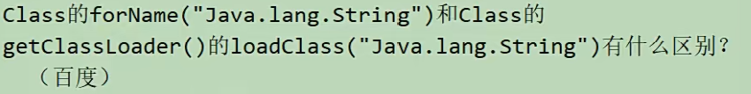
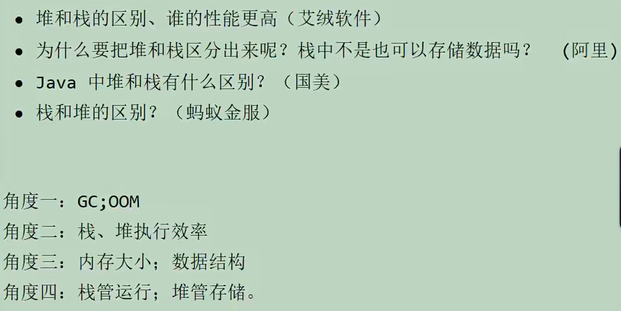
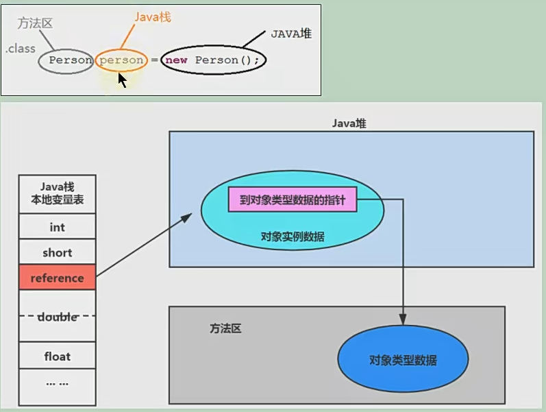

## 概述

### 1、为什么说Java属于编译型+解释型的高级语言？

### 2、阿里：什么是Java虚拟机(JVM)，为什么要使用？

### 3、JDK JRE JVM的区别与联系

- 说说Java虚拟机的生命周期及体系结构。

  > **虚拟机的启动**
  > Java虚拟机的启动  是通过引导类加载器(bootstrap class  loader)创建一个初始类(initial class)来完成的，这个类是由虚拟机的具体实现指定的。启动JVM时，会根据指定的参数创建一个初始的Java线程，用于执行Java程序的main方法。
  >
  > **虚拟机的退出**
  > 有如下的几种情况：
  >
  > - 某线程调用Runtime类或System类的exit方法，或 Runtime类的halt方法，并且Java安全管理器也允许这次exit或halt操作。
  > - 程序正常执行结束
  > - 程序在执行过程中遇到了异常或错误而异常终止
  > - 由于操作系统出现错误而导致Java虚拟机进程终止

- 字节跳动：一面：JVM的组成
- JDK与JVM是什么关系？

  - JDK（Java Development Kit）是 Java 开发工具包，其中包含了 Java 编译器、Java 虚拟机（JVM）、Java 库、开发文档等。JDK 是 Java 开发人员进行 Java 应用程序开发的必备工具，它提供了 Java 应用程序所需的全部组件。
  - JVM（Java Virtual Machine）是 Java 虚拟机，是 Java 运行环境的一部分，它负责解释和执行 Java 代码，并在运行时提供内存管理、垃圾回收等服务。JVM 使得 Java 程序可以在不同平台上运行，实现了 Java 语言“一次编写，到处运行”的特性。
  - 因此，JDK 和 JVM 是紧密相关的，JDK 包含了 JVM，同时 JDK 还提供了开发 Java 应用程序所需的其他工具和库。在开发 Java 应用程序时，需要使用 JDK 中的编译器将源代码编译为字节码文件，并使用 JVM 来解释和执行字节码文件。

- 如何理解Java是跨平台的语言？
- 如何理解JVM是跨语言的平台？
- 能否画出JVM架构图

## 一、类加载机制

1. 类加载的时机
2. 
   - `forName`会执行初始化环节，而`loadClass`只会执行装载阶段。
3. 哪些情况下会触发类的加载？
   - 类的加载=装载 + 链接 + 初始化

## 二、字节码

- 类文件结构
- 知道字节码吗？字节码都有哪些？Integer x = 5，int y = 5，比较x = y 都经过哪些步骤？

## 三、运行时内存

### 栈

### 堆

Java堆的结构是什么样子的？（猎聘）

JVM内存为什么要分成新生代，老年代，持久代。新生代中为什么要分为Eden和Survivor（字节跳动）

堆里面的分区：Eden，survival（from+to），老年代，各白的特点。（京东-物流)
堆的结构？为什么两个survivor区？Eden和Survior的比例分配（蚂蚁金服）（蚂蚁金服）
，JVM内存分区，为什么要有新生代和老年代（小米）。JVM的内存结构，Eden和Survivor比例。（京东）JVM内存为什么要分成新生代，老年代，持久代。新生代中为什么要分为Eden和
Survivor。（京东)，JVM内存分区，为什么要有新生代和老年代？JVM的内存结构，Eden和Survivor比例。
(美团)(京东)

什么时候对象会进入老年代？？（渣打银行）

什么时候对象会进入老年代？（顺丰）

问什么幸存者区15次进入老年区，懂原理吗？（58）

JVM的伊甸园区，from区，to区的比例是否可调？（花旗银行）

JVM中一次完整的GC流程是怎样的，对象如何晋升到老年代（字节跳动）

什么时候对象会进入老年代？（字节跳动）

对象在堆内存创建的生命周期(蚂蚁金服)

重点讲讲对象如何晋升到老年代，几种主要的JVM参数(蚂蚁金服）

新生代和老年代的内存回收策略（蚂蚁金服）

什么时候对象可以被收回？(蚂蚁金服)

堆大小通过什么参数设置？·初始堆大小和最大堆大小一样，·JVM中最大堆大小有没有限制？（亚信）(阿里）(阿里)问这样有什么好处?

> 为了能够在ava垃圾回收机制清理完堆区后不需要重新分隔计算堆区的大小，从而提高性能。
>
> 通常会将-Xms和-Xmx两个参数配置相同的值，其目的是为了能够在java垃圾回收机制清理完堆区后不需要重新分隔计算堆区的大小，从而提高性能。heap默认最大值计算方式：如果物理内存少于192M,那么heap最大值为物理内存的一半。如果物理内存大等于1G，那么heap的最大值为物理内存的1/4。heap默认最小值计算方式：最少不得少于8M，如果物理内存大于等于1G，那么默认值为
> 物理内存的1/64，即1024/64=16M。最小堆内存在vm启动的时候就会被初始化。
>
> 关于堆空间的大小，我从官网取下来说明：On Oracle Solaris 7 and Oracle Solaris 8 SPARc platforms, the upperlimit for this value is approximately 4,ooo MB minus overhead amounts.OnOracle Solaris 2.6 and x86 platforms,the upper limit isapproximately 2,ooo MB minus overhead amounts. On Linux platforms, theupper limit is approximately 2,ooo MB minus overhead amounts.
> 另：对于32位虚拟机，如果物理内存等于4G，那么堆内存可以达到1G。对于64位虚拟机，如果物理内存为128G，那么heap最多可以达到32G。

·什么是空间分配担保策略？（渣打银行）
什么是空间分配担保策略？（顺丰）
·什么是空间分配担保策略？（腾讯、百度）

> XX:HandlePromotionFailure
> 在发生MinorGc之前，虚拟机会检查老年代最大可用的连续空间是否大于新生代所有对象的总空间，如果大于，则此次MinorGc是安全的
> 如果小于，则虚拟机会查看-xx：HandlePromotionFailure设置值是否允许担保失败.
> 如果HandlePromotionFailure=true，那么会继续检查老年代最大可用连续空间是否大于历次晋升到老年代的对象的平均大小，如果大于，则尝试进行一次MinorGC，但这次MinorGc依然是有风险的：如果小于或者HandlePromotionFailure=false，则改为进行一次Ful1 GC。
> 在JDK6Update24之后，HandlePromotionFailure参数不会再影响到虚拟机的空间分配担保策略，观察openJDK中的源码变化，虽然源码中还定义了HandlePromotionFailure参数，但是在代码中已经不会再使用它。JDK6Update24之后的规则变为只要老年代的连续空间大于新生代对象总大小或者历次晋升的平均大小就会进行MinorGc，否则将进行FullGC。

什么时候对象会进入老年代？（渣打银行）
什么时候对象会进入老年代？（顺丰）
问什么幸存者区15次进入老年区，懂原理吗？（58）
JVM的伊甸园区，from区，to区的比例足否可调？（花旗银行）
JVM中一次完整的GC流程是怎样的，对象如何晋升到老年代（字节跳动）
（字节跳动）
什么时候对象会进入老年代？
对象在堆内存创建的生命周期用（蚂蚁金服）
重点讲讲对象如何晋升到老年代，几种主要的JVM参数（蚂蚁金服）
新生代和老年代的内存回收策略（蚂蚁金服）
什么时候对象可以被收回？(蚂蚁金服)

### 方法区

1. 栈、堆、方法区的关系

   

> 讲一下为什么JVM要分为堆、方法区等？原理是什么？（UC、智联）
> JVM的分区了解吗，内存溢出发生在哪个位置（亚信、BOSS）
> 简述各个版本内存区域的变化？（猎聘）
> Java8的内存分代改进（蚂蚁金服）
> JVM的内存模型，Java8做了什么修改（天猫)
> ooM的错误，StackoverFlow错误，permgen space的错误
> (蚂蚁金服）

## 四、对象内存布局

### 你有几种方式创建对象？

1. new
   1. xx的静态方法
   2. xxbuilder/xxfactory的静态方法
2. Class的newlnstanceO：反射的方式，只能调用空参的构造器，权限必须是public
3. Constructor的newlnstance(Xxx)：反射的方式，可以调用空参、带参的构造器，权限没有要求，实用性更
4. 使用cloneo：不调用任何构造器，当前类需要实现cloneable接口，实现cloneO，默认浅拷贝
5. 使用反序列化：从文件中、数据库中、网络中获取一个对象的二进制流，反序列化为内存中的对象
6. 第三方库Objenesis，利用了asm字节码技术，动态生成Constructor对象

### new对象流程？（龙湖地产）

### 对象创建方法，对象的内存分配。（360安全）

## 五、执行引擎

## 六、垃圾回收

> ·Minor GC 与Full GC 分别在什么时候发生？（腾讯）
> ，老年代的垃圾回收机制什么时候触发，自动触发的值是多少（蚂蚁金服）
> 新生代的垃圾回收什么时候触发（蚂蚁金服）
> 简述 Java 内存分配与回收策略以及 Minor G 和Maior G（国美）
> ，什么时候发生FullGC（58）
> ，简述 Java 内存分配与回收策略以及 Minor GC 和Major GC（百度)
> ·JVM垃圾回收机制，何时触发MinorGc等操作（蚂蚁金服）
> ·JVM的一次完整的GCc流程（从ygc到fgc)是怎样的（蚂蚁金服）
> ·描述JVM中一次fullgc过程（腾讯）
> ·什么情况下触发垃圾回收？(阿里)
> ·新生代的垃圾回收什么时候触发（花旗银行）
> ，老年代的垃圾回收机制什么时候触发，自动触发的阈值是多少（花旗银行）

> ·讲讲JVM的gc（携程）
> ·GC是什么？为什么要有GC？（蚂蚁金服）
> (蚂蚁金服）
> ·垃圾回收的优点和原理。
> ·垃圾回收机制等（支付宝）
> ·Gc回收的是哪部分的垃圾？（vivo）」I
> ·垃圾回收的优点和原理？基本原理是什么？（瓜子）
> ·GC是什么？为什么要有GC？（美团）
> ·简述Java垃圾回收机制（美团）
> ·垃圾回收的优点和原理。（美团）

**百度：**
说一下GC算法，分代回收说下
垃圾收集策略和算法
三面：说一下gc算法，分代回收说下
简述 java 内存分配与回收策率以及 Minor GC 和Major GC
三面：说一下gc算法，分代回收说下

**蚂蚁金服：**
JVM垃圾回收机制，何时触发Minor GC等操作
OOM的错误，StackOverFlow错误，permgen space的错误
JVM的一次完整的GC流程（从ygc到fgc)是怎样的，重点讲讲对象如何晋升到老年代，几种主要的jvm参数
垃圾回收的优点和原理。
你知道哪几种垃圾回收器，各自的优缺点，重点讲一下cms和g1
一面：JVM GC算法有哪些，目前的JDK版本采用什么回收算法
新生代和老年代的内存回收策略
一面：G1回收器讲下回收过程
GC是什么？为什么要有GC？
如何判断一个对象是否存活？
什么时候对象可以被收回？
一面：JVM有哪些回收算法，对应的收集器有哪些？
一面：GC 的两种判定方法 ？CMS 收集器与 G1 收集器的特点。
一面：GC 的两种判定方法 ？CMS 收集器与 G1 收集器的特点。

**携程：**
讲讲jvm的gc

**天猫：**
一面：jvm GC原理，JVM怎么回收内存
一面：CMS特点，垃圾回收算法有哪些？各自的优缺点，他们共同的缺点是什么？

京东：
JVM中一次完整的GC流程是怎样的，对象如何晋升到老年代，说说你知道的几种主要的JVM参数。
你知道哪几种垃圾收集器，各自的优缺点，重点讲下cms和G1，包括原理，流程，优缺点。
垃圾回收算法的实现原理。
当出现了内存溢出，你怎么排错。

滴滴：
一面：说一下什么情况发生栈溢出
一面：java的垃圾回收器都有哪些，说下g1的应用场景，平时你是如何搭配使用垃圾回收器的
二面；有实际的JVM性能调优案例吗？重点需要关注哪些核心参数？

小米：
说几个垃圾回收器，cms回收器有哪几个过程，停顿几次，会不会产生内存碎片。老年代产生内存碎片会有什么问题。
jvm场景问题， 标记清除多次后老年代产生内存碎片，引起full gc，接下来可能发生什么问题。

阿里：
讲一讲垃圾回收算法。
如何解决内存碎片的问题？
什么情况下触发垃圾回收？
如何选择合适的垃圾收集算法？
JVM有哪三种垃圾回收器？
JVM中最大堆大小有没有限制？
吞吐量优先选择什么垃圾回收器？响应时间优先呢？

拼多多：
JVM有哪些回收算法，对应的收集器有哪些？
GC 的两种判定方法 ？CMS 收集器与 G1 收集器的特点。
Java GC机制？GC Roots有哪些？

腾讯：
jvm怎样 判断一个对象是否可回收，怎样的对象才能作为GC root
OOM说一下？怎么排查？哪些会导致OOM? OOM出现在什么时候
什么是Full GC？GC? major GC? stop the world
描述JVM中一次full gc过程

字节跳动：
常见的垃圾回收器算法有哪些，各有什么优劣？
syatem，gc()和runtime，gc()会做做什么事情？
一面：Java GC机制？GC Roots有哪些？
二面：Java对象的回收方式，回收算法。
CMS和G1了解么，CMS解决什么问题，说一下回收的过程。
CMS回收停顿了几次，为什么要停顿两次。
三面：Java存在内存溢出的现象吗，内存的分配方式、GC机制;
一面：讲讲你知道的垃圾回收算法
一面：内存泄漏与内存溢出的区别
GC用什么收集器，收集的过程如何？哪些部分可以作为GC Root？

抖音：
一面：Java GC机制？GC Roots有哪些？
二面：JVM的内存布局以及垃圾回收原理及过程讲一下，讲一下CMS垃圾收集器垃圾回收的流程，以及CMS的缺点

京东：
一面：Java GC机制？GC Roots有哪些？
一面：Java怎么进行垃圾回收的？什么对象会进老年代？垃圾回收算法有哪些？为什么新生代使用复制算法？
JVM垃圾收集算法与收集器有哪些？
讲一下Jvm中如何判断对象的生死？

美团：
GC是什么？为什么要有GC？
简述java垃圾回收机制
如何判断一个对象是否存活？（或者GC对象的判定方法）
垃圾回收的优点和原理。并考虑2种回收机制。
垃圾回收器的基本原理是什么？垃圾回收器可以马上回收内存吗？
有什么办法主动通知虚拟机进行垃圾回收？
java中会存在内存泄漏吗，请简单描述。
二面：jvm场景问题， 标记清除多次后老年代产生内存碎片，引起full gc，接下来可能发生什么问题？
GC root如何确定，哪些对象可以作为GC Root?
GC如何分代的？各代用什么算法回收？
CMS过程是怎样的？内部使用什么算法做垃圾回收？
分代垃圾回收过程？

此外：
JVM中一次完整的GC流程是怎样的，对象如何晋升到老年代，说说你知道的几种主要的JVM参数。
你知道哪几种垃圾收集器，各自的优缺点，重点讲下cms和G1，包括原理，流程，优缺点。
垃圾回收算法的实现原理。
当出现了内存溢出，你怎么排错。
g1和cms区别,吞吐量优先和响应优先的垃圾收集器选择
串行（serial）收集器和吞吐量（throughout）收集器的区别是什么？
在Java中，对象什么时候可以被垃圾回收？
简述Java内存分配与回收策率以及minor GC和majorGC。
Java中垃圾收集的方法有哪些？

什么是内存泄漏和什么是内存溢出（陌陌）
Java存在内存泄漏吗，内存泄漏的场景有哪些，如何避免（百度）
Java中会存在内存泄漏吗，简述一下？（猎聘）
内存泄漏是怎么造成的？（拼多多、字节跳动）I
内存泄漏与内存溢出的区别 (字节跳动)
Java存在内存溢出的现象吗(字节跳动)
Java中会存在内存泄漏吗，请简单描述。(美团）

说到内存泄漏，问有没有碰到，内存泄漏怎么解决（拼多多）
内存泄漏是怎么造成的（拼多多、字节跳动）
如何理解内存泄漏问题？有哪些情况会导致内存泄露？如何解决？(阿里）

GC 收集器有哪些？（滴滴）
几种垃圾回收器（亚信）
垃圾回收器有哪些？都有哪些算法来实现？项目中用的垃圾回收器是什
么？(平安)
垃圾回收器的基本原理是什么？垃圾回收器可以马上回收内存吗？有什
么办法主动通知虚拟机进行垃圾回收？（平安）
你知道那些垃圾回收器（高德地图）
有哪些垃圾方法，垃圾收集器是什么。（新浪）
JVM有哪三种垃圾回收器？(阿里)

JVM的垃圾回收为什么采用分代GC。跟语言有关系吗？（阿里-钉钉）
分代的意义说一下（阿里-钉钉）
GC分代算法（花旗银行）
说一下gc算法，分代回收说下（百度）
Java怎么进行垃圾回收的？什么对象会进老年代？垃圾回收算法有哪
些？为什么新生代使用复制算法？ (京东)
分代垃圾回收过程？ (美团)
GC如何分代的？各代用什么算法回收？(美团)

CMS特点，垃圾回收算法有哪些？各自的优缺点，他们共同的缺点是什么
？(天猫）
讲一下CMS垃圾收集器垃圾回收的流程，以及CMS的缺点（抖音）
说几个垃圾回收器，cms回收器有哪几个过程，停顿几次，会不会产生内
存碎片。老年代产生内存碎片会有什么问题。（小米）
g1和cms区别，吞吐量优先和响应优先的垃圾收集器选择（携程）

## 七、性能调优

说到内存泄漏，问有没有碰到，内存泄漏怎么解决？（拼多
多）
内存泄漏是怎么造成的？（拼多多、字节跳动）
如何理解内存泄漏问题？有哪些情况会导致内存泄露？如何解
决 (阿里)
