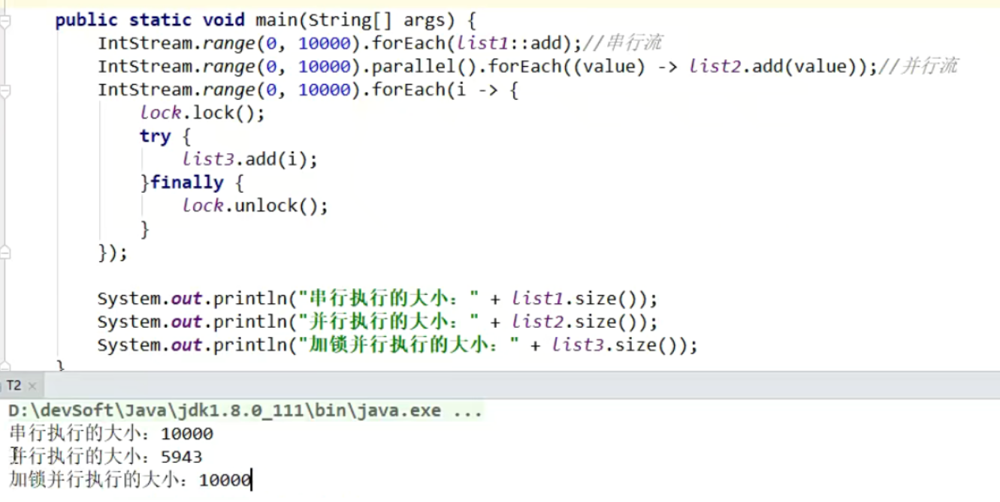

## 1、Java8 Lambda表达式

-------

Lambda表达式也称为**闭包**，它允许我们把函数当作参数一样传递给某个方法，或者把代码本身当作数据处理。

早期Java开发者只能使用**匿名内部类**来实现Lambda表达式。

最简单的可以由**逗号分隔的参数列表**、**`->`符号**、**语句块**三部分组成。

例如：

```csharp
// 例子1
// 参数e的类型是编译器推理出来的
Arrays.asList( "a", "b", "d" ).forEach( e -> System.out.println( e ) );

// 例子2
// 当然也可以将执行参数的类型写上
Arrays.asList( "a", "b", "d" ).forEach((String e)-> System.out.println( e ) );

// 例子3
// 当有多个参数时
Arrays.asList( "a", "b", "d" ).sort((e1,e2)-> e1.compareTo(e2));

// 例子4
// 当Lambda的语句块只有一行时，可以不使用return语句。
Arrays.asList( "a", "b", "d" ).sort((e1,e2)-> e1.compareTo(e2));

```

**ps:** 切记当有多个参数，或需要指定参数类型的时候，**参数列表要加括号**。


-------

 ## 2、 函数式接口

函数式接口(`Functional Interface`)就是一个**有且仅有一个**抽象方法，但是可以有多个非抽象方法的接口。

**作用：**这样的接口可以隐式转换为Lambda表达式。

>  只要某个开发者在该接口中添加一个函数，则该接口就不再是函数式接口，进而导致编译失败。为了客服这种问题，并显式说明某个接口是函数式接口，Java8提供了一个特殊的注解**@FunctionalInterface**Java 库中的所有相关接口都已经带有这个注解了。


```java
@FunctionalInterface
interface Addtions {
	int test(int a, int b);// 我是核心
    default void hello() {
		System.out.println("我不会影响到函数式接口的定义");
	}
	static void hello1(){
		System.out.println("我也不会影响到函数式接口的定义");
	}
}
```

JDK 1.8 之前已有的函数式接口:

- java.lang.Runnable
- java.util.concurrent.Callable
- java.security.PrivilegedAction
- java.util.Comparator
- java.io.FileFilter
- java.nio.file.PathMatcher
- java.lang.reflect.InvocationHandler
- java.beans.PropertyChangeListener
- java.awt.event.ActionListener
- javax.swing.event.ChangeListener

JDK 1.8 新增加的函数接口：

- java.util.function

## 3、接口的默认方法和静态方法

Java 8允许我们给接口添加一个**非抽象的方法实现**，只需要使用 `default`关键字即可，这个特征又叫做扩展方法，示例如下：

- 默认方法可以被实现类**重写Override**


```java
class FunctionalInterfaceTest implements Formula{
	@Override
	public double calculate(int a) {
		return 0;
	}
    // 可以重写sqrt方法。
	@Override
	public double sqrt(int a) {
		return Formula.super.sqrt(a);
	}
}
@FunctionalInterface
interface Formula {
    double calculate(int a);
    
// 该方法(默认方法)可以被实现类重写
    default double sqrt(int a) {
        return Math.sqrt(a);
    }
    static void hello1(){
		System.out.println("我是新来的(JAVA8)，我叫静态方法，");
	}
}
```

## 4、方法引用

方法引用使得开发者可以**直接引用现存的方法、Java类的构造方法或者实例对象**。方法引用和Lambda表达式配合使用，使得java类的构造方法看起来紧凑而简洁，没有很多复杂的模板代码。

可见使用Lambda表达式的写法和使用方法引用的写法的效果是一样的，但是使用方法引用有时会更加简化代码


- 构造器引用
  - `类名::new`
- 静态方法引用
  - `类名::静态方法`
- 对象方法引用
  - `类名::方法`
  - 当Lambda表达式的参数列表第一个参数为实例方法的调用者，第二个参数(或无参)是实例方法的参数时，可以使用这种方法。
- 实例方法引用
  - `实例对象::成员方法`
  - 要先获取一个实例对象

```java

public class Test {
	private String name;
	public String getName() {
		return this.name;
	}
	public Test(String name) {
		this.name = name;
	}
	public static String staticMethod(){
		return "我是静态方法！";
	}
	
	public static void main(String[] args) {
		Test test1 = new Test("小明");
		
		// Lambda表达式
		Supplier<String> func1 = () -> test1.getName();
		System.out.println("Lambda表达式测试:" + func1.get());
		
		// 实例方法引用
		Supplier<String> func2 = test1::getName;
		System.out.println("方法引用方式测试:" + func2.get());
		
		// 静态方法引用
		Supplier<String> func3 = Test::staticMethod;
		System.out.println("静态方法引用测试:" + func3.get());

		// 构造方法引用(构造器引用) 
		Function<String, Test> func4 = Test::new;
		Test test2 = func4.apply("xxx");
		System.out.println("构造方法引用测试:" + test2);
		
		// 对象方法引用
        // Test为类名，getName为成员方法。
		Function<Test, String> func5 = Test::getName;
		System.out.println("对象方法测试引用:" + func5.apply(test1));
	}
}
```


## 5、Optional

Java应用中最常见的bug就是**NullPointerException**，

就比如比较两个字符串是否相等

`s1.equals(s2)`，如果`s1==null`，那么一运行，console`立马就爆红了。

所以Java8提供了Optional来解决这问题。


- **isPresent()：**如果Optional实例持有一个非空值，方法返回true，否则返回false
- **orElseGet()：**，Optional实例持有null，则可以接受一个lambda表达式生成的默认值
- **map()：**可以将现有的Opetional实例的值转换成新的值
- **orElse()：** Opetional 实例持有null的时候返回传入的默认值， 方法与**orElseGet()**方法类似。
- **filter()：**如果optional实例不为null，并且filter中lambda表达式返回true，就返回一个Optional实例;反之返回一个空optional。
  - If a value is present, and the value matches the given predicate,return an {@code Optional} describing the value, otherwise return an empty {@code Optional}.


1. **当optional实例为null时**

```java
Optional< String > fullName = Optional.ofNullable( null );
System.out.println( "Full Name is set? " + fullName.isPresent() );
System.out.println( "Full Name: " + fullName.orElseGet( () -> "[none]" ) ); 
System.out.println( fullName.map( s -> "Hey " + s + "!" ).orElse( "Hey Stranger!" ) );

// 下面为输出结果
Full Name is set? false
Full Name: [none]
Hey Stranger!
```

2. **当optional实例不为null时**

```java
Optional< String > firstName = Optional.of( "Tom" );
System.out.println( "First Name is set? " + firstName.isPresent() );        
System.out.println( "First Name: " + firstName.orElseGet( () -> "[none]" ) ); 
System.out.println( firstName.map( s -> "Hey " + s + "!" ).orElse( "Hey Stranger!" ));

//输出结果
First Name is set? true
First Name: Tom
Hey Tom!
```


## 6、Streams

### 1、是什么？

是能让你装X的东西。废话少说，先上DJ，先上DJ。

**普通过滤数据:**

```java

```

**用Streams过滤数据:**

```java

```


Stream操作分为中间操作和最终操作，**中间操作会返回一个新的stream，只是把要做的操作记录起来而已，并不会真的执行**，晚期操作才会真的遍历列表并执行所有操作。


**流计算的一个共同结构：**

==具有一个流来源、0个或多个中间操作，以及一个终止操作。==

当且仅当存在终端操作时，中间操作才会被执行。

当调用终端操作时，一系列元素会一个个单独地执行，或者可以说当一个元素走完整条链(链式调用)时，下一个元素才会执行。

### 2、 好处？

另外Streams上的一个**优点**就是：

>  原来的代码只能让我们看到的是一个一次性中间结果的声明，要阅读此代码，需要在头脑中缓存大量上下文，然后才能明白代码的实际用途。而采用Streams之后，代码变得异常清晰，并且我们不需要再被"变量"分心，也不需要在阅读代码的同时跟踪记录大量上下文。可读性非常强，这样也利于维护者一眼能够看出来代码在做什么。


### 3、如何使用？

在<a href="##1、是什么？">是什么?></a>这个章节中说过，一个流计算是具有一个流来源、0或多个中间操作，以及一个终止操作。


流的元素可以是对象引用，也可以是原始数据类型。


<center>都是BaseStream的子类</center>

因为我们平时的数据大多存放在**数组**和**集合**中。

所以Java8JDK中对Collection、Arrays的实现都增强了。但是流的元素不至于这些(即我们可以在很多情况下用流计算)


所以你经常能看到别人花里胡哨的数组转List方法(赶快学起来，秀翻她们)。

```java
// 1.1 基本数据类型数组转list
Arrays.stream(new int[]{1,2,3,4}).boxed().collect(Collectors.toList());
// 1.2 对象数组
Arrays.stream(new Integer[]{1,2,3,4}).collect(Collectors.toList());
```


**JDK中流来源：**

| 方法                                                        | 描述                                                         |
| :---------------------------------------------------------- | :----------------------------------------------------------- |
| `Collection.stream()`                                       | 使用一个集合的元素创建一个流。                               |
| `Stream.of(T...)`                                           | 使用传递给工厂方法的参数创建一个流。                         |
| `Stream.of(T[])`                                            | 使用一个数组的元素创建一个流。                               |
| `Stream.empty()`                                            | 创建一个空流。                                               |
| `Stream.iterate(T first, BinaryOperator f)`                 | 创建一个包含序列 `first, f(first), f(f(first)), ...` 的无限流 |
| `Stream.iterate(T first, Predicate test, BinaryOperator f)` | （仅限 Java 9）类似于 `Stream.iterate(T first, BinaryOperator f)`，但流在测试预期返回 `false` 的第一个元素上终止。 |
| `Stream.generate(Supplier f)`                               | 使用一个生成器函数创建一个无限流。                           |
| `IntStream.range(lower, upper)`                             | 创建一个由下限到上限（不含）之间的元素组成的 `IntStream`。   |
| `IntStream.rangeClosed(lower, upper)`                       | 创建一个由下限到上限（含）之间的元素组成的 `IntStream`。     |
| `BufferedReader.lines()`                                    | 创建一个有来自 `BufferedReader` 的行组成的流。               |
| `BitSet.stream()`                                           | 创建一个由 `BitSet` 中的设置位的索引组成的 `IntStream`。     |
| `Stream.chars()`                                            | 创建一个与 `String` 中的字符对应的 `IntStream`。             |

<center>看几个常用的就行了(或者把表保存下来)</center>

**中间操作负责将一个流转换为另一个流**，常见中间操作：

| 操作                   | 内容                                                         |
| :--------------------- | :----------------------------------------------------------- |
| `filter(Predicate)`    | 与预期匹配的流的元素                                         |
| `map(Function)`        | 将提供的函数应用于流的元素的结果                             |
| `flatMap(Function>`    | 将提供的流处理函数应用于流元素后获得的流元素                 |
| `distinct()`           | 已删除了重复的流元素                                         |
| `sorted()`             | 按自然顺序排序的流元素                                       |
| `Sorted(Comparator)`   | 按提供的比较符排序的流元素                                   |
| `limit(long)`          | 截断至所提供长度的流元素                                     |
| `skip(long)`           | 丢弃了前 N 个元素的流元素                                    |
| `takeWhile(Predicate)` | （仅限 Java 9）在第一个提供的预期不是 `true` 的元素处阶段的流元素 |
| `dropWhile(Predicate)` | （仅限 Java 9）丢弃了所提供的预期为 `true` 的初始元素分段的流元素 |

> 如果你对上边方法中的参数有疑问的话，那就说明**函数式接口**没掌握好，
>
> 有几个常用的：**Predicate**、**Function**、**Supplier**、**Consumer**，用Lambda做几个案例或者直接看源码就知道她们是用来干啥的。


**中间操作始终是惰性的：** 调用中间操作只会设置流管道的下一个阶段，不会启动任何操作。

中间操作又可划分为**无状态**和**有状态**操作。

- **无状态**
  - 可单独处理每个元素
- **有状态**


**数据集的处理在==执行终止操作时开始==**，终止操作执行后，会终止流管道，如果您想再次遍历同一个数据集，可以设置一个新的流管道。

```java
Stream<Integer> stream = Stream.of(1,2,3,4);
stream.forEach(System.out::println);
stream.forEach(System.out::println);
```


<center>第一次正常执行，第二次就报错(stream已经关闭)</center>


常见的终止流操作：

| 操作                             | 描述                                          |
| :------------------------------- | :-------------------------------------------- |
| `forEach(Consumer action)`       | 将提供的操作应用于流的每个元素。              |
| `toArray()`                      | 使用流的元素创建一个数组。                    |
| `reduce(...)`                    | 将流的元素聚合为一个汇总值。                  |
| `collect(...)`                   | 将流的元素聚合到一个汇总结果容器中。          |
| `min(Comparator)`                | 通过比较符返回流的最小元素。                  |
| `max(Comparator)`                | 通过比较符返回流的最大元素。                  |
| `count()`                        | 返回流的大小。                                |
| `{any,all,none}Match(Predicate)` | 返回流的任何/所有元素是否与提供的预期相匹配。 |
| `findFirst()`                    | 返回流的第一个元素（如果有）。                |
| `findAny()`                      | 返回流的任何元素（如果有）。                  |


管道由封装成Spliterator的stream、一个或多个中间操作以及最终生成结果的终端操作组成。

>  A pipeline consists of a stream source encapsulating a spliterator, one or more intermediate operations, and finally a terminal operation that produces a result. 


Stream 的另一个价值就是**支持了并行处理 `parallel` 方法。**


- forEach 遍历 Map 数据

  - ```java
    Map<String,Integer> map = new HashMap<>();
    map.put("a",1);map.put("b",2);map.put("c",3);
    
    map.forEach((k,v) -> System.out.println("key:"+k+",value:"+v));
    ```

- forEach 遍历Collection 数据

  - ```java
    vehicles.forEach(vehicle -> System.out.println(vehicle));
    
    //这样就可以遍历打印
    vehicles.forEach(System.out::println);
    ```

- filter数据过滤

  - ```java
    List<Vehicle> collect = vehicles.stream().filter(vehicle -> vehicle.getScore() >= 3).collect(Collectors.toList());
    ```

- map对象映射

  - ```java
    // 取出所有的车架号列表
     List<String> vins = vehicles.stream().map(Vehicle::getVin).collect(Collectors.toList());
    ```

- GroupBy按照某个属性进行分组

  - ```java
    // 按照公司 Id 进行分组
    Map<Integer, List<Vehicle>> companyVehicles = vehicles.stream().collect(Collectors.groupingBy(Vehicle::getCompanyId));
    
    // 按照公司分组求司机打分和
    Map<Integer, Double> collect = vehicles.stream().collect(Collectors.groupingBy(Vehicle::getCompanyId, Collectors.summingDouble(Vehicle::getScore)));
    ```

- sort按照某个属性排序 ，及多列排序

- mapReduce 数据处理

  ```
  // 对所有司机的总分求和
  Double reduce = vehicles.stream().parallel().map(Vehicle::getScore).reduce(0d, Double::sum);
  ```


### 4、Streams原理

在性能至关重要时，了解Streams的内部工作原理是很重要的。

上边说过**一个*流来源*、0 或多个*中间操作*，以及一个*终止操作*。**

#### 4.1 Stream Sources流来源

Stream Source有一种称为`Spliterator`(注意这个)的抽象来描述，

顾名思义，他组合了两种行为


Spliterator还可以将其某些元素（使用`trySplit`）分割为另一个拆分器，以便在可能的**并行操作**中使用。

>  A Spliterator may also partition off some of its elements (using trySplit) as another Spliterator, to be used in possibly-parallel operations.


**PS**：注意这个Spliterator

`fromCharacteristics`方法将spliterator特征转换为流标志(Stream flags)


`StatelessOp`通过给存在的流加一个无状态的中间操作，从而构造出一个新流。

>  Construct a new Stream by appending a stateless intermediate operation to an existing stream.


| 流标志     | 解释                                                         | 大小       |
| :--------- | :----------------------------------------------------------- | ---------- |
| `SIZED`    | 流的大小已知。                                               | 0x00000040 |
| `DISTINCT` | 依据用于对象流的 `Object.equals()` 或用于原语流的 `==`，流的元素将有所不同。 | 0x00000001 |
| `SORTED`   | 流的元素按自然顺序排序。                                     | 0x00000004 |
| `ORDERED`  | 流有一个有意义的遇到顺序（请参阅 “[遇到顺序](https://www.ibm.com/developerworks/cn/java/j-java-streams-3-brian-goetz/index.html?ca=drs-#eo)” 部分） | 0x00000010 |


每个特征需要占用2个比特位


### StreamSupport

用于创建和操作流的低级实用方法。

这个类主要用于呈现数据结构流视图的库编写器，大多数面向最终用户的静态流方法都在不同的流类中。


源码中还提到：强烈建议我们指定`spliterator`不可变(`IMMUTABLE`)、并发(`CONCURRENT`)或者其他后期绑定的特性。

所以，他推荐我们指定特性`characteristics`。


Spliterator


**先介绍一下位运算(characteristics需要用)：**

`(a|b|c|d|e)&a == a`

先说一下该式子为啥成立：

拿A、B来举个例子：

- 或运算`A|B`

  对于每一位来说，A、B两者若至少有一个`1`，那么该位位运算结果就是`1`，否则结果为`0`。

- 与运算`A|B`

  对于每一位来说，若两者有一个不为`1`，那么该位位运算结果就是`0`，否则结果为`1`。

基于我们需要用的式子，我们再来研究一下：


所以，


## 7、时间类


# 面试题

## Stream

### 1、parallel()流有什么缺点？

1. 并行流有时会出现线程安全问题，慎用。




### 2、Arrays.Stream()不支持boolean数组(只支持int、long、double)

```java
int[] a = new int[100];
double[] c = new double[100];
long[] d = new long[100];
Arrays.stream(a).sum();
Arrays.stream(c).sum();
Arrays.stream(d).sum();
```


