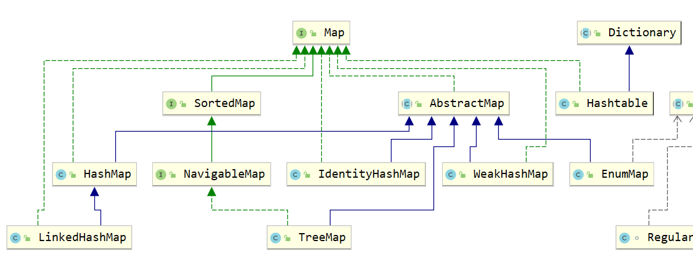
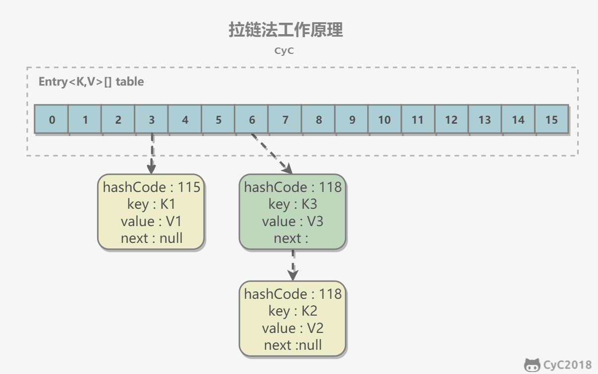
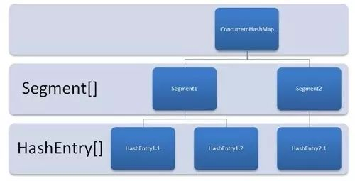
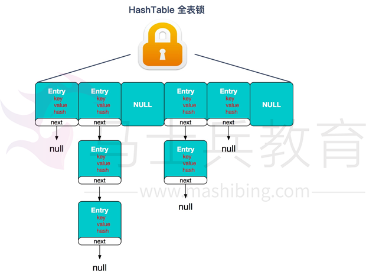
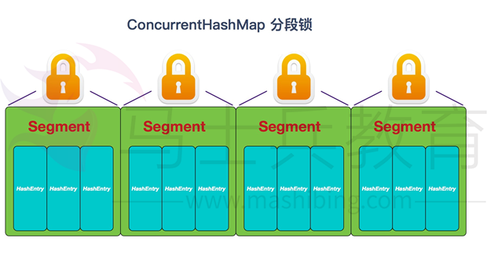
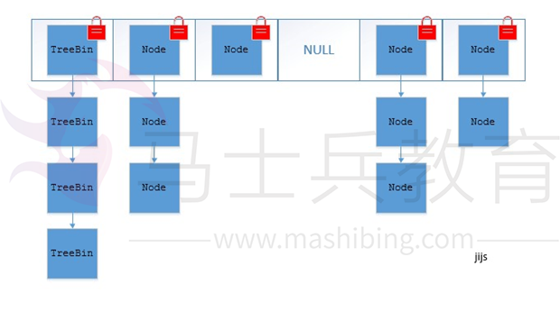
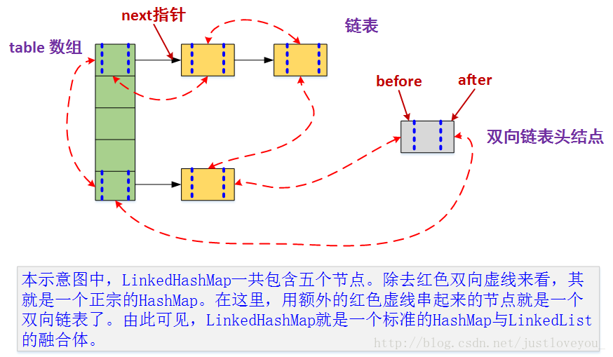
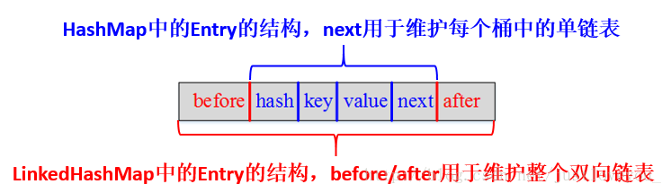

## Java容器概述

容器主要包括`Collection`和`Map`两种，Collection存储着对象的集合，而Map存储着键值对的映射表。

## Collection


### 1. Set

- `TreeSet`：基于==红黑树==实现，支持**有序性**操作，例如根据一个范围查找元素的操作。**但是查找效率不如 HashSet**，HashSet 查找的时间复杂度为 O(1)，TreeSet 则为 O(logN)。 

  - 注意，她是实现了`SortedSet`接口，所以有序。

  - **底层实现调用`TreeMap`的构造方法，**key为set中的值，Value为object对象。

    - ```java
      // Dummy value to associate with an Object in the backing Map
      private static final Object PRESENT = new Object();
      ```

  - 添加、删除、包含等操作时间复杂度`O(logN)`

- **HashSet**：基于==哈希表==实现，支持快速查找，但不支持有序性操作。**并且失去了元素的插入顺序信息**，也就是说使用 Iterator 遍历 HashSet 得到的结果是不确定的。

  - **元素都存到HashMap键值对的Key上面，而Value时有一个统一的值`private static final Object PRESENT = new Object();`**，(定义一个虚拟的Object对象作为HashMap的value，将此对象定义为static final。)
  - 实际底层会初始化一个空的HashMap，并使用默认初始容量为**16**和加载因子**0.75**。`max((old*0.75)+1),16)`
  - 添加、删除、查找效率都是`O（1）`

- **LinkedHashSet**：具有 HashSet 的查找效率，并且**内部使用双向链表维护元素的插入顺序**。

  - 继承了`HashSet`的构造方法，该方法是包访问权限，外部不能访问。

  - ```java
    HashSet(int initialCapacity, float loadFactor, boolean dummy) {
        map = new LinkedHashMap<>(initialCapacity, loadFactor);
    }
    ```
    
  - `添加、删除、查找效率都是O（1）`

### 2. List

- **ArrayList**：基于**动态数组**实现，支持随机访问(下标)。

  - 默认容量是10(第一次添加元素的时候)，再次扩容则扩容到当前容量的1.5倍

    - 扩容操作需要调用 `Arrays.copyOf()` 把原数组整个复制到新数组中，这个**操作代价很高**，因此最好在创建 ArrayList 对象时就指定大概的容量大小，减少扩容操作的次数。

  - 继承`Abstract类`,实现了`RandomAccess`接口(实现该接口的list支持快速随机访问)

  - `Collections.synchronizedList()`实现线程安全。

  - `modCount` 用来记录 ArrayList 结构发生变化的次数。结构发生变化是`指添加或者删除至少一个元素的所有操作，或者是调整内部数组的大小`，仅仅只是设置元素的值不算结构发生变化。

    在进行**序列化或者迭代**等操作时，**需要比较操作前后 modCount 是否改变**，如果改变了需要抛出 ConcurrentModificationException。代码参考上节序列化中的 writeObject() 方法。

- **Vector**：和 ArrayList 类似，但它是线程安全的。

  - 大多数方法都是用了`synchronized`
  - 默认初始容量为10, 每次扩容会增加一倍
  - Stack继承了Vector

- **LinkedList**：基于**双向链表**实现，**只能顺序访问**，但是可以快速地在链表中间插入和删除元素。不仅如此，LinkedList 还可以用作栈、队列和双向队列。

  - 插入和删除容易，查找和修改难。(ArrayList与其相反)。

#### ArraysList

##### 自动扩容

每当向数组中添加元素时，都会去检查添加后元素的个数是否会超出当前数组的长度。如果超出，数组会进行自动扩容，以满足添加数据的需求。

数组扩容通过`ensureCapacity(int minCapacity)`方法实现。也可以通过手动增加`ArrayList`实例的容量，以减少递增式再分配的数量。

数组进行扩容时，会将老数组中的元素重新拷贝一份到新的数组中，**每次数组容量的增长是其原容量的1.5倍。这种操作的代价是很高的。**

因此在实际使用时，我们应该尽量避免数组容量的扩张。当我们可预知要保存的元素的多少时，要在构造ArrayList实例时，就指定其容量，以避免数组扩容的发生。或者根据实际需求，通过调用ensureCapacity方法来手动增加ArrayList实例的容量。

##### ArrayList 和 LinkedList 的区别是什么？

- 数据结构实现：ArrayList 是动态数组的数据结构实现，而 LinkedList 是双向链表的数据结构实现。
- 随机访问效率：`ArrayList 比 LinkedList 在随机访问的时候效率要高`，因为 LinkedList 是线性的数据存储方式，所以需要移动指针从前往后依次查找。 
- 增加和删除效率：在非首尾的增加和删除操作，LinkedList 要比 ArrayList 效率要高，因为 ArrayList 增删操作要影响数组内的其他数据的下标。
- 内存空间占用：`LinkedList 比 ArrayList 更占内存`，因为 LinkedList 的节点除了存储数据，还存储了两个引用，一个指向前一个元素，一个指向后一个元素。
- 线程安全：ArrayList 和 LinkedList 都是不同步的，也就是不保证线程安全；

综合来说，在需要频繁读取集合中的元素时，更推荐使用 ArrayList，而在插入和删除操作较多时，更推荐使用 LinkedList。


### 3. Queue

- **PriorityQueue**：基于堆结构实现，可以用它来实现优先队列。
- Deque
  - **LinkedList**：**可以用它来实现双向队列**。
  - **ArrayDeque**

## Map

> 常用的哈希表为了解决哈希冲突，实现方式有以下两种：**链表法**和**开放地址法**。
>
> 开放地址法就是遇到冲突时，采用某种探测方法寻找下一个槽位。



- TreeMap：基于**红黑树**实现。
  - `extends AbstractMap`
  - `containsKey()、get()、put()、remove()的时间复杂度是log(n)`
  - TreeMap是非同步的
- HashMap：基于**哈希表**实现。
  - 源码中有**静态内部类**`entry`。
  -  初始长度为**16**(需要是2的次幂)，默认负载因子`DEFAULT_LOAD_FACTOR`是0.75
  - 懒加载机制，`只有在第一次put数据的时候才会创建hash表`。
  - 利用单链表解决哈希冲突问题，容量不足会自动扩容
- HashTable：和 HashMap 类似，**但它是线程安全的**，这意味着同一时刻多个线程同时写入 HashTable 不会导致数据不一致。它是遗留类，不应该去使用它，而是使用 ConcurrentHashMap 来支持线程安全，ConcurrentHashMap 的效率会更高，因为 ConcurrentHashMap 引入了分段锁。
- LinkedHashMap：使用双向链表来维护元素的顺序，顺序为插入顺序或者最近最少使用（LRU）顺序。


### 1. HashMap

内部包含了一个 Entry 类型的数组 table。Entry 存储着键值对。它包含了四个字段，从 next 字段我们可以看出 Entry 是一个链表。即数组中的每个位置被当成一个桶，一个桶存放一个链表。HashMap 使用拉链法来解决冲突，同一个链表中存放哈希值和散列桶取模运算结果相同的 Entry。



#### 插入(头插法)

- 查找时分为两步
  1. 计算key值的hash值
  
     ```java
     static final int hash(Object key) {
         int h;
         return (key == null) ? 0 : (h = key.hashCode()) ^ (h >>> 16);
     }
     ```
  
     为什么需要`(h = key.hashCode()) ^ (h >>> 16)`,**这段代码将高位、低位的信息混合在了一起，打乱 hashCode 真正参与运算的低 16 位**
  
     具体来讲：如果两个不同的对象的哈希码只有高位信息不同，那么它们在HashMap中的位置可能是相邻的，从而导致哈希冲突。通过将高位信息与低位信息混合在一起，可以减少这种情况的发生，从而降低哈希冲突的概率。
  
  2. 判断Node数组是否为空，如果为空的话，需要先进行初始化(懒加载)
  
  3. 根据`(n - 1) & hash`计算桶的下标
  
     1. 它通过h & (table.length -1)来得到该对象的保存位，而HashMap底层数组的长度总是2的n次方，这是**HashMap在速度上的优化**。当length总是2的n次方时，h& (length-1)运算等价于对length取模，也就是h%length，但是&比%具有更高的效率。
  
  4. 如果该桶为空，那么就创建Node，放入桶里。
  
  5. 否则先判断该节点的key是否和桶里的头节点的key相同，相同的话就直接更新value
  
  6. 如果上边的都不成立，那么就判断是否为红黑树节点，若是，就调用红黑树的插入方式
  
  7. 如果是链表，那就遍历链表，看是否有与该key相同的节点，如果有，直接更新value，如果没有就插入，并判断插入后是否需要转红黑树。
  
  8. 最后判断hashmap中的元素数量是否大于threshold阈值，如果大于的话，就需要扩容。
  
  

```java
 final V putVal(int hash, K key, V value, boolean onlyIfAbsent,
                   boolean evict) {
        Node<K,V>[] tab; Node<K,V> p; int n, i;
        if ((tab = table) == null || (n = tab.length) == 0)
//1、判断当 table 为 null 或者 tab 的长度为 0 时，即 table 尚未初始化，此时通过 resize() 方法得到初始化的 table
            n = (tab = resize()).length;
        if ((p = tab[i = (n - 1) & hash]) == null)
//1.1、此处通过（n - 1） & hash 计算出的值作为 tab 的下标 i，并另 p 表示 tab[i]，也就是该链表第一个节点的位置。并判断 p 是否为 null
            tab[i] = new Node(hash, key, value, null);
//1.1.1、当 p 为 null 时，表明 tab[i] 上没有任何元素，那么接下来就 new 第一个 Node 节点，调用 newNode 方法返回新节点赋值给 tab[i]
        else {
//2.1 下面进入 p 不为 null 的情况，有三种情况：p 为链表节点；p 为红黑树节点；p 是链表节点但长度为临界长度 TREEIFY_THRESHOLD，再插入任何元素就要变成红黑树了。
            Node<K,V> e; K k;
            if (p.hash == hash &&
                ((k = p.key) == key || (key != null && key.equals(k))))
//2.1.1HashMap 中判断 key 相同的条件是 key 的 hash 相同，并且符合 equals 方法。这里判断了 p.key 是否和插入的 key 相等，如果相等，则将 p 的引用赋给 e
 
                e = p;
            else if (p instanceof TreeNode)
//2.1.2 现在开始了第一种情况，p 是红黑树节点，那么肯定插入后仍然是红黑树节点，所以我们直接强制转型 p 后调用 TreeNode.putTreeVal 方法，返回的引用赋给 e
                e = ((TreeNode<K,V>)p).putTreeVal(this, tab, hash, key, value);
            else {
//2.1.3 接下里就是 p 为链表节点的情形，也就是上述说的另外两类情况：插入后还是链表 / 插入后转红黑树。另外，上行转型代码也说明了 TreeNode 是 Node 的一个子类
                for (int binCount = 0; ; ++binCount) {
// 我们需要一个计数器来计算当前链表的元素个数，并遍历链表，binCount 就是这个计数器
 
                    if ((e = p.next) == null) {
                        p.next = newNode(hash, key, value, null);
                        if (binCount >= TREEIFY_THRESHOLD - 1) 
// 插入成功后，要判断是否需要转换为红黑树，因为插入后链表长度加 1，而 binCount 并不包含新节点，所以判断时要将临界阈值减 1
                            treeifyBin(tab, hash);
// 当新长度满足转换条件时，调用 treeifyBin 方法，将该链表转换为红黑树
                        break;
                    }
                    if (e.hash == hash &&
                        ((k = e.key) == key || (key != null && key.equals(k))))
                        break;
                    p = e;
                }
            }
            if (e != null) { // existing mapping for key
                V oldValue = e.value;
                if (!onlyIfAbsent || oldValue == null)
                    e.value = value;
                afterNodeAccess(e);
                return oldValue;
            }
        }
        ++modCount;
        if (++size > threshold)
            resize();
        afterNodeInsertion(evict);
        return null;
    }
```


#### 扩容-基本原理

设 HashMap 的 table 长度为 M，需要存储的键值对数量为 N，如果哈希函数满足均匀性的要求，那么每条链表的长度大约为 N/M，因此查找的复杂度为 O(N/M)。

为了让查找的成本降低，**应该使 N/M 尽可能小**，因此需要保证 M 尽可能大，也就是说 table 要尽可能大。HashMap **采用动态扩容来根据当前的 N 值来调整 M 值**，使得空间效率和时间效率都能得到保证。

扩容使用`resize()` 实现，需要注意的是，扩容操作同样需要把 `oldTable` 的所有键值对重新插入 newTable 中，因此这一步是很费时的。

JDK8中HashMap的扩容相比JDK7时多了两个优化：

1. **优化一：不需要重新计算hash**

    - 在JDK7时，数组扩容之后，需要对所有的键值重新计算hash，并插入到newTable中。但是通过分析，可以得出一个阶段，我们使用2次幂进行扩容，`元素的位置要么不变，要么就是原位置再次移动2次幂的位置(new = old << 1)`。

    - 所以在JDK8中，我们不用像之前那样重新计算hash，只需要看看原来的hash对应的那个bit(新增的那个)是1还是0，如果是0的话索引就不变，否则就变成`原索引 + oldCap`

      

      
2. **优化二：扩容之后，链表中的元素不会倒置。**

```java
final Node<K, V>[] resize(){
        Node<K,V>[] oldTab = table;
        int oldCap = (oldTab == null) ? 0 : oldTab.length;
        int oldThr = threshold;
        int newCap, newThr = 0;
        if (oldCap > 0) {
            // 超过最大值就不再扩充了，随便你碰撞吧 2^30
            if (oldCap >= MAXIMUM_CAPACITY) {
                threshold = Integer.MAX_VALUE;
                return oldTab;
            }
            // 没超过最大值，就扩充为原来的两倍
            else if ((newCap = oldCap << 1) < MAXIMUM_CAPACITY &&
                     oldCap >= DEFAULT_INITIAL_CAPACITY)
                newThr = oldThr << 1; // double threshold
        }
        else if (oldThr > 0) // initial capacity was placed in threshold
            newCap = oldThr;
        else {               // zero initial threshold signifies using defaults
            newCap = DEFAULT_INITIAL_CAPACITY;
            newThr = (int)(DEFAULT_LOAD_FACTOR * DEFAULT_INITIAL_CAPACITY);
        }
    	// 计算新的threshold
        if (newThr == 0) {
            float ft = (float)newCap * loadFactor;
            newThr = (newCap < MAXIMUM_CAPACITY && ft < (float)MAXIMUM_CAPACITY ?
                      (int)ft : Integer.MAX_VALUE);
        }
        threshold = newThr;
        @SuppressWarnings({"rawtypes","unchecked"})
            Node<K,V>[] newTab = (Node<K,V>[])new Node[newCap];
        table = newTab;
        if (oldTab != null) {
            // 把每个bucket都移动到新的buckets中
            for (int j = 0; j < oldCap; ++j) {
                Node<K,V> e;
                // 桶不为空
                if ((e = oldTab[j]) != null) {
                    oldTab[j] = null; // 避免内存泄漏
                    if (e.next == null) // 链表上只有一个元素
                        newTab[e.hash & (newCap - 1)] = e;
                    else if (e instanceof TreeNode)
                        ((TreeNode<K,V>)e).split(this, newTab, j, oldCap);
                    else { // preserve order
                        Node<K,V> loHead = null, loTail = null;
                        Node<K,V> hiHead = null, hiTail = null;
                        Node<K,V> next;
                        do {
                            next = e.next; // 获取到下一个元素
                            if ((e.hash & oldCap) == 0) { // 如果新增的那一位为0，那么位置不变
                                if (loTail == null) // 尾插法
                                    loHead = e;
                                else
                                    loTail.next = e;
                                loTail = e;
                            }
                            else { // 如果新增的那一位为1，那么位置变为(原位置 + oldCap)
                                if (hiTail == null) // 尾插法
                                    hiHead = e;
                                else
                                    hiTail.next = e;
                                hiTail = e;
                            }
                        } while ((e = next) != null);
                        if (loTail != null) {
                            loTail.next = null;
                            newTab[j] = loHead;
                        }
                        if (hiTail != null) {
                            hiTail.next = null;
                            newTab[j + oldCap] = hiHead;
                        }
                    }
                }
            }
        }
        return newTab;
    }
```


#### 扩容--重新计算下标

>  取余运算符为“%”。但在以前，CPU采用如下方法计算余数（注意，该方法**只对2的N次方数**系有效）：
>  X & (2^N - 1)

因为上边所说的对2的N次方数可以采用位运算进行取余，所以capacity需要满足是2的n次方。

假设原数组长度 capacity 为 16，扩容之后 new capacity 为 32：

```
capacity     : 00010000
new capacity : 00100000
```

对于一个 Key，它的哈希值 hash 在第 5 位：

- 为 0，那么 hash%00010000 = hash%00100000，桶位置和原来一致；
- 为 1，hash%00010000 = hash%00100000 + 16，桶位置是原位置 + 16。


**PS：**如果在初始化时，传入的容量值不是2的n次方，它可以自动的将传入的容量转为2的n次方

#### 桶下标如何计算

先算出hash，然后(n - 1) & hash

```java
static final int hash(Object key) {
    int h;
    return (key == null) ? 0 : (h = key.hashCode()) ^ (h >>> 16);
}
```

> 计算key的hashCode()并将散列的高位（异或）散列的低位。由于该表使用两个掩码的幂，因此仅在当前掩码上方的位上变化的哈希集将始终发生冲突。（在已知的例子中有一组在小表格中保持连续整数的浮点键。）
>
> 因此我们应用了一种向下扩展高位影响的变换。在速度、实用性和位扩展质量之间存在一种折衷。因为许多常见的散列集已经被合理地分布（因此不能从散播中受益），而且因为我们使用树来处理容器中的大量冲突，所以我们只是以最便宜的方式对一些移位的位进行异或，以减少系统损失，以及合并最高位的影响，否则由于表边界，这些最高位将永远不会用于索引计算。


#### 链表转红黑树

从 JDK 1.8 开始，一个桶存储的链表长度**大于等于 8** , 并且数组长度大于64 时会将链表转换为红黑树。

1、hashMap并不是在链表元素个数大于8就一定会转换为红黑树，而是先考虑扩容，扩容达到默认限制后才转换。
2、hashMap的红黑树不一定小于6的时候才会转换为链表，而是只有在resize的时候才会根据 UNTREEIFY_THRESHOLD 进行转换。


#### 与 Hashtable 的比较


- HashMap是HashTable的轻量级实现(非线程安全的实现)
- HashMap继承AbstractMap，HashTable继承Dictionary(现已荒废)
- Hashtable 使用 **synchronized** 来进行同步。
- HashMap 可以插入键为 null 的 Entry(**HashTable不可以**)。
  - null放到0号位置。

- HashMap 的迭代器是 `fail-fast` 迭代器。
- HashMap `不能保证随着时间的推移 Map 中的元素次序是不变的`。

#### 与ThreadLocalMap比较


- HashMap 的数据结构是`数组+链表`, ThreadLocalMap的数据结构仅仅是`数组`

- HashMap 是通过`链地址法`解决hash冲突的问题,ThreadLocalMap 是通过`开放地址法`来解决hash 冲突的问题

- HashMap 里面的`Entry内部类`的引用都是强引用, ThreadLocalMap里面的Entry 内部类中的key 是弱引用，value 是强引用

Ps：Thread中有一个ThreadLocalMap，ThreadLocalMap中存放的是Entry数组，Entry是键值对`<ThreadLocal, Object>`

#### 链地址法和开放地址法的优缺点

开放地址法：

1. 容易产生堆积问题，不适于大规模的数据存储。
2. 散列函数的设计对冲突会有很大的影响，插入时可能会出现多次冲突的现象。
3. 删除的元素是多个冲突元素中的一个，需要对后面的元素作处理，实现较复杂。

链地址法：

1. 处理冲突简单，且无堆积现象，平均查找长度短。
2. 链表中的结点是动态申请的，适合构造表不能确定长度的情况。
3. 删除结点的操作易于实现。只要简单地删去链表上相应的结点即可。
4. 指针需要额外的空间，故当结点规模较小时，开放定址法较为节省空间。

> **为什么ThreadLocalMap 采用开放地址法来解决哈希冲突?**
>
> - ThreadLocal 中看到一个属性 HASH_INCREMENT = `0x61c88647` ，0x61c88647 是一个神奇的数字，让哈希码能均匀的分布在2的N次方的数组里, 即 Entry[] table，关于这个神奇的数字google 有很多解析，这里就不重复说了
>   - 每次实例化ThreadLocal，那么就会生成不同的`threadLocalHashCode`,从而将Entry均匀的分布到数组table中。
>   - 生成hashcode的方法：`nextHashCode.getAndAdd(HASH_INCREMENT)`，nextHashCode是静态原子类，从0开始的。
>
> - ThreadLocal 往往存放的数据量不会特别大（而且key 是弱引用又会被垃圾回收，及时让数据量更小），这个时候开放地址法简单的结构会显得更省空间，同时数组的查询效率也是非常高，加上第一点的保障，冲突概率也低。
>
> ```
> expungeStaleEntry方法是用来清楚无用的entry的
> 1. 从指定位置往下扫描entry数组，知道entry为null
> 1.1 如果遇到当前key被回收的entry，就执行删除，
> 1.2 否则重新计算hash，将其放在正确的位置上。
> 
> set方法：
> 1. 首先计算在entry数组中对应的位置，如果当前entry不为空，那就往下扫描：
> 2. 若找到相同的key，更新值并返回
> 3. 否则找到第一个过期的enty，执行替换操作。
> ```


#### 两个线程并发的put元素，且这两个元素存在hash冲突，会造成问题吗？


主要原因在于并发下的 Rehash `会造成元素之间会形成一个循环链表`。不过，jdk 1.8 后解决了这个问题，但是还是不建议在多线程下使用 HashMap,因为多线程下使用 HashMap 还是会存在其他问题比如数据丢失。并发环境下推荐使用 ConcurrentHashMap 。

1. HashMap在并发情况下的put操作会造成死循环。

-------


### 2. ConcurrentHashMap

#### 1.7之前



#### 是否允许为null

key和value不可以为Null。

#### 线程安全

JDK1.8之前：数组+链表，采用`分段锁` Segment(继承 ReentrantLock)。

JDK1.8以后：数组+链表+红黑树，采用`CAS+synchronized`

**锁分段技术**

HashTable容器在竞争激烈的并发环境下表现出效率低下的原因是所有访问HashTable的线程都必须竞争同一把锁，那假如容器里有多把锁，每一把锁用于锁容器其中一部分数据，那么当多线程访问容器里不同数据段的数据时，线程间就不会存在锁竞争，从而可以有效的提高并发访问效率，这就是ConcurrentHashMap所使用的锁分段技术，首先将数据分成一段一段的存储，然后给每一段数据配一把锁，当一个线程占用锁访问其中一个段数据的时候，其他段的数据也能被其他线程访问。

#### ConcurrentHashMap 和 Hashtable 的区别？

ConcurrentHashMap 和 Hashtable 的区别主要体现在实现`线程安全的方式上`不同。

底层数据结构：

- JDK1.7的 ConcurrentHashMap 底层采用 `分段的数组+链表` 实现，JDK1.8 采用的数据结构跟HashMap1.8的结构一样，数组+链表/红黑二叉树。
- Hashtable 和 JDK1.7 的 HashMap 的底层数据结构类似都是采用 数组+链表 的形式，数组是 HashMap 的主体，链表则是主要为了解决哈希冲突而存在的；

实现线程安全的方式（重要）：

- 在JDK1.7的时候，ConcurrentHashMap（分段锁） `对整个桶数组进行了分割分段(Segment)`，每一把锁只锁容器其中一部分数据，多线程访问容器里不同数据段的数据，就不会存在锁竞争，提高并发访问率。（`默认分配16个Segment`，比Hashtable效率提高16倍。） 
- JDK1.8 的时候已经摒弃了Segment的概念，而是直接用 `Node数组+链表+红黑树的数据结构来实现`，并发控制使用 `synchronized `和` CAS `来操作。（JDK1.6以后对 synchronized锁做了很多优化） 整个看起来就像是优化过且线程安全的 HashMap，虽然在JDK1.8中还能看到 Segment 的数据结构，但是已经简化了属性，只是为了兼容旧版本；② 
- Hashtable(同一把锁) :使用 `synchronized` 来保证线程安全，效率非常低下。当一个线程访问同步方法时，其他线程也访问同步方法，可能会进入阻塞或轮询状态，如使用 put 添加元素，另一个线程不能使用 put 添加元素，也不能使用 get，竞争会越来越激烈效率越低。

两者的对比图：

HashTable:



JDK1.7的ConcurrentHashMap：



JDK1.8的ConcurrentHashMap（TreeBin: 红黑二叉树节点 Node: 链表节点）：



答：ConcurrentHashMap 结合了 `HashMap 和 HashTable `二者的优势。 

HashMap 没有考虑同步，HashTable 考虑了同步的问题。但是 HashTable 在每次同步执行时都要锁住整个结构。 ConcurrentHashMap 锁的方式是稍微细粒度的。

### 3. LinkedHashMap

#### 1. 存储结构

继承自 HashMap，因此具有和 HashMap 一样的快速查找特性。

```java
public class LinkedHashMap<K,V> extends HashMap<K,V> implements Map<K,V>
```

内部维护了一个双向链表，用来维护**插入顺序**或者 **LRU** 顺序。

```java
/**
 * The head (eldest) of the doubly linked list.
 */
transient LinkedHashMap.Entry<K,V> head;

/**
 * The tail (youngest) of the doubly linked list.
 */
transient LinkedHashMap.Entry<K,V> tail;
```

但由于它又额外定义了一个以head为头结点的双向链表(如下面第二个图所示)，因此对于每次put进来Entry，除了将其保存到哈希表中对应的位置上之外，还会将其插入到双向链表的尾部。



其中，HashMap与LinkedHashMap的Entry结构示意图如下图所示：

　　　　　　　　　　　

#### 2. 成员变量定义

　　与HashMap相比，LinkedHashMap增加了两个属性用于保证迭代顺序，分别是 **双向链表头结点header** 和 **标志位accessOrder** (值为true时，表示按照访问顺序迭代；值为false时，表示按照插入顺序迭代)。

```java
/**
 * The head of the doubly linked list.
 */
private transient Entry<K,V> header;  // 双向链表的表头元素

/**
 * The iteration ordering method for this linked hash map: <tt>true</tt>
 * for access-order, <tt>false</tt> for insertion-order.
 *
 * @serial
 */
private final boolean accessOrder;  //true表示按照访问顺序迭代，false时表示按照插入顺序 
```


#### 3. 数据结构

　　本质上，LinkedHashMap = HashMap + **双向链表**，也就是说，HashMap和双向链表合二为一即是LinkedHashMap。也可以这样理解，LinkedHashMap 在不对HashMap做任何改变的基础上，给HashMap的任意两个节点间加了两条连线(before指针和after指针)，使这些节点形成一个双向链表。在LinkedHashMapMap中，所有put进来的Entry都保存在HashMap中，但由于它又额外定义了一个以head为头结点的空的双向链表，因此对于每次put进来Entry还会将其插入到双向链表的尾部。


他重写了HashMap的createREntry方法

```java
    void createEntry(int hash, K key, V value, int bucketIndex) { 
        // 向哈希表中插入Entry，这点与HashMap中相同 
        //创建新的Entry并将其链入到数组对应桶的链表的头结点处， 
        HashMap.Entry<K,V> old = table[bucketIndex];  
        Entry<K,V> e = new Entry<K,V>(hash, key, value, old);  
        table[bucketIndex] = e;     

        //在每次向哈希表插入Entry的同时，都会将其插入到双向链表的尾部，  
        //这样就按照Entry插入LinkedHashMap的先后顺序来迭代元素(LinkedHashMap根据双向链表重写了迭代器)
        //同时，新put进来的Entry是最近访问的Entry，把其放在链表末尾 ，也符合LRU算法的实现  
        e.addBefore(header);  
        size++;  
    }  
```

　由以上源码我们可以知道，在LinkedHashMap中向哈希表中插入新Entry的同时，还会通过Entry的addBefore方法将其链入到双向链表中。其中，addBefore方法本质上是一个双向链表的插入操作，其源码如下：

```java
    //在双向链表中，将当前的Entry插入到existingEntry(header)的前面  
    private void addBefore(Entry<K,V> existingEntry) {
        after  = existingEntry;
        before = existingEntry.before;
        before.after = this;
        after.before = this;
    }  
```

#### 4. 扩容

桶HashMap扩容相似，只是简单的修改了复制数组的方法`transfer()`

```java
    /**
     * Transfers all entries to new table array.  This method is called
     * by superclass resize.  It is overridden for performance, as it is
     * faster to iterate using our linked list.
     */
    void transfer(HashMap.Entry[] newTable) {
        int newCapacity = newTable.length;
        // 与HashMap相比，借助于双向链表的特点进行重哈希使得代码更加简洁
        for (Entry<K,V> e = header.after; e != header; e = e.after) {
            int index = indexFor(e.hash, newCapacity);   // 计算每个Entry所在的桶
            // 将其链入桶中的链表
            e.next = newTable[index];
            newTable[index] = e;
        }
    }
```

### 4. TreeMap

- 按照key的自然排序排列

### 5. HashTable与HashMap的区别

#### 计算索引位置方法不同

- HashMap
  - `index = (n - 1) & hash`
  - 因`n-1`为2的幂次，所以利用位运算高效算出索引
- HashTable
  - `int index = (hash & 0x7FFFFFFF) % tab.length; `
  - &0x7FFFFFFF的目的是为了将负的hash值转化为正值(只有符号位改变)

#### 扩容方式不一样

- HashMap容量不足resize时，扩容必须要求原容量的2倍，且扩容结果一定是2的n次幂。
- HashTable则扩到原容量的2倍+1。

#### 解决hash冲突方式不容

- HashMap在Java8中，当出现冲突时，一个桶存储的链表长度大于等于 8 时会将链表转换为红黑树。
- 而在HashTable中， **都是以链表方式存储。**

#### 是否允许null值

- HashMap允许key、value为null值
- HashTable不允许，会报空指针异常

#### 线程安全

- HashMap不安全
- HashTable安全，HashTable实现线程安全的代价就是**效率变低**，因为会**锁住整个HashTable**,而ConcurrentHashMap做了相关优化,因为ConcurrentHashMap使用了**分段锁**，并不对整个数据进行锁定,效率比HashTable高很多。

### 6. 解决哈希冲突的方法

- **拉链法(链地址法)：**采用数组+链表，数组的每一格就是一个链表，如果发生了哈希冲突就加在链表上。
- **线性探测法：**如果发生了哈希冲突，就向后查找，直至找到一个空位置插入。

## Vector真的同步吗？

```java
if (!vector.contains(element)) 
vector.add(element); 
...
}
//这是经典的 put-if-absent 情况，尽管 contains, add 方法都正确地同步了，但作为 vector 之外的使用环境，仍然存在 race condition（锁竞争）: 因为虽然条件判断contains与add都是原子性的操作 (atomic)，但在 if 条件判断为真后，那个用来访问vector.contains 方法的锁已经释放，在即将的 vector.add 方法调用 之间有间隙，在多线程环境中，完全有可能被其他线程获得 vector的 lock 并改变其状态, 此时当前线程的vector.add(element); 正在等待（只不过我们不知道而已）。只有当其他线程释放了 vector 的 lock 后，vector.add(element); 继续，但此时它已经基于一个错误的假设了。
//单个的方法 synchronized 了并不代表组合（compound）的方法调用具有原子性，使 compound actions 成为线程安全的可能解决办法之一还是离不开intrinsic lock (这个锁应该是 vector 的，但由 client 维护)：
// 所有的 Vector 的方法都具有 synchronized 关键修饰。但对于复合操作，Vector 仍然需要进行同步处理。
// 参考链接：https://yuanfentiank789.github.io/2016/11/25/vectorsafe/
```


### 替代方案

尽量使用ArrayList，少用Vector。

可以使用 `Collections.synchronizedList();` 得到一个线程安全的 ArrayList。

```
List<String> list = new ArrayList<>();
List<String> synList = Collections.synchronizedList(list);
```

也可以使用 concurrent 并发包下的 CopyOnWriteArrayList 类。

```
List<String> list = new CopyOnWriteArrayList<>();
```

#### CopyOnWriteArrayList

##### 1. 读写分离

写操作在一个复制的数组上进行，读操作还是在原始数组中进行，读写分离，互不影响。

写操作需要加锁，防止并发写入时导致写入数据丢失。

写操作结束之后需要把原始数组指向新的复制数组。

```java
public boolean add(E e) {
    final ReentrantLock lock = this.lock;
    lock.lock();
    try {
        Object[] elements = getArray();
        int len = elements.length;
        Object[] newElements = Arrays.copyOf(elements, len + 1);
        newElements[len] = e;
        setArray(newElements);
        return true;
    } finally {
        lock.unlock();
    }
}

final void setArray(Object[] a) {
    array = a;
}
@SuppressWarnings("unchecked")
private E get(Object[] a, int index) {
    return (E) a[index];
}
```

##### 2. 使用场景

`白名单，黑名单，商品类目的访问和更新场景`

CopyOnWriteArrayList 在写操作的同时允许读操作，大大提高了读操作的性能，因此很适合读多写少的应用场景。

但是 CopyOnWriteArrayList 有其缺陷：

- 内存占用：在写操作时需要复制一个新的数组，**使得内存占用为原来的两倍左右；**
- 数据不一致：**读操作不能读取实时性的数据**，因为部分写操作的数据还未同步到读数组中。

所以 CopyOnWriteArrayList 不适合内存敏感以及对实时性要求很高的场景。


## 快速失败(fail-fast)和安全失败(fail-safe)

- - 快速失败： 在用迭代器遍历一个集合对象时，如果遍历过程中对集合对象的内容进行了修改（增加、删除、修改），则会抛出Concurrent Modification Exception。java.util中的集合类都是快速失败的。

  - - 在这些集合类中都有一个modCount变量，用来记录集合修改的次数，如果在迭代过程中modCount发生了变化，就会抛出异常。

  - 安全失败： 迭代的时候先复制原有集合内容，在拷贝的集合上进行遍历，所以即使原来的集合被修改了，迭代器也不知道。java.util.concurrent包内的容器都是安全失败的，可以在多线程下使用。


## List集合的三种遍历方式、效率如何？

- 迭代器遍历

for(Iterator<String>  it  =  list.iterator();  it.hasNext();  )  {  
    ....  
  }  

**这种方式在循环执行过程中会进行数据锁定，性能稍差**，同时如果你想在循环过程中去掉某个元素，`只能调用it.remove方法`，不能使用list.remove方法，否则一定出现并发访问的错误。

 

- 增强for循环

 for(String  data   :  list)  {  
    .....  
  }  

**内部调用第一种**，换汤不换药，因此比Iterator慢，这种循环方式还有其他限制，不建议使用它

 

第三种：

 for(int  i=0;  i<list.size();  i++)  {  
    A  a  =  list.get(i);  
    ...  
  }  

 内部不锁定,  效率最高,  但是当写多线程时要考虑并发操作的问题

## Map集合的几种遍历方式

```java
Map<String, String> map = new HashMap<>();

map.put("1", "nice");
map.put("2", "hello");
map.put("3", "bucuo");
```

**推荐第一种：**第二种还需要用get方法获取，效率低。

```java
// 第一种：获取map的entrySet
Iterator<Map.Entry<String, String>> it = map.entrySet().iterator();
while(it.hasNext()) {
    Map.Entry<String, String> entry = it.next();
    System.out.println("key = " + entry.getKey() + " value = " + entry.getValue());
}
// 第二种：获取map的keySet，然后再用get方法获取
Iterator<String> it1 = map.keySet().iterator();
while(it1.hasNext()) {
    String key = it1.next();
    System.out.println("key = " + key + " value = " + map.get(key));
}
```

## 如何实现数组和List之间的转换

详见<a href="Java疑难点.md">Java疑难点.md#2. 集合</a>

## 如何确保一个集合不能被修改


`Collections.xxx`


修改则抛出异常`UnsupportOperationException()`


**PS：**不能用final，因为集合是引用类型，所以只是让这个引用不能引用其他对象。

## 如何获取线程安全容器

### 使用JUC下的集合类

#### List和Set

- CopyOnWriteArrayList
- CopyOnWriteArraySet
  - 相当于线程安全的HashSet。
  - 底层通过CopyOnWriteArrayList实现的
- ConcurrentSkipListSet


*第一，在”添加操作“开始前，**获取独占锁(lock)**，若此时有需要线程要获取锁，则必须等待；在操作完毕后，释放独占锁(lock)，此时其它线程才能获取锁。通过独占锁，来防止多线程同时修改数据！lock的定义如下：	`transient final ReentrantLock lock = new ReentrantLock();`

    第二，操作完毕时，会通过setArray()来更新”volatile数组“。而且，前面我们提过”即对一个volatile变量的读，总是能看到（任意线程）对这个volatile变量最后的写入“；这样**，每次添加元素之后，其它线程都能看到新添加的元素.**

#### Map

- ConcurrentHashMap
  - 相当于线程安全的HashMap
  - 通过**锁分段**来实现的。
- ConcurrentSkipListMap
  - 线程安全的**有序**的哈希表(相当于线程安全的TreeMap); 
  - 它继承于AbstractMap类，并且实现ConcurrentNavigableMap接口。ConcurrentSkipListMap是通过“跳表”来实现的，它支持并发。
- ConcurrentSkipListSet
  - 线程安全的**有序**的集合(相当于线程安全的TreeSet)；它继承于AbstractSet，并实现了NavigableSet接口。
  - ConcurrentSkipListSet是通过ConcurrentSkipListMap实现的，它也支持并发。

### 使用Collections工具类


使用synchronized加锁。

但是这些同步类的并发效率并不是很高。

### 常见的几个集合类

`Vector`，`stack`,`hashtable`

## 迭代器 Itertor 是什么

### 迭代器模式

它是 Java 中常用的设计模式之一。用于**顺序访问集合对象的元素**，无需知道集合对象的底层实现。


### Iterable与Iterator


- **Iterable** 实现这个接口的集合对象支持迭代，是可以迭代的。实现了这个可以配合foreach使用
  - util.collection继承Iterable
- **Iterator** 迭代器，提供迭代机制的对象，具体如何迭代是这个Iterator接口规范的。

```java
//Iterable JDK源码
//可以通过成员内部类，方法内部类，甚至匿名内部类去实现Iterator

public interface Iterable<T>
{

    Iterator<T> iterator();
```

### foreach和Iterator的关系：

- `for each`以用来处理集合中的每个元素而不用考虑集合定下标。就是为了让用Iterator简单。但是删除的时候，区别就是在remove，循环中调用集合remove会导致原集合变化导致错误，而应该用迭代器的remove方法。

### 使用for循环还是迭代器Iterator？

- **采用ArrayList对随机访问比较快，而for循环中的get()方法，采用的即是随机访问的方法，因此在ArrayList里，for循环较快**
- **采用LinkedList则是顺序访问比较快，iterator中的next()方法，采用的即是顺序访问的方法，因此在LinkedList里，使用iterator较快**

for循环适合访问顺序结构,可以根据下标快速获取指定元素.而Iterator 适合访问链式结构,因为迭代器是通过next()和Pre()来定位的.可以访问没有顺序的集合.


### Iterator、ListIterator

```java
public interface ListIterator<E> extends Iterator<E> {
```


- 都是接口，ListIterator继承Iterator
- ListIterator可以双向移动。Iterator只能单项移动
- 且ListIterator可以添加、修改，而Iterator不能。

## 为什么基本类型不能做为HashMap的键值？

- Java中**是使用泛型来约束 HashMap 中的key和value的类型的**，HashMap<K, V>
- 泛型在Java的规定中必须是对象Object类型的，基本数据类型不是Object类型，不能作为键值
- map.put(0, "ConstXiong")中编译器已将 key 值 0 进行了自动装箱，变为了 Integer 类型

## Array 、Arrays的关系

Array是Java.lang,reflect

Arrays是数组工具类。

## 同步容器 与 并发容器

### 同步容器

同步容器直接保证了单个操作的线程安全性，但是无法保证复合操作的线程安全性。

虽然同步容器的所有方法都加了锁，但是对这些容器的复合操作无法保证其线程安全性。**需要客户端通过主动加锁来保证。**

因为同步容器每一个方法都加锁，所以他的并发度较低。

**典型代表：**

- Vector
- HashTable
- Collections提供的静态方法创建的类synchronizedxxx

### 并发容器

**典型代表：**

- JUC下提供大量支持高效并发访问集合类。
- Concurrentxxxx
- CopyOnWritexxx

Copy-On-Write容器即写时复制的容器。通俗的理解是当我们往一个容器添加元素的时候，不直接往当前容器添加，而是先将当前容器进行Copy，复制出一个新的容器，然后新的容器里添加元素，添加完元素之后，再将原容器的引用指向新的容器。
