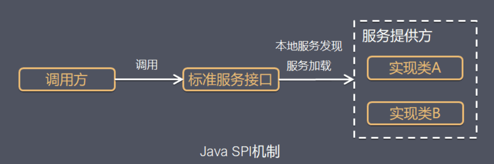
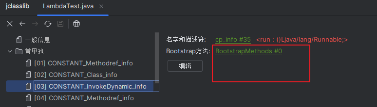
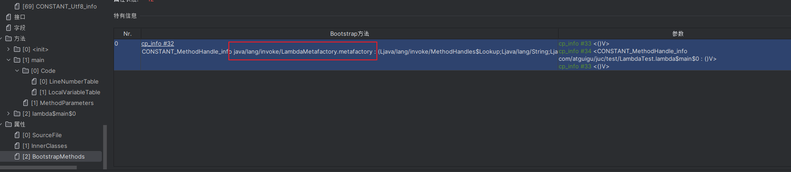
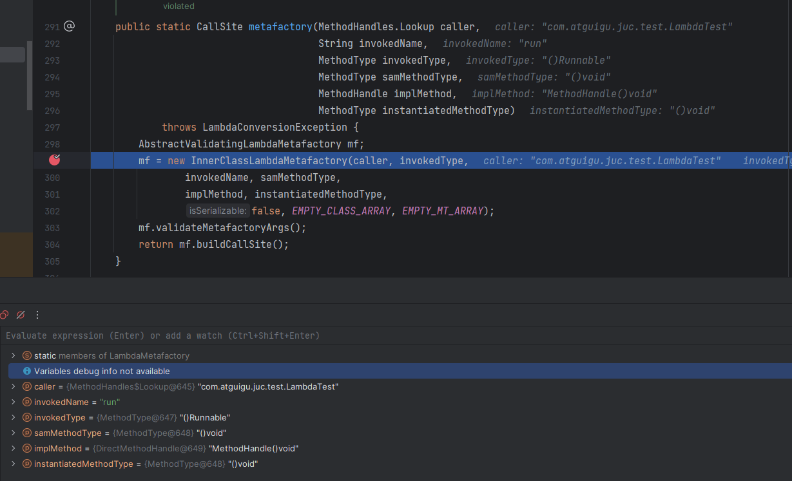
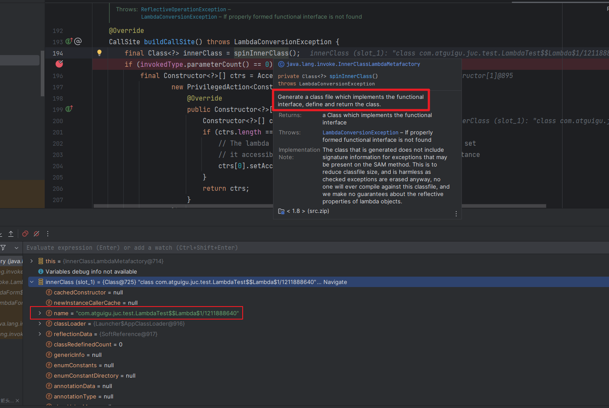
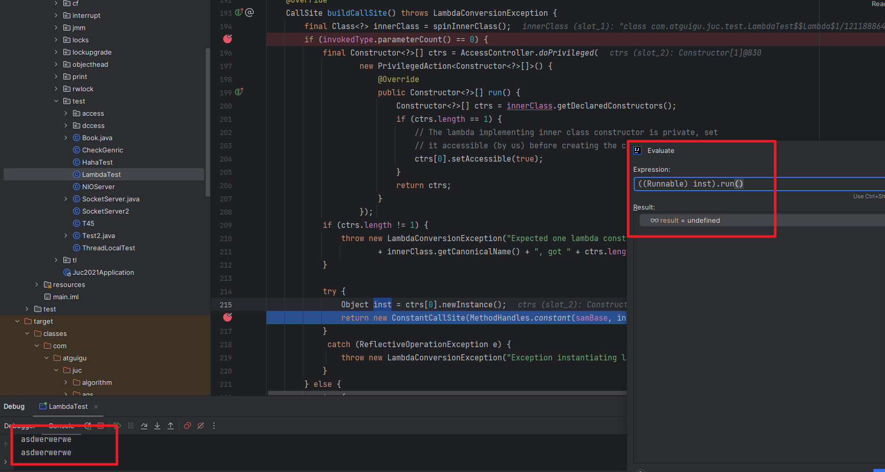

# 基础语法

## 1、实例对象可以引用静态变量。

```java
public class Test {
    private static int x = 100;

    public static void main(String args[]) {
        Test hs1 = new Test();
        hs1.x++;
        Test hs2 = new Test();
        hs2.x++;
        hs1 = new Test();
        hs1.x++;
        Test.x--;
        System.out.println("x=" + x);
    }
}
```

## 2、 异常

```java
	public static int aMethod(int i) throws Exception {
		try {
			return i / 0;
		} catch (Exception ex) {
			throw new Exception("exception in a Method");
		} finally {
			System.out.printf("finally");
		}
	}

	public static void main(String[] args) {
		try {
			aMethod(0);
		} catch (Exception ex) {
			System.out.printf("exception in main");
		}
		System.out.printf("finished");
	}
```

输出结果：**finallyexception in mainfinished**

## 3、方法、变量、类前加final 各有什么不一样?

4、泛型


5、比较器

### JVM

#### 1、JVM常用参数

对于JVM内存配置参数：

> -Xmx10240m -Xms10240m -Xmn5120m -XXSurvivorRatio=3

,其最小内存值和Survivor区总大小分别是（）

```java
-Xmx：最大堆大小
-Xms：初始堆大小
-Xmn:年轻代大小
-XXSurvivorRatio：年轻代中Eden区与Survivor区(按照单个算)的大小比值
//解答
年轻代5120m， Eden：Survivor=3，Survivor区大小=1024m（Survivor区有两个，即将年轻代分为5份，每个Survivor区占一份），总大小为2048m。
-Xms初始堆大小即最小内存值为10240m
```


## 4、Java中的静态绑定和动态绑定

对于java当中的方法而言，**除了final，static，private和构造方法是前期绑定外，其他的方法全部为动态绑定。**

而动态绑定的典型发生在父类和子类的转换声明之下：

比如：Parent p = new Children();

其具体过程细节如下：

1：编译器检查对象的声明类型和方法名。

假设我们调用x.f(args)方法，并且x已经被声明为C类的对象，那么编译器会列举出C 类中所有的名称为f 的方法和从C 类的超类继承过来的f 方法。

2：接下来编译器检查方法调用中提供的参数类型。

如果在所有名称为f 的方法中有一个参数类型和调用提供的参数类型最为匹配，那么就调用这个方法，这个过程叫做“重载解析”。

3：当程序运行并且**使用动态绑定调用方法时，虚拟机必须调用同x所指向的对象的实际类型相匹配的方法版本。**

假设实际类型为D(C的子类)，如果D类定义了f(String)那么该方法被调用，否则就在D的超类中搜寻方法f(String),依次类推。

**JAVA 虚拟机调用一个类方法时（静态方法），==它会基于对象引用的类型(通常在编译时可知)来选择所调用的方法==。**相反，==当虚拟机调用一个实例方法时，它会基于对象实际的类型(只能在运行时得知)来选择所调用的方法==，这就是动态绑定，是多态的一种。动态绑定为解决实际的业务问题提供了很大的灵活性，是一种非常优美的机制。

```java
package com.honyelchak.stack;

import java.util.ArrayList;
import java.util.Collection;
import java.util.LinkedList;

public class JavaNNNTest {

    public static void main(String[] args) {
        A a = new B();
        Collection c = new ArrayList<>();
        Collection d = new LinkedList<>();
        a.getPP(c);
        a.getPP(d);
        a.test(c);
    }
}
 class A {
    public static void getPP(Collection col){
        System.out.println("A getPP  col");
    }
    public static void getPP(ArrayList list) {
        System.out.println("A getPP  ArrayList");
    }
    public void test(Collection col){
        System.out.println("A 成员 getPP  col");
    }

     public void test(ArrayList col){
         System.out.println("A 成员 getPP  ArrayList");
     }

     public void getPP(LinkedList col){
         System.out.println("A getPP  LinkedList");
     }
}

class B extends A{
    public static void getPP(Collection col){
        System.out.println("B getPP  col");
    }
    public static void getPP(ArrayList list){
        System.out.println("B getPP  list");
    }

    @Override
    public void test(ArrayList col) {
        super.test(col);
        System.out.println("B 成员 getPP  ArrayList");
    }

    @Override
    public void test(Collection col) {
        super.test(col);
        System.out.println("B 成员 getPP  Collection");

    }
}

A getPP  col
A getPP  col
A 成员 getPP  col
B 成员 getPP  Collection
```

与方法不同，在处理java类中的成员变量（实例变量和类变量）时，并不是采用运行时绑定，而是一般意义上的静态绑定。所以在向上转型的情况下，对象的方法可以找到子类，**而对象的属性（成员变量）还是父类的属性（子类对父类成员变量的隐藏）。**

```java
public class Father {
    protected String name = "父亲属性";
}
　　
 
public class Son extends Father {
    protected String name = "儿子属性";
 
    public static void main(String[] args) {
        Father sample = new Son();
        System.out.println("调用的属性：" + sample.name);
    }
}
// 调用的属性是父亲属性。
```

这个结果表明，子类的对象(由父类的引用handle)调用到的是父类的成员变量。 所以==必须明确，运行时（动态）绑定针对的范畴只是对象的方法。==

java因为什么对属性要采取静态的绑定方法？

这是因为静态绑定是有很多的好处，**它可以让我们在编译期就发现程序中的错误，而不是在运行期**。这样就可以提高程序的运行效率！**而对方法采取动态绑定是为了实现多态**，多态是java的一大特色。多态也是面向对象的关键技术之一，所以java是以效率为代价来实现多态这是很值得的。


## 5、Java中对于泛型的规定

### 泛型类

1. 泛型类型可以有单个或多个，泛型变量放在类名后边。
2. 泛型方法可以用类泛型变量

```java
public class Demo<K, V>{
    private K val1;
    private V val2;
}
```

### 泛型方法

泛型方法，是在调用方法的时候指明泛型的具体类型。

1. 定义泛型方法时，必须在返回值前边加一个`<T>`，来声明这是一个泛型方法，持有一个泛型`T`，然后才可以用泛型T作为方法的返回值。例如：

    ```java
    public <T> void myMethod(T arg) {
        // 方法实现
    }
    ```

    在这个例子中，`<T>` 表示这是一个类型参数列表，其中 `T` 是一个类型参数。

2. 泛型方法的类型参数列表可以包含多个类型参数，例如：

    ```java
    public <T, U> void myMethod(T arg1, U arg2) {
        // 方法实现
    }
    ```

    在这个例子中，类型参数列表中有两个类型参数 `T` 和 `U`。

3. 泛型方法的类型参数可以用于方法参数类型、方法返回类型或方法中的局部变量类型。例如：

    ```java
    public <T> T myMethod(T arg) {
        // 方法实现
    }

    public <T, U> U myMethod(T arg1, U arg2) {
        // 方法实现
    }

    public <T extends Comparable<T>> int myMethod(T[] arg) {
        // 方法实现
    }
    ```

    在这些例子中，泛型类型参数 `T` 和 `U` 分别用于方法参数类型、方法返回类型或方法中的局部变量类型。

4. 泛型方法可以**定义在泛型类中或非泛型**类中。如果泛型方法在泛型类中定义，它可以使用类的类型参数。

5. **泛型方法的类型参数在方法调用时可以通过实际类型参数来推断**，例如：

    ```java
    List<String> myList = new ArrayList<>();
    myList.add("hello");
    myList.add("world");
    
    String first = myMethod(myList.get(0)); // 调用 myMethod 方法，实际类型参数为 String
    ```

    在这个例子中，我们调用了一个泛型方法 `myMethod()`，通过实际类型参数 `String` 推断出方法的类型参数 `T` 为 `String`，然后获取了列表中的第一个元素并赋值给变量 `first`。


**为什么要使用泛型方法呢**？

因为泛型类要在实例化的时候就指明类型，如果想换一种类型，不得不重新new一次，可能不够灵活；而泛型方法可以在调用的时候指明类型，更加灵活。

### 泛型命名

在 Java 官方文档中，对于泛型参数的命名有**一些约定俗成的规则**，主要包括以下几点：

1. 类型参数的名称通常使用**单个大写字母**来表示，例如 `T`、`E`、`K`、`V` 等等。这些字母通常表示不同的类型，**例如 `T` 表示任意类型，`E` 表示元素类型，`K` 和 `V` 分别表示键和值的类型。**
   - E - 元素（Java集合框架中广泛使用）
   - K - 键
   - N - 数字
   - T - 类型
   - V - 值
   - S，U，V等 - 第二个、第三个、第四个类型
2. 如果一个类或接口有多个类型参数，可以使用不同的字母来表示不同的类型，例如 `Map<K, V>` 中的 `K` 和 `V` 就表示不同的类型。
3. 在定义泛型方法时，类型参数的名称通常放在方法修饰符后面，并使用尖括号来包围类型参数列表，例如 `public <T> T identity(T t)`。
4. 在使用泛型类型或方法时，需要提供具体的类型参数，例如 `List<String>` 表示一个元素类型为字符串的列表，`<Integer>Arrays.asList(1, 2, 3)` 表示一个整数类型的列表。

需要注意的是，这些命名约定并不是强制性的规则，只是为了提高代码可读性和可维护性而建议使用。在实际编码过程中，也可以使用其他的名称来表示泛型参数，只要符合 Java 语法规范即可。

### 泛型的上限和下限

在使用泛型的时候，我们可以为传入的泛型类型实参进行上下边界的限制，如：类型实参只准传入某种类型的父类或某种类型的子类。

#### 上限通配符

List<? extends A> 代表的是一个可以持有 A及其子类（如B和C）的实例的List集合。

当集合所持有的实例是A或者A的子类的时候，此时从集合里读出元素并把它强制转换为A是安全的。下面是一个例子：

```java
public void processElements(List<? extends A> elements){
   for(A a : elements){
      System.out.println(a.getValue());
   }
}
```

这个时候你可以把`List<A>,List<B>或者List<C>`类型的变量作为参数传入processElements()方法之中。因此，下面的例子都是合法的：

```java
List<A> listA = new ArrayList<A>();
processElements(listA);
List<B> listB = new ArrayList<B>();
processElements(listB);
List<C> listC = new ArrayList<C>();
processElements(listC);
```

*processElements()*方法仍然是不能给传入的list插入元素的（比如进行*list.add()*操作），因为你不知道list集合里面的元素是什么类型（A、B还是C等等）。

#### **下界通配符**

List<? super A> 的意思是List集合 list,它可以持有 A 及其父类的实例。

当你知道集合里所持有的元素类型都是A及其父类的时候，此时往list集合里面插入A及其子类（B或C）是安全的。

```java
public static void insertElements(List<? super A> list){

   list.add(new A());

   list.add(new B());

   list.add(new C());

}
```


### 泛型的通配符？


通配符`?`不仅能够匹配子类型，还可以匹配父类型。

```java
public static void handlerList(Arr)

```


### 泛型并非无所不能

1. **不能实例化类型变量，如`T obj = new T();`**

   **解决方案：**

   - 使用反射

     ```java
     public class GenericObj<T> {
       private T obj;
       public GenericObj(Class<T> c){
           try {
             obj = c.newInstance();
           } catch (Exception e) {
             e.printStackTrace();
           }
         }
     }
     public class Test {
       public static void main (String args[]) {
         GenericObj<String> go = new GenericObj<> (String.class);
       }
     }
     ```

2. **不能实例化泛型数组，如`T[] arr = new T[3];`**

   **解决方案：**

   1. 创建Object类型的数组，获取是转型为T类型：

      ```java
      public class GenericArray<T>  {
        private Object [] arr;
        public GenericArray(int n) {
          this.arr = new Object[n];
        }
        public void set (int i, T o) {
          this.arr[i] = o;
        }
        public T get (int i) {
          return (T)this.arr[i];
        }
      }
      ```

   2. 使用反射机制中的Array.newInstance方法创建泛型数组

      ```java
      public class GenericArray<T> {
        private T [] arr;
        public GenericArray(Class<T> type, int n) {
          arr = (T[])Array.newInstance(type, n); // 利用反射创建泛型类型的数组
        }
        public void set (int i, T o) {
          this.arr[i] = o;
        }
        public T get (int i) {
          return (T)this.arr[i];
        }
      }
      public class Test {
        public static void main (String args[]) {
        GenericArray<String> genericArr = new GenericArray<>(String.class, 5);
        genericArr.set(0, "penghuwan");
        System.out.println(genericArr.get(0)); // 输出 "penghuwan"
        }
      }
      ```

> 这里不合法仅仅指实例化操作（new）, 声明是允许的， 例如T [] arr

3. **不能在泛型类的静态上下文中使用类型变量，注意在静态泛型方法中时可以使用的**

   ```java
   public class Foo<T> {
     private static T t; // 报错， 提示： 'Foo.this' can not be referenced from a static context
     public static T get () { // 报错， 提示： 'Foo.this' can not be referenced from a static context
       return T;
     }
   }
   public class Foo<T> {
     public static <T> T get () { // 不会报错
       return T;
     }
   }
   ```


4. 不能使用基本类型的值做为类型变量的值

   1. 应该选用这些基本类型对应的包装类型

      ```java
      Demo<int> d = new Demo<>(); // 非法
      
      Demo<Integer> d = new Demo<>();
      ```

      

5. 不能创建泛型类的数组

   ```java
   Demoo2<String>[] t = new Demoo2<String>[100];  // Generic array creation
   ```

   1. 可以声明通配类型的数组，之后做强制转换

      ```java
      Demoo2<String>[] f = (Demoo2<String>[]) new Demoo2<?>[100];
      ```

      

   

### JDK7及JDK7之后的泛型类对象

JDK7以后，在实例化一个泛型类对象时，构造函数中可以省略泛型类型。

```java
Demo<LinkedList> arrayListDemo2 = new Demo<LinkedList>();
// JDK7以后，在实例化一个泛型类对象时，构造函数中可以省略泛型类型。
Demo<LinkedList> arrayListDemo2 = new Demo<>();
```


### 如何理解Java中的泛型是伪泛型

泛型中类型擦除 Java泛型这个特性是从JDK 1.5才开始加入的，因此为了兼容之前的版本，Java泛型的实现采取了“伪泛型”的策略，即Java在语法上支持泛型，但是在编译阶段会进行所谓的“类型擦除”（Type Erasure），将所有的泛型表示（尖括号中的内容）都替换为具体的类型（其对应的原生态类型），就像完全没有泛型一样。

> 官方文档中对于泛型的描述：
>
> *Java的泛型是通过类型擦除实现的。这意味着在编译时，所有泛型类型的类型参数都被替换为其上限或Object（如果没有指定上限），并且在运行时，所有泛型类型的实例都被视为Object类型。*
>
> 


## 6、注解

JDK.15之后引入的一个特性，用来对代码进行说明，可以对包、类、接口、字段、方法参数、局部变量等进行注释。


### 注解的分类

#### Java自带的注解

`@Override`、`@Deprecated`、`@SuppressWarnings`

#### 元注解

元注解是用于定义注解的注解，包括`@Retention`、`@Target`、`@Inherited`、`@Documented`

- `@Retention`用于标明注解**被保留的阶段**
- `@Target`用于标明注解**使用的范围**
- `@Inherited`用于标明**注解可继承**
- `@Documented`用于标明是否生成javadoc文档

#### 自定义注解


## 7、异常


- **运行时异常**

都是RuntimeException类及其子类异常，如NullPointerException(空指针异常)、IndexOutOfBoundsException(下标越界异常)等，这些异常是不检查异常，**程序中可以选择捕获处理，也可以不处理**。这些异常一般是由程序逻辑错误引起的，程序应该从逻辑角度尽可能避免这类异常的发生。

运行时异常的特点是**Java编译器不会检查它**，也就是说，当程序中可能出现这类异常，即使没有用try-catch语句捕获它，也没有用throws子句声明抛出它，也会编译通过。

- **非运行时异常** （编译异常）

**是RuntimeException以外的异常，类型上都属于Exception类及其子类。**

从程序语法角度讲**是必须进行处理的异常，如果不处理，程序就不能编译通过。**如IOException、SQLException等以及用户自定义的Exception异常，一般情况下不自定义检查异常。


### 异常底层

提到JVM处理异常的机制，就需要提及Exception Table，以下称为异常表。我们暂且不急于介绍异常表，先看一个简单的 Java 处理异常的小例子。

```java
public static void simpleTryCatch() {
   try {
       testNPE();
   } catch (Exception e) {
       e.printStackTrace();
   }
}
```

使用javap来分析这段代码（需要先使用javac编译）

```java
//javap -c Main
 public static void simpleTryCatch();
    Code:
       0: invokestatic  #3                  // Method testNPE:()V
       3: goto          11
       6: astore_0
       7: aload_0
       8: invokevirtual #5                  // Method java/lang/Exception.printStackTrace:()V
      11: return
    Exception table:
       from    to  target type
           0     3     6   Class java/lang/Exception
```

看到上面的代码，应该会有会心一笑，因为终于看到了Exception table，也就是我们要研究的异常表。

异常表中包含了一个或多个异常处理者(Exception Handler)的信息，这些信息包含如下

- **from** 可能发生异常的起始点
- **to** 可能发生异常的结束点
- **target** 上述from和to之前发生异常后的异常处理者的位置
- **type** 异常处理者处理的异常的类信息


## 8、Java中的SPI机制(服务发现机制)

SPI（Service Provider Interface），**是JDK内置的一种 服务提供发现机制，可以用来启用框架扩展和替换组件，主要是被框架的开发人员使用**，比如java.sql.Driver接口，其他不同厂商可以针对同一接口做出不同的实现，MySQL和PostgreSQL都有不同的实现提供给用户，而Java的SPI机制可以为某个接口寻找服务实现。Java中SPI机制主要思想是将装配的控制权移到程序之外，在模块化设计中这个机制尤其重要，其核心思想就是 **解耦**。



在Java中，SPI机制的具体实现方式包括：

1. **服务接口的定义**
   1. 定义服务接口，并声明一组规范化的方法或行为。
2. **服务提供者的实现**
   1.  服务提供者实现服务接口，**并在META-INF/services目录下提供以服务接口全限定名为文件名的文件，文件内容为服务提供者的类全限定名。**
3. **服务加载器的实现**
   1. 服务加载器负责在类路径下查找所有符合规范的服务提供者，并加载它们。在Java中，服务加载器的实现可以通过java.util.ServiceLoader类来实现。

    ```java
    public class TestCase {
        public static void main(String[] args) {
            // 加载Search接口下的所有实现
            ServiceLoader<Search> s = ServiceLoader.load(Search.class);
            Iterator<Search> iterator = s.iterator();
            while (iterator.hasNext()) {
               Search search =  iterator.next();
               search.searchDoc("hello world");
            }
        }
    }
    ```


## 9、lambda表达式是如何生成的？

Lambda表达式的背后实际上是通过**LambdaMetafactory**这个工厂类来实现的。这个类是JDK提供的一个工具类，用于创建函数式接口的实例。它使用了一种称为"`invokedynamic`"的字节码指令来实现动态调用。


```java
public class LambdaTest {

    public static void main(String[] args) {
        Thread t1 = new Thread(() -> {
            System.out.println("asdwerwerwe");
        });
        t1.start();
        System.out.println("end!!!");
    }
}
```


调用`javap -c -p  LambdaTest.class`之后得到：

```java
Compiled from "LambdaTest.java"
public class com.atguigu.juc.test.LambdaTest {
  public com.atguigu.juc.test.LambdaTest();
    Code:
       0: aload_0
       1: invokespecial #1                  // Method java/lang/Object."<init>":()V
       4: return

  public static void main(java.lang.String[]);
    Code:
       0: new           #2                  // class java/lang/Thread
       3: dup
       4: invokedynamic #3,  0              // InvokeDynamic #0:run:()Ljava/lang/Runnable;
       9: invokespecial #4                  // Method java/lang/Thread."<init>":(Ljava/lang/Runnable;)V
      12: astore_1
      13: aload_1
      14: invokevirtual #5                  // Method java/lang/Thread.start:()V
      17: getstatic     #6                  // Field java/lang/System.out:Ljava/io/PrintStream;
      20: ldc           #7                  // String end!!!
      22: invokevirtual #8                  // Method java/io/PrintStream.println:(Ljava/lang/String;)V
      25: return

  private static void lambda$main$0();
    Code:
       0: getstatic     #6                  // Field java/lang/System.out:Ljava/io/PrintStream;
       3: ldc           #9                  // String asdwerwerwe
       5: invokevirtual #8                  // Method java/io/PrintStream.println:(Ljava/lang/String;)V
       8: return
}
```


1. 在编译阶段，Java编译器将Lambda表达式转换为一个私有的静态方法，即`lambda$main$0`方法。

2. `invokedynamic #3,  0`其实就是把生成的`lambda$main$0`方法与实际的调用点进行绑定。

   1. `invokedynamic`字节码会在运行时根据引导方法和方法类型来动态地解析和绑定方法的调用。
   2. 具体的动态调用逻辑由引导方法决定，在Lambda表达式的情况下，引导方法通常由LambdaMetafactory提供，用于创建函数式接口的实例并与Lambda表达式绑定。
   3. `invokedynamic #3, 0` 表示在这里使用引导方法（常量池中索引为3）和方法类型（索引为0）进行动态调用。

   > 而`#3`是常量池中的符号引用，对应的是bootstrap引导方法
   >
   > 
   >
   > 
   >
   > 这一串字符表示LambdaMetafactory生成的方法描述符（Method Descriptor）。在Java字节码中，方法描述符用于描述方法的参数类型和返回类型。
   >
   > ```txt
   > (Ljava/lang/invoke/MethodHandles$Lookup;：该部分表示方法的第一个参数类型，即MethodHandles.Lookup类型的参数。MethodHandles.Lookup是Java核心库中的一个类，用于执行动态方法调用。
   > Ljava/lang/String;：表示方法的第二个参数类型，即String类型的参数。
   > Ljava/lang/invoke/MethodType;：表示方法的第三个参数类型，即MethodType类型的参数。MethodType是Java核心库中的一个类，用于描述方法的类型信息，包括参数类型和返回类型。
   > Ljava/lang/invoke/MethodType;：表示方法的第四个参数类型，与第三个参数类型相同。
   > Ljava/lang/invoke/MethodHandle;：表示方法的第五个参数类型，即MethodHandle类型的参数。MethodHandle是Java核心库中的一个类，用于执行方法调用。
   > Ljava/lang/invoke/MethodType;)：表示方法的最后一个参数类型，即MethodType类型的参数。
   > ```


那我们把视角转向`LambdaMetafactory.metafactory()`

```java
public class LambdaMetafactory {
	public static CallSite metafactory(MethodHandles.Lookup caller,
                                       String invokedName,
                                       MethodType invokedType,
                                       MethodType samMethodType,
                                       MethodHandle implMethod,
                                       MethodType instantiatedMethodType)
            throws LambdaConversionException {
        AbstractValidatingLambdaMetafactory mf;
        mf = new InnerClassLambdaMetafactory(caller, invokedType,
                                             invokedName, samMethodType,
                                             implMethod, instantiatedMethodType,
                                             false, EMPTY_CLASS_ARRAY, EMPTY_MT_ARRAY);
        mf.validateMetafactoryArgs();
        return mf.buildCallSite();
    }
    ......
}
```


在这个方法里打个断点以debug模式运行，从下图可以看到根据相关的信息创建了一个`InnerClassLambdaMetafactory`工厂对象，然后利用工厂对象进行创建，但是还是不能明确的看到创建了内部类。



从`InnerClassLambdaMetafactory`内部类对象`mf`的一些属性可以看到有创建内部类的端倪。


紧接着，来到`mf.buildCallSite()`方法里，可以看到调用`spinInnnerClass()`

> 如下图注释所示：`spinInnnerClass()`的作用是**生成一个实现函数式接口的类文件**，并定义并返回该类。
>
> 具体如何生成的class文件，就不再深究，具体是调用了`UNSAFE`类的`defineAnonymousClass`方法

`spinInnnerClass()`执行完，生成的class对象如下图所示：



之后生成了该类的一个对象`inst`，可以在此处调用`inst.run()`方法执行了lambda表达式内的内容，以此来验证是真的生成一个内部类，并且把内部类的对象和该接口进行绑定。




总结

1. lambda表达式在编译的时候被编译器生成一个`private static `的方法(名字类似`lambda$main$0`)
2. 并且会生成`invokdynamic`字节码指令，调用相应的`bootstrap method`引导方法。
3. 该方法能够按照相应的接口动态的生成一个内部类，并将内部类的方法和编译期生成的`lambda$main$0`方法进行绑定(可以理解为等同)，
4. 最后调用`new ConstantCallSite(MethodHandles.constant(samBase, inst));`返回调用点。
   1. 这个地方我的理解就是，把按照lambda表达式生成的内部类实例对象与该接口进行绑定，形成一个调用点。


## 10、异常(OOM)是否会导致程序结束？

> 1. **什么会导致JVM退出？**
>    1. 虚拟机内不存在非守护线程。
> 2. **异常和线程的关系？**
>    1. `线程发生未处理的异常`（未处理异常由默认异常处理器处理）会导致线程结束，而与JVM的退出毫无关系。

结论是不会：

OOM也是一种异常，它的发生也不会导致JVM退出。以下实例说明：

```java
// https://heapdump.cn/article/1818321
static class OOMObject {
}

// 为快速发生oom，设置堆大小; VM args: -Xms20m -Xmx20m 
public static void main(String[] args) throws InterruptedException {
     new Thread(() -> {
         List<OOMObject> list = new ArrayList<>();
         while (true) {
             list.add(new OOMObject());
         }
     }).start();

     while (true) {
         System.out.println(Thread.currentThread().getName() + " continuing...");
         Thread.sleep(1000L);
     }
 }
```

线程抛出`java.lang.OutOfMemoryError: Java heap space`后，main线程依旧会循环打印main continuing…。
线程中发生OOM异常如此，发生其他异常也如此，不影响其他线程，也不会导致JVM退出。

### OOM与JVM退出

OOM的发生表示了此刻JVM堆内存告罄，不能分配出更多的资源，或者gc回收效率不可观。一个线程的OOM，在一定程度的并发下，若此时其他线程也需要申请堆内存，那么其他线程也会因为申请不到内存而OOM，甚至连锁反应导致整个JVM的退出。

以上示例没有导致JVM退出的原因在于，线程通过往局部变量集合中不断加入对象，产生OOM。线程因异常退出后，集合中的对象由于引用不可达，会被gc，这样就有了足够的堆内存供其他线程使用。

若示例中的list是一个“全局”的类static变量，那么即使线程退出，内存也得不到释放。这时其他线程如果不断再申请堆内存资源，就会造成连锁反应导致JVM退出。

## 11、Java中的Error能否被catch？

Error、Exception都实现了Throwing，所以可以捕获的。


## 12、Java到底是值传递还是引用传递？


形参： 就是形式参数，用于定义方法的时候使用的参数，是用来接收调用者传递的参数的。

实参： 就是实际参数，用于调用时传递给方法的参数。实参在传递给别的方法之前是要被预先赋值的。

- 值传递： 是指在调用方法时，将实际参数拷贝一份传递给方法，这样在方法中修改形式参数时，不会影响到实际参数。
- 引用传递： 也叫地址传递，**是指在调用方法时，将实际参数的地址传递给方法**，这样在方法中对形式参数的修改，将影响到实际参数。


Java参数传递中，不管传递的是基本数据类型还是引用类型，都是值传递。

当传递基本数据类型，比如原始类型（int、long、char等）、包装类型（Integer、Long、String等），实参和形参都是存储在不同的栈帧内，修改形参的栈帧数据，不会影响实参的数据。

当传参的引用类型，形参和实参指向同一个地址的时候，修改形参地址的内容，会影响到实参。当形参和实参指向不同的地址的时候，修改形参地址的内容，并不会影响到实参。


## 13、Collections.sort和Arrays.sortd的关系？

ArrayList中的sort调用的就是 Arrays.sort方法

