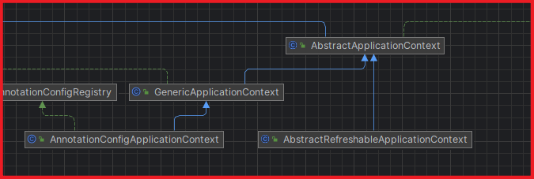
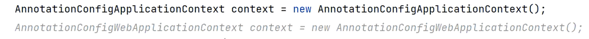
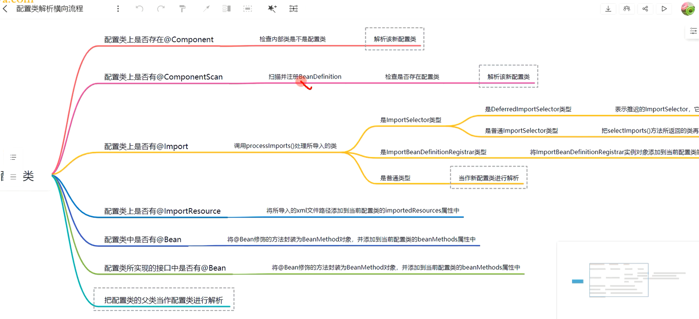
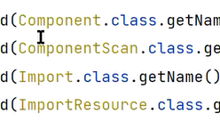

通常，我们说的Spring启动，就是构造ApplicationContext对象以及调用refresh()方法的过程。

 

> 创建一个BeanFactory
>
> 1. BeanDefinition -> beanDefinitionMap
> 2. beanpostProcessor -> beanpostProcessors
> 3. 单例池等
>
> 解析配置类，  扫描， 


首先，Spring启动过程主要做了这么几 件事情：

1. `this()`执行时，会先调父类构造方法，构造一个BeanFactory对象

   1. 默认在父类`GenerircApplicationContext`的无参构造方法中，会创建一个`DefaultListableBeanFactory`

      ```xml
      	public GenericApplicationContext() {
      		this.beanFactory = new DefaultListableBeanFactory();
      	}
      ```

   2. DefaultListableBeanFactory类中有`BeanDefinitionMap`

1. `register(componentClasses);`将类注册为BeanDefinition，并保存在BeanDefinitionMap中

2. 解析配置类，得到BeanDefinition，并注册到BeanFactory中
   1. 解析@ComponentScan，此时就会完成扫描
   2. 解析@Import
   3. 解析@Bean
3. 因为ApplicationContext还支持国际化，所以还需要初始化MessageSource对象
4. 因为ApplicationC ontext还支持事件机制，所以还需要初始化ApplicationEventMulticaster对象
5. 把用户定义的ApplicationListener对象添加到ApplicationContext中，等Spring启动完了就要发布事件了
6. 创建非懒加载的单例Bean对象，并存在BeanFactory的单例池中。
7. 调用Lifecycle Bean的start()方法
8. 发布ContextRefreshedEvent事件


由于Spring启动过程中要创建非懒加载的单例Bean对象，那么就需要用到BeanPostProcessor，所以Spring在启动过程中就需要做两件事：

1. 生成默认的BeanPostProcessor对象，并添加到BeanFactory中
   1. AutowiredAnnotationBeanPostProcessor：处理@Autowired、@Value
   2. CommonAnnotationBeanPostProcessor：处理@Resource、@PostConstruct、@PreDestroy
   3. ApplicationContextAwareProcessor：处理ApplicationContextAware等回调
2. 找到外部用户所定义的BeanPostProcessor对象（类型为BeanPostProcessor的Bean对象），并添加到BeanFactory中


##  BeanFactoryPostProcessor 

- BeanPostProcessor表示Bean的后置处理器，是用来对Bean进行加工的
- BeanFactoryPostProcessor理解为BeanFactory的后置处理器，用来用对BeanFactory进行加工的


Spring支持用户定义BeanFactoryPostProcessor的实现类Bean，来对BeanFactory进行加工，比如：

```java
@Component
public class ZhouyuBeanFactoryPostProcessor implements BeanFactoryPostProcessor {

	@Override
	public void postProcessBeanFactory(ConfigurableListableBeanFactory beanFactory) throws BeansException {
		BeanDefinition beanDefinition = beanFactory.getBeanDefinition("userService");
		beanDefinition.setAutowireCandidate(false);
	}
}
```

以上代码，就利用了BeanFactoryPostProcessor来拿到BeanFactory，然后获取BeanFactory内的某个BeanDefinition对象并进行修改，注意这一步是发生在Spring启动时，创建单例Bean之前的，所以此时对BeanDefinition就行修改是会生效的。


注意：在ApplicationContext内部有一个核心的`DefaultListableBeanFactory`，它实现了`ConfigurableListableBeanFactory`和`BeanDefinitionRegistry`接口，所以ApplicationContext和`DefaultListableBeanFactory`是可以注册BeanDefinition的，但是`ConfigurableListableBeanFactory`是不能注册BeanDefinition的，只能获取BeanDefinition，然后做修改。

所以Spring还提供了一个BeanFactoryPostProcessor的子接口：BeanDefinitionRegistryPostProcessor


###  BeanDefinitionRegistryPostProcessor 

我们可以看到BeanDefinitionRegistryPostProcessor继承了BeanFactoryPostProcessor接口，并新增了一个方法，注意方法的参数为BeanDefinitionRegistry，所以如果我们提供一个类来实现BeanDefinitionRegistryPostProcessor，那么在postProcessBeanDefinitionRegistry()方法中就可以注册BeanDefinition了。比如：

##  如何理解refresh()？

这是ConfigurableApplicationContext接口上refresh()方法的注释，意思是：

> 加载或刷新持久化的配置，可能是XML文件、属性文件或关系数据库中存储的。由于这是一个启动方法，如果失败，它应该销毁已经创建的单例，以避免暂用资源。换句话说，`在调用该方法之后，应该实例化所有的单例，或者根本不实例化单例 。`

有个理念需要注意：

>  ApplicationContext关闭之后不代表JVM也关闭了，ApplicationContext是属于JVM的，说白了ApplicationContext也是JVM中的一个对象。
>
> 在Spring的设计中，也提供可以刷新的ApplicationContext和不可以刷新的ApplicationContext。
>
> 比如：
>
> - `AbstractRefreshableApplicationContext extends AbstractApplicationContext`就是可以刷新的
> - `GenericApplicationContext extends AbstractApplicationContext`就是不可以刷新的
>   - 默认`AnnotationConfigApplicationContext`就是不可以二次刷新的。
>
> 
>
> **Ps：**上面说的**不能刷新是指不能重复刷新，只能调用一次refresh方法，第二次时会报错。**
>
> 还有一个小细节：
>
> 1. 上边这个执行的过程中会创建好BeanFactory，下边那个不会创建Bean工厂。
> 2. 


就是不可以刷新的。

```java
AnnotationConfigApplicationContext继承的是GenericApplicationContext，所以它是不能刷新的。

AnnotationConfigWebApplicationContext继承的是AbstractRefreshableWebApplicationContext，所以它是可以刷的。
```


AnnotationConfigApplicationContext继承的是GenericApplicationContext，所以它是不能刷新的。  

AnnotationConfigWebApplicationContext继承的是AbstractRefreshableWebApplicationContext，所以它是可以刷的。


上面说的不能刷新是指不能重复刷新，只能调用一次refresh方法，第二次时会报错。


 refresh()底层原理流程 


底层原理流程图：https://www.processon.com/view/link/5f60a7d71e08531edf26a919


下面以AnnotationConfigApplicationContext为例子，来介绍refresh的底层原理。


1在调用AnnotationConfigApplicationContext的构造方法之前，会调用父类GenericApplicationContext的无参构造方法，会构造一个BeanFactory，为DefaultListableBeanFactory。

2构造AnnotatedBeanDefinitionReader（主要作用添加一些基础的PostProcessor，同时可以通过reader进行BeanDefinition的注册），同时对BeanFactory进行设置和添加PostProcessor（后置处理器）

a设置dependencyComparator：AnnotationAwareOrderComparator，它是一个Comparator，是用来进行排序的，会获取某个对象上的Order注解或者通过实现Ordered接口所定义的值进行排序，在日常开发中可以利用这个类来进行排序。

b设置autowireCandidateResolver：ContextAnnotationAutowireCandidateResolver，用来解析某个Bean能不能进行自动注入，比如某个Bean的autowireCandidate属性是否等于true

c向BeanFactory中添加ConfigurationClassPostProcessor对应的BeanDefinition，它是一个BeanDefinitionRegistryPostProcessor，并且实现了PriorityOrdered接口

d向BeanFactory中添加AutowiredAnnotationBeanPostProcessor对应的BeanDefinition，它是一个InstantiationAwareBeanPostProcessorAdapter，MergedBeanDefinitionPostProcessor

e向BeanFactory中添加CommonAnnotationBeanPostProcessor对应的BeanDefinition，它是一个InstantiationAwareBeanPostProcessor，InitDestroyAnnotationBeanPostProcessor

f向BeanFactory中添加EventListenerMethodProcessor对应的BeanDefinition，它是一个BeanFactoryPostProcessor，SmartInitializingSingleton

g向BeanFactory中添加DefaultEventListenerFactory对应的BeanDefinition，它是一个EventListenerFactory

3构造ClassPathBeanDefinitionScanner（主要作用可以用来扫描得到并注册BeanDefinition），同时进行设置：

a设置this.includeFilters = AnnotationTypeFilter(Component.class)

b设置environment

c设置resourceLoader

4利用reader注册AppConfig为BeanDefinition，类型为AnnotatedGenericBeanDefinition

**5**接下来就是调用refresh方法

6prepareRefresh()：

a记录启动时间

b可以允许子容器设置一些内容到Environment中

c验证Environment中是否包括了必须要有的属性

7obtainFreshBeanFactory()：进行BeanFactory的refresh，在这里会去调用子类的refreshBeanFactory方法，具体子类是怎么刷新的得看子类，然后再调用子类的getBeanFactory方法，重新得到一个BeanFactory

8prepareBeanFactory(beanFactory)：

a设置beanFactory的类加载器

b设置表达式解析器：StandardBeanExpressionResolver，用来解析Spring中的表达式

c添加PropertyEditorRegistrar：ResourceEditorRegistrar，PropertyEditor类型转化器注册器，用来注册一些默认的PropertyEditor

d添加一个Bean的后置处理器：ApplicationContextAwareProcessor，是一个BeanPostProcessor，用来执行EnvironmentAware、ApplicationEventPublisherAware等回调方法

e添加ignoredDependencyInterface：可以向这个属性中添加一些接口，如果某个类实现了这个接口，并且这个类中的某些set方法在接口中也存在，那么这个set方法在自动注入的时候是不会执行的，比如EnvironmentAware这个接口，如果某个类实现了这个接口，那么就必须实现它的setEnvironment方法，而这是一个set方法，和Spring中的autowire是冲突的，那么Spring在自动注入时是不会调用setEnvironment方法的，而是等到回调Aware接口时再来调用（注意，这个功能仅限于xml的autowire，@Autowired注解是忽略这个属性的）

ⅰEnvironmentAware

ⅱEmbeddedValueResolverAware

ⅲResourceLoaderAware

ⅳApplicationEventPublisherAware

ⅴMessageSourceAware

ⅵApplicationContextAware

ⅶ另外其实在构造BeanFactory的时候就已经提前添加了另外三个：

ⅷBeanNameAware

ⅸBeanClassLoaderAware

XBeanFactoryAware

f添加resolvableDependencies：在byType进行依赖注入时，会先从这个属性中根据类型找bean

ⅰBeanFactory.class：当前BeanFactory对象

ⅱResourceLoader.class：当前ApplicationContext对象

ⅲApplicationEventPublisher.class：当前ApplicationContext对象

ⅳApplicationContext.class：当前ApplicationContext对象

g添加一个Bean的后置处理器：ApplicationListenerDetector，是一个BeanPostProcessor，用来判断某个Bean是不是ApplicationListener，如果是则把这个Bean添加到ApplicationContext中去，注意一个ApplicationListener只能是单例的

h添加一个Bean的后置处理器：LoadTimeWeaverAwareProcessor，是一个BeanPostProcessor，用来判断某个Bean是不是实现了LoadTimeWeaverAware接口，如果实现了则把ApplicationContext中的loadTimeWeaver回调setLoadTimeWeaver方法设置给该Bean。

i添加一些单例bean到单例池：

ⅰ"environment"：Environment对象

ⅱ"systemProperties"：System.getProperties()返回的Map对象

ⅲ"systemEnvironment"：System.getenv()返回的Map对象

9postProcessBeanFactory(beanFactory) ： 提供给AbstractApplicationContext的子类进行扩展，具体的子类，可以继续向BeanFactory中再添加一些东西

10invokeBeanFactoryPostProcessors(beanFactory)：执行BeanFactoryPostProcessor

a此时在BeanFactory中会存在一个BeanFactoryPostProcessor：ConfigurationClassPostProcessor，它也是一个BeanDefinitionRegistryPostProcessor

**b**第一阶段

c从BeanFactory中找到类型为BeanDefinitionRegistryPostProcessor的beanName，也就是ConfigurationClassPostProcessor， 然后调用BeanFactory的getBean方法得到实例对象

d执行ConfigurationClassPostProcessor的postProcessBeanDefinitionRegistry()方法:

ⅰ解析AppConfig类

ⅱ扫描得到BeanDefinition并注册

ⅲ解析@Import，@Bean等注解得到BeanDefinition并注册

ⅳ详细的看另外的笔记，专门分析了ConfigurationClassPostProcessor是如何工作的

ⅴ在这里，我们只需要知道在这一步会去得到BeanDefinition，而这些BeanDefinition中可能存在BeanFactoryPostProcessor和BeanDefinitionRegistryPostProcessor，所以执行完ConfigurationClassPostProcessor的postProcessBeanDefinitionRegistry()方法后，还需要继续执行其他BeanDefinitionRegistryPostProcessor的postProcessBeanDefinitionRegistry()方法

e执行其他BeanDefinitionRegistryPostProcessor的postProcessBeanDefinitionRegistry()方法

f执行所有BeanDefinitionRegistryPostProcessor的postProcessBeanFactory()方法

**g**第二阶段

h从BeanFactory中找到类型为BeanFactoryPostProcessor的beanName，而这些BeanFactoryPostProcessor包括了上面的BeanDefinitionRegistryPostProcessor

i执行还没有执行过的BeanFactoryPostProcessor的postProcessBeanFactory()方法

11到此，所有的BeanFactoryPostProcessor的逻辑都执行完了，主要做的事情就是得到BeanDefinition并注册到BeanFactory中

12registerBeanPostProcessors(beanFactory)：因为上面的步骤完成了扫描，这个过程中程序员可能自己定义了一些BeanPostProcessor，在这一步就会把BeanFactory中所有的BeanPostProcessor找出来并实例化得到一个对象，并添加到BeanFactory中去（属性beanPostProcessors），最后再重新添加一个ApplicationListenerDetector对象（之前其实就添加了过，这里是为了把ApplicationListenerDetector移动到最后）

13initMessageSource()：如果BeanFactory中存在一个叫做"messageSource"的BeanDefinition，那么就会把这个Bean对象创建出来并赋值给ApplicationContext的messageSource属性，让ApplicationContext拥有国际化的功能

14initApplicationEventMulticaster()：如果BeanFactory中存在一个叫做"applicationEventMulticaster"的BeanDefinition，那么就会把这个Bean对象创建出来并赋值给ApplicationContext的applicationEventMulticaster属性，让ApplicationContext拥有事件发布的功能

15onRefresh()：提供给AbstractApplicationContext的子类进行扩展，没用

16registerListeners()：从BeanFactory中获取ApplicationListener类型的beanName，然后添加到ApplicationContext中的事件广播器applicationEventMulticaster中去，到这一步因为FactoryBean还没有调用getObject()方法生成Bean对象，所以这里要在根据类型找一下ApplicationListener，记录一下对应的beanName

17finishBeanFactoryInitialization(beanFactory)：完成BeanFactory的初始化，主要就是实例化非懒加载的单例Bean，单独的笔记去讲。

18finishRefresh()：BeanFactory的初始化完后，就到了Spring启动的最后一步了

a设置ApplicationContext的lifecycleProcessor，默认情况下设置的是DefaultLifecycleProcessor

b调用lifecycleProcessor的onRefresh()方法，如果是DefaultLifecycleProcessor，那么会获取所有类型为Lifecycle的Bean对象，然后调用它的start()方法，这就是ApplicationContext的生命周期扩展机制

c发布ContextRefreshedEvent事件


 执行BeanFactoryPostProcessor 


1执行通过ApplicationContext添加进来的BeanDefinitionRegistryPostProcessor的postProcessBeanDefinitionRegistry()方法

2执行BeanFactory中实现了PriorityOrdered接口的BeanDefinitionRegistryPostProcessor的postProcessBeanDefinitionRegistry()方法

3执行BeanFactory中实现了Ordered接口的BeanDefinitionRegistryPostProcessor的postProcessBeanDefinitionRegistry()方法

4执行BeanFactory中其他的BeanDefinitionRegistryPostProcessor的postProcessBeanDefinitionRegistry()方法

5执行上面所有的BeanDefinitionRegistryPostProcessor的postProcessBeanFactory()方法

6执行通过ApplicationContext添加进来的BeanFactoryPostProcessor的postProcessBeanFactory()方法

7执行BeanFactory中实现了PriorityOrdered接口的BeanFactoryPostProcessor的postProcessBeanFactory()方法

8执行BeanFactory中实现了Ordered接口的BeanFactoryPostProcessor的postProcessBeanFactory()方法

9执行BeanFactory中其他的BeanFactoryPostProcessor的postProcessBeanFactory()方法

 Lifecycle的使用 

Lifecycle表示的是ApplicationContext的生命周期，可以定义一个SmartLifecycle来监听ApplicationContext的启动和关闭：


Java


## 小问题

```java
@Bean (autowired.BY_TYPE = "true")
public void User（）{
   return new User();
}

public class User implements EnvironmentWare{
    
    private Environment environment;
	@Override
    public void setEnvironment(Environment environment){
        System.out.println("xxxx");
        this.environment = environment;
    }
}


// 在这种情况下xxxx只会打印1次，因为autowired.BY_TYPE会在底层进行判断，set方法对应的type是否在ignoreDependencyInterface集合中，在的话就会跳过，然后在执行回调的时候进行注入。


// 下面这种情况会打印两次
public class User implements EnvironmentWare{
    
    private Environment environment;
	@Override
    @Bean
    public void setEnvironment(Environment environment){
        System.out.println("xxxx");
        this.environment = environment;
    }
}
```


如何在代码中注入BeanFactory、ResourceLoader、ApplicationContext等对象

1. 利用回调，实现xxxAware

2. 直接使用`@Autowired`，因为在`onrefeash() --> prepareBeanFactory()`的过程中会将这几个类直接注入进去。

   ```java
   // BeanFactory interface not registered as resolvable type in a plain factory.
   		// MessageSource registered (and found for autowiring) as a bean.
   		beanFactory.registerResolvableDependency(BeanFactory.class, beanFactory);
   		beanFactory.registerResolvableDependency(ResourceLoader.class, this);
   		beanFactory.registerResolvableDependency(ApplicationEventPublisher.class, this);
   		beanFactory.registerResolvableDependency(ApplicationContext.class, this);
   ```

   


## 事件

基本概念：

- ApplicationEventMulticaster事件发布器
  - 默认情况下，各个监听器是串行执行的
  - 当然也提供了异步执行监听器的接口(线程池)
- ApplicationListener事件监听器(需要程序员自己去实现)
  - 两种定义监听器的方法：
    - 实现`ApplicationListener`接口
    - 在方法上加`@EventListener`注解

### 关于事件(4个相关的类)

按顺序添加：


1. 在创建reader的时候，会默认加入`EventListenerMethodProcessor`、`DefaultEventListenerFactory`

   ```java
   AnnotatedBeanDefinitionReader()
   !AnnotationConfigUtils.registerAnnotationConfigProcessors(this.registry);
   
   //----下边时具体的添加细节---
   
   // 注册EventListenerMethodProcessor类型的BeanDefinition，用来处理@EventListener注解的
   if (!registry.containsBeanDefinition(EVENT_LISTENER_PROCESSOR_BEAN_NAME)) {
       RootBeanDefinition def = new RootBeanDefinition(EventListenerMethodProcessor.class);
       def.setSource(source);
       beanDefs.add(registerPostProcessor(registry, def, EVENT_LISTENER_PROCESSOR_BEAN_NAME));
   }
   
   // 注册DefaultEventListenerFactory类型的BeanDefinition，用来处理@EventListener注解的
   if (!registry.containsBeanDefinition(EVENT_LISTENER_FACTORY_BEAN_NAME)) {
       RootBeanDefinition def = new RootBeanDefinition(DefaultEventListenerFactory.class);
       def.setSource(source);
       beanDefs.add(registerPostProcessor(registry, def, EVENT_LISTENER_FACTORY_BEAN_NAME));
   }
   
   ```

   

2. 在`onfresh()`中的`prepareBeanFactory()`方法添加了`ApplicationListenerDetector`

   1. 扫描所有实现ApplicationListener接口的监听器

3. 在`onfresh()`中的`initApplicationEventMulticaster()`方法中初始化了`ApplicationEventMulticaster`


### EventListenerMethodProcessor

该Processor实现了`SmartInitializingSingleton`接口，所以在所有单例Bean实例化之后会执行`afterSingletonsInstantiated`方法

在该方法中会扫描所有的Bean，找到加有`@EventListener`注解的方法，最后利用EventListenerFactory来对加了@EventListener注解的方法生成ApplicationListener对象


## 配置类解析过程




关于配置类还有full、lite的区分()：

- full配置类(proxyBeanMethods == true)
- lite配置类(proxyBeanMethods == false)
  - 1. 
    2. 有加了@Bean的方法


认为是一个配置类，那么就会解析配置类。

当扫描配置类时，扫描到ComponentScan注解，就会触发扫描的逻辑

### 


@import注解 

@importResource注解 

解析配置类中的@Bean，并没有真正处理，只是暂时找出来，生成BeanMethod，并存储起来

解析配置类所实现接口中的@Bean(`default`方法)，并没有真正处理，只是暂时找出来，生成BeanMethod，并存储起来


若有@Component，还有@Bean，也是可以的。