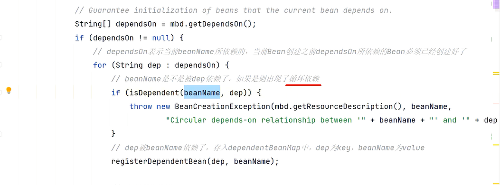
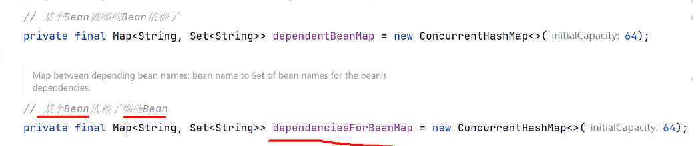

## Spring框架中的循环依赖

### @DependsOn(无法解决)

简单来说，就是@DependsOn注解标识了在创建当前对象之前需要创建的对象，而若创建`需要创建的对象`需要先创建`当前对象`，那么就说明产生了循环依赖。

Spring框架在doGetBean方法中通过`isDependent()`给对DependsOn注解进行了循环依赖检查：

**解决方式：**直接抛出异常

