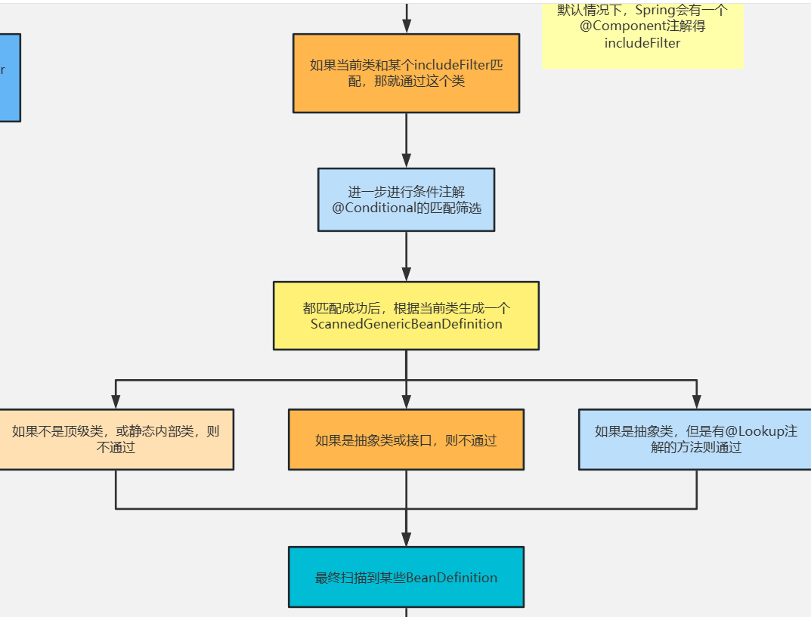

> Spring在创建对象的时候，
>
> 主要先进行扫描
>
> UserService.class ---> 无参构造方法 --->普通对象--->依赖注入（属性赋值、BeanNameAware接口、BeanClassLoaderAware接口、BeanFactoryAware接口）--->初始化前（postconstruct)--->初始化（initializingBean)--->初始化后（aop)--->代理对象--->Bean


1. 实现 Bean 的创建和管理：Spring 框架的核心是 Bean 容器，需要实现 Bean 的创建、初始化、销毁等功能。可以通过反射来实现 Bean 的创建，使用工厂模式来管理 Bean 对象。
2. 实现依赖注入：依赖注入是 Spring 框架的核心功能之一，需要实现自动装配和注入 Bean 之间的依赖关系。可以使用反射和注解来实现依赖注入，实现对 Bean 之间的依赖关系进行自动装配。
3. 实现 AOP 功能：AOP 是 Spring 框架的另一个核心功能，需要实现切面编程、方法拦截、事务管理等功能。可以使用动态代理和字节码增强等技术来实现 AOP 功能。
4. 实现 Web MVC：Web MVC 是 Spring 框架的重要组成部分，需要实现请求映射、控制器、视图解析器等功能。可以使用 Servlet 和 JSP 技术来实现 Web MVC 功能。

# 手写Spring框架

思路：

1. 通过配置类，扫描指令路径下的所有类。
2. 扫描类里的`@Component`注解，之后针对类和注解生成BeanDefinition，并把实现了之后存储在BeanDefinition Map中。
3. 之后遍历整个`BeanDefinition`Map，找到使得单例并且不是懒加载的对象，将单例对象创建出来之后放到singletonBeanMap中。
   1. 创建对象的过程中，要创建对象并进行依赖注入。
   2. 执行各种`Aware`的`setxx`方法
      1. BeanNameAware的setBeanName方法
      2. ApplicationContextAware的setApplicationContext方法
   3. 执行`beanPostProcessor`中的`postProcessBeforeInitialization`方法。
   4. 执行`initializingBean`的`afterPropertiesSet`方法
   5. 执行`beanPostProcessor`中的`postProcessAfterInitialization`方法。
   6. 

# 核心概念解析

## BeanDefinition(接口)

BeanDefinition表示Bean定义，BeanDefinition中存在很多属性用来描述一个Bean的特点。比如：

- class，表示Bean类型
- scope，表示Bean作用域，单例或原型等
- lazyInit：表示Bean是否是懒加载
- initMethodName：表示Bean初始化时要执行的方法
- destroyMethodName：表示Bean销毁时要执行的方法
- 还有很多...

### Spring中定义Bean的方式

在Spring中，我们经常会通过以下几种方式来定义Bean：

1. `<bean/>`
2. `@Bean`
3. `@Component(@Service,@Controller)`

这些，我们可以称之**申明式定义Bean**。

我们还可以**编程式定义Bean**，那就是直接通过BeanDefinition，比如：

```java
AnnotationConfigApplicationContext context = new AnnotationConfigApplicationContext(AppConfig.class);

// 生成一个BeanDefinition对象，并设置beanClass为User.class，并注册到ApplicationContext中
AbstractBeanDefinition beanDefinition = BeanDefinitionBuilder.genericBeanDefinition().getBeanDefinition();
beanDefinition.setBeanClass(User.class);
context.registerBeanDefinition("user", beanDefinition);

System.out.println(context.getBean("user"));
```

我们还可以通过BeanDefinition设置一个Bean的其他属性

```java
beanDefinition.setScope("prototype"); // 设置作用域
beanDefinition.setInitMethodName("init"); // 设置初始化方法
beanDefinition.setLazyInit(true); // 设置懒加载
```

和申明式事务、编程式事务类似，通过<bean/>，@Bean，@Component等申明式方式所定义的Bean，最终都会被Spring解析为对应的BeanDefinition对象，并放入Spring容器中。

---

### BeanDefinition实现类


------

## BeanDefinitionReader(接口)

接下来，我们来介绍几种在Spring源码中所提供的`BeanDefinition读取器`（BeanDefinitionReader），这些BeanDefinitionReader在我们使用Spring时用得少，但在Spring源码中用得多，相当于Spring源码的基础设施。

### AnnotatedBeanDefinitionReader

可以**直接把某个类转换为BeanDefinition，并且会解析该类上的注解**，比如

```java
// 1.方式1(直接传入AppConfig.class),构造方法已经帮我们register和refresh了
// AnnotationConfigApplicationContext context = new AnnotationConfigApplicationContext(AppConfig.class);
// 2.方式2(使用register方法注册Appconfig.class)
AnnotationConfigApplicationContext context = new AnnotationConfigApplicationContext();
context.register(AppConfig.class);
context.fresh();

AnnotatedBeanDefinitionReader annotatedBeanDefinitionReader = new AnnotatedBeanDefinitionReader(context);

// 将User.class解析为BeanDefinition
annotatedBeanDefinitionReader.register(User.class);

System.out.println(context.getBean("user"));
```

注意：它能解析的注解是：`@Conditional，@Scope、@Lazy、@Primary、@DependsOn、@Role、@Description`

### XmlBeanDefinitionReader

可以解析`<bean/>`标签

```java
AnnotationConfigApplicationContext context = new AnnotationConfigApplicationContext(AppConfig.class);

XmlBeanDefinitionReader xmlBeanDefinitionReader = new XmlBeanDefinitionReader(context);
int i = xmlBeanDefinitionReader.loadBeanDefinitions("spring.xml");

System.out.println(context.getBean("user"));
```

### ClassPathBeanDefinitionScanner

ClassPathBeanDefinitionScanner是扫描器，但是它的作用和BeanDefinitionReader类似，**它可以进行扫描，扫描某个包路径，对扫描到的类进行解析**，比如，扫描到的类上如果存在@Component注解，那么就会把这个类解析为一个BeanDefinition，比如：

```java
AnnotationConfigApplicationContext context = new AnnotationConfigApplicationContext();
context.refresh();

ClassPathBeanDefinitionScanner scanner = new ClassPathBeanDefinitionScanner(context);
scanner.scan("com.zhouyu");

System.out.println(context.getBean("userService"));
```

-------

## BeanFactory(接口)

BeanFactory表示Bean**工厂**，所以很明显，BeanFactory会负责创建Bean，并且提供获取Bean的API。

而`ApplicationContext是BeanFactory的一种`，在Spring源码中，是这么定义的：

```java
public interface ApplicationContext extends EnvironmentCapable, ListableBeanFactory, HierarchicalBeanFactory,
		MessageSource, ApplicationEventPublisher, ResourcePatternResolver {
            ...
}
// ApplicationContext 继承了ListableBeanFactory， ListableBeanFactory实现了BeanFactory
```

首先，在Java中，接口是可以**多继承**的，我们发现ApplicationContext继承了ListableBeanFactory和HierarchicalBeanFactory，而ListableBeanFactory和HierarchicalBeanFactory都继承至BeanFactory，所以我们可以认为ApplicationContext继承了BeanFactory，相当于苹果继承水果，宝马继承汽车一样，ApplicationContext也是BeanFactory的一种，拥有BeanFactory支持的所有功能，不过ApplicationContext比BeanFactory更加强大，ApplicationContext还基础了其他接口，也就表示ApplicationContext还拥有其他功能，比如MessageSource表示国际化，ApplicationEventPublisher表示事件发布，EnvironmentCapable表示获取环境变量，等等，关于ApplicationContext后面再详细讨论。

在Spring的源码实现中，当我们new一个ApplicationContext时，其底层会new一个BeanFactory出来，当使用ApplicationContext的某些方法时，比如getBean()，底层调用的是BeanFactory的getBean()方法。

> 事实上，如果我们不需要事件发布等功能的话，可以不用ApplicationConext，直接使用BeanFactory也是可以完成很多功能的。

在Spring源码中，BeanFactory接口存在一个非常重要的实现类是：**DefaultListableBeanFactory，也是非常核心的。**具体重要性，随着后续课程会感受更深。

所以，我们可以直接来使用**DefaultListableBeanFactory**，而不用使用ApplicationContext的某个实现类，比如：

```java
DefaultListableBeanFactory beanFactory = new DefaultListableBeanFactory();

AbstractBeanDefinition beanDefinition = BeanDefinitionBuilder.genericBeanDefinition().getBeanDefinition();
beanDefinition.setBeanClass(User.class);

beanFactory.registerBeanDefinition("user", beanDefinition);

System.out.println(beanFactory.getBean("user"));
```


**DefaultListableBeanFactory是非常强大的，支持很多功能，可以通过查看DefaultListableBeanFactory的类继承实现结构来看**


**这部分现在看不懂没关系，源码熟悉一点后回来再来看都可以。**


它实现了很多接口，表示，它拥有很多功能：

1. AliasRegistry：支持别名功能，一个名字可以对应多个别名
2. BeanDefinitionRegistry：可以注册、保存、移除、获取某个BeanDefinition
3. BeanFactory：Bean工厂，可以根据某个bean的名字、或类型、或别名获取某个Bean对象
4. SingletonBeanRegistry：可以直接注册、获取某个**单例**Bean
5. SimpleAliasRegistry：它是一个类，实现了AliasRegistry接口中所定义的功能，支持别名功能
6. ListableBeanFactory：在BeanFactory的基础上，增加了其他功能，可以获取所有BeanDefinition的beanNames，可以根据某个类型获取对应的beanNames，可以根据某个类型获取{类型：对应的Bean}的映射关系
7. HierarchicalBeanFactory：在BeanFactory的基础上，添加了获取父BeanFactory的功能
8. DefaultSingletonBeanRegistry：它是一个类，实现了SingletonBeanRegistry接口，拥有了直接注册、获取某个**单例**Bean的功能
9. ConfigurableBeanFactory：在HierarchicalBeanFactory和SingletonBeanRegistry的基础上，添加了设置父BeanFactory、类加载器（表示可以指定某个类加载器进行类的加载）、设置Spring EL表达式解析器（表示该BeanFactory可以解析EL表达式）、设置类型转化服务（表示该BeanFactory可以进行类型转化）、可以添加BeanPostProcessor（表示该BeanFactory支持Bean的后置处理器），可以合并BeanDefinition，可以销毁某个Bean等等功能
10. FactoryBeanRegistrySupport：支持了FactoryBean的功能
11. AutowireCapableBeanFactory：是直接继承了BeanFactory，在BeanFactory的基础上，支持在创建Bean的过程中能对Bean进行自动装配
12. AbstractBeanFactory：实现了ConfigurableBeanFactory接口，继承了FactoryBeanRegistrySupport，这个BeanFactory的功能已经很全面了，但是不能自动装配和获取beanNames
13. ConfigurableListableBeanFactory：继承了ListableBeanFactory、AutowireCapableBeanFactory、ConfigurableBeanFactory
14. AbstractAutowireCapableBeanFactory：继承了AbstractBeanFactory，实现了AutowireCapableBeanFactory，拥有了自动装配的功能
15. DefaultListableBeanFactory：继承了AbstractAutowireCapableBeanFactory，实现了ConfigurableListableBeanFactory接口和BeanDefinitionRegistry接口，所以DefaultListableBeanFactory的功能很强大


## ApplicationContext(接口)

上面有分析到，ApplicationContext是个接口，**实际上也是一个BeanFactory**，不过比BeanFactory更加强大，比如：

1. HierarchicalBeanFactory：拥有获取父BeanFactory的功能
2. ListableBeanFactory：拥有获取beanNames的功能
3. ResourcePatternResolver：资源加载器，可以一次性获取多个资源（文件资源等等）
4. EnvironmentCapable：可以获取运行时环境（没有设置运行时环境功能）
5. ApplicationEventPublisher：拥有广播事件的功能（没有添加事件监听器的功能）
6. MessageSource：拥有国际化功能

具体的功能演示，后面会有。

### 实现类

我们先来看ApplicationContext两个比较重要的实现类：

1. AnnotationConfigApplicationContext
2. ClassPathXmlApplicationContext

#### AnnotationConfigApplicationContext


**这部分现在看不懂没关系，源码熟悉一点后回来再来看都可以。**

1. ConfigurableApplicationContext：继承了ApplicationContext接口，增加了，添加事件监听器、添加BeanFactoryPostProcessor、设置Environment，获取ConfigurableListableBeanFactory等功能
2. AbstractApplicationContext：实现了ConfigurableApplicationContext接口
3. GenericApplicationContext：继承了AbstractApplicationContext，实现了BeanDefinitionRegistry接口，拥有了所有ApplicationContext的功能，并且可以注册BeanDefinition，注意这个类中有一个属性(DefaultListableBeanFactory **beanFactory**)
4. AnnotationConfigRegistry：可以单独注册某个为类为BeanDefinition（可以处理该类上的**@Configuration注解**，已经可以处理**@Bean注解**），同时可以扫描
5. AnnotationConfigApplicationContext：继承了GenericApplicationContext，实现了AnnotationConfigRegistry接口，拥有了以上所有的功能


#### ClassPathXmlApplicationContext


它也是继承了AbstractApplicationContext，但是相对于AnnotationConfigApplicationContext而言，功能没有AnnotationConfigApplicationContext强大，比如不能注册BeanDefinition

### 国际化

先定义一个MessageSource:

```java
@Bean
public MessageSource messageSource() {
	ResourceBundleMessageSource messageSource = new ResourceBundleMessageSource();
	messageSource.setBasename("messages");
	return messageSource;
}
```

有了这个Bean，你可以在你任意想要进行国际化的地方使用该MessageSource。

同时，因为ApplicationContext也拥有国家化的功能，所以可以直接这么用：

```java
// 1. 参数1是消息的key， 参数2(optional)是可以替换占位符的args参数，参数3是目标语言/地区
context.getMessage("test", null, new Locale("en_CN"))
```

注意：

1. 默认情况下，国际化资源文件应放置在项目的`src/main/resources`目录下
2. 默认情况下，国际化资源文件的命名格式：`messages_xxx.properties`，默认`messages.properties`。


### 资源加载

ApplicationContext还拥有资源加载的功能，比如，可以直接利用ApplicationContext获取某个文件的内容：

```java
AnnotationConfigApplicationContext context = new AnnotationConfigApplicationContext(AppConfig.class);

Resource resource = context.getResource("file://D:\\IdeaProjects\\spring-framework-5.3.10\\tuling\\src\\main\\java\\com\\zhouyu\\service\\UserService.java");
System.out.println(resource.contentLength());
```

你可以想想，如果你不使用ApplicationContext，而是自己来实现这个功能，就比较费时间了。

当然，你不仅仅可以加载资源，还可以加载http请求，加载classpath下的文件：

```java
AnnotationConfigApplicationContext context = new AnnotationConfigApplicationContext(AppConfig.class);

Resource resource = context.getResource("file://D:\\IdeaProjects\\spring-framework-5.3.10\\tuling\\src\\main\\java\\com\\zhouyu\\service\\UserService.java");
System.out.println(resource.contentLength());
System.out.println(resource.getFilename());

Resource resource1 = context.getResource("https://www.baidu.com");
System.out.println(resource1.contentLength());
System.out.println(resource1.getURL());

Resource resource2 = context.getResource("classpath:spring.xml");
System.out.println(resource2.contentLength());
System.out.println(resource2.getURL());
```

还可以一次性获取多个：

```java
Resource[] resources = context.getResources("classpath:com/zhouyu/*.class");
for (Resource resource : resources) {
	System.out.println(resource.contentLength());
	System.out.println(resource.getFilename());
}
```


> 在ClassPathBeanDefinitionScanner扫描类生成BeanDefinition的过程中就用到了ResourceLoader.getResources();


### 获取运行时环境

```java
AnnotationConfigApplicationContext context = new AnnotationConfigApplicationContext(AppConfig.class);

// 1. 操作系统的一些环境变量
Map<String, Object> systemEnvironment = context.getEnvironment().getSystemEnvironment();
System.out.println(systemEnvironment);

System.out.println("=======");

// 2. Java运行程序时指定的一些参数`java -jar xxx.jar ...-Dfile.encoding=UTF-8.....`
Map<String, Object> systemProperties = context.getEnvironment().getSystemProperties();
System.out.println(systemProperties);

System.out.println("=======");

// 3. 加载@PropertySource注解指定的配置文件
MutablePropertySources propertySources = context.getEnvironment().getPropertySources();
System.out.println(propertySources);

System.out.println("=======");

System.out.println(context.getEnvironment().getProperty("NO_PROXY")); // 操作系统
System.out.println(context.getEnvironment().getProperty("sun.jnu.encoding")); // JVM
System.out.println(context.getEnvironment().getProperty("zhouyu")); // spring.properties
```

注意，可以利用

```java
@PropertySource("classpath:spring.properties")
```

来使得某个properties文件中的参数添加到运行时环境中

### 事件发布

先定义一个事件监听器

```java
@Bean
public ApplicationListener applicationListener() {
	return new ApplicationListener() {
		@Override
		public void onApplicationEvent(ApplicationEvent event) {
			System.out.println("接收到了一个事件");
		}
	};
}
```

然后发布一个事件：

```java
context.publishEvent("kkk");
```

## 类型转化

在Spring源码中，有可能需要把String转成其他类型，所以在Spring源码中提供了一些技术来更方便的做对象的类型转化，关于类型转化的应用场景， 后续看源码的过程中会遇到很多。

### PropertyEditor(JDK)

这其实是JDK中提供的类型转化工具类。

PropertyEditorSupport 类可以将 String 类型转换为其他类型，也可以将其他类型转换为 String 类型。

```java
public class StringToUserPropertyEditor extends PropertyEditorSupport implements PropertyEditor {

	@Override
	public void setAsText(String text) throws IllegalArgumentException {
		User user = new User();
		user.setName(text);
		this.setValue(user);
	}
}
```

```java
StringToUserPropertyEditor propertyEditor = new StringToUserPropertyEditor();
propertyEditor.setAsText("1");
User value = (User) propertyEditor.getValue();
System.out.println(value);
```

如何向Spring中注册PropertyEditor：

```java
@Bean
public CustomEditorConfigurer customEditorConfigurer() {
	CustomEditorConfigurer customEditorConfigurer = new CustomEditorConfigurer();
	Map<Class<?>, Class<? extends PropertyEditor>> propertyEditorMap = new HashMap<>();
    
    // 表示StringToUserPropertyEditor可以将String转化成User类型，在Spring源码中，如果发现当前对象是String，而需要的类型是User，就会使用该PropertyEditor来做类型转化
	propertyEditorMap.put(User.class, StringToUserPropertyEditor.class);
	customEditorConfigurer.setCustomEditors(propertyEditorMap);
	return customEditorConfigurer;
}
```


假设现在有如下Bean:

```java
@Component
public class UserService {

	@Value("xxx")
	private User user;

	public void test() {
		System.out.println(user);
	}

}
```

那么test属性就能正常的完成属性赋值


 

### ConversionService

Spring中提供的类型转化服务，它比PropertyEditor更强大

```java
public class StringToUserConverter implements ConditionalGenericConverter {

	@Override
	public boolean matches(TypeDescriptor sourceType, TypeDescriptor targetType) {
		return sourceType.getType().equals(String.class) && targetType.getType().equals(User.class);
	}

	@Override
	public Set<ConvertiblePair> getConvertibleTypes() {
		return Collections.singleton(new ConvertiblePair(String.class, User.class));
	}

	@Override
	public Object convert(Object source, TypeDescriptor sourceType, TypeDescriptor targetType) {
		User user = new User();
		user.setName((String)source);
		return user;
	}
}
DefaultConversionService conversionService = new DefaultConversionService();
conversionService.addConverter(new StringToUserConverter());
User value = conversionService.convert("1", User.class);
System.out.println(value);
```


如何向Spring中注册ConversionService：

```java
@Bean
public ConversionServiceFactoryBean conversionService() {
	ConversionServiceFactoryBean conversionServiceFactoryBean = new ConversionServiceFactoryBean();
	conversionServiceFactoryBean.setConverters(Collections.singleton(new StringToUserConverter()));

	return conversionServiceFactoryBean;
}
```


### TypeConverter

整合了PropertyEditor和ConversionService的功能，是Spring内部用的。

```java
SimpleTypeConverter typeConverter = new SimpleTypeConverter();
typeConverter.registerCustomEditor(User.class, new StringToUserPropertyEditor());
//typeConverter.setConversionService(conversionService);
User value = typeConverter.convertIfNecessary("1", User.class);
System.out.println(value);
```


## OrderComparator

OrderComparator是Spring所提供的一种比较器，可以用来根据`@Order注解`或`实现Ordered接口`来执行值进行笔记，从而可以进行排序。

### 使用Ordered接口

比如：

```java
public class A implements Ordered {

	@Override
	public int getOrder() {
		return 3;
	}

	@Override
	public String toString() {
		return this.getClass().getSimpleName();
	}
}
```


```java
public class B implements Ordered {

	@Override
	public int getOrder() {
		return 2;
	}

	@Override
	public String toString() {
		return this.getClass().getSimpleName();
	}
}
```


```java
public class Main {

	public static void main(String[] args) {
		A a = new A(); // order=3
		B b = new B(); // order=2

		OrderComparator comparator = new OrderComparator();
		System.out.println(comparator.compare(a, b));  // 1

		List list = new ArrayList<>();
		list.add(a);
		list.add(b);

		// 按order值升序排序
		list.sort(comparator);

		System.out.println(list);  // B，A
	}
}
```

### 使用@Order注解

另外，Spring中还提供了一个OrderComparator的子类：**AnnotationAwareOrderComparator**，它支持用@Order来指定order值。比如：

```java
@Order(3)
public class A {

	@Override
	public String toString() {
		return this.getClass().getSimpleName();
	}

}
```


```java
@Order(2)
public class B {

	@Override
	public String toString() {
		return this.getClass().getSimpleName();
	}

}
```


```java
public class Main {

	public static void main(String[] args) {
		A a = new A(); // order=3
		B b = new B(); // order=2

		AnnotationAwareOrderComparator comparator = new AnnotationAwareOrderComparator();
		System.out.println(comparator.compare(a, b)); // 1

		List list = new ArrayList<>();
		list.add(a);
		list.add(b);

		// 按order值升序排序
		list.sort(comparator);

		System.out.println(list); // B，A
	}
}
```


一些具体的应用场景：

1. **Bean加载顺序控制**：在Spring容器中，当存在多个Bean需要按特定顺序进行加载或初始化时，可以使用`@Order`注解或实现`Ordered`接口来标识Bean的顺序。`OrderComparator`可以根据这些顺序信息对Bean进行排序，确保它们按照指定的顺序进行加载或初始化。
2. **事件监听器顺序控制**：在Spring的事件驱动模型中，可以有多个事件监听器订阅同一个事件。使用`@Order`注解或实现`Ordered`接口可以指定监听器的执行顺序。`OrderComparator`可以根据这些顺序信息对事件监听器进行排序，确保它们按照指定的顺序执行。
3. **拦截器顺序控制**：在Spring的拦截器链中，可以有多个拦截器按照一定的顺序进行执行。使用`@Order`注解或实现`Ordered`接口可以定义拦截器的执行顺序。`OrderComparator`可以根据这些顺序信息对拦截器进行排序，确保它们按照指定的顺序执行。
4. **自定义顺序化对象集合的排序**：如果应用程序中存在其他需要根据顺序进行排序的对象集合，可以使用`OrderComparator`来对它们进行排序，而不必自己实现比较器。

## BeanPostProcessor

BeanPostProcess表示Bean的后置处理器，我们可以定义一个或多个BeanPostProcessor，比如通过一下代码定义一个BeanPostProcessor：


```java
@Component
public class ZhouyuBeanPostProcessor implements BeanPostProcessor {

	@Override
	public Object postProcessBeforeInitialization(Object bean, String beanName) throws BeansException {
		if ("userService".equals(beanName)) {
			System.out.println("初始化前");
		}

		return bean;
	}

	@Override
	public Object postProcessAfterInitialization(Object bean, String beanName) throws BeansException {
		if ("userService".equals(beanName)) {
			System.out.println("初始化后");
		}

		return bean;
	}
}
```


一个BeanPostProcessor可以在**任意一个Bean**的**初始化之前**以及**初始化之后**去额外的做一些用户自定义的逻辑，当然，我们可以通过判断beanName来进行针对性处理（针对某个Bean，或某部分Bean）。


我们可以通过定义BeanPostProcessor来干涉Spring创建Bean的过程。

## BeanFactoryPostProcessor

BeanFactoryPostProcessor表示Bean工厂的后置处理器，其实和BeanPostProcessor类似，BeanPostProcessor是干涉Bean的创建过程，BeanFactoryPostProcessor是干涉BeanFactory的创建过程。比如，我们可以这样定义一个BeanFactoryPostProcessor：


```java
@Component
public class ZhouyuBeanFactoryPostProcessor implements BeanFactoryPostProcessor {

	@Override
	public void postProcessBeanFactory(ConfigurableListableBeanFactory beanFactory) throws BeansException {
		System.out.println("加工beanFactory");
	}
}
```


我们可以在postProcessBeanFactory()方法中对BeanFactory进行加工。


## FactoryBean

上面提到，我们可以通过BeanPostPorcessor来干涉Spring创建Bean的过程，但是如果我们想让一个Bean完完全全由我们来创造，也是可以的，比如通过FactoryBean：

```java
@Component
public class ZhouyuFactoryBean implements FactoryBean {

	@Override
	public Object getObject() throws Exception {
		UserService userService = new UserService();

		return userService;
	}

	@Override
	public Class<?> getObjectType() {
		return UserService.class;
	}
}
```


通过上面这段代码，我们自己创造了一个UserService对象，并且它将成为Bean。但是通过这种方式创造出来的UserService的Bean，**只会经过****初始化后**，其他Spring的生命周期步骤是不会经过的，比如依赖注入。


有同学可能会想到，通过@Bean也可以自己生成一个对象作为Bean，那么和FactoryBean的区别是什么呢？其实在很多场景下他俩是可以替换的，但是站在原理层面来说的，区别很明显，@Bean定义的Bean是会经过完整的Bean生命周期的。


FactoryBean会对应两个Bean，但只会对应一个BeanDefinition


- 实现`SmartFactoryBean`接口(继承自`FactoryBean`)，可以让扫描factorybean的时候创建Bean(创建好的bean存放在factoryBeanObjectCache中)。
  - 具体为重写`SmartFactoryBean`接口中的`isEagerInit()`方法，让它`return true;`


## ExcludeFilter和IncludeFilter

这两个Filter是Spring扫描过程中用来过滤的。ExcludeFilter表示**排除过滤器**，IncludeFilter表示**包含过滤器**。


比如以下配置，表示扫描com.zhouyu这个包下面的所有类，但是排除UserService类，也就是就算它上面有@Component注解也不会成为Bean。

```java
@ComponentScan(value = "com.zhouyu",
		excludeFilters = {@ComponentScan.Filter(
            	type = FilterType.ASSIGNABLE_TYPE, 
            	classes = UserService.class)}.)
public class AppConfig {
}
```

再比如以下配置，就算UserService类上没有@Component注解，它也会被扫描成为一个Bean。

```java
@ComponentScan(value = "com.zhouyu",
		includeFilters = {@ComponentScan.Filter(
            	type = FilterType.ASSIGNABLE_TYPE, 
            	classes = UserService.class)})
public class AppConfig {
}
```

FilterType分为：

1. ANNOTATION：表示是否包含某个注解
2. ASSIGNABLE_TYPE：表示是否是某个类
3. ASPECTJ：表示否是符合某个Aspectj表达式
4. REGEX：表示是否符合某个正则表达式
5. CUSTOM：自定义

>  在Spring的扫描逻辑中，默认会添加一个AnnotationTypeFilter给includeFilters，表示默认情况下Spring扫描过程中会认为类上有@Component注解的就是Bean。
>
> - `this.includeFilters.add(new AnnotationTypeFilter(Component.class))`

## MetadataReader、ClassMetadata、AnnotationMetadata

在Spring中需要去解析类的信息，比如类名、类中的方法、类上的注解，这些都可以称之为类的元数据，所以Spring中对类的元数据做了抽象，并提供了一些工具类。


MetadataReader表示类的元数据读取器，主要包含了ClassMetadata、AnnotationMetadata，功能有

1. 获取类的名字
2. 获取父类的名字
3. 获取所实现的所有接口名
4. 获取所有内部类的名字
5. 判断是不是抽象类
6. 判断是不是接口
7. 判断是不是一个注解
8. 获取拥有某个注解的方法集合
9. 获取类上添加的所有注解信息
10. 获取类上添加的所有注解类型集合


MetadataReader表示类的元数据读取器，默认实现类为**SimpleMetadataReader**。比如：

```java
public class Test {

	public static void main(String[] args) throws IOException {
		SimpleMetadataReaderFactory simpleMetadataReaderFactory = new SimpleMetadataReaderFactory();
		
        // 构造一个MetadataReader
        MetadataReader metadataReader = simpleMetadataReaderFactory.getMetadataReader("com.zhouyu.service.UserService");
		
        // 得到一个ClassMetadata，并获取了类名
        ClassMetadata classMetadata = metadataReader.getClassMetadata();
	
        System.out.println(classMetadata.getClassName());
        
        // 获取一个AnnotationMetadata，并获取类上的注解信息
        AnnotationMetadata annotationMetadata = metadataReader.getAnnotationMetadata();
		for (String annotationType : annotationMetadata.getAnnotationTypes()) {
			System.out.println(annotationType);
		}

	}
}
```

需要注意的是，SimpleMetadataReader去解析类时，使用的**ASM技术**。

为什么要使用ASM技术，Spring启动的时候需要去扫描，如果指定的包路径比较宽泛，那么扫描的类是非常多的，那如果在Spring启动时就把这些类全部加载进JVM了，这样不太好，所以使用了ASM技术。


### 补充：神奇的ASM

Spring 框架中使用 ASM 技术的一个主要好处是可以在不加载所有类到 JVM 中的情况下进行类扫描，从而提高扫描的效率。具体来说，Spring 的 Component-Scan 和 Classpath-Scanning 等机制都依赖于 ASM 技术，通过解析字节码文件来快速地扫描类和注解信息。

在使用 ASM 技术之前，常规的类扫描方式是将所有的类文件都加载到 JVM 中，然后使用反射等机制来进行类的解析和处理。这种方式在大型项目中会产生很大的性能开销，尤其是在应用程序启动时会消耗很长的时间。而通过使用 ASM 技术，Spring 可以在不加载所有类到 JVM 中的情况下进行类扫描，从而大大提高了扫描的效率，减少了应用程序启动时间。

总之，Spring 框架中使用 ASM 技术可以提高类扫描的效率，从而加速应用程序的启动，提升了应用程序的性能和可用性。

### 补充：CandidateComponentsIndexLoader避免扫描

Spring框架在扫描的时候，会先判断是否有索引，如果有索引就直接走索引。

```java
public Set<BeanDefinition> findCandidateComponents(String basePackage) {
    // 如果有索引，先找索引。
    if (this.componentsIndex != null && indexSupportsIncludeFilters()) {
        return addCandidateComponentsFromIndex(this.componentsIndex, basePackage);
    }
    else {
        return scanCandidateComponents(basePackage);
    }
}
```

在Spring启动的时候会通过`this.componentsIndex = CandidateComponentsIndexLoader.loadIndex(this.resourcePatternResolver.getClassLoader());`语句判断是否存在`spring.components`文件，若存在，把这些索引解析出来，存到`componentsIndex`对象中。

>  若不想利用索引技术，可以配置`spring.index.ignore = false`

他会提前读取`META-INF/spring.components`文件里的key-value键值对，key是Bean的全限类定名，value是组件上的注解(bean名称)，并加载到`MultiValueMap<String, Entry>` key是注解名称，value是要加载的bean名称。

> 在 Spring 5.2 版本中，编译期间预先扫描类的功能是由一个名为 `spring-aot` 的 Maven 插件实现的。该插件利用了 Java 9 引入的 JEP 295（Ahead-of-Time Compilation），以及 ASM（Java 字节码操作库）来扫描类文件并生成一个索引文件。具体来说，`它会在编译期间扫描项目中的所有类，并找出那些使用了特定注解或实现了特定接口的类`。然后，它将这些类及其相关信息写入一个名为 `spring.components` 的文件中，该文件保存在项目的 `target/classes/META-INF` 目录下。
>
> 这个索引文件包含了每个类的全限定名、所在的 jar 包、类的注解和实现的接口等信息。当应用程序启动时，Spring 会读取这个文件，并使用其中的信息来快速构建 Bean，而无需重新扫描类路径下的所有类。
>
> 需要注意的是，由于该功能依赖于 Java 9 引入的 Ahead-of-Time Compilation 特性，因此只能在使用 Java 9 或更高版本的情况下使用。此外，该功能还需要在 Maven 的 `pom.xml` 文件中添加相应的依赖和插件配置，以便正确地生成索引文件。
>
> Spring Framework 5.2 添加了对 GraalVM 的支持。这种支持的关键是新的 spring-aot 模块，它使用 GraalVM Native Image 对基于 Spring 的应用程序进行预先编译（AOT）生成本机可执行文件。Spring 的 AOT 支持不仅限于 GraalVM Native Image；它还适用于 Java 8 和 Java 11+ 的 HotSpot JVM。然而，最好的结果和用户体验将在 GraalVM Native Image 中实现。
>
> 在Spring 5中，“生成候选组件索引”功能允许通过在编译阶段预先扫描所有相关类并生成索引文件来更高效地进行组件扫描和bean实例化，以便在运行时快速确定需要实例化为bean的类。
>
> 该功能是使用spring-aot Maven插件实现的，该插件利用Java 9 Ahead-of-Time（AOT）编译和ASM库扫描类文件并生成索引文件。在编译期间，spring-aot插件扫描项目中的所有类并生成包含每个类的元数据（例如名称、注解和依赖项）的索引文件。
>
> 在运行时，Spring可以使用此索引文件快速确定需要实例化为bean的类，而不是扫描类路径中的所有类。这可以显着提高应用程序的启动时间，特别是在具有许多类的大型项目中。
>
> 总体而言，这个功能的原理是`通过预先扫描所有相关类并生成索引文件来优化组件扫描和bean实例化过程，从而提高应用程序的启动速度`。


```java
	private Set<BeanDefinition> addCandidateComponentsFromIndex(CandidateComponentsIndex index, String basePackage) {
		Set<BeanDefinition> candidates = new LinkedHashSet<>();
		try {
			Set<String> types = new HashSet<>();
			for (TypeFilter filter : this.includeFilters) {
				// Component注解
				String stereotype = extractStereotype(filter);
				if (stereotype == null) {
					throw new IllegalArgumentException("Failed to extract stereotype from " + filter);
				}
				types.addAll(index.getCandidateTypes(basePackage, stereotype));
			}
			boolean traceEnabled = logger.isTraceEnabled();
			boolean debugEnabled = logger.isDebugEnabled();
			for (String type : types) {
				MetadataReader metadataReader = getMetadataReaderFactory().getMetadataReader(type);
				if (isCandidateComponent(metadataReader)) {
					ScannedGenericBeanDefinition sbd = new ScannedGenericBeanDefinition(metadataReader);
					sbd.setSource(metadataReader.getResource());
					if (isCandidateComponent(sbd)) {
						if (debugEnabled) {
							logger.debug("Using candidate component class from index: " + type);
						}
						candidates.add(sbd);
					}
					else {
						if (debugEnabled) {
							logger.debug("Ignored because not a concrete top-level class: " + type);
						}
					}
				}
				else {
					if (traceEnabled) {
						logger.trace("Ignored because matching an exclude filter: " + type);
					}
				}
			}
		}
		catch (IOException ex) {
			throw new BeanDefinitionStoreException("I/O failure during classpath scanning", ex);
		}
		return candidates;
	}
```

------

# 源码解析

## Bean的生成过程

### 1. 扫描并生成BeanDefinition

> 基于`doScan`方法进行扫描

Spring启动的时候会进行扫描，会先调用`org.springframework.context.annotation.ClassPathScanningCandidateComponentProvider#scanCandidateComponents(String basePackage)`

扫描某个包路径，并得到BeanDefinition的Set集合。


**关于Spring启动流程，后续会单独的课详细讲，这里先讲一下Spring扫描的底层实现：**


Spring扫描底层流程：https://www.processon.com/view/link/61370ee60e3e7412ecd95d43


1. 首先，通过ResourcePatternResolver获得指定包路径下的所有`.class`文件（Spring源码中将此文件包装成了Resource对象）
2. 遍历每个Resource对象
3. 利用MetadataReaderFactory解析Resource对象得到MetadataReader（在Spring源码中MetadataReaderFactory具体的实现类为CachingMetadataReaderFactory，MetadataReader的具体实现类为SimpleMetadataReader）
4. 利用MetadataReader进行excludeFilters和includeFilters，以及条件注解@Conditional的筛选（条件注解并不能理解：某个类上是否存在@Conditional注解，如果存在则调用注解中所指定的类的match方法进行匹配，匹配成功则通过筛选，匹配失败则pass掉。）
5. 筛选通过后，基于metadataReader生成ScannedGenericBeanDefinition
6. 再基于metadataReader判断对应的类是不是接口或抽象类、是不是加有@Lookup的抽象类
7. 如果筛选通过，那么就表示扫描到了一个Bean，将ScannedGenericBeanDefinition加入结果集

   
8. 前边筛选并生成的BeanDefinition只有BeanClass，接下来遍历所有的BeanDefinition
9. 调用`AnnotationBeanNameGenerator`生成beanName
10. 给BeanDefinition对象中的属性赋默认值
11. 解析@Lazy、@Primary、@DependsOn、@Role、@Description等注解并赋值给BeanDefinition对应的属性
12. 判断当前beanName是否在Spring容器中已经存在，如果不存在则把beanName以及BeanDefinition注册到Spring容器中，如果存在则报错（此处有个细节，看下视频）
13. 扫描结束

值得注意的是，CachingMetadataReaderFactory解析某个.class文件得到MetadataReader对象是利用的**ASM**技术，并没有加载这个类到JVM。并且，最终得到的ScannedGenericBeanDefinition对象，**beanClass属性存储的是当前类的名字，而不是class对象**。（beanClass属性的类型是Object，它即可以存储类的名字，也可以存储class对象）

最后，==上面是说的只是通过扫描得到BeanDefinition对象==，或者说只是对加了@Component注解并且符合条件的类生成对应的BeanDefinition对象。

还可以通过<u>直接定义BeanDefinition</u>，或<u>解析spring.xml文件的`<bean/>`</u>，或者<u>@Bean注解</u>得到BeanDefinition对象

### 2. 合并BeanDefinition


> ```java
> beanFactory.preInstantiateSingletons(); // 创建非懒加载的单例bean
> --> preInstantiateSingletons()
>     -->getMergedLocalBeanDefinition(beanName) // 合并BeanDefinition
> ```


通过扫描得到所有BeanDefinition之后，就可以根据BeanDefinition创建Bean对象了，但是在Spring中支持父子BeanDefinition，和Java父子类类似，但是完全不是一回事。所以需要对子BeanDefinition


父子BeanDefinition实际用的比较少，使用是这样的，比如：

```java
<bean id="parent" class="com.zhouyu.service.Parent" scope="prototype"/>
<bean id="child" class="com.zhouyu.service.Child"/>
```

这么定义的情况下，child是单例Bean。

```java
<bean id="parent" class="com.zhouyu.service.Parent" scope="prototype"/>
<bean id="child" class="com.zhouyu.service.Child" parent="parent"/>
```

但是这么定义的情况下，child就是原型Bean了。


因为child的父BeanDefinition是parent，所以会继承parent上所定义的scope属性。


而在根据child来生成Bean对象之前，需要进行BeanDefinition的合并，得到完整的child的BeanDefinition。


### 3. 加载类


BeanDefinition合并之后，就可以去创建Bean对象了，而创建Bean就必须实例化对象，而实例化就必须先加载当前BeanDefinition所对应的class，在AbstractAutowireCapableBeanFactory类的createBean()方法中，一开始就会调用：

```java
Class<?> resolvedClass = resolveBeanClass(mbd, beanName);
```

这行代码就是去加载类，该方法是这么实现的：

```java
if (mbd.hasBeanClass()) {
	return mbd.getBeanClass();
}
if (System.getSecurityManager() != null) {
	return AccessController.doPrivileged((PrivilegedExceptionAction<Class<?>>) () ->
		doResolveBeanClass(mbd, typesToMatch), getAccessControlContext());
	}
else {
	return doResolveBeanClass(mbd, typesToMatch);
}
```


```java
public boolean hasBeanClass() {
	return (this.beanClass instanceof Class);
}
```

如果beanClass属性的类型是Class，那么就直接返回，如果不是，则会根据类名进行加载（doResolveBeanClass方法所做的事情）


会利用BeanFactory所设置的类加载器来加载类，如果没有设置，则默认使用**ClassUtils.getDefaultClassLoader()**所返回的类加载器来加载。


#### **ClassUtils.getDefaultClassLoader()**

1. 优先返回当前线程中的ClassLoader
2. 线程中类加载器为null的情况下，返回ClassUtils类的类加载器
3. 如果ClassUtils类的类加载器为空，那么则表示是Bootstrap类加载器加载的ClassUtils类，那么则返回系统类加载器


### 4. 实例化前

当前BeanDefinition对应的类成功加载后，就可以实例化对象了，但是...


在Spring中，实例化对象之前，Spring提供了一个扩展点，允许用户来控制是否在某个或某些Bean实例化之前做一些启动动作。这个扩展点叫**InstantiationAwareBeanPostProcessor.postProcessBeforeInstantiation()**。比如：


```java
@Component
public class ZhouyuBeanPostProcessor implements InstantiationAwareBeanPostProcessor {

	@Override
	public Object postProcessBeforeInstantiation(Class<?> beanClass, String beanName) throws BeansException {
		if ("userService".equals(beanName)) {
			System.out.println("实例化前");
		}
		return null;
	}
}
```

如上代码会导致，在userService这个Bean实例化前，会进行打印。


值得注意的是，postProcessBeforeInstantiation()是有返回值的，如果这么实现：

```java
@Component
public class ZhouyuBeanPostProcessor implements InstantiationAwareBeanPostProcessor {

	@Override
	public Object postProcessBeforeInstantiation(Class<?> beanClass, String beanName) throws BeansException {
		if ("userService".equals(beanName)) {
			System.out.println("实例化前");
			return new UserService();
		}
		return null;
	}
}
```


userService这个Bean，在实例化前会直接返回一个由我们所定义的UserService对象。如果是这样，表示不需要Spring来实例化了，并且后续的Spring依赖注入也不会进行了，会跳过一些步骤，直接执行初始化后这一步。

### 

### 5. 实例化

在这个步骤中就会根据BeanDefinition去创建一个对象了。


### 5.1 Supplier创建对象

首先判断BeanDefinition中是否设置了Supplier，如果设置了则调用Supplier的get()得到对象。


得直接使用BeanDefinition对象来设置Supplier，比如：

```java
AbstractBeanDefinition beanDefinition = BeanDefinitionBuilder.genericBeanDefinition().getBeanDefinition();
beanDefinition.setInstanceSupplier(new Supplier<Object>() {
	@Override
	public Object get() {
		return new UserService();
	}
});
context.registerBeanDefinition("userService", beanDefinition);
```

### 5.2 工厂方法创建对象


如果没有设置Supplier，则检查BeanDefinition中是否设置了factoryMethod，也就是工厂方法，有两种方式可以设置factoryMethod，比如：


方式一：

```java
<bean id="userService" class="com.zhouyu.service.UserService" factory-method="createUserService" />
```

对应的UserService类为：

```java
public class UserService {

	public static UserService createUserService() {
		System.out.println("执行createUserService()");
		UserService userService = new UserService();
		return userService;
	}

	public void test() {
		System.out.println("test");
	}

}
```


方式二：

```java
<bean id="commonService" class="com.zhouyu.service.CommonService"/>
<bean id="userService1" factory-bean="commonService" factory-method="createUserService" />
```

对应的CommonService的类为：

```java
public class CommonService {

	public UserService createUserService() {
		return new UserService();
	}
}
```


Spring发现当前BeanDefinition方法设置了工厂方法后，就会区分这两种方式，然后调用工厂方法得到对象。


值得注意的是，我们通过@Bean所定义的BeanDefinition，是存在factoryMethod和factoryBean的，也就是和上面的方式二非常类似，@Bean所注解的方法就是factoryMethod，AppConfig对象就是factoryBean。如果@Bean所所注解的方法是static的，那么对应的就是方式一。


### 5.3 推断构造方法

第一节已经讲过一遍大概原理了，后面有一节课单独分析源码实现。推断完构造方法后，就会使用构造方法来进行实例化了。


额外的，在推断构造方法逻辑中除开会去选择构造方法以及查找入参对象意外，会还判断是否在对应的类中是否存在使用**@Lookup注解**了方法。如果存在则把该方法封装为LookupOverride对象并添加到BeanDefinition中。


在实例化时，如果判断出来当前BeanDefinition中没有LookupOverride，那就直接用构造方法反射得到一个实例对象。如果存在LookupOverride对象，也就是类中存在@Lookup注解了的方法，那就会生成一个代理对象。


@Lookup注解就是**方法注入**，使用demo如下：

```java
@Component
public class UserService {

	private OrderService orderService;

	public void test() {
		OrderService orderService = createOrderService();
		System.out.println(orderService);
	}

	@Lookup("orderService")
	public OrderService createOrderService() {
		return null;
	}

}
```


### 6. BeanDefinition的后置处理

Bean对象实例化出来之后，接下来就应该给对象的属性赋值了。在真正给属性赋值之前，Spring又提供了一个扩展点**MergedBeanDefinitionPostProcessor.postProcessMergedBeanDefinition()**，可以对此时的BeanDefinition进行加工，比如：

```java
@Component
public class ZhouyuMergedBeanDefinitionPostProcessor implements MergedBeanDefinitionPostProcessor {

	@Override
	public void postProcessMergedBeanDefinition(RootBeanDefinition beanDefinition, Class<?> beanType, String beanName) {
		if ("userService".equals(beanName)) {
			beanDefinition.getPropertyValues().add("orderService", new OrderService());
		}
	}
}
```


在Spring源码中，AutowiredAnnotationBeanPostProcessor就是一个MergedBeanDefinitionPostProcessor，它的postProcessMergedBeanDefinition()中会去查找注入点，并缓存在AutowiredAnnotationBeanPostProcessor对象的一个Map中（injectionMetadataCache）。


### 7. 实例化后

在处理完BeanDefinition后，Spring又设计了一个扩展点：**InstantiationAwareBeanPostProcessor.postProcessAfterInstantiation()**，比如：


```java
@Component
public class ZhouyuInstantiationAwareBeanPostProcessor implements InstantiationAwareBeanPostProcessor {

	@Override
	public boolean postProcessAfterInstantiation(Object bean, String beanName) throws BeansException {

		if ("userService".equals(beanName)) {
			UserService userService = (UserService) bean;
			userService.test();
		}

		return true;
	}
}
```

上述代码就是对userService所实例化出来的对象进行处理。


这个扩展点，在Spring源码中基本没有怎么使用。


### 8. 自动注入

这里的自动注入指的是Spring的自动注入，后续依赖注入课程中单独讲


### 9. 处理属性

这个步骤中，就会处理@Autowired、@Resource、@Value等注解，也是通过**InstantiationAwareBeanPostProcessor.postProcessProperties()**扩展点来实现的，比如我们甚至可以实现一个自己的自动注入功能，比如：

```java
@Component
public class ZhouyuInstantiationAwareBeanPostProcessor implements InstantiationAwareBeanPostProcessor {

	@Override
	public PropertyValues postProcessProperties(PropertyValues pvs, Object bean, String beanName) throws BeansException {
		if ("userService".equals(beanName)) {
			for (Field field : bean.getClass().getFields()) {
				if (field.isAnnotationPresent(ZhouyuInject.class)) {
					field.setAccessible(true);
					try {
						field.set(bean, "123");
					} catch (IllegalAccessException e) {
						e.printStackTrace();
					}
				}
			}
		}

		return pvs;
	}
}
```

关于@Autowired、@Resource、@Value的底层源码，会在后续的依赖注入课程中详解。


### 10. 执行Aware

完成了属性赋值之后，Spring会执行一些回调，包括：

1. BeanNameAware：回传beanName给bean对象。
2. BeanClassLoaderAware：回传classLoader给bean对象。
3. BeanFactoryAware：回传beanFactory给对象。


### 11. 初始化前


初始化前，也是Spring提供的一个扩展点：**BeanPostProcessor.postProcessBeforeInitialization()**，比如

```java
@Component
public class ZhouyuBeanPostProcessor implements BeanPostProcessor {

	@Override
	public Object postProcessBeforeInitialization(Object bean, String beanName) throws BeansException {
		if ("userService".equals(beanName)) {
			System.out.println("初始化前");
		}

		return bean;
	}
}
```


利用初始化前，可以对进行了依赖注入的Bean进行处理。


在Spring源码中：

1. InitDestroyAnnotationBeanPostProcessor会在初始化前这个步骤中执行@PostConstruct的方法，
2. ApplicationContextAwareProcessor会在初始化前这个步骤中进行其他Aware的回调：

1. 1. EnvironmentAware：回传环境变量
   2. EmbeddedValueResolverAware：回传占位符解析器
   3. ResourceLoaderAware：回传资源加载器
   4. ApplicationEventPublisherAware：回传事件发布器
   5. MessageSourceAware：回传国际化资源
   6. ApplicationStartupAware：回传应用其他监听对象，可忽略
   7. ApplicationContextAware：回传Spring容器ApplicationContext


### 12. 初始化

1. 查看当前Bean对象是否实现了InitializingBean接口，如果实现了就调用其afterPropertiesSet()方法
2. 执行BeanDefinition中指定的初始化方法


### 13. 初始化后

这是Bean创建生命周期中的最后一个步骤，也是Spring提供的一个扩展点：**BeanPostProcessor.postProcessAfterInitialization()**，比如：

```java
@Component
public class ZhouyuBeanPostProcessor implements BeanPostProcessor {

	@Override
	public Object postProcessAfterInitialization(Object bean, String beanName) throws BeansException {
		if ("userService".equals(beanName)) {
			System.out.println("初始化后");
		}

		return bean;
	}
}
```

可以在这个步骤中，对Bean最终进行处理，Spring中的**AOP就是基于初始化后实现**的，**初始化后返回的对象才是最终的Bean对象**。


### 总结BeanPostProcessor


1. InstantiationAwareBeanPostProcessor.postProcessBeforeInstantiation()`实例化前`
2. 实例化
3. MergedBeanDefinitionPostProcessor.postProcessMergedBeanDefinition()`MergedBeanDefinition`(修改BeanDefinition)
4. InstantiationAwareBeanPostProcessor.postProcessAfterInstantiation()`实例化后`
5. 自动注入
6. InstantiationAwareBeanPostProcessor.postProcessProperties()`添加属性`
7. Aware对象
8. BeanPostProcessor.postProcessBeforeInitialization()`初始化前`
9. 初始化
10. BeanPostProcessor.postProcessAfterInitialization()`初始化后`


在`preInstantiateSingletons`创建所有的单例bean时，会判断对象是否实现了这两个类：

- 重写`SmartFactoryBean`接口中的`isEagerInit`方法，可以在Spring启动的时候就生成Bean(通过getObject()方法返回的对象)
  - 即在创建FactoryBean的过程中，默认不会直接把对应的Bean直接创建出来。

- `SmartInitializingSingleton` 接口中的方法是在所有的单例bean都创建完了之后，才开始一个一个执行。


## getBean

> 

我们经常会用`getBean`来从IOC容器中获取一个对象，接下来我们看看这个方法底层是如何实现的？

```java
	@Override
	public Object getBean(String name) throws BeansException {
		return doGetBean(name, null, null, false);
	}

	@Override
	public <T> T getBean(String name, Class<T> requiredType) throws BeansException {
		return doGetBean(name, requiredType, null, false);
	}

	@Override
	public Object getBean(String name, Object... args) throws BeansException {
		return doGetBean(name, null, args, false);
	}
```

同名方法主要有三种：

- 传名称
- 传名称和class对象
- 传对象构造方法的参数`Object ...args`


> 小补充：对象别名的存储
>
> ```java
> public class Config{
>     @Bean({"userService", "userService1", "userService2"})
>     public UserService userService(){
>         
>     }
> }
> ```
>
> 对于如上的别名，在Spring底层是由`aliasMap`来进行存储，格式`<别名,原名>`


### doGetBean()

```java
protected <T> T doGetBean(
			String name, @Nullable Class<T> requiredType, @Nullable Object[] args, boolean typeCheckOnly)
			throws BeansException {

		// transformedBeanName()方法主要通过以下两个操作将用户传过来的name转换为real beanName
		// 1. 去除factorybean的前缀(&)(循环)
    	// 2. 判断是否是别名，若是，则通过别名找到bean的真名(循环)
		String beanName = transformedBeanName(name);
		Object beanInstance;
		
		// Eagerly check singleton cache for manually registered singletons.
    	// 【核心：】getSingleton(beanName)方法会从单例池中找对应的Bean对象
		Object sharedInstance = getSingleton(beanName);
		if (sharedInstance != null && args == null) {
			if (logger.isTraceEnabled()) {
				if (isSingletonCurrentlyInCreation(beanName)) {
					logger.trace("Returning eagerly cached instance of singleton bean '" + beanName +
							"' that is not fully initialized yet - a consequence of a circular reference");
				}
				else {
					logger.trace("Returning cached instance of singleton bean '" + beanName + "'");
				}
			}
			// 如果sharedInstance是FactoryBean，那么就调用getObject()返回对象
			beanInstance = getObjectForBeanInstance(sharedInstance, name, beanName, null);
		}

		else { // 如果单例池中没有该对象
			// Fail if we're already creating this bean instance:
			// We're assumably within a circular reference.
			if (isPrototypeCurrentlyInCreation(beanName)) {
				throw new BeanCurrentlyInCreationException(beanName);
			}

			// Check if bean definition exists in this factory.
			BeanFactory parentBeanFactory = getParentBeanFactory();
            // 通过containsBeanDefinition(beanName)方法来判断Spring容器中是否存在对应beanName的BeanDefinition
            // 判断父beanfactory是否有相应的BeanDefinition
			if (parentBeanFactory != null && !containsBeanDefinition(beanName)) {
				// Not found -> check parent.
				// originalBeanName()方法使`&&&&xxx---->&xxx`
				String nameToLookup = originalBeanName(name);
				if (parentBeanFactory instanceof AbstractBeanFactory) {
					return ((AbstractBeanFactory) parentBeanFactory).doGetBean(
							nameToLookup, requiredType, args, typeCheckOnly);
				}
				else if (args != null) {
					// Delegation to parent with explicit args.
					return (T) parentBeanFactory.getBean(nameToLookup, args);
				}
				else if (requiredType != null) {
					// No args -> delegate to standard getBean method.
					return parentBeanFactory.getBean(nameToLookup, requiredType);
				}
				else {
					return (T) parentBeanFactory.getBean(nameToLookup);
				}
			}

			if (!typeCheckOnly) {
				markBeanAsCreated(beanName);
			}
			//基于JFR的监控
			StartupStep beanCreation = this.applicationStartup.start("spring.beans.instantiate")
					.tag("beanName", name);
			try {
				if (requiredType != null) {
					beanCreation.tag("beanType", requiredType::toString);
				}
                // 拿到合并之后的BeanDefinition
				RootBeanDefinition mbd = getMergedLocalBeanDefinition(beanName);

				// 检查BeanDefinition是不是Abstract的(若是抽象的，直接抛出异常)
				checkMergedBeanDefinition(mbd, beanName, args);

				// Guarantee initialization of beans that the current bean depends on.
                // 这个地方针对的依赖是通过`@DependOn({"xxxx1", "xxxx2"})`配置的依赖
                // 即在创建当前对象之前需要先把DependOn中的依赖先创建好(xxxx1、xxxx2)
				String[] dependsOn = mbd.getDependsOn();
				if (dependsOn != null) {
					// dependsOn表示当前beanName所依赖的，当前Bean创建之前dependsOn所依赖的Bean必须已经创建好了
					for (String dep : dependsOn) {
						// beanName是不是被dep依赖了，如果是则出现了循环依赖
                        // 针对于DependsOn产生的循环依赖，无法解决。
						if (isDependent(beanName, dep)) { 
							throw new BeanCreationException(mbd.getResourceDescription(), beanName,
									"Circular depends-on relationship between '" + beanName + "' and '" + dep + "'");
						}
						// dep被beanName依赖了，存入dependentBeanMap中，dep为key，beanName为value
						registerDependentBean(dep, beanName);

						// 创建所依赖的bean
						try {
							getBean(dep);
						}
						catch (NoSuchBeanDefinitionException ex) {
							throw new BeanCreationException(mbd.getResourceDescription(), beanName,
									"'" + beanName + "' depends on missing bean '" + dep + "'", ex);
						}
					}
				}

				// Create bean instance.
                // 单例Bean
				if (mbd.isSingleton()) {
					sharedInstance = getSingleton(beanName, () -> {
						try {
							return createBean(beanName, mbd, args);
						}
						catch (BeansException ex) {
							// Explicitly remove instance from singleton cache: It might have been put there
							// eagerly by the creation process, to allow for circular reference resolution.
							// Also remove any beans that received a temporary reference to the bean.
							destroySingleton(beanName);
							throw ex;
						} 
					});
					beanInstance = getObjectForBeanInstance(sharedInstance, name, beanName, mbd);
				}
				else if (mbd.isPrototype()) { //原型Bean
					// It's a prototype -> create a new instance.
					Object prototypeInstance = null;
					try {
						beforePrototypeCreation(beanName);
						prototypeInstance = createBean(beanName, mbd, args);
					}
					finally {
						afterPrototypeCreation(beanName);
					}
					beanInstance = getObjectForBeanInstance(prototypeInstance, name, beanName, mbd);
				}
				else {
					String scopeName = mbd.getScope();
					if (!StringUtils.hasLength(scopeName)) {
						throw new IllegalStateException("No scope name defined for bean ´" + beanName + "'");
					}
					Scope scope = this.scopes.get(scopeName);
					if (scope == null) {
						throw new IllegalStateException("No Scope registered for scope name '" + scopeName + "'");
					}
					try {  // session.getAttriute(beaName)  setAttri
						Object scopedInstance = scope.get(beanName, () -> {
							beforePrototypeCreation(beanName);
							try {
								return createBean(beanName, mbd, args);
							}
							finally {
								afterPrototypeCreation(beanName);
							}
						});
						beanInstance = getObjectForBeanInstance(scopedInstance, name, beanName, mbd);
					}
					catch (IllegalStateException ex) {
						throw new ScopeNotActiveException(beanName, scopeName, ex);
					}
				}
			}
			catch (BeansException ex) {
				beanCreation.tag("exception", ex.getClass().toString());
				beanCreation.tag("message", String.valueOf(ex.getMessage()));
				cleanupAfterBeanCreationFailure(beanName);
				throw ex;
			}
			finally {
				beanCreation.end();
			}
		}

		// 检查通过name所获得到的beanInstance的类型是否是requiredType
		return adaptBeanInstance(name, beanInstance, requiredType);
	}
```


### createBean()


```java
@Override
	protected Object createBean(String beanName, RootBeanDefinition mbd, @Nullable Object[] args)
			throws BeanCreationException {

		if (logger.isTraceEnabled()) {
			logger.trace("Creating instance of bean '" + beanName + "'");
		}
		RootBeanDefinition mbdToUse = mbd;

		// Make sure bean class is actually resolved at this point, and
		// clone the bean
        
        // definition in case of a dynamically resolved Class
		// which cannot be stored in the shared merged bean definition.
		// 马上就要实例化Bean了，确保beanClass被加载了
		Class<?> resolvedClass = resolveBeanClass(mbd, beanName);
		if (resolvedClass != null && !mbd.hasBeanClass() && mbd.getBeanClassName() != null) {
			mbdToUse = new RootBeanDefinition(mbd);
			mbdToUse.setBeanClass(resolvedClass);
		}

		// Prepare method overrides.
		try {
			mbdToUse.prepareMethodOverrides();
		}
		catch (BeanDefinitionValidationException ex) {
			throw new BeanDefinitionStoreException(mbdToUse.getResourceDescription(),
					beanName, "Validation of method overrides failed", ex);
		}

		try {
			// Give BeanPostProcessors a chance to return a proxy instead of the target bean instance.
			// 实例化前
			Object bean = resolveBeforeInstantiation(beanName, mbdToUse);
			if (bean != null) {
				return bean;
			}
		}
		catch (Throwable ex) {
			throw new BeanCreationException(mbdToUse.getResourceDescription(), beanName,
					"BeanPostProcessor before instantiation of bean failed", ex);
		}

		try {
			Object beanInstance = doCreateBean(beanName, mbdToUse, args);
			if (logger.isTraceEnabled()) {
				logger.trace("Finished creating instance of bean '" + beanName + "'");
			}
			return beanInstance;
		}
		catch (BeanCreationException | ImplicitlyAppearedSingletonException ex) {
			// A previously detected exception with proper bean creation context already,
			// or illegal singleton state to be communicated up to DefaultSingletonBeanRegistry.
			throw ex;
		}
		catch (Throwable ex) {
			throw new BeanCreationException(
					mbdToUse.getResourceDescription(), beanName, "Unexpected exception during bean creation", ex);
		}
	}
```


> 这个地方需要注意：
>
> 1. resolveBeforeInstantiation方法是这样的：
>    ```java
>    @Nullable
>    protected Object resolveBeforeInstantiation(String beanName, RootBeanDefinition mbd) {
>        Object bean = null;
>        if (!Boolean.FALSE.equals(mbd.beforeInstantiationResolved)) {
>            // Make sure bean class is actually resolved at this point.
>            // synthetic表示合成，如果某些Bean式合成的，那么则不会经过BeanPostProcessor的处理
>            if (!mbd.isSynthetic() && hasInstantiationAwareBeanPostProcessors()) {
>                Class<?> targetType = determineTargetType(beanName, mbd);
>                if (targetType != null) {
>                    bean = applyBeanPostProcessorsBeforeInstantiation(targetType, beanName);
>                    if (bean != null) {
>                        bean = applyBeanPostProcessorsAfterInitialization(bean, beanName);
>                    }
>                }
>            }
>            mbd.beforeInstantiationResolved = (bean != null);
>        }
>        return bean;
>    }
>    ```
>
> 2. 如果执行`实例化前的BeanPostProcessor`之后得到的Bean是非空的，那么就Spring就默认通过实例化拿到了Bean，转而就会跳到执行`初始化之后的BeanPostProcessor`
>
>    1. 这是跟AOP有关系

### doCreateBean()


```java
/**
	 * Actually create the specified bean. Pre-creation processing has already happened
	 * at this point, e.g. checking {@code postProcessBeforeInstantiation} callbacks.
	 * <p>Differentiates between default bean instantiation, use of a
	 * factory method, and autowiring a constructor.
	 * @param beanName the name of the bean
	 * @param mbd the merged bean definition for the bean
	 * @param args explicit arguments to use for constructor or factory method invocation
	 * @return a new instance of the bean
	 * @throws BeanCreationException if the bean could not be created
	 * @see #instantiateBean
	 * @see #instantiateUsingFactoryMethod
	 * @see #autowireConstructor
	 */
	protected Object doCreateBean(String beanName, RootBeanDefinition mbd, @Nullable Object[] args)
			throws BeanCreationException {

		// 实例化bean
		// Instantiate the bean.
		BeanWrapper instanceWrapper = null;
		if (mbd.isSingleton()) {
			// 有可能在本Bean创建之前，就有其他Bean把当前Bean给创建出来了（比如依赖注入过程中）
			instanceWrapper = this.factoryBeanInstanceCache.remove(beanName);
		}
		if (instanceWrapper == null) {
			// 创建Bean实例
			instanceWrapper = createBeanInstance(beanName, mbd, args);
		}
		Object bean = instanceWrapper.getWrappedInstance();
		Class<?> beanType = instanceWrapper.getWrappedClass();
		if (beanType != NullBean.class) {
			mbd.resolvedTargetType = beanType;
		}

		// 后置处理合并后的BeanDefinition
		// Allow post-processors to modify the merged bean definition.
		synchronized (mbd.postProcessingLock) {
			if (!mbd.postProcessed) {
				try {
					applyMergedBeanDefinitionPostProcessors(mbd, beanType, beanName);
				}
				catch (Throwable ex) {
					throw new BeanCreationException(mbd.getResourceDescription(), beanName,
							"Post-processing of merged bean definition failed", ex);
				}
				mbd.postProcessed = true;
			}
		}

		// 为了解决循环依赖提前缓存单例创建工厂
		// Eagerly cache singletons to be able to resolve circular references
		// even when triggered by lifecycle interfaces like BeanFactoryAware.
		boolean earlySingletonExposure = (mbd.isSingleton() && this.allowCircularReferences &&
				isSingletonCurrentlyInCreation(beanName));
		if (earlySingletonExposure) {
			if (logger.isTraceEnabled()) {
				logger.trace("Eagerly caching bean '" + beanName +
						"' to allow for resolving potential circular references");
			}
			// 循环依赖-添加到三级缓存
			addSingletonFactory(beanName, () -> getEarlyBeanReference(beanName, mbd, bean));
		}

		// Initialize the bean instance.
		Object exposedObject = bean;
		try {
			// 属性填充
			populateBean(beanName, mbd, instanceWrapper);

			// 初始化(包含了初始化前和初始化后)
			exposedObject = initializeBean(beanName, exposedObject, mbd);
		}
		catch (Throwable ex) {
			if (ex instanceof BeanCreationException && beanName.equals(((BeanCreationException) ex).getBeanName())) {
				throw (BeanCreationException) ex;
			}
			else {
				throw new BeanCreationException(
						mbd.getResourceDescription(), beanName, "Initialization of bean failed", ex);
			}
		}
		// 解决循环依赖
		if (earlySingletonExposure) {
			Object earlySingletonReference = getSingleton(beanName, false);
			if (earlySingletonReference != null) {
				if (exposedObject == bean) {
					exposedObject = earlySingletonReference;
				}
				else if (!this.allowRawInjectionDespiteWrapping && hasDependentBean(beanName)) {
					// beanName被哪些bean依赖了，现在发现beanName所对应的bean对象发生了改变，那么则会报错
					String[] dependentBeans = getDependentBeans(beanName);
					Set<String> actualDependentBeans = new LinkedHashSet<>(dependentBeans.length);
					for (String dependentBean : dependentBeans) {
						if (!removeSingletonIfCreatedForTypeCheckOnly(dependentBean)) {
							actualDependentBeans.add(dependentBean);
						}
					}
					if (!actualDependentBeans.isEmpty()) {
						throw new BeanCurrentlyInCreationException(beanName,
								"Bean with name '" + beanName + "' has been injected into other beans [" +
								StringUtils.collectionToCommaDelimitedString(actualDependentBeans) +
								"] in its raw version as part of a circular reference, but has eventually been " +
								"wrapped. This means that said other beans do not use the final version of the " +
								"bean. This is often the result of over-eager type matching - consider using " +
								"'getBeanNamesForType' with the 'allowEagerInit' flag turned off, for example.");
					}
				}
			}
		}

		// Register bean as disposable.
        // 这个地方主要是在创建Bean的时候判断你是否有定义销毁的方法，
        // 跟Bean销毁相关的，Spring容器正常关闭的时候，会调用这个方法。
		try {
			registerDisposableBeanIfNecessary(beanName, bean, mbd);
		}
		catch (BeanDefinitionValidationException ex) {
			throw new BeanCreationException(
					mbd.getResourceDescription(), beanName, "Invalid destruction signature", ex);
		}

		return exposedObject;
	}
```


## Bean销毁

触发Bean销毁的两种方案：

- `applicationContext.registerShutdownHook()`
- `applicationContext.close()`

这两种方案都是通过调用`doClose()`方法来进行Spring容器的销毁

注意：`doClose()`方法中会调用`destroyBeans()`来销毁所有的单例Bean

> 因为Spring容器**不会存储原型Bean**，所以只需要销毁所有的单例Bean。
>
> 这里也可以验证出：原型Bean不用考虑销毁问题


## 依赖注入

### @Bean方法注入(国企)

- `@Bean(autowired = Autowired.BY_NAME)`
  - 扫描当前对象中所有的set方法，根据set方法名称找到需要注入类的名称
- `@Bean(autowired = Autowired.BY_TYPE)` 
  - 扫描当前对象中所有的set方法，根据set方法的参数找到对应的类型

Ps：同时会过滤掉Number、Date、数组、class 等类型


`PropertyDescriptor`中有重要的两个属性

- readMethod
- writeMethod

> 核心是set方法
>
> 如果没有属性，但是只有Set方法，那么Spring也能够帮我们解析出来
>
> ```java
> @Component
> public class Test{
>     
>     public void setUser(User user){
>     	return new User();    
>     }
>     
> }
> ```
>
> 

