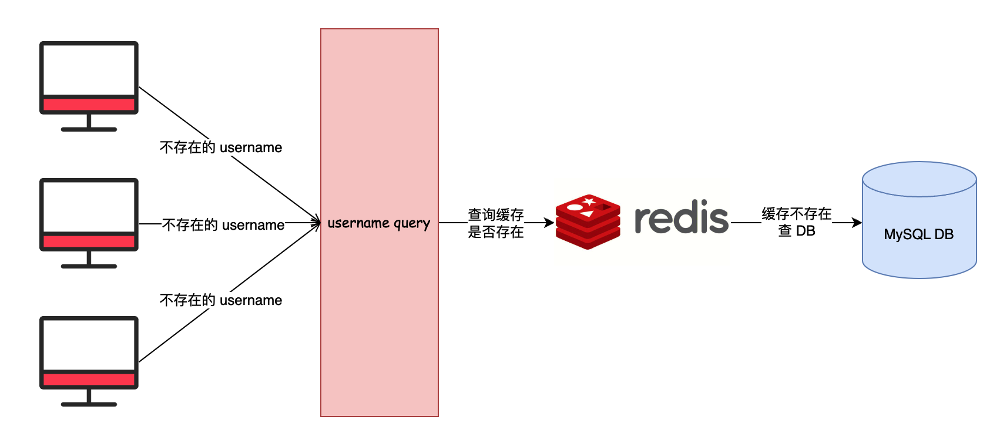
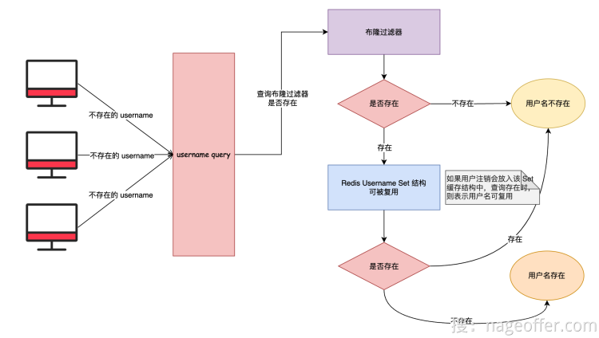
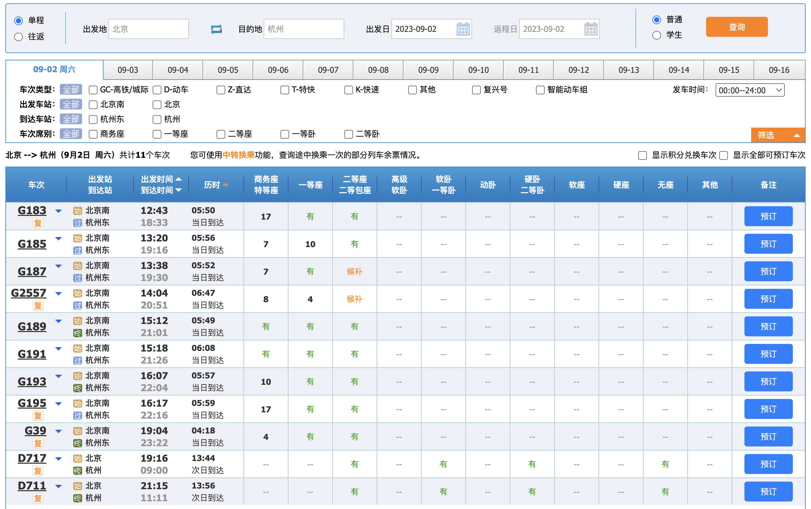
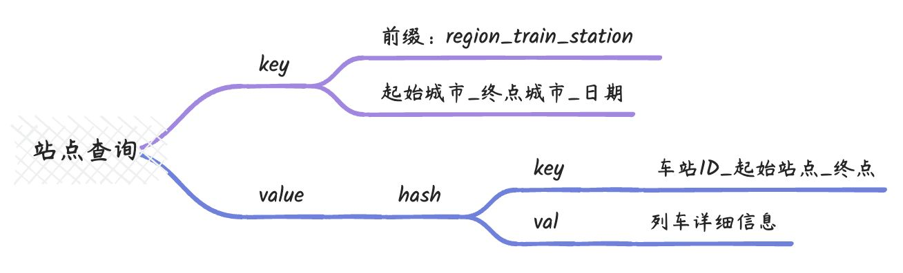
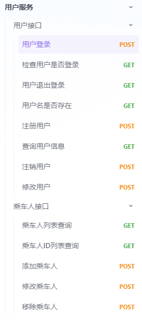
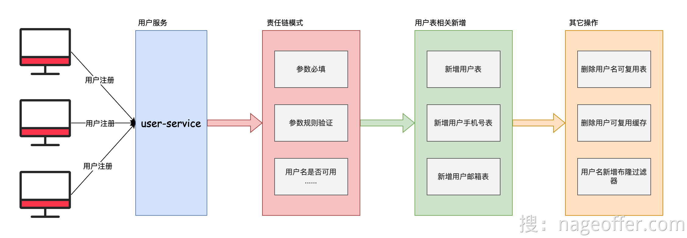
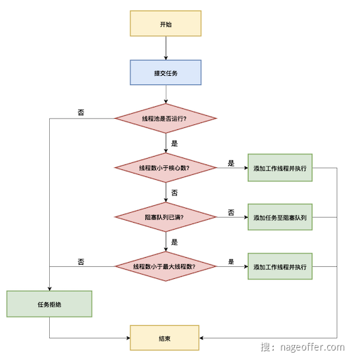

### 验证信息的真实性

1. 实名验证(姓名 + 身份证号)
   1. 基本上都是要调用公安部提供的验证接口。
   2. 或者是接入第三方在公安部接口上做的缓存。

### 数据量大(数十亿)

1. 会员用户
2. 乘车人

两种用户的预估量：

1. 会员用户(注册用户规模在`10 亿左右`，每年新增用户约500万）
2. 考虑到会员可添加多名乘车人，且一家多人可能分别拥有账号，估算乘车人数据量大约为注册用户的 2-3 倍，粗略估算约`30 亿左右`。


**鉴于会员和乘车人数据规模都已超过 10 亿级别，远超出单机 MySQL 数据库的处理能力。所以需使用`分库分表`或`分布式数据库` 来支撑海量数据。**

> 推荐的单表最多2000万条数据


> 如果使用分库分表技术，面试中这些问题都是无法避免会被问到：
>
> - 选择分库还是分表，还是选择分库分表？基于什么考虑？
> - 选择哪个字段作为分片键？选择单个分片键还是复合分片键？
> - 如何在老业务上平滑上线分库分表？出现问题如何快速回滚？
> - 拆分后出现单表数据量过大，如何继续扩容？扩单表还是整体扩？


### 会员多种登录类型

但是在具体的登录环节，由于系统支持会员使用用户名、手机号以及邮箱等多种方式进行登录，这就存在一个比较棘手的问题：

由于登录时无法确定用户的分片键，使得系统无法直接锁定用户的数据位于哪个数据库或者哪张表中。为了找到用户的数据，只能对全部的数据库和表进行扫描查询，这就造成了所谓的`“读请求扩散”`问题。

> 即原本读请求可以直接定位到某个数据库某张表，现在却要多处查询，无疑大大增加了系统的查询负载。
>
> 一旦出现了读请求扩散问题，势必会导致用户的登录请求响应时间变长，严重的话还可能造成登录超时。

> `**分库分表会带来读扩散问题**`


###  会员注册缓存穿透

在高并发的会员注册场景下，可能会出现缓存穿透问题。主要原因可能是：

- 用户注册时，需要验证用户名是否已存在，这通常需要查询数据库。
- 如果缓存中没有该用户名，就会去数据库查询，如果数据库中也没有，就可以判断该用户名可用。
- 在高并发的情况下，可能有大量的新用户同时注册，输入的用户名极有可能都不存在于数据库中。这将导致大量的缓存不存在，都去查询数据库，造成数据库压力剧增。
- 且这些查询数据库的 Key 都不会被缓存，因为数据库中没有，不会写入缓存。那么这些 Key 对应的 Null 值也不会被缓存，造成每次请求都查不到缓存，直接查询数据库。
- 这样就形成了缓存穿透情况。




**解决方案：**

1. 缓存空对象，并设置短暂过期时间，如 60 秒

   1. 缺点：会导致在等待空对象过期的间隔中，其他用户不能用该用户名注册

2. 布隆过滤器，将所有已注册的用户名存入布隆过滤器，判断时先判断该用户名是否在布隆过滤器中，不在的一定不存在，避免直接查询数据库。

   1. 缺点：由于布隆过滤器不能删除对象，所以用户注销之后，该用户名不能重新利用。

3. 将已注册的用户名以set数据类型存储在redis中

   1. 缺点：10亿数据量太大了，占用很大的内存资源

4. 针对高并发注册场景，可以先查询缓存，如果不命中则使用分布式锁来保证只有一个线程访问数据库，避免重复查询。

   1. 相对于上述解决方案，该方案在一定程度上可以解决会员注册缓存穿透的问题。
   2. 但是，如果在用户注册高峰期，只有一个线程访问数据库，这可能会导致大量用户的注册请求缓慢或超时。

   结论：这对用户的使用体验来说并不友好，因此我们不建议使用该方案。


#### ==最终解决方案==



1. 先走布隆过滤器
2. 然后再从redis中查询是否存在缓存。

 

### 敏感信息泄露

- 明文存储可能会直接泄露用户隐私，一旦数据库被攻击或数据泄露，个人敏感信息就会被完全暴露。
- 明文存储提高了内部人员滥用数据的风险，恶意查询和使用个人敏感信息的成本很低。

为此，如何选择将用户信息加密存储，以及如何平滑过度转换现有业务中的明文数据为密文，就是个需要考虑的问题


### 查票查询

> 12306车票搜索用的是**Redis**，而不是大家常用的是ElasticSearch。

查询条件很多：

- 单程或者往返
- 出发地
- 目的地
- 出发日或者返程日
- 普通或者学生
- 车次类型
- 出发车站
- 到达车站
- 车次席别
- 发车时间
- 显示积分兑换车次
- 显示全部可预订车次


#### 为什么用Redis？

在这种情况下，Redis 作为列车数据的缓存存储是有道理的，原因如下：

1. **实时性**： Redis 以内存为基础，具有极低的读取延迟，可以快速响应实时查询请求，这对于需要即时更新的列车数据非常重要。单程或往返、出发日期等条件可以通过快速的 Redis 查询来满足。
2. **缓存**： Redis 是一个出色的缓存数据库，可以用于缓存热门的列车路线和查询结果，从而减轻后端数据库的负载。对于需要被查询的路线，可以将其结果缓存在 Redis 中，以提高响应速度。
3. **简单性**： Redis 的数据模型相对简单，适合存储简单的键值对或一些常规数据结构。这使得 Redis 适合存储一些搜索条件，如出发地、目的地、车次类型等，以便快速筛选结果。
4. **部署成本**： Redis 是一款轻量级的数据库，易于部署和维护。它的内存占用相对较低，可以在相对较小的硬件配置上运行，从而减少了部署成本。
5. **只需后端查询一次**： 在实际操作中，页面上的搜索条件大多是前端筛选，而只有在点击查询按钮时才会发起后端请求。因此，Redis 可以用于快速存储和检索列车数据，而 Elasticsearch 等搜索引擎可以在需要进行全文搜索或复杂查询时使用。


公司实际用过 ElasticSearch 集群的同学应该知道，这玩意就是个性能深渊，非常消耗资源，懂得都懂。


> 您是否注意到了这张图的一个关键点？它只允许选择一天的出发日期。深思熟虑一下。
>
> 
>
> 如果只能选择一天，那我们是不是可以这么来设计 Redis 缓存存储 12306 列车查询数据。
>
> 


### 总结

本文通过对 12306 铁路购票系统的业务进行分析，提出了几个关键的业务难点：

1. 如何确定用户注册信息的真实性，可能需要调用第三方实名认证服务。
2. 面对亿级用户量，需要使用分库分表技术来支撑海量数据。
3. 支持多种登录方式会造成读请求扩散，需要解决用户定位问题。
4. 高并发场景下缓存穿透问题需要有效解决，避免数据库压力过大。
5. 明文存储用户敏感信息会造成安全隐患，需要对关键数据加密。

这些问题在大型业务系统中普遍存在，需要系统性地考虑技术选型和方案设计，才能构建一个高性能、安全的系统。

本文内容有助于读者对业务难点有更深入的理解，也为后续的技术解决方案铺垫了基础。


## 源码阅读


### 工程目录

```shell
├── checkstyle  || -- # 代码格式检查组件
│   ├── 12306_checkstyle.xml  || -- # 代码格式检查组件规则配置
│   └── 12306_checkstyle_suppression.xml  || -- # 忽略代码格式检查组件规则配置
├── console-vue  || -- #  12306 前端控制台项目
│   ├── README.md
│   ├── babel.config.js
│   ├── jsconfig.json
│   ├── node_modules
│   ├── package.json
│   ├── public
│   ├── src
│   ├── vue.config.js
│   └── yarn.lock
├── dependencies  || -- #  12306 后端项目全局依赖版本控制
│   └── pom.xml
├── format  || -- #  12306 后端项目格式化组件
│   ├── 12306_spotless_formatter.xml  || -- #  12306 后端项目格式化组件规则配置
│   └── license-header  || -- #  12306 后端项目开源协议头格式化
├── frameworks  || -- #  12306 基础架构组件库
│   ├── base  || -- #  12306 顶层抽象基础组件
│   ├── bizs  || -- #  12306 业务相关基础组件，比如用户上下文等
│   ├── cache  || -- # 12306 缓存基础组件
│   ├── common  || -- # 12306 公共工具包组件
│   ├── convention  || -- # 12306 项目规约组件
│   ├── database  || -- # 12306 数据库持久层组件
│   ├── designpattern  || -- # 12306 设计模式抽象基础组件
│   ├── distributedid  || -- # 12306 分布式 ID 基础组件
│   ├── idempotent  || -- # 12306 幂等基础组件，包括 HTTP 及不同消息队列实现
│   ├── log  || -- # 12306 日志打印基础组件库
│   └── web  || -- # 12306 Web 相关基础组件库
│   ├── pom.xml
├── resources  || -- # 12306 项目数据库初始化及其它
│   ├── data  || -- # 12306 数据库数据初始化
│   └── db  || -- # 12306 数据库初始化
├── services  || -- # 12306 后端项目集合
│   ├── aggregation-service  || -- # 12306 SpringBoot 聚合模式服务
│   ├── gateway-service  || -- # 12306 网关服务
│   ├── order-service  || -- # 12306 订单服务
│   ├── pay-service  || -- # 12306 支付服务
│   ├── ticket-service  || -- # 12306 购票服务
│   └── user-service  || -- # 12306 用户服务
│   ├── pom.xml
└── tests  || -- # 12306 单元测试集合
│   ├── general  || -- # 12306 通用单元测试
└── pom.xml
├── LICENSE
├── mvnw
├── mvnw.cmd
├── pom.xml
├── README.md
```


### 责任链模式

使用`责任链模式`重构复杂业务场景。

- 例如用户注册时，对于接收到的参数有多种校验。
- 用户下单之前，有多种校验。

> 责任链模式的`核心是一个链式结构`，链中每个节点代表一个处理者对象，请求先经过第一个节点处理，如果该节点能够处理请求，则直接返回处理结果；否则，请求继续往下一个节点传递，直到找到能够处理该请求的节点为止。整个过程类似于流水线上的多个工作站，每个工作站负责一项工作，如果自己处理不了，就将工作交给下一个工作站，直到整个工作完成。


所以该模式可以抽象出两个对象：

- `ChainContext`上下文

  - 可以理解为**初始化、存储、执行**责任链的地方

- `ChainHandler`责任链上的节点

  - 为了更好的区分开多个责任链，所以抽象的`chainHandler`一般会包含一个`mark`来标识他是属于哪一个链上的节点。另外一般要求`ChainHandler`实现`Ordered`接口，从而确保责任链上的执行顺序。

  - ```
    public interface AbstractChainHandler<T> extends Ordered {
        /**
         * 执行责任链逻辑
         *
         * @param requestParam 责任链执行入参
         */
        void handler(T requestParam);
    
        /**
         * @return 责任链组件标识
         */
        String mark();
    }
    ```

#### `ChainContext`

```java


/**
 * 抽象责任链上下文
 * 1. 实现了`CommandLineRunner`接口，在SpringBoot项目启动之后会执行`run`方法，找到所有的AbstractChainHandler对象，分组填充到map中。
 */
public final class AbstractChainContext<T> implements CommandLineRunner {

    private final Map<String, List<AbstractChainHandler>> abstractChainHandlerContainer = new HashMap<>();

    /**
     * 责任链组件执行
     *
     * @param mark         责任链组件标识
     * @param requestParam 请求参数
     */
    public void handler(String mark, T requestParam) {
        List<AbstractChainHandler> abstractChainHandlers = abstractChainHandlerContainer.get(mark);
        if (CollectionUtils.isEmpty(abstractChainHandlers)) {
            throw new RuntimeException(String.format("[%s] Chain of Responsibility ID is undefined.", mark));
        }
        abstractChainHandlers.forEach(each -> each.handler(requestParam));
    }

    @Override
    public void run(String... args) throws Exception {
        Map<String, AbstractChainHandler> chainFilterMap = ApplicationContextHolder
                .getBeansOfType(AbstractChainHandler.class);
        chainFilterMap.forEach((beanName, bean) -> {
            List<AbstractChainHandler> abstractChainHandlers = abstractChainHandlerContainer.get(bean.mark());
            if (CollectionUtils.isEmpty(abstractChainHandlers)) {
                abstractChainHandlers = new ArrayList();
            }
            abstractChainHandlers.add(bean);
            List<AbstractChainHandler> actualAbstractChainHandlers = abstractChainHandlers.stream()
                    .sorted(Comparator.comparing(Ordered::getOrder))
                    .collect(Collectors.toList());
            abstractChainHandlerContainer.put(bean.mark(), actualAbstractChainHandlers);
        });
    }
}
```

#### `ChainHandler`

```java
/**
 * 抽象业务责任链组件
 */
public interface AbstractChainHandler<T> extends Ordered {

    /**
     * 执行责任链逻辑
     *
     * @param requestParam 责任链执行入参
     */
    void handler(T requestParam);

    /**
     * @return 责任链组件标识
     */
    String mark();
}
```

为了避免同一个责任链上的`chainHandler`反复实现`mark`方法，所以对于某一个责任链可以定义一个接口默认实现`mark`方法，即

```java
public interface UserRegisterChainHandler<T extends UserRegisterReqDTO> extends AbstractChainHandler<UserRegisterReqDTO> {

    @Override
    default String mark() {
        return "UserRegister";
    }
}
```

那么责任链上的节点实现就如下所示了：

```java
public final class UserRegisterHasUsernameChainHandler implements UserRegisterChainHandler<UserRegisterReqDTO> {

    @Override
    public void handler(UserRegisterReqDTO requestParam) {
        // 具体的校验逻辑
    }

    @Override
    public int getOrder() {
        return 1;
    }
}
```


### 用户服务



#### 用户登录UserLoginController

- 用户登录(不需要加锁)
  1. 判断用户名是否包含`@`，有的话就是邮箱，否则是手机号/用户名。
  2. 找出对应的`username`，无论怎样，登录一定使用用户名和密码进行登陆操作。
  3. 在数据库找到对应的数据之后，通过`JWTUtil`生成accesToken
  4. 将`token，userName，userId，真实名字`以JSON的格式存入Redis(过期时间是30分钟)，并且返回给前端。
- 通过Token检查用户是否登录
  1. 根据`accessToken`判断缓存中是否存在该对象。
- 用户退出
  1. 删除缓存
- 用户名是否存在
  1. 首先通过布隆过滤器判断该用户名是否存在
     1. 若存在则可能存在，若不存在那就真的不存在。
  2. 如果存在的话，再去专门redis中进行寻找。
     1. 按照username计算出对应的分片数，构造对应的key，查看key对应的set中是否有该用户名。
- 用户注册
  1. 使用责任链模式对用户注册信息进行校验
  2. 通过RedLock获得一个分布式锁`register-username`
  3. 如果获取不到，说明该用户名被抢注了
  4. 否则将该用户插入数据库，若出异常，则说明重复注册了
  5. 之后向`phone-username`表插入一条记录
  6. 向`mail-username`表插入一条记录
  7. 删除`userreuse`表中的记录
  8. 删除redis中用户名重用key中的用户名
  9. 将该用户名加入布隆过滤器
  10. 解锁
  
  
- 删除用户
  1. 检验当前线程的用户是否为要删除的用户，如果不是，则上传到风控。
  2. 通过RedLock获得一个分布式锁`register-username`
  3. 根据用户名从用户表中查出该用户，构造userDeletion对象，插入`user_deletion`表中
  4. 修改`user`表中的`del`标志位，软删除。
  5. 删除`phone-user`表、`mail-user`表中对应的记录
  6. 删除该用户的token
  7. 将该用户名添加到`redis`的`user-reuse`表中
     1. 解决的是布隆过滤器的问题
- 

==疑问：用户id是如何生成的？==

#### 乘车人接口

> 对乘车人做增删改查之后，都需要将乘客缓存删除掉。


### 用户注册时避免缓存穿透

### 余票查询

1. 余票查询V1版本中中频繁查询redis

1. 余票查询V2版本相比V1版本，只是将多数redis命令以管道的方式进行执行，而并没有走数据库？这个地方还是有一些疑问的。


## 订单延时关闭功能技术选型

### 定时任务(不推荐)

通常最`不推荐`的方式是使用定时任务来实现订单关闭。

>  第一个能想到的就是通过`定时任务`来解决。
>
> 可以通过调度平台来实现定时任务的执行，具体任务是根据订单创建时间扫描所有到期的订单，并执行关闭订单的操作。
>
> 常用的有：
>
> - xxl-job
> - powerjob
> - shardingsphere-elasticjob
>
> 优点实现简单，缺点
>
> 1. **延迟时间不精确**：使用定时任务执行订单关闭逻辑，无法保证订单在十分钟后准确地关闭。如果任务执行器在关闭订单的具体时间点出现问题，可能导致订单关闭的时间延后。
> 2. **不适合高并发场景**：定时任务执行的频率通常是固定的，无法根据实际订单的情况来灵活调整。在高并发场景下，可能导致大量的定时任务同时执行，造成系统负载过大。
> 3. **分库分表问题**：拿 12306 来说，订单表按照用户标识和订单号进行了分库分表，那这样的话，和上面说的根据订单创建时间去扫描一批订单进行关闭，自然就行不通。因为根据创建时间查询没有携带分片键，`存在读扩散问题`。

### RabbitMQ

RabbitMQ 是一个功能强大的消息中间件，`通过使用 RabbitMQ 的延时消息特性，我们可以轻松实现订单十分钟延时关闭功能`。

1. 首先，需要在 RabbitMQ 服务器上启用延时特性，通常通过安装 `rabbitmq_delayed_message_exchange` 插件来支持延时消息功能。

2. 接下来，创建两个队列：订单队列和死信队列。
   1. 订单队列用于存储需要延时关闭的订单消息，
   2. 而死信队列则用于存储延时时间到达后的订单消息。在创建订单队列时，我们要为队列配置延时特性，指定订单消息的延时时间，比如十分钟。这样，当有新的订单需要延时关闭时，我们只需要将订单消息发送到订单队列，并设置消息的延时时间。
3. 在订单队列中设置死信交换机和死信队列，当订单消息的延时时间到达后，消息会自动转发到死信队列，从而触发关闭订单的操作。
4. 在死信队列中，我们可以监听消息，并执行关闭订单的逻辑。为了确保消息的可靠性，可以在关闭订单操作前添加适当的幂等性措施，这样即使消息重复处理，也不会对系统产生影响。

通过以上步骤，我们就成功实现了订单的十分钟延时关闭功能。

当有新的订单需要延时关闭时，将订单消息发送到订单队列，并设置延时时间。在延时时间到达后，订单消息会自动进入死信队列，从而触发关闭订单的操作。这种方式既简单又可靠，保证了系统的稳定性和可用性。

从整体来说 RabbitMQ 实现延时关闭订单功能是比较合适的，但也存在几个问题：

1. 延时精度：RabbitMQ 的延时消息特性是基于消息的 TTL（Time-To-Live）来实现的，因此消息的延时时间并不是完全准确的，可能会有一定的误差。在处理订单十分钟延时关闭时，可能会有一些订单的关闭时间略晚于预期时间。
2. **高并发问题：**如果系统中有大量的订单需要延时关闭，而订单关闭操作非常复杂耗时，可能会导致消息队列中的消息堆积。这样就可能导致延时关闭操作无法及时处理，影响订单的实际关闭时间。
3. **重复消息问题：**由于网络原因或其他不可预知的因素，可能会导致消息重复发送到订单队列。如果没有处理好消息的幂等性，可能会导致订单重复关闭的问题，从而造成数据不一致或其他异常情况。
4. 可靠性问题：RabbitMQ 是一个消息中间件，它是一个独立的系统。如果 RabbitMQ 本身出现故障或宕机，可能会导致订单延时关闭功能失效。因此，在使用 RabbitMQ 实现延时关闭功能时，需要考虑如何保证 RabbitMQ 的高可用性和稳定性。

延时精度和高并发属于一类问题，取决于客户端的消费能力。重复消费问题是所有消息中间件都需要解决，需要通过消息表等幂等解决方案解决。比较难搞定的是可用性问题，RabbitMQ 在可用性方面较弱，部分场景下会存在单点故障问题。


### Redis 过期监听

可以借助 Redis 的`过期消息监听机制`实现延时关闭功能。

1. 在订单创建时，将订单信息存储到 Redis，并设置过期时间为十分钟。同时，在 Redis 中存储一个过期消息监听的键值对，键为订单号，值为待处理订单的标识。
2. 其次，编写一个消息监听器，持续监听 Redis 的过期事件。监听器使用 Redis 的 `PSUBSCRIBE` 命令订阅过期事件，并在监听到过期事件时触发相应的处理逻辑。

当订单过期时间到达时，Redis 会自动触发过期事件，消息监听器捕获到该事件，并获取到过期的订单号。接着，监听器执行订单关闭的逻辑，如更新订单状态为关闭状态，释放相关资源等，实现订单的十分钟延时关闭功能。

需要注意的是，`消息监听器应该是一个长期运行的任务`，确保持续监听 Redis 的过期事件。为了保证系统的稳定性和可靠性，可以在实现订单关闭逻辑时添加容错机制，以应对 Redis 可能发生故障或重启的情况。

Redis 过期消息也存在几个问题：

1. **不够精确**：Redis 的过期时间是通过定时器实现的，可能存在一定的误差，导致订单的关闭时间不是精确的十分钟。这对于某些对时间要求较高的场景可能不适用。
2. **Redis 宕机**：如果 Redis 宕机或重启，那些已经设置了过期时间但还未过期的订单信息将会丢失，导致这部分订单无法正确关闭。需要考虑如何处理这种异常情况。
3. **可靠性**：依赖 Redis 的过期时间来实现订单关闭功能，需要确保 Redis 的高可用性和稳定性。如果 Redis 发生故障或网络问题，可能导致订单关闭功能失效。
4. **版本问题**：Redis 5.0 之前是不保证延迟消息持久化的，如果客户端消费过程中宕机或者重启，这个消息不会重复投递。5.0 之后推出了 Stream 功能，有了持久化等比较完善的延迟消息功能。


### Redisson

通过 Redisson 的 `RDelayedQueue` 功能可以实现订单十分钟延时关闭的功能。

首先，我们需要创建一个 `RDelayedQueue` 对象，`用于存放需要延时关闭的订单信息`。当用户创建订单时，我们将订单信息添加到 RDelayedQueue 中，并设置订单的延时时间为十分钟。

Redisson 提供了监听功能，可以实现对 RDelayedQueue 中订单信息的监听。一旦订单到达设定的延时时间，Redisson 会触发监听事件。在监听到订单的延时事件后，我们可以编写相应的处理逻辑，即关闭对应的订单。

在处理订单关闭时，我们可以根据订单号或订单创建时间等信息，来找到对应的订单进行关闭操作。

不过这种方式也不推荐使用，**基本上 Redis 过期监听消息存在的问题，RDelayedQueue 也都会有，因为 RDelayedQueue 本质上也是依赖 Redis 实现。**


### RocketMQ（推荐）

在订单生成时，我们将订单关闭消息发送到 RocketMQ，并设置消息的延迟时间为十分钟。

`RocketMQ 支持设置消息的延迟时间`，可以通过设置消息的 `delayLevel` 来指定延迟级别，每个级别对应一种延迟时间。这样，订单关闭消息将在十分钟后自动被消费者接收到。

需要注意，RocketMQ 5.0 之后已经支持了自定义时间的延迟，而不仅是延迟级别范围内的时间。

为了处理订单关闭消息，我们需要在消费者端创建一个消息监听器。当消息监听器接收到订单关闭消息时，触发订单关闭操作，将订单状态设置为关闭状态。

需要注意的是，`RocketMQ 的消息传递机制保证了消息的可靠性传递，因此消息可能会进行多次重试`。为了确保订单关闭操作的幂等性，即多次执行不会产生副作用，我们需要在订单关闭逻辑中进行幂等性的处理。

因为 12306 系统中也使用到了 RocketMQ，所以这个解决方案将是咱们的不二选择。

12306 系统中具体代码地址：

```Java
// 延时关闭订单消息生产者
org.opengoofy.index12306.biz.ticketservice.mq.produce.AbstractCommonSendProduceTemplate#sendMessage
// 延时关闭订单消息消费者
org.opengoofy.index12306.biz.ticketservice.mq.consumer.DelayCloseOrderConsumer#onMessage
```


> 高并发的问题：
>
> 1. 生产太快了
> 2. 消费太慢了
>    1. 提高单个消费端的消费能力
>
> 重复消息问题：
>
> 1. 幂等注解


### PS：看代码过程中的疑问

> 关于12306项目中订单延迟关闭幂等性的问题？
>
> 我好奇的地方是为什么不用@idempotent注解来解决？而是通过关闭逻辑来解决这个问题？
>
> 1. 由于创建订单之后会将订单放到延迟消息队列中，等到达延迟点之后投递给消费者
> 2. 消费者可能由于网络原因等，造成同一个消息接收多次。出现这种情况之后，按道理说应该用@idempotent注解保证幂等性
> 3. 但是由于购票的时候已经保证幂等性了，所以在某种程度上来说造成订单延迟关闭消息重复的概率比较低，所以用业务逻辑来保证幂等性就可以了。


## 用户敏感信息展示时学会脱敏

在日常工作中，我们经常需要使用到各种敏感配置，如数据库密码、云厂商的 SecretId、SecretKey、支付签名等敏感信息。


## 其他知识点

1. 


### 1、**如何解决 JDK 线程池中不超过最大线程数下即时快速消费任务，而不是在队列中堆积**。

线程池任务添加流程：

1. 线程池提交任务首先判断当前线程数是否大于核心线程数，否则创建核心线程执行任务；
2. 如果当前线程超过了核心线程数，判断阻塞队列是否已满，否则将任务添加到队列中；
3. 如果阻塞队列已满，判断当前线程是否大于最大线程数，否则创建非核心线程执行任务；
4. 如果当前线程大于或等于最大线程数，执行拒绝策略。


> **如果当前线程大于核心线程数，不将任务放入阻塞队列，而是创建非核心线程执行任务**。
>
> 该如何改造？

本地代码实现参考 Dubbo 源码中 **EagerThreadPoolExecutor**

`TaskQueue自定义阻塞队列：`

```java
public class TaskQueue<R extends Runnable> extends LinkedBlockingQueue<Runnable> {
    // 队列中持有线程池的引用
    private EagerThreadPoolExecutor executor;

    public TaskQueue(int capacity) {
        super(capacity);
    }
    public void setExecutor(EagerThreadPoolExecutor exec) {
        executor = exec;
    }
    @Override
    public boolean offer(Runnable runnable) {
        // 获取线程池中线程数
        int currentPoolThreadSize = executor.getPoolSize();
        // 如果有核心线程正在空闲，将任务加入阻塞队列，由核心线程进行处理任务
        if (executor.getSubmittedTaskCount() < currentPoolThreadSize) {
            return super.offer(runnable);
        }

      	/**
      	 *【重点】当前线程池线程数量小于最大线程数
      	 * 返回false，根据线程池源码，会创建非核心线程
      	 */
        if (currentPoolThreadSize < executor.getMaximumPoolSize()) {
            return false;
        }

        // 如果当前线程池数量大于最大线程数，任务加入阻塞队列
        return super.offer(runnable);
    }
    public boolean retryOffer(Runn able o, long timeout, TimeUnit unit) throws InterruptedException {
        if (executor.isShutdown()) {
            throw new RejectedExecutionException("Executor is shutdown!");
        }
        return super.offer(o, timeout, unit);
    }
}
```

`EagerThreadPoolExecutor`封装快速消费线程池

- 增加计数器 `submittedTaskCount` 跟踪已提交但尚未执行的任务数量。
- 处理拒绝执行异常：在调用父类的 `execute` 方法执行任务时，可能会抛出 `RejectedExecutionException` 异常，表示任务无法执行。在捕获到该异常后，代码会进行重试操作。
- 重试将任务放入队列：在捕获到 `RejectedExecutionException` 异常后，代码会获取当前线程池的任务队列 `queue`，然后尝试将任务重新放入队列中进行排队。如果任务成功重新放入队列，则不会抛出异常；如果队列已满，仍然无法放入任务，则会抛出新的 `RejectedExecutionException` 异常。
- 处理中断异常：如果重试放入队列的过程中被中断，会捕获到 `InterruptedException` 异常，然后将计数器 `submittedTaskCount` 自减，并抛出 `RejectedExecutionException` 异常。
- 处理其他异常：在执行任务过程中，如果发生了其他异常，会将计数器 `submittedTaskCount` 自减，并将异常继续往上抛出。

```java
public class EagerThreadPoolExecutor extends ThreadPoolExecutor {
    /**
     * task count
     */
    private final AtomicInteger submittedTaskCount = new AtomicInteger(0);
    /**
     * @return current tasks which are executed
     */
    public int getSubmittedTaskCount() {
        return submittedTaskCount.get();
    }
    @Override
    protected void afterExecute(Runnable r, Throwable t) {
        submittedTaskCount.decrementAndGet();
    }
    @Override
    public void execute(Runnable command) {
        if (command == null) {
            throw new NullPointerException();
        }
        // do not increment in method beforeExecute!
        submittedTaskCount.incrementAndGet();
        try {
            super.execute(command);
        } catch (RejectedExecutionException rx) {
            // retry to offer the task into queue.
            final TaskQueue queue = (TaskQueue) super.getQueue();
            try {
                if (!queue.retryOffer(command, 0, TimeUnit.MILLISECONDS)) {
                    submittedTaskCount.decrementAndGet();
                    throw new RejectedExecutionException("Queue capacity is full.", rx);
                }
            } catch (InterruptedException x) {
                submittedTaskCount.decrementAndGet();
                throw new RejectedExecutionException(x);
            }
        } catch (Throwable t) {
            // decrease any way
            submittedTaskCount.decrementAndGet();
            throw t;
        }
    }
}
```

EagerThreadPoolExecutor 继承了 ThreadPoolExecutor，在 execute() 上做了个性化设计。

并在线程池内新增了一个任务数量的字段，是一个原子类，添加任务时自增，任务异常及结束时递减。

这样就能保证 **TaskQueue#offer(Runnable runnable)** 做出逻辑处理。


### 2、线程池API不支持拒绝任务的扩展

> 在高并发、高吞吐量的极限情况下，平常稳定运行的线程池可能会变得不稳定，作为线程池任务执行策略中兜底的拒绝策略显得格外重要。

所以，针对线程池拒绝任务的扩展对于业务是很有必要，因为线程池抛出拒绝策略意味着 **业务受到影响** 或者 **线程池参数设置不合理**。

我们期望线程池在拒绝提交的任务时，**扩展哪些行为？**

1. 发送线程池报警消息或邮件，通知到相关负责人。
2. 统计线程池拒绝任务的次数，方便后续统计时采集到关键指标。
3. ......

#### 任务拒绝流程

需要知道线程池什么情况下会拒绝提交的任务。





通过上图得知，当客户端提交任务到线程池时，满足以下任意条件，就会发起拒绝任务：

1. 当前线程池的状态为`非运行状态`（线程池已经触发了停止行为）
2. 阻塞队列已满，并且线程池中已经`创建了最大线程数的线程`（线程都在运行中）


线程池底层设计中，将抛出拒绝策略方法的访问级别设置为 默认访问权限，并添加了 final 关键字。意味着我们没办法继承 `ThreadPoolExecutor`去重写 `reject`。同时，也没办法手动调用 `reject` 方法。

```java
/**
 * Invokes the rejected execution handler for the given command.
 * Package-protected for use by ScheduledThreadPoolExecutor.
 */
final void reject(Runnable command) {
    handler.rejectedExecution(command, this);
}
```

#### 代理模式

> **代理模式**（Proxy Design Pattern），在不改变原始类代码的情况下，引入代理类对原始类的功能作出增强。

通过代理模式扩展出拒绝策略次数统计和报警功能。

**扩展线程池**

先来创建个自定义线程池，继承原生 `ThreadPoolExecutor`。添加一个拒绝策略次数统计参数，并添加原子自增和查询方法。


