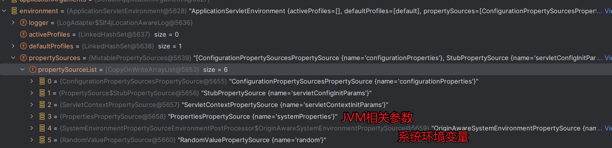
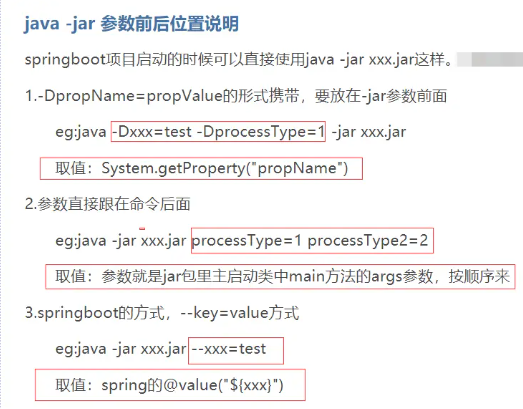
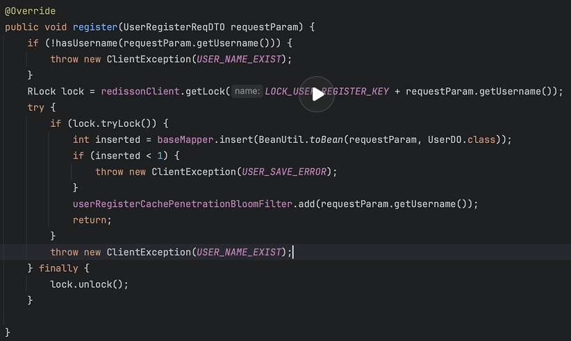

## 一些不懂得点

1. `lock.lock()`需要写在try外边

   1. 当lock.lock()报错时也会进入finally释放锁，根据[Lock.unlock()](https://github.com/juggernaut0425/jdk8u_jdk/blob/511d7c8ae09a74b15f28b0d7030cdcc05c9aac3b/src/share/classes/java/util/concurrent/locks/Lock.java#L335)文档，当非锁持有线程调用该方法时会抛出unchecked异常：

2. 缓存未命中，从数据库中加载数据时，使用分布式锁上锁。

   1. 防止多个线程同时从数据库加载数据。

3. 展示用户信息时，对身份证等信息进行脱敏处理

   1. hutools -- >DesensitizedUtil

4. 日常 Coding 过程中，`设计模式三板斧：模版、构建者、策略`

5. `@SneakyThrows`：这是一个Lombok注解，用于自动处理受检异常。它表示该方法可能会抛出受检异常。

6. @RestController等同于 @Controller 加上 @ResponseBody

7. maven相关命令

   1. **package：**该命令完成了项目编译、单元测试、打包功能三个过程。
   2. **install：**在 package 命令的前提下新增一个步骤，**将新打好的包部署到本地 Maven 仓库**。
   3. **deploy：**在 install 命令的前提下新增一个步骤，**将新打的包部署到远端仓库**（相当于本地和远端仓库同时部署一份）。

8. Spring使用条件注解定义可插拔Starter

   1. `@ConditionalOnBean`

      > 补充：@ConditionalOnMissingBean用于在特定的 Bean 不存在时才加载和配置相关的组件。

9. 配置元数据

   1. 通过建立 `META-INF/spring-configuration-metadata.json` 文件，开发者手动配置。

   2. 还有一种是通过注解 `@ConfigurationProperties` 方式自动生成。

      1. ```XML
         <dependency>
             <groupId>org.springframework.boot</groupId>
             <artifactId>spring-boot-configuration-processor</artifactId>
         </dependency>
         ```

      2. 
         
         ```java
         @Data
         @Configuration
         @ConfigurationProperties(prefix = "swagger")
         public class SwaggerProperties {
             /**
              * 文档扫描包路径
              */
             private String basePackage = "";
             /**
              * title 示例: 订单创建接口
              */
             private String title = "平台系统接口详情";
             /**
              * 服务条款网址
              */
             private String termsOfServiceUrl = "https://www.xxxx.com/";
             /**
              * 版本号
              */
             private String version = "V_1.0.0";
         }
         ```
         
      3. ```shell
         mvn clean install
      ```
   
10. `FilterRegistrationBean`是 Spring Framework 提供的一个用于注册和配置 Servlet 过滤器的工具类。

11. `@Import(ApplicationContextHolder.class)` 是 Spring 框架中的注解，用于导入指定的配置类或组件类，以使其成为 Spring 应用上下文的一部分。

12. `@Around("@within(org.opengoofy.index12306.framework.starter.log.annotation.ILog)||@annotation(org.opengoofy.index12306.framework.starter.log.annotation.ILog)") `表示切点将匹配所有标有`@ILog`注解的类或者带有`@ILog`注解的方法。

    1. `@Around`是切点表达式，用于定义切点，即在哪些地方应用切面。用于包装目标方法，可以在方法执行前后添加额外的逻辑。
    2. `@within(org.opengoofy.index12306.framework.starter.log.annotation.ILog)`：这是切点表达式的一部分，它定义了一种切点匹配规则。这部分表示切点将匹配所有标有`@ILog`注解的类。
    3. `||`：这是逻辑或运算符，用于组合两个条件，
    4. `@annotation(org.opengoofy.index12306.framework.starter.log.annotation.ILog)`：这是切点表达式的另一部分，它定义了另一种切点匹配规则。这部分表示切点将匹配所有带有`@ILog`注解的方法。

13. SpringBoot项目读取系统环境变量

    1. 通过`@Value(${...})`不仅可以读取配置文件中的属性，还可以读取系统环境变量。
       1. 通过`@ConfigurationProperties`注解还可以将配置文件中的属性反推到对象上
    2. 配置文件中通过`${...}`定义的环境变量在加载配置文件的时候也可以进行填充。

    > - `run方法`运行的时候，会调用`prepareEnvironment`方法来装配相关的属性
    >   - 
    > - @Bean对应的方法在SpringBoot项目启动时(BeanDefinition创建之后,初始化单例Bean时)执行。
    > - @Value对应的属性会在该属性对应的对象被创建时进行填充。

14. 在Java项目中，如何使用`-D`命令行参数

    

15. SpringBoot第一次请求很慢的问题：

    1. dispatcherServlet 是懒加载的
       1. servlet配置load-on-startup的作用–配置`spring.mvc.servlet.load-on-startup=1`
    2. 数据库链接是懒加载的
       1. 指定配置文件中`spring.datasource.druid.initial-size=1,`即启动时会初始化1个数据库连接,按自己需求更改数值
    3. linux 下真随机数生成器
       1. JDK优化之熵池策略–加启动参数`-Djava.security.egd=file:/dev/./urandom`

16. Spring中使用`@RequiredArgsConstructor`注解注入bean

    1. `@RequiredArgsConstructor` is a Lombok annotation that generates constructors for all final and non-null fields.

    2. `@RequiredArgsConstructor`注解是lombok包下的，可以让spring完成bean自动装配的工作。

    3. 用法：标注在类上，可以省略@Autowired注解，但是一定要加final修饰符否则注入失败。

    4. > 问：@AllArgsConstructor和@RequiredArgsConstructor区别？
       >
       > 答：以上两个注解都是通过自动生成构造函数注入bean，区别就在于@AllArgsConstructor会将类中所有的属性都生成构造函数，而@RequiredArgsConstructor只会生成final修饰的字段或者标有`@NonNull`的字段。


## ShortLink

- 用户id用bigint去存储，因为用户id是用雪花算法(64位)去生成的，所以int(4个字节)存不下，bigint(8个字节)可以。
- 通过抛异常的情况来解决重复创建Result对象的问题
- SpringBoot默认使用Jaskson框架将对象序列化为JSON对象。


### BloomFilter

`tryInit`有两个核心参数：

- `expectedInsertions：`预估布隆过滤器存储的元素长度。
- `falseProbability：`运行的误判率。


### 代码问题

- `lock.tryLock()`应该写在外边，否则会导致原始异常丢失。




### 分库分表

#### 什么场景下要分表？

数据量过大或者数据库表对应的磁盘文件过大。

Q：多少数据分表？

- 3000w并且，稳步上升

#### 什么情况下分库？

Q：什么情况下分库？

- 数据库连接不够用。


#### 什么情况下分库又分表？

高并发写入或查询场景。

数据量巨大场景。