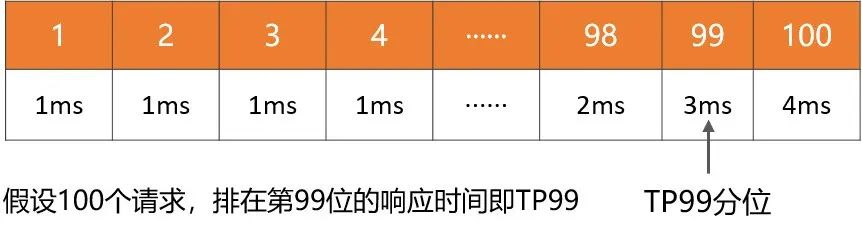
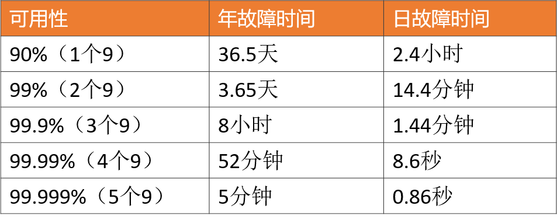
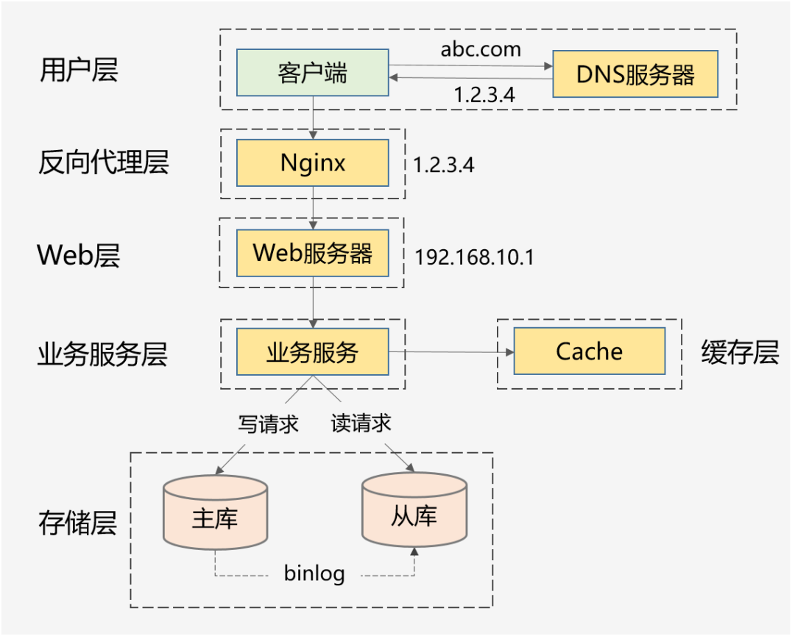
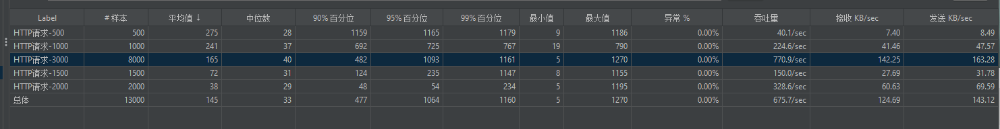
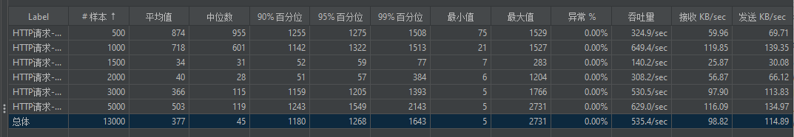
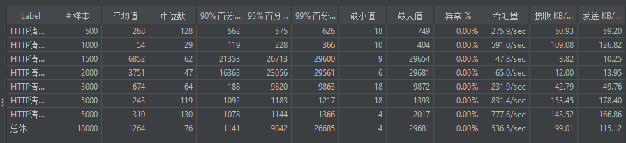
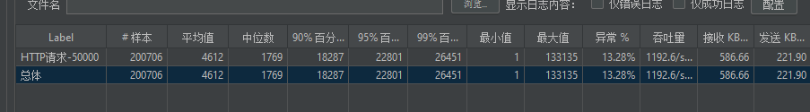
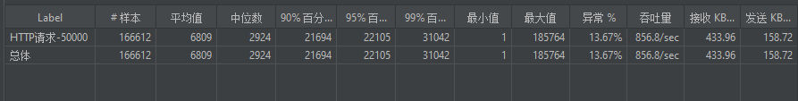
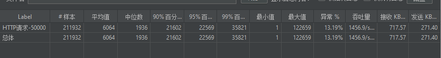

### 集群性能常用计算公式

`qps(query per second)=并发数/响应时间(通常要求0.1s左右)`

`·tps(transaction per second)=事务数/响应时间（事务 比如接口指有个clientSend并且clientReceive的过程）`

如何 根据服务日调用次数 计算每天峰值的qps？

( 日调用次数 * 80% ) / ( 24*3600 * 20% ) = 峰值时间每秒请求数(QPS)  
1
单节点qps

最大连接数/平均响应时间()=qps
1
通常最大线程数<=最大连接数
平均响应时间通常要求100ms左右

根据峰值qps与单节点qps计算节点个数？

峰值接口需要的QPS / 单节点的QPS = 需要的节点实例
1
示例：
每天300w 调用量的接口，这个接口需要满足到多少QPS？

  ( 3000000 * 0.8 ) / (86400 * 0.2 ) = 139 (QPS) 
1
单机QPS是58，需要结果节点来支持？**

139 / 58 = 3
————————————————
版权声明：本文为CSDN博主「昨日不可追」的原创文章，遵循CC 4.0 BY-SA版权协议，转载请附上原文出处链接及本声明。
原文链接：https://blog.csdn.net/lemon89/article/details/52222574


## 基础概念

### 性能指标

#### 平均响应时间

常用，但是缺陷很明显，对于慢请求不敏感。比如1万次请求，其中9900次是1ms，100次是100ms，则平均响应时间为1.99ms，虽然平均耗时仅增加了0.99ms，但是1%请求的响应时间已经增加了100倍。

#### TP90、TP99等分位值

将响应时间按照从小到大排序，TP90表示排在第90分位的响应时间， 分位值越大，对慢请求越敏感。




#### 吞吐量

和响应时间呈反比，比如响应时间是1ms，则吞吐量为每秒1000次。


通常，设定性能目标时会兼顾吞吐量和响应时间，比如这样表述：在每秒1万次请求下，AVG控制在50ms以下，TP99控制在100ms以下。对于高并发系统，AVG和TP分位值必须同时要考虑。

从用户体验角度来看，`200毫秒被认为是个分界点，用户感觉不到延迟，1秒是第二个分界点，用户能感受到延迟，但是可以接受`。


**因此，对于一个健康的高并发系统，TP99应该控制在200毫秒以内，TP999或者TP9999应该控制在1秒以内。**


### 可用性指标

高可用性是指系统具有较高的无故障运行能力，可用性 = 正常运行时间 / 系统总运行时间，一般使用几个9来描述系统的可用性。



对于高并发系统来说，基本的要求是：保证3个9或者4个9。原因很简单，如果你只能做到2个9，意味着有1%的故障时间，像一些大公司每年动辄千亿以上的GMV或者收入，1%就是10亿级别的业务影响。


### 可扩展性指标

面对突发流量，不可能临时改造架构，快的方式就是增加机器来线性提高系统的处理能力。

对于业务集群或者基础组件来说，`扩展性 = 性能提升比例 / 机器增加比例`，理想的扩展能力是：==资源增加几倍，性能提升几倍==。通常来说，扩展能力要维持在70%以上。

但是从高并发系统的整体架构角度来看，扩展的目标不仅仅是把服务设计成无状态就行了，因为当流量增加10倍，业务服务可以快速扩容10倍，但是数据库可能就成为了新的瓶颈。

像MySQL这种有状态的存储服务通常是扩展的技术难点，如果架构上没提前做好规划（垂直和水平拆分），就会涉及到大量数据的迁移。

因此，高扩展性需要考虑：服务集群、数据库、缓存和消息队列等中间件、负载均衡、带宽、依赖的第三方等，当并发达到某一个量级后，上述每个因素都可能成为扩展的瓶颈点。


### 高并发的实践方案

#### 通用的设计方法

##### 纵向扩展

1、提升单机的硬件性能：通过增加内存、CPU核数、存储容量、或者将磁盘升级成SSD等堆硬件的方式来提升。

2、提升单机的软件性能：使用缓存减少IO次数，使用并发或者异步的方式增加吞吐量。

##### 横向扩展

因为单机性能总会存在极限，所以终还需要引入横向扩展，通过集群部署以进一步提高并发处理能力，又包括以下2个方向：

1、做好分层架构：这是横向扩展的提前，因为高并发系统往往业务复杂，通过分层处理可以简化复杂问题，更容易做到横向扩展。



上面这种图是互联网常见的分层架构，当然真实的高并发系统架构会在此基础上进一步完善。比如会做动静分离并引入CDN，反向代理层可以是LVS+Nginx，Web层可以是统一的API网关，业务服务层可进一步按垂直业务做微服务化，存储层可以是各种异构数据库。

2、各层进行水平扩展：无状态水平扩容，有状态做分片路由。业务集群通常能设计成无状态的，而数据库和缓存往往是有状态的，因此需要设计分区键做好存储分片，当然也可以通过主从同步、读写分离的方案提升读性能。


**3.2 具体的实践方案**

下面再结合我的个人经验，针对高性能、高可用、高扩展3个方面，总结下可落地的实践方案。

#### 高性能的实践方案

1、集群部署，通过负载均衡减轻单机压力。

2、多级缓存，包括静态数据使用CDN、本地缓存、分布式缓存等，以及对缓存场景中的热点key、缓存穿透、缓存并发、数据一致性等问题的处理。

3、分库分表和索引优化，以及借助搜索引擎解决复杂查询问题。

4、考虑NoSQL数据库的使用，比如HBase、TiDB等，但是团队必须熟悉这些组件，且有较强的运维能力。

5、异步化，将次要流程通过多线程、MQ、甚至延时任务进行异步处理。

6、限流，需要先考虑业务是否允许限流（比如秒杀场景是允许的），包括前端限流、Nginx接入层的限流、服务端的限流。

7、对流量进行削峰填谷，通过MQ承接流量。

8、并发处理，通过多线程将串行逻辑并行化。

9、预计算，比如抢红包场景，可以提前计算好红包金额缓存起来，发红包时直接使用即可。

10、缓存预热，通过异步任务提前预热数据到本地缓存或者分布式缓存中。

11、减少IO次数，比如数据库和缓存的批量读写、RPC的批量接口支持、或者通过冗余数据的方式干掉RPC调用。

12、减少IO时的数据包大小，包括采用轻量级的通信协议、合适的数据结构、去掉接口中的多余字段、减少缓存key的大小、压缩缓存value等。

13、程序逻辑优化，比如将大概率阻断执行流程的判断逻辑前置、For循环的计算逻辑优化，或者采用更高效的算法。

14、各种池化技术的使用和池大小的设置，包括HTTP请求池、线程池（考虑CPU密集型还是IO密集型设置核心参数）、数据库和Redis连接池等。

15、JVM优化，包括新生代和老年代的大小、GC算法的选择等，尽可能减少GC频率和耗时。

16、锁选择，读多写少的场景用乐观锁，或者考虑通过分段锁的方式减少锁冲突。

上述方案无外乎从计算和 IO 两个维度考虑所有可能的优化点，需要有配套的监控系统实时了解当前的性能表现，并支撑你进行性能瓶颈分析，然后再遵循二八原则，抓主要矛盾进行优化。

#### 高可用的实践方案

1、对等节点的故障转移，Nginx和服务治理框架均支持一个节点失败后访问另一个节点。

2、非对等节点的故障转移，通过心跳检测并实施主备切换（比如redis的哨兵模式或者集群模式、MySQL的主从切换等）。

3、接口层面的超时设置、重试策略和幂等设计。

4、降级处理：保证核心服务，牺牲非核心服务，必要时进行熔断；或者核心链路出问题时，有备选链路。

5、限流处理：对超过系统处理能力的请求直接拒绝或者返回错误码。

6、MQ场景的消息可靠性保证，包括producer端的重试机制、broker侧的持久化、consumer端的ack机制等。

7、灰度发布，能支持按机器维度进行小流量部署，观察系统日志和业务指标，等运行平稳后再推全量。

8、监控报警：全方位的监控体系，包括基础的CPU、内存、磁盘、网络的监控，以及Web服务器、JVM、数据库、各类中间件的监控和业务指标的监控。

9、灾备演练：类似当前的“混沌工程”，对系统进行一些破坏性手段，观察局部故障是否会引起可用性问题。

高可用的方案主要从冗余、取舍、系统运维3个方向考虑，同时需要有配套的值班机制和故障处理流程，当出现线上问题时，可及时跟进处理。

#### 高扩展的实践方案

1、合理的分层架构：比如上面谈到的互联网常见的分层架构，另外还能进一步按照数据访问层、业务逻辑层对微服务做更细粒度的分层（但是需要评估性能，会存在网络多一跳的情况）。

2、存储层的拆分：按照业务维度做垂直拆分、按照数据特征维度进一步做水平拆分（分库分表）。

3、业务层的拆分：常见的是按照业务维度拆（比如电商场景的商品服务、订单服务等），也可以按照核心接口和非核心接口拆，还可以按照请求源拆（比如To C和To B，APP和H5）。


### 并发量

1. 注意并发量`指的是连接数`，而不是线程数。

> 在tomcat里，200个线程如何处理10000条连接？
>
> tomcat中有两种处理连接的方式：
>
> 1. **BIO**：一个线程只处理一个socket连接
> 2. **NIO**：一个线程可以处理多个socket连接。由于HTTP请求不太耗时，并且多个连接一般不会同时来消息，所以一个线程处理多个连接没有太大问题。


## 思考


### 为什么不多开几个线程？

多开线程的代价就是，增加上下文切换的时间，浪费CPU时间，另外还有就是线程数增多，每个线程分配到的时间片就变少。 多开线程≠提高处理效率。

### 为何不增大最大连接数？

增大最大连接数，支持的并发量确实可以上去。但是在没有改变硬件条件的情况下，这种并发量的提升必定以牺牲响应时间为代价。

### 配置文件中关于tomcat的配置为空，这些默认配置哪来的？

Spring Boot的默认配置信息，都在 spring-boot-autoconfigure-版本号.jar 这个包中。

Tomcat配置：`org.springframework.boot.autoconfigure.web.ServerProperties.java`


### 最佳线程数量

- 最佳线程数目 = （（线程等待时间+线程CPU时间）/ 线程CPU时间 ）* CPU数目


#### CPU密集型

操作内存处理的业务，一般线程数设置为：CPU核数 + 1 或者 CPU核数*2。核数为4的话，一般设置 5 或 8 。

#### IO密集型

文件操作，网络操作，[数据库](https://cloud.tencent.com/solution/database?from_column=20421&from=20421)操作，一般线程设置为：cpu核数 / (1-0.9)，核数为4的话，一般设置 40

```javascript
maxThreads="8"  //最大并发数 
minSpareThreads="100"///初始化时创建的线程数
maxSpareThreads="500"///一旦创建的线程超过这个值，Tomcat就会关闭不再需要的socket线程。
acceptCount="700"// 指定当所有可以使用的处理请求的线程数都被使用时，可以放到处理队列中的请求数，超过这个数的请求将不予处理

maxThreads 客户请求最大线程数 
minSpareThreads Tomcat初始化时创建的 socket 线程数 
maxSpareThreads Tomcat连接器的最大空闲 socket 线程数 
enableLookups 若设为true, 则支持域名解析，可把 ip 地址解析为主机名 
redirectPort 在需要基于安全通道的场合，把客户请求转发到基于SSL 的 redirectPort 端口 
acceptAccount 监听端口队列最大数，满了之后客户请求会被拒绝（不能小于maxSpareThreads ） 
connectionTimeout 连接超时 
minProcessors 服务器创建时的最小处理线程数 
maxProcessors 服务器同时最大处理线程数 
URIEncoding URL统一编码

maxThreads：处理的最大并发请求数，默认值200
minSpareThreads：最小线程数始终保持运行，默认值10
maxConnections：在给定时间接受和处理的最大连接数，默认值10000
```


## 本机测试

本机部分指标

- 进程创建线程时，默认分配的栈空间大小：`8192`


### 默认情况下

1. 10000个线程  --》76.16%失败


刚开始都是成功的，后来大量失败，

```java
org.apache.http.conn.HttpHostConnectException: Connect to localhost:9000 [localhost/127.0.0.1, localhost/0:0:0:0:0:0:0:1] failed: Connection refused: connect
	at org.apache.http.impl.conn.DefaultHttpClientConnectionOperator.connect(DefaultHttpClientConnectionOperator.java:156)
	at org.apache.jmeter.protocol.http.sampler.HTTPHC4Impl$JMeterDefaultHttpClientConnectionOperator.connect(HTTPHC4Impl.java:409)
	at org.apache.http.impl.conn.PoolingHttpClientConnectionManager.connect(PoolingHttpClientConnectionManager.java:376)
	at org.apache.http.impl.execchain.MainClientExec.establishRoute(MainClientExec.java:393)
	at org.apache.http.impl.execchain.MainClientExec.execute(MainClientExec.java:236)
	at org.apache.http.impl.execchain.ProtocolExec.execute(ProtocolExec.java:186)
	at org.apache.http.impl.execchain.RetryExec.execute(RetryExec.java:89)
	at org.apache.http.impl.execchain.RedirectExec.execute(RedirectExec.java:110)
	at org.apache.http.impl.client.InternalHttpClient.doExecute(InternalHttpClient.java:185)
	at org.apache.http.impl.client.CloseableHttpClient.execute(CloseableHttpClient.java:83)
	at org.apache.jmeter.protocol.http.sampler.HTTPHC4Impl.executeRequest(HTTPHC4Impl.java:940)
	at org.apache.jmeter.protocol.http.sampler.HTTPHC4Impl.sample(HTTPHC4Impl.java:651)
	at org.apache.jmeter.protocol.http.sampler.HTTPSamplerProxy.sample(HTTPSamplerProxy.java:66)
	at org.apache.jmeter.protocol.http.sampler.HTTPSamplerBase.sample(HTTPSamplerBase.java:1311)
	at org.apache.jmeter.protocol.http.sampler.HTTPSamplerBase.sample(HTTPSamplerBase.java:1300)
	at org.apache.jmeter.threads.JMeterThread.doSampling(JMeterThread.java:651)
	at org.apache.jmeter.threads.JMeterThread.executeSamplePackage(JMeterThread.java:570)
	at org.apache.jmeter.threads.JMeterThread.processSampler(JMeterThread.java:501)
	at org.apache.jmeter.threads.JMeterThread.run(JMeterThread.java:268)
	at java.base/java.lang.Thread.run(Thread.java:833)
Caused by: java.net.ConnectException: Connection refused: connect
	at java.base/sun.nio.ch.Net.connect0(Native Method)
	at java.base/sun.nio.ch.Net.connect(Net.java:579)
	at java.base/sun.nio.ch.Net.connect(Net.java:568)
	at java.base/sun.nio.ch.NioSocketImpl.connect(NioSocketImpl.java:588)
	at java.base/java.net.SocksSocketImpl.connect(SocksSocketImpl.java:327)
	at java.base/java.net.Socket.connect(Socket.java:633)
	at org.apache.http.conn.socket.PlainConnectionSocketFactory.connectSocket(PlainConnectionSocketFactory.java:75)
	at org.apache.http.impl.conn.DefaultHttpClientConnectionOperator.connect(DefaultHttpClientConnectionOperator.java:142)
	... 19 more


```


猜测是Tomcat的最大连接数和


### 调整Tomcat参数

```properties
# 最大工作线程数，默认200。
server.tomcat.threads.max=800

# 最大连接数默认是10000
server.tomcat.max-connections=20000

# 等待队列长度，默认100。
server.tomcat.accept-count=1000

# 最小工作空闲线程数，默认10。
server.tomcat.threads.min-spare=100
```

大概能够支持1900的并发。

> 对于3000个线程来说：
>
> - 调整前：失败率28.17%
> - 调整后：失败率19.91%


## Prometheus


### 使用 PB 替代 json 


# 测试启动

## 在自己笔记本上进行测试


## 在服务器上进行测试

服务器性能：

1. 128G的内存
2. 

压测程序(线程)在笔记本上


```java
java 
-Djava.rmi.server.hostname=192.168.0.104  #远程服务器ip，即本机ip
-Dcom.sun.management.jmxremote #允许JMX远程调用
-Dcom.sun.management.jmxremote.port=12345  #自定义jmx 端口号
-Dcom.sun.management.jmxremote.ssl=false  # 是否需要ssl 安全连接方式
-Dcom.sun.management.jmxremote.authenticate=false #是否需要秘钥
-jar App.jar
```


```java
java -Djava.rmi.server.hostname=192.168.0.104 -Dcom.sun.management.jmxremote -Dcom.sun.management.jmxremote.port=13000 -Dcom.sun.management.jmxremote.ssl=false -Dcom.sun.management.jmxremote.authenticate=false  -jar api-test-0.0.1-SNAPSHOT.jar --server.port=9300
```


四个应用实例

1. 随机值在1-1000



2. 随机值在1-399999
   1. `keep-live`
      1. 不然的话 `768 worker_connections are not enough`扛不住了
   2. `keep-live-dlieTimeout = 3000`
   3. `keep-live-timeout = 60000`(浏览器默认)




1. nginx报错：`worker_connections are not enough`、
   1. 调整worker_connections 为65536





`java.net.SocketException: Socket closed`



- 设置响应超时时间为`5~6`分钟




1. 由于连接失败80%

```java
java.net.SocketException: Socket closed
	at java.base/sun.nio.ch.NioSocketImpl.endConnect(NioSocketImpl.java:531)
	at java.base/sun.nio.ch.NioSocketImpl.connect(NioSocketImpl.java:615)
	at java.base/java.net.SocksSocketImpl.connect(SocksSocketImpl.java:327)
	at java.base/java.net.Socket.connect(Socket.java:633)
	at org.apache.http.conn.socket.PlainConnectionSocketFactory.connectSocket(PlainConnectionSocketFactory.java:75)
	at org.apache.http.impl.conn.DefaultHttpClientConnectionOperator.connect(DefaultHttpClientConnectionOperator.java:142)
	at org.apache.jmeter.protocol.http.sampler.HTTPHC4Impl$JMeterDefaultHttpClientConnectionOperator.connect(HTTPHC4Impl.java:409)
	at org.apache.http.impl.conn.PoolingHttpClientConnectionManager.connect(PoolingHttpClientConnectionManager.java:376)
	at org.apache.http.impl.execchain.MainClientExec.establishRoute(MainClientExec.java:393)
	at org.apache.http.impl.execchain.MainClientExec.execute(MainClientExec.java:236)
	at org.apache.http.impl.execchain.ProtocolExec.execute(ProtocolExec.java:186)
	at org.apache.http.impl.execchain.RetryExec.execute(RetryExec.java:89)
	at org.apache.http.impl.execchain.RedirectExec.execute(RedirectExec.java:110)
	at org.apache.http.impl.client.InternalHttpClient.doExecute(InternalHttpClient.java:185)
	at org.apache.http.impl.client.CloseableHttpClient.execute(CloseableHttpClient.java:83)
	at org.apache.jmeter.protocol.http.sampler.HTTPHC4Impl.executeRequest(HTTPHC4Impl.java:940)
	at org.apache.jmeter.protocol.http.sampler.HTTPHC4Impl.sample(HTTPHC4Impl.java:651)
	at org.apache.jmeter.protocol.http.sampler.HTTPSamplerProxy.sample(HTTPSamplerProxy.java:66)
	at org.apache.jmeter.protocol.http.sampler.HTTPSamplerBase.sample(HTTPSamplerBase.java:1311)
	at org.apache.jmeter.protocol.http.sampler.HTTPSamplerBase.sample(HTTPSamplerBase.java:1300)
	at org.apache.jmeter.threads.JMeterThread.doSampling(JMeterThread.java:651)
	at org.apache.jmeter.threads.JMeterThread.executeSamplePackage(JMeterThread.java:570)
	at org.apache.jmeter.threads.JMeterThread.processSampler(JMeterThread.java:501)
	at org.apache.jmeter.threads.JMeterThread.run(JMeterThread.java:268)
	at java.base/java.lang.Thread.run(Thread.java:833)

```


2. 由于是读取失败20%

```java
java.net.SocketException: Socket closed
	at java.base/sun.nio.ch.NioSocketImpl.endRead(NioSocketImpl.java:248)
	at java.base/sun.nio.ch.NioSocketImpl.implRead(NioSocketImpl.java:327)
	at java.base/sun.nio.ch.NioSocketImpl.read(NioSocketImpl.java:350)
	at java.base/sun.nio.ch.NioSocketImpl$1.read(NioSocketImpl.java:803)
	at java.base/java.net.Socket$SocketInputStream.read(Socket.java:966)
	at org.apache.http.impl.io.SessionInputBufferImpl.streamRead(SessionInputBufferImpl.java:137)
	at org.apache.http.impl.io.SessionInputBufferImpl.fillBuffer(SessionInputBufferImpl.java:153)
	at org.apache.http.impl.io.SessionInputBufferImpl.readLine(SessionInputBufferImpl.java:280)
	at org.apache.http.impl.conn.DefaultHttpResponseParser.parseHead(DefaultHttpResponseParser.java:138)
	at org.apache.http.impl.conn.DefaultHttpResponseParser.parseHead(DefaultHttpResponseParser.java:56)
	at org.apache.http.impl.io.AbstractMessageParser.parse(AbstractMessageParser.java:259)
	at org.apache.http.impl.DefaultBHttpClientConnection.receiveResponseHeader(DefaultBHttpClientConnection.java:163)
	at org.apache.http.impl.conn.CPoolProxy.receiveResponseHeader(CPoolProxy.java:157)
	at org.apache.http.protocol.HttpRequestExecutor.doReceiveResponse(HttpRequestExecutor.java:273)
	at org.apache.http.protocol.HttpRequestExecutor.execute(HttpRequestExecutor.java:125)
	at org.apache.http.impl.execchain.MainClientExec.execute(MainClientExec.java:272)
	at org.apache.http.impl.execchain.ProtocolExec.execute(ProtocolExec.java:186)
	at org.apache.http.impl.execchain.RetryExec.execute(RetryExec.java:89)
	at org.apache.http.impl.execchain.RedirectExec.execute(RedirectExec.java:110)
	at org.apache.http.impl.client.InternalHttpClient.doExecute(InternalHttpClient.java:185)
	at org.apache.http.impl.client.CloseableHttpClient.execute(CloseableHttpClient.java:83)
	at org.apache.jmeter.protocol.http.sampler.HTTPHC4Impl.executeRequest(HTTPHC4Impl.java:940)
	at org.apache.jmeter.protocol.http.sampler.HTTPHC4Impl.sample(HTTPHC4Impl.java:651)
	at org.apache.jmeter.protocol.http.sampler.HTTPSamplerProxy.sample(HTTPSamplerProxy.java:66)
	at org.apache.jmeter.protocol.http.sampler.HTTPSamplerBase.sample(HTTPSamplerBase.java:1311)
	at org.apache.jmeter.protocol.http.sampler.HTTPSamplerBase.sample(HTTPSamplerBase.java:1300)
	at org.apache.jmeter.threads.JMeterThread.doSampling(JMeterThread.java:651)
	at org.apache.jmeter.threads.JMeterThread.executeSamplePackage(JMeterThread.java:570)
	at org.apache.jmeter.threads.JMeterThread.processSampler(JMeterThread.java:501)
	at org.apache.jmeter.threads.JMeterThread.run(JMeterThread.java:268)
	at java.base/java.lang.Thread.run(Thread.java:833)

```


增加两个后端应用




> **Jmeter聚合报告说明：**
>
> Label：每个请求的名称
>
> #Samples：各请求发出的数量
>
> Average：平均响应时间（单位：毫秒）。默认是单个Request的平均响应时间，当使用了Transaction Controller时，也可以以Transaction为单位显示平均响应时间
>
> Median：中位数，具体后面讲
>
> 90%Line：后面讲
>
> 95%Line：后面讲
>
> 99%Line：后面讲
>
> Min：最小响应时间
>
> Max：最大响应时间
>
> Error%：请求的错误率 = 错误请求的数量/请求的总数
>
> Throughput：吞吐量。默认情况下表示每秒完成的请求数，一般认为它为TPS。（注意单位的变化，如上图中，当TPS很低时，jmeter中默认会统计成每分钟的值，这时我们需要换算成以秒为单位）
>
> KB/sec：每秒从服务器端接收到的数据量。