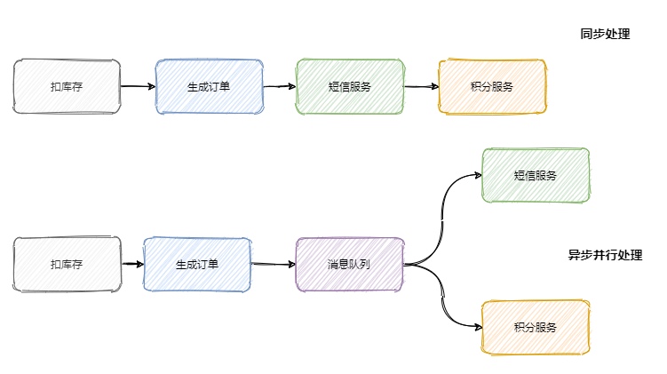
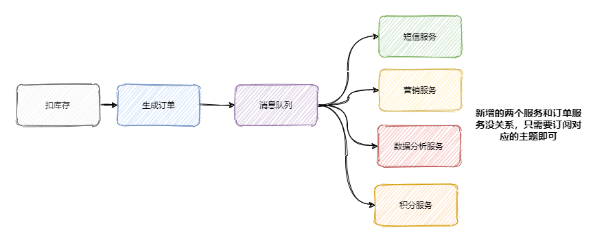

为什么需要消息队列  

消息队列就是一个使用队列来通信的组件  

异步处理、服务解耦、流量控制  

## 异步处理  

项目的请求链路越来越长  ，调用链路长、响应就慢了 。

可以看出消息队列可以减少请求的等待，还能让服务异步并发处理，提升系统总体性能。

## 服务解耦

一般会选用消息队列来解决系统之间耦合的问题，订单服务把订单相关消息塞到消息队列中，下游
系统谁要谁就订阅这个主题。这样订单服务就解放啦  

## 流量控制

1. **生产者过快：**想必大家都听过「削峰填谷」，后端服务相对而言都是比较「弱」的，因为业务较重，处理时间较长。像一些例如秒杀活动爆发式流量打过来可能就顶不住了。因此需要引入一个中间件来做缓冲，消息队列再适合不过了。 
2. **生产者过慢：**当然还有一些服务特别是某些后台任务，不需要及时地响应，并且业务处理复杂且流程长，那么过来的
   请求先放入消息队列中，后端服务按照自己的节奏处理。这也是很 nice 的  

1. **网关的请求先放入消息队列中，后端服务尽自己最大能力去消息队列中消费请求。超时的请求可以直接返回错误 。**

> **引入消息队列固然有以上的好处，但是多引入一个中间件系统的稳定性就下降一层，运维的难度抬高一层**  

## 消息队列基本概念 

**队列模型**和**发布/订阅模型。**  

### 队列模型  

### 发布/订阅模型

队列模型`每条消息只能被一个消费者消费，而发布/订阅模型就是为让一条消息可以被多个消费者消费而生的`，

当然队列模型也可以通过消息全量存储至多个队列来解决一条消息被多个消费者消费问题，但是会有数据的冗余。

**发布/订阅模型兼容队列模型，即只有一个消费者的情况下和队列模型基本一致。**

RabbitMQ 采用队列模型， RocketMQ 和 Kafka 采用发布/订阅模型。

接下来的内容都基于发布/订阅模型。  

# 常见问题

## 如何保证不重复消费消息

> 当使用消息队列时，客户端重复消费可能会成为一个严重的问题。
>
> 这是因为消息队列具有持久性和可靠性的特性，确保消息能够被成功传递给消费者。`然而，这也会导致客户端在某些情况下重复消费消息，例如网络故障、客户端崩溃、消息处理失败等情况。`

为了避免这种情况发生，需要在客户端实现一些机制来确保消息不会被重复消费，例如记录消费者已经处理的消息 ID、使用分布式锁来控制消费进程的唯一性等。这些机制能够保证消息被成功处理，同时也能够提高系统的可靠性和稳定性。

在 RockectMQ 的场景中，这意味着同一个 messageId 的消息会被重复投递。由于消息的可靠投递是更重要的，所以避免消息重复投递的任务转移给了应用程序自身来实现。这也是 RocketMQ 文档强调消费逻辑需要自行实现幂等性的原因。实际上，这背后的逻辑是：==在分布式场景下，保证消息不丢和避免消息重复投递是矛盾的，但是消息重复投递是可以解决的，而消息丢失则非常麻烦。==

