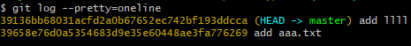

## Git

分布式版本控制系统

**所有版本信息仓库全部同步到本地的每个用户**，这样就可以**在本地查看所有版本历史记录**，可以离线在本地提交，只需在

不会因为服务器损坏或者网络问题，造成不能工作的情况！

### Git与SVN的区别

SVN：集中式版本控制系统，**版本库是集中存放在中央服务器的**，而工作的时候，需要从中央服务器得到最新的版本，然后工作，完成工作后，需要把自己做完的活推送到中央服务器。**集中式版本控制系统是必须联网**的。

Git：分布式版本控制系统，没有中央服务器

### 基本概念

#### 三种概念

已提交(committed)、已修改(modified)、已暂存(staged)

1. 已提交表示数据已经安全的保存在本地数据库中。
2. 已修改表示修改了文件，但还没保存到数据库中。
3. 已暂存表示对一个已修改文件的当前版本做了标记，使之包含在下次提交的快照中。

#### 常用命令

`git status`

- 显示工作目录和暂存区的状态，

`git log`

- 查看历史提交记录
- `git log --pretty=oneline`只输出简单的东西
- 

`git clone` 克隆远程仓库

`git commit -m ‘xxxx’` 

##### git push 

- `git push origin`将当前分支推送到`origin`主机的对应分支。如果当前分支只有一个追踪分支，那么主机名都可以省略。
- `git push -u origin master`如果当前分支与多个主机存在追踪关系，则可以使用`-u`选项指定一个默认主机，这样后面就可以不加任何参数使用`git push` 
- 

#### git pull vs git fetch vs git checkout

- `git pull`：从远程仓库获取最新的提交，并`自动合并`到当前分支
- `git fetch`：从远程仓库获取最新的提交，`但不会自动合并`，需要手动选择合并的时机。
- `git checkout`：用于分支切换、还原文件或创建新分支
  - 分支切换：使用 `git checkout <branch>` 可以切换到指定的分支。例如，`git checkout main` 将切换到名为 `main` 的分支。
  - 文件还原：使用 `git checkout -- <file>` 可以还原指定文件到最后一次提交的状态。这将丢弃当前对文件的修改，并将其还原为最后一次提交时的内容。
  - 创建新分支：使用 `git checkout -b <branch>` 可以创建一个新分支并切换到该分支。

git pull = git fetch + git merge

- git pull 把最新的代码拉下来，并且合并到当前
- git fetch 把最新的代码拉下来

git branch

- git checkout -b xxx  切换到一个新的分支
- 

git merge

git rebase

git cheery-pick

git rebase

git 

## 状态转换

1）Untracked files --> Changes to be committed

使用：`git add 文件名`  或者  `git add .`

含义：将工作区的某个文件、某些文件、或者是所有文件，所作出的修改（新建、删除也算的），添加至暂存区，此时文件就可以被git commit了。

2）Changes to be committed --> Untracked files

使用：`git rm --cached 文件名`

含义：将文件从暂存状态转换为未暂存状态

3）Changes to be committed --> Changes not staged for commit

使用：当某个文件已经git add过了，此时如果再进行修改，使用git status查看文件状态的时候，就处于Changes not staged for commit，意思是修改的部分没有生成快照，不能提交。

