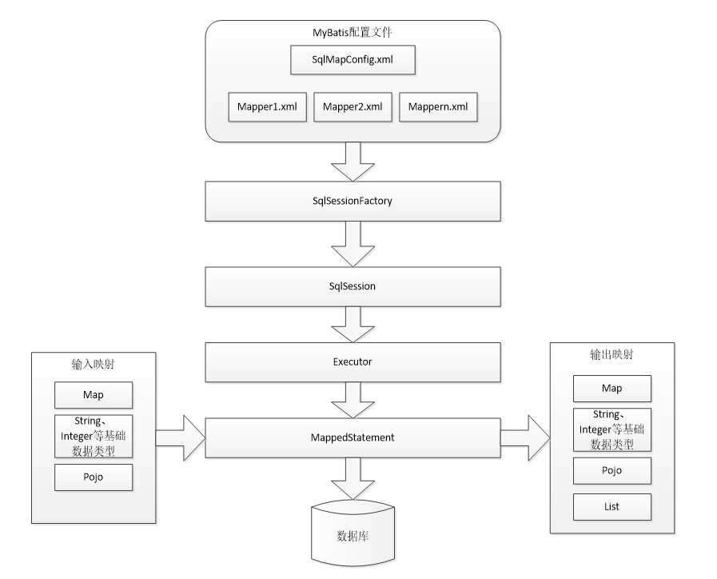

## 简介




1. mybatis配置`SqlMapConfig.xml`，此文件作为mybatis的**全局配置文件**，配置了mybatis的运行环境等信息。mapper.xml文件即**sql映射文件**，文件中配置了操作数据库的sql语句。此文件需要在SqlMapConfig.xml中加载。

2. 通过mybatis环境等配置信息构造SqlSessionFactory即会话工厂。

3.  由会话工厂创建sqlSession即会话，操作数据库需要通过sqlSession进行。

4.  mybatis底层自定义了`Executor`执行器接口操作数据库，Executor接口有两个实现，一个是基本执行器、一个是缓存执行器。

5. Mapped Statement也是mybatis一个底层封装对象，它包装了mybatis配置信息及sql映射信息等。mapper.xml文件中一个sql对应一个Mapped Statement对象，sql的id即是Mapped statement的id。

6. Mapped Statement对sql执行输入参数进行定义，包括HashMap、基本类型、pojo，Executor通过Mapped Statement在执行sql前将输入的java对象映射至sql中，输入参数映射就是jdbc编程中对preparedStatement设置参数。

7.  Mapped Statement对sql执行输出结果进行定义，包括HashMap、基本类型、pojo，Executor通过Mapped Statement在执行sql后将输出结果映射至java对象中，输出结果映射过程相当于jdbc编程中对结果的解析处理过程。


## Idea创建Mybatis项目

1. 配置maven文件

```xml
<packaging>jar</packaging>
<dependencies>
    <dependency>
        <groupId>org.mybatis</groupId>
        <artifactId>mybatis</artifactId>
        <version>3.4.5</version>
    </dependency>
    <dependency>
        <groupId>mysql</groupId>
        <artifactId>mysql-connector-java</artifactId>
        <version>5.1.6</version>
    </dependency>
    <dependency>
        <groupId>log4j</groupId>
        <artifactId>log4j</artifactId>
        <version>1.2.12</version>
    </dependency>

    <dependency>
        <groupId>junit</groupId>
        <artifactId>junit</artifactId>
        <version>4.10</version>
    </dependency>
</dependencies>
```

2. 编写实体类

3. 在resource文件夹下配置`mybatis-config.xml`文件

4. 配置`xxxMapper.xml`映射文件

5. 测试类测试

   ```java
   InputStream in = Resources.getResourceAsStream(MybatisTest.class.getClassLoader(), "mybatis-config.xml");
   SqlSessionFactory sqlSessionFactory = new SqlSessionFactoryBuilder().build(in);
   SqlSession session = sqlSessionFactory.openSession();
   List<Person> list = session.selectList("selectAll");
   for (Person person : list) {
       System.out.println(person.toString());
   }
   ```


## 配置`Mybatis-config.xml`

配置文件的层次结构如下：

- configuration（配置）
  - properties（属性）
  - settings（设置）
  - typeAliases（类型别名）
  - typeHandlers（类型处理器）
  - objectFactory（对象工厂）
  - plugins（插件）
  - environments（环境配置）
    - environment（环境变量）
    - transactionManager（事务管理器）
    - dataSource（数据源）
  - databaseIdProvider（数据库厂商标识）
  - mappers（映射器）

```xml
<?xml version="1.0" encoding="UTF-8" ?>
<!DOCTYPE configuration
PUBLIC "-//mybatis.org//DTD Config 3.0//EN"
"http://mybatis.org/dtd/mybatis-3-config.dtd">
<!-- 配置文件的根元素 -->
<configuration>
    <!-- 属性：定义配置外在化 -->
    <properties></properties>
    <!-- 设置：定义mybatis的一些全局性设置 -->
    <settings>
       <!-- 具体的参数名和参数值 -->
       <setting name="" value=""/> 
    </settings>
    <!-- 类型名称：为一些类定义别名 -->
    <typeAliases></typeAliases>
    <!-- 类型处理器：定义Java类型与数据库中的数据类型之间的转换关系 -->
    <typeHandlers></typeHandlers>
    <!-- 对象工厂 -->
    <objectFactory type=""></objectFactory>
    <!-- 插件：mybatis的插件,插件可以修改mybatis的内部运行规则 -->
    <plugins>
       <plugin interceptor=""></plugin>
    </plugins>
    <!-- 环境：配置mybatis的环境 -->
    <environments default="">
       <!-- 环境变量：可以配置多个环境变量，比如使用多数据源时，就需要配置多个环境变量 -->
       <environment id="">
          <!-- 事务管理器 -->
          <transactionManager type=""></transactionManager>
          <!-- 数据源 -->
          <dataSource type=""></dataSource>
       </environment> 
    </environments>
    <!-- 数据库厂商标识 -->
    <databaseIdProvider type=""></databaseIdProvider>
    <!-- 映射器：指定映射文件或者映射类 -->
    <mappers></mappers>
</configuration>
```


### 属性(property)

这些属性都是可外部配置且可动态替换的，既可以在典型的 Java 属性文件中配置，亦可通过 properties 元素的子元素来传递。例如：

```xml
<properties resource="application.property">
     <property name="driver" value="com.mysql.jdbc.Driver"/>        
</properties>
<!--使用property来存储driver属性的值，使用外部文件application.property来加载username、url等物质-->
<dataSource type="POOLED">
    <property name="driver" value="${driver}"/>
    <property name="url" value="${url}"/>
    <property name="username" value="${username}"/>
    <property name="password" value="${password}"/>
</dataSource>
```

如果属性在不只一个地方进行了配置，那么 MyBatis 将按照下面的顺序来加载：

1. 在 properties 元素体内指定的属性首先被读取；
2. 然后根据 properties 元素中的 resource 属性读取类路径下属性文件或根据 url 属性指定的路径读取属性文件，并覆盖已读取的同名属性。
3. 最后读取作为方法参数传递的属性，并覆盖已读取的同名属性。


**元素-> 文件 -> 方法参数**，所以方法参数的优先级最高

从 MyBatis 3.4.2 开始，你可以为占位符指定一个默认值。例如：

```xml
<dataSource type="POOLED">
  <!-- ... -->
  <property name="username" value="${username:root}"/> <!-- 如果属性 'username' 没有被配置，'username' 属性的值将为 'root' -->
</dataSource>
```

这个特性默认是关闭的。如果你想为占位符指定一个默认值， 你应该添加一个指定的属性来开启这个特性。例如：

```xml
<properties resource="org/mybatis/example/config.properties">
  <!-- ... -->
  <property name="org.apache.ibatis.parsing.PropertyParser.enable-default-value" value="true"/> <!-- 启用默认值特性 -->
</properties>
```


### 类型别名(typeAliases)

类型别名是为Java类型设置的一个短的名字。它只和XML配置有关，存在的意义仅在于用来减少类完全限定名的冗余。

```xml
<typeAliases>
	<typeAlias alias="user" type="cn.mybatis.domain.User"/>
</typeAliases>
```


MyBatis已经为许多常见的Java类型内建了相应的类型别名(见下表)。它们都是大小写不敏感的。

| 别名       | 映射的类型 |
| ---------- | ---------- |
| _byte      | byte       |
| _long      | long       |
| _short     | short      |
| _int       | int        |
| _integer   | int        |
| _double    | double     |
| _float     | float      |
| _boolean   | boolean    |
| string     | String     |
| byte       | Byte       |
| long       | Long       |
| short      | Short      |
| int        | Integer    |
| integer    | Integer    |
| double     | Double     |
| float      | Float      |
| boolean    | Boolean    |
| date       | Date       |
| decimal    | BigDecimal |
| bigdecimal | BigDecimal |
| object     | Object     |
| map        | Map        |
| hashmap    | HashMap    |
| list       | List       |
| arraylist  | ArrayList  |
| collection | Collection |
| iterator   | Iterator   |


## Mapper代理的开发规范


1.  mapper接口的全限定名要和mapper映射文件的namespace值一致。

   ```xml
   <?xmlversion="1.0"encoding="UTF-8"?>
   <!DOCTYPEmapper
   PUBLIC"-//mybatis.org//DTDMapper 3.0//EN"
   "http://mybatis.org/dtd/mybatis-3-mapper.dtd">
   <!--namespace命名空间，为了对sql语句进行隔离，方便管理，mapper开发dao方式，使用namespace有特殊作用
   mapper代理开发时将namespace指定为mapper接口的全限定名
    -->
   <mapper namespace="cn.itcast.mybatis.mapper.UserMapper">
   ```

   

2. UserMapper.xml中**statement的id就是mapper.java中的方法名**

3. mapper接口的方法参数类型要和mapper映射文件的statement的parameterType的值一致

4. mapper接口的方法返回值类型要和mapper映射文件的statement的resultType的值一致。


mapper映射文件例子：

```xml
<!--namespace 要与接口名称相一致-->
<mapper namespace="cn.itcast.mybatis.mapper.UserMapper">  
 
   <!--  根据id查询用户信息
      id：唯一标识一个statement  
      #{}：表示一个占位符，如果#{}中传入简单类型的参数，#{}中的名称随意  
      parameterType：输入参数的类型，通过#{}接收parameterType输入的参数  
      resultType：输出结果类型，不管返回是多条还是单条，指定单条记录映射的pojo类型  
    -->  
   <select id="findUserById" parameterType="int" resultType="com.itheima.mybatis.po.user">  
      SELECT * FROM USER WHERE id= #{id}  
   </select> 
 
 
   <!-- 添加用户  
     parameterType：输入参数的类型，User对象包括username,birthday,sex,address  
     #{}接收pojo数据，可以使用OGNL解析出pojo的属性值  
     #{username}表示从parameterType中获取pojo的属性值  
     selectKey：用于进行主键返回，定义了获取主键值的sql  
     order：设置selectKey中sql执行的顺序，相对于insert语句来说  
     keyProperty：将主键值设置到哪个属性  
     resultType：select LAST_INSERT_ID()的结果类型  
   -->  
   <insert id="insertUser" parameterType="cn.itcast.mybatis.po.User">  
      <selectKey keyProperty="id" order="AFTER" resultType="int">  
         select LAST_INSERT_ID()  
      </selectKey>  
       
      INSERT INTO USER(username,birthday,sex,address)VALUES(#{username},#{birthday},#{sex},#{address})  
   </insert>  
   <!-- 根据用户名称查询用户信息，可能返回多条  
    ${}：表示sql的拼接，通过${}接收参数，将参数的内容不加任何修饰拼接在sql中。   
    -->  
   <select id="findUserByName" parameterType="java.lang.String" resultType="cn.itcast.mybatis.po.User">  
      select * from user where usernamelike '%${value}%'  
   </select>
</mapper>
```

## Mybatis映射器

### Mybatis映射器(三种)

- 纯XML映射器

  - 纯xml映射器，利用SqlSession的各种方法实现增删改查。

  - ```java
    Person p = session.selectOne("cn.mybatis.mydemo.mapper.PersonMapper.selectPersonById", 1);
    // 第一个参数是xml映射文件中的namespace+方法id。
    ```

- xml映射器+接口映射器

  - 先定义**接口映射器**，然后再定义xml映射器，其中**xml映射器的namespace应该对应接口映射器的类名**。其用法如下：

    ```java
    PersonMapper pm = session.getMapper(PersonMapper.class);
    // 直接调用接口的方法，查询id为1的Peson数据
    Person p2 = pm.selectPersonById(1);
    ```

- 注解+接口映射器

  - 将原先xml里面的sql配置信息，变成Java注解的形式写到接口映射器
  - 即将sql语句用注解的方式写在方法上边。

### 引入映射器(三种)

- 通过文件类路径引入**XML映射器**

  - ```xml
    <mappers>
     <mapper resource="cn/mybatis/mydemo/mapper/StudentMapper.xml"/>
    </mappers>
    ```

- 通过包名引入映射器接口

  - ```xml
    <mappers>
        <package name="cn.mybatis.mydemo.mapper" />
    </mappers>
    ```

- 用类注册引入映射器接口

  - ```xml
    <mappers>
        <mapper class="cn.mybatis.mydemo.mapper.StudentMapper"/>
    </mappers>
    ```

### 其他问题

#### 映射器只是一个接口？

> 注意：映射器只是一个接口，而不是一个实现类。初学者可能会产生一个很大的疑问：接口不是不能运行吗？的确，接口不能直接运行，但是MyBatis内部运用了动态代理技术，生成接口的实现类，从而完成接口的相关功能。只要明白 MyBatis 会为这个接口生成一个代理对象，代理对象会去处理映射器接口相关的逻辑即可。

#### 不写SQL执行与Student的对应关系行吗？

> 注意：我们并没有配置 SQL 执行后和 Student 的对应关系，它是如何映射的呢？其实，这里采用的是一种被称为自动映射的功能，MyBatis在默认情况下提供自动映射，**只要SQL返回的列名能和POJO的属性对应起来即可。**


### 面试题

#### 什么是MyBatis的接口绑定？有哪些实现方式？

接口绑定就是将SQL与方法绑定在一起，我们直接调用接口中的方法就可以了。

- 通过注解，在接口的方法上面加上 @Select、@Update等注解，里面包含Sql语句来绑定
- 通过xml里面写SQL来绑定，在这种情况下，要指定xml映射文件里面的namespace必须为接口的全路径名。


#### MyBatis常见面试题1：精讲#{}和${}的区别是什么？

>  /#{}是**预编译处理**，${}是字符串替换。


- mybatis在处理#{}时，会将sql中的#{}替换为?号，调用PreparedStatement的set方法来赋值。

- mybatis在处理${}时，就是把${}替换成变量的值。

- 使用#{}可以有效的防止SQL注入，提高系统安全性。原因在于：预编译机制。**预编译完成之后，SQL的结构已经固定，即便用户输入非法参数，也不会对SQL的结构产生影响，从而避免了潜在的安全风险。**

- 预编译是提前对SQL语句进行预编译，而其后注入的参数将不会再进行SQL编译。我们知道，SQL注入是发生在编译的过程中，因为恶意注入了某些特殊字符，最后被编译成了恶意的执行操作。而预编译机制则可以很好的防止SQL注入。


#### 既然`${}`会引起sql注入，为什么有了`#{}`还需要有`${}`呢？那其存在的意义是什么？

可以这么去理解：`#{}`主要用于预编译，而预编译的场景其实非常受限，而${}用于替换，很多场景会出现替换，而这种场景可不是预编译，比如xml里边sql语句片段

```xml
<sql id="Base_Column_List">
      id, userName, age, gender
</sql>

<select id="selectAll" resultMap="BaseResultMap">
        select
        <include refid="Base_Column_List" />
        from person
    </select>
```


#### 数据库重复写入数据问题处理

1. replace into
   1. replace into 首先尝试插入数据到表中。 如果发现表中已经有此行数据(根据主键或者唯一索引判断)则先删除此行数据，然后插入新的数据，否则，直接插入新数据。
2. 主键约束
3. redis加一个key
4. insert ignore
   1. insert ignore会忽略数据库中已经存在的数据(根据主键或者唯一索引判断)，如果数据库没有数据，就插入新的数据，如果有数据的话就跳过这条数据.


#### 当实体类中的属性名和表中的字段名不一样，怎么办 ？

- 第1种解决方案：通过在查询的sql语句中定义字段名的别名，让字段名的别名和实体类的属性名一致。

  ```xml
  <select id="getOrder" parametertype="int" resultetype="cn.mybatis.domain.order">
      select order_id id, order_no orderNo ,order_price price form orders where order_id=#{id};
  </select>
  ```


- 第2种解决方案：通过`<resultMap>`来映射字段名和实体类属性名的一一对应的关系。

  ```xml
  <select id="getOrder" parameterType="int" resultMap="orderResultMap">
      select * from orders where order_id=#{id}
  </select>
  
  <resultMap id="orderResultMap" type="cn.mybatis.domain.order" >
      <!–用id属性来映射主键字段–>
      <id property="id" column="order_id">
      <!–用result属性来映射非主键字段，property为实体类属性名，column为数据表中的属性–>
      <result property= "orderNo" column="order_no"/>
      <result property="price" column="order_price"/>
  </reslutMap>
  ```


#### 模糊查询like语句该怎么写?


- **第一种**：在Java代码中添加SQL通配符·

  ```java
  string wildcardname = "%tom%";
  list<name> names = mapper.selectLike(wildcardname);
  ```

  ```xml
  <select id="selectLike">
      select * from users where name like #{value}
  </select>
  ```

- **第二种**：在sql语句中拼接通配符，容易引起SQL注入。

  ```java
  string wildcardname = "tom";
  list<name> names = mapper.selectLike(wildcardname);
  ```

  ```xml
  <select id="selectLike">
      select * from users where name like "%"#{value}"%"
  </select>
  
  ```

  


#### Dao接口的工作原理

Dao接口即Mapper接口。**接口的全限名，就是映射文件中的namespace的值**；**接口的方法名，就是映射文件中Mapper的Statement的id值**；**接口方法内的参数，就是传递给sql的参数。**

Mapper接口是没有实现类的，当调用接口方法时，接口全限名+方法名拼接字符串作为key值，可唯一定位一个MapperStatement。在Mybatis中，每一个 `<select>、<insert>、<update>、<delete>`标签，都会被解析为一个MapperStatement对象。

举例来说：cn.mybatis.mappers.StudentDao.findStudentById，可以唯一找到namespace为 com.mybatis.mappers.StudentDao下面 id 为 findStudentById 的 MapperStatement。

Mapper接口里的方法，**是不能重载的，因为是使用 全限名+方法名 的保存和寻找策略**。Mapper 接口的工作原理是JDK动态代理，Mybatis运行时会使用JDK动态代理为Mapper接口生成代理对象proxy，代理对象会拦截接口方法，转而执行MapperStatement所代表的sql，然后将sql执行结果返回。


#### Mybatis的一级、二级缓存

（1）一级缓存: 基于 PerpetualCache 的 HashMap 本地缓存，其存储作用域为 Session，当 Session flush 或 close 之后，该 Session 中的所有 Cache 就将清空，默认打开一级缓存。

（2）二级缓存与一级缓存其机制相同，默认也是采用 PerpetualCache，HashMap 存储，不同在于其存储作用域为 Mapper(Namespace)，并且可自定义存储源，如 Ehcache。默认不打开二级缓存，要开启二级缓存，使用二级缓存属性类需要实现Serializable序列化接口(可用来保存对象的状态)，可在它的映射文件中配置 <cache /> ；

（3）对于缓存数据更新机制，当某一个作用域(一级缓存 Session/二级缓存Namespaces)的进行了C/U/D 操作后，默认该作用域下所有 select 中的缓存将被 clear。


#### 预编译的过程


预编译功能如此重要，那么数据库是如何实现预编译的呢？这个问题其实可以当做一个面试题，能很好的考察面试者对预编译的理解。下面以MySQL为例说明一下预编译的过程：

MySQL执行预编译分为如三步：

第一步：执行预编译语句，例如：prepare myperson from 'select * from t_person where name=?'
第二步：设置变量，例如：set @name='Jim'
第三步：执行语句，例如：execute myperson using @name

如果需要再次执行myperson，那么就不再需要第一步，即不需要再编译语句了：

设置变量，例如：set @name='Tom'
执行语句，例如：execute myperson using @name


#### Mybatis的工作原理

他就是对JDBC操作数据库做了一层封装。

我们知道，JDBC有四个核心对象：
（1）DriverManager，用于注册数据库连接
（2）Connection，与数据库连接对象
（3）Statement/PrepareStatement，操作数据库SQL语句的对象
（4）ResultSet，结果集或一张虚拟表


而MyBatis也有四大核心对象：
（1）SqlSession对象，该对象中包含了执行SQL语句的所有方法。类似于JDBC里面的Connection。
（2）Executor接口，它将根据SqlSession传递的参数动态地生成需要执行的SQL语句，同时负责查询缓存的维护。类似于JDBC里面的Statement/PrepareStatement。
（3）MappedStatement对象，该对象是对映射SQL的封装，用于存储要映射的SQL语句的id、参数等信息。
（4）ResultHandler对象，用于对返回的结果进行处理，最终得到自己想要的数据格式或类型。可以自定义返回类型。


上面中流程就是MyBatis内部核心流程，每一步流程的详细说明如下文所述：

（1）读取MyBatis的配置文件。mybatis-config.xml为MyBatis的全局配置文件，用于配置数据库连接信息。

（2）加载映射文件。映射文件即SQL映射文件，该文件中配置了操作数据库的SQL语句，需要在MyBatis配置文件mybatis-config.xml中加载。mybatis-config.xml 文件可以加载多个映射文件，每个文件对应数据库中的一张表。

（3）构造会话工厂。通过MyBatis的环境配置信息构建会话工厂SqlSessionFactory。

（4）创建会话对象。由会话工厂创建SqlSession对象，该对象中包含了执行SQL语句的所有方法。

（5）Executor执行器。MyBatis底层定义了一个Executor接口来操作数据库，它将根据SqlSession传递的参数动态地生成需要执行的SQL语句，同时负责查询缓存的维护。

（6）MappedStatement对象。在Executor接口的执行方法中有一个MappedStatement类型的参数，该参数是对映射信息的封装，用于存储要映射的SQL语句的id、参数等信息。

（7）输入参数映射。输入参数类型可以是Map、List等集合类型，也可以是基本数据类型和POJO类型。输入参数映射过程类似于JDBC对preparedStatement对象设置参数的过程。

（8）输出结果映射。输出结果类型可以是Map、List等集合类型，也可以是基本数据类型和POJO类型。输出结果映射过程类似于JDBC对结果集的解析过程。


在JDBC中，Connection不直接执行SQL方法，而是利用Statement或者PrepareStatement来执行方法。

> 在使用JDBC建立了连接之后，可以使用Connection接口的createStatement()方法来获取Statement对象，也可以调用prepareStatement()方法获得PrepareStatement对象，通过executeUpdate()方法来执行SQL语句。

而在MyBatis中，SqlSession对象包含了执行SQL语句的所有方法。但是它是委托Executor执行的。


#### 如何获取自动生成的(主)键值?

insert 方法总是返回一个int值 - 这个值代表的是插入的行数。  而自动生成的键值在 insert 方法执行完后可以被设置到传入的参数对象中。


#### 在mapper中如何传递多个参数?

```
第1种
//DAO层的函数

Public UserselectUser(String name,String area); 
//对应的xml,#{0}代表接收的是dao层中的第一个参数，#{1}代表dao层中第二参数，更多参数一致往后加即可。

<select id="selectUser"resultMap="BaseResultMap">  
    select *  fromuser_user_t   whereuser_name = #{0} anduser_area=#{1}  
</select>  

第2种：    使用 @param 注解: 
    import org.apache.ibatis.annotations.param; 
        public interface usermapper { 
         user selectuser(@param(“username”) string username, 
         @param(“hashedpassword”) string hashedpassword); 
        }
然后,就可以在xml像下面这样使用(推荐封装为一个map,作为单个参数传递给mapper): 

   <select id=”selectuser” resulttype=”user”> 
         select id, username, hashedpassword 
         from some_table 
         where username = #{username} 
         and hashedpassword = #{hashedpassword} 
    </select>
    

```


#### Mybatis动态sql是做什么的？都有哪些动态sql？能简述一下动态sql的执行原理不？

Mybatis动态sql可以让我们在Xml映射文件内，以标签的形式编写动态sql，完成逻辑判断和动态拼接sql的功能。
Mybatis提供了9种动态sql标签：trim|where|set|foreach|if|choose|when|otherwise|bind。
其执行原理为，使用OGNL从sql参数对象中计算表达式的值，根据表达式的值动态拼接sql，以此来完成动态sql的功能。


#### Mybatis的Xml映射文件中，不同的Xml映射文件，id是否可以重复？

> 不同的Xml映射文件，如果配置了namespace，那么id可以重复；如果没有配置namespace，那么id不能重复；毕竟namespace不是必须的，只是最佳实践而已。
>
> 原因就是namespace+id是作为Map<String, MappedStatement>的key使用的，如果没有namespace，就剩下id，那么，id重复会导致数据互相覆盖。有了namespace，自然id就可以重复，namespace不同，namespace+id自然也就不同。


#### 为什么说Mybatis是半自动ORM映射工具？它与全自动的区别在哪里？

> Hibernate属于全自动ORM映射工具，使用Hibernate查询关联对象或者关联集合对象时，可以根据对象关系模型直接获取，所以它是全自动的。而Mybatis在查询关联对象或关联集合对象时，需要手动编写sql来完成，所以，称之为半自动ORM映射工具。


#### 一对一、一对多的关联查询 ？


```xml
<mapper namespace="com.lcb.mapping.userMapper">  
    <!--association  一对一关联查询 -->  
    <select id="getClass" parameterType="int" resultMap="ClassesResultMap">  
        select * from class c,teacher t where c.teacher_id=t.t_id and c.c_id=#{id}  
    </select>  
    <resultMap type="com.lcb.user.Classes" id="ClassesResultMap">  
        <!-- 实体类的字段名和数据表的字段名映射 -->  
        <id property="id" column="c_id"/>  
        <result property="name" column="c_name"/>  
        <association property="teacher" javaType="com.lcb.user.Teacher">  
            <id property="id" column="t_id"/>  
            <result property="name" column="t_name"/>  
        </association>  
    </resultMap>  

    <!--collection  一对多关联查询 -->  
    <select id="getClass2" parameterType="int" resultMap="ClassesResultMap2">  
        select * from class c,teacher t,student s where c.teacher_id=t.t_id and c.c_id=s.class_id and c.c_id=#{id}  
    </select>  
    <resultMap type="com.lcb.user.Classes" id="ClassesResultMap2">  
        <id property="id" column="c_id"/>  
        <result property="name" column="c_name"/>  
        <association property="teacher" javaType="com.lcb.user.Teacher">  
            <id property="id" column="t_id"/>  
             <result property="name" column="t_name"/>  
        </association>  
        <collection property="student" ofType="com.lcb.user.Student">  
            <id property="id" column="s_id"/>  
            <result property="name" column="s_name"/>  
        </collection>  
    </resultMap>  

</mapper>  

```

