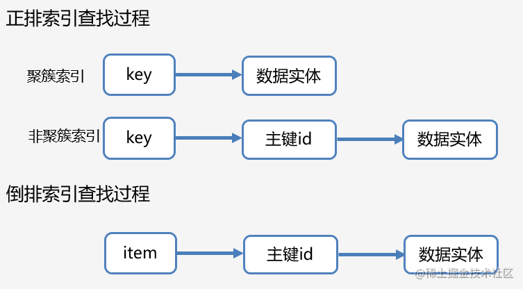
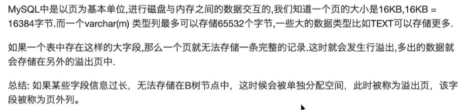
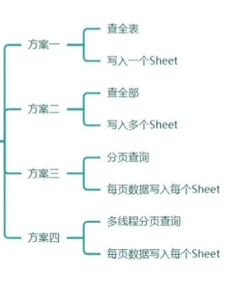
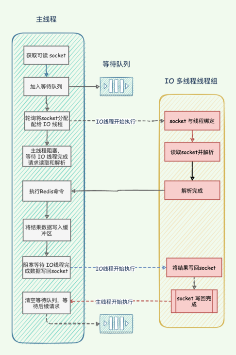
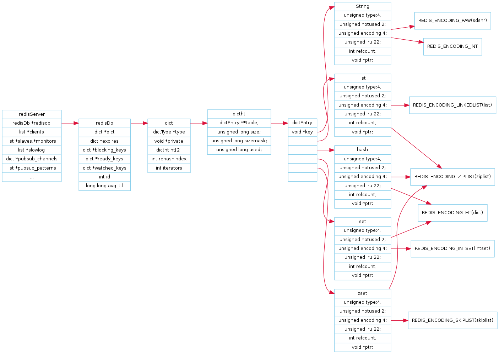
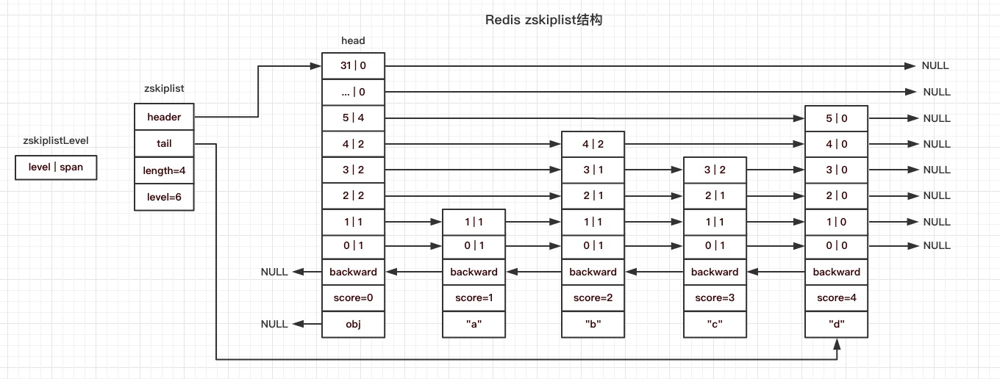
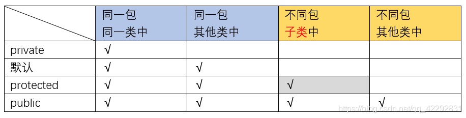
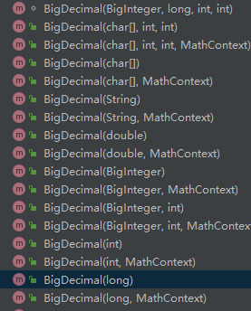
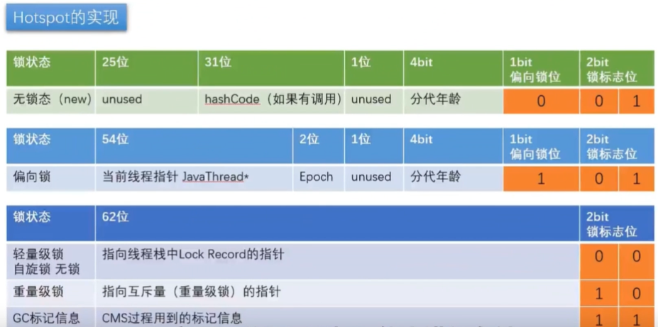

## SpringBoot


## 数据库

### 1、有一个表里有100个字段，如何设计索引。

1. 确定哪些字段是经常用于查询的，以及哪些查询是最频繁的.
2. 主键自增，
3. 找区分度较大的字段建立索引，或者说列基数较大的字段建立索引。
4. 也可以根据具体查询的情况建立联合索引，建组合索引的时候，区分度最高的在最左边。
5. 能满足索引覆盖就尽量满足，避免回表。
6. 最后根据实际情况，定时查看检查索引，优化索引。

### 2、Innodb引擎中一张表最多放多少列，

1. 一张表最多可以有4096个列（即字段），但这个限制可能不适用于所有版本的InnoDB存储引擎。
2. 一行最大的存储数据量是 65,535 字节（64KB）。
3. 一个表最多可以存储的数据量取决于磁盘容量、可用内存、系统配置等因素，通常没有特定的限制。

### 3、正排索引和倒排索引

正排索引和倒排索引 指的是 **全文索引的正排和倒排**

1. 倒排索引：通过分词之后查询文档的编号？
2. 正排索引：查询文档里有哪些词汇？




### 4、隐式类型转换可能不走索引

**Mysql在 `varchar` 类型字段的索引中如果发生了隐式类型转换，则索引将失效。**

- 建有索引的varchar字段`key1`， 在`where key1 = 1`时，会发生隐式类型转换，变为`where key1 = 1`，所以不会导致索引失效。

**Mysql对待int类型字段的隐式类型转换的时候，不会导致`索引失效`**

- 建有索引的int字段`key1`， 在`where key1 = '1'`时，会发生隐式类型转换，变为`where key1 = 1`，所以不会导致索引失效。

**隐式字符集转换，utf8m4是utf8超集，utf8，与utf8mb4会比较，utf8会转换为utf8mb4.**

- ```sql
  SELECT
   * 
  FROM
   oc_order oo
   JOIN orders_detail od ON CONVERT ( oo.order_id USING UTF8 ) = od.order_id
  ```


### 5、下面这条SQL，该怎么创建**联合索引**？

```sql
SELECT * FROM test WHERE a in (1,2,3) and b > 1;
```

答案是（`a`,`b`）。in条件查询会被转换成等值查询


### 6、数据库三大范式


### 7、知道数据库中的哪几种索引，分别讲讲？


### 8、阿里开发手册为什么推荐单表不超过2KW

阿里开发手册推荐单表不超过2KW的原因有几个:

1. 超大表查询慢:当单表的数据量过大时,即使MySQL的B+树索引结构可以支持快速检索,但无论是全表扫描还是索引扫描,读取的数据量太大也会导致查询速度变慢。

2. 超大表更难维护:数据量过大的单表,所有数据都集中在一起,不利于数据的划分和管理,也更难进行数据迁移、备份等操作。

3. 超大表更易发生锁冲突:当有大量请求同时访问一个超大表时,更容易发生锁的冲突,影响并发度。

4. 超大表恢复难度大:如果一个超大表因某些原因损坏或数据失误,其恢复难度和代价远超一个中等表大小的数据。

5. 超大表更难进行关联查询:当一个超大表需要和其他表进行关联查询时,容易发生“卡表”现象,影响查询效率。

所以,从性能、可维护性和容灾的角度考虑,阿里开发手册推荐将一个表的大小控制在适度范围内,不要超过2KW,如果数据量过大,可以通过垂直拆分或水平拆分等方式实现表的最小化。这样可以使每个表保持在可管理的范围内,利于系统的稳定性和可靠性。


### 9、什么是行溢出？

 


### 10、Count(1)、Count(*)、count(列名)哪个性能最好？

count() 是一个聚合函数，`函数的参数不仅可以是字段名，也可以是其他任意表达式`，该函数作用是**统计符合查询条件的记录中，`函数指定的参数不为 NULL 的记录有多少个`**。


1. count(列名)：统计的是该列下，不为null的记录数量

2. count(1)：统计的是该`表达式`不会null的记录数量

   1. 1 这个表达式就是单纯数字，它永远都不是 NULL，所以上面这条语句，其实是在统计 t_order 表中有多少个记录。

3. **count(`*`) 其实等于 count(`0`)**

   > *InnoDB handles SELECT COUNT(`\*`) and SELECT COUNT(`1`) operations in the same way. There is no performance difference.*
   >
   > *翻译：InnoDB以相同的方式处理SELECT COUNT（`\*`）和SELECT COUNT（`1`）操作，没有性能差异。*
   >
   > - 而且 MySQL 会对 count(*) 和 count(1) 有个优化，`如果有多个二级索引的时候，优化器会使用key_len 最小的二级索引进行扫描。`


### 11、count()的优化

1. 使用近似值`explain select count(*) from xxx;`
2. 在另外一张表内进行存储

## 业务

### 1、百万数据的导入、导出

#### 百万数据的导入

1. 单线程逐行解析 + 单线程`单条`数据插入(一万多条一分钟)
2. 单线程逐行解析 + 单线程`批量`数据插入(100万345s)
   1. 逐行解析之后保存到list中，达到一定数量，批量插入到数据库。
3. `多线程`逐行解析 + 单线程`批量`数据插入(100万122s)
   1. 一个线程读取一个sheet，读取之后执行回调方法(invoke())
4. `多线程`解析 + `多线程批量`数据插入(100万106s)

#### 百万数据的导出




## 奇奇怪怪

### 1、为什么数组下标是从0开始而不是从1开始？

这是由于在C语言中，数组是通过指针和偏移量计算得到的，而指针是指向内存地址的整数，内存地址从0开始编号。因此，数组的第一个元素的偏移量为0，第二个元素的偏移量为1。

1. 数组元素的偏移量可以通过简单的数学运算进行计算，例如第i个元素的偏移量可以通过 i*sizeof(element) 计算得到。
2. 数组的长度可以通过最后一个元素的下标加1来计算得到，这可以避免一些可能出现的边界问题。


### 2、现在让你设计一个接口，你会用基本数据类型还是包装数据类型

使用包装数据类型有以下几个好处：

1. `可以使用 null 值`，基本数据类型不支持 null 值。
2. 可以进行更多的操作，如转换、比较等。
3. 可以`更好地支持泛型`。


### 3、大端序和小端序

大端：数据的高字节在低地址中，低字节在高地址(`人类阅读的顺序`)

- 网络字节序就是大端存储

小端：数据的高字节在高地址中，低字节在低地址

- 操作系统中都是小端存储


### 4、尾递归

而尾递归则是指递归过程中，只有一个栈帧被不断的更新。即，函数执行完成后直接返回结果，不再进行任何其他操作。这样一来，由于只占用一个栈帧，程序在空间上会得到很大优化，极大地降低了内存负担。同时，尾递归也可以被优化为迭代的形式，进一步减少时间负担。

尾递归的特点就是能够优化算法的性能，他避免了不必要的栈帧创建，使得递归算法的空间复杂度降低到O(1),使用尾递归不会导致栈溢出问题。


### 5、ClassNotFoundException Vs NoClassDefFoundError(拼多多二面)

**NoClassDefFoundError**

> Thrown if the Java Virtual Machine or a ClassLoader instance tries to load in the definition of a class (as part of a normal method call or as part of creating a new instance using the new expression) and no definition of the class could be found.
>
> The searched-for class definition existed when the currently executing class was compiled, but the definition can no longer be found.
> 当JVM或ClassLoader实例尝试加载类的定义（作为普通方法调用或使用new表达式创建新实例所触发的类加载）时，找不到该类的定义时，就会抛出该异常。在当前正在执行的类被编译时，类定义是存在的，但现在无法找到该定义。
>
> 1. `简单来说，就是编译的时候在，但是加载的时候找不到了`
> 2. NoClassDefFoundError实际上不是异常，而是从LinkageError派生的错误。

------

**ClassNotFoundException**

> Thrown when an application tries to load in a class through its string name using: The forName method in class Class. The findSystemClass method in class ClassLoader . The loadClass method in class ClassLoader.
>
> ``
> 当应用程序尝试通过其字符串名称加载类时，使用以下方法中的一种时，就会抛出该异常：
>
> 1. Class类中的forName方法、
> 2. ClassLoader类中的findSystemClass方法
> 3. ClassLoader类中的loadClass方法。
>
> 

------

You have to understand that the `JVM` can't realize the definition of the `class` you deleted can't be found, as the `class` itself can't be found which automatically throw the `ClassNotFoundException`.

This exception happen at `runtime` so it does not matter if it compiled first or not, you deleted the file, therefore it can't be found and throw the `exception`.

Note that `NoClassDefFoundError` is not actually an exception, it is an `Error` derived from `LinkageError` while `ClassNotFoundException` derive directly from `java.lang.Exception`.

To resume, the `NoClassDefFoundError` globally simply mean that the `JVM` tried to access at `runtime` something that according to the `compiled` code should exists, but does not actually exist (or is not in the classpath).

------

**Example to reproduce ClassNotFoundException**

```java
public class ClassNotFoundExceptionExample {

    private static final String CLASS_TO_LOAD = "main.java.Utils";

    public static void main(String[] args) {
        try {
            Class loadedClass = Class.forName(CLASS_TO_LOAD);
            System.out.println("Class " + loadedClass + " found successfully!");
        }
        catch (ClassNotFoundException ex) {
            System.err.println("A ClassNotFoundException was caught: " + ex.getMessage());
            ex.printStackTrace();
        }
    }
}
```

------

**Example to reproduce NoClassDefFoundError**

Create a simple class `Test`

```java
public class Test {
        public Test() {
                System.out.println("A new instance of the Test class was created!");
        }
}
```

And a class `NoClassDefFoundErrorExample`

```java
public class NoClassDefFoundErrorExample {
        private static Test test = new Test();

        public static void main(String[] args) {
                System.out.println("The definition of Test was found!");
        }
}
```

Now create a n executable `.jar` which execute the `main` method. You can specify it in the `Manifest.txt` file inside the `.jar`

```java
Main-Class: NoClassDefFoundErrorExample
```

Now run the following commands

```java
javac Test.java
javac NoClassDefFoundErrorExample.java
jar cfm NoClassDefFoundErrorExample.jar Manifest.txt NoClassDefFoundErrorExample.class
java -jar NoClassDefFoundErrorExample.jar
```

Notice the `NoClassDefFoundError`

```java
Exception in thread "main" java.lang.NoClassDefFoundError: TestClass
    at NoClassDefFoundErrorExample.(NoClassDefFoundErrorExample.java:2)
Caused by: java.lang.ClassNotFoundException: TestClass
    at java.net.URLClassLoader$1.run(URLClassLoader.java:372)
    at java.net.URLClassLoader$1.run(URLClassLoader.java:361)
    at java.security.AccessController.doPrivileged(Native Method)
    at java.net.URLClassLoader.findClass(URLClassLoader.java:360)
    at java.lang.ClassLoader.loadClass(ClassLoader.java:424)
    at sun.misc.Launcher$AppClassLoader.loadClass(Launcher.java:308)
    at java.lang.ClassLoader.loadClass(ClassLoader.java:357)
    ... 1 more
```


## Redis

### 1、Redis和netty的网络模型有什么区别？

Redis的多线程：`主线程负责创建、断开连接和执行命令，子线程负责读写和解析命令`。

Netty的多线程：`主线程负责创建、断开链接，子线程负责读写和协议编解码`。

所以你要说不同，那就是源于**两者功能定位**上的区别：Redis是缓存服务器 + 网络通信，而Netty是纯粹的网络通信。Redis多了一个命令的解析和处理环节；Netty对应的是协议编解码，这个是在子线程中执行，而业务逻辑视复杂程度，可以直接在EventLoop中执行，也可提交业务线程池执行。

从线程模型上来说，Netty实现了**更彻底的Reactor模型**，在boss线程将连接分配到worker线程后，各worker线程独立工作；而Redis的模型为了与旧版本的lock free兼容，命令还是在boss线程上串行执行的，worker线程承担的工作有限，因此对多核的利用率不如Netty。

### 2、Redis6.0 多线程的实现机制

Redis 6.0 版本支持的 I/O 多线程特性，默认情况下 I/O 多线程只针对发送响应数据（write client socket），并不会以多线程的方式处理读请求（read client socket）。要想开启多线程处理客户端读请求，就需要把 Redis.conf 配置文件中的 io-threads-do-reads 配置项设为 yes。




### 3、Redis数据类型




### 4、跳表的实现

```c++
#include <bits/stdc++.h>
using namespace std;

template <typename K, typename V>
struct SkipListNode {
  int level;
  K key;
  V value;
  SkipListNode **forward;

  SkipListNode() {}

  SkipListNode(K k, V v, int l, SkipListNode *nxt = NULL) {
    key = k;
    value = v;
    level = l;
    forward = new SkipListNode *[l + 1];
    for (int i = 0; i <= l; ++i) forward[i] = nxt;
  }

  ~SkipListNode() {
    if (forward != NULL) delete[] forward;
  }
};

template <typename K, typename V>
struct SkipList {
  static const int MAXL = 32;
  static const int P = 4;
  static const int S = 0xFFFF;
  static const int PS = S / P;
  static const int INVALID = INT_MAX;

  SkipListNode<K, V> *head, *tail;
  int length;
  int level;

  SkipList() {
    srand(time(0));

    level = length = 0;
    tail = new SkipListNode<K, V>(INVALID, 0, 0);
    head = new SkipListNode<K, V>(INVALID, 0, MAXL, tail);
  }

  ~SkipList() {
    delete head;
    delete tail;
  }

  int randomLevel() {
    int lv = 1;
    while ((rand() & S) < PS) ++lv;
    return MAXL > lv ? lv : MAXL;
  }

  void insert(const K &key, const V &value) {
    SkipListNode<K, V> *update[MAXL + 1];

    SkipListNode<K, V> *p = head;
    for (int i = level; i >= 0; --i) {
      while (p->forward[i]->key < key) {
        p = p->forward[i];
      }
      update[i] = p;
    }
    p = p->forward[0];

    if (p->key == key) {
      p->value = value;
      return;
    }

    int lv = randomLevel();
    if (lv > level) {
      lv = ++level;
      update[lv] = head;
    }

    SkipListNode<K, V> *newNode = new SkipListNode<K, V>(key, value, lv);
    for (int i = lv; i >= 0; --i) {
      p = update[i];
      newNode->forward[i] = p->forward[i];
      p->forward[i] = newNode;
    }

    ++length;
  }

  bool erase(const K &key) {
    SkipListNode<K, V> *update[MAXL + 1];
    SkipListNode<K, V> *p = head;

    for (int i = level; i >= 0; --i) {
      while (p->forward[i]->key < key) {
        p = p->forward[i];
      }
      update[i] = p;
    }
    p = p->forward[0];

    if (p->key != key) return false;

    for (int i = 0; i <= level; ++i) {
      if (update[i]->forward[i] != p) {
        break;
      }
      update[i]->forward[i] = p->forward[i];
    }

    delete p;

    while (level > 0 && head->forward[level] == tail) --level;
    --length;
    return true;
  }

  V &operator[](const K &key) {
    V v = find(key);
    if (v == tail->value) insert(key, 0);
    return find(key);
  }

  V &find(const K &key) {
    SkipListNode<K, V> *p = head;
    for (int i = level; i >= 0; --i) {
      while (p->forward[i]->key < key) {
        p = p->forward[i];
      }
    }
    p = p->forward[0];
    if (p->key == key) return p->value;
    return tail->value;
  }

  bool count(const K &key) { return find(key) != tail->value; }
};

int main() {
  SkipList<int, int> L;
  map<int, int> M;

  clock_t s = clock();

  for (int i = 0; i < 1e5; ++i) {
    int key = rand(), value = rand();
    L[key] = value;
    M[key] = value;
  }

  for (int i = 0; i < 1e5; ++i) {
    int key = rand();
    if (i & 1) {
      L.erase(key);
      M.erase(key);
    } else {
      int r1 = L.count(key) ? L[key] : 0;
      int r2 = M.count(key) ? M[key] : 0;
      assert(r1 == r2);
    }
  }

  clock_t e = clock();
  cout << "Time elapsed: " << (double)(e - s) / CLOCKS_PER_SEC << endl;
  // about 0.2s

  return 0;
}

```


### 5、跳表的随机化访问

```
   1                               10
 o---> o---------------------------------------------------------> o    Top level
   1           3              2                    5
 o---> o---------------> o---------> o---------------------------> o    Level 3
   1        2        1        2              3              2
 o---> o---------> o---> o---------> o---------------> o---------> o    Level 2
   1     1     1     1     1     1     1     1     1     1     1 
 o---> o---> o---> o---> o---> o---> o---> o---> o---> o---> o---> o    Bottom level
Head  1st   2nd   3rd   4th   5th   6th   7th   8th   9th   10th  NIL
      Node  Node  Node  Node  Node  Node  Node  Node  Node  Node
```

```c++
function lookupByPositionIndex(i)
    node ← head
    i ← i + 1                           # don't count the head as a step
    for level from top to bottom do
        while i ≥ node.width[level] do # if next step is not too far
            i ← i - node.width[level]  # subtract the current width
            node ← node.next[level]    # traverse forward at the current level
        repeat
    repeat
    return node.value
end function
```




### 6、为什么用跳表而不用平衡树？

- **从内存占用上来比较，跳表比平衡树更灵活一些**。平衡树每个节点包含 2 个指针（分别指向左右子树），而跳表每个节点包含的指针数目平均为 1/(1-p)，具体取决于参数 p 的大小。如果像 Redis里的实现一样，取 p=1/4，那么平均每个节点包含 1.33 个指针，比平衡树更有优势。
- **在做范围查找的时候，跳表比平衡树操作要简单**。在平衡树上，我们找到指定范围的小值之后，还需要以中序遍历的顺序继续寻找其它不超过大值的节点。如果不对平衡树进行一定的改造，这里的中序遍历并不容易实现。而在跳表上进行范围查找就非常简单，只需要在找到小值之后，对第 1 层链表进行若干步的遍历就可以实现。
- **从算法实现难度上来比较，跳表比平衡树要简单得多**。平衡树的插入和删除操作可能引发子树的调整，逻辑复杂，而跳表的插入和删除只需要修改相邻节点的指针，操作简单又快速


### 7、为什么说Hyperloglog是不精确的？


优点是：在输入元素的数量或者体积非常大的时候，计算基数所需的空间总是固定的、并且是很小的。


#### 为什么要用Hyperloglog？


### 8、在redis中，可以直接删除大key集合吗？

> 例如，helper_2019-03-12这个key，是一个包含64530980个元素的集合，直接使用del删除命令，花的时间为：81.23s，显然会发送超时、阻塞，程序异常！好在，我们用的是连接池，没有出现问题。

- hash key:通过`hscan`命令，每次获取500个字段，再用hdel命令；
- set key:使用`sscan`命令，每次扫描集合中500个元素，再用srem命令每次删除一个元素；
- list key:删除大的List键，未使用scan命令； 通过ltrim命令每次删除少量元素。
- sorted set key:删除大的有序集合键，和List类似，使用sortedset自带的zremrangebyrank命令,每次删除top 100个元素。


# JAVA

## 1、栈和堆他们的存储速度上谁快？

在堆上分配对象时，需要在堆内存中寻找一块足够大的连续空间来存储该对象。由于堆内存是动态分配的，因此在分配内存时需要进行一些额外的操作，如检查当前可用的内存是否足够、分配内存、记录对象的元数据等。而且，由于堆内存是动态分配的，还有可能会导致内存碎片的问题，使得堆的分配效率较低。

相比之下，栈是一种先进后出的数据结构，分配内存时只需要在栈顶分配即可。由于栈内存是连续的，并且是静态分配的，因此分配内存的效率更高，不会出现内存碎片等问题。但是，栈的缺点是栈内存是有限的，而且大小是在编译时确定的，因此在处理大量数据时可能会出现栈溢出的问题。


> 栈上内存分配方式，相对于以 malloc 为代表的动态堆上内存分配方式而言，栈上变量相对栈顶基址的偏移量能够在编译期得到确定。比如，采用栈上内存分配时，编译完了我就可以知道在这个函数中，要执行几次 push 指令，要执行几次 pop 指令；会在什么时候执行 push/pop 指令；多个栈上变量的内存排布是怎么样的，谁在高地址谁在低地址，地址值之间会差多少字节。而以 malloc 为代表的动态分配，分配出的内存的地址我在编译期是不能知道的，只有到运行的时候分配好了才能知道。
>
> 作者：IceBear
> 链接：https://www.zhihu.com/question/438737513/answer/1671187680
> 来源：知乎
> 著作权归作者所有。商业转载请联系作者获得授权，非商业转载请注明出处。


## 2、Java各种权限修饰符和范围




**类的访问修饰符只有两种：**

- 默认(包内可见)
- public(全局可见)

**方法的访问修饰符：**

- protected(**被protected修饰的成员对于本包和其子类可见**。)
  - 在同一个包下，相当于public
  - 对于不同包下，子类可以访问父类用protected修饰的方法(native除外，参考Object对象的)
- public(全部公开)
- private(仅仅当前包当前类可访问)
- 默认(包内可见)


## 3、List线程安全的子类有哪些？


## 4、双亲委派机制是什么？为什么要这样设计？


## 5、Java注解@Contented、内存伪共享、false share


## 6、jdk源码中为什么把成员变量赋值给局部变量再操作

因为`this.data`对应于JVM字节码来说，是分为两个操作的:

- `ALOAD 0`:将`局部变量表`的第一个元素`this`压入栈中，
- `GETFIELD com/xx/Test.data : data` ：获取成员变量的值，将其值压入栈顶

若将成员变量赋值给局部变量再操作，


## 7、Java中package下的类无法访问到src下目录的类

因为，src目录下的类，默认是没有包名的，如果在package下类在引用缺省包下的类变量时，编译器会在该package下找该类，自然是找不到报错。


## 8、BigDecimal

首先BigDecimal这种数据类型，就是为了解决float、double基本数据类型存储浮点数产生的精度丢失问题。

> float(4个字节)：1符号位 + 8指数位 + 23尾数位
>
> double(8个字节)：1符号位 + 11指数位 + 52尾数位


BigDecimal有很多构造方法:



注意：阿里巴巴规范中表明不能使用BigDecimal(double x)的形式进行初始化，因为你用double来表示一个数的话，肯定会有精度丢失，如果你传入的是double，他会从内存中读出该小数的二进制编码，之后进行提取，转换为以10为底的数。


**推荐以下方法：**

- new BigDecimal(String xx)

  - 将double转换为字符串来进行计算。

- BigDecimal.valueOf(..)

  - ```java
    public static BigDecimal valueOf(double val) {
        // Reminder: a zero double returns '0.0', so we cannot fastpath
        // to use the constant ZERO.  This might be important enough to
        // justify a factory approach, a cache, or a few private
        // constants, later.
        return new BigDecimal(Double.toString(val));
    }
    ```


## 9、池化技术

池化技术都是为了提高资源的复用

1. 连接池（Connection Pool）：连接池是数据库连接的池化技术，通过预先创建一定数量的连接并保存在池中，这些连接可以被多个线程共享，避免了频繁创建和销毁连接的开销，提高了数据库连接的利用效率。
   1. 数据库连接池
   2. HTTP请求连接池
2. 对象池（Object Pool）：对象池是一种常见的池化技术，通过预先创建一定数量的对象并保存在池中，这些对象可以被多个线程共享，避免了频繁创建和销毁对象的开销，提高了对象的利用效率。
   1. 有些对象池可能还会有对象的拒绝策略
   2. SpringIOC其实，在我看来也可以理解为是一种对象池技术。
3. 内存池（Memory Pool）：内存池是一种用于提高内存分配效率的技术，通过预先分配一定大小的内存块并保存在池中，这些内存块可以被多个线程共享，避免了频繁的内存分配和释放操作，提高了内存的利用效率。
   - JVM中的堆
   - TLAB
4. 线程池：...
5. 常量池：
   1. 字符串常量池
   2. int常量池


## 10、GC年龄为什么要设置为15次？

1. GC年龄的默认值15是通过实验和优化之后得到的一个比较合适的值，它可以保证垃圾回收效率的前提下，尽可能地减少移动到老年代对象的数量。
2. 可以通过调整`maxTenuringThreshold`来修改阈值，
   1. GC年龄以4个bit位存放在对象头中，4个bit位可以表示[0，15]。注意不能设置为0，因为如果改为0的话，那么会导致所有对象都直接进入老年代，不会在新生代进行垃圾回收。 




## 11、在Java中，Boolean类型占几个字节？

- 如果是boolean数组类型，那么一个boolean它占1个字节 

- 如果是单纯的boolean基本数据类型

  - 在普通对象中，他只占一个字节

    - ```java
      class Node {
          boolean i; // 占一个字节
      }
      ```

  - 在方法内的局部变量的话，他其他是作为int类型来参与运算的

- 如果是Boolean对象的话，他就属于是指针类型了，占四个字节。

## 12、匿名内部类字节码的表示


## 13、关于泛型数组的创建

您可以使用以下方式实现泛型集合：

```java
E[] arr = (E[]) new Object[INITIAL_ARRAY_LENGTH];
```

这是《Effective Java》中建议的一种实现泛型集合的方式（第26条）。它可以避免类型错误，并且不需要反复进行类型转换。然而，这种做法会触发警告，因为它具有潜在的危险性，应谨慎使用。正如注释中所详细说明的，这个 `Object[]` 实际上伪装成了我们期望的 `E[]` 类型，如果不安全地使用，可能会导致意外的错误或 `ClassCastException` 异常。

作为经验法则，==只要转换后的数组在内部使用（例如用作数据结构的后端），而不是返回或暴露给客户端代码，这种行为是安全的==。如果需要将泛型类型的数组返回给其他代码，那么您提到的反射 `Array` 类是正确的方式。

```java
Array.newInstance(10, Class<T> class);
```


值得一提的是，如果使用泛型，尽可能使用列表（List）而不是数组，这样会更加方便。当然，有时候可能没有选择，但使用集合框架（Collections Framework）会更加健壮。


**否则会出现其他的情况：**

1. 类型转换错误：

```java
LRUCache<Integer> cache = new LRUCache<>(10);
Object[] array = cache.getArray(); // 获取泛型数组
String element = (String) array[0]; // 错误的类型转换
```

在这个示例中，客户端代码错误地将泛型数组中的元素转换为 `String` 类型，但实际上数组存储的是 `Integer` 类型。这将导致在运行时抛出 `ClassCastException` 异常。

2. 存储错误类型的元素：

```java
LRUCache<Integer> cache = new LRUCache<>(10);
Object[] array = cache.getArray(); // 获取泛型数组
array[0] = "Hello"; // 存储错误类型的元素
```

在这个示例中，客户端代码错误地将一个 `String` 对象存储到泛型数组的第一个位置，而泛型类型参数为 `Integer`。这将导致数组中存储了类型不匹配的元素，可能会在后续使用中引发类型错误。

3. 修改数组导致不变性问题：

```java
LRUCache<Integer> cache = new LRUCache<>(10);
Object[] array = cache.getArray(); // 获取泛型数组
array[0] = 100; // 修改数组元素
```

在这个示例中，客户端代码直接修改了泛型数组中的元素，而不是通过提供的接口方法进行操作。这可能会违反数据结构的不变性约束，导致数据结构的一致性问题。


> 而在ArrayList中，并没有使用直接创建泛型数组，
>
> 而是在每次用元素的时候进行`类型强转`。
