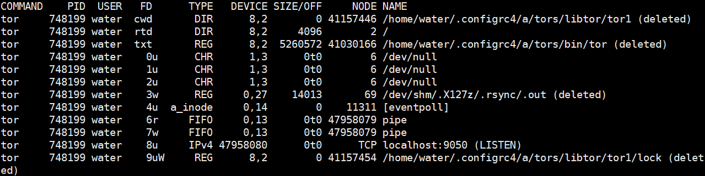
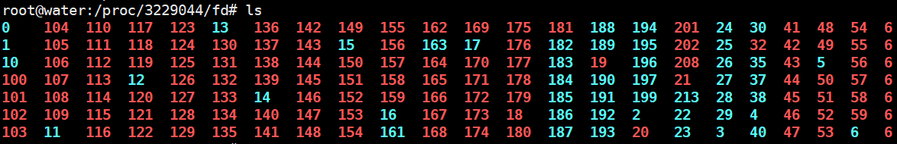
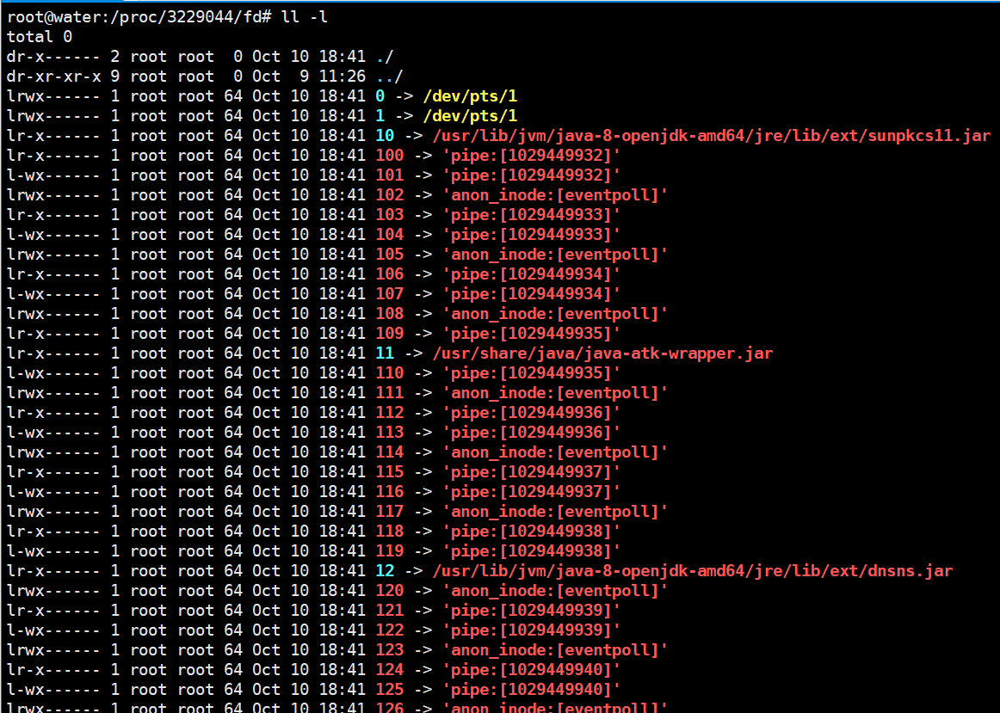
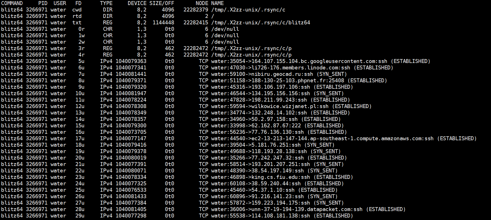
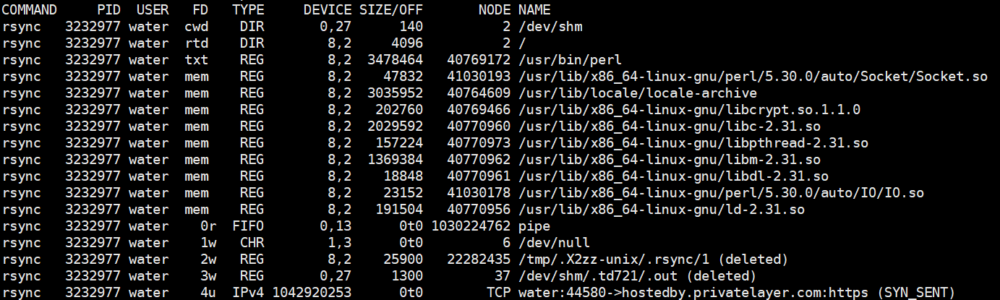
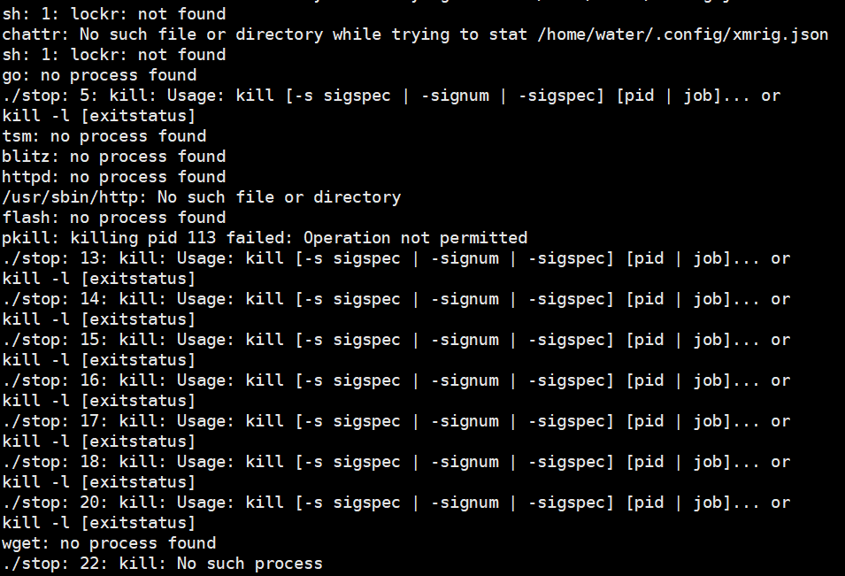

一直以来，我都十分推崇把看到的理论知识与实际相结合。

在今天排查服务器的过程中，顺便扩展的了解了一些东西，现在把他总结成一篇文章记录一下。

1. 每一个进程都有一个文件描述符表(通过`lsof -p 进程号`)，文件描述表是操作系统内核为每个进程维护的数据结构，用于跟踪和管理进程`所打开的文件和其他I/O资源`。

   1. 

   

2. 每个进程在`/proc/`目录下都有一个以该`进程ID`为名的文件夹，存放了处于该进程的相关信息。可以通过`/proc/进程id/fd`找到该进程对应所有的文件描述符。在`fd`目录下中，每个文件描述符对应一个符号链接，每一个符号链接指向该进程打开的文件、套接字、管道。个人觉得在文件系统中他的呈现就是一个符号链接，可以通过该符号链接获取进程打开的文件或`I/O`资源的相关信息。

   1. 
   2. 

   > 引申一下：`/proc/` 目录下存放了关于正在运行的进程和系统状态的虚拟文件系统
   >
   > 1. 包括进程、CPU信息、内存、文件系统、网络、内核等信息

3. FD具体有哪些类型？
   1. 
   
   2. 上图是我在服务器上查到的病毒程序，为了彻底把他干掉，同时满足自己的好奇心，我没有直接把干掉。用`lsof`查看该进程和哪些文件有关，加深对FD的理解。
   
       > **FD常见的类型如下，我按照在lsof中的输出是否为整数来进行分类：**
       >
       > 1. 不为整数
       >
       >    - `cwd`：当前进程的工作目录，表示当前进程的工作目录。它是进程执行命令时所在的目录。 
       >      - 如上图中的`/tmp/.X2zz-unix/.rsync/c`，知道这个就知道病毒进程的老家在哪了？
       >
       >    - `rtd`：（Root Directory）表示根目录。它是文件系统的最顶层目录。rtd文件描述符指向根目录。
       >      - `txt`（Text File）表示可执行文件或共享库文件。txt文件描述符指向该可执行文件或共享库文件。
       >        - 一般情况下都是指**进程对应的可执行程序本身**，如上图中的`/tmp/.X2zz-unix/.rsync/c/blitz64`
       >
       >    - `mem`（Memory-mapped File）表示内存映射文件。内存映射文件是一种将文件内容映射到进程的虚拟内存空间的机制，允许对文件进行像访问内存一样的操作。mem文件描述符指向内存映射文件。
       >
       > 2. 为整数(从0开始描述)
       >
       >    - `sock`（Socket）：表示套接字文件描述符，用于进程之间的通信。
       >    - `pipe`（Pipe）：表示管道文件描述符，用于进程间的无名管道通信。
       >    - `event`（Event）：表示事件文件描述符，用于异步事件通知。
       >    - `inotify`（Inotify）：表示inotify文件描述符，用于监视文件系统事件。
       >    - `timer`（Timer）：表示定时器文件描述符，用于定时器事件。
       >
       > **补充：**对FD列中的`0r`、`1r`、`2u`进行说明：
       >
       > 1. `0`、`1`、`2`三个文件描述符是每个运行着的进程都会自动打开的，具有固定含义：
       >    1. `0`：代表标准输入，通常是键盘输入。
       >    2. `1`：代表标准输出，通常是屏幕输出。
       >    3. `2`：代表标准错误输出。
       > 2. `r`、`u`、`w`等标识了文件描述符对应文件的打开模式。
       >    1. `r`：表示文件以`r`(表示读取)的状态打开的，获取的是读取访问权限，即进程当前正从该文件读取数据。
       >    2. `u`：表示文件以`u`(表示使用)的状态打开的，获取的是读写访问权限。
       >    3. `w`：表示文件以`w`(表示写入)的状态打开的，获取的是写入访问权限，即进程当前正向该文件写入数据。

4. 读取`FD`描述符对应的文件，这里我以病毒进程为例：

   1. 通过`lsof -p 进程id`找到目标进程打开的文件：

      

   2. 通过`cat < /proc/3232977/fd/2`读取文件内容：

​				3. 发现该病毒程序在执行一些奇怪代码。

**小插曲：**

为什么病毒中有一个压缩包叫`dota3.tar.gz`，是这哥们喜欢玩刀塔嘛？

