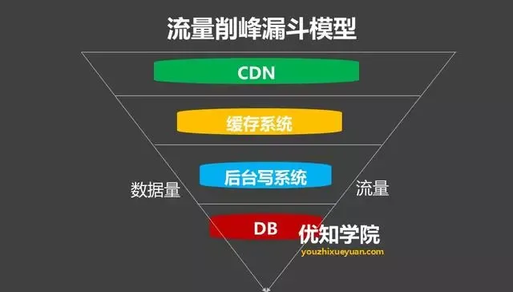

## 流量削峰

当大批用户在某一瞬间同时访问系统时，由于服务器的处理的资源是有限的，所以很容易导致服务器宕机，从而出现用户无法访问的情况。通常多出现在双11或者团购秒杀等场景中。

> 削峰从本质上来说就是更多地延缓用户请求，以及层层过滤用户的访问需求，遵从“最后落地到数据库的请求数要尽量少”的原则。

### 消息队列解决削峰

要对流量进行削峰，最容易想到的解决方案就是`用消息队列来缓冲瞬时流量，把同步的直接调用转换成异步的间接推送，中间通过一个队列在一端承接瞬时的流量洪峰，在另一端平滑地将消息推送出去`。

>  消息队列中间件主要解决应用耦合，异步消息， 流量削锋等问题。

常用消息队列系统：

- 目前在生产环境，使用较多的消息队列有 `ActiveMQ、RabbitMQ、 ZeroMQ、Kafka、MetaMQ、RocketMQ` 等。

### 流量削峰漏斗：层层削峰

针对秒杀场景还有一种方法，就是对请求进行分层过滤，从而过滤掉一些无效的请求。

分层过滤其实就是**采用“漏斗”式设计**来处理请求的

**1）分层过滤的核心思想**

- 通过在不同的层次尽可能地过滤掉无效请求。
- 通过CDN过滤掉大量的图片，静态资源的请求。
- 再通过类似Redis这样的分布式缓存，过滤请求等就是典型的在上游拦截读请求。

**2）分层过滤的基本原则**

- 对写数据进行基于时间的合理分片，过滤掉过期的失效请求。
- 对写请求做限流保护，将超出系统承载能力的请求过滤掉。
- 涉及到的读数据不做强一致性校验，减少因为一致性校验产生瓶颈的问题。
- 对写数据进行强一致性校验，只保留最后有效的数据。

### 总结

1.对于秒杀这样的高并发场景业务，最基本的原则就是将请求拦截在系统上游，降低下游压力。如果不在前端拦截很可能造成数据库(mysql、oracle等)读写锁冲突，甚至导致死锁，最终还有可能出现雪崩等场景。

2.划分好动静资源，静态资源使用CDN进行服务分发。

3.充分利用缓存(redis等)：增加QPS，从而加大整个集群的吞吐量。

4.高峰值流量是压垮系统很重要的原因，所以需要Kafka等消息队列在一端承接瞬时的流量洪峰，在另一端平滑地将消息推送出去。